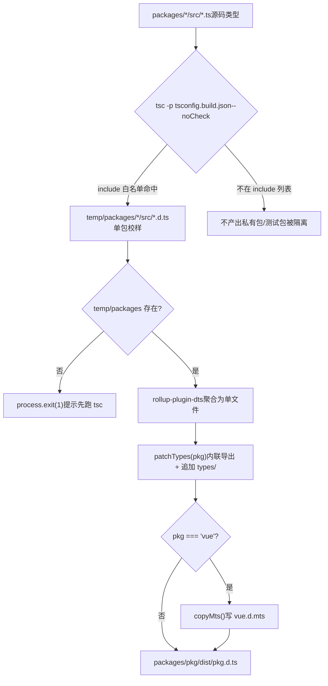
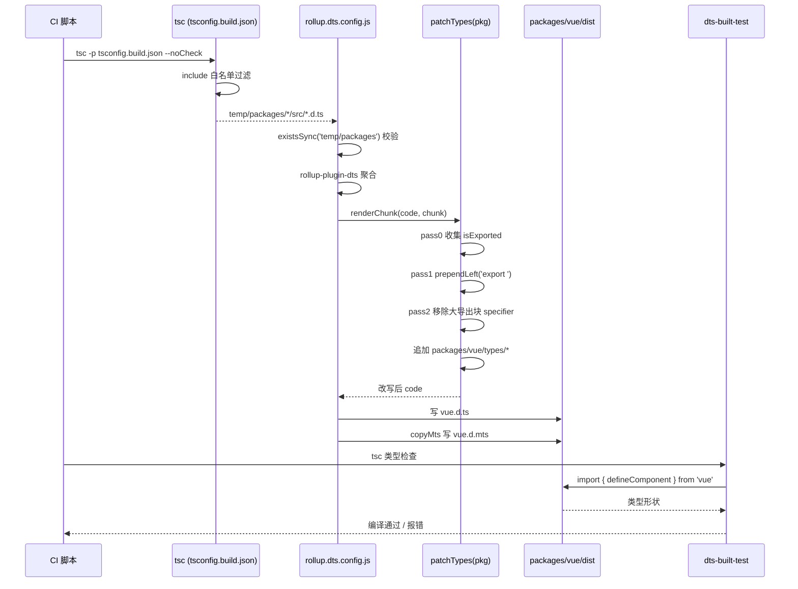

# 第 5 章：型生成物パイプライン：ソースコード .d.ts からリリース級型パッケージへ

前の章では`inline-enums.js`と`verify-treeshaking.js`を分解した：一方は enum 参照をリテラルに置換し、列挙型オブジェクトを揺り落とせるようにし、もう一方はビルド後に文字列センチネルで3種類の既知の漏洩が回帰していないことを確認する。両者は共に Vue のランタイムサイズの約束を守っている。しかしビルド生成物は JS だけではない。ユーザーが`import { ref } from 'vue'`するとき、エディタが表示する型ヒント、`tsc`によるユーザーコードの型チェックは、すべて別の種類の生成物——`.d.ts`宣言ファイルに依存している。JS 生成物が間違っていれば実行時にエラーが出る；型生成物が間違っていれば、ユーザー側のコンパイル期にエラーが出るか、さらに悪い場合は：型が静かにドリフトし、ユーザーコードはコンパイルを通るが、型形状が実際のランタイム動作と一致しない。本章では Vue が各サブパッケージ`src`に散在するソースコード型をリリース級の型パッケージに集約し、`dts-built-test`で実際のビルド生成物に対して型スモークテストを行う方法を追跡する。

# 5.1 二段階型パイプライン：tsc が出料し、rollup が集約

## 直感モデル

印刷パイプラインを想像しよう：第一段階では、各サブパッケージがそれぞれ自分の原稿（`.ts`ソースコード）を単ページ校正刷り（`.d.ts`）に組版する；第二段階では、数十枚の校正刷りを目次順に一冊の本（リリース級`.d.ts`）に製本し、ヘッダーとフッター（エクスポート宣言）を統一する。

もしこのパイプラインがなければ、Vue はリリース型ファイルを手動で維持しなければならず、ソースコードが変われば手で同期して修正する必要がある——これは型ドリフトの温床である。Vue のやり方は：**型生成物は完全にソースコードから生成され、決して手書きしない**。

## 第一段階：tsconfig.build.json が出料範囲を画定

`tsconfig.build.json`はこのパイプラインの第一段階の設定である。それはルート`tsconfig.json`を継承し、ビルド関連のオプションのみをカバーする。

[FACT:tsconfig.build.json:3-9]

主要オプションを一つずつ分解：

- `declaration: true`：tsc に各ソースファイルに対応する`.d.ts`。
- `emitDeclarationOnly: true`：**を生成させる。型のみを出力し、JS は出力しない**。JS は Rollup が担当し、tsc はここでは純粋に型抽出器である。
- `stripInternal: true`：`@internal`と注記された宣言はすべて`.d.ts`から除外される。これは Vue が公開 API 表面を制御する第一の関門である——内部実装の詳細は`export`されていても、`@internal`が付けられていればリリース型に漏洩しない。
- `composite: false`：プロジェクト参照（project references）の増分ビルドモードを無効にする。Vue ではここでクロスパッケージ増分は不要であり、無効にすることで`.tsbuildinfo`がもたらす追加状態を避けられる。

`include`リストはどのディレクトリが出料に参加するかを正確に画定する：

[FACT:tsconfig.build.json:10-23]

ここで**は12個のディレクトリのみを列挙している**ことに注意。全体の`packages/`。`packages-private/`、`packages/dts-test/`、`packages/sfc-playground/`などは含まれていない。これは意味する：プライベートパッケージとテストパッケージの型は**決して**リリース成果物に入る。これは物理的な分離である——約束事ではなく、設定によって実現される。

> **[Design Inference & Architectural Trade-offs]**
> なぜブラックリストではなくホワイトリストを使うのか？monorepoでは新しいサブパッケージの追加が常態だからである。もし`exclude`ブラックリストを使うと、新しいプライベートパッケージを追加した際にexcludeへの追加を忘れると、その型が密かにリリース成果物に混入してしまう。ホワイトリストは逆である。新しいパッケージはデフォルトでビルドに参加せず、明示的に追加しなければならない。「安全なデフォルト値」の原則に合致する。

実行`tsc -p tsconfig.build.json --noCheck`後、成果物は`temp/packages/<pkg>/src/*.d.ts`に出力される。注意`--noCheck`：型チェックをスキップし、emitのみを行う。型チェックは別の`tsc --noEmit`が担当し、ビルド段階では重複チェックを行わず、時間を節約する。

## 第二段階：rollup.dts.config.js による集約

第二段階は`rollup.dts.config.js`によって駆動される。そのエントリはまず事前検証を行う：

[FACT:rollup.dts.config.js:15-22]

もし`temp/packages`が存在しなければ、第一段階が実行されていないことを意味し、スクリプトは直接`process.exit(1)`して先に`tsc`を実行するよう促す。これはパイプラインの**順序契約**である：rollup段階はtsc段階の成果物に強く依存し、どちらも欠かせない。

次にすべてのサブパッケージディレクトリを読み取り、`TARGETS`環境変数によるサブセットビルドをサポートする：

[FACT:rollup.dts.config.js:15-22]

`TARGETS`このメカニズムにより、一部のパッケージの型のみを再ビルドでき、開発デバッグ時にフィードバックループを大幅に短縮できる。

核心は`targetPackages.map(...)`が各パッケージにRollup設定を生成することである：

[FACT:rollup.dts.config.js:23-42]

フィールドごとに解説する：

- `input: ./temp/packages/${pkg}/src/index.d.ts`：エントリは第一段階で出力された型ファイルであり、ソースコード`.ts`。
- `output.file: packages/${pkg}/dist/${pkg}.d.ts`ではない：成果物は各パッケージ自身の`dist`ディレクトリに出力され、ファイル名はパッケージ名と一致する（例`vue.d.ts`）。
- `format: 'es'`：型ファイルは統一してES module形式を使用する。
- `plugins: [dts(), patchTypes(pkg), ...(pkg === 'vue' ? [copyMts()] : [])]`：3つのプラグインで、最初の2つはすべてのパッケージに適用され、`copyMts`は`vue`パッケージにのみ適用される。

`onwarn`フックは特筆に値する：

[FACT:rollup.dts.config.js:23-42]

dts rollupの過程で、すべての非相対パスのimportはデフォルトで外部化（externalized）される。これによりRollupが`UNRESOLVED_IMPORT`警告を出す。しかしこれは**期待される動作**である——型ファイル内の`import { X } from 'some-pkg'`は本来外部参照として保持されるべきで、バンドルに含めるべきではない。そのためスクリプトは「非相対パスの未解決インポート」に対して直接`return`警告を握りつぶし、相対パスの未解決インポートのみをデフォルトの`warn`。

> **[Design Inference & Architectural Trade-offs]**
> ここに微妙な点がある：`!warning.exporter?.startsWith('.')`はexporterが`.`で始まるかどうかを判定する。相対パスのインポートが未解決の場合、第一段階の成果物に欠落があることを意味し、真の問題であり、必ず警告を出す必要がある。この区別により警告ノイズを最小限に抑えつつ、真のエラーを見逃さない。

## パイプライン全景

この図は二段階の制御フローを固定する：`tsc`のホワイトリストが誰がパイプラインに入れるかを決定し、`rollup`の`check`が続行可能かを決定し、`patchTypes`は必須の工程であり、`copyMts`は`vue`パッケージ専用の分岐である。

# 5.2 patchTypes：集約成果物をリリース級の形状に書き換える

## 直感的モデル

`rollup-plugin-dts`が数十個の`.d.ts`を1つのファイルにマージした後、出力される形状は「まず大量の型を宣言し、最後に巨大な`export { A, B, C, ... }`で統一的にエクスポートする」というものになる。これは人間が読むには優しくなく、一部のツールチェーン（例えばVitePressの`defineComponent`呼び出し）では「推論された型を参照なしで命名できない」というエラーを引き起こす。

`patchTypes`はこの**後処理整形工程**である：「集中エクスポート」を「インラインエクスポート」に変更し、さらにパッケージ専用の型拡張を追加する。

## データ構造：2つのSetと3回の走査

`patchTypes`はRollupプラグインを返し、核心ロジックは`renderChunk`フック内にある。2つの集合を維持する：

[FACT:rollup.dts.config.js:87-88]

- `isExported`：すべての**元々エクスポートされていた**型名を記録する（`export { ... }`宣言から）。
- `shouldRemoveExport`：すべての**大きなエクスポートブロックから削除する必要がある**型名を記録する（すでにインラインエクスポートされているため）。

処理フローは3つのパス（pass 0 / pass 1 / pass 2）に分かれる。これは典型的な「まず収集、次に書き換え、最後にクリーンアップ」パターンである。

## Step-by-Step Walkthrough

**Pass 0：すべてのエクスポート済み型名を収集する。**

[FACT:rollup.dts.config.js:90-100]

ASTのトップレベルノードを走査し、`ExportNamedDeclaration`かつ**sourceを持たない**（つまり`export ... from '...'`の再エクスポートではない）ものについて、そのspecifierのlocal nameを`isExported`。

**に追加する。`export`Pass 1：宣言ノードにその場で**

[FACT:rollup.dts.config.js:102-125]

プレフィックスを追加する。`VariableDeclaration`、`TSTypeAliasDeclaration`、`TSInterfaceDeclaration`、`TSDeclareFunction`、`TSEnumDeclaration`、`ClassDeclaration`トップレベルノードを走査し、`processDeclaration`。

`processDeclaration`の6種類の宣言に対して

[FACT:rollup.dts.config.js:70-85]

のロジックを呼び出す：

3ステップ：`id`1.

がなければ直接返す（匿名宣言など）。`_`2. 名前が**で始まる場合はスキップ——これは**約束事

である：アンダースコアプレフィックスの型は内部補助型であり、エクスポートしない。`shouldRemoveExport`3. 名前を`isExported`に追加する；その名前が`prependLeft`にある場合（つまり元々エクスポートされていた場合）、宣言の開始位置に`export `文字列を

する。`VariableDeclaration`注意

[FACT:rollup.dts.config.js:104-115]

分岐には追加のアサーションがある：`declare const`もし1つの`declare const a, b`が複数のdeclaratorを宣言している場合（例`processDeclaration`）、直接エラーを投げる。なぜなら`declarations[0]`は**のみを処理し、複数のdeclaratorは処理漏れを引き起こすからである。ここでは**高速失敗

**を選択し、静かなエラーにはしない。これは防御的プログラミングの表れである。**

[FACT:rollup.dts.config.js:127-171]

Pass 2：大きなエクスポートブロックからインライン化された型を削除する。`ExportNamedDeclaration`を走査し、各specifierについて：

- そのlocal nameが`shouldRemoveExport`にあり、かつ`exported === local`（`export { Foo as Bar }`のリネームケースを除外）の場合、そのspecifierを削除する。
- 削除時はMagicStringで正確に削除する：後ろにまだspecifierがあれば、次のspecifierのstartまで削除；最後のものであれば、前のもののendまたは自身のstartまで削除する。
- もしエクスポートブロック全体のすべてのspecifierが削除された場合、`ExportNamedDeclaration`ノード全体を削除する。

**仕上げ：パッケージ専用の型を追加する。**

[FACT:rollup.dts.config.js:172-183]

`code = s.toString()`は書き換え後のコードを取得した後、`packages/${pkg}/types`ディレクトリが存在するか確認する。存在する場合、ディレクトリ下のすべてのファイル内容を読み取り、改行で連結してコードの末尾に追加する。

> **[Design Inference & Architectural Trade-offs]**
> この`types/`ディレクトリは**手動で維持される型拡張の**エントリポイントであり、ソースコードから自動生成できない型（JSX グローバル拡張、マクロ型宣言など）を配置するためのものです。自動生成された型と同じファイル内でマージされますが、ソースは明確に分離されています——自動生成が上、手動拡張が下です。

## なぜインラインエクスポートが必須なのか？

コメントに直接的な理由が示されています：

[FACT:rollup.dts.config.js:45-51]

原文によると：すべての型をインラインエクスポートに変更し、大きなエクスポートブロックから削除しないと、VitePress の`defineComponent`呼び出しで「the inferred type cannot be named without a reference」が報告されます。

> **[Design Inference & Architectural Trade-offs]**
> このエラーの本質は：TypeScript が型を生成する際、ある型が「別のモジュールのエクスポートを参照する」ことでのみ命名可能であり、その参照が消費側で可視でない場合にエラーが発生します。集中エクスポートブロックは型名と宣言位置を分離し、この問題を悪化させます。インラインエクスポートは各型を宣言位置で可視にし、この間接層を排除します。

## copyMts：Node ESM/CJS デュアルモードに型を提供

`copyMts`プラグインは`vue`パッケージにのみ適用されます：

[FACT:rollup.dts.config.js:196-204]

それは`writeBundle`フック内で、`vue.d.ts`の内容をそのまま`vue.d.mts`。

に書き込みます。コメントに理由が説明されています：

[FACT:rollup.dts.config.js:188-192]

TypeScript 4.7 の`package.json`exports 仕様によると、Node ESM と CJS の両方に正しく型を提供するには、**2 つの独立した宣言ファイルが必要です**。そのためビルド時に`vue.d.ts`を`vue.d.mts`。

> **[Design Inference & Architectural Trade-offs]**
> 〔設計推論とアーキテクチャのトレードオフ〕`package.json`なぜ再生成ではなくコピーなのか？ESM と CJS の型形状は完全に同一であり、違いはファイル拡張子と`exports`の

# マッピングのみです。コピーは最も低コストな手段であり、rollup を再度実行することを避けます。

## 5.3 dts-built-test：実際の成果物で型スモークテストを実施

直感的モデル`patchTypes`前の 2 節で型成果物が生成でき、形状が正しいことを保証しました。しかし「生成できる」は「正しく生成されている」と等しくありません。もし`import`のいずれかの走査にバグがあり、あるエクスポートを誤って削除した場合、成果物は依然として生成できますが、ユーザーが

`dts-built-test`する際に型の欠落に気づきます。**はまさに**実際のビルド成果物で実行される型スモークテスト`import`です：ソースコードの型をテストするのではなく、`vue`公開済みの

## パッケージを消費し、重要な型形状にリグレッションがないことを検証します。

データ構造：最小化された型アサーション

[FACT:packages-private/dts-built-test/src/index.ts:3-6]

テストパッケージ全体の核心は 1 つのファイルのみです：

- 行ごとの解説：`vue`L1：`defineComponent`から**をインポートします。ここでインポートされるのは**パッケージ名`packages/vue/dist/vue.d.ts`であり、相対パスではありません——それは
- という実際の成果物を消費します。`_CustomPropsNotErased`L3-6：コンポーネント
- を定義し、空の props と空の setup を持ちます。`// #8376`L8：コメント
- で、特定の issue を指します。`CustomPropsNotErased`L9-12：`_CustomPropsNotErased`をエクスポートし、型は`{ foo: string }`と

の交差型です。**`defineComponent`このテストが検証するのは：`{ foo: string }`の戻り値型が`foo`と交差した後、**。

> **[Design Inference & Architectural Trade-offs]**
> 〔設計推論とアーキテクチャのトレードオフ〕`defineComponent`issue #8376 の背景推測：

## の戻り値型が何らかの条件型やマップ型処理を経て、交差型内の追加プロパティが「消去」される可能性があります。このテストは最小再現でこの動作を固定し、リグレッションが発生すると型チェック段階でエラーが報告されます。

[FACT:packages-private/dts-built-test/package.json:1-11]

パッケージ設定：workspace 依存が実際の成果物を指す

- `private: true`重要なフィールド：
- `types: dist/index.d.ts`：npm に公開しない。
- `dependencies`：型エントリがビルド成果物を指す。`workspace:*`内の 3 つの`@vue/shared`、`@vue/reactivity`、`vue`。

> **[Design Inference & Architectural Trade-offs]**
> 〔設計推論とアーキテクチャのトレードオフ〕`@vue/shared`なぜ`@vue/reactivity`と`vue`に依存するのか？`types`の型がこれら 2 つのパッケージの型を参照する可能性があるためです。workspace モードでは、pnpm はこれらの依存をローカルパッケージにシンボリックリンクし、ローカルパッケージの`dist`フィールドはそれぞれの**下の成果物を指します。これによりテストチェーン全体が**ビルド成果物

## を消費し、ソースコードではありません。

`dts-built-test`テストの実行方法`src/index.ts`自体にはテストスクリプトがなく、その`tsc`がテストケースです。実行方法は：CI で`tsc`を実行し、このパッケージに対して型チェックを行います。型形状がリグレッションすると、

> **[Design Inference & Architectural Trade-offs]**
> 〔設計推論とアーキテクチャのトレードオフ〕**この設計の巧妙さは：「型契約」を**コンパイル可能なコード`tsc`としてエンコードすることにあります。追加のアサーションライブラリは不要で、ランタイムも不要です。

## 自体がテストランナーです。型が正しければコンパイルが通り、型が間違っていればコンパイルが失敗します。

dts-test との役割分担`dts-built-test`本章の`dts-test`と次章の

- `dts-built-test`は別物であることに注意してください：**（本章）：**ビルド成果物
- `dts-test`を消費し、公開レベルの型形状を検証します。**（次章）：**ソースコードの型

> **[Design Inference & Architectural Trade-offs]**
> 〔設計推論とアーキテクチャのトレードオフ〕`patchTypes`なぜ 2 層が必要なのか？ソースコードの型と成果物の型が一致しない可能性があるためです。`stripInternal`の AST 書き換え、`types/`の除去、`dts-built-test`ディレクトリの追加は、ソースコードの型が正しい前提で成果物レベルのバグを導入する可能性があります。

## はこの最後の 1 マイルを専門に守ります。

コピー`patchTypes`このシーケンス図はクロスモジュール協調を固定しています：CI が tsc と Rollup の 2 段階を駆動し、`dts-built-test`の 3 回の走査が核心的な加工であり、

# が最後に成果物を消費して検証します。

## 設計思考、エラー回復、本番での落とし穴

`patchTypes`なぜ文字列置換ではなく MagicString を使うのか？`code.replace(...)`全体を通して

1. **ではなく MagicString で正確な書き換えを行います。理由は 2 つ：**位置が正確`start`/`end`：AST ノードは

2. **オフセットを持ち、MagicString はオフセットに従って操作するため、同名の識別子を誤って傷つけません。**：MagicString はマッピングを生成でき、書き換え後の型ファイルからもソースコードへ遡及できる。型ファイルの sourcemap の用途は限定的だが、一貫性を保つことは良い実践である。

## 早期失敗 vs 静かな寛容

`patchTypes`を複数箇所で使用`assert`：

[FACT:rollup.dts.config.js:74-74]

[FACT:rollup.dts.config.js:107-108]

[FACT:rollup.dts.config.js:147-148]

これらのアサーションは予期しない AST 形状に遭遇すると即座にエラーを投げる。対比として`onwarn`内での`UNRESOLVED_IMPORT`の静かな飲み込み——**予期内のノイズは飲み込み、予期外の形状は早期失敗**。これがビルドスクリプトの正しい姿勢である：ビルドを失敗させる方が、形状の誤った型ファイルを出力するよりもましである。

## 本番での落とし穴：`_`プレフィックス規約

`processDeclaration`をスキップ`_`で始まる型：

[FACT:rollup.dts.config.js:76-78]

これはソースコード内で`_`で始まるエクスポート型は、インラインエクスポートされないことを意味する。ある型が本来公開されるべきなのに、命名が`_`で始まるためにスキップされると、ユーザー側で「型が存在しない」というエラーに遭遇する。

> **[Design Inference & Architectural Trade-offs]**
> このような問題を調査する思路：まず成果物`vue.d.ts`内でその型がまだ大きなエクスポートブロックにあるか確認し、次にソースコード内でその型名が`_`で始まるか確認する。これは命名規約とツール動作の暗黙的な結合であり、落とし穴に陥りやすい。

## 本番での落とし穴：複数 declarator のアサーション

[FACT:rollup.dts.config.js:106-115]

ある`.d.ts`内に`declare const a, b`が出現すると、ビルドは直接エラーを投げる。これは手書きの型では稀だが、あるツールが生成した型ファイルがこの形式を使っているとトリガーされる。エラーメッセージには問題のあるコードスニペットが出力され、特定が容易になる。

# 本章のまとめ

本章では Vue 型成果物の完全なパイプラインを追跡した：

1. **第一段階（tsc）**：`tsconfig.build.json`で`include`ホワイトリストを正確に用いて出力範囲を画定し、`emitDeclarationOnly`型のみを出力し、`stripInternal`内部宣言を除去する。成果物は`temp/packages/`。

2. **第二段階（rollup）**：`rollup.dts.config.js`で`rollup-plugin-dts`各パッケージの型を集約し、`patchTypes`三回の AST 走査を通じて集中エクスポートをインラインエクスポートに書き換え、さらに`types/`ディレクトリの手動拡張を追加する。`copyMts`を`vue`パッケージに追加生成`.d.mts`。

3. **検証段階（dts-built-test）**：実際のビルド成果物上で型スモークテストを行い、コンパイル可能なコードで重要な型形状を固定し、型ドリフトを防ぐ。

# 本章の考察とセルフチェック

Q1: もし`tsconfig.build.json`の`include`ホワイトリストを`["packages"]`（つまり packages ディレクトリ全体を含む）に変更したら、何が起こるか？どのようなシナリオで公開型の汚染が発生するか？

**参考解析**：

`include`を 12 の正確なディレクトリから`["packages"]`に変更すると、すべてのサブパッケージ（`packages-private`以外のすべての`packages/*`）が tsc 出力に参加する。[FACT:tsconfig.build.json:10-23]

結果の連鎖：

1. `temp/packages/`下に多くのパッケージの`.d.ts`。

2. `rollup.dts.config.js`の`readdirSync('temp/packages')`がこれらの余分なパッケージを読み取る。[FACT:rollup.dts.config.js:15-22]

3. `targetPackages`はデフォルトで全パッケージに等しいため、各パッケージに対して`packages/<pkg>/dist/<pkg>.d.ts`。[FACT:rollup.dts.config.js:15-22]

汚染シナリオ：もしあるパッケージが本来公開されるべきでない場合（例：内部ツールパッケージ）、その型成果物が`dist`下に出現する。もしそのパッケージの`package.json`に`private: true`がなければ、公開スクリプトがそれを npm に一緒に公開し、内部型が漏洩する可能性がある。

これこそがホワイトリスト設計の価値である：新しいパッケージはデフォルトで参加せず、明示的に追加する必要があり、安全なデフォルト値に適合する。

Q2: `patchTypes`の pass 1 では、`processDeclaration`が`_`で始まる型を直接`return`。もしある公開 API の型が偶然`_`で始まる場合（例：`_InternalType`が誤ってエクスポートされた場合）、ユーザー側ではどのような現象が見られるか？どのように調査するか？

**参考解析**：

`processDeclaration`が`_`で始まるものに遭遇すると直接返し、`shouldRemoveExport`に追加もせず、prepend も`export `。[FACT:rollup.dts.config.js:76-78]

結果：

1. その型はインライン`export`。

2. それは大きなエクスポートブロックからも削除されない（`shouldRemoveExport`にないため）。

3. したがってそれは**まだ大きなエクスポートブロック内にあり**、理論上はまだインポート可能である。

しかし問題は：大きなエクスポートブロック内の`export { _InternalType }`が宣言位置を参照していることである。もしその宣言が何らかの理由（例：`stripInternal`）で除去されると、エクスポートブロックは存在しない名前を参照し、`tsc`エラーを引き起こす。

調査の思路：

1. 成果物`vue.d.ts`内でその型が宣言位置に`export`がなく、かつ大きなエクスポートブロック内で参照されているか確認する。

2. ソースコード内でその型名が`_`で始まるか確認する。

3. 命名問題と確認できれば、アンダースコアプレフィックスを除去するようリネームする。

これは命名規約とツール動作の暗黙的な結合を露呈する：`_`プレフィックスの本来の意図は「内部」だが、ツールはそれを「非エクスポート」と解釈し、両者のセマンティクスは完全には一致しない。

Q3: `dts-built-test`の`src/index.ts`が交差型`typeof _CustomPropsNotErased & { foo: string }`で`foo`が消去されないことを検証する。もし交差型を`Omit<typeof _CustomPropsNotErased, never> & { foo: string }`に変更したら、テストはまだ #8376 のリグレッションを捕捉できるか？なぜか？

**参考解析**：

`Omit<T, never>`は新しいマップ型を作成し、それは**再計算**T のすべてのプロパティを。もし #8376 のバグが「交差型内の追加プロパティが消去される」であれば：

- 元の書き方`T & { foo: string }`：直接交差、`foo`は交差型の一部であり、もし`defineComponent`の戻り値型処理ロジックが交差内の追加プロパティを消去すると、`foo`は失われる。
- `Omit`書き方：`Omit`はまず`T`をマップし、次に`{ foo: string }`と交差する。`Omit`のマッピング過程が型構造を変更し、バグのトリガー条件が成立しなくなる可能性がある——たとえバグが存在しても、テストは通過するかもしれない。

[FACT:packages-private/dts-built-test/src/index.ts:9-12]

したがってテストケースの**最小性**が極めて重要である：それはバグのトリガーパスを正確に再現しなければならない。いかなる余分な型変換（例：`Omit`、`Pick`）もバグを隠す可能性がある。これがテストで最も素朴な交差型を使い、より「エレガント」な書き方を使わない理由である。

> **[Design Inference & Architectural Trade-offs]**
> 改善方向：複数の書き方を同時に保持し、異なる型変換パスをカバーし、リグレッション捕捉率を高めることができる。ただしメンテナンスコストが増加し、トレードオフが必要である。

型パイプラインは「ソースコードから公開レベルの型をどのように生成するか」を解決し、`dts-built-test`は「成果物の型形状をどのように検証するか」を解決した。しかし型契約は「形状が正しいかどうか」にとどまらず、「API 表面が期待に合致するか」——どの型をエクスポートすべきか、すべきでないか、ジェネリック制約が正確か——も含む。次章では`dts-test`、Vueが型契約テストで公開API表面をどのように守っているかを見ていきます。

三者は「生成 → 整形 → 検証」の閉ループを構成し、ソースコードの型と公開型が厳密に一致することを保証します。しかし、型パッケージ自体が正しいことは、公開APIの型形状がロックされていることと同じではありません。次の章では深く掘り下げます`packages-private/dts-test`、20余りの`.test-d.ts`ファイルがどのように`expectType`などのツールを使って、「型即API契約」を回帰可能な自動テストに変えているかを見ていきます。
