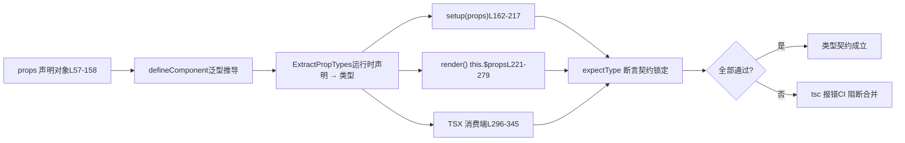

# 第 6 章：型契約テスト：dts-testがAPI表面をどのように守るか

前の章では型宣言の生成チェーンを追跡し、Vueがビルド設定とスモークテストを通じて「ソースコードの型」と「公開型」の厳密な一致をどのように保証しているかを見ました。しかし型契約は「形状が正しいかどうか」にとどまらず、より重要なのは「API表面が期待通りかどうか」です——どの型をエクスポートすべきか、すべきでないか、ジェネリック制約が正確かどうか。本章では`packages-private/dts-test`に入り、Vueが20余りの`.test-d.ts`ファイルで「型即API契約」を回帰可能な自動テストとしてどのように実現しているかを見ていきます。

# 型契約テストの認知モデル：「説明書」を「実行可能な契約」に変える

`dts-test`ディレクトリ内のファイルには直感に反する特徴があります：それらは**ほとんどいかなるランタイム動作も生成しません**。開いてみると`defineComponent.test-d.tsx`、大量の`defineComponent({...})`呼び出しが見られますが、テスト実行時に実際に実行されることはありません——これらのファイルは`tsc`/`vue-tsc`による型チェックのみを受け、`noEmit: true`いかなるJSも出力しないことを保証します。

[FACT:packages-private/dts-test/tsconfig.test.json:1-11]

この設定は契約体系全体の「実行環境」です：`noEmit`成果物出力をオフにし、`jsx: preserve`TSX構文を型システムの解析に残し、`strict`すべての厳格チェックをオンにし、`moduleResolution: bundler`現代のバンドルセマンティクスにマッチし、`lib`同時に`esnext`と`dom`。**を導入します。この設定がなければ、`.test-d.tsx`内のJSXはランタイムJSXとして処理され、型アサーションは意味を失います**。

> **[Design Inference & Architectural Trade-offs]**
> 型テストを独立した`packages-private`サブパッケージにし、`packages/vue`の`__tests__`に詰め込まない動機は三つあります：第一に、型テストの依存は`vue`の**公開レベル型**（`vue/jsx`、`vue`の`.d.ts`であり、ソースコード内部モジュールではないため、物理的分離により公開エントリを強制できます；第二に、`tsc`の型テストチェックはランタイム単体テストよりはるかに時間がかかるため、独立ディレクトリでCIを個別にスケジュールしやすくなります；第三に、`.test-d.tsx`ファイルがVitestのランタイムコレクタに誤って実行されません。

生活のアナロジー：通常の単体テストは「機械に通電して煙が出ないか見る」ようなものですが、型契約テストは「契約署名前に条項を一つずつ確認する」ようなものです——実際に取引せず、「甲方が支払うべき金額」が「米ドル」ではなく「人民元」と書かれていることを確認するだけです。契約条項が間違っていれば、機械がどんなに順調に動いても無意味です。

`utils.d.ts`この「契約確認」のすべてのツールを提供します：

[FACT:packages-private/dts-test/utils.d.ts:7-21]

重要なツールは四つだけです：`expectType<T>(value: T)``value`の型が正確に`T`；`expectAssignable<T, T2 extends T>`であることをアサート`T2``T`；`IsUnion<T>`が`T`に代入可能であることをアサート`IsAny<T>``T`がユニオン型かどうかを判定；`any``import 'vue/jsx'`が`<MyComponent />`かどうかを判定。L5の`JSX.Element`。

[FACT:packages-private/dts-test/utils.d.ts:7-21]

`IsUnion`に注意——グローバルJSX名前空間を登録し、TSX内の`T extends any ? (U extends T ? false : true) : never`が型システムに`T`として認識されるようにします。`extends false`の実装は詳しく見る価値があります：`false`分散条件型を利用し、**がユニオン型であれば、各メンバーが独立に評価され、最終的に**すべての分岐が`props.jjj`を返すかどうかを判定します。これは

# 型レベルでの存在証明`defineComponent`です——「

`defineComponent.test-d.tsx`が単一シグネチャにマージされずユニオン型でなければならない」といった契約をロックするために使われます。**シナリオ駆動ウォークスルー：`defineComponent({ props: {...}, setup(props) {...} })`のprops型推論全チェーン`props``setup`は2260行あり、契約体系の中核です。具体的なシナリオを代入してみましょう：`props`ユーザーが**と書き、Vueの型システムは

## ランタイム宣言から

内の`ExpectedProps`パラメータの正確な型を推論する必要があります**。このチェーンはVue型システムで最も複雑な部分です。**：

[FACT:packages-private/dts-test/defineComponent.test-d.tsx:21-53]

第一步：「期待型」を契約基準として構築`a?: number | undefined`テストファイルはまず`undefined`）、`aa: number`インターフェースを定義し、各props宣言方式が推論すべき型を`aaa: number | null`（`PropType<number | null>`明示的にハードコードします`aaaa: number | undefined`（`required: true as const`このインターフェースは「契約条項」の書面版です。いくつかの微妙な型に注意：`undefined`（オプショナルpropsに`props`（defaultがあるので非オプショナル）、

## 明示的宣言）、`defineComponent`

[FACT:packages-private/dts-test/defineComponent.test-d.tsx:57-158]

だが型に`props`を含む）。これらの差異は随意に書かれたものではなく、それぞれが**宣言内の特定の分岐に対応します。**第二步：様々な宣言方式で

- `a: Number`に「食わせる」`number | undefined`
- `aa: { type: Number as PropType<number | undefined>, default: 1 }`この`number`
- `aaaa: { type: Number, required: true as const }` —— `as const`オブジェクトは`true`宣言方式の網羅的マトリクス`boolean`であり、Vue propsのすべての書き方をカバーします：
- `b: { type: String, required: true as true }` —— `required: true`—— コンストラクタ省略記法、
- `bb: { default: 'hello' }`として推論`type`—— defaultがあり、非オプショナル
- `cc: Array as PropType<string[]>`として推論
- `l: [Date]``Date | undefined`
- `ll: [Date, Number]`が`Date | number | undefined`
- `lll: [String, Number]`に拡張されるのを防ぎ、リテラル型を保持

> **[Design Inference & Architectural Trade-offs]**
> `required: true as const`でプロパティを非voidに`required: true as true`——`as true`なし、`as const`のみで型を推論**—— 明示的型変換**。

## —— 配列構文、`setup` / `render` / `this`として推論

—— 複数型配列、**として推論**。

[FACT:packages-private/dts-test/defineComponent.test-d.tsx:160-217]

`setup(props)`—— 同上`expectType<ExpectedProps['x']>(props.x)`〔設計推論とアーキテクチャのトレードオフ〕

[FACT:packages-private/dts-test/defineComponent.test-d.tsx:168-170]

`// @ts-expect-error should included 'undefined'`と組み合わせて`expectType<number>(props.aaaa)`——**意図的にエラーを出すアサーションを書き、`@ts-expect-error`でエラーを飲み込む**。これにより`props.aaaa`の型が**ではないことが検証される** `number`（そうでなければこの行はエラーにならず、`@ts-expect-error`むしろ「飲み込むエラーがない」ために失敗する）。これは型テストの「逆アサーション」テクニックである。

[FACT:packages-private/dts-test/defineComponent.test-d.tsx:204-205]

`// @ts-expect-error props should be readonly`と組み合わせて`props.a = 1`——propsが`setup`内で読み取り専用であることを検証する。もしリファクタリングで誤ってpropsが可変になると、この行はエラーにならなくなり、`@ts-expect-error`が失敗する。

`render()`内では`this.$props`と`this.x`の2つのパスでアサーションする：

[FACT:packages-private/dts-test/defineComponent.test-d.tsx:221-279]

L252-276は「宣言されたpropsも`this`に公開される必要がある」ことを検証し、L278-279は`this.a = 1`がエラーになること（`this`上のpropsも読み取り専用）を検証する。L281-287はsetup戻り値のアンラップを検証する：`this.c`は`number`（`ref(1)`がアンラップされ）、`this.d.e.value`は`string`（ネストされたrefは`.value`）、`this.f.g`を保持し、`GT`（`reactive`は

## 内のbranded型がアンラップされない）。

第四步：TSX消費側の型チェック`<MyComponent />`型契約の最後の環は「ユーザーがこのコンポーネントをどう使うか」である。TSX内の

[FACT:packages-private/dts-test/defineComponent.test-d.tsx:296-322]

のpropsチェックは独立した型パスである：`<MyComponent>`ここでは`class`/`style`/`key`/`ref`/`ref_for`が宣言されたすべてのpropsを受け入れること、および**これらの組み込み属性を検証する。次に**：

[FACT:packages-private/dts-test/defineComponent.test-d.tsx:337-345]

`// @ts-expect-error missing required props`逆検証`wrong prop types`必須propsの欠落がエラーになることを検証し；`ggg="baz"`型の不一致がエラーになることを検証し；L342は`ggg`がエラーになることを検証する（`'foo' | 'bar'`）。

は



チェーン全体は1つのデータフロー図で要約できる：**コピー`props`この図の鍵は：**同じ`tsc`宣言が、3つの消費位置の型期待を同時に満たさなければならない

# 。どこか一箇所でも推論のずれがあれば`__typeProps`、`__typeEmits`がエラーになる。

`defineComponent`境界とバックドア：**と条件型契約**の型推論には根本的な制限がある：`color='white'`実行時のprops宣言では「条件型」を表現できない`appearance`。例えば「`'outline'`のとき`__typeProps`は

## `__typeProps`でなければならない」という制約は、実行時のオブジェクト構文では書けない。Vueはこのために

[FACT:packages-private/dts-test/defineComponent.test-d.tsx:1803-1836]

`ConditionalProps`などの「型バックドア」を提供している。`color`：条件付きpropsの型エスケープハッチ`appearance`はユニオン型である：要么`color: 'white'`と`appearance: 'outline'`が両方オプショナルか、

- L1823-1824：`<Comp color="white" />`かつ`color: 'white'`。テストで検証：
- L1825-1826：`<Comp color="white" appearance="normal" />`がエラー——単独で`appearance`を与えてもどちらのブランチも満たさない`'outline'`
- L1827：`<Comp color="white" appearance="outline" />`がエラー——

> **[Design Inference & Architectural Trade-offs]**
> `__typeProps`でなければならない

## `__typeEmits`が通過

`__typeEmits`〔設計推論とアーキテクチャトレードオフ〕**の設計動機は「型システムに実行時では表現できない制約を表現させる」ことである。実行時のprops解決には関与せず、純粋に型レベルのカバレッジである。代償はユーザーが型と実行時宣言の一貫性を手動で維持する必要があること——これが「backdoor」と呼ばれ正式APIではない理由である。**：

[FACT:packages-private/dts-test/defineComponent.test-d.tsx:1838-1885]

：2つのemits構文の等価性`{ change: [id: number], update: [value: string] }`は2つの構文をサポートし、テスト`this.$props.onChange?.(123)`は両方を同時にロックする`onChange?.('123')`オブジェクト構文

[FACT:packages-private/dts-test/defineComponent.test-d.tsx:1887-1934]

は名前付きタプルで引数を表現する。テストで`{ (e: 'change', id: number): void; (e: 'update', value: string): void }`が通過、**がエラーになることを検証。**呼び出しシグネチャ構文**はオーバーロードで表現する。**2つの構文のテスト本体はほぼ行単位で同一

> **[Design Inference & Architectural Trade-offs]**
> 完全に等価`defineEmits`な型動作を生むことを要求する。

## `__typeRefs`〔設計推論とアーキテクチャトレードオフ〕`__typeEl`なぜ2つの構文を保持するのか？オブジェクト構文は

[FACT:packages-private/dts-test/defineComponent.test-d.tsx:1936-1952]

`__typeRefs`の書き方に近く、呼び出しシグネチャ構文は従来のTSイベント型に近い。Vueは両方をサポートし、動作の一貫性を保証する必要がある。テストの「行単位ミラー」構造が最強の等価性証明である。`Parent`と`__typeRefs: { child: ComponentInstance<typeof Child> }`：コンポーネント間参照とホストノード型`refs.child.$refs.foo`により親コンポーネントが子コンポーネントrefの型を正確に知ることができる。`number`。

[FACT:packages-private/dts-test/defineComponent.test-d.tsx:1963-1977]

`__typeEl`が**を宣言し、それにより`Element`**が`TypeEl`と推論できる`Element`はさらに微妙である。L1963-1977のテストコメントが設計意図を明示している：`CustomElement`カスタムレンダラー（TUI、canvas、native）のホストノードはDOM`$el`ではないため、

> **[Design Inference & Architectural Trade-offs]**
> に制約できない。テストは`TypeEl`インターフェースで`Element`，`@vue/runtime-test`が任意のホスト型を受け入れられることを検証する。`$el`〔設計推論とアーキテクチャトレードオフ〕

## これはVue 3がカスタムレンダラーをサポートするための型レベル保証である。もし

`function syntax w/ runtime props`が**にハード制約されると、非DOMレンダラーのユーザーは**。

[FACT:packages-private/dts-test/defineComponent.test-d.tsx:1501-1545]

型を正しく推論できなくなる。契約テストがここで守るのは「レンダラー非依存性」である。`generics aren't supported with object runtime props`ジェネリックコンポーネントと実行時propsの相互排他制約`<Comp3<string>>`のセクションは重要なルールをロックする：

> **[Design Inference & Architectural Trade-offs]**
> L1501のコメント`ExtractPropTypes`は契約宣言である。L1525-1535はジェネリックsetup + オブジェクトpropsがエラーになることを検証；L1538-1539は

# がエラーになることを検証。一方、配列propsはジェネリックを許可する（L1464-1499）。

## `@ts-expect-error`〔設計推論とアーキテクチャトレードオフ〕

`@ts-expect-error`この制約の根本原因は型推論の順序である：オブジェクトpropsは**が先に型を確定する必要があり、ジェネリックはインスタンス化時にしか確定できないため、両者が衝突する。配列propsは型抽出に関与しないため衝突しない。契約テストはこの「型システムの制限」を回帰可能なアサーションとして固定化する。`@ts-expect-error`設計思考、エラー回復、本番の落とし穴**の諸刃の剣

[FACT:packages-private/dts-test/defineComponent.test-d.tsx:1354-1362]

は型契約テストの核心ツールだが、致命的な罠がある：`// @ts-expect-error missing prop`その下のコードがエラーにならなくなると、`<Comp msg={123} />`自体がエラーになる**。これは保護に見えて、実際にはテスト作者が「エラーが発生する位置」を正確に制御することを要求する。**このコードを見てほしい：`expectType<JSX.Element>(...)`は`@ts-expect-error`の`expectType`の前の行に置かれている

> **[Design Inference & Architectural Trade-offs]**
> で包まれている。もし`@ts-expect-error`の位置が1行ずれるか、エラーが実際に**呼び出しで発生しJSX上でない場合、テストは失敗する。`@ts-expect-error`〔設計推論とアーキテクチャトレードオフ〕**本番の落とし穴：TypeScriptのバージョンアップでエラー位置が微妙に変わると、大量の

## `IsAny`と`IsUnion`：型レベルでの「存在証明」

[FACT:packages-private/dts-test/defineComponent.test-d.tsx:1991-1993]

`expectType<IsAny<typeof props.foo>>(false)`検証`props.foo`ではない`any`。これは**逆契約**：型が正しいことだけでなく、型が「`any`」。`any`に退化してはならない」ことも要求する。`any`は型システムのブラックホールであり、あらゆる

[FACT:packages-private/dts-test/defineComponent.test-d.tsx:195-196]

`expectType<IsUnion<typeof props.jjj>>(true)`検証`jjj`がユニオン型であることを検証する。`jjj`として宣言され、`((arg1: string) => string) | ((arg1: string, arg2: string) => string)`、型システムがそれを単一のシグネチャに統合すると、`IsUnion`は`false`を返し、テストは失敗する。

> **[Design Inference & Architectural Trade-offs]**
> これら二つのツールが守るのは「型の正確性」であり、「型の正当性」ではない。単一の`any`に退化した型、あるいはユニオンが統合された型は、ほとんどの使用シナリオで「使えるように見える」が、IDEのヒントとコンパイル時のチェックを失う。契約テストはこの正確性を固定しなければならない。

## 宣言順序の暗黙的契約

[FACT:packages-private/dts-test/defineComponent.test-d.tsx:1784-1801]

このコメントは極めて重要である：`code generated by tsc / vue-tsc, make sure this continues to work so we don't accidentally change the args order of DefineComponent`。`DefineComponent`には13個のジェネリックパラメータがあり、順序は**公開契約**——`vue-tsc`生成されるコンポーネント型はこの順序に依存する。テストでは`declare const MyButton: DefineComponent<...>`で13個のパラメータをすべて明示的に記述し、順序を固定する。

> **[Design Inference & Architectural Trade-offs]**
> これは最も見落とされやすい契約である：ジェネリックパラメータの順序は「実装の詳細」ではなく、「生成コードのABI」である。順序を変更するPRは、`vue-tsc`が生成する`.d.ts`をランタイム型と互換性がなくする。契約テストはここで「ABI互換性ガード」の役割を果たす。

## ファイル間契約：`componentInstance.test-d.tsx`の補足

`componentInstance.test-d.tsx`はわずか154行だが、`ComponentInstance`ツール型のすべての入力形態をカバーしている：

[FACT:packages-private/dts-test/componentInstance.test-d.tsx:10-40]

`ComponentInstance<typeof CompSetup>`から`defineComponent`結果のインスタンス型を抽出；`ComponentInstance<typeof CompFunctional>`関数コンポーネントから抽出；`ComponentInstance<typeof CompFunction>`生の関数から抽出。三者すべてが`ComponentPublicInstance`基底クラスを導出しなければならない。

[FACT:packages-private/dts-test/componentInstance.test-d.tsx:71-116]

さらに極端なのは「`defineComponent`でラップされていない生のオブジェクト」である：`CompObjectSetup`、`CompObjectData`、`CompObjectNoProps`三つの形態すべてが`ComponentInstance`によって正しく抽出されなければならない。L113-114は特に直感に反する：`CompObjectNoProps`に`props`宣言がないが、`compObjectNoProps.test`は依然として`string | undefined`と導出される——これは`ComponentPublicInstance`基底クラスが提供するフォールバックである。

[FACT:packages-private/dts-test/componentInstance.test-d.tsx:143-147]

L141の`#12751`テストは一つの境界を固定している：`__typeEmits`で宣言された`'update:visible'`イベントは、インスタンス上で`comp['onUpdate:visible']`（コロン付きの文字列キー）として公開され、かつ`$props`の型は`{ 'onUpdate:visible'?: (value?: boolean) => any }`である。L152-153は`comp['$props']['$props']`がエラーを報告することを検証する——型の再帰的自己参照を防ぐためである。

# 本章のまとめ

`dts-test`ディレクトリは20余りの`.test-d.ts`ファイルを用いて、「型即API契約」を回帰可能な自動テストとして実現している。核心的なメカニズムは三層ある：

1. **ツール層**：`expectType`、`expectAssignable`、`IsUnion`、`IsAny`は型アサーションのプリミティブを提供し、`@ts-expect-error`は逆アサーション能力を提供する。

2. **契約層**：`ExpectedProps`インターフェースは「どのような型が導出されるべきか」を明示的に固定し、`props`宣言マトリクスはすべての記述法を網羅し、三つの消費位置（`setup`/`render`/TSX）でクロス検証する。

3. **バックドア層**：`__typeProps`、`__typeEmits`、`__typeRefs`、`__typeEl`はランタイムで表現できない型制約に脱出ハッチを提供し、同時に二つのemits構文の等価性を固定する。

# 本章の考察とセルフチェック

Q1:`defineComponent.test-d.tsx`L168-170の`@ts-expect-error`を削除し、`expectType<number>(props.aaaa)`のみを残すと何が起こるか？なぜこのテストは「静かに無効化」されるのか？

**参考解析**：

`props.aaaa`は`{ type: Number as PropType<number | undefined>, required: true as const }`として宣言され、その導出型は`number | undefined`である（なぜなら`PropType<number | undefined>`は明示的に`undefined`）。

`expectType<number>(props.aaaa)`を含み、`props.aaaa`が正確に`number`であることを要求する）。実際の型は`number | undefined`であるため、この行**自体がエラーを報告する**。`@ts-expect-error`の役割は「ここでエラーが報告されることを期待し、それを飲み込む」ことである。

もし`@ts-expect-error`を削除すると、この行は直接エラーを報告し、テストは失敗する——一見「より厳格」に見える。しかし問題は：**もしあるリファクタリングで`props.aaaa`が本当に`number`になった場合（バグ修正または動作変更）、この行はもはやエラーを報告せず、`@ts-expect-error`を削除した後のテストは通過する**——この時点でテストは「型が正しい」と「型が間違っているがたまたまエラーを報告しない」を区別できない。

を保持する`@ts-expect-error`記法は**双方向ロック**である：「現在の型は`number | undefined`である」（`@ts-expect-error`で`expectType<number>`のエラーを飲み込むことで）ことを要求し、かつ「型は`number`であってはならない」（もし`number`，`@ts-expect-error`になると飲み込むべきエラーがなくなり失敗する）ことも要求する。これは型契約テストの核心テクニックである——**「エラーを期待する」ことで「型が特定の成分を含まなければならない」ことを固定する**。

[FACT:packages-private/dts-test/defineComponent.test-d.tsx:168-170]

Q2: `__typeProps`バックドアテスト（L1803-1836）は条件付きユニオン型の制約を検証している。もし`ConditionalProps`をユニオン型から`{ color?: 'normal' | 'primary' | 'secondary' | 'white'; appearance?: 'normal' | 'outline' | 'text' }`に変更した場合（つまりすべてのオプションを平坦化した場合）、テストはどのように失敗するか？これは`__typeProps`のどのような設計制約を示しているか？

**参考解析**：

平坦化後の型は任意の`color`と`appearance`の組み合わせを許可する。これには`color: 'white'` + `appearance: 'normal'`も含まれる。しかしテストL1825-1826はこの組み合わせが**エラーを報告する**：

```
// @ts-expect-error
;
```

ことを明確に要求している。もし型が平坦化されると、この行はもはやエラーを報告せず、`@ts-expect-error`は「飲み込むべきエラーがない」ために失敗する。同時にL1823-1824の`<Comp color="white" />`も「エラー報告」から「通過」に変わり、同様に`@ts-expect-error`を失敗させる。

これは`__typeProps`の設計制約を示している：**それはユニオン型の「分岐相互排他」セマンティクスを保持しなければならない**。`__typeProps`単純な「型の上書き」ではなく、「型システムを用いてランタイムpropsでは表現できない条件制約を表現する」ことである。もし実装時に`Props`に対して`Prettify`や`Omit`などのマッピング変換を行った場合、ユニオンの分岐の判別性が損なわれ、制約が無効になる可能性がある。

> **[Design Inference & Architectural Trade-offs]**
> これが`__typeProps`のテストケースが最も素朴な`CommonProps & ConditionalProps`交差を使用し、より「エレガントな」マッピング型を使用しない理由でもある——いかなる追加の型変換もバグを隠す可能性がある。

Q3: `DefineComponent`の13個のジェネリックパラメータの順序はL1784-1801で明示的に固定されている。もしあるリファクタリングで9番目のパラメータ（`VNodeProps & AllowedComponentProps & ComponentCustomProps`）と10番目のパラメータ（`Readonly<ExtractPropTypes<{}>>`）を交換した場合、どの下流が影響を受けるか？なぜ契約テストはこの順序を固定しなければならないのか？

**参考解析**：

`DefineComponent`のジェネリックパラメータの順序は`vue-tsc`がコンポーネント型を生成する際の「ABI」である。ユーザーが`<script setup>`で`defineProps` / `defineEmits`，`vue-tsc`と書くと、L1999-2116のような`CreateComponentPublicInstance<...>`型が生成され、そこではジェネリックパラメータの**位置**が各型パラメータの意味を決定する。

もし9番目と10番目のパラメータを交換すると：

1. `vue-tsc`が生成する`.d.ts`は古い順序でパラメータを埋めるが、`DefineComponent`は新しい順序で解釈する——`VNodeProps & AllowedComponentProps & ComponentCustomProps`はprops型として扱われ、`Readonly<ExtractPropTypes<{}>>`はVNode属性として扱われる。結果として**ユーザーコンポーネントの props 型がすべてずれている**。

2. L1786-1800 の`declare const MyButton: DefineComponent<...>`は直接エラーになる——なぜなら`{}`と`VNodeProps & ...`が互換性がないからだ。

3. L1999-2116 の`ErrorMessage`型（シミュレーション`vue-tsc`生成結果）もエラーになる。

契約テストが順序を固定する価値は：**それが「ジェネリックパラメータの順序」を「実装の詳細」から「公開契約」へと引き上げる点にある**。順序を変更する PR は L1786-1800 を即座に失敗させ、互換性のない変更がリリースに入るのを防ぐ。

[FACT:packages-private/dts-test/defineComponent.test-d.tsx:1784-1801]

> **[Design Inference & Architectural Trade-offs]**
> これは型契約テストで最も過小評価されがちな価値である：それが守るのは「型が正しいかどうか」ではなく、「型システムのインターフェース安定性」である。ジェネリックパラメータの順序、`@ts-expect-error`の位置、`IsAny`の戻り値は、いずれも「型 ABI」の構成要素である。

型契約テストは「API 表面が期待通りかどうか」を解決する。しかし型は Vue エンジニアリングの半分に過ぎない——もう半分は「ユーザーがブラウザ内でこれらの API の動作をリアルタイムに検証する方法」である。次の章では SFC Playground に入り、Vue がコンパイラ、ランタイム、型システムをブラウザ内のリアルタイムデバッグ環境にどのようにパッケージングし、ユーザーがコードを変更した瞬間にコンパイル成果物と実行結果を確認できるようにしているかを見る。

契約テストが守るのは「型が正しいかどうか」だけでなく、「型がどれだけ正確か」（`IsAny`/`IsUnion`）、「ジェネリックパラメータの順序が安定しているか」（`DefineComponent`13 パラメータ）、「レンダラー非依存性」（`__typeEl`を`Element`に制約しない）も含まれる。これらの制約が一度破られると、ユーザー側の IDE ヒント、`vue-tsc`が生成する型がすべてドリフトする。そして型契約の安定性は、最終的に開発者の日常的なデバッグ体験に奉仕するものである——次の章では`packages-private/sfc-playground`に入り、純粋なフロントエンド Playground がブラウザ内で SFC コンパイルとリアルタイムプレビューの閉ループをどのように完成させるかを見る。
