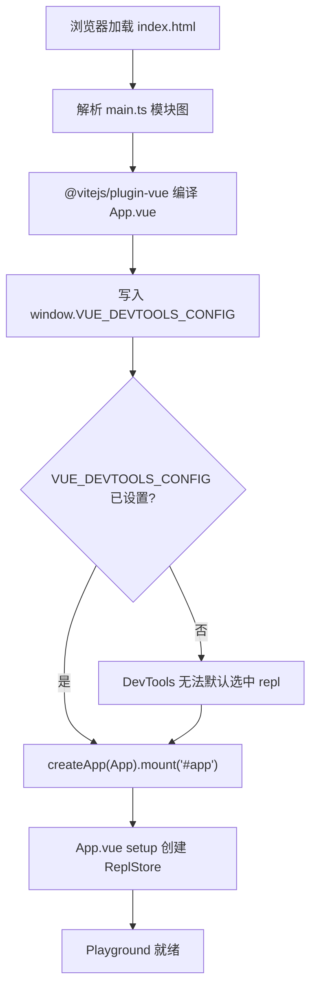
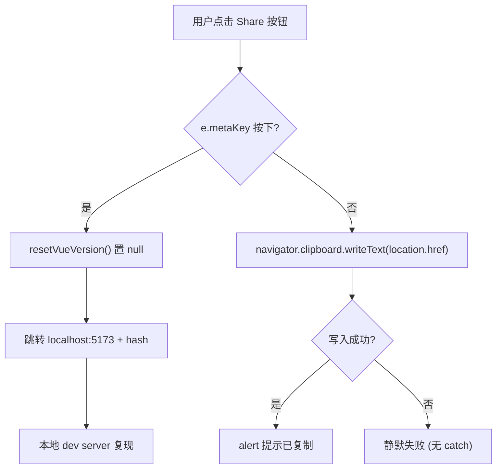
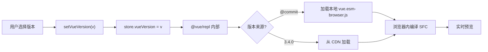

# 第 7 章：SFC Playground：ブラウザ内のリアルタイムコンパイルとデバッグサブシステム

前の章では 20 余りの`.test-d.ts`ファイルで「型即 API 契約」を CI に釘付けにした。しかし型契約は「API 表面がどのような形か」にしか答えられず、「この SFC がコンパイルされると実際にどのような形になるか」「SSR モードでレンダリング結果が一致するか」には答えられない。後者の二つの問いに答えるために、Vue チームはブラウザ内で完全なコンパイルパイプラインを実行できるサンドボックスを必要とした——それが`packages-private/sfc-playground`である。それは`packages/`下の公開パッケージとは本質的に異なる：`package.json`では`"private": true`かつ`"version": "0.0.0"` [FACT:packages-private/sfc-playground/package.json:2-4]、つまり npm に永遠に公開されず、公式のデバッグツールに過ぎない。その依存関係では`vue`が`workspace:*` [FACT:packages-private/sfc-playground/package.json:19]を指し、つまり npm 上の安定版ではなくローカルソースのビルド成果物である——これにより Playground は自然に「現在の commit の生きたデモ」となる。本章は三つの問題に焦点を当てる：エントリがどのように初期化されるか、Header がどのように状態切り替えを駆動するか、ビルド時定数がどのように注入されるか。

# 一、エントリのミニマリズム：main.ts と ReplStore の初期化契約

## 直感モデル

`main.ts`はわずか 9 行で、「起動時セルフチェックスクリプト」のようなものだ：Vue アプリがマウントされる前に、まず`window`にグローバル設定を入れ、Vue DevTools に「デフォルトでどの app を選択するか」を伝える。このステップがなければ、DevTools を開いたときに複数の app インスタンス（Playground 自身 + ユーザー REPL で実行されるコード）に直面し、自動フォーカスできず、デバッグ体験が手動切り替えに退化する。

## データ構造とグローバル副作用

`main.ts`の核心は`createApp`ではなく、`window`への汚染的な書き込みである：

[FACT:packages-private/sfc-playground/src/main.ts:4-7]

```ts
// @ts-expect-error Custom window property
window.VUE_DEVTOOLS_CONFIG = {
  defaultSelectedAppId: 'repl',
}
```

ここに注目すべきエンジニアリングの詳細が二つある：

> **[Design Inference & Architectural Trade-offs]**
> 1. **`@ts-expect-error`であり`@ts-ignore`**：`window`ではない 標準型`Window & typeof globalThis`には`VUE_DEVTOOLS_CONFIG`フィールドが存在しない。`@ts-expect-error`を使うことは「ここでエラーが出ることを知っており、かつエラーが出ることを要求する」を意味する——将来ある`@types/*`がこのフィールドを補った場合、`@ts-expect-error`は「エラーが発生しなかった」ことで逆にエラーを出し、作者にそのコメントを削除するよう促す。これは前の章の型契約テストの考え方と一脈通じる：**型システムで意図を守り、問題を覆い隠すのではなく**。

> **[Design Inference & Architectural Trade-offs]**
> 2. **`defaultSelectedAppId: 'repl'`の文字列規約**：この`'repl'`は`@vue/repl`内部で app を作成する際に使用される id と完全に一致しなければならない。これはクロスパッケージのリテラル契約であり、いかなる型制約にも保護されていない——`@vue/repl`が id を変更したら、Playground の DevTools デフォルト選択は静かに無効化される。

## Step-by-Step：HTML からマウントまで

実行フローは極めて短いが、各ステップに暗黙の制約がある：

1. ブラウザが`index.html`をロードし、そこには`<div id="app">`が含まれる（本資料では提供されていないが、`mount('#app')`から逆推できる）。

2. モジュールグラフの解析：`main.ts`冒頭の`import App from './App.vue'` [FACT:packages-private/sfc-playground/src/main.ts:2]が`@vitejs/plugin-vue`の SFC コンパイルをトリガーする。

> **[Design Inference & Architectural Trade-offs]**
> 3. **重要な順序**：`window.VUE_DEVTOOLS_CONFIG`は`createApp(App).mount('#app')` [FACT:packages-private/sfc-playground/src/main.ts:9]より前に書き込まれなければならない。DevTools の hook は`createApp`内部で登録されるため、mount より遅く設定を書き込むと初回選択に影響を与えられない。

4. `mount('#app')`が`App.vue`の setup をトリガーし、さらに`ReplStore`を作成する（`App.vue`内、本資料には含まれない）。



## 設計思考と落とし穴

`main.ts`のミニマリズムは意図的である：**複雑さをすべて`App.vue`と`ReplStore`**。エントリポイントは「グローバル副作用の注入 + マウント」の2つだけを担い、ビジネスロジックはここに現れるべきではない。これはPlaygroundが「製品」ではなく「デバッグツール」であることによるトレードオフである——SSR互換性も、マルチエントリも、遅延読み込みも必要としない。

> **[Design Inference & Architectural Trade-offs]**
> 本番環境での落とし穴：`window.VUE_DEVTOOLS_CONFIG`は**グローバルシングルトン**。もしPlaygroundがDevToolsを使用する別のページ（iframeシナリオなど）に埋め込まれた場合、後から書き込んだ者が前者を上書きする。Playgroundは通常独立してデプロイされるため、このリスクは許容されている。

---

# 二、Header.vue：computed派生状態とemit単方向データフロー

## 直感的モデル

`Header.vue`はPlaygroundの「コントロールパネル」である——バージョン選択、PROD/DEV切り替え、SSRスイッチ、テーマ切り替え、共有、ダウンロード。それ自体は**いかなるビジネス状態も保持しない**。すべての状態は`props.store`とブールpropsから来ており、すべての変更は`emit`を通じて親コンポーネントに報告される。この「ダムコンポーネント + イベントバブリング」の制約がなければ、Headerは状態が散在する重災区となり、バージョン切り替えとSSR切り替えの副作用を集中的に管理できなくなる。

## データ構造とフィールド分析

Headerのprops定義は、その責務を理解する鍵である：

[FACT:packages-private/sfc-playground/src/Header.vue:13-19]

```ts
const props = defineProps()
```

5つのpropsは2つのカテゴリに分かれる：

- **`store: ReplStore`**：唯一の状態コンテナ参照であり、`@vue/repl`から来る。Headerはそれを介して`store.loading`、`store.vueVersion`、`store.typescriptVersion`を読み取り、直接`store.vueVersion`。
- **4つのブール/リテラルprops**：`prod`、`ssr`、`autoSave`、`theme`。これらは**制御された状態**であり、Headerは読み取りのみで書き込みは行わず、変更は必ず`emit`。

対応するemitリスト[FACT:packages-private/sfc-playground/src/Header.vue:20-28]：

```ts
const emit = defineEmits([
  'toggle-theme',
  'toggle-ssr',
  'toggle-prod',
  'toggle-autosave',
  'reload-page',
])
```

注意：`toggle-theme`は`toggleDark()`内部で`emit`されるが、`toggle-ssr`/`toggle-prod`/`toggle-autosave`はテンプレート内で直接`$emit`される[FACT:packages-private/sfc-playground/src/Header.vue:102-118]。この混用はVue 3`<script setup>`の一般的なスタイルである：**副作用が必要な場合は関数emitを使用し、純粋な転送の場合はテンプレート`$emit`**。

## Step-by-Step：バージョン表示と切り替え

シナリオ：ユーザーがPlaygroundを開き、Headerは現在のVueバージョンを表示する必要がある。

**ステップ1：computed派生表示テキスト**

[FACT:packages-private/sfc-playground/src/Header.vue:30-37]

```ts
const vueVersion = computed(() => {
  if (store.loading) {
    return 'loading...'
  }
  return store.vueVersion || `@${__COMMIT__}`
})
```

ここには3層の優先順位がある：`loading`状態 →`'loading...'`；ユーザーが明示的にバージョンを選択 →`store.vueVersion`；それ以外 →`@${__COMMIT__}`（現在のcommitショートハッシュ）。`__COMMIT__`はビルド時に注入される定数であり、次のセクションで詳述する。

**ステップ2：VersionSelectの双方向バインディング**

[FACT:packages-private/sfc-playground/src/Header.vue:88-88]

```html

```

ここで注意すべきは**を使用せず`v-model`**、明示的に`:model-value` + `@update:model-value`に分割している点である。理由は`vueVersion`がcomputed（読み取り専用）であり、直接双方向バインディングできないため、`setVueVersion`というsetter関数を通じて`store.vueVersion`：

[FACT:packages-private/sfc-playground/src/Header.vue:39-41]

```ts
async function setVueVersion(v: string) {
  store.vueVersion = v
}

function resetVueVersion() {
  store.vueVersion = null
}
```

> **[Design Inference & Architectural Trade-offs]**
> `setVueVersion`は`async`として宣言されているが内部に`await`がない——これは歴史的遺産か意図的なものか？ 推測では`VersionSelect`の非同期読み込みセマンティクス（バージョン切り替えがリモート読み込みをトリガーする）と整合させ、インターフェースの一貫性を保つためである。

**ステップ3：TypeScriptバージョンの比較**

[FACT:packages-private/sfc-playground/src/Header.vue:76-80]

```html

```

TypeScriptバージョンでは`v-model`を使用している。なぜなら`store.typescriptVersion`は書き込み可能な通常のプロパティであり、computedでラップする必要がないからである。**同じコンポーネントが同じテンプレート内で2つのバインディング方式を使用する**ことは、まさに「制御 vs 非制御」の直感的な体現である。

## テーマ切り替え：副作用とemitの組み合わせ

[FACT:packages-private/sfc-playground/src/Header.vue:58-66]

```ts
function toggleDark() {
  const cls = document.documentElement.classList
  cls.toggle('dark')
  localStorage.setItem(
    'vue-sfc-playground-prefer-dark',
    String(cls.contains('dark')),
  )
  emit('toggle-theme', cls.contains('dark'))
}
```

この関数は3つのことを行う：DOM classの操作、localStorageへの永続化、親コンポーネントへのemit通知。**注意：直接`props.theme`**を変更していない——propsは読み取り専用であるため、親コンポーネントが`toggle-theme`を受け取ってから`theme`を更新し、それによってテンプレート内の`:title`テキスト[FACT:packages-private/sfc-playground/src/Header.vue:123]。

> **[Design Inference & Architectural Trade-offs]**
> ここに微妙な設計がある：**DOM class操作とVueリアクティブ状態は2つの独立したパスである**。`document.documentElement.classList.toggle('dark')`は直接DOMを変更し、`theme`propはVueを通じて更新される。もし両者が同期しなければ（例えば親コンポーネントが更新を拒否した場合）、UIに「classは切り替わったがtitleテキストが変わっていない」という不整合が生じる。実際には親コンポーネントは常にemitを受け入れるため、問題は顕在化しない。

## 隠しロジック：copyLinkのmetaKey分岐

[FACT:packages-private/sfc-playground/src/Header.vue:47-56]

```ts
async function copyLink(e: MouseEvent) {
  if (e.metaKey) {
    resetVueVersion()
    // hidden logic for going to local debug from play.vuejs.org
    window.location.href = 'http://localhost:5173/' + window.location.hash
    return
  }
  await navigator.clipboard.writeText(location.href)
  alert('Sharable URL has been copied to clipboard.')
}
```

これは**開発者バックドア**である：`play.vuejs.org`上でCmdを押しながら共有ボタンをクリックすると、`localhost:5173`（ローカルdev server）にジャンプし、現在のURL hashを持っていく。hashには完全なREPL状態（ソースコード、バージョン、オプション）がエンコードされているため、ローカルデバッグでオンラインの問題を再現できる。コメント`// hidden logic for going to local debug from play.vuejs.org` [FACT:packages-private/sfc-playground/src/Header.vue:47-56]はこれが意図的に隠された機能であることを明示している。

> **[Design Inference & Architectural Trade-offs]**
> `resetVueVersion()`はジャンプ前に呼び出され、`store.vueVersion`を`null`に設定し、ローカルデバッグがオンラインで選択されたバージョンではなく現在のcommitを使用することを保証する。



## 設計思考と落とし穴

> **[Design Inference & Architectural Trade-offs]**
> **落とし穴1：`navigator.clipboard`の権限とセキュリティコンテキスト**。`copyLink`にはtry/catchがない[FACT:packages-private/sfc-playground/src/Header.vue:47-56]。非HTTPSまたはユーザーがクリップボード権限を拒否した場合、`writeText`はrejectし、未キャッチのPromise rejectionが発生する。PlaygroundはHTTPS上にデプロイされているためリスクは許容されているが、これは典型的な「本番環境の罠」である。

> **[Design Inference & Architectural Trade-offs]**
> **落とし穴2：`toggleDark`のlocalStorage keyハードコーディング**。`'vue-sfc-playground-prefer-dark'`は文字列リテラルであり、定数抽出がされていない。将来keyを変更する場合、グローバル検索が必要になる。

**落とし穴3：`currentCommit`と`vueVersion`の比較**。テンプレート内で`:class="{ active: vueVersion === \`@${currentCommit}\` }"` [FACT:packages-private/sfc-playground/src/Header.vue:88-88]文字列連結で比較する。もし`__COMMIT__`注入が失敗した場合（`undefined`になる）、ここは`'@undefined'`になり、永遠に一致しない。ビルド時定数注入の信頼性がUIの正確性を直接左右する——これが次の節のテーマである。

---

# 三、ビルド時定数注入：__COMMIT__ と copyVuePlugin の二重の責務

## 直感的モデル

`vite.config.ts`は Playground の「組み立て工場」である：ビルド時に`git rev-parse`を実行して commit ハッシュを取得し、`define`を通じてそれをグローバル定数`__COMMIT__`に変換する。同時にカスタムプラグインを通じて`packages/vue/dist/`配下の ESM ブラウザビルド成果物を Playground の出力ディレクトリにコピーする。このステップがなければ、Playground はブラウザで「現在の commit の Vue ランタイム」を読み込めず、npm 上の安定版に依存するしかなくなり、「ライブデモ」の意味を失う。

## データ構造とビルド時定数

[FACT:packages-private/sfc-playground/vite.config.ts:7-9]

```ts
const commit = spawnSync('git', ['rev-parse', '--short=7', 'HEAD'])
  .stdout.toString()
  .trim()
```

`spawnSync`は同期的に git コマンドを実行し、`--short=7`で7桁の短縮ハッシュを取得する。同期実行は意図的である：**設定ファイルはモジュール読み込み時に`commit`の値が必要であり、**非同期だと Vite の設定解析タイミングが乱れる。

[FACT:packages-private/sfc-playground/vite.config.ts:23-26]

```ts
define: {
  __COMMIT__: JSON.stringify(commit),
  __VUE_PROD_DEVTOOLS__: JSON.stringify(true),
},
```

`define`は Vite の**テキスト置換**機構である：ソース内のすべての`__COMMIT__`が`JSON.stringify(commit)`の結果（つまり引用符付きの文字列リテラル）に置換される。`JSON.stringify`は必須である——もし直接`commit`と書くと、置換後に裸の識別子`abc1234`になり、文字列ではなく変数名として扱われる。

> **[Design Inference & Architectural Trade-offs]**
> `__VUE_PROD_DEVTOOLS__: true`はもう一つの重要な定数である：Vue の**本番ビルド**でも DevTools サポートを保持させる。デフォルトでは本番ビルドはサイズ削減のため DevTools フックを除去するが、Playground はユーザーコードをデバッグする必要があるため強制的に有効化する。

## Step-by-Step：copyVuePlugin の成果物搬送

[FACT:packages-private/sfc-playground/vite.config.ts:32-63]

```ts
function copyVuePlugin(): Plugin {
  return {
    name: 'copy-vue',
    generateBundle() {
      const copyFile = (file: string) => {
        const filePath = path.resolve(
          import.meta.dirname,
          '../../packages',
          file,
        )
        const basename = path.basename(file)
        if (!fs.existsSync(filePath)) {
          throw new Error(
            `${basename} not built. ` +
              `Run "nr build vue -f esm-browser" first.`,
          )
        }
        this.emitFile({
          type: 'asset',
          fileName: basename,
          source: fs.readFileSync(filePath, 'utf-8'),
        })
      }

      copyFile(`vue/dist/vue.esm-browser.js`)
      copyFile(`vue/dist/vue.esm-browser.prod.js`)
      copyFile(`vue/dist/vue.runtime.esm-browser.js`)
      copyFile(`vue/dist/vue.runtime.esm-browser.prod.js`)
      copyFile(`server-renderer/dist/server-renderer.esm-browser.js`)
    },
  }
}
```

重要なポイントを順に解析する：

1. **`generateBundle`フック**：Rollup がバンドルを生成した後、ディスクに書き込む前に実行される。この時点で`emitFile`を使って成果物に追加ファイルを入れることができる。

2. **`import.meta.dirname`**：Node 20.11+ が提供する ESM 版`__dirname`。パス`../../packages`は`packages-private/sfc-playground/`からリポジトリルートへ遡り、さらに`packages/`。

3. **へ進む。存在チェック＋明確なエラー**：もし`vue.esm-browser.js`が存在しなければ、修正手順を含むエラー`Run "nr build vue -f esm-browser" first.`を投げる。これは**開発者体験**の模範である——エラーメッセージが直接修正方法を教えてくれる。

4. **五つの成果物**：`vue`の完全版/ランタイム版 × dev/prod、さらに`server-renderer`。これら五つのファイルこそが Playground がブラウザで動的に import する候補集合であり、Header のバージョン切り替えと SSR スイッチに対応する。

> **[Design Inference & Architectural Trade-offs]**
> **なぜこの五つなのか？**完全版（コンパイラ含む）は「ランタイムコンパイル」シーン用；ランタイム版は「事前コンパイル」シーン用；dev/prod は Header の PROD/DEV 切り替えに対応；server-renderer は SSR スイッチに対応。これら五つのファイルが Playground の「Vue ランタイムマトリクス」を構成する。

## バージョン切り替えの完全なデータフロー

Header の`setVueVersion`と copyVuePlugin の成果物を結びつけて見ると：



この特殊値`@${__COMMIT__}`に注意：これは CDN ではなく copyVuePlugin がコピーしたローカル成果物に対応する。これが Playground が Vue のブラウザビルド成果物をコピーしなければならない理由である——**「This Commit」オプションにはローカルファイルが必要**。

## 設計思考と落とし穴

> **[Design Inference & Architectural Trade-offs]**
> **落とし穴 1：`spawnSync`の失敗処理**。もし現在のディレクトリが git リポジトリでなければ（例えば tarball から解凍した場合）、`spawnSync`は非ゼロの終了コードを返し、`stdout`は空になり、`commit`は空文字列になる。この時`__COMMIT__`は`""`に置換され、Header の`@${currentCommit}`は`'@'`になる。明示的なエラー処理はない。

> **[Design Inference & Architectural Trade-offs]**
> **落とし穴 2：`optimizeDeps.exclude: ['@vue/repl']`** [FACT:packages-private/sfc-playground/vite.config.ts:27-29]。Vite はデフォルトでコールドスタートを加速するため依存関係を事前バンドルするが、`@vue/repl`は除外される。理由は`@vue/repl`内部で動的 import と worker を使用しており、事前バンドルがこれらの機構を破壊するからである。これは Vite エコシステムでよくある「事前バンドルと動的読み込みの衝突」問題である。

> **[Design Inference & Architectural Trade-offs]**
> **落とし穴 3：`script.fs`設定** [FACT:packages-private/sfc-playground/vite.config.ts:13-19]。`@vitejs/plugin-vue`の`script.fs`オプションは SFC の`<script>`ブロックが`fs`を通じてファイルを読み取ることを許可する。ここで`fs.existsSync`と`fs.readFileSync`を渡すのは、SFC 内の`import`文の解析をサポートするためである（例えば`import x from './foo'`はファイルの存在チェックが必要）。**これは Playground がブラウザで完全なモジュール解決をシミュレートできる鍵である**——Node の fs 機能をコンパイラの解決段階に注入している。

---

# 設計思考：Playground のアーキテクチャトレードオフ

三つの小節を繋げて見ると、Playground のアーキテクチャは明確な原則に従っている：**「状態」と「副作用」を分離し、「ビルド期」と「実行期」を分離する**。

- `main.ts`はグローバルな副作用注入のみを行い、ビジネス状態には触れない。
- `Header.vue`は純粋な表示コンポーネントであり、状態は props で流入し、emit で流出する。
- `vite.config.ts`は「現在の commit」というビルド期情報を定数として固定化し、実行期は読み取り専用とする。

> **[Design Inference & Architectural Trade-offs]**
> この分離は直接的な利点をもたらす：**Playground は任意の Vue アプリケーションに埋め込むことができる**（例えばドキュメントサイトの埋め込み例）。必要なのは`store`と四つのブール props を提供するだけである。

代償は**状態の分散**：`store`において`@vue/repl`では、ブール状態は親コンポーネントにあり、DOM class は`document.documentElement`上にあり、localStorage にもう一份ある。四箇所の状態を手動で同期する必要があり、どこか一箇所でも同期が外れると UI の不整合が発生する。

> **[Design Inference & Architectural Trade-offs]**
> もう一つのトレードオフは**SSR 互換性を放棄する**。`main.ts`直接アクセス`window`，`Header.vue`の`toggleDark`直接アクセス`document`。Playground は純粋な CSR アプリケーションであり、サーバーサイドレンダリングを考慮する必要がない。

---

# 本章のまとめ

本章では`packages-private/sfc-playground`の三つの核心ファイルを分析した：

1. **`main.ts`**：9 行のエントリ、核心は`window.VUE_DEVTOOLS_CONFIG`の注入順序——必ず`mount`の前でなければならない。

2. **`Header.vue`**：`computed`を通じて`vueVersion`を派生し、`emit`を通じてすべての状態変更を報告する。`copyLink`の`metaKey`分岐は隠されたローカルデバッグの裏口である。

3. **`vite.config.ts`**：`spawnSync`commit ハッシュを取得し、`define`を注入して`__COMMIT__`，`copyVuePlugin`五つの Vue ブラウザビルド成果物を Playground の成果物ディレクトリに運搬する。

三者を貫く主線は**ビルド時定数と実行時状態の境界**：`__COMMIT__`は読み取り専用のビルド時事実であり、`store.vueVersion`は可変の実行時選択であり、Header の`vueVersion`computed が両者を一つの表示文字列に統合する。

# 本章の考察とセルフチェック

Q1: もし`main.ts`における`window.VUE_DEVTOOLS_CONFIG`の代入を`createApp(App).mount('#app')`の後に移動したら、何が起こるか？なぜか？

**参考解説**：`window.VUE_DEVTOOLS_CONFIG`は Vue DevTools が`createApp`内部で hook を登録する際に読み取る設定[FACT:packages-private/sfc-playground/src/main.ts:4-9]。`createApp`は即座に`__VUE_DEVTOOLS_GLOBAL_HOOK__`を登録し、この時点で DevTools は`defaultSelectedAppId`を読み取ってデフォルトでどの app を選択するかを決定する。もし代入が`mount`より遅れると、DevTools は既に初回の app 選択を完了しており、設定は効果を発揮せず、ユーザーは手動で DevTools 内で`repl`app に切り替える必要がある。さらに隠蔽的なのは：`@vue/repl`内部でも app を作成するため、遅い代入は DevTools がデフォルトで Playground 自身を選択し、ユーザーの REPL ではなくなる可能性がある。ユーザーコードをデバッグする際に手動で切り替える必要がある。これは「グローバル副作用の注入順序」がデバッグツールにおいて重要であることを示している。

Q2: `Header.vue`の`toggleDark()`は同時に DOM class、localStorage、emit を操作するが、`props.theme`を直接変更しない。もし親コンポーネントが`toggle-theme`イベントを受け取った後に`theme`prop の更新を拒否したら、どのような UI の不整合が発生するか？ソースコードレベルでどのように特定するか？

**参考解説**：`toggleDark()`は[FACT:packages-private/sfc-playground/src/Header.vue:58-66]で直接`document.documentElement.classList.toggle('dark')`を呼び出し、これにより即座に DOM 上の`dark`class が変更され、CSS 変数の切り替えがトリガーされる（[FACT:packages-private/sfc-playground/src/Header.vue:186-186]の`.dark nav`ルールを参照）。しかしテンプレート内の`:title`文案[FACT:packages-private/sfc-playground/src/Header.vue:123]は`props.theme`に依存しており、もし親コンポーネントが更新しなければ、title は古い値のまま留まる。特定方法：ブラウザの DevTools で`<html>`の class とボタンの title 属性が矛盾していないか確認する。根本原因は「DOM 副作用」と「Vue リアクティブ状態」が二つの独立した経路を辿り、単一のデータソースが存在しないことである。

Q3: `copyVuePlugin`は`generateBundle`内で各ファイルに対して`fs.existsSync`チェックを行い、欠落時に修復指示付きのエラーをスローする。もしこのチェックを除去して直接`fs.readFileSync`した場合、CI 環境（vue を先にビルドしていない）で何が起こるか？エラーメッセージはどのように開発者を誤導するか？

**参考解説**：チェックを除去すると、`fs.readFileSync`が`ENOENT: no such file or directory, open '.../packages/vue/dist/vue.esm-browser.js'` [FACT:packages-private/sfc-playground/vite.config.ts:32-63]をスローする。このエラーは開発者に「ファイルが存在しない」とだけ伝え、「`nr build vue -f esm-browser`を先に実行する必要がある」ことは伝えない。CI 環境では、開発者はパス設定の誤り、権限問題、git サブモジュールの未初期化と誤解し、多大な時間を浪費する可能性がある。元のコードの`throw new Error(\`${basename} not built. Run "nr build vue -f esm-browser" first.\`)`は「症状」と「修復アクション」を結びつけており、開発者体験設計の重要な細部である。これはまた、Playground のビルドスクリプトが Vue コアのビルドスクリプトと明確な依存順序を持たなければならない理由も説明している。

---

次章では`packages-private/template-explorer`に入り、Vue がコンパイラの中間成果物（AST、変換結果、コード生成）をどのように可視化し、開発者がテンプレートからレンダリング関数への各変換ステップを段階的に観察できるようにするかを見る。Playground の「エンドツーエンドのブラックボックス」とは異なり、Template Explorer は「ホワイトボックスのプローブ」である。

ここまでで、SFC Playground がどのようにコンパイルパイプラインをブラウザに持ち込むかを明らかにした：エントリの初期化、Header の状態切り替え、ビルド時定数の注入が共にリアルタイムでデバッグ可能なサンドボックスを構成している。しかし Playground の視点は常に「SFC 全体のコンパイルと実行」であり、「コンパイラが特定のテンプレート式に対して実際に何の変換を行ったか」には直接答えない。次章では Template Explorer に入り、`@vue/compiler-dom`と`@vue/compiler-ssr`のコンパイル結果を行ごとに展開し、SourceMapConsumer でソースコードと成果物のマッピングを確立することで、コンパイラの内部動作を観察可能で逆推論可能なプローブに変える方法を見る。
