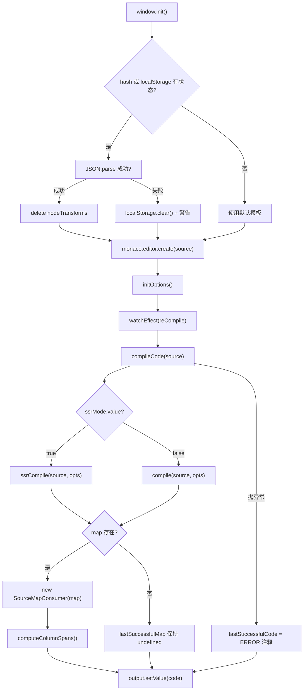
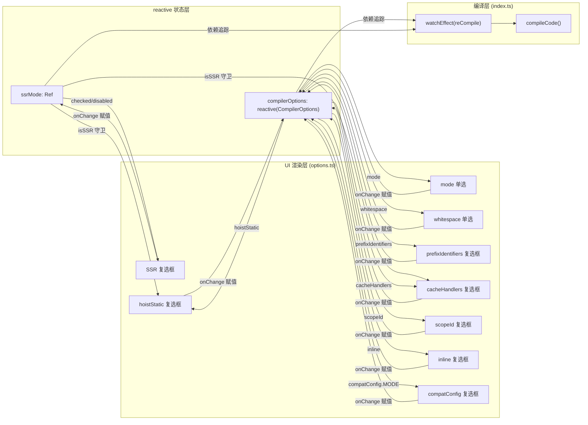

# 第 8 章：Template Explorer：コンパイラ動作の可視化プローブ

前章では、SFC Playgroundが「SFC入力 → ブラウザ内コンパイル → リアルタイムプレビュー」という一連の流れをどのようにブラックボックス化しているかを見ました。開発者は最終的なレンダリング結果を見ることはできますが、コンパイラが中間で何を行っているかは見えません。テンプレートにカスタムディレクティブを書いたり、hoistStaticを有効にした後に生成物に突然_hoisted_1変数が大量に現れたりすると、Playgroundは「なぜコンパイラがこのように生成したのか」を答えることができません。Template Explorerの位置づけは正に逆です。@vue/compiler-domと@vue/compiler-ssrのコンパイル生成物、AST、エラーマーカー、そしてソースコードから生成物への位置マッピングをすべて展開します。その核心は「実行」ではなく「観察」です。本章では3つのファイルを中心に展開します。index.tsはコンパイル呼び出しとSourceMapの双方向マッピングを担当し、options.tsはreactiveを用いて数十のCompilerOptionsを管理しUIを駆動し、theme.tsはMonacoエディタのテーマをカスタマイズします。

# 一、コンパイル呼び出しとSourceMap双方向マッピング：index.ts

## 直感的モデル

Template Explorerの`index.ts`は「双方向翻訳機」のようなものです。左側でテンプレートを入力し、右側でレンダリング関数を出力します。しかし翻訳機よりも一つの能力が優れています——左側の特定の行にカーソルを置くと、右側で対応する生成物がハイライトされます。逆に右側にカーソルを置くと、左側で対応するテンプレートがハイライトされます。SourceMapマッピングがなければ、このツールは単に並んだ2つのテキストボックスに退化し、開発者は肉眼で比較するしかなく、「テンプレートの何行目 → 生成物の何行目」という因果連鎖を構築できません。

## データ構造とメモリレイアウト

`index.ts`には複雑なStructはありませんが、ツール全体の動作を決定するいくつかの重要なモジュールレベルの状態変数があります：

`lastSuccessfulCode`と`lastSuccessfulMap`はコンパイル結果のキャッシュ[FACT:packages-private/template-explorer/src/index.ts:74-75]です。前者は文字列で、後者は`SourceMapConsumer | undefined`です。注意：`lastSuccessfulMap`は初期値が`undefined`で、コンパイルが成功し`map`が存在する場合にのみ[FACT:packages-private/template-explorer/src/index.ts:99-100]が代入されます。この`undefined`状態は、後続のすべてのカーソルマッピングロジックのガード条件です——コンパイルが失敗した場合、マッピング機能は自動的に静かに無効化され、例外をスローしません。

`PersistedState`インターフェースはlocalStorageとURLハッシュに永続化される状態の形状を定義します[FACT:packages-private/template-explorer/src/index.ts:26-30]：`src`（テンプレートソースコード）、`ssr`（SSRモードかどうか）、`options`（コンパイラオプション）。ここに重要な設計があります：`options`の型は完全な`CompilerOptions`ですが、実際に永続化する際は「デフォルト値と異なる項目」のみを保存します。このトリミングロジックは`reCompile`で行われます。

`sharedEditorOptions`は2つのエディタで共有される構築オプション[FACT:packages-private/template-explorer/src/index.ts:26-30]：`fontSize: 14`、`scrollBeyondLastLine: false`、`renderWhitespace: 'selection'`、`minimap.enabled: false`です。minimapを無効にするのは、テンプレートと生成物は通常数十行しかなく、minimapがむしろ横方向のスペースを占有するためです。

## Step-by-Step Walkthrough

**シナリオ：ユーザーがページを開き、`
{{ msg }}
`を入力し、カーソルを移動します。**

**ステップ1：初期化と状態復元。** `window.init`はグローバルエントリ[FACT:packages-private/template-explorer/src/index.ts:41]です。まずカスタムテーマを登録してアクティブ化し[FACT:packages-private/template-explorer/src/index.ts:44-45]、次にURLハッシュまたはlocalStorageから状態を復元しようとします[FACT:packages-private/template-explorer/src/index.ts:49-56]。ここでのデコード順序に注意：まず`atob`次に`escape`、そして`decodeURIComponent`。ハッシュの解析が失敗した場合、`localStorage.getItem('state')`にフォールバックし、さらに`{}`にフォールバックします。JSON.parse全体が失敗した場合、localStorageをクリアし警告を出力します[FACT:packages-private/template-explorer/src/index.ts:57-64]。

状態復元後、見落とされがちな詳細があります：`delete persistedState.options?.nodeTransforms` [FACT:packages-private/template-explorer/src/index.ts:69]。コメントが理由を説明しています——関数はシリアライズできないため、永続化時に`nodeTransforms`が失われ、復元時に空のオブジェクトが残っているとコンパイラの動作が異常になります。これは「シリアライズ不可能なフィールドの永続化」という古典的な罠です。

**ステップ2：コンパイルコア`compileCode`。**これはツール全体の心臓部[FACT:packages-private/template-explorer/src/index.ts:76-106]です。まず`console.clear()`、次に`ssrMode.value`に基づいて`ssrCompile`または`compile` [FACT:packages-private/template-explorer/src/index.ts:80]を選択します。注意：`compileFn`の呼び出しパラメータは、展開`compilerOptions`、強制`filename: 'ExampleTemplate.vue'`、`sourceMap: true`、そして`onError`コールバックを注入してエラーを収集します[FACT:packages-private/template-explorer/src/index.ts:82-89]。

ここに設計上の決定があります：`filename`は`'ExampleTemplate.vue'`にハードコードされています。この値は後続の`generatedPositionFor`呼び出しで正確に一致する必要があります[FACT:packages-private/template-explorer/src/index.ts:189]。そうでなければSourceMapクエリは空の結果を返します。これは暗黙の契約です——2箇所の文字列が一致しなければなりませんが、型システムによる保証はありません。

コンパイル完了後、エラーはMonacoのマーカー形式に変換されエディタに設定されます[FACT:packages-private/template-explorer/src/index.ts:91-95]。`formatError`は`CompilerError`の`loc`をMonacoの`startLineNumber/startColumn/endLineNumber/endColumn` [FACT:packages-private/template-explorer/src/index.ts:108-119]に変換します。注意：`errors.filter(e => e.loc)`——位置情報を持つエラーのみがマークされ、`loc`を持たないエラー（グローバル設定エラーなど）はコンソールにのみ出力されます。

**ステップ3：SourceMapの構築。**コンパイル成功後、`lastSuccessfulMap = new SourceMapConsumer(map!)` [FACT:packages-private/template-explorer/src/index.ts:99]、続けて`computeColumnSpans()` [FACT:packages-private/template-explorer/src/index.ts:100]。`computeColumnSpans`を呼び出します。`source-map-js`は`generatedPositionFor`の重要なAPIです：各マッピングセグメントの列スパンを事前計算し、`lastColumn`が返す

**フィールドを利用可能にします。このステップがなければ、逆方向マッピングは開始列しか特定できず、トークン範囲全体をハイライトできません。**ステップ4：双方向カーソルマッピング。**ユーザーが**ソースエディタ`editor.onDidChangeCursorPosition` [FACT:packages-private/template-explorer/src/index.ts:184]でカーソルを移動すると、`lastSuccessfulMap.generatedPositionFor({ source: 'ExampleTemplate.vue', line, column: column - 1 })` [FACT:packages-private/template-explorer/src/index.ts:188-192]がトリガーされます。コールバックは100msのdebounce後、`column - 1`を呼び出します。注意：`pos`——Monacoの列番号は1から始まり、SourceMapの列番号は0から始まります。返された`line`に`column`と[FACT:packages-private/template-explorer/src/index.ts:194-206]があれば、出力エディタ上にデコレータを作成して対応範囲をハイライトし[FACT:packages-private/template-explorer/src/index.ts:207-210]。

、その位置にスクロールします`output.onDidChangeCursorPosition`逆方向マッピングは[FACT:packages-private/template-explorer/src/index.ts:223]で行われます`originalPositionFor` [FACT:packages-private/template-explorer/src/index.ts:227-230]。それは`pos.line === 1 && pos.column === 0`の「mock location」[FACT:packages-private/template-explorer/src/index.ts:231-237]。このガードは非常に重要です——コンパイラが生成する一部のコード（例えば`import`文やヘルパー関数）には対応するテンプレート位置がなく、SourceMap は`{ line: 1, column: 0 }`をプレースホルダとして返します。これを無視しないと、これらの行にカーソルを置いたときにテンプレートの最初の行が誤ってハイライトされます。

**第五步：状態の永続化。** `reCompile`はコンパイルをトリガーするだけでなく、現在の状態を localStorage と URL ハッシュに書き込む役割も担います[FACT:packages-private/template-explorer/src/index.ts:121-146]。永続化時にはトリミングロジックがあります：`compilerOptions`を走査し、「オブジェクトでなく、かつデフォルト値と等しくない」項目のみを保存します[FACT:packages-private/template-explorer/src/index.ts:125-133]。これにより、`bindingMetadata`のようなオブジェクト型のオプションが永続化されない理由が説明できます——複雑すぎるうえ、デフォルト値でデモには十分だからです。

## 設計上の考察と本番での落とし穴

**なぜ`source-map-js`ではなく`source-map`？** `source-map`を使うのか`source-map-js`は Mozilla のオリジナルライブラリで、サイズが大きく、WASM（新しいバージョン）に依存しています。`source-map-js`は純粋な JS 実装で、サイズが小さく、ブラウザ環境に適しています。Template Explorer は純粋なフロントエンドツールとして、[FACT:packages-private/template-explorer/package.json:15]。

**を選択するのは合理的です**debounce の遅延の選択。[FACT:packages-private/template-explorer/src/index.ts:271]ソースコードエディタの debounce はデフォルトで 300ms[FACT:packages-private/template-explorer/src/index.ts:215]ですが、カーソル移動の debounce は 100ms です

**`window.init`。この差異は意図的なものです：コンパイルは重い操作で、300ms は頻繁なトリガーを避けるため。カーソル移動は軽い操作で、100ms は応答感を保証するため。ただし 100ms でもカーソルを素早く動かすとハイライトのちらつきが発生する可能性があります——これは許容できるトレードオフです。**のグローバルマウント。`window.init`注意：`window.monaco`と[FACT:packages-private/template-explorer/src/index.ts:19-23]はどちらもグローバル`loader.js`にマウントされます。これは Monaco エディタが CDN の`window.init`を通じて非同期で読み込まれ、読み込み完了後に

---

# を呼び出すためです。この「グローバルコールバック」パターンは非モジュール環境における Monaco の標準的な使い方ですが、現代の ESM ビルド方式とは相容れません。

## 二、reactive 駆動のオプションパネル：options.ts

`options.ts`直感的モデル`compile`は「コンソールパネル」のようなものです：上に十数のスイッチとラジオボタンがあり、それぞれがコンパイラの動作に対応しています。どれかのスイッチを切り替えると、右側のコンパイル結果が即座に変わります。このモジュールがなければ、開発者はソースコード内の

## 呼び出しパラメータを変更して再コンパイルするしかなく、異なるオプションの効果をリアルタイムで比較できません。

`options.ts`データ構造とメモリレイアウト

`ssrMode`の核心は 3 つのエクスポートです：`ref(false)` [FACT:packages-private/template-explorer/src/options.ts:5]は`compilerOptions`です。これは`compile` vs `ssrCompile`から独立しています。なぜなら SSR モードが切り替えるのはコンパイル関数自体（

`defaultOptions`）であり、コンパイルオプションではないからです。`CompilerOptions`は完全な[FACT:packages-private/template-explorer/src/options.ts:5-27]オブジェクト`mode: 'module'`、`prefixIdentifiers: false`、`hoistStatic: false`、`cacheHandlers: false`、`scopeId: null`、`inline: false`、`ssrCssVars: '{ color }'`、`compatConfig: { MODE: 3 }`、`whitespace: 'condense'`です。これはすべてのオプションのデフォルト値を定義しており、`bindingMetadata` [FACT:packages-private/template-explorer/src/options.ts:18-26]。

`compilerOptions`や、7 つのバインディングタイプを含む`reactive(Object.assign({}, defaultOptions))` [FACT:packages-private/template-explorer/src/options.ts:29-31]が含まれます`Object.assign({}, ...)`は`reactive(defaultOptions)`です。ここで`compilerOptions`を使って浅いコピーを行っていることに注意——`defaultOptions`を直接行うと、`reCompile`を変更したときに

## Step-by-Step Walkthrough

**が汚染され、**

**内の「デフォルト値との比較」ロジックが無効になります。** `App`シナリオ：ユーザーが「hoistStatic」チェックボックスをクリック。`setup`第一步：UI レンダリング。[FACT:packages-private/template-explorer/src/options.ts:33-35]コンポーネントの`ssrMode.value`、`compilerOptions.mode`、`compilerOptions.prefixIdentifiers`はレンダリング関数[FACT:packages-private/template-explorer/src/options.ts:36-39]を返します。このレンダリング関数は

**などのリアクティブ状態** `hoistStatic`を読み取るため、これらの状態が変化すると UI 全体が再レンダリングされます。`checked`第二步：チェックボックスの checked バインディング。`compilerOptions.hoistStatic && !isSSR` [FACT:packages-private/template-explorer/src/options.ts:150]チェックボックスの`hoistStatic`属性は`disabled: isSSR` [FACT:packages-private/template-explorer/src/options.ts:151]です。ここにロジックがあります：SSR モードでは

**が強制的に未チェックで表示されます。SSR コンパイルは静的巻き上げをサポートしていないためです。同時に**により、ユーザーは SSR モードでこれを切り替えられません。`onChange`第三步：onChange 処理。[FACT:packages-private/template-explorer/src/options.ts:152-156]ユーザーがチェックボックスをクリックすると、`e.target.checked`が`compilerOptions.hoistStatic`をトリガーし、直接`compilerOptions`を`reactive`に代入します。`watchEffect(reCompile)` [FACT:packages-private/template-explorer/src/index.ts:266]は

**であるため、この代入は依存関係の追跡をトリガーし、さらに**をトリガーし、最終的に再コンパイルされます。`cacheHandlers`第四步：オプション間の連動。`checked`注意：`usePrefix && compilerOptions.cacheHandlers && !isSSR` [FACT:packages-private/template-explorer/src/options.ts:166]，`disabled`の`!usePrefix || isSSR` [FACT:packages-private/template-explorer/src/options.ts:167]は`cacheHandlers`は`prefixIdentifiers`です。これは`mode === 'module'`が`prefixIdentifiers`または`function`に依存することを意味します。この連動関係は UI 上では次のように現れます：`cacheHandlers`が有効でなく、モードが

`scopeId`のとき、`disabled: !isModule` [FACT:packages-private/template-explorer/src/options.ts:182]，`checked: isModule && compilerOptions.scopeId` [FACT:packages-private/template-explorer/src/options.ts:183]チェックボックスは無効になります。`isModule`の連動はより複雑です：`null` [FACT:packages-private/template-explorer/src/options.ts:184-189]。

**。module モードでのみ scopeId を設定でき、onChange 時に** `initOptions`が false の場合、強制的に`createApp(App).mount(document.getElementById('header')!)` [FACT:packages-private/template-explorer/src/options.ts:232-234]に設定されます`vue`第五步：マウント。`createApp`は`@vue/runtime-dom`を呼び出します。ここで`options.ts`パッケージの`vue`ではなく

## はアプリケーション層のコードであり、完全な

**パッケージに直接依存できるためです。`reactive`コピー`ref`？** `compilerOptions`設計上の考察と本番での落とし穴`reactive`なぜ`compilerOptions.hoistStatic = true`ではなく`compilerOptions.value.hoistStatic = true`を使うのか`reactive`は十数のフィールドを含むオブジェクトで、`compilerOptions.xxx`を使えば

**`bindingMetadata`を直接行え、**が不要です。これは UI コードではより簡潔です。ただし[FACT:packages-private/template-explorer/src/options.ts:18-26]の代償は、分割代入がリアクティビティを失うことです——ソースコードには分割代入が一切なく、すべて`SETUP_CONST`、`SETUP_REF`、`SETUP_LET`、`SETUP_MAYBE_REF`、`PROPS`を通じてアクセスしており、これは正しい使い方です。`prefixIdentifiers`のデフォルト値の設計。`$setup`のデフォルト値には 7 つのバインディング`prefixIdentifiers`が含まれ、

**`compatConfig`の 5 つのタイプをカバーしています。これは開発者が** `compilerOptions.compatConfig!.MODE = 2` [FACT:packages-private/template-explorer/src/options.ts:216-220]を開いたときに、異なるバインディングタイプが出力の`reactive`アクセス方法に与える影響をすぐに確認できるようにするためです。このデフォルト値がなければ、`reactive`の効果は非常に単調になります。`compatConfig`のネストされたリアクティビティ。`CompatConfig | undefined`このようなネストされた代入は`!`ではリアクティブです。なぜなら`compatConfig`はネストされたオブジェクトを再帰的にプロキシするからです。ただし

**`ssrMode`の型は`compilerOptions`であるため、** `ssrMode`アサーションを使用しています。デフォルト値に`ref`，`compilerOptions`がなければ、ここで実行時にクラッシュします。`reactive`と`ssr`の責務の分離。`compilerOptions`は`ssr`は`CompilerOptions`です。なぜ

---

# を

## に入れないのか？それは

`theme.ts`エディタに「別のスキン」を着せるようなもの：各構文トークンの色とフォントスタイルを定義する。このモジュールがなければ、Monaco はデフォルトの`vs-dark`テーマを使用する。動作はするが、Vue テンプレート内の HTML タグ、式、ディレクティブの視覚的な区別がなくなり、開発者が重要な部分を素早く特定するのが難しくなる。

## データ構造とメモリレイアウト

`theme.ts`Monaco`IStandaloneThemeData`インターフェースに準拠したオブジェクトをエクスポートする[FACT:packages-private/template-explorer/src/theme.ts:1-244]。トップレベルには3つのフィールドがある：

`base: 'vs-dark'`ベーステーマを指定する[FACT:packages-private/template-explorer/src/theme.ts:2]，`inherit: true`ベーステーマを継承するルールを表す[FACT:packages-private/template-explorer/src/theme.ts:3]。つまり差分部分だけを定義すればよく、未定義のトークンは`vs-dark`。

`rules`にフォールバックする。配列であり、各要素は`token`（Monaco のトークン名）と`foreground`/`background`/`fontStyle` [FACT:packages-private/template-explorer/src/theme.ts:4-235]を含む。この配列には50以上のエントリがあり、number、comment、keyword、string、variable、entity.name.tag などのトークンタイプをカバーしている。

`colors`エディタ UI の色を定義する[FACT:packages-private/template-explorer/src/theme.ts:236-243]：`editor.foreground`、`editor.background`、`editor.selectionBackground`、`editor.lineHighlightBackground`、`editorCursor.foreground`、`editorWhitespace.foreground`。

## Step-by-Step Walkthrough

**シナリオ：ページ読み込み時にテーマを登録する。**

**ステップ1：テーマを定義する。** `monaco.editor.defineTheme('my-theme', theme)` [FACT:packages-private/template-explorer/src/index.ts:44]。この呼び出しは`theme.ts`のエクスポートオブジェクトを Monaco のテーマレジストリに登録し、キー名は`'my-theme'`。

**ステップ2：テーマをアクティブ化する。** `monaco.editor.setTheme('my-theme')` [FACT:packages-private/template-explorer/src/index.ts:45]。この行は`defineTheme`の後に呼び出す必要があり、そうでなければ「テーマが未定義」エラーがスローされる。

**ステップ3：トークンマッチング。**Monaco がテンプレートコードをレンダリングする際、HTML 言語サービスでコードをトークン化し、トークン名に基づいて`rules`内のルールを検索する。例えば`
`内の`div`は`entity.name.tag`としてマークされ、`foreground: 'cc6666'` [FACT:packages-private/template-explorer/src/theme.ts:41-44]にマッチし、赤色で表示される。

## 設計上の考察と本番での落とし穴

**なぜ`inherit: true`？**を使用するのか。継承しなければ、テンプレートに現れないもの（`markup.heading`、`meta.diff`など）を含むすべてのトークンの色を定義する必要がある。継承により、テーマファイルはテンプレートと JS 出力に実際に現れるトークンだけに注目すればよくなる。

**トークン名の階層マッチング。**Monaco のトークンマッチングはプレフィックスマッチングである：`entity.name.tag`は`entity.name.tag.html`、`entity.name.tag.css`などにマッチする。ソースコードでは`entity.name.tag` [FACT:packages-private/template-explorer/src/theme.ts:41-44]と`entity.name.tag.css` [FACT:packages-private/template-explorer/src/theme.ts:169-172]の両方が定義されており、後者が前者の CSS 固有のシナリオを上書きする。

**`colors`と`rules`の役割分担。** `rules`はコードテキストの色を制御し、`colors`はエディタ UI（背景、カーソル、選択行）の色を制御する。両者は独立しているが、視覚的な調和が必要である。ソースコード内の`editor.background: '#1D1F21'`と`base: 'vs-dark'`のデフォルト背景は近く、これは視覚的一貫性を保つためである。

---

# 設計上の考察：可視化プローブのエンジニアリング上のトレードオフ

Template Explorer と SFC Playground の核心的な違いは「観察の粒度」にある。Playground が観察するのは「SFC 全体がコンパイル後に動作するか」であり、Template Explorer が観察するのは「個々のテンプレート式が何にコンパイルされるか」である。この違いが2つのツールの技術選定を決定づけている：

**SourceMapConsumer の導入は必然である。**これがなければ、開発者はソースコードと出力を目視で比較するしかなく、正確な「何行目 → 何行目」のマッピングを構築できない。しかし SourceMapConsumer の API は非同期であり（新しいバージョンは Promise を返す）、ソースコードでは同期バージョン`source-map-js`を使用しており、これは呼び出しロジックを簡素化するためである。

**`reactive`管理オプションは Vue エコシステムの自然な選択である。**ネイティブ DOM イベントで十数のオプションの状態同期を手動管理すると、コード量が倍になる。`reactive`の依存追跡により「オプション変更 → 再コンパイル」というチェーンが自動化され、`watchEffect(reCompile)`1行のコードで購読が完了する。

**Monaco のグローバルロードモードは歴史的な負債である。** `window.monaco`と`window.init`のグローバルマウント方式は Monaco の AMD ローダー設計に由来する。現代の ESM ビルドではこれはそぐわないが、Monaco のサイズ（約5MB）のためオンデマンドロードは依然として必要である。

---

# 本章のまとめ

Template Explorer は「ホワイトボックスプローブ」である：コンパイル出力を実行せず、コンパイル過程のみを表示する。`index.ts``compileCode`を呼び出して`@vue/compiler-dom`または`@vue/compiler-ssr`を実行し、`SourceMapConsumer`でソースコードと出力の双方向マッピングを構築し、Monaco のデコレータ API でカーソル連動ハイライトを実現する。`options.ts``reactive`で`CompilerOptions`を管理し、`watchEffect`で再コンパイルを駆動し、オプション間の連動関係（例：SSR が`hoistStatic`を無効化）は UI 層で明示的にコーディングされている。`theme.ts`Monaco テーマをカスタマイズし、テンプレートと出力の構文トークンに明確な視覚的区別を持たせる。

このツールの核心的価値は「ツールでコンパイラの動作を逆算する」ことにある：`hoistStatic`が特定のテンプレートに対して何を行ったか不明なとき、Template Explorer を開き、オプションを切り替え、出力の変化を観察する。これはコンパイラのソースコードを読むより直感的で、推測より信頼できる。

# 本章の考察とセルフチェック

Q1：`index.ts`内の`originalPositionFor`の mock location ガード（`pos.line === 1 && pos.column === 0`）を削除した場合、どのようなシナリオで誤ったハイライトが発生するか？なぜコンパイラは`{ line: 1, column: 0 }`のようなマッピングを生成するのか？

**参考解析**：ガードは[FACT:packages-private/template-explorer/src/index.ts:231-237]に位置する。コンパイラは出力生成時にテンプレートに対応する位置を持たないコードを挿入する。例えば`import { createElementVNode as _createElementVNode } from 'vue'`のようなヘルパーインポート文、あるいは`export function render(_ctx, _cache) { ... }`のような関数シグネチャである。これらのコードは SourceMap に元の位置がなく、`source-map-js`は`{ line: 1, column: 0 }`をプレースホルダとして返す。ガードを削除すると、ユーザーがこれらの行にカーソルを置いたとき、`originalPositionFor`が返す`{ line: 1, column: 0 }`、コードはこれを有効な位置と見なし、ソースコードエディタの1行1列目にハイライトデコレータを作成します。結果として、ユーザーが成果物の`import`行をクリックすると、ソースコードエディタの1行目が誤ってハイライトされ、誤解を招きます。このガードの本質は「実際のマッピングとプレースホルダーマッピングを区別する」ことであり、`{ line: 1, column: 0 }`は`source-map-js`で約定された「マッピングなし」のセンチネル値です。

Q2: `reCompile`で永続化オプションを使用する場合、条件`typeof val !== 'object' && val !== defaultOptions[key]`はすべてのオブジェクト型のオプションをスキップします。もし`bindingMetadata`がユーザーによって変更された場合（例えばコンソール経由で）、ページをリロードするとこの変更は失われます。これはバグでしょうか、それとも意図的な設計でしょうか？永続化で`bindingMetadata`をサポートする場合、どのような問題を解決する必要があるでしょうか？

**参考解析**：条件は[FACT:packages-private/template-explorer/src/index.ts:129]にあります。これは意図的な設計であり、理由は3つあります。第一に、`bindingMetadata`の値は`BindingTypes`列挙型であり、シリアライズ後は数値となり、デシリアライズ時に「ユーザーが明示的に0に設定した」のか「デフォルト値」なのかを区別できません。第二に、`compatConfig`はネストされたオブジェクトであり、`val !== defaultOptions[key]`は参照を比較するため、常にtrueとなり、すべてのオブジェクトオプションが永続化されてしまいます。第三に、`nodeTransforms`は関数を含み、シリアライズできないため、ソースコードでは既に`delete persistedState.options?.nodeTransforms`を通じて[FACT:packages-private/template-explorer/src/index.ts:69]を処理しています。`bindingMetadata`をサポートする場合、深い比較（参照比較ではなく）を実装し、列挙値のシリアライズ/デシリアライズを処理する必要があります。より根本的な問題は、`bindingMetadata`にはUI上に編集入口がなく、ユーザーはコンソール経由でしか変更できず、そのような変更自体が永続化されるべきではないということです。

Q3: `options.ts`で`compilerOptions`は`reactive(Object.assign({}, defaultOptions))`を使って作成されます。もし`Object.assign({}, defaultOptions)`を直接`reactive(defaultOptions)`に変更した場合、ユーザーがオプションを切り替えた後にページをリロードすると何が起こるでしょうか？なぜでしょうか？

**参考解析**：`Object.assign({}, defaultOptions)`は浅いコピーであり、[FACT:packages-private/template-explorer/src/options.ts:29-31]にあります。もし`reactive(defaultOptions)`，`compilerOptions`と`defaultOptions`に変更すると、同じオブジェクトを指すようになります。ユーザーが`hoistStatic`をtrueに切り替えると、`compilerOptions.hoistStatic`がtrueになり、同時に`defaultOptions.hoistStatic`もtrueになります。そして`reCompile`の永続化ロジック[FACT:packages-private/template-explorer/src/index.ts:129]が`val !== defaultOptions[key]`を比較し、この時`val`と`defaultOptions[key]`は両方ともtrueであるため、条件はfalseとなり、このオプションはlocalStorageに保存されません。ページをリロードすると、`defaultOptions`は`hoistStatic: false`に再初期化され、ユーザーの変更は失われます。さらに深刻なのは、`defaultOptions`が汚染されると、以降のすべての「デフォルト値との比較」ロジックが無効になり、永続化機能が完全に崩壊することです。このバグの隠蔽性は、単一セッション内ではすべて正常に動作し、リロード後に初めて発見できる点にあります。

---

次の章では`scripts/release.js`に入り、Vueがインタラクティブなステートマシンでバージョン番号の更新、ビルド、テスト、Gitコミット、タグ付け、npm publishの全プロセスをどのように編成しているかを見ていきます。Template Explorerの「観察」とは異なり、release.jsは「実行」です——複数のステップ間で状態を維持し、失敗時のロールバックを処理し、インタラクティブな確認と自動化のバランスを取る必要があります。

Template Explorerを通じて、私たちはコンパイラの内部状態——AST、コンパイル成果物、SourceMap——をインタラクティブな可視化プローブに変換し、「コンパイラがなぜこのように生成するのか」を推測から観察へと変える方法を習得しました。この内部状態の精密な制御と編成は、Vueのリリースプロセスにも同様に現れています。次の章ではscripts/release.jsを深く掘り下げ、500行余りのステートマシンがparseArgsで十数のフラグを解析し、enquirerでバージョン番号をインタラクティブに確認し、順番にビルド、テスト、Gitコミット、タグ付け、npm publishをトリガーする様子を明らかにし、正式リリースの背後にある完全な状態遷移と失敗時のロールバック戦略を明らかにします。
