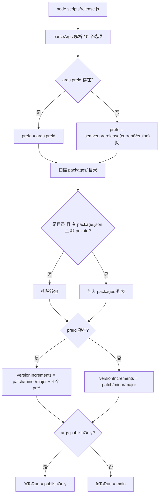
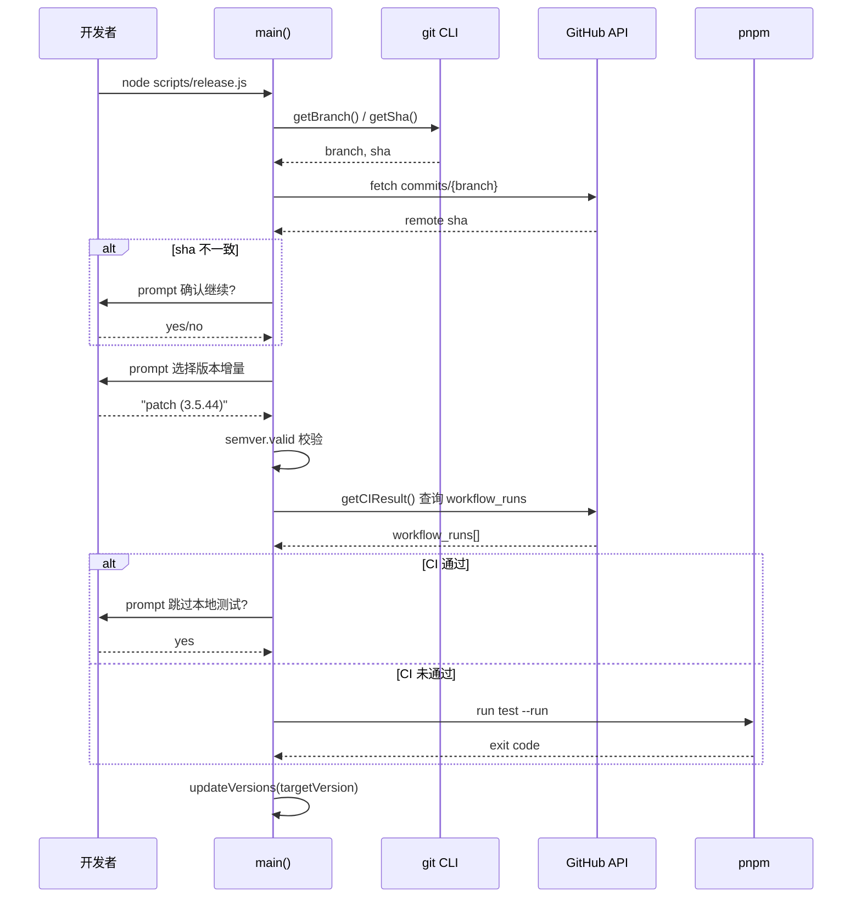
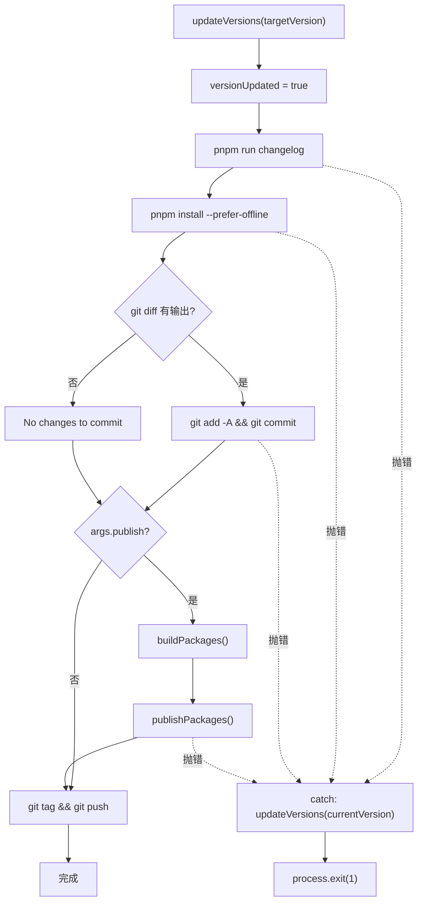

# 第 9 章：リリース自動化：release.jsのステートマシンとインタラクティブ編成

前の章ではtemplate-explorerを活用してコンパイラの動作を逆推し、ツールで内部メカニズムを観察する方法論を習得しました。今度は、視点をコンパイル時からリリース時へと移します——これはすべてのオープンソースプロジェクトにとって最も危険な瞬間です。バージョン番号、ビルド成果物、Git履歴、npm registryという4つの不可逆な外部システムに同時に触れるからです。一度の誤ったnpm publishは取り消せず、一度の誤ったタグプッシュはすべての下流ユーザーの依存解決を汚染します。Vue coreは537行のscripts/release.jsでこの危険を飼いならしています——それは純粋な自動化スクリプトでも、純粋な手動チェックリストでもなく、インタラクティブなステートマシンです：重要なポイントでは立ち止まって人に尋ね、予測可能なポイントでは完全自動で実行し、どのステップで失敗してもバージョン番号を開始点にロールバックします。本章ではこのオーケストレーターの3つの中核メカニズムを分解します：引数解析と状態初期化、インタラクティブなバージョン決定とCIゲート、そしてリリース順序と失敗時のロールバックです。

# 引数解析とグローバル状態の初期化

## 直感モデル

`release.js`を古い式の洗濯機のコントロールパネルとして想像してください：ノブ（`parseArgs`）はどのモードを使うかを決め、インジケーターランプ（グローバル変数）は現在どの段階にあるかを記録し、「キャンセル」ボタン（エラー処理）はマシンを給水前の状態に戻せなければなりません。この初期化ロジックがなければ、スクリプトは「ユーザーが実際にどのバージョンをリリースしたいのか」という問題で制御を失います——間違ったバージョン番号をリリースするか、CIで永遠に来ないキーボード入力を待ってスタックするかのどちらかです。

## フラグとグローバル状態のメモリレイアウト

> **[Design Inference & Architectural Trade-offs]**
> スクリプト起動後の最初の処理は、コマンドライン引数を構造化オブジェクトに解析することです。ここではNode組み込みの`parseArgs`を使用しており、`yargs`や`commander`ではありません——これはサードパーティ依存を排除するためです。なぜなら、リリーススクリプト自体はどのような環境でも動作する必要があり、`node_modules`が半分しかインストールされていない場合でも同様です。

[FACT:scripts/release.js:27-62]は10個のオプションを定義しており、4つのカテゴリに分類できます：

- **バージョンセマンティクス類**：`preid`（プレリリース識別子、例：`alpha`/`beta`/`rc`）、`tag`（npm dist-tag）
- **スキップ類**：`skipBuild`、`skipTests`、`skipGit`、`skipPrompts`——これら4つのブールスイッチが「自動化の度合い」を調整するノブを構成します
- **実行モード類**：`dry`（ドライラン）、`publish`（ローカルで直接公開するかどうか）、`publishOnly`（公開のみでバージョン更新なし）
- **ターゲット類**：`registry`（カスタムregistryアドレス）

注意すべきは`publish`のデフォルト値が`false` [FACT:scripts/release.js:51-54]であり、他のブール項目にはデフォルト値がない（つまり`undefined`）ことです。この非対称性は意図的です：`publish`のセマンティクスは「ローカルでnpm publishを実行するかどうか」であり、デフォルトでは公開せず、公開アクションをGitHub Actionsに委ねます。一方、`skipXxx`のデフォルト`undefined`は「未指定」を意味し、後続のロジックで「ユーザーが明示的に`--skipTests`を渡した」場合と「ユーザーが渡さなかった」場合を区別します。

解析完了後、スクリプトはパラメータをモジュールレベルの変数群に展開します[FACT:scripts/release.js:64-66]：

```js
const preId = args.preid || semver.prerelease(currentVersion)?.[0]
const isDryRun = args.dry
let skipTests = args.skipTests
const skipBuild = args.skipBuild
const skipPrompts = args.skipPrompts
const skipGit = args.skipGit
```

ここには興味深い設計が2点あります。第一に、`preId`の値の優先順位は「コマンドラインでの明示的指定 > 現在のバージョン番号からの推論」[FACT:scripts/release.js:64-66]です。もし現在の`package.json`のバージョンが`3.5.0-beta.1`であれば、`semver.prerelease`は`['beta', 1]`を返し、`[0]`を取ると`'beta'`になります。これは、betaブランチで連続してリリースする際に、毎回`--preid beta`を入力する必要がないことを意味します。第二に、`skipTests`は`let`で宣言されていますが、他は`const` [FACT:scripts/release.js:64-66]を使用しています。なぜなら、それは`runTestsIfNeeded`内でCI結果によって動的に書き換えられるからです——これは「遅延決定」の状態ビットです。

続いてパッケージ発見ロジック[FACT:scripts/release.js:68-83]です：`packages/`ディレクトリを読み取り、非ディレクトリ項目、`package.json`を持たない項目、および`private: true`のパッケージをフィルタリングします。ここで読み取るのは`packages/`であり、`packages-private/`ではないことに注意してください——後者は内部デバッグパッケージであり、決して公開されません。

## 公開順序のソートアルゴリズム

[FACT:scripts/release.js:85-85]は一見単純でありながら極めて重要な関数を定義しています：

```js
const sortPackagesForPublishing = (packageNames) => [
  ...packageNames.filter(p => p !== 'vue'),
  ...packageNames.filter(p => p === 'vue'),
]
```

これは`vue`というエントリパッケージを最後に配置します。コメント[FACT:scripts/release.js:85-85]がその理由を説明しています：もし先に`vue`を公開すると、ユーザーは`@vue/runtime-core`などの内部パッケージがまだ公開されていない段階で新しい`vue`をインストールできてしまい、npmは一致する内部依存を見つけられずエラーを報告します。これは「公開の原子性」をnpmエコシステム下で妥協した解決策です——npmにはクロスパッケージトランザクションがなく、順序によって原子性に近づけるしかありません。

## バージョン増分候補セットの動的構築

[FACT:scripts/release.js:111-116]はインタラクティブメニューの候補項目を構築します：

```js
const versionIncrements = [
  'patch', 'minor', 'major',
  ...(preId ? ['prepatch', 'preminor', 'premajor', 'prerelease'] : []),
]
```

これは条件付き展開です：`preId`が存在する場合（つまり現在プレリリースチャネルにあるか、ユーザーが明示的に`--preid`を指定した場合）にのみ、プレリリース関連の増分タイプをメニューに追加します。もし現在が安定版`3.5.43`で`preid`が指定されていない場合、メニューには`patch/minor/major`の3項目のみです——ユーザーが誤操作で安定版を`3.5.44-0`のような中途半端なプレリリースバージョンにすることを避けます。

`inc`関数[FACT:scripts/release.js:120-120]は`semver.inc`をラップし、`preId`を第3引数として渡します。ここに型防御があります：`typeof preId === 'string' ? preId : undefined`——なぜなら`preId`は`string | undefined`の可能性があり、`semver.inc`は`string | undefined`を期待するため、この三項式はTSの型絞り込みを満たすためです。

## 実行プリミティブ：runとdryRunの二重トラック制

[FACT:scripts/release.js:122-123]は本章で最も精巧な設計の一つです：

```js
const run = async (bin, args, opts = {}) =>
  exec(bin, args, { stdio: 'inherit', ...opts })
const dryRun = async (bin, args, opts = {}) =>
  console.log(pico.blue(`[dryrun] ${bin} ${args.join(' ')}`), opts)
const runIfNotDry = isDryRun ? dryRun : run
```

`run`は子プロセスのstdioを`inherit`に設定し、ビルド/テストの出力を直接ターミナルに透過させます——これは長時間実行されるビルドにとって極めて重要で、ユーザーはリアルタイムの進捗を確認できます。`dryRun`はコマンドを印刷するだけで実行しません。`runIfNotDry`は「戦略選択」です：モジュールロード時に既に関数ポインタを`dryRun`または`run`にバインドし、後続のすべての呼び出し箇所で`isDryRun`。

> **[Design Inference & Architectural Trade-offs]**
> この「初期化時に戦略を決定する」パターンは「各呼び出し箇所で判断する」よりもエラーが発生しにくいです：もしある呼び出し箇所で`isDryRun`の判断を忘れると、ドライランモードで実際に副作用が実行されてしまいます。しかし`runIfNotDry`は判断を一箇所に集中させ、このような漏れの可能性を排除します。



---

# インタラクティブなバージョン決定とCIゲート

## 直感的モデル

この段階は空港の保安検査のようなものです：まず搭乗券を確認し（ローカルコミットがリモートと同期しているか）、次にどこへ行くかを確認し（バージョン番号）、最後に保安検査を通過したかチェックします（CIが通過したか）。いずれかの段階で失敗すると、プロセス全体が中止されます。このゲートがなければ、プッシュされていないローカルコミットにタグが付けられて公開され、npm上のバージョンに対応するソースコードがGitHub上に存在しない可能性があります——これは最もトラブルシューティングが困難なリリース事故です。

## 同期チェックとバージョン選択

`main`関数の最初の処理は`isInSyncWithRemote()` [FACT:scripts/release.js:141-141]です。この関数[FACT:scripts/release.js:337-363]のロジックは：現在のブランチ名を取得し、GitHub APIにリクエストしてそのブランチの最新コミットSHAを取得し、ローカルの`git rev-parse HEAD`と比較します。もし一致しなければ、赤い警告の確認ダイアログ[FACT:scripts/release.js:348-355]を表示し、ユーザーが続行するかどうかを決定します。もしAPIリクエストが失敗した場合（ネットワーク問題、トークンなし）、直接`false`を返し[FACT:scripts/release.js:365-367]。

> **[Design Inference & Architectural Trade-offs]**
> 〔設計推論とアーキテクチャのトレードオフ〕

ここでの設計哲学は「失敗即中止」です：ネットワーク異常時には、状態が不明なまま続行するリスクを冒すよりも、公開しない方を選びます。なぜなら公開は不可逆であり、スクリプトを再実行するコストは非常に低いからです。`node scripts/release.js 3.6.0`），`targetVersion`バージョン番号の決定には2つのパスがあります。もしユーザーがコマンドラインで位置引数を渡した場合（例：[FACT:scripts/release.js:141-141]は直接その値を取ります[FACT:scripts/release.js:152-176]。そうでなければインタラクティブメニュー`custom`に入ります：まずユーザーに増分タイプを選択させ、もし

を選んだ場合はさらに入力ボックスを表示してユーザーにバージョン番号を手入力させます。[FACT:scripts/release.js:174]注意

```js
targetVersion = release.match(/\((.*)\)/)?.[1] ?? ''
```

コピー`patch (3.5.44)`メニュー項目の形式は`custom`であり、この正規表現は括弧内から実際のバージョン番号を抽出します。もしユーザーが[FACT:scripts/release.js:164-172]。

を選んだ場合、別の分岐[FACT:scripts/release.js:178-182]を通ります`targetVersion`その後「二次解析」ロジック`patch`/`minor`この種の増分キーワード（ユーザーが直接渡す可能性がある`node release.js minor`）は、`inc`を呼び出して具体的なバージョン番号に変換します。最後に`semver.valid`で[FACT:scripts/release.js:184-186]を検証し、不正なバージョン番号は直接エラーをスローします。

## CIゲート：runTestsIfNeededの三態ロジック

これは章全体で最も複雑な制御フローです。[FACT:scripts/release.js:281-317]の`runTestsIfNeeded`は実際には三態決定マシンです：

**状態1：ユーザーが明示的に`--skipTests`**。`skipTests`を渡した場合、初期値は`true`で、関数本体全体をスキップし、「Tests skipped.」と出力します。[FACT:scripts/release.js:314-316]。

**状態2：スキップされておらず、かつCIが通過済み**。スクリプトは`getCIResult()` [FACT:scripts/release.js:319-335]を呼び出し、GitHub Actions APIにリクエストして、`ci`という名前で`conclusion === 'success'`のworkflow runが存在するか確認します[FACT:scripts/release.js:319-335]。通過していれば、ユーザーに「CI已通过，是否跳过本地测试？」と尋ねます[FACT:scripts/release.js:288-295]。ユーザーが`--skipPrompts`を有効にしていれば、ローカルテストを自動スキップします[FACT:scripts/release.js:296-298]。

**状態3：スキップされておらず、かつCIが未通過**。`--skipPrompts`が有効なら、直接エラーをスローします[FACT:scripts/release.js:299-304]：

```js
throw new Error(
  'CI for the latest commit has not passed yet. ' +
    'Only run the release workflow after the CI has passed.',
)
```

有効でなければ、`--skipPrompts`は`skipTests`のまま保持され、最後のローカルテスト分岐に落ちます`undefined`、[FACT:scripts/release.js:307-313]を実行します`pnpm run test --run`。

ここに微妙な詳細があります[FACT:scripts/release.js:285]：

```js
skipTests ||= isCIPassed
```

`||=`は論理OR代入です：`skipTests`が偽値（`undefined`または`false`）の場合のみ`isCIPassed`を代入します。つまり、ユーザーが明示的に`--skipTests`（`true`を渡した場合、この行はそれを変更しません；ユーザーが渡さなかった場合（`undefined`）、CI結果を設定します。しかし直後に[FACT:scripts/release.js:287-298]がCI通過時に再代入します——したがって`||=`この行の実際の効果は「CIが未通過の場合、`skipTests`を`false`に設定する」ことであり、それにより後続の`if (!skipTests)`分岐でローカルテストが実行されます。

> **[Design Inference & Architectural Trade-offs]**
> このロジックは回りくどいですが、本質的には「CI通過 → ローカルテストをスキップ可能（ただしユーザーに確認）；CI未通過 → ローカルテストを必ず実行（ユーザーが明示的にスキップを要求しない限り）」を表現したいのです。`||=`に後続の上書きを加える書き方はコンパクトですが可読性が低く、典型的な「状態ビットが複数箇所で変更される」コードスメルです。



## バージョン番号の書き込み：updateVersionsの走査

[FACT:scripts/release.js:377-384]の`updateVersions`は2つのことを行います：ルート`package.json`を更新し、すべてのサブパッケージを走査して`updatePackage`。`updatePackage` [FACT:scripts/release.js:391-398]を呼び出してJSONを読み取り、`name`と`version`を書き換え、`JSON.stringify(pkg, null, 2) + '\n'`で書き戻します——末尾の`\n`に注意してください。これはファイルが改行で終わることを保証し、git diffで「No newline at end of file」が表示されるのを避けるためです。

`getNewPackageName`パラメータのデフォルトは`keepThePackageName` [FACT:scripts/release.js:105]、つまりパッケージ名を変更しません。このパラメータの存在は「カスタムregistryに公開する際にパッケージをリネームする」シナリオをサポートするためです——現在の呼び出し箇所はすべてデフォルト値を渡していますが、インターフェースは拡張性を確保しています。

---

# 公開順序、冪等性、失敗時のロールバック

## 直感的モデル

この段階はドミノ倒しのようなものです：`updateVersions`最初の牌（バージョン番号の変更）を倒すと、後続のchangelog、lockfile、commit、tag、publishが順に倒れます。途中で牌が詰まった場合、既に倒れた牌を起こす仕組みが必要です——そうでなければリポジトリは「バージョン番号は変更されたが公開されていない」中途半端な状態に留まります。

## 冪等公開：isPackagePublishedとエラーフォールバック

> **[Design Inference & Architectural Trade-offs]**
> `publishPackage` [FACT:scripts/release.js:439-489]は公開の核心です。まずdist-tag[FACT:scripts/release.js:442-451]を決定します：`--tag`パラメータを優先し、そうでなければバージョン番号内の`alpha`/`beta`/`rc`キーワードから推論します。ここでは`version.includes('alpha')`ではなく`semver.prerelease`を使用していることに注意——バージョン番号が`3.5.0-alpha.1`，`includes`の形式である可能性があり、十分シンプルで誤判定しないためです。

公開前に冪等性チェックがあります[FACT:scripts/release.js:453-458]：

```js
if (!isDryRun && (await isPackagePublished(packageName, version))) {
  console.log(pico.yellow(`Skipping already published: ${pkgVersion}`))
  alreadyPublishedPackages.push(pkgVersion)
  return
}
```

`isPackagePublished` [FACT:scripts/release.js:491-513]は`npm view <pkg>@<version> version`を実行し、成功すれば`true`を返し、E404系エラーなら`false`を返します。このチェックの意義は：公開フローはネットワーク中断で再実行される可能性があり、再実行時に既公開のパッケージを再度公開すべきではない（npmは重複バージョンを拒否する）ことです。

しかしチェック自体も失敗する可能性があります——例えば`npm view`がネットワークタイムアウトでE404以外のエラーをスローする場合です。このとき`isPackagePublished`はエラーを上位にスローし[FACT:scripts/release.js:507-510]、公開全体が中止されます。これは「危険を冒すより中止する」のもう一つの現れです。

チェックが通過しても、`pnpm publish`自体は競合（別のCIが同じバージョンを公開した）で失敗する可能性があります。そのため`publishPackage`はcatchブロックで二次フォールバックを行います[FACT:scripts/release.js:480-488]：

```js
} catch (e) {
  if (e.message?.match(/previously published/)) {
    console.log(pico.red(`Skipping already published: ${pkgVersion}`))
    alreadyPublishedPackages.push(pkgVersion)
  } else {
    throw e
  }
}
```

にマッチした場合のみ`previously published`エラーを飲み込み、その他のエラーはすべて再スローします。これは「精密なフォールトトレランス」です：既知の、安全に無視できるエラーのみを降格処理します。

## 公開フラグの動的組み立て

[FACT:scripts/release.js:412-432]は実行環境に応じて`pnpm publish`の追加フラグを組み立てます：

```js
const additionalPublishFlags = []
if (isDryRun) additionalPublishFlags.push('--dry-run')
if (isDryRun || skipGit || process.env.CI)
  additionalPublishFlags.push('--no-git-checks')
if (process.env.CI && !args.registry)
  additionalPublishFlags.push('--provenance')
```

`--no-git-checks`は3つの場合に有効化されます：dry run、gitスキップ、またはCI内。理由は`pnpm publish`がデフォルトでワークスペースがクリーンか、現在のブランチがリリースブランチかなどをチェックし、CI内ではこれらのチェックが誤報を出すためです。

`--provenance`はCIかつカスタムregistryが指定されていない場合のみ有効化されます[FACT:scripts/release.js:425-427]。provenanceはnpmのサプライチェーンセキュリティ機能で、ビルド成果物の出所情報（どのcommit、どのworkflow）を署名してパッケージに添付します。しかしカスタムregistry（内部プライベートregistryなど）は通常provenanceをサポートしないため、`!args.registry`の条件が追加されています。

## 失敗時のロールバック：versionUpdatedフラグ

の末尾に戻ります`main`コピー[FACT:scripts/release.js:528-537]：

```js
fnToRun().catch(err => {
  if (versionUpdated) {
    updateVersions(currentVersion)
  }
  console.error(err)
  process.exit(1)
})
```

`versionUpdated`、`false` [FACT:scripts/release.js:24-27]の呼び出し成功直後に`updateVersions`に設定されます。後続のいずれかのステップ（changelog生成、lockfile更新、git commit、publish）がエラーをスローした場合、catchブロックがこのフラグをチェックし、`true` [FACT:scripts/release.js:208]であればバージョン番号を`true`にロールバックします`currentVersion`。

> **[Design Inference & Architectural Trade-offs]**
> このロールバックは「ベストエフォート」である：それは`package.json`内のバージョン番号のみをロールバックし、changelog ファイル、lockfile、すでに実行された git commit はロールバックしない。エラーが git commit の後に発生した場合、リポジトリには「バージョン番号はロールバックされたが commit は存在する」という中間状態が残る。これは設計上のトレードオフである——完全なロールバックには`git reset`が必要だが、それはユーザーがすでに行った他の変更を破壊する可能性がある。そのためスクリプトは最も重要なバージョン番号のみをロールバックし、残りはユーザーが手動で処理することを選択している。

注意`publishOnly`パス[FACT:scripts/release.js:519-526]は`versionUpdated`を設定しない。そのセマンティクスは「公開のみ、バージョン変更なし」であるため——失敗してもロールバックは不要である。しかし`targetVersion`が存在する場合に`updateVersions` [FACT:scripts/release.js:519-526]を呼び出すため、この時失敗するとバージョン番号はロールバックされない。これは潜在的な境界問題であり、章末の思考問題を参照。



## 公開順序と vue パッケージの特別な処理

`publishPackages` [FACT:scripts/release.js:412-432]は`sortPackagesForPublishing(packages)`の結果を走査し、順番に`publishPackage`を呼び出す。ソートにより`vue`が最後に配置されるため[FACT:scripts/release.js:85-85]、公開シーケンス全体で内部パッケージが先に公開されることが保証される。

`publishPackage`は内部的に`cwd: getPkgRoot(pkgName)` [FACT:scripts/release.js:475]を使って作業ディレクトリをサブパッケージディレクトリに切り替えるため、`pnpm publish`はルートパッケージではなくサブパッケージを公開する。コメント[FACT:scripts/release.js:462-463]は特に「npm publish に変更しないでください」と注意している——なぜなら`pnpm publish`は`workspace:*`依存プロトコルを正しく処理し、実際のバージョン番号に変換できるが、`npm publish`は`workspace:*`をそのまま保持してインストール失敗を引き起こすからである。

---

# 設計上の考察

**なぜ`parseArgs`ではなく`yargs`？**を使うのか 公開スクリプトは「最後の防衛線」であり、どのような環境でも実行可能でなければならない。サードパーティの CLI ライブラリが依存ツリーの破損により読み込みに失敗すると、公開プロセス全体が麻痺する。Node 組み込みの`parseArgs`は機能が貧弱（サブコマンド非対応、自動 help 非対応）だが、ゼロ依存、ゼロリスクである。

**なぜ`publish`をデフォルトで`false`？**に設定するのか Vue の正式リリースは GitHub Actions 経由で行われるため（[FACT:scripts/release.js:256-263]のヒントメッセージを参照）、ローカルスクリプトはバージョン番号の変更、changelog の生成、タグ付け、プッシュのみを担当する。実際の`npm publish`は CI で実行され、CI の provenance 署名と制御された環境を活用できる。`--publish`フラグはメンテナーが緊急時にローカルで公開するための脱出ハッチである。

**なぜロールバックはバージョン番号のみをロールバックするのか？**完全なロールバックには「どの変更がスクリプトによるものか、どの変更がユーザーによるものか」を理解する必要があるが、これは git レベルでは区別できない。スクリプトは自分が変更したと最も確信できるもの——`package.json`のバージョン番号——のみをロールバックし、残りはユーザーの判断に委ねることを選択している。

---

# 本章のまとめ

`scripts/release.js`は 537 行のコードで「対話型ステートマシン」を実装しており、その核心設計は三点に集約できる：

1. **パラメータ即ポリシー**：10 個のフラグがモジュール読み込み時に解析されグローバル変数に展開され、`runIfNotDry`が初期化時にポリシーをバインドし、呼び出し箇所での判断漏れを防ぐ。

2. **ゲート前置**：同期チェック、バージョン検証、CI ゲートはすべて副作用が発生する前に完了し、「すべてやるか、まったくやらないか」を保証する。

3. **精密なフォールトトレランス**：`isPackagePublished`事前チェック +`previously published`エラーフォールバックが二重の冪等性保護を構成し、`versionUpdated`フラグが最小限のロールバックを実現する。

このメカニズムは前章の Template Explorer と興味深い対照をなしている：Template Explorer は「観察」——コンパイラの内部状態を可視化する；release.js は「実行」——公開プロセスの各ステップの状態を明示化する。両者とも同じエンジニアリング哲学を体現している：**暗黙的な状態を明示的な状態に変え、制御不能な副作用を制御可能なステップに変える**。

# 本章の考察とセルフチェック

Q1:[FACT:scripts/release.js:285]の`skipTests ||= isCIPassed`を`skipTests = isCIPassed`に変更した場合、ユーザーが明示的に`--skipTests`を渡し、かつ CI が通過しなかった場合に何が起こるか？なぜか？

**参考解析**：元のロジックでは、ユーザーが`--skipTests`を渡すと`skipTests`は初期値`true` [FACT:scripts/release.js:64-66]，`||=`のままで変更されないため、`runTestsIfNeeded`は[FACT:scripts/release.js:282]の`if (!skipTests)`で偽と判定され、直接[FACT:scripts/release.js:314-316]にジャンプして "Tests skipped." を出力する。もし`skipTests = isCIPassed`に変更すると、`skipTests`は強制的に`false`に設定され（CI 未通過）、その後[FACT:scripts/release.js:287]の`if (isCIPassed)`が偽となり、[FACT:scripts/release.js:299]の`else if (skipPrompts)`に到達する——もし`--skipPrompts`が有効でなければ、`skipTests`は`false`のままとなり、最終的に[FACT:scripts/release.js:307-313]でローカルテストが実行される。これはユーザーの「明示的にテストをスキップする」意図に反し、CI 環境（`--skipPrompts`）では直接エラー[FACT:scripts/release.js:300-303]をスローし、公開が中止される。`||=`の存在はまさにユーザーの明示的な選択を尊重するためである。

Q2: `publishOnly`パス[FACT:scripts/release.js:519-526]は`targetVersion`が存在する場合に`updateVersions`を呼び出すが、`versionUpdated`を設定しない。この時`buildPackages`または`publishPackages`がエラーをスローすると何が起こるか？この設計は妥当か？

**参考解析**：`publishOnly`は`updateVersions(targetVersion)` [FACT:scripts/release.js:519-526]を呼び出してすべての`package.json`のバージョン番号を変更したが、`versionUpdated = true`を設定していない。後続の`buildPackages` [FACT:scripts/release.js:519-526]または`publishPackages` [FACT:scripts/release.js:519-526]がエラーをスローすると、`fnToRun().catch` [FACT:scripts/release.js:528-537]は`versionUpdated`が`false`であることを確認し、バージョン番号をロールバックしない。結果としてリポジトリは「バージョン番号は変更されたが公開が失敗した」状態に留まる。この設計は`publishOnly`の元のセマンティクス（公開のみ、バージョン変更なし）の下では合理的である——なぜなら`targetVersion`は通常渡されず、`updateVersions`は実行されないからである。しかしユーザーが`targetVersion`を渡した場合、このパスにはロールバックの脆弱性が存在する。修正方法は[FACT:scripts/release.js:519-526]の後に`versionUpdated = true`を追加するか、`publishOnly`に`main`のロールバックロジックを再利用させることである。

Q3: `isPackagePublished` [FACT:scripts/release.js:491-513]は`npm view`を使ってパッケージが公開済みかどうかをチェックする。ネットワークタイムアウトにより`npm view`が E404 以外のエラーをスローした場合、何が起こるか？この動作は CI 再実行シナリオで安全か？

**参考解析**：`isPackagePublished`は catch ブロック内で[FACT:scripts/release.js:507-510]を呼び出して`isPackageNotFoundError`エラータイプを判定する。この関数[FACT:scripts/release.js:515-515]は`/E404|No match found|No matching version|notarget/i`のみにマッチする。ネットワークタイムアウトエラーの message にはこれらのキーワードが含まれないため、`isPackageNotFoundError`は`false`，`isPackagePublished`を返し[FACT:scripts/release.js:507-510]エラーを再スローする。このエラーは上方に伝播し`publishPackage` [FACT:scripts/release.js:453]その結果、リリース全体が中止される。CI 再実行のシナリオでは、これは「パッケージは公開済みなのに、ネットワークの揺らぎで中止される」という事態を招く——しかしこれは安全な失敗方向である。中止は「未公開」と誤判定して重複公開するより良い。重複公開は npm の`previously published`エラーを引き起こし、[FACT:scripts/release.js:491-492]によってフォールバックされるが、ネットワーク往復を1回無駄にする。したがって「ネットワークエラー即中止」は保守的だが正しい選択である。

---

次の章では`.github/workflows/`に入り、release.js が tag をプッシュした後、GitHub Actions がどのように後続のビルドと公開を引き継ぐか、そして CI ゲートの完全な実装を見ていく。

ここまでで、release.js が状態機械と対話的なオーケストレーションによって、不可逆なリリースリスクを最小化する方法が明らかになった。しかしリリーススクリプト自体は単なる実行者にすぎず、いつトリガーし、どのような条件で通過させるかを実際に決定するのは、より上位の自動化された門番である。次の章では .github/workflows ディレクトリ配下の CI/CD 体系を分析する：ci.yml が PR 段階で lint/typecheck/test の三重ゲートをどのように実行するか、release.yml が tag プッシュ時にどのようにリリースをトリガーするか、size-report.yml と size-data.yml がどのようにバンドルサイズのリグレッションを追跡するか、autofix.yml がどのようにフォーマット問題を自動修正するか。Vue が GitHub Actions を用いて、エンジニアリング規範を回避不可能なパイプラインとしてどのように固化しているかを理解できるだろう。
