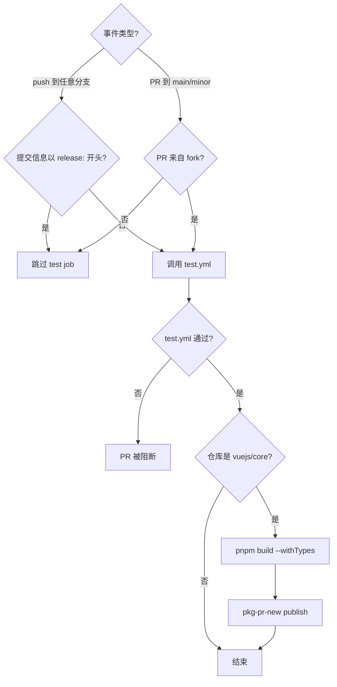
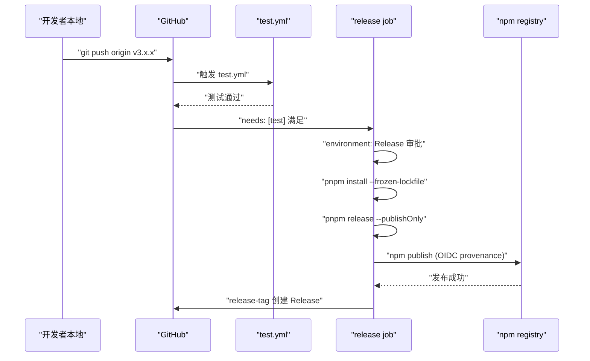
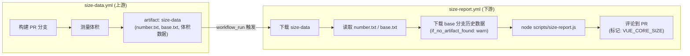

# 第 10 章：CI/CD ワークフロー：PR から Release までの自動化された門番

前の章では`scripts/release.js`が対話的な状態機械を用いて、1回のリリースの各ステップをどのようにつなげるかを見た。しかしそのスクリプトには前提がある：誰か、あるいは何らかのシステムによって能動的に呼び出されなければならない。Vue core リポジトリにおいて、この能動的な呼び出し元はメンテナのローカル端末ではなく、GitHub Actions である。release.js は実行者であり、workflows は意思決定者である——どのイベントがどのタスクをトリガーするか、どの条件で通過させ、どの条件でブロックするかを決定する。本章は`.github/workflows/`ディレクトリ配下の4つのファイルに焦点を当てる：`ci.yml`（PR ゲートと継続的プレリリース）、`release.yml`（tag トリガーによる正式リリース）、`size-report.yml`（バンドルサイズのリグレッションレポート）、`autofix.yml`（フォーマットの自動修正）。それらの核心を理解するとは、YAML 構文を覚えることではなく、Vue チームがエンジニアリング規範を回避不可能なパイプライン制約へとどのように翻訳しているかを見極めることである。

# 一、ci.yml：三重ゲートと継続的プレリリース

## 直感的モデル

`ci.yml`を空港の保安検査場と想像してほしい。すべての PR はこのゲートを通らなければならない：lint は荷物に禁止物品がないか検査し、typecheck は身分証が本物で有効かを確認し、test は危険物を持ち込んでいないかを検証する。しかし保安検査場は1つだけではない——Vue はここに「継続的プレリリース」チャネルも設けており、各 PR のビルド成果物を直接 pkg-pr-new に公開し、コントリビューターが実際の npm インストールシナリオで自分の変更を検証できるようにしている。

もしこのゲートがなければ、あらゆるマージがフォーマットエラー、型の穴、あるいは動作のリグレッションを main ブランチに持ち込みうる。そして main ブランチは、その後のすべての release の源流である。

## トリガー条件と並行制御

`ci.yml`のトリガー設定は、1行ずつ分解する価値がある。

[FACT:.github/workflows/ci.yml:2-11]

```yaml
on:
  push:
    branches:
      - '**'
    tags:
      - '!**'
  pull_request:
    branches:
      - main
      - minor
```

ここには2つの重要な設計がある。第一に、`push`イベントはすべてのブランチ（`'**'`）を監視するが、`tags: ['!**']`によってすべての tag プッシュを明示的に除外している。なぜ tag を除外するのか？ tag プッシュは`release.yml`が単独で処理するため、もし`ci.yml`も tag に反応すると、リリースフローと CI フローが重複してトリガーされ、runner リソースを浪費し、さらには競合状態を生むからである。第二に、`pull_request`は`main`と`minor`の2つのブランチのみを監視する——これは Vue のデュアルブランチ戦略である：`main`は安定版を担い、`minor`はプレリリース版を担う。

[FACT:.github/workflows/ci.yml:22-22]

```yaml
concurrency:
  group: ${{ github.workflow }}-${{ github.event.pull_request.number || github.ref }}
  cancel-in-progress: ${{ github.event_name == 'pull_request' }}
```

並行制御はここで最も巧妙な一手である。`group`の式は`github.event.pull_request.number || github.ref`を fallback として用いる：PR イベントは PR 番号をグループキーとし、push イベントは ref（ブランチ名）をグループキーとする。これは同じ PR の複数回のプッシュが同じ並行グループに落ちることを意味する。そして`cancel-in-progress`は PR イベントのときのみ`true`となる——3回連続でコミットをプッシュすると、最初の2回の CI は自動的にキャンセルされ、最新の1回だけが保持される。

> **[Design Inference & Architectural Trade-offs]**
> この設計の動機は明確である：PR 段階では開発者が頻繁にプッシュし、古いコミットの CI 結果はすでに無意味であり、それらをキャンセルすることで大量の runner 時間を節約できる。しかし main ブランチへの push はキャンセルできない——main 上の各 push はリリース前の最後の検証でありうるため、キャンセルすると検証の欠落を招くからである。

## 三重ゲートの入口：test job の条件判定

[FACT:.github/workflows/ci.yml:22-22]

```yaml
jobs:
  test:
    if: ${{ ! startsWith(github.event.head_commit.message, 'release:') && (github.event_name == 'push' || github.event.pull_request.head.repo.full_name != github.repository) }}
    uses: ./.github/workflows/test.yml
```

この`if`条件は2つの論理積（`&&`）の分岐を含み、それぞれを展開する価値がある。

最初の条件`! startsWith(github.event.head_commit.message, 'release:')`：コミットメッセージが`release:`冒頭で、テストをスキップします。これはまさに前章の release.js がプッシュしたコミットメッセージの形式です——release.js はローカルで既に完全なテストを実行済みであり、CI は重複検証する必要がありません。これは「上流を信頼する」最適化です。

> **[Design Inference & Architectural Trade-offs]**
> 2つ目の条件`(github.event_name == 'push' || github.event.pull_request.head.repo.full_name != github.repository)`：push イベントは常にテストを実行し；PR イベントは PR が fork からの場合を要求します（`head.repo.full_name != github.repository`）。なぜ fork の PR のみ実行するのか？ 同一リポジトリのブランチの PR は通常コアチームメンバーが作成し、彼らのブランチプッシュは既に push イベントの CI をトリガーしているからです。一方、fork の PR は push イベントをトリガーしません（fork の push は上流リポジトリに通知されない）。そのため、PR イベントで補完実行する必要があります。

注意`uses: ./.github/workflows/test.yml`——これは reusable workflow の呼び出しです。`test.yml`は独立した workflow ファイルであり、`ci.yml`と`release.yml`で共有されています。この再利用により、複数の workflow で lint/typecheck/test のステップを重複定義することを避けています。

## 継続的プレリリース：pkg-pr-new の役割

[FACT:.github/workflows/ci.yml:25-51]

```yaml
continuous-release:
  if: github.repository == 'vuejs/core'
  runs-on: ubuntu-latest
  steps:
    - name: Checkout
      uses: actions/checkout@3d3c42e5aac5ba805825da76410c181273ba90b1 # v7.0.1
      with:
        persist-credentials: false
    # ... 安装 pnpm、Node.js、依赖 ...
    - name: Build
      run: pnpm build --withTypes
    - name: Release
      run: pnpx pkg-pr-new publish --compact --pnpm './packages/*' --packageManager=pnpm,npm,yarn
```

`continuous-release`job は`vuejs/core`メインリポジトリでのみ実行され（`if: github.repository == 'vuejs/core'`）、fork では実行されません。それは3つのことを行います：ビルド（`pnpm build --withTypes`、型宣言付き）、次に`pkg-pr-new`を使って`./packages/*`以下のすべてのパッケージを一時的な npm registry に公開します。

> **[Design Inference & Architectural Trade-offs]**
> このメカニズムの価値は：コントリビューターが自分のプロジェクトで直接`npm install`この PR のビルド成果物を利用し、変更が本当に問題を解決したかを検証できることです。これは「CI がグリーンになったのを見る」よりも説得力があります。なぜなら、実際のパッケージ消費シナリオを検証しているからです。

すべての action が commit SHA をロックしていることに注意してください（例`actions/checkout@3d3c42e5...`）。これは`@v4`のような浮動タグを使用するのではなく。これはサプライチェーンセキュリティの厳格な要件です——action リポジトリが侵害された後に悪意のあるコードが自動的に流入するのを防ぎます。

## ci.yml 制御フロー図



---

# 二、release.yml：tag プッシュ後のリリースオーケストレーション

## 直感的モデル

もし`ci.yml`がセキュリティチェックポイントなら、`release.yml`は発射台です。release.js がローカルでバージョン番号の更新、コミット、タグ付け、プッシュを完了した後、tag プッシュイベントが`release.yml`のエンジンに点火します。それはまず完全なテストを実行し（再確認）、次に保護された`Release`環境で`pnpm release --publishOnly`を実行し、最後に GitHub Release を作成します。

もしこれがなければ、release.js がプッシュした tag は単なる Git 参照に過ぎず、npm に新しいバージョンはなく、GitHub に Release ページもありません。

## トリガー条件：tag のみを認識

[FACT:.github/workflows/release.yml:3-6]

```yaml
on:
  push:
    tags:
      - 'v*' # Push events to matching v*, i.e. v1.0, v20.15.10
```

`v*`形式の tag プッシュのみを監視します。これは`ci.yml`の`tags: ['!**']`と補完関係にあります——両者は厳密に相互排他的で、同時にトリガーされることはありません。

## リリース job のガード条件

[FACT:.github/workflows/release.yml:8-21]

```yaml
jobs:
  test:
    uses: ./.github/workflows/test.yml

  release:
    if: github.repository == 'vuejs/core'
    needs: [test]
    runs-on: ubuntu-latest
    permissions:
      contents: write
      id-token: write
    environment: Release
```

ここには3層のガードがあり、各層は省略できません。

第1層`if: github.repository == 'vuejs/core'`：fork での誤ったリリーストリガーを防ぎます。もし誰かがリポジトリを fork して`v1.0.0`tag をプッシュした場合、この条件がリリースプロセスの実行を阻止します。

第2層`needs: [test]`：release job は test job に依存します。test job は`test.yml`を呼び出し、テストが失敗した場合、release job はまったく起動しません。これは「リリース前にテストを通過しなければならない」というハード制約です。

> **[Design Inference & Architectural Trade-offs]**
> 第3層`environment: Release`：これは GitHub Environment であり、デプロイ保護ルール（特定の人員の承認が必要など）を設定できます。これは、tag プッシュが workflow をトリガーしても、リリースステップが実行されるには手動承認が必要な場合があることを意味します——これは不可逆操作に対する最後の防衛線です。

権限に関して、`contents: write`は GitHub Release の作成に使用され、`id-token: write`は npm の provenance 認証（OIDC token）に使用されます。ここには`packages: write`がないことに注意してください。なぜなら Vue は GitHub Packages ではなく npm に公開するからです。

## リリースステップの完全なチェーン

[FACT:.github/workflows/release.yml:37-46]

```yaml
- name: Install deps
  run: pnpm install --frozen-lockfile

- name: Update npm
  run: npm i -g npm@latest

- name: Build and publish
  id: publish
  run: |
    pnpm release --publishOnly
```

> **[Design Inference & Architectural Trade-offs]**
> 3つのステップにはそれぞれ工夫があります。`--frozen-lockfile`は CI 環境が lockfile に厳密に従ってインストールし、依存バージョンのドリフトによってビルド成果物がローカルと不一致になることを防ぎます。`npm i -g npm@latest`は最新の npm CLI を取得するためです——provenance と OIDC 認証は比較的新しいバージョンの npm に依存しており、古いバージョンではこれらの機能がサポートされない可能性があるからです。

`pnpm release --publishOnly`は前章の release.js のエントリポイントです。`--publishOnly`フラグは release.js に伝えます：対話的なバージョン番号選択をスキップし、Git コミットとタグ付けをスキップし（tag は既に存在するため）、ビルドと npm publish のみを実行します。

## GitHub Release の作成

[FACT:.github/workflows/release.yml:48-57]

```yaml
- name: Create GitHub release
  id: release_tag
  uses: yyx990803/release-tag@8cccf7c5aa332d71d222df46677f70f77a8d2dc0 # v1.0.0
  env:
    GITHUB_TOKEN: ${{ secrets.GITHUB_TOKEN }}
  with:
    tag_name: ${{ github.ref }}
    body: |
      For stable releases, please refer to [CHANGELOG.md](...) for details.
      For pre-releases, please refer to [CHANGELOG.md](...) of the `minor` branch.
```

> **[Design Inference & Architectural Trade-offs]**
> ここでは Vue 作者の尤雨溪自身がメンテナンスする`release-tag` action。`tag_name: ${{ github.ref }}`を使用し、トリガーイベントの ref を直接使用します（つまり`refs/tags/v3.x.x`）。Release body には具体的な変更内容を書かず、CHANGELOG.md を指し示す——Vue の changelog は conventional-changelog によって自動生成されるため、Release body を手動で管理すると changelog と不一致が生じるからである。

## release.yml シーケンス図



---

# 三、size-report.yml と autofix.yml：サイズ追跡とフォーマット自己修復

## size-report.yml：ワークフロー横断のサイズ回帰レポート

`size-report.yml`のトリガー方法は非常に特殊である——push や PR によって直接トリガーされるのではなく、別の workflow の完了イベントによってトリガーされる。

[FACT:.github/workflows/size-report.yml:3-7]

```yaml
on:
  workflow_run:
    workflows: ['size data']
    types:
      - completed
```

`workflow_run`イベントリスナー名は`size data`の workflow 完了。これは二段階設計である：`size-data.yml`（本章ではソースコード未提供）が PR 上でビルドとサイズ測定を行い、結果を artifact としてアップロードする；`size-report.yml`が`size data`完了後に artifact をダウンロードし、レポートを生成して PR にコメントする。

[FACT:.github/workflows/size-report.yml:20-23]

```yaml
if: >
  github.repository == 'vuejs/core' &&
  github.event.workflow_run.event == 'pull_request' &&
  github.event.workflow_run.conclusion == 'success'
```

三重ガード：メインリポジトリ、PR イベント、上流 workflow の成功。もし`size data`が失敗した場合、レポート job は実行されない——報告すべきデータがないからである。

データフローは以下の通り：

[FACT:.github/workflows/size-report.yml:41-46]

```yaml
- name: Download Size Data
  uses: dawidd6/action-download-artifact@d63b86af1b34672e53c440b1b83979861906bad7 # v24
  with:
    name: size-data
    run_id: ${{ github.event.workflow_run.id }}
    path: temp/size
```

上流 workflow run から`size-data`artifact を`temp/size`にダウンロードする。その後、PR 番号と base ブランチを並行して読み取る：

[FACT:.github/workflows/size-report.yml:48-59]

```yaml
- parallel:
    - name: Read PR Number
      id: pr-number
      uses: juliangruber/read-file-action@271ff311a4947af354c6abcd696a306553b9ec18 # v1.1.8
      with:
        path: temp/size/number.txt
    - name: Read base branch
      id: pr-base
      uses: juliangruber/read-file-action@271ff311a4947af354c6abcd696a306553b9ec18 # v1.1.8
      with:
        path: temp/size/base.txt
```

`parallel`は GitHub Actions のシンタックスシュガーで、依存関係のない二つのステップを同時に実行させる。`number.txt`と`base.txt`は`size-data.yml`が測定時に書き込むメタデータファイルである。

次に base ブランチの履歴サイズデータを比較用にダウンロードする：

[FACT:.github/workflows/size-report.yml:61-69]

```yaml
- name: Download Previous Size Data
  uses: dawidd6/action-download-artifact@d63b86af1b34672e53c440b1b83979861906bad7 # v24
  with:
    branch: ${{ steps.pr-base.outputs.content }}
    workflow: size-data.yml
    event: push
    name: size-data
    path: temp/size-prev
    if_no_artifact_found: warn
```

注意`if_no_artifact_found: warn`——base ブランチにまだ履歴データがない場合（例えば新規ブランチ）、失敗せず警告のみとなる。これにより初回実行時でもレポートは生成され、比較ベースラインがないだけであることが保証される。

最後にレポートを生成してコメントする：

[FACT:.github/workflows/size-report.yml:71-89]

```yaml
- name: Prepare report
  run: node scripts/size-report.js > size-report.md

- name: Read Size Report
  id: size-report
  uses: juliangruber/read-file-action@271ff311a4947af354c6abcd696a306553b9ec18 # v1.1.8
  with:
    path: ./size-report.md

- name: Create Comment
  uses: actions-cool/maintain-one-comment-backup@fbbc22ad1809c1bcf46f19b58397b6254773588c # backup for v3.0.0
  with:
    token: ${{ secrets.GITHUB_TOKEN }}
    number: ${{ steps.pr-number.outputs.content }}
    body: |
      ${{ steps.size-report.outputs.content }}
      
    body-include: ''
```

`scripts/size-report.js`が`temp/size`と`temp/size-prev`配下のデータを読み取り、Markdown レポートを生成する。`maintain-one-comment-backup`action は`body-include: '<!-- VUE_CORE_SIZE -->'`をマーカーとして使用し、同一 PR 上にサイズレポートコメントが一つだけ保持されるようにする（追加ではなく更新）。L81 のコメントは元の action リポジトリが GitHub によってブロックされたため、バックアップリポジトリを使用し commit を固定したことを説明している。

## autofix.yml：フォーマット問題の自動修復

`autofix.yml`は非常に実用的な問題を解決する：コントリビューターが提出したコードのフォーマットが prettier/eslint 規約に準拠しておらず、CI がエラーを出し、コントリビューターが手動で`pnpm lint --fix`を実行して再提出する必要がある。この workflow はそのステップを自動化する。

[FACT:.github/workflows/autofix.yml:3-8]

```yaml
on:
  pull_request:

concurrency:
  group: ${{ github.workflow }}-${{ github.event.pull_request.number }}
  cancel-in-progress: ${{ github.event_name == 'pull_request' }}
```

すべての PR をトリガーし、並行制御は`ci.yml`と類似——同一 PR への新しいプッシュは古い autofix 実行をキャンセルする。

[FACT:.github/workflows/autofix.yml:35-41]

```yaml
- name: Run eslint
  run: pnpm run lint --fix

- name: Run prettier
  run: pnpm run format

- uses: autofix-ci/action@7a166d7532b277f34e16238930461bf77f9d7ed8
```

まず eslint の`--fix`を実行し、次に prettier でフォーマットし、最後に`autofix-ci/action`が修正されたファイルを直接 PR ブランチにコミットし戻す。注意`pnpm run format`自体がフォーマットコマンドである（`--fix`フラグは不要、なぜなら format スクリプト内部が`prettier --write`）。

> **[Design Inference & Architectural Trade-offs]**
> このメカニズムの鍵は`autofix-ci/action`が PR 作成者の身分で修正をコミットし、bot の身分ではないことである。これによりコントリビューターは追加操作が不要で、フォーマット修正が自動的に彼らの PR に現れる。しかしこれは、コントリビューターのブランチに保護ルールがある場合（bot のプッシュを許可しない）、autofix が失敗することを意味する——これはコントリビューターが手動で対処する必要があるエッジケースである。

## size-report データフロー図



---

# 設計思考：規範をパイプラインとして固化する

これら四つの workflow を振り返ると、一貫した設計原則がいくつか見えてくる。

**第一に、権限の最小化。** `ci.yml`と`autofix.yml`はともに`permissions: contents: read`を宣言し、`release.yml`のみが`contents: write`と`id-token: write`。`size-report.yml`が必要で`pull-requests: write`と`issues: write`がコメントを投稿する。各 workflow は本当に必要な権限だけを取得する。

**第二に、サプライチェーンセキュリティ。**すべてのサードパーティ action は commit SHA に固定され、浮動タグではない。`size-report.yml`L81 のコメントはさらに直接的に、元の action リポジトリがブロックされた後にバックアップリポジトリに切り替え commit を固定したことを説明している——これはサプライチェーン攻撃に対する実戦的防御である。

**第三に、責務の分離と再利用。** `test.yml`は`ci.yml`と`release.yml`に共有され、テストロジックの重複を避ける。`size-data.yml`と`size-report.yml`を分離し、測定と報告がそれぞれ独立して進化できるようにする。

**第四に、失敗方向の選択。** `size-report.yml`の`if_no_artifact_found: warn`は「失敗ではなく警告」を選択する。なぜなら履歴データの欠如は PR をブロックすべきではないからである。一方`release.yml`の`needs: [test]`は「テスト失敗即リリースブロック」を選択する。なぜならリリースは不可逆操作だからである。

**第五に、並行制御の差別化。**PR イベントは古い実行をキャンセルし（`cancel-in-progress: true`）、push イベントはキャンセルしない（`cancel-in-progress: false`）。この差異は二つのイベントのセマンティクスを反映している：PR の古いコミットはもはや無意味であり、push の各コミットは最終状態である可能性がある。

---

# 本章のまとめ

本章では Vue core リポジトリの四つのコア workflow を分析した：

- **`ci.yml`**：PR ゲート + 継続的プレリリース。`if`条件で push/PR と fork/同一リポジトリを区別し、`concurrency`で古い PR 実行をキャンセルし、`pkg-pr-new`でインストール可能なプレリリースパッケージを公開する。
- **`release.yml`**：tag によってトリガーされる正式リリース。三層のガード（リポジトリチェック、needs test、environment 承認）により、テストに合格し承認された tag のみが npm に公開される。
- **`size-report.yml`**：ワークフローを跨いだサイズ回帰レポート。`workflow_run`イベントを通じて上流の`size data`完了を監視し、artifact をダウンロードして base ブランチのデータと比較し、コメント形式で PR にフィードバックする。
- **`autofix.yml`**：フォーマットの自動修正。PR 上で eslint --fix と prettier を実行し、`autofix-ci/action`を通じて修正を直接 PR ブランチにコミットし戻す。

これら4つのワークフローは共に「迂回不可能なパイプライン」を構成している：コード規約は autofix により自動修正され、型とテストは ci.yml により強制チェックされ、サイズ回帰は size-report により追跡され、リリースは release.yml により多重ガードの下で実行される。

# 本章の考察とセルフチェック

Q1: もし`ci.yml`における`cancel-in-progress`の値を常に`true`に変更した場合（すなわち`github.event_name == 'pull_request'`の条件を削除した場合）、どのようなシナリオで問題が発生するか？

**参考解説**：`cancel-in-progress`が常に`true`であることは、main ブランチへの push 時に、新しい push が実行中の古い CI をキャンセルすることを意味する。次のシナリオを考えよう：main ブランチ上で2つの PR が連続してマージされ、最初の PR の CI が実行中（完全な lint/typecheck/test を含む）で、2番目の PR のマージが新しい CI 実行をトリガーした。もし`cancel-in-progress`が`true`であれば、最初の PR の CI はキャンセルされる——しかし最初の PR のコードはすでに main 上にあり、その CI 結果は main ブランチの健全性を判断するために極めて重要である。それをキャンセルすることは、main ブランチ上のコードの一部が完全に検証されたことがないことを意味する。一方、[FACT:.github/workflows/ci.yml:22-22]の条件`github.event_name == 'pull_request'`はまさにこの問題を回避するためのものである：PR イベントのみが古い実行をキャンセルし、push イベントは決してキャンセルしない。

Q2: `release.yml`における`release`job の`if: github.repository == 'vuejs/core'`と`environment: Release`はそれぞれどのようなシナリオを防御しているか？どちらかを削除するとどうなるか？

**参考解説**：`if: github.repository == 'vuejs/core'` [FACT:.github/workflows/release.yml:14]が防御しているのは fork シナリオである。もし誰かが vuejs/core を fork して`v3.99.0`tag を push した場合、この条件がなければ、ワークフローは fork リポジトリ内で`pnpm release --publishOnly`を実行する。fork リポジトリには npm token がなく実際には公開できないが、runner リソースを浪費し、誤解を招く失敗通知を生成する可能性がある。`environment: Release` [FACT:.github/workflows/release.yml:21]が防御しているのは「tag プッシュ後の自動リリース」のリスクである——これにより人的承認を設定でき、tag がプッシュされてもリリースにはメンテナーの確認が必要となる。もし`if`条件を削除すると、fork がリソースを浪費する；もし`environment`を削除すると、tag プッシュ権限を持つ誰もがリリースをトリガーでき、最後の人的確認ステップがなくなる。両者は異なるレベルの防御であり、互いに代替できない。

Q3: `size-report.yml`における`if_no_artifact_found: warn`の選択と`release.yml`における`needs: [test]`の選択は、それぞれどのような失敗方向の設計哲学を体现しているか？もしこれら2つの戦略を交換すると何が起こるか？

**参考解説**：`if_no_artifact_found: warn` [FACT:.github/workflows/size-report.yml:69]は「履歴データが欠如している場合に失敗ではなく警告する」を選択している。なぜならサイズレポートは補助情報であり、ブロック条件ではないからである。もし`fail`に変更すると、新しいブランチや初回実行の PR は base データが見つからず失敗するが、これは明らかに不合理である。`needs: [test]` [FACT:.github/workflows/release.yml:15]は「テスト失敗即リリースブロック」を選択している。なぜならリリースは不可逆操作であり、コード品質を確保しなければならないからである。もし交換すると——size-report がデータ欠如時に失敗し、release がテスト失敗時でもリリースする——前者は大量の誤検知で正常な PR をブロックし、後者は未テストのコードが npm に入り込む。これは「補助情報は寛容に、不可逆操作は厳格に」という失敗方向の設計原則を体现している。

---

次章ではサイズ予算メカニズムの核心に深く踏み込む：`scripts/size-report.js`がどのようにサイズデータを解析し、増分を計算し、出力をフォーマットするか、そして`usage-size`の測定哲学——なぜ Vue が「完全パッケージサイズ」ではなく「実際使用サイズ」を測定することを選んだのか。

PR ゲートから tag リリースまで、4つのワークフローファイルが共に迂回不可能な自動化ゲートチェーンを構成している。しかしパイプラインがマージをブロックできるのは、定量化可能な判断根拠を掌握している前提があってのことである。次章では Vue のパッケージサイズという核心指標に対するエンジニアリング的ガバナンスに焦点を当てる：`scripts/size-report.js`が各成果物の gzip 後サイズをどのように計算しベースラインと比較するか、`scripts/usage-size.js`が実際のユーザー導入シナリオをどのようにシミュレートして実際のオーバーヘッドを見積もるか、そして CI がサイズ超過時にどのようにマージをブロックするか。
