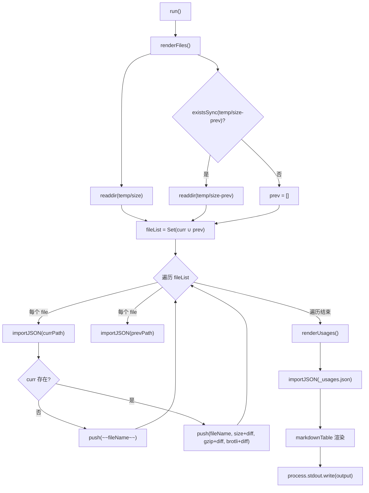
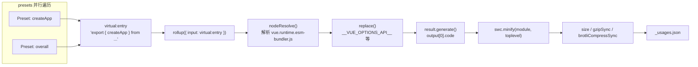

# 第 11 章：サイズ予算メカニズム：size-report と usage-size の測定哲学

前章で見たように、Vue は GitHub Actions を使って lint、型チェック、テスト、サイズ追跡を回避不可能なパイプラインとして固定化しています。その中で size-report.yml と size-data.yml が、変更のたびにサイズデータを残す役割を担っています。しかしパイプラインは実行するだけで、「どれだけ大きくなったか、どこが大きくなったか」に実際に答えるのは、本章で解き明かす2つのスクリプトです。サイズ予算の核心的な矛盾は、パッケージサイズが感知できても正確な帰属が難しい指標であるという点にあります。ユーザーが「Vue は大きすぎる」と不満を述べるとき、メンテナーは3つの問いに答える必要があります——どれだけ大きくなったか？どこが大きくなったか？今回の変更でさらに大きくなったか？scripts/size-report.js が比較を担当し、scripts/usage-size.js が帰属を担当し、両者が共にサイズ予算の測定哲学を構成しています。

# 11.1 size-report：サイズ差分を読みやすい Markdown テーブルに変える

## 直感的モデル

あなたが物流会社の品質検査員だと想像してください。各荷物（ビルド成果物）は出庫前に重量を測られますが、あなたの仕事は計量そのものではなく、「今日の重量」と「昨日の重量」を1つの表に並べ、太字の`+2.3 kB`でどの荷物が重くなったかを示すことです。この比較表がなければ、メンテナーは孤立した数字の山しか見えず、ある PR がサイズ回帰を導入したかどうかを判断できません。

`size-report.js`がその品質検査員です。これはサイズデータを生成しません（それは`usage-size.js`とビルドスクリプトの役割です）。2つのディレクトリにある JSON ファイルを消費し、Markdown レポートを生成するだけです。

## データ構造とディレクトリ規約

スクリプトの核心的な規約は2つの定数に隠されています。現在のデータディレクトリは`temp/size`、履歴ベースラインディレクトリは`temp/size-prev`。

[FACT:scripts/size-report.js:23-24]

です。これら2つのディレクトリの命名は恣意的ではありません：`temp/size`は`size-data.yml`ワークフローが実行のたびに生成し、artifact としてアップロードします[FACT:.github/workflows/size-data.yml:53-57]。一方、`temp/size-prev`は`size-report.yml`がベースライン artifact を取得して解凍したものです。ディレクトリ名そのものがデータフローの契約です。

スクリプトは3つの型エイリアスを定義しており、それらは JSON ファイルの構造を正確に描写しています：

[FACT:scripts/size-report.js:8-21]

`SizeResult`には3つの数値フィールドがあります：`size`（非圧縮）、`gzip`、`brotli`。`BundleResult`はその上に`file`フィールドを加えてファイル名を表示します。`UsageResult`は`Record`であり、キーは preset 名、値は`SizeResult & { name: string }`です——ここで`name`フィールドが1つ増えていることに注意してください。JSON オブジェクトのキーは`Object.values`の後に失われるため、名前を値の中に冗長に保存する必要があります。

## Step-by-Step Walkthrough

メインフローは極めて簡潔で、2ステップと1回の出力だけです：

[FACT:scripts/size-report.js:23-38]

`run()`まず`renderFiles()`を呼び出して成果物ファイルのテーブルをレンダリングし、次に`renderUsages()`を呼び出して使用シナリオのテーブルをレンダリングし、最後にモジュールレベルの変数`output`に蓄積された文字列を一度に stdout へ書き出します[FACT:scripts/size-report.js:25]。この「文字列を蓄積してから一括出力」というパターンは、複数回の`process.stdout.write`の連結オーバーヘッドを避け、出力順序も完全に制御可能にします。

**ステップ1：ファイルリストを収集して和集合を求める。**

[FACT:scripts/size-report.js:44-49]

`filterFiles`は2種類のファイルを除外します：`_`で始まるもの（例：`_usages.json`）と`.txt`で終わるもの（例：`number.txt`、`base.txt`）。これら2種類のファイルはメタデータであり、サイズデータではありません。次に現在のディレクトリと履歴ディレクトリのファイル名の和集合`fileList`を取ります——つまり`Set`で重複を排除します。なぜ和集合を取るのか？ファイルが履歴ディレクトリにのみ存在する場合（今回のビルドでその成果物が削除された）もあれば、現在のディレクトリにのみ存在する場合（今回のビルドで成果物が新規追加された）もあるからです。どちらの場合もレポートに反映する必要があります。

**ステップ2：ファイルごとに比較する。**

[FACT:scripts/size-report.js:43-75]

和集合の各ファイルについて、それぞれ2つのディレクトリから JSON のインポートを試みます。`importJSON`の実装は「ファイルが存在しなければ undefined を返す」です：

[FACT:scripts/size-report.js:112-115]

ここでは動的`import()`と`with: { type: 'json' }`インポートアサーションを組み合わせて使っており、`fs.readFileSync` + `JSON.parse`ではありません。前者は Node のモジュールローダーが処理し、後者はエンコーディングとパースエラーを手動で処理する必要があります。`import()`を選ぶ代償は Promise を返すことなので、`renderFiles`全体が async になっています。

重要な分岐は`if (!curr)`にあります：現在のディレクトリにこのファイルがなければ、その成果物は削除されたことを意味し、Markdown の取り消し線構文`~~fileName~~`で[FACT:scripts/size-report.js:60-61]をマークします。そうでなければ通常通り1行をレンダリングし、各数値の後ろに`getDiff`の結果を連結します。

**ステップ3：差分を計算する。**

[FACT:scripts/size-report.js:124-130]

`getDiff`には3つの早期リターンポイントがあります：`prev === undefined`のとき空文字列を返す（ベースラインがなく比較不能）；`diff === 0`のとき空文字列を返す（変化なし、ノイズを表示しない）；そうでなければ太字の符号付き差分を返します。注意すべきは`prettyBytes(diff)`が負数も正しく処理し、`-1.2 kB`のような形式を出力することです。一方`sign`変数は正数のときだけ`+`。

**を補います。**

[FACT:scripts/size-report.js:80-103]

`renderUsages`ステップ4：usage テーブルをレンダリングする。`renderFiles`と`_usages.json`の構造の違いは注目に値します：これは直接`Object.values(curr)`をインポートします。usage データは常にこの1つのファイルに存在するからです。`prev?.[usage.name]`は Record を配列に変換した後、`name`を通じて名前で履歴データを検索します——これこそが`.filter(usage => !!usage)`フィールドを冗長に保存する理由です。`map`この行は実際には冗長です。なぜなら

は常に配列要素を返し、falsy 値を生成しないからです。`markdown-table`最後に[FACT:scripts/size-report.js:72-74]。

## コピー

> **[Design Inference & Architectural Trade-offs]**
> **〔設計推論とアーキテクチャのトレードオフ〕`import()`なぜ`readFileSync`？**ではなく`import()`を使うのか 動的

**`filterFiles`による JSON のインポートアサーションは Node 20+ の標準的な手法であり、ESM 環境での JSON 読み込みを自然に処理します。代償は同期コンテキストで使用できないことと、インポートのたびにモジュールキャッシュされることですが、この使い捨てスクリプトではキャッシュは問題になりません。`file[0] !== '_'`の**判断。`readdir`この判断はファイル名が非空であることを前提としています。もし`file[0]`が空文字列を返した場合（理論上あり得ません）、`undefined`，`undefined !== '_'`は

**削除された成果物の処理。**ある成果物が削除された場合、レポートでは取り消し線でマークされ、直接削除されることはない。これは意図的な設計である：メンテナは「このファイルが消えた」ことを確認する必要があり、テーブルから静かに消えてはならない。もし直接フィルタリングしてしまうと、読者はその成果物が存在しなかったと誤解するだろう。

# 11.2 usage-size：実際のユーザーの導入シナリオをシミュレートする

## 直感的モデル

`size-report`「完全なパッケージがどれくらい大きいか」を教えてくれるが、これはユーザーが本当に気にしている問題には答えられない：「自分は`createApp`しか使わないのに、実際にどれくらいのコードをダウンロードする必要があるのか？」完全なパッケージのサイズには、おそらく永遠に使わない大量のコードが含まれている（例えば`defineCustomElement`、`Transition`、`KeepAlive`）。`usage-size.js`の役割は「典型的なユーザー」を演じることである：特定の API だけを import する仮想エントリファイルを書き、Rollup でバンドルし、最終的な成果物がどれくらいの大きさになるかを見る。

これはレストランが「厨房にある全ての食材の総重量は50キロです」と伝えるのではなく、「宮保鶏丁を一つ注文すると、実際に使われる食材は300グラムです」と伝えるようなものである。

## データ構造：Preset 配列

スクリプトの核心的なデータ構造は`presets`配列であり、各要素が一つの使用シナリオを記述する：

[FACT:scripts/usage-size.js:27-55]

`Preset`型には三つのフィールドがある：`name`（表示名）、`imports`（Vue からインポートする API リスト）、オプションの`replace`（追加のコンパイル時置換）。五つの preset が最小から最大までの使用シナリオをカバーする：

- `createApp (CAPI only)`：`createApp`のみをインポートし、`__VUE_OPTIONS_API__`を`'false'`に置換し、純粋な Composition API ユーザーをシミュレートする[FACT:scripts/usage-size.js:35-40]
- `createApp`：`createApp`のみをインポートし、Options API を保持する[FACT:scripts/usage-size.js:35-40]
- `createSSRApp`：SSR シナリオ[FACT:scripts/usage-size.js:35-40]
- `defineCustomElement`：Web Components シナリオ[FACT:scripts/usage-size.js:35-40]
- `overall`：六つのコア API をインポートし、「フル機能」ユーザーをシミュレートする[FACT:scripts/usage-size.js:44-54]

エントリファイルは runtime-only の esm-bundler 成果物に固定されている：

[FACT:scripts/usage-size.js:24-28]

`vue.runtime.esm-bundler.js`ではなく完全版`vue.esm-bundler.js`を選択するのは、ランタイム版にはテンプレートコンパイラが含まれておらず、現代のビルドツールユーザーの実際の状況に近いためである——彼らは SFC でテンプレートを事前コンパイルしており、ランタイムコンパイラは不要である。

## Step-by-Step Walkthrough

**ステップ1：全ての preset のバンドルを並列生成する。**

[FACT:scripts/usage-size.js:62-69]

`main()`各 preset に対して`generateBundle`の Promise を作成し、`Promise.all`で並列実行する。ここでの並列化は安全である。なぜなら各`generateBundle`呼び出しは独立した`rollup()`を持ち、状態を共有しないからである。

**ステップ2：仮想エントリを構築する。**

[FACT:scripts/usage-size.js:94-96]

これはスクリプト全体で最も精巧な部分である。一時ファイルをディスクに書き込むのではなく、仮想モジュール ID`virtual:entry`を構築し、その内容は re-export 文である：`export { createApp } from '/absolute/path/to/vue.runtime.esm-bundler.js'`。なお`entry`は絶対パスである。Rollup がそれを解決できる必要があるためである。

**ステップ3：Rollup プラグインチェーンを設定する。**

[FACT:scripts/usage-size.js:98-121]

プラグイン配列の順序は極めて重要である：

1. **カスタム`usage-size-plugin`**：`resolveId`が`virtual:entry`をインターセプトし自身を返し、`load`が仮想コンテンツ[FACT:scripts/usage-size.js:101-110]を返す。これは Rollup 仮想モジュールの標準パターンである。

2. **`nodeResolve()`**：`vue.runtime.esm-bundler.js`内部の import[FACT:scripts/usage-size.js:111]。

3. **`replace`**を解決する：[FACT:scripts/usage-size.js:112-119]。

`replace`：コンパイル時定数を注入する`__VUE_OPTIONS_API__`、`__VUE_PROD_DEVTOOLS__`プラグインの設定は esm-bundler 成果物の核心的な仕組みを明らかにする：それは

- `process.env.NODE_ENV` → `"production"`などのランタイムフラグを保持し、使用者のビルドツールによって置換される。ここではスクリプトがユーザーの代わりに置換を行う：
- `__VUE_PROD_DEVTOOLS__` → `'false'`：プロダクションブランチを使用
- `__VUE_PROD_HYDRATION_MISMATCH_DETAILS__` → `'false'`：devtools サポートを無効化
- `__VUE_OPTIONS_API__` → `'true'`：ハイドレーションの詳細エラーを無効化

：デフォルトで Options API を保持`...preset.replace`その後`createApp (CAPI only)`を展開し、preset がデフォルト値を上書きできるようにする。`__VUE_OPTIONS_API__`preset はまさにこの仕組みを使って`'false'` [FACT:scripts/usage-size.js:35-40]。

`preventAssignment: true`を`obj.process.env.NODE_ENV = x`に変更する[FACT:scripts/usage-size.js:117]。

**この種の代入文の置換を防ぐ**

[FACT:scripts/usage-size.js:123-134]

`result.generate({})`ステップ4：生成、圧縮、計測。`output[0].code`がコードを生成し、

[FACT:scripts/usage-size.js:125-130]

`module: true`を取得する。その後 SWC で圧縮する：`toplevel: true`は入力が ESM であることを示し、`minified.length`はトップレベルスコープの変数名の圧縮を許可する。圧縮後に三つの指標をそれぞれ計算する：`gzipSync(minified).length`、`brotliCompressSync(minified).length`。

（バイト長）、`node:zlib`ここでは

**の同期 API を使用しており、非同期版ではないことに注意。一回限りのスクリプトでは同期 API の方が簡潔であり、圧縮自体は CPU 集約的な操作であるため、非同期にしても並列の利益は得られない。**

[FACT:scripts/usage-size.js:62-86]

ステップ5：出力と永続化。`pico`結果はまず人間が読める形式でコンソールに出力され、[FACT:scripts/usage-size.js:62-86]で`temp/size/_usages.json`に着色される。その後`Object.fromEntries`に書き込まれ、[FACT:scripts/usage-size.js:81-85]。

`--write`で配列を Record に戻し、キーは preset 名[FACT:scripts/usage-size.js:136-138]フラグが各 preset の非圧縮バンドルを追加でディスクに書き出すかどうかを制御する

## コピー

> **[Design Inference & Architectural Trade-offs]**
> **〔設計上の推論とアーキテクチャのトレードオフ〕**なぜ一時ファイルではなく仮想モジュールを使うのか？`resolveId`/`load`一時ファイルはパスの処理、クリーンアップ、並行書き込みの競合に対処する必要がある。仮想モジュールはエントリの内容をメモリ内に保持し、Rollup の

**`replace`フックがこのパターンを自然にサポートする。代償は ID を正確に一致させる必要があることで、少しでもスペルミスがあると Rollup が「エントリを解決できない」と報告する。`preventAssignment`の**の落とし穴。`preventAssignment: true`，`replace`もし`process.env.NODE_ENV = 'x'`を設定しないと、プラグインは`"production" = 'x'`のような代入文も置換してしまい、`process.env.NODE_ENV`の構文エラーが発生する。Vue のソースコードには確かに

**`__VUE_OPTIONS_API__`への代入が存在する（テストユーティリティ内）ため、このオプションは必須である。**のデフォルト値の選択。`'true'` [FACT:scripts/usage-size.js:116]スクリプトはデフォルト値を`'false'`ではなく`createApp (CAPI only)`に設定している。これは保守的な選択である：ユーザーが設定しなければ、Vue は Options API サポートを保持する。`'false'`preset は明示的に

**に上書きし、無効化後のサイズ削減効果を示す。この対比自体がユーザーへのドキュメントである：「Options API をオフにするとどれだけ節約できるか」をユーザーに伝える。`Promise.all`並列**の失敗セマンティクス。`Promise.all`は即座に reject され、他の進行中のパッケージングはキャンセルされない（Rollup はキャンセル機構を提供していない）。CI においてこれは、一度の失敗が他の preset の計算を無駄にすることを意味するが、スクリプト自体は非ゼロの終了コードで終了するため、CI は正しく検出できる。

# 11.3 データからゲートへ：CI がこれらのレポートをどう消費するか

## データフロー全景

これら二つのスクリプトを理解するには、それらを CI パイプラインに戻して考える必要がある。`size-data.yml`main/minor への push または PR 時に実行され`pnpm run size` [FACT:.github/workflows/size-data.yml:45]を生成し`temp/size`ディレクトリを生成し、その後 artifact としてアップロードする[FACT:.github/workflows/size-data.yml:53-57]。

PR の場合、さらに二つのメタデータファイルを書き込む：

[FACT:.github/workflows/size-data.yml:47-51]

`number.txt`には PR 番号が保存され、`base.txt`にはターゲットブランチ名が保存される。これら二つのファイルこそが`size-report.js`において`filterFiles`がフィルタリングで除外する`.txt`ファイルである[FACT:scripts/size-report.js:44-45]。それらが存在するのは、下流の`size-report.yml`が「どのベースラインと比較すべきか」を知るためである。

## ベースラインの取得と比較

`size-report.yml`（前章で詳述）のワークフローは：現在の PR の`size-data`artifact をダウンロードし、ターゲットブランチのベースライン artifact をダウンロードし、ベースラインを`temp/size-prev`に解凍し、その後`size-report.js`を実行して Markdown レポートを生成し PR にコメントする。

ここに重要な設計制約がある：`size-report.js`自体はベースラインの取得を担当せず、`temp/size-prev`が既に存在することを前提とする。存在しない場合、`existsSync(prevDir)`は false を返し、`prev`は空配列[FACT:scripts/size-report.js:48]となり、すべての diff は空文字列となる。これは優雅なデグラデーションである：ベースラインがない場合でもレポートは生成されるが、差異は表示されない。

## サイズゲートの判定ロジック

> **[Design Inference & Architectural Trade-offs]**
> よくある誤解を明確にする必要がある：`size-report.js`自体はゲート判定を行わない。レポートを生成するだけで、終了コードを返さず、閾値も設定しない。実際のゲートは`size-report.yml`ワークフローレベルで発生する——レポート内の diff 値を解析し、閾値を超えた場合に job を失敗させるステップを含む可能性がある。

この「測定と判定の分離」という設計には深い理由がある：測定スクリプトは純粋に保たれ、事実を生成するだけであるべき；判定ロジックはワークフローレベルにあるべきである。なぜなら閾値はバージョン、ブランチ、リリース段階によって変化しうるからである。閾値を`size-report.js`にハードコードすると、再利用が困難になる。

# 設計思考

**なぜサイズ予算には二つの測定が必要なのか？**完全パッケージサイズと usage サイズは異なる問いに答える。完全パッケージサイズは「上限」である——最悪の場合にユーザーがどれだけダウンロードする必要があるかを示す。usage サイズは「典型値」である——大多数のユーザーが実際にどれだけダウンロードするかを示す。両者を組み合わせて初めて完全なサイズ像が得られる。完全パッケージサイズだけでは、メンテナはマイナーな API を過度に最適化する傾向がある；usage サイズだけでは、一部のエッジケースでのサイズ爆発を見落とす可能性がある。

**gzip と brotli の二重指標の意義。**現代の CDN は一般に brotli をサポートするが、すべてのシナリオで有効とは限らない。両方を報告することで、メンテナは「gzip のみをサポートする環境でのサイズはどうか」を評価できる。brotli は通常 gzip より 15-20% 小さいが、この差自体が価値ある情報である。

**データフォーマットの安定性契約。** `size-report.js`と`usage-size.js`は JSON ファイルを介して疎結合される。`usage-size.js`が書き`_usages.json`，`size-report.js`が読む。この契約のフィールド名（`name`、`size`、`gzip`、`brotli`）は暗黙的であり、schema 検証はない。もし`usage-size.js`がフィールド名を変更し`size-report.js`の同期を忘れた場合、レポートは静かに誤ったデータを表示する。これが現在の設計の脆弱点である。

# 本章のまとめ

# 本章の考察とセルフチェック

Q1: `size-report.js`の`filterFiles`は`_`で始まるファイルをフィルタリングで除外する。もし`usage-size.js`が出力ファイルを`_usages.json`から`usages.json`に改名した場合、何が起こるか？

**参考解析**：`filterFiles`のフィルタ条件は`file[0] !== '_' && !file.endsWith('.txt')` [FACT:scripts/size-report.js:44-45]である。もしファイルが`usages.json`に改名されると、もはや`_`で始まらないため、`filterFiles`に保持され、`fileList`の和集合に入る。そして`renderFiles`はそれを bundle ファイルとして処理しようとする：`importJSON`は正常にインポートできる（合法な JSON である）が、その構造は`Record<string, UsageResult>`ではなく`BundleResult`であるため、`curr?.file`は`undefined`，`fileName`となり空文字列となり、`curr.size`も`undefined`，`prettyBytes(undefined)`となりエラーを投げるか異常を出力する。これによりレポート生成が失敗する。この問題の根源は`filterFiles`がファイル名のプレフィックスを「メタデータ vs データ」の区別基準としており、ディレクトリ構造や明示的なマニフェストを使っていないことである。より堅牢な方法は、usage データをサブディレクトリに置くか、明示的なメタデータファイルリストを維持することである。

Q2: `usage-size.js`において`Promise.all(tasks)`はすべての preset のパッケージングを並列実行する。もしある preset の`replace`設定が`__VUE_OPTIONS_API__`を欠いている場合、何が起こるか？なぜデフォルト値が`'true'`ではなく`'false'`？

**に設定されているのか？**：`replace`参考解析`__VUE_OPTIONS_API__: 'true'`プラグインの設定において、`...preset.replace`がデフォルト値であり、その後展開される[FACT:scripts/usage-size.js:116-118]が`'true'`の上書きを許可する。もしある preset が設定を欠いている場合、デフォルト値`'true'`を使用し、すなわち Options API サポートを保持し、サイズが大きくなる。デフォルト値を`__VUE_OPTIONS_API__`に設定するのは保守的な選択である：それは「ユーザーが設定しない場合の実際の挙動」を反映する。Vue の esm-bundler 成果物において、`'false'`のデフォルト挙動は Options API を保持することである（ユーザーが明示的に無効化しない限り）。もしデフォルト値を`createApp (CAPI only)`に設定すると、明示的に設定していないすべての preset が小さめのサイズを表示し、「設定しなければサイズを節約できる」とユーザーを誤解させる。`'false'` [FACT:scripts/usage-size.js:35-40]preset が明示的に

Q3: `size-report.js`に設定されているのは、まさに「明示的に無効化した後の利益」を示し、デフォルト値と対比させるためである。`importJSON`の`import()`は`fs.readFileSync`ではなく動的`temp/size-prev`を使用する。もし

**ディレクトリ内の JSON ファイルが破損している（不正な JSON）場合、二つの実装の挙動はどう異なるか？**参考解析`import()`：動的`SyntaxError`は不正な JSON を解析する際に`importJSON`を投げ、このエラーは`existsSync`内部の`existsSync`ファイルの存在のみをチェックし、内容の正当性はチェックしない[FACT:scripts/size-report.js:112-115]。エラーは上位に伝播し`renderFiles`に到達し、レポート生成全体が失敗する。もし`fs.readFileSync` + `JSON.parse`を使用した場合も同様にエラーがスローされるが、`importJSON`の内部で try-catch で囲み、`undefined`を返すことで優雅なデグラデーションを実現できる。現在の実装はエラーを伝播させる選択をしており、暗黙の前提は「artifact 内の JSON は必ず正当である」というものである——この前提は CI 環境では通常成立する。なぜならファイルは`usage-size.js`とビルドスクリプトによって生成されるからである。しかしローカルデバッグ時、手動で JSON ファイルを変更して破損させた場合、レポートはそのファイルをスキップするのではなく直接クラッシュする。これは「データソースを信頼する」という設計上の選択である。

---

サイズ予算メカニズムは「何を測定するか」と「どのように比較するか」という問題を解決したが、それはビルド成果物自体が再現可能であるという前提に依存している。次の章では最小デバッグサンドボックスに入る：`vite-debug`最小限の設定でインタラクティブな Vue 開発環境を起動する方法、そしてそれがローカルビルド成果物とどのように連動し、ソースコードの変更からランタイム検証までの閉ループを形成するか。

ここまでで、サイズ予算の測定閉ループは明確になった：size-report.js はディレクトリ比較で「どれだけ大きくなったか」を答え、usage-size.js は仮想モジュールで実際のインポートシナリオをシミュレートして「どこが大きいか」を答え、ゲート判定はワークフロー層に委ねられる。このメカニズムにより、サイズ回帰は曖昧な不満から追跡可能なデータへと変わった。しかしデータは問題の存在を教えてくれるだけで、実際に特定して修正するには、問題を素早く再現できる最小環境が必要である。次の章では packages-private/vite-debug に入り、Vue が Vite + SFC でどのように極簡デバッグサンドボックスを構築し、「実際のソースコード上で最小再現を行う」ことを実行可能な日常実践に変えているかを見る。
