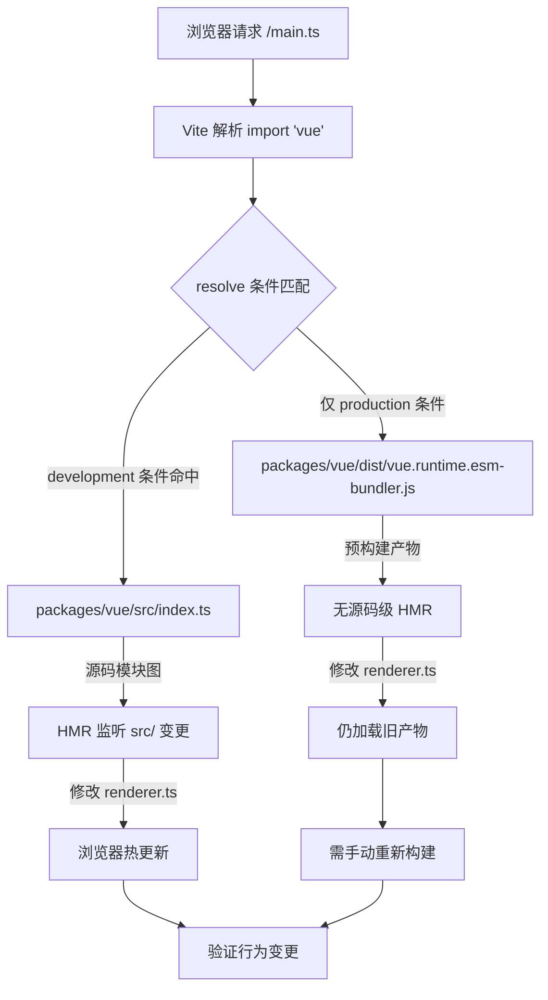

# 第 12 章：最小デバッグサンドボックス：vite-debug とローカル開発閉ループ

前の章ではサイズ予算の測定閉ループを完成させた：size-report.js は「どれだけ大きくなったか」を答え、usage-size.js は「どこが大きいか」を答え、ワークフロー層がゲート判定を担当する。しかしこのメカニズムには暗黙の前提がある——ビルド成果物自体が再現可能であることだ。あるパッケージのサイズが異常に膨張していることに気づいたり、あるランタイム動作が期待と異なる場合、ローカルソースコードを素早く読み込み、変更後すぐに効果を確認できる最小環境が必要になる。packages-private/vite-debug がその環境である。わずか4つのファイル、合計40行未満のコードでありながら、Vue core リポジトリにおける「実際のソースコード上で最小再現を行う」日常実践の入口を構成している。本章ではこのサンドボックスの構築ロジックをファイルごとに分解し、なぜこれが packages ではなく packages-private ディレクトリに置かれているのかを説明する。

# 一、サンドボックスの骨格：`main.ts`と`App.vue`の最小マウントチェーン

## 直感モデル

Vue ランタイム全体をエンジンに例えるなら、`vite-debug`は「ベアメタルテストベンチ」である——外殻もダッシュボードもなく、エンジンを動かすための最小限の配線だけがある。その価値は機能の完全性ではなく、**すべての干扰変数を排除する**ことにある：あるバグがリアクティブシステムやレンダラー内部にあると疑っているとき、デバッグ環境自体の複雑さがノイズ源になることは望まない。

## データ構造とファイルレイアウト

まず`main.ts`の全内容を見る：

[FACT:packages-private/vite-debug/main.ts:4-4]

```ts
import { createApp } from 'vue'
import App from './App.vue'

const app = createApp(App)

app.mount('#app')
```

この6行のコードは Vue アプリケーション起動の標準パラダイムだが、各行はデバッグシナリオにおいて正確な工学的意味を持つ：

- **L1**の`import { createApp } from 'vue'`において、`'vue'`というモジュール識別子が最終的に何に解決されるかは、完全に`vite.config.ts`と`package.json`の依存宣言によって決まる。これがサンドボックス全体で最も重要な一环である——これがどのようにローカルソースコードを指すようになるかは後で見る。
- **L2**の`import App from './App.vue'`が`@vitejs/plugin-vue`の SFC コンパイルパイプラインをトリガーする：Vite は dev server 起動時にこのプラグインを登録し、ブラウザが`App.vue`をリクエストすると、プラグインはそれを`<script>`、`<template>`、`<style>`の3つの仮想モジュールに分解して個別にコンパイルする。
- **L4**の`createApp(App)`がアプリインスタンスを作成し、このとき Vue 内部で`app._context`、`app._instance`などのコアフィールドが初期化されるが、まだレンダリングはトリガーされない。
- **L6**の`app.mount('#app')`が真の起動スイッチである：DOM 内で id が`app`のコンテナ要素を探し、ルートコンポーネントインスタンスを作成し、初回レンダリングをトリガーする。

ここに`index.html`の参照がないことに注意——Vite の規約ではプロジェクトルートディレクトリ下の`index.html`がエントリ HTML であり、そこに`<div id="app"></div>`と`<script type="module" src="/main.ts"></script>`が含まれる。このファイルは本章の keyFiles にはないが、`app.mount('#app')`が成功する前提である。

## シナリオ駆動の Walkthrough：1回のクリックの完全なチェーン

次に`App.vue`を見る。これはこのサンドボックスの「実験キャリア」である：

[FACT:packages-private/vite-debug/App.vue:4-8]

```vue

import { ref } from 'vue'

const count = ref(0)

  {{ count }}

button {
  color: red;
}

```

具体的なシナリオを代入する：**ユーザーがブラウザでボタンをクリックしたとき、何が起こるか？**

**第一步：SFC コンパイル期（dev server 起動時）**

`@vitejs/plugin-vue`が`App.vue`を3つの部分にコンパイルする：

- `<script setup>`ブロックはコンポーネントの`setup()`関数にコンパイルされ、`ref(0)`呼び出しは`RefImpl`オブジェクトを返し、その`.value`は初期状態で`0`。
- `<template>`ブロックはレンダー関数にコンパイルされ、`{{ count }}`は`_toDisplayString(count.value)`，`@click="count++"`に変換され、`onClick: $event => (count.value++)`。
- `<style>`は`<style>`に変換される

**ブロックは CSS モジュールにコンパイルされ、`app.mount`タグを通じて DOM に注入される。**

`createApp(App)`第二步：初回レンダリング（`mount('#app')`のとき、ルートコンポーネントの`ComponentInternalInstance`を作成し、`setup()`を実行して`count`の RefImpl を取得し、その後レンダー関数を呼び出して VNode ツリーを生成します。レンダー関数内で`count.value`を読み取ると`track`が依存関係の収集をトリガーします——現在アクティブなレンダー副作用（`ReactiveEffect`）が`count`の`dep`に記録されます。

**第三步：クリックイベント（ユーザーインタラクション時）**

ブラウザが`click`イベントをトリガーし、Vue のイベントハンドラが`count.value++`を実行します。これは setter 操作であり、`trigger`をトリガーします：`count.dep`で収集された副作用を走査し、再レンダリングをスケジュールします。同期更新でありバッチキュー内にないため、レンダー副作用は即座に実行され、レンダー関数が再度呼び出されて新しい VNode が生成され、古い VNode と diff され、テキスト内容が`0`から`1`に変化したことが検出され、実際の DOM の`textContent`。

が更新されます。チェーン全体は以下のデータフロー図で表せます：

```mermaid
flowchart LR
    subgraph compile["编译期 (Vite Dev Server)"]
        sfc["App.vue"] -->|"@vitejs/plugin-vue"| script["setup() 函数"]
        sfc -->|"@vitejs/plugin-vue"| render["渲染函数"]
        sfc -->|"@vitejs/plugin-vue"| style["CSS 模块"]
    end
    subgraph runtime["运行时 (浏览器)"]
        script -->|"ref(0)"| refimpl["RefImpl { value: 0 }"]
        render -->|"读取 count.value"| track["track() 收集依赖"]
        click["用户点击"] -->|"count.value++"| trigger["trigger() 触发更新"]
        trigger -->|"调度渲染副作用"| rerender["重新执行渲染函数"]
        rerender -->|"diff + patch"| dom["更新真实 DOM"]
    end
    track -.->|"dep 记录 ReactiveEffect"| trigger
```

この図の鍵は：**コンパイル時产物とランタイム動作の間の結合点は2つだけ**——`ref(0)`が返す RefImpl オブジェクト、およびレンダー関数内での`count.value`の読み書き。つまり、レスポンシブシステムの特定の分岐（例えば`trigger`内のスケジューリングロジック）をデバッグしたい場合、`App.vue`内で対応する読み書きパターンを構築するだけで済みます。

## 設計上の考察：なぜ`ref`ではなく`reactive`？

> **[Design Inference & Architectural Trade-offs]**
> を選択`ref(0)`ではなく`reactive({ count: 0 })`をデフォルト例として使用することは、デバッグ優先の考慮を暗に示しています：`ref`の`.value`アクセスパスがより短く、デバッガで`RefImpl`オブジェクトを展開すると`_value`、`dep`、`__v_isRef`などの内部フィールドを直接確認できますが、`reactive`が返す Proxy オブジェクトをコンソールで展開すると getter がトリガーされ、元の状態の観察が妨げられる可能性があります。「最小再現」シナリオでは、Proxy 間接層を1つ減らすことは変数が少ないことを意味します。

---

# 二、エイリアス解決：`vite.config.ts`と`package.json`がどのように`'vue'`をローカルソースコードに指し示すか

## 直感モデル

`vite.config.ts`はわずか6行ですが、サンドボックス全体の「ルーティングハブ」です——`import { createApp } from 'vue'`内の`'vue'`が最終的に npm 上のリリース版をロードするのか、リポジトリで開発中のソースコードをロードするのかを決定します。正しいエイリアス設定がなければ、`App.vue`で変更したコードがデバッグ中の Vue ソースコードをトリガーしない可能性があり、デバッグは「間違った的を撃つ」ことになります。

## データ構造と解決チェーン

まず`vite.config.ts`：

[FACT:packages-private/vite-debug/vite.config.ts:4-6]

```ts
import { defineConfig } from 'vite'
import vue from '@vitejs/plugin-vue'

export default defineConfig({
  plugins: [vue()],
})
```

ここで**明示的な`resolve.alias`設定がありません**。では`'vue'`はどのようにローカルソースコードに解決されるのか？答えは`package.json`にあります：

[FACT:packages-private/vite-debug/package.json:1-15]

```json
{
  "name": "vite-debug",
  "private": true,
  "type": "module",
  "scripts": {
    "dev": "vite",
    "build": "vite build",
    "serve": "vite preview"
  },
  "devDependencies": {
    "@vitejs/plugin-vue": "catalog:",
    "vite": "catalog:",
    "vue": "workspace:*"
  }
}
```

鍵は**L13**：`"vue": "workspace:*"`です。これは pnpm workspace プロトコルの宣言であり、`vite-debug`が monorepo 内の`vue`という名前のローカルパッケージに依存していることを示し、npm registry 上のバージョンではありません。pnpm は`node_modules/vue`にシンボリックリンクを作成し、`packages/vue`（Vue のメインパッケージディレクトリ）を指します。

しかしこれだけでは不十分——`packages/vue`の`package.json`内の`main`/`module`/`exports`フィールドは通常**ビルド产物**（例えば`dist/vue.runtime.esm-bundler.js`）を指し、`src/`下のソースコードではありません。もし`packages/runtime-core/src/renderer.ts`を変更しても再ビルドしなければ、Vite は依然として古い`dist`ファイルをロードします。

> **[Design Inference & Architectural Trade-offs]**
> これが、Vue core リポジトリの`packages/vue/package.json`に通常`"development"`条件付きエクスポートや同様のソースエントリマッピングが設定されている理由です——dev モードでは、Vite の`resolve.conditions`が`development`条件を優先的にマッチし、`src/index.ts`ではなく`dist`をロードします。このメカニズムにより、`vite-debug`は明示的な alias 設定なしで、ソースコード変更後に HMR を通じて即座に効果を確認できます。

## シナリオ駆動のウォークスルー：一度の`import 'vue'`の解決プロセス

シナリオを想定：**Vite dev server がブラウザからの`main.ts`へのリクエストを受け取り、`import { createApp } from 'vue'`に遭遇したとき、解決チェーンはどうなるか？**



このフロー図は重要な分岐を明らかにしています：**もし`development`条件が正しく設定されていなければ、ソースコード変更後にブラウザはホットアップデートされず**、「コードを変更したが動作が変わらない」という困惑に陥ります。調査方法はブラウザ DevTools の Network パネルで`vue`モジュールの実際のロードパスを確認することです——もし`dist/`パスが見えたら、ソースエントリマッピングが有効でないことを示します。

## 設計上の考察：なぜ`vite.config.ts`に明示的に alias を書かないのか？

> **[Design Inference & Architectural Trade-offs]**
> 自然な疑問は：なぜ`vite.config.ts`に直接`resolve: { alias: { vue: '../../packages/vue/src/index.ts' } }`を書かないのか？これは直感的ですが、2つの問題があります：

1. **サブパスインポートを破壊する**：Vue の公開 API には`vue/server-renderer`、`vue/compiler-sfc`などのサブパスが含まれます。もし`'vue'`自体のみを alias すると、サブパスインポートは依然として`dist`を通り、一部のモジュールがソースコードから、一部が产物から来ることになり、動作が不一致になります。

2. **条件付きエクスポートメカニズムをバイパスする**：Vue の`package.json`内の`exports`フィールドは既に完全な条件付きエクスポートマッピング（`development`/`production`/`browser`/`node`など）を定義しており、alias はこのメカニズムを上書きし、デバッグ環境と実際のユーザー環境の解決動作に偏差を生じさせます。

したがって、`vite-debug`は「workspace プロトコル + 条件付きエクスポートを信頼する」組み合わせを選択し、解決チェーンを可能な限り実際の使用シナリオに近づけています。これも`package.json`内の`"vue": "workspace:*"`が必須である理由を説明しています——それは pnpm シンボリックリンクをトリガーし、Vite が`node_modules/vue`を通じて`packages/vue`を見つけられるようにする前提条件です。

## 本番の落とし穴：`catalog:`プロトコルとバージョンドリフト

注意`package.json`内の**L11-L12**が`"catalog:"`プロトコルを使用しています：

```json
"@vitejs/plugin-vue": "catalog:",
"vite": "catalog:",
```

これは pnpm の catalog 機能であり、バージョン番号が`pnpm-workspace.yaml`内の`catalog`フィールドで統一的に管理されることを示します。その役割は**monorepo 内の複数のパッケージが同じ依存を参照する際のバージョンドリフトを回避すること**。

> **[Design Inference & Architectural Trade-offs]**
> デバッグシナリオでは、これが隠れた罠をもたらします：もし`vite-debug`Vite または plugin-vue の疑わしいバグに遭遇し、一時的にバージョンをアップグレードして検証したい場合、直接`package.json`内の`catalog:`を変更しても無効です——あなたは`pnpm-workspace.yaml`内の catalog 定義を変更する必要があり、これはその catalog を使用するすべてのパッケージに影響します。正しい方法は、一時的に明示的なバージョン番号（例：`"vite": "5.0.0"`）に変更し、検証が完了したら`catalog:`。

---

# に戻すことです。三、`packages-private`の分離設計：なぜデバッグサンドボックスは外部に公開されないのか

## 直感的モデル

`packages-private`ディレクトリは会社の「内部試験室」のようなものです——中のサンプルは外部に販売されず、テストとデモのみに使用されます。それは`packages`ディレクトリと物理的に分離されており、デバッグコードが誤って npm に公開されるのを防ぎます。

## 分離メカニズムの三層保障

**第一層：ディレクトリ分離**

`packages-private/vite-debug`は`packages/`の下になく、一方`pnpm-workspace.yaml`は通常`packages/*`と`packages-private/*`の両方を workspace メンバーとして宣言しますが、公開スクリプト（例：`scripts/release.js`）は`packages/`下のパッケージのみを走査します。

**第二層：`private: true`**

[FACT:packages-private/vite-debug/package.json:3]

```json
"private": true,
```

この行は npm/pnpm の厳格な制約です：`private`とマークされたパッケージは**決して`npm publish`で公開できません**、手動で実行しても拒否されます。これは誤公開を防ぐ最後の防衛線です。

**第三層：`version`フィールドなし**

注意`package.json`には`version`フィールドがありません。npm の仕様では、公開可能なパッケージには`version`が必須であり、このフィールドが欠けているパッケージは`npm publish`時にエラーになります。これは「二重保険」です——たとえ`private`が誤って削除されても、`version`の欠如が依然として公開を阻止します。

## 設計思考：デバッグサンドボックスと Playground の役割分担

Vue core リポジトリにはすでに完全な機能を持つ`SFC Playground`があります（第7章で議論済み）。なぜまだ`vite-debug`？

> **[Design Inference & Architectural Trade-offs]**
> 両者の位置づけはまったく異なります：

| 次元 | SFC Playground | vite-debug |
| --- | --- | --- |
| 実行環境 | ブラウザ内（コンパイルもブラウザ内） | Node.js + ブラウザ |
| ソースコードの読み込み | CDN または事前ビルド成果物経由 | ローカルソースコードを直接読み込み |
| デバッグ能力 | ブラウザサンドボックスに制限される | Node.js デバッガ、ブレークポイントが使用可能 |
| ソースコードの変更 | 非対応 | HMR 対応 |
| 適用シーン | コンパイル出力の検証、再現の共有 | ランタイム内部動作のデバッグ |

`vite-debug`の核心的価値は**実際の Node.js 環境で動作する**ことにあり、`node --inspect`でデバッガをアタッチし、`packages/reactivity/src/effect.ts`にブレークポイントを設定して、`ReactiveEffect`の作成とスケジューリング過程を観察できます。これは Playground では提供できません。

## 本番での落とし穴：HMR の境界と状態の喪失

> **[Design Inference & Architectural Trade-offs]**
> を使用してデバッグする際、よくある困惑は：`vite-debug`内の`App.vue`の初期値を変更しても、ブラウザ内のカウントがリセットされないことです。これは Vite の HMR が`count`ブロックに対して`<script setup>`コンポーネント状態を保持し、レンダリング関数のみを置換する**ためです。状態を完全にリセットする必要がある場合は、手動でページをリフレッシュするか、**に`App.vue`を追加して強制的にページ全体をリフレッシュする必要があります。`import.meta.hot?.invalidate()`もう一つの落とし穴は：

下のソースコードを変更したとき、HMR の伝播チェーンが自動的にトリガーされない可能性があることです——なぜなら`packages/runtime-core/src/`の HMR 境界は`vite-debug`レベルで定義されており、`App.vue`下のソースコード変更は Vite のモジュールグラフを通じて伝播する必要があるからです。ソースコード変更後にブラウザが反応しない場合は、Vite のターミナル出力に`packages/`ログがあるか確認してください。なければ、dev server の再起動が必要かもしれません。`hmr update`本章のまとめ

---

# は4つのファイル、40行未満のコードで、完全なデバッグループを構築しました：

`packages-private/vite-debug`は最小限のマウントチェーンを提供：

1. **`main.ts`**、すべての不要な初期化ロジックを排除。`createApp(App).mount('#app')`は実験のキャリアとして：

2. **`App.vue`**+ テンプレート補間 + イベント処理で、リアクティブシステムの主要パスをカバー。`ref`は

3. **`vite.config.ts` + `package.json`**プロトコルと条件付きエクスポートを通じて、`workspace:*`をローカルソースコードに解決し、「ソースコード変更が即座に反映される」を実現。`'vue'`+

4. **`packages-private` + `private: true`なしの`version`**三層分離で、デバッグコードが誤って公開されないことを保証。

このサンドボックスのエンジニアリング哲学は：**デバッグ環境自体の複雑さはゼロに近づけるべきであり、すべての複雑さはデバッグ対象のソースコードに委ねる**。あなたが`packages/reactivity`で再現困難なバグに遭遇したとき、`vite-debug`は自由に変更でき、即座に検証できる実験台を提供します。

# 本章の思考とセルフチェック

Q1: もし`package.json`内の`"vue": "workspace:*"`を`"vue": "^3.4.0"`に変更した場合、`vite-debug`で`packages/reactivity/src/ref.ts`を変更した後、ブラウザ内の動作はどう変わりますか？なぜですか？

**参考解析**：`"^3.4.0"`に変更すると、pnpm は npm registry から Vue 3.4.x のリリース版をダウンロードし、ローカルの`packages/vue` [FACT:packages-private/vite-debug/package.json:13]にリンクしません。このとき`import { createApp } from 'vue'`が解決するのは`node_modules/.pnpm/vue@3.4.x/node_modules/vue/dist/vue.runtime.esm-bundler.js`、つまり事前ビルド成果物です。`packages/reactivity/src/ref.ts`を変更しても HMR はトリガーされません。Vite のモジュールグラフにこのファイルが含まれていないためです。ブラウザで動作しているのは依然として npm 版の`ref`実装です。この実験は逆説的に`workspace:*`がソースコードレベルデバッグの必要条件であることを証明しています。

Q2: `App.vue`内の`<style>`ブロックに`scoped`が付いていない場合、このサンドボックスで同時に2つのコンポーネントインスタンスをマウントすると、スタイルはどうなりますか？これは`vite-debug`のデバッグ目標とどう関係しますか？

**参考解析**：`scoped`がない場合、`button { color: red }`はグローバルスタイル[FACT:packages-private/vite-debug/App.vue:4-8]となり、ページ内のすべての`<button>`要素に作用します。2つのコンポーネントインスタンスをマウントすると、両方のインスタンスのボタンが赤くなります。デバッグ目標との関係は：`vite-debug`の位置づけは「最小再現」であり、「スタイル分離の検証」ではありません。`scoped`を省略することで、コンパイル時に`data-v-xxx`属性を注入する変数が減り、デバッガ内の DOM 構造がよりクリーンになります。`scoped`スタイルのコンパイルロジックをデバッグする必要がある場合は、明示的に`scoped`を追加し、`@vitejs/plugin-vue`が生成する属性注入コードを観察すべきです。

Q3:`packages/runtime-core/src/renderer.ts`の`patch`関数に`console.log`を1行追加したが、ブラウザコンソールに出力がないとします。少なくとも3つの可能な原因を挙げ、それぞれの調査方法を説明してください。

**参考解析**：

原因一：**ソースコードエントリが有効でない**。`'vue'`が`dist`成果物に解決されており、`src`。トラブルシューティング：DevTools の Network パネルで確認する`vue`モジュールの読み込みパスが`dist/`で始まる場合、条件付きエクスポートがヒットしていない`development`条件[FACT:packages-private/vite-debug/package.json:13]。

原因2：**HMR が伝播していない**。Vite のモジュールグラフが`packages/runtime-core/src/renderer.ts`の変更を`vite-debug`に伝播していない。トラブルシューティング：Vite のターミナルに`hmr update`ログがあるか確認する。なければ dev server を再起動する。

原因3：**`patch`関数が呼び出されていない**。現在のページで DOM 更新が何もトリガーされていない場合（例えばボタンをクリックしていない）、`patch`は初回マウント時に一度だけ実行される可能性があり、その初回マウントは`console.log`を追加する前に発生している。トラブルシューティング：ページをリロードするか、`App.vue`に更新をトリガーする操作を追加する。

原因4（補足）：**ビルドキャッシュ**。Vite の依存関係プリビルドキャッシュ（`node_modules/.vite`）が古いバージョンを使用している可能性がある。トラブルシューティング：`node_modules/.vite`を削除して再起動する。

---

サイズ予算は「問題が存在する」ことを教えてくれ、`vite-debug`は「問題を自分の手で再現する」ことを可能にする。しかし、このサンドボックスモードを monorepo 全体に広げようとすると、一連の境界条件に遭遇する：CI 環境における workspace プロトコルの解決差異、`catalog:`のバージョンロックによるアップグレードの困難さ、`packages-private`と`packages`の間の依存方向の制約……次章ではアーキテクチャのトレードオフと落とし穴回避ガイドに入り、monorepo エンジニアリングが実際のプロジェクトで露呈する境界条件を体系的に整理する。

ここまでで、サイズ計測から最小再現までのエンジニアリング閉ループを完成させた：vite-debug は極めてシンプルな4つのファイルで、「実際のソースコード上で素早く検証する」ことを日常的に使える実践へと変えた。しかし、この仕組みを実際に再現し始めると、さらに多くの隠れたトレードオフが見えてくる——なぜ packages-private は packages と物理的に分離しなければならないのか？なぜ enum のインライン化は Rollup より前に完了しなければならないのか？次章では、第12章までで露呈した重要な意思決定ポイントと本番での落とし穴記録をまとめ、完全な落とし穴回避チェックリストと意思決定の根拠を提供する。
