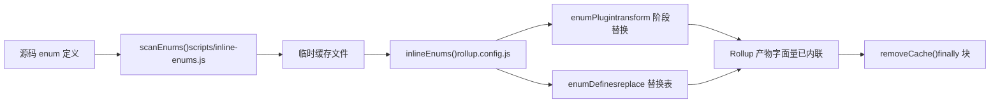
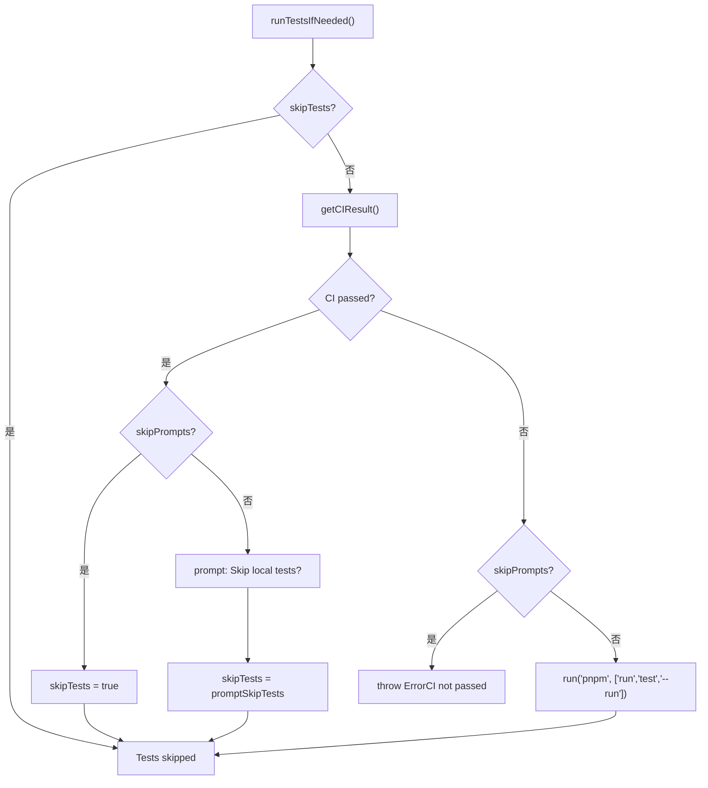

# 第 13 章：アーキテクチャのトレードオフと落とし穴回避ガイド：monorepo エンジニアリングの境界条件

前章では`packages-private/vite-debug`を切り口として、実際のソースコード上で最小再現を行うデバッグパラダイムを習得した。このような内部デバッグパッケージが増えてくると、現実的な問題が浮上する：それらが对外公開される正式パッケージと同じ workspace に共存する場合、リリースプロセスが誤って影響を与えないようにするにはどうすればよいか？本章では monorepo エンジニアリングの境界条件を深く掘り下げ、`packages`と`packages-private`の二重ディレクトリ契約から出発し、アーキテクチャのトレードオフの背後にある防御的設計を分析し、実行可能な落とし穴回避ガイドを提供する。

# 13.2 タイミングの鉄則：enum のインライン化は Rollup の実行より先でなければならない

## 直感モデル

enum のインライン化は「箱詰め前に部品のラベルを数字に貼り替える」ようなものだ。もし箱詰め作業員（Rollup）がすでに梱包を始めていたら、後からラベルを変更しても、箱の中の部品とラベルが一致しなくなる。`build.js`は`scanEnums()` / `removeCache()`という関数ペアでインライン化を厳密に Rollup の前に挟み込む。

## データ構造とライフサイクル

`inline-enums.js`がエクスポートする`scanEnums()`は`removeCache`クロージャを返し、ソースコード内の enum 定義をスキャンして、Rollup が消費するための一時ファイルを生成する[FACT:scripts/build.js:30-34]。`build.js`の`run()`は`try/finally`でキャッシュクリアを保証する[FACT:scripts/build.js:81-112]：

```js
const removeCache = scanEnums()
try {
  // ... buildAll / checkAllSizes / build-dts
} finally {
  removeCache()
}
```

`rollup.config.js`モジュールのトップレベルで`inlineEnums()`を呼び出して`[enumPlugin, enumDefines]` [FACT:rollup.config.js:47-50]を取得する。ここで`enumPlugin`は plugins 配列に挿入され[FACT:rollup.config.js:331-331]，`enumDefines`は replace プラグインの置換テーブルに組み込まれる[FACT:rollup.config.js:222-223]。

## Step-by-Step：1回のビルドにおける enum の完全なライフサイクル

1. `build.js`の`run()`はまず`scanEnums()`を呼び出し、すべてのパッケージの enum 定義をスキャンして一時キャッシュに書き込み、`removeCache` [FACT:scripts/build.js:87-87]。

2. `buildAll`を返し、複数の Rollup プロセスを並行起動する[FACT:scripts/build.js:119-121]。

3. 各 Rollup プロセスは設定読み込み段階で`inlineEnums()`を実行し、前のステップで生成されたキャッシュを読み取り、`enumPlugin`と`enumDefines` [FACT:rollup.config.js:47-50]。

4. `enumPlugin`を得る`enumDefines`は transform 段階でソースコード内の enum 参照をリテラルに置換する；[FACT:rollup.config.js:222-223]。

は replace の補完として、モジュールをまたぐ定数置換を処理する`finally`5. ビルド終了時、`removeCache()`ブロックが[FACT:scripts/build.js:119-121]。



## コピー

> **[Design Inference & Architectural Trade-offs]**
> 〔設計推論とアーキテクチャのトレードオフ〕**なぜ Rollup プラグインで transform 段階においてその場でスキャンして使わないのか？それは enum のインライン化には**：`runtime-core`パッケージをまたぐグローバルビュー`shared`が必要だからである`scanEnums()`で参照される enum は

で定義されている可能性があり、単一の Rollup プロセスは自分のパッケージのソースツリーしか見えず、パッケージをまたぐ置換を完了できない。`removeCache()`ビルド前にグローバルキャッシュを構築するのは、まさにこの可視性の問題を解決するためである。`finally`本番の落とし穴ポイント：`finally`を`temp/`に置くことは、ビルド途中でエラーが発生してもクリーンアップされることを意味する。しかし、デバッグ中に手動でプロセスを中断（Ctrl+C）すると、

---

# が実行されない可能性があり、残留したキャッシュファイルが次回のビルドで期限切れの enum を読み込む原因となる。トラブルシューティング方法：`release.js`ディレクトリに残留した enum キャッシュファイルがないか確認し、手動で削除して再試行する。

## 13.3 リリースオーケストレーター：

`release.js`の skip フラグビットマトリクス`skipBuild` / `skipTests` / `skipGit` / `skipPrompts`直感モデル`skipPrompts`は結婚式の総合演出家のようなもので、`skipGit`の4つのスイッチは「リハーサルをスキップ」「宣誓をスキップ」「写真撮影をスキップ」「確認をスキップ」のボタンである。各ボタンの存在はそれぞれ実際のシナリオに対応する：CI 環境では`skipTests`。

## が必要で、ローカルデバッグでは

が必要で、緊急ホットフィックスでは`parseArgs`が必要である[FACT:scripts/release.js:39-50]フラグビットのデータ構造とデフォルト値[FACT:scripts/release.js:64-66]：

```js
let skipTests = args.skipTests
const skipBuild = args.skipBuild
const skipPrompts = args.skipPrompts
const skipGit = args.skipGit
```

で宣言され`skipTests`、その後ローカル変数に分割代入される`let`宣言、なぜならそれは`runTestsIfNeeded()`で動的に書き換えられるから[FACT:scripts/release.js:281-317]。

## Step-by-Step：1回のreleaseの完全な意思決定フロー

`main()`の実行順序[FACT:scripts/release.js:143-279]：

1. **リモート同期チェック**：`isInSyncWithRemote()`ローカルHEADとリモートブランチのSHAを比較し、不一致時に確認ダイアログを表示[FACT:scripts/release.js:337-363]。

2. **バージョン選択**：位置引数がない場合に`versionIncrements`選択メニューを表示[FACT:scripts/release.js:152-176]。

3. **テスト判断**：`runTestsIfNeeded()`はskipロジックが最も密集している箇所[FACT:scripts/release.js:281-317]。

4. **バージョン更新**：`updateVersions()`すべてのパッケージを走査して書き換え`package.json` [FACT:scripts/release.js:377-398]。

5. **Changelog生成**：呼び出し`pnpm run changelog` [FACT:scripts/release.js:211-212]。

6. **Gitコミット**：`skipGit`が真の場合、セクション全体をスキップ[FACT:scripts/release.js:231-240]。

7. **公開**：以下の場合のみ`args.publish`が真の場合に実行`buildPackages()` + `publishPackages()` [FACT:scripts/release.js:243-246]。

`runTestsIfNeeded()`の分岐ロジックは個別に展開する価値がある：



## 設計上の考察と落とし穴

> **[Design Inference & Architectural Trade-offs]**
> `skipTests`を使用`let`ではなく`const`の設計は、「CIが通過済みならローカルテストを自動スキップ」という最適化パスをサポートするため。これはCI公開シナリオで大量の時間を節約する——GitHub Actionsの`release.yml`はすでに完全なテストを実行済みで、ローカルで再度実行するのは純粋な無駄である。

**公開順序の隠れた契約**：`sortPackagesForPublishing`は`vue`を最後に配置[FACT:scripts/release.js:85-85]、コメントで明確に「ユーザーは内部パッケージが利用可能になる前に新しいエントリパッケージをインストールできない」と説明している。この順序を変更すると、ユーザーが`npm install vue@next`時に依存関係がまだ公開されていないバージョンを取得し、`ERR_MODULE_NOT_FOUND`。

**冪等性保護**：`publishPackage`は公開前に`isPackagePublished`を呼び出してregistryを[FACT:scripts/release.js:453-458]チェックし、公開失敗時に`previously published`エラーをキャッチして[FACT:scripts/release.js:480-488]をスキップに降格する。これによりreleaseスクリプトは安全にリトライできる——ネットワーク中断後に再実行しても「パッケージが既に存在する」ことで全体が失敗しない。

**失敗時のロールバック**：`fnToRun().catch()`は`versionUpdated`が真の場合に`updateVersions(currentVersion)`を呼び出してバージョン番号をロールバック[FACT:scripts/release.js:528-537]。ただし注意：これは`package.json`内のバージョンフィールドのみをロールバックし、**すでに`git commit`されたコミットはロールバックしない**。もし`skipGit`が偽の状態で公開が失敗した場合、手動で`git reset`。

---

# 設計思考：3つのトレードオフに共通するパターン

本章の3つの核心的トレードオフを振り返ると、それらは同じ設計哲学を共有している：**「忘れがちな実行時チェック」を「回避不可能な構造的制約」に変換する**。

- `packages-private`物理的隔離：スクリプト作者が`private`フィールドのチェックを覚えていることに依存せず、スキャン範囲から自然に除外される。
- 列挙型インライン化の前置：Rollupプラグインがtransform時に「たまたま」クロスパッケージenumを見られることに依存せず、ビルド前にグローバルキャッシュを構築する。
- `release.js`のskipマトリクス：公開者が「CI通過済みならローカルテスト不要」を覚えていることに依存せず、スクリプトが自動的にCIステータスを照会して`skipTests`。

> **[Design Inference & Architectural Trade-offs]**
> このパターンの代償は**スクリプトの複雑度上昇**：`build.js`は`privatePackages`リストを維持する必要があり、`rollup.config.js`はディレクトリ探索ロジックを重複させ、`release.js`は4つのskipフラグの交差組み合わせを処理する必要がある。しかしVueのような週に複数回リリースするリポジトリでは、構造的制約による信頼性の利益は複雑度のコストをはるかに上回る。

---

# 本章のまとめ

本章はソースコードから出発し、Vue coreエンジニアリング体系の3つの重要な境界条件を分解した：

1. **`packages-private`と`packages`の物理的隔離**はworkspace glob、`build.js`ディレクトリ探索、`release.js`フィルタの3箇所が共同で保証[FACT:pnpm-workspace.yaml:1-3][FACT:scripts/build.js:153-170][FACT:scripts/release.js:68-83]。

2. **列挙型インライン化のタイミング制約**は`scanEnums()` / `removeCache()`の`try/finally`構造によって強制保証され、Rollup設定はモジュールトップレベルでキャッシュを消費[FACT:scripts/build.js:81-112][FACT:rollup.config.js:47-50]。

3. **`release.js`のskipフラグビットマトリクス**はCI公開、ローカルデバッグ、緊急ホットフィックスの3シナリオにサービスし、`skipTests`の動的書き換えと公開順序のソートは最も見落とされやすい2つの隠れた契約[FACT:scripts/release.js:281-317][FACT:scripts/release.js:85-85]。

# 本章の考察とセルフチェック

Q1: もし`build.js`の`build(target)`関数内の`privatePackages.includes(target)`判断を削除し、統一的に`packages`を`pkgBase`として使用した場合、どのようなシナリオで問題が発生するか？

**参考解析**：`build.js:160-164`のディレクトリ探索はプライベートパッケージがビルドされる唯一の入口である。削除すると、`nr build vite-debug`は`packages/vite-debug`下で`package.json`を検索するが、そのディレクトリは存在せず、`fs.readFileSync`直接`ENOENT`をスローする。さらに隠れた問題は：将来誰かが`packages/`下に同名ディレクトリを作成した場合、ビルドは静かに誤ったディレクトリの設定を使用し、成果物パスと`buildOptions`がすべてずれる。加えて、`rollup.config.js:37-42`は独立したディレクトリ探索ロジックを持ち、2箇所を同期して修正する必要があり、そうでなければ「`build.js`はパッケージを見つけたがRollupは見つけられない」という不整合状態が発生する。

Q2: `release.js`の`runTestsIfNeeded()`において、`skipTests ||= isCIPassed`この行のコード（`release.js:285`）は`skipPrompts`が真かつCI未通過の場合、どの分岐をたどるか？もし`else if (skipPrompts)`分岐の`throw`を削除すると、どのような結果になるか？

**参考解析**：`skipPrompts`が真かつCI未通過の場合、`skipTests ||= isCIPassed`内の`isCIPassed`は`false`，`skipTests`のまま元の値（通常は`false`）を保持する。その後`else if (skipPrompts)`分岐に入り、`Error`（`release.js:299-304`）をスローする。もしこの`throw`を削除すると、コードは`if (!skipTests)`分岐まで実行を続け、非対話環境で`pnpm run test --run`を実行する。これはCIで環境差異によりテストが失敗するか、さらに悪い場合は——テストは通過するがCIが実際には通過していない（例えばCIが異なるテストサブセットを実行している）状態で、完全に検証されていないバージョンを公開してしまう。

Q3: `rollup.config.js:55`の`inlineEnums()`はモジュールトップレベルで呼び出され、一方`build.js:87`の`scanEnums()`は`run()`関数内で呼び出される。もしこの2つの実行タイミングを交換した場合（つまり`inlineEnums()`をRollupの`buildStart`フック内で呼び出すようにした場合）、何が壊れるか？

**参考解析**：`scanEnums()`はすべてのRollupプロセスが起動する前に完了する必要がある。なぜなら**すべてのパッケージ**のソースコードをスキャンしてグローバルenumキャッシュを構築する必要があるから。`inlineEnums()`は`rollup.config.js`モジュールトップレベルで呼び出され、この時点でRollupはまだビルドを開始しておらず、キャッシュはすでに準備完了している。もし`buildStart`内で呼び出すように変更すると、各Rollupプロセスが独立してスキャンする——しかし`buildAll`は並行実行される（`build.js:119-121`）ため、複数プロセスが同時に同じファイル群をスキャンすると競合が発生する：プロセスAがプロセスBのまだ書き込み完了していないキャッシュファイルを読む可能性があり、enum置換が不完全になる。さらに深刻なのは、`scanEnums()`が返す`removeCache`クロージャがスキャン時のファイルハンドル状態に依存し、並行シナリオではクリーンアップタイミングを調整できないことである。

二重ディレクトリ契約、ビルドスクリプトの帰属判定、リリーススクリプトの二次フィルタリング——これらの仕組みが共にmonorepoエンジニアリングの安全境界を画定している。しかし境界は不変ではない。ビルドツールがRollupからRolldownへ移行し、型テストとランタイムテストが融合へ向かうにつれ、既存のトレードオフ戦略も新たな課題に直面する。次章では、3.0から3.4の変更軌跡に基づき、次世代エンジニアリング体系の進化方向を展望する。
