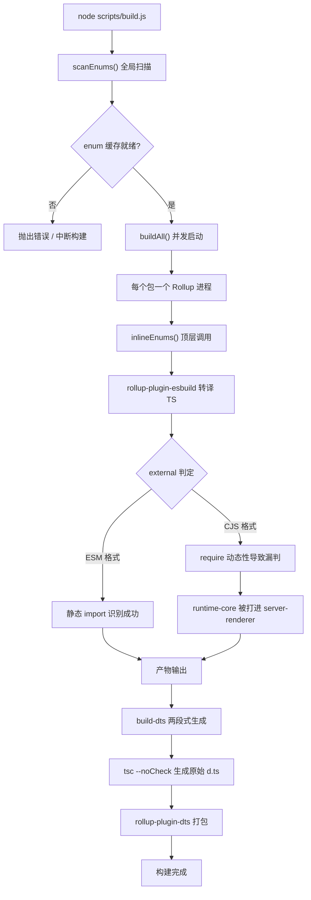
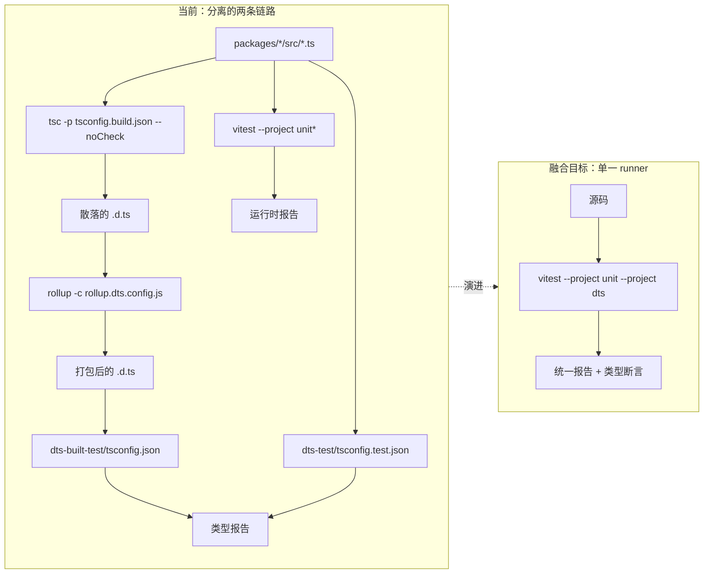
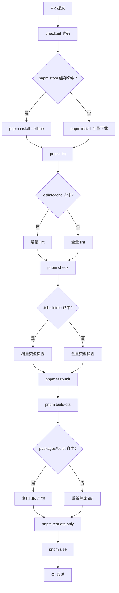

# 第 14 章：未来の進化：3.xから次世代エンジニアリング体系へ

前章では、Vue coreエンジニアリング体系の「安全境界」——二重ディレクトリ契約、ビルドスクリプトの帰属判定、リリーススクリプトの二次フィルタリング——を整理した。これらの仕組みは一度に設計されたものではなく、3.0から3.4の反復の中で繰り返し磨き上げられてきたものである。本章では視点を変える。「今どのような姿か」ではなく「どのようにして今の姿になったか」を見て、それに基づいて次世代エンジニアリング体系がどこへ向かうかを推測する。本章のソース資料はchangelogs/CHANGELOG-3.3.md、changelogs/CHANGELOG-3.4.md、そしてリポジトリルートのpackage.jsonである。変更ログは一見「どんなバグを直したか」の記録にすぎないが、エンジニアリング体系の最もリアルな健康診断書である。build:プレフィックスのコミット、types:プレフィックスの変更、依存バージョンのロールバック——その一つひとつが現在のアーキテクチャの応力点を露呈している。我々がすべきことは、これらの応力点から進化の方向を読み取ることである。変更ログを「機能リスト」ではなく「エンジニアリング体系の観測窓」として扱うことが、本章の核心的な方法論である。機能変更はVueが何をできるかを教えてくれるが、ビルド・型・CI関連の変更はVueのエンジニアリング体系が「どこで痛んでいるか」を教えてくれる。

# 一、ビルドツールチェーンの応力点：RollupからRolldownへの移行ポテンシャル

## 直感モデル

ビルドツールチェーンを組み立てラインに例えよう。Rollupは主組立台、esbuildは高速切断（TSトランスパイル）を担当し、terserは最終的なバンドル圧縮を担当する。製品（Vueランタイム）が複雑になるにつれ、組立台上の工程が増え、主組立台自体がボトルネックとなる。Rolldownの位置づけは、Rustで書き直された主組立台である——それが置き換えるのはesbuildではなく、Rollupそのものである。

この進化の圧力がなければ、システムが直面する「災難」はクラッシュではなく、**ビルド時間がパッケージ数に比例して線形に膨張する**ことである：サブパッケージが一つ増えるごとに、Rollupプロセスを一つ余分に起動し、enumキャッシュを一回余分にスキャンし、dts生成を一回余分に実行することになる。

## データ構造と依存レイアウト

まず現在のツールチェーンの静的スナップショットを見る。`package.json`の`devDependencies`は正確な「組立台リスト」である：

[FACT:package.json:103-106]

```
    "rollup": "^4.63.3",
    "rollup-plugin-dts": "^6.5.1",
    "rollup-plugin-esbuild": "^6.2.1",
    "rollup-plugin-polyfill-node": "^0.13.0",
```

ここから三つの重要な事実が読み取れる。第一に、Rollupのメジャーバージョンは`^4.63.3`であり、Rollup 4.xの成熟期にある。第二に、`rollup-plugin-esbuild`がTSトランスパイルを担うということは、Rollup自体はTSを解析せず、esbuildが吐き出したJSのみを処理することを意味する。第三に、`rollup-plugin-dts`が独立して`.d.ts`のバンドルを担当しており、これこそ前章で論じた`dts-built-test`の独立性の物質的基盤である。

次にビルドスクリプトのエントリ編成を見る：

[FACT:package.json:8-9]

```
    "build": "node scripts/build.js",
    "build-dts": "tsc -p tsconfig.build.json --noCheck && rollup -c rollup.dts.config.js",
```

`build-dts`は「二段階式」である：まず`tsc --noCheck`で生の宣言ファイルを生成し（`--noCheck`は型チェックをスキップし、emitのみ行う）、次に`rollup -c rollup.dts.config.js`で散在する`.d.ts`を単一ファイルにバンドルする。この設計自体がRollupの能力への依存である——`rollup-plugin-dts`は型依存を追跡するためにRollupのモジュールグラフを必要とする。

## シナリオ駆動：ある`build:`コミットが露呈したもの

変更ログの`build:`プレフィックスの項目は、ビルドツールチェーンの応力点の直接的な証拠である。三つを選んで見てみよう。

第一に、3.4.32のminify設定の整合：

[FACT:changelogs/CHANGELOG-3.4.md:84]

```
* **build:** use consistent minify options from previous terser config ([789675f](https://github.com/vuejs/core/commit/789675f65d2b72cf979ba6a29bd323f716154a4b))
```

このコミットの動機は「terserからesbuild minifyへの移行後、圧縮オプションが不一致になった」ことである。これは移行中の過渡状態を明らかにしている：Vueはかつてterserで圧縮していたが、後にesbuildに変更した（`devDependencies`の`esbuild: ^0.28.2`がこれを裏付けている）が、圧縮オプションが完全には整合しておらず、産物のサイズや挙動に偏差が生じた。これはまさに「組立台の部品を交換する」際の典型的な代償である。

第二に、3.4.38のentitiesバージョンのロールバック：

[FACT:changelogs/CHANGELOG-3.4.md:6]

```
* **build:** revert entities to 4.5 to avoid runtime resolution errors ([f349af7](https://github.com/vuejs/core/commit/f349af7b65b9f8605d8b7bafcc06c25ab1f2daf0)), closes [#11603](https://github.com/vuejs/core/issues/11603)
```

`entities`はHTMLエンティティデコードライブラリであり、`compiler-dom`が依存している。4.5へのロールバックは、新バージョンがランタイム解析で問題を起こしたためである。このコミットが示すのは：**ビルドツールチェーンの依存アップグレードは孤立しておらず、一つの間接依存のバージョン変動がランタイム挙動にまで貫通する**。

第三に、3.4.29のserver-renderer cjsビルド汚染：

[FACT:changelogs/CHANGELOG-3.4.md:155]

```
* **build:** fix accidental inclusion of runtime-core in server-renderer cjs build ([11cc12b](https://github.com/vuejs/core/commit/11cc12b915edfe0e4d3175e57464f73bc2c1cb04)), closes [#11137](https://github.com/vuejs/core/issues/11137)
```

これは最も典型的なビルドバグの一種である：CJS形式で、`server-renderer`が誤って`runtime-core`を自身の産物にバンドルしてしまった。原因は通常、Rollupの`external`判定がCJS形式で機能しないことである——ESMは`import`文による外部依存の静的識別ができるが、CJSの`require`動的性がより強く、見落としが発生しやすい。このコミットはRollup設定における`external`ロジックの脆弱性を直接指摘している。

## 移行ポテンシャルのMermaid描写

以下の図は現在のビルドパイプラインの制御フローを描写し、Rolldown移行が影響を与えるノードを示している：



> **[Design Inference & Architectural Trade-offs]**
> Rolldownの移行価値は、「パッケージごとに1プロセス」の並行モデルを「単一プロセス内並行」モデルに置き換えることにある。`scanEnums()`のグローバルスキャンと`inlineEnums()`の置換を同一のRustランタイム内で調整できるため、前章で議論した「並行スキャン競合」問題が根本から消える。しかし移行の抵抗もここにある——`rollup-plugin-esbuild`、`rollup-plugin-dts`これらのプラグインエコシステムにはRolldownが互換レイヤーを提供する必要があり、`external`判定ロジックは書き直す必要がある。

## 設計上の考察と落とし穴

**なぜ移行は一足飛びに進まないのか？**を見ると`package.json`の`engines`フィールド：

[FACT:package.json:61-63]

```
  "engines": {
    "node": ">=20.0.0"
  },
```

Node 20がハード下限である。RolldownはRustネイティブモジュールとして、対応するN-APIバインディングとプリコンパイル済みバイナリ配布が必要である。一度導入すると、`pnpm install`の所要時間、クロスプラットフォーム（Windows/macOS/Linux）のバイナリ互換性、CIキャッシュ戦略をすべて再設計する必要がある。これは「依存関係を変える」ほど単純な話ではなく、**インストール-ビルド-キャッシュチェーン全体の再調整**。

**本番環境の落とし穴**：`build-dts`の`tsc --noCheck`は諸刃の剣である。型チェックをスキップするとemitが速くなるが、`.d.ts`生成段階で型エラーが発見されない——型エラーは`pnpm check`（`tsc --incremental --noEmit`）と`test-dts`でしか補えない。Rolldown移行後にこの2ステップを統合したいなら、型チェックがビルドを遅くしないことを保証しなければならない。そうでなければ`--noCheck`の趣旨に反する。

---

# 二、型テストとランタイムテストの融合トレンド

## 直感モデル

型テストとランタイムテストを2つの独立した品質検査ゲートとして想像しよう：1つは「説明書（`.d.ts`）が正しく書かれているか」を検査し、もう1つは「機械（ランタイム）が正しく回っているか」を検査する。2つのゲートはそれぞれ独立した作業台、独立したツール、独立したレポートを持つ。融合トレンドの意味は：**同じテストケースで説明書と機械の両方を同時に検証できないか？**

融合がなければ、システムが直面する災難は**型とランタイム動作のドリフト**：`.d.ts`は`ref()`が`Ref<T>`を返すと言うが、ランタイムが実際に返すオブジェクトの形状が変わり、型テストは通り、ランタイムテストも通るが、両者を組み合わせると間違っている。

## データ構造：テストスクリプトの編成レイアウト

`package.json`の`scripts`では、テスト関連のエントリが明確に2つのグループに分かれている：

[FACT:package.json:19-24]

```
    "test": "vitest",
    "test-unit": "vitest --project unit*",
    "test-e2e": "node scripts/build.js vue -f global -d && vitest --project e2e --project e2e-browser",
    "test-dts": "run-s build-dts test-dts-only",
    "test-dts-only": "tsc -p packages-private/dts-built-test/tsconfig.json && tsc -p ./packages-private/dts-test/tsconfig.test.json",
    "test-coverage": "vitest run --project unit* --coverage",
```

ここでの鍵となる構造は`test-dts`の`run-s build-dts test-dts-only`——それは**直列**である：まず`.d.ts`をビルドし、次に型テストを実行する。そして`test-dts-only`の内部はさらに**2つの独立した`tsc`プロセス**である：1つは`dts-built-test`（ビルド成果物を検証）を実行し、1つは`dts-test`（ソースコードの型を検証）を実行する。

注意すべきは`test-unit`が`vitest --project unit*`，`test-e2e`を使い、`vitest --project e2e --project e2e-browser`を使っていることである。これはVitestの`--project`メカニズムがすでにテストを「ユニット/E2E/ブラウザ」に異なるprojectとして分類していることを示している。**融合の物理的基盤はすでに存在する**：Vitestのprojectメカニズムは同一runner内で異なるタイプのテストを実行することを可能にする。

## シナリオ駆動：ある`types:`コミットの完全なパス

変更ログでは`types:`プレフィックスのエントリ密度が極めて高い。これは型システムの複雑さの直接的な現れである。典型的な型修正を追跡しよう。

3.4.37のref型リバート：

[FACT:changelogs/CHANGELOG-3.4.md:23-24]

```
* Revert "fix(types/ref): allow getter and setter types to be unrelated ([#11442](https://github.com/vuejs/core/issues/11442))" ([b1abac0](https://github.com/vuejs/core/commit/b1abac06cdb198bd72f8e614b1f68b92e1c78339))
* Revert "fix(types/ref): correct type inference for nested refs ([#11536](https://github.com/vuejs/core/issues/11536))" ([3a56315](https://github.com/vuejs/core/commit/3a56315f94bc0e11cfbb288b65482ea8fc3a39b4))
```

2つの連続するRevertが、2つの型修正をリバートした。3.4.35でこの2つの修正がちょうどマージされたことに注意：

[FACT:changelogs/CHANGELOG-3.4.md:55]

```
* **types/ref:** allow getter and setter types to be unrelated ([#11442](https://github.com/vuejs/core/issues/11442)) ([e0b2975](https://github.com/vuejs/core/commit/e0b2975ef65ae6a0be0aa0a0df43fb887c665251))
```

[FACT:changelogs/CHANGELOG-3.4.md:30]

```
* **types/ref:** correct type inference for nested refs ([#11536](https://github.com/vuejs/core/issues/11536)) ([536f623](https://github.com/vuejs/core/commit/536f62332c455ba82ef2979ba634b831f91928ba)), closes [#11532](https://github.com/vuejs/core/issues/11532) [#11537](https://github.com/vuejs/core/issues/11537)
```

3.4.35でのマージから3.4.37でのリバートまで、間にパッチバージョンが1つしかない。この「マージ-リバート」の高速サイクルは、型テストの根本的なジレンマを露呈している：**型テストは「型シグネチャが期待通りか」を検証できるが、「この型シグネチャが実際のコードで使いやすいか」は検証できない**。`allow getter and setter types to be unrelated`は型テストでは完全に通るかもしれないが、実際に使用すると`ref`の型推論が過度に緩くなり、下流コードの型安全性を損なう。

## 型テスト融合のMermaid描写

以下の図は現在の型テストとランタイムテストの分離構造、および融合後の目標形態を描写している：



> **[Design Inference & Architectural Trade-offs]**
> 融合の技術的パスはおそらく：`dts-built-test`と`dts-test`の`tsc`呼び出しをVitestのカスタムprojectとしてカプセル化し、型アサーションを`expectTypeOf`の形式でテストファイルにインライン化することである。これにより1回の`vitest`呼び出しでランタイムアサーションと型アサーションを同時に実行でき、レポートが統一される。しかし抵抗は：`tsc`の型チェックは「全量」であり、Vitestのテストは「ファイル単位」であるため、両者のインクリメンタル戦略は互換性がない。

## 設計上の考察と落とし穴

**なぜ`dts-built-test`は`dts-test`？**から独立していなければならないのか？前章で既に議論したが、ここでは進化の視点から補足する：`dts-built-test`が検証するのは**ビルド成果物**（`rollup-plugin-dts`バンドル後の`.d.ts`），`dts-test`が検証するのは**ソースコードの型**である。融合時に両者を統合すると、「ビルド成果物がソースコードの型と一致しているか」という重要なチェックポイントが失われる。3.4.38のこのコミットはまさにビルド成果物の型の重要性を裏付けている：

[FACT:changelogs/CHANGELOG-3.4.md:9]

```
* **types:** add fallback stub for DOM types when DOM lib is absent ([#11598](https://github.com/vuejs/core/issues/11598)) ([4db0085](https://github.com/vuejs/core/commit/4db0085de316e1b773f474597915f9071d6ae6c6))
```

「DOM libが欠落している場合にfallback stubを提供する」——これはビルド成果物レベルの型互換性修正であり、`dts-built-test`のような「バンドル後の`.d.ts`を消費する」シナリオでのみ発見できる。

**本番環境の落とし穴**：型テストの「マージ-リバート」サイクルは、型シグネチャの変更には**実際の下流プロジェクト**による検証が必要であり、型アサーションだけでは不十分であることを示している。Vueの型テストは`packages-private/dts-test`では、リポジトリ内部のテストケースを使用しており、すべての下流の使用法をカバーできていない。融合トレンドが「二つの runner を統合する」ことだけに注目し、「真の下流フィードバックをどのように導入するか」を解決しなければ、形式的な融合に過ぎない。

---

# 三、CI キャッシュの細粒度最適化の方向性

## 直感モデル

CI キャッシュをリポジトリの「材料置き場」と想像しよう。各ビルドは材料置き場から原料（依存関係、ビルド成果物、型キャッシュ）を取り出す。もし材料置き場に大きな箱が一つしかなく、何かを取るたびに箱全体を探し回らなければならないなら、キャッシュヒット率がどれほど高くても速くはならない。細粒度最適化とは：**大きな箱を用途別に分類した小さな仕切りに分割すること**。

細粒度キャッシュがなければ、システムが直面する災難は**キャッシュ無効化のカスケード増幅**：ソースコードを一行変更すると、全体の`node_modules`キャッシュが無効化され、CI がすべての依存関係を再インストールし、ビルド時間が2分から10分に変わる。

## データ構造：キャッシュ可能なものの分類

`package.json`から、キャッシュ可能な「物料」をいくつか識別できる：

第一類、依存関係インストール成果物。`packageManager`フィールドは pnpm バージョンを固定している：

[FACT:package.json:4]

```
  "packageManager": "pnpm@12.4.2",
```

pnpm の`node_modules`はシンボリックリンク構造であり、キャッシュするのは pnpm の content-addressable store であり、フラットな`node_modules`ではない。これは、キャッシュキーが`pnpm-lock.yaml`のハッシュに基づくべきであり、`package.json`。

ではないことを意味する。第二類、ビルド成果物。`clean`スクリプトは成果物の物理的な位置を明らかにしている：

[FACT:package.json:10]

```
    "clean": "rimraf --glob packages/*/dist temp .eslintcache",
```

`packages/*/dist`、`temp`、`.eslintcache`——これら三種類の成果物は独立してキャッシュできる。`dist`はビルド出力、`temp`は一時ファイル（例えば`bench.json`），`.eslintcache`は lint キャッシュ。

第三類、型チェックキャッシュ。`check`スクリプトは`--incremental`：

[FACT:package.json:15]

```
    "check": "tsc --incremental --noEmit",
```

`--incremental`を使用して`.tsbuildinfo`ファイルを生成する。これは型チェックのインクリメンタルキャッシュである。CI でこのファイルをキャッシュすれば、`tsc`の二回目の実行はずっと速くなる。

## シナリオ駆動：一回の PR の CI 実行フロー

典型的なシナリオを代入する：開発者が`packages/reactivity/src/ref.ts`を変更し、PR を提出した。CI はどのステップを実行する必要があり、どれがキャッシュヒットするか？

`scripts`から CI の実行シーケンスを推論できる（`simple-git-hooks`の`pre-commit`はローカルフックであり、CI はより完全なシーケンスを実行する）：

[FACT:package.json:48-51]

```
  "simple-git-hooks": {
    "pre-commit": "pnpm lint-staged && pnpm check",
    "commit-msg": "node scripts/verify-commit.js"
  },
```

ローカル`pre-commit`は`lint-staged`と`check`を実行する。CI 上では`lint`、`check`、`test-unit`、`test-dts`、`size`などが実行される。各ステップのキャッシュ戦略は異なる：

- `lint`：キャッシュ`.eslintcache`、キーはソースファイルのハッシュに基づく。
- `check`：キャッシュ`.tsbuildinfo`、キーは`tsconfig`とソースハッシュに基づく。
- `test-unit`：Vitest には独自のキャッシュがあるが、通常 CI ではテスト結果をキャッシュせず、依存関係のみをキャッシュする。
- `test-dts`：依存`build-dts`の成果物、キャッシュキーは`packages/*/dist`のハッシュに基づく。
- `size`：ビルド成果物に依存、キャッシュキーは同上。

## CI キャッシュ最適化の Mermaid 描写



> **[Design Inference & Architectural Trade-offs]**
> 細粒度キャッシュの核心的な矛盾は**キャッシュキーの粒度**である：キーが粗すぎる（例えば commit hash のみに基づく）とヒット率が低く、キーが細かすぎる（例えば各ファイルのハッシュに基づく）とキー計算のオーバーヘッドがキャッシュの利益を相殺する。Vue のような monorepo の合理的な戦略は「パッケージ単位のシャーディング」である：各`packages/*`サブパッケージが独立してキャッシュされ`dist`，`reactivity`の変更が`compiler-core`の`dist`キャッシュを無効化しない。

## 設計思考と落とし穴

**なぜ`size`スクリプトを複数のサブコマンドに分割するのか？**この三つを見てみよう：

[FACT:package.json:11-14]

```
    "size": "run-s \"size-*\" && node scripts/usage-size.js",
    "size-global": "node scripts/build.js vue runtime-dom -f global -p --size",
    "size-esm-runtime": "node scripts/build.js vue -f esm-bundler-runtime",
    "size-esm": "node scripts/build.js runtime-dom runtime-core reactivity shared -f esm-bundler",
```

`size``run-s "size-*"`を使用してすべての`size-`プレフィックスのサブコマンドを直列実行する。この「プレフィックス集約」パターンにより、各サイズ次元（global、esm-runtime、esm）が独立してキャッシュされ、独立して失敗できる。もし一つの大きなコマンドに統合すると、いずれかの次元が基準を超えると`size`全体が失敗し、どの次元の問題か特定できなくなる。

**本番の落とし穴**：CI キャッシュで最も陥りやすい罠は**キャッシュ汚染**——誤った成果物をキャッシュし、後続のビルドがダーティデータに基づいてしまう。`clean`スクリプトの存在はまさにこの状況に対処するためである：

[FACT:package.json:10]

```
    "clean": "rimraf --glob packages/*/dist temp .eslintcache",
```

注意すべきは、これがクリーンアップするのは`packages/*/dist`であり、`packages-private/*/dist`ではない。これは`packages-private`の成果物が通常のクリーンアップ範囲に含まれないことを意味する——もし CI が`packages-private`の成果物をキャッシュし、`clean`がそれをクリーンアップしないと、「古いバージョンの playground 成果物をキャッシュした」問題が発生しうる。細粒度キャッシュ設計時には`packages-private`を個別に処理する必要がある。

---

# 設計思考：製品としてのエンジニアリング体系のライフサイクル

三節の手がかりを繋げると、明確な主線が見える：**Vue のエンジニアリング体系は「使える」から「使いやすい」へ、「手動編成」から「宣言的設定」へと進んでいる**。

ビルドツールチェーンの移行（Rollup → Rolldown）は「性能駆動」の進化である：パッケージ数が一定量に増えると、プロセスレベルの並行処理のオーバーヘッドが利益を超え、より軽量な並行モデルに交換する必要がある。

型テストの融合は「一貫性駆動」の進化である：型シグネチャの変更頻度がランタイム動作の変更頻度を超えると、分離した二套のテストが負担となり、同じテストケースを共有させる必要がある。

CI キャッシュの細粒度化は「コスト駆動」の進化である：CI 分数がボトルネックになると、粗粒度キャッシュの浪費は受け入れられなくなり、用途別にシャーディングする必要がある。

> **[Design Inference & Architectural Trade-offs]**
> これら三つの進化線の共通制約は**後方互換性**である。Vue のリリース戦略（変更ログの`BREAKING CHANGES`段落から見える）は、minor バージョンで「type-only breaking change」を許可するが、ランタイム breaking change は許可しない。これはエンジニアリング体系の進化が保証しなければならないことを意味する：内部ツールチェーンがどう変わろうと、成果物の公開 API とランタイム動作は変わってはならない。これがすべての進化決定のハード境界である。

---

# 本章のまとめ

本章は変更ログと`package.json`から出発し、Vue core エンジニアリング体系の三つの進化線を整理した：

1. **ビルドツールチェーン**：Rollup 4.x + esbuild + rollup-plugin-dts の現在の組み合わせにおいて、そのストレスポイントは`build:`プレフィックスのコミットに現れている（minify 設定の整合、entities バージョンのロールバック、CJS external の判定漏れ）。Rolldown 移行のポテンシャルは「シングルプロセス並列」による「マルチプロセス並行」の置き換えにあり、抵抗はプラグインエコシステムとクロスプラットフォームバイナリ配布にある。

2. **型テストの融合**：`test-dts`の`run-s build-dts test-dts-only`直列構造、および`dts-built-test`と`dts-test`のデュアル`tsc`プロセスは、現在の分離形態の物理的証拠である。融合の技術的パスは Vitest の`--project`メカニズムを活用することであり、抵抗は`tsc`全量チェックと Vitest のファイル単位テストのインクリメンタル戦略が互換性がないことにある。

3. **CI キャッシュの細粒度化**：`packageManager`pnpm のロック、`clean`3種類の成果物のクリーンアップ、`check`の使用、`--incremental`、`size`プレフィックスによる集約——これらはすべてキャッシュ可能物の分類根拠である。核心的な矛盾はキャッシュキーの粒度であり、合理的な戦略は「パッケージ単位のシャーディング」である。

最も重要な認識の転換は：**エンジニアリング体系それ自体が一つのプロダクトであり、それには独自のユーザー（コントリビューター）、独自のパフォーマンス指標（ビルド時間、CI 分数）、独自の互換性制約（成果物 API の不変）がある**。それは継続的なイテレーションが必要であり、一度きりの設計ではない。

# 本章の考察とセルフチェック

Q1: `package.json:9`の`build-dts`は`tsc -p tsconfig.build.json --noCheck`を使用している。もし`--noCheck`を除去した場合、Rolldown 移行後にどのような連鎖反応が起きるか？

**参考解説**：`--noCheck`の役割は型チェックをスキップし、emit のみを行うことである。それを除去すると、`tsc`は`.d.ts`を生成する前に全量型チェックを実行する。現在の Rollup アーキテクチャでは、これは`build-dts`を遅くするだけである；しかし Rolldown 移行後は、問題が増幅される：Rolldown の核心的なセールスポイントは「シングルプロセス並列ビルド」であり、もし`build-dts`段階で全量`tsc`チェックを導入すると、それがパイプライン全体の直列ボトルネックになる——すべてのパッケージのビルドがこのチェックの完了を待たなければならない。さらに深刻なのは、`tsc`の型チェックはシングルスレッドであり、Rolldown の並列能力を活用できないことである。正しい方法は`--noCheck`を維持し、型チェックを独立した`pnpm check`（`package.json:15`）と`test-dts`（`package.json:22`）に委ね、ビルドとチェックを分離することである。

Q2: チェンジログ 3.4.37 で連続して2つの`types/ref`修正（`CHANGELOG-3.4.md:23-24`）がロールバックされたが、これらの修正は 3.4.35 でちょうどマージされたばかりである（`CHANGELOG-3.4.md:30,55`）。もし型テストとランタイムテストがすでに融合されていれば、この「マージ-ロールバック」サイクルは回避できるか？なぜか？

**参考解説**：完全には回避できないが、サイクルを短縮できる。融合後の型テストは依然として「型シグネチャがアサーションに適合する」ことしか検証できない。一方、`allow getter and setter types to be unrelated`のような修正の問題は「型シグネチャが緩すぎて、下流コードの型安全性を破壊する」ことにあり——これは**下流の用法**の問題であり、**シグネチャ自体**の問題ではない。融合がサイクルを短縮できる点は：型アサーションとランタイムアサーションが同じテストファイルに書かれていれば、開発者は「型シグネチャが変わったがランタイム動作が変わっていない」という不整合をより早く発見できる。しかしロールバックを真に回避するには、実際の下流プロジェクトの型チェックを導入する必要がある（例えば`packages-private/dts-test`を「下流の用法をシミュレートする」テストセットに拡張するなど）。これは単なる「runner の融合」の範疇を超えている。

Q3: `package.json:10`の`clean`スクリプトは`packages/*/dist`をクリーンアップするが、`packages-private/*/dist`はクリーンアップしない。もし CI が「パッケージ単位のシャーディング」という細粒度キャッシュ戦略を採用した場合、この非対称性はどのような本番トラップをもたらすか？

**参考解説**：トラップは「`packages-private`の古い成果物をキャッシュしてしまう」ことにある。`packages-private`には`sfc-playground`、`template-explorer`などのデバッグツールが含まれており、それらのビルド成果物（例えば`packages-private/sfc-playground/dist`）が CI にキャッシュされ、かつ`clean`がそれらをクリーンアップしない場合：ソースコードは更新されたが、CI が古い playground 成果物を再利用し、`build-sfc-playground`（`package.json:39`）の検証結果が歪む。さらに隠蔽的なのは、`dev-sfc-prepare`（`package.json:34`）が`packages-private`の成果物の存在をチェックする場合、古い成果物がキャッシュされていると再ビルドをスキップし、開発者に環境が新しいと誤認させる。細粒度キャッシュ設計時には、`packages-private`のために個別にキャッシュキーを定義するか、あるいはその成果物をキャッシュしないことだ——デバッグツールであるため、再ビルドコストは低く、キャッシュの利益は小さい。

チェンジログの観測ウィンドウを通じて、我々は現在のエンジニアリング体系のストレスポイントを特定し、それに基づいて次世代体系の可能な進化方向を推論した。これらの方向は机上の空論ではなく、実際の本番の落とし穴とトレードオフから生まれたものである。ここに至り、本書の Vue エンジニアリング体系の分析は一区切りとなるが、エンジニアリングの探求に終わりはない——次章は最終章として、視点を Vue 自体から引き離し、これらの経験をより広範なエンジニアリングシーンにどう移転できるかを探る。
