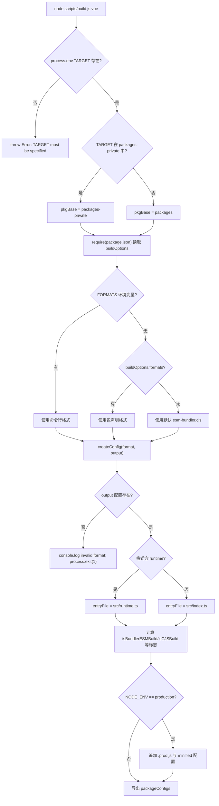

# 제 1 장: 거시적 인식: core 저장소의 엔지니어링 설계 철학

반응형이나 가상 DOM 구현의 어떤 한 줄을 추적하기 시작하기 전에, 우리는 먼저 이 코드들이 생존하는 엔지니어링 모체를 이해해야 합니다. Vue core 저장소를 열면 가장 먼저 눈에 들어오는 것은 프레임워크 핵심 로직이 아니라`package.json`과`pnpm-workspace.yaml`같은 엔지니어링 설정 파일입니다——이들은 런타임 기능을 전혀 포함하지 않지만, 전체 프레임워크가 올바르게 빌드, 테스트, 배포될 수 있는지를 결정합니다. 이 장에서 답하려는 것은 바로 이 전제 질문입니다: core 저장소란 대체 무엇인가. 그것은`@vue/runtime-core`그 npm 패키지가 아니라,`runtime-core`、`reactivity`、`compiler-sfc`등 십여 개의 공개 배포 패키지와`sfc-playground`、`template-explorer`등 비공개 실험 패키지를 담지한 엔지니어링 모체입니다. 이 모체의 조직 방식을 이해하는 것이 이후 모든 장(빌드, 타입, 배포, 용량 예산)의 전제입니다. 이 장은 세 가지 주선을 따라 전개됩니다: workspace의 이중 디렉터리 구조, 루트 레벨 TypeScript와 Rollup의 통일된 제약, 그리고 「소스코드 저장소」와 「배포 산출물」의 분리 철학.

# 一、이중 디렉터리 구조: packages와 packages-private의 물리적 격리

## 직관적 모델

core 저장소를 하나의 연구개발 빌딩이라고 상상해 보세요.`packages/`은 정식 제품 라인으로, 생산된 것은 상표를 붙여 시장에 판매됩니다;`packages-private/`은 내부 실험실로, 그 안의 샘플은 디버깅과 데모에만 사용되며 절대 외부로 출하되지 않습니다. 둘은 동일한 수도와 전기(의존성, 빌드 도구)를 공유하지만, 출입 통제 시스템(배포 프로세스)은 이들을 차별적으로 대우합니다.

만약 이 물리적 격리가 없다면, 내부 디버깅용 playground 패키지가 실수로 npm에 배포되기 쉽습니다——이것은 가정이 아니라 monorepo의 전형적인 사고입니다.

## 데이터 구조와 메모리 레이아웃

workspace의 경계는`pnpm-workspace.yaml`에 의해 정의됩니다. 그것은 단 세 줄의 유효 선언만 있습니다:

[FACT:pnpm-workspace.yaml:1-3]

```yaml
packages:
  - 'packages/*'
  - 'packages-private/*'
```

이 두 개의 glob은 pnpm에게 알려줍니다:`packages/`과`packages-private/`아래의 각 하위 디렉터리가 독립 패키지라고. pnpm은 이들을 위해 심볼릭 링크를 생성하여`@vue/runtime-core`이`@vue/reactivity`을 참조할 때 registry에서 다운로드하는 대신 로컬 소스코드 디렉터리를 직접 가리키게 합니다.

바로 뒤따르는`catalog:`섹션은 pnpm의**의존성 버전 카탈로그**메커니즘입니다:

[FACT:pnpm-workspace.yaml:5-13]

```yaml
catalog:
  '@babel/parser': ^7.29.8
  '@babel/types': ^7.29.8
  'entities': '^7.0.1'
  'estree-walker': ^2.0.2
  'magic-string': ^0.30.21
  'source-map-js': ^1.2.1
  'vite': ^8.3.0
  '@vitejs/plugin-vue': ^6.0.9
```

루트`package.json`에 대응하여 작성된 것은`"@babel/parser": "catalog:"` [FACT:package.json:65-65]。`catalog:`은 플레이스홀더로, pnpm이 설치 시 catalog 섹션에 선언된 버전으로 대체합니다. 이렇게 하는 이점은:`@babel/parser`의 버전이`pnpm-workspace.yaml`한 곳에서만 유지 관리되고, 이를 참조하는 모든 패키지가 자동으로 정렬되어 「A 패키지는 7.28, B 패키지는 7.29」 같은 버전 드리프트를 원천 차단합니다.

## 시나리오 기반 Walkthrough: 한 번의`pnpm install`이후 무슨 일이 일어나는가

저장소 루트 디렉터리에서`pnpm install`을 실행한다고 가정합니다. 이 시나리오에 대입하여 단계별로 추적합니다:

**첫 번째 단계: preinstall 게이트.**pnpm은 설치 전에 루트`package.json`의`preinstall`스크립트를 트리거합니다:

[FACT:package.json:45-45]

```json
"preinstall": "npx only-allow pnpm"
```

> **[Design Inference & Architectural Trade-offs]**
> `only-allow pnpm`은 현재 패키지 관리자가 pnpm인지 확인하고, 아니면 즉시 오류를 내고 종료합니다. 이 스크립트의 존재는 다음을 의미합니다: npm이나 yarn으로 core 저장소를 설치하면 실패합니다. 왜 pnpm을 반드시 고정해야 하는가? core 저장소는 pnpm의 workspace 심볼릭 링크와 catalog 메커니즘에 의존하는데, npm의 workspaces는`catalog:`문법을 지원하지 않고, yarn의 PnP 모드는 모듈 해석 경로를 변경하여 빌드 스크립트의`createRequire`동작이 일관되지 않게 됩니다.

**두 번째 단계: workspace 해석.**pnpm이`pnpm-workspace.yaml`을 읽고,`packages/*`과`packages-private/*`을 스캔하여,`package.json`을 포함한 각 디렉터리에 대해 패키지 레코드를 생성합니다.

**세 번째 단계: catalog 대체 적용.**루트`package.json`에 있는 모든`catalog:`플레이스홀더가 catalog 섹션의 실제 버전으로 대체된 후 일괄 설치됩니다.

**4단계: postinstall 훅.**설치 완료 후 트리거됩니다:

[FACT:package.json:46-46]

```json
"postinstall": "simple-git-hooks"
```

`simple-git-hooks`루트`package.json`에서`simple-git-hooks`필드를 읽고, Git 훅을`.git/hooks/`：

[FACT:package.json:48-51]

```json
"simple-git-hooks": {
  "pre-commit": "pnpm lint-staged && pnpm check",
  "commit-msg": "node scripts/verify-commit.js"
}
```

`pre-commit`복사`commit-msg`훅은 매 커밋 전에 lint-staged와 타입 검사를 실행하고,`preinstall`훅은 커밋 메시지 형식을 검증합니다 (Vue는 conventional commits 사용).`postinstall`와

## 의 대칭성에 주목하세요: 전자는 문지기(오직 pnpm만 허용), 후자는 방어 설치(Git 훅 설치).

> **[Design Inference & Architectural Trade-offs]**
> **〔설계 추론과 아키텍처 트레이드오프〕`packages*/`？**왜 두 개의 glob을 사용하고 하나의`pnpm-workspace.yaml`를 사용하지 않는가`packages*/`두 디렉토리를 명시적으로 나열하는 것은 '공개'와 '비공개'의 의미를 설정 레벨에서 바로 볼 수 있게 하기 위함입니다. 새로 합류한 개발자가

**`allowBuilds`를 읽으면 첫눈에 저장소에 두 종류의 패키지가 있다는 것을 알 수 있습니다. 만약**로 작성했다면 이 의미는 숨겨졌을 것입니다.

[FACT:pnpm-workspace.yaml:15-21]

```yaml
allowBuilds:
  '@parcel/watcher': true
  '@swc/core': true
  'esbuild': true
  'puppeteer': true
  'simple-git-hooks': true
  'unrs-resolver': true
```

이 설정 부분을 주목하세요:`allowBuilds`복사`@swc/core`、`esbuild`pnpm은 기본적으로 의존성 패키지의 설치 스크립트(postinstall) 실행을 금지합니다. 이는 공급망 공격의 흔한 진입점이기 때문입니다.`puppeteer`는 화이트리스트입니다: 나열된 패키지만 빌드 스크립트를 실행할 수 있습니다.`simple-git-hooks`는 플랫폼 관련 네이티브 바이너리를 다운로드해야 하고,

**`minimumReleaseAge: 1440`는 Chromium을 다운로드해야 하며,**는 Git 훅을 작성해야 합니다 — 이들은 모두 합법적인 빌드 시점 동작이므로 명시적으로 허용됩니다.

[FACT:pnpm-workspace.yaml:33-33]

```yaml
minimumReleaseAge: 1440
```

> **[Design Inference & Architectural Trade-offs]**
> 복사`minimumReleaseAgeExclude`〔설계 추론과 아키텍처 트레이드오프〕

[FACT:pnpm-workspace.yaml:36-38]

```yaml
minimumReleaseAgeExclude:
  # Renovate security update: vitest@4.1.11
  - vitest@4.1.11
```

는 특정 보안 패치에 대해 예외를 허용합니다:

---

# 복사

## 주석은 이것이 Renovate가 트리거한 보안 업데이트로 즉시 적용되어야 하므로 쿨다운 기간이 면제된다고 명확히 설명합니다.

2. 루트 레벨 tsconfig: 모든 하위 패키지의 타입 경계 통일 제약`strict: false`직관적 모델`strict: true`만약 각 하위 패키지가 각자 tsconfig를 유지한다면 'A 패키지는**, B 패키지는**'의 균열이 발생합니다. 루트 레벨 tsconfig는

## 헌법

입니다: 모든 하위 패키지가 공통으로 준수해야 할 타입 규칙을 규정하며, 하위 패키지는 이를 기반으로 추가만 할 수 있고 위반할 수 없습니다.`tsconfig.json`데이터 구조와 메모리 레이아웃`compilerOptions`루트

[FACT:tsconfig.json:5-29]

```json
"target": "es2016",
"module": "esnext",
"moduleResolution": "bundler",
"strict": true,
"noUnusedLocals": true,
"isolatedModules": true,
"isolatedDeclarations": true,
"composite": true,
"paths": {
  "@vue/compat": ["./packages/vue-compat/src"],
  "@vue/*": ["./packages/*/src"],
  "vue": ["./packages/vue/src"]
}
```

는 전체 저장소 타입 시스템의 기초입니다. 몇 가지 핵심 필드를 골라보겠습니다:

- `target: es2016`복사`target`하나씩 해석:`isServerRenderer || isCJSBuild ? 'es2019' : 'es2016'` [FACT:rollup.config.js:337-337]）。
- `moduleResolution: bundler`: 출력 구문을 ES2016으로 다운그레이드. 이는 Rollup 설정에서 esbuild의`exports`와 호응합니다 (
- `strict: true`: 번들러 스타일 모듈 해석을 채택하여 확장자 생략,`strictNullChecks`、`noImplicitAny`필드 지원.
- `noUnusedLocals: true`: 모든 엄격 검사 활성화,
- `isolatedModules: true`등 포함.
- `isolatedDeclarations: true`: 사용되지 않는 지역 변수는 즉시 오류. 이 규칙은 Tree-shaking과 함께 실질적 의미가 있습니다 — 사용되지 않는 변수는 종종 데드 코드의 신호입니다.`.d.ts`: 각 파일이 독립적으로 트랜스파일 가능해야 함을 요구. 이는 esbuild/swc 같은 '파일별 트랜스파일, 크로스 파일 타입 분석 없음' 도구의 전제 조건입니다.`tsc`: 모든 내보내기에 타입을 명시적으로 표기해야 함을 요구. 이 규칙은
- `composite: true`생성 파이프라인에 직접 기여합니다 — 명시적 표기만이

`paths`가 전체 타입 추론 없이 빠르게 선언 파일을 생성할 수 있게 합니다.**: 프로젝트 참조(project references)에 필요한 증분 빌드 메타데이터 활성화.**：`@vue/*`필드는 workspace의`./packages/*/src`타입 레이어 미러`node_modules`로 매핑되어 TypeScript가 컴파일 시점에

## 의 심볼릭 링크가 아닌 소스 코드를 직접 해석하게 합니다. 이는 pnpm의 런타임 심볼릭 링크와 상호 보완적입니다 — 런타임은 pnpm, 컴파일 시점은 paths.`pnpm check`시나리오 기반 워크스루: 한 번의

`check`타입 검사`tsc --incremental --noEmit` [FACT:package.json:15-15]스크립트는

**입니다. 이 시나리오를 대입해보면:**1단계: include 범위 읽기.`include`tsconfig의

[FACT:tsconfig.json:31-39]

```json
"include": [
  "packages/global.d.ts",
  "packages/*/src",
  "packages/*/__tests__",
  "packages/vue/jsx-runtime",
  "packages/runtime-dom/types/jsx.d.ts",
  "scripts/*",
  "rollup.*.js"
]
```

복사`scripts/*`주목할 점은`rollup.*.js`와`rollup.config.js`도 검사 범위에 포함된다는 것입니다. 이는 빌드 스크립트 자체도 타입 제약을 받는다는 의미입니다 —`// @ts-check` [FACT:rollup.config.js:1-1]상단의`tsc`와 JSDoc 타입 주석이 결합되어 이 순수 JS 파일도

**검사를 받을 수 있게 합니다.**

[FACT:tsconfig.json:40-40]

```json
"exclude": ["packages-private/sfc-playground/src/vue-dev-proxy*"]
```

> **[Design Inference & Architectural Trade-offs]**
> `sfc-playground`〔설계 추론과 아키텍처 트레이드오프〕`vue-dev-proxy`의

**파일이 제외됩니다. 왜일까요? 이런 파일은 보통 런타임에 동적으로 생성되는 프록시 코드로, 타입 형태가 불안정하여 검사에 포함하면 노이즈가 발생합니다.** `--incremental`3단계: 증분 검사.`tsc`는`.tsbuildinfo`가 이전 검사 결과를`--noEmit`에 캐시하고 변경된 파일만 재검사하도록 합니다.

## 는 검사만 하고 출력하지 않음을 나타냅니다 — 타입 검사와 산출물 생성은 두 개의 독립적인 파이프라인입니다.

**`isolatedDeclarations`설계 사고와 함정**의 비용과 이익.`export function foo(): number`이 규칙을 활성화하면 모든 내보내기에 반환 타입을 명시적으로 표기해야 합니다. 예를 들어`export function foo() { return 1 }`대신`.d.ts`처럼. 이는 작성 비용을 증가시키지만, 그 대가로`tsc`생성 속도가 크게 향상됩니다 —`build-dts`는 크로스 파일 추론 없이 선언 파일을 생성할 수 있습니다. 이는`tsc -p tsconfig.build.json --noCheck`스크립트`--noCheck`의

**`types`플래그와 호응합니다: 타입이 이미 명시적으로 표기되었으므로 선언 파일 생성 시 검사를 건너뛸 수도 있습니다.**

[FACT:tsconfig.json:21-21]

```json
"types": ["vitest/globals", "puppeteer", "node"]
```

복사`describe`、`it`、`expect`이 세 가지 타입 패키지가 전역으로 주입되어, 테스트 파일은`puppeteer`를 import 없이 직접 사용할 수 있고, e2e 테스트는

---

# 三、Rollup 구성: buildOptions에서 다중 포맷 산출물까지의 통합 팩토리

## 직관적 모델

Rollup 구성은 core 저장소의**총조립车间**이다. 특정 패키지가 무엇을 하는지는 관심 없고, 「이 패키지가 어떤 포맷을 산출해야 하는지, 각 포맷의 진입 파일이 어디에 있는지, 어떤 의존성을 외부화해야 하는지」만 신경 쓴다. 각 하위 패키지의`package.json`에 있는`buildOptions`필드는 패키지에 붙은 출하 전표이고, 총조립车间은 전표를 보고 작업한다.

## 데이터 구조와 메모리 레이아웃

구성 파일의 진입점에서 「패키지별 빌드」 모델이 확립된다:

[FACT:rollup.config.js:32-44]

```js
if (!process.env.TARGET) {
  throw new Error('TARGET package must be specified via --environment flag.')
}
...
const privatePackages = fs.readdirSync('packages-private')
const pkgBase = privatePackages.includes(process.env.TARGET)
  ? `packages-private`
  : `packages`
const packagesDir = path.resolve(__dirname, pkgBase)
const packageDir = path.resolve(packagesDir, process.env.TARGET)
...
const pkg = require(resolve(`package.json`))
const packageOptions = pkg.buildOptions || {}
const name = packageOptions.filename || path.basename(packageDir)
```

핵심 설계:`TARGET`환경 변수로 어떤 패키지를 빌드할지 지정한다. 구성은`fs.readdirSync('packages-private')`을 통해 해당 패키지가 공개 디렉터리에 속하는지 비공개 디렉터리에 속하는지 판단하여`pkgBase`을 결정한다. 이것은**런타임 디렉터리 탐지**이다——「어떤 패키지가 비공개인지」 목록을 유지할 필요 없이, 디렉터리 구조 자체가 진실이다.

`buildOptions`은 하위 패키지`package.json`의 사용자 정의 필드로,`packageOptions.filename`은 산출물 파일명 접두사를 결정하고,`packageOptions.formats`은 기본 빌드 포맷을 결정한다.

포맷에서 산출물로의 매핑은`outputConfigs`에 의해 정의된다:

[FACT:rollup.config.js:58-88]

```js
const outputConfigs = {
  'esm-bundler': { file: resolve(`dist/${name}.esm-bundler.js`), format: 'es' },
  'esm-browser': { file: resolve(`dist/${name}.esm-browser.js`), format: 'es' },
  cjs:           { file: resolve(`dist/${name}.cjs.js`),         format: 'cjs' },
  global:        { file: resolve(`dist/${name}.global.js`),      format: 'iife' },
  'esm-bundler-runtime': { file: resolve(`dist/${name}.runtime.esm-bundler.js`), format: 'es' },
  'esm-browser-runtime': { file: resolve(`dist/${name}.runtime.esm-browser.js`), format: 'es' },
  'global-runtime':      { file: resolve(`dist/${name}.runtime.global.js`),      format: 'iife' },
}
```

일곱 가지 포맷으로 세 가지 소비 시나리오를 커버한다:`esm-bundler`은 Vite/webpack 등 번들러가 소비하고,`esm-browser`은 브라우저 네이티브 ESM이 소비하며,`global`은`<script>`태그가 소비한다.`-runtime`접미사가 붙은 것은 「런타임 전용」 빌드로, 메인`vue`패키지에만 개방된다.

## 시나리오 기반 Walkthrough: 한 번의`pnpm build vue`완전한 의사결정 흐름

실행`node scripts/build.js vue`시나리오에 대입한다.`TARGET=vue`, 내부 의사결정을 추적한다:`createConfig`

**첫 번째 단계: 포맷 목록 결정.**

[FACT:rollup.config.js:91-92]

```js
const defaultFormats = ['esm-bundler', 'cjs']
const inlineFormats = process.env.FORMATS && process.env.FORMATS.split(',')
const packageFormats = inlineFormats || packageOptions.formats || defaultFormats
const packageConfigs = process.env.PROD_ONLY
  ? []
  : packageFormats.map(format => createConfig(format, outputConfigs[format]))
```

우선순위: 명령줄`FORMATS`> 하위 패키지`buildOptions.formats`> 기본`['esm-bundler', 'cjs']`。`PROD_ONLY`환경 변수가 참이면 비프로덕션 빌드를 건너뛰고 이후 추가되는`.prod.js`구성만 유지한다.

**두 번째 단계: 빌드 플래그 계산.** `createConfig`내부에서 포맷 문자열에 따라 일련의 불리언 플래그를 도출한다:

[FACT:rollup.config.js:131-142]

```js
const isProductionBuild = process.env.__DEV__ === 'false' || /\.prod\.js$/.test(output.file)
const isBundlerESMBuild = /esm-bundler/.test(format)
const isBrowserESMBuild = /esm-browser/.test(format)
const isServerRenderer = name === 'server-renderer'
const isCJSBuild = format === 'cjs'
const isGlobalBuild = /global/.test(format)
const isCompatPackage = pkg.name === '@vue/compat'
const isCompatBuild = !!packageOptions.compat
const isBrowserBuild =
  (isGlobalBuild || isBrowserESMBuild || isBundlerESMBuild) &&
  !packageOptions.enableNonBrowserBranches
```

이 플래그들은 이후 모든 의사결정의**단일 진실 공급원**이다: 진입 파일 선택, define 치환, external 판정, 플러그인 조립이 전부 이들에 의존한다.

**세 번째 단계: 진입 파일 선택.**

[FACT:rollup.config.js:159-168]

```js
let entryFile = /runtime$/.test(format) ? `src/runtime.ts` : `src/index.ts`

if (isCompatPackage && (isBrowserESMBuild || isBundlerESMBuild)) {
  entryFile = /runtime$/.test(format)
    ? `src/esm-runtime.ts`
    : `src/esm-index.ts`
}
```

기본 진입은`src/index.ts`이고, 런타임 전용 빌드는`src/runtime.ts`을 사용한다. compat 패키지(`@vue/compat`, 즉 Vue 2 호환 빌드)는 default와 named 내보내기를 동시에 제공해야 하는데, 이는 Rollup이 비 ESM 타깃에 대해 오류를 발생시키므로 ESM 빌드에는 별도로`esm-index.ts` / `esm-runtime.ts`진입을 사용한다.

**네 번째 단계: define 치환 테이블 생성.** `resolveDefine`이 소스 코드의`__DEV__`、`__BROWSER__`등 컴파일 타임 상수를 리터럴로 치환한다:

[FACT:rollup.config.js:170-201]

```js
const replacements = {
  __COMMIT__: `"${process.env.COMMIT}"`,
  __VERSION__: `"${masterVersion}"`,
  __TEST__: `false`,
  __BROWSER__: String(isBrowserBuild),
  __GLOBAL__: String(isGlobalBuild),
  __ESM_BUNDLER__: String(isBundlerESMBuild),
  __ESM_BROWSER__: String(isBrowserESMBuild),
  __CJS__: String(isCJSBuild),
  __SSR__: String(!isGlobalBuild),
  __COMPAT__: String(isCompatBuild),
  __FEATURE_SUSPENSE__: `true`,
  __FEATURE_OPTIONS_API__: isBundlerESMBuild ? `__VUE_OPTIONS_API__` : `true`,
  __FEATURE_PROD_DEVTOOLS__: isBundlerESMBuild ? `__VUE_PROD_DEVTOOLS__` : `false`,
  __FEATURE_PROD_HYDRATION_MISMATCH_DETAILS__: isBundlerESMBuild ? `__VUE_PROD_HYDRATION_MISMATCH_DETAILS__` : `false`,
}
```

여기에는 정교한 계층화가 있다:**feature flags는 esm-bundler 빌드에서 하드코딩되지 않고`__VUE_OPTIONS_API__`과 같은 식별자로 유지되어**, 최종 사용자의 번들러가 치환하도록 맡긴다. 이렇게 하면 사용자가`define: { __VUE_OPTIONS_API__: false }`을 통해 Options API 지원을 끄고 관련 코드를 Tree-shake할 수 있다. 반면 global/esm-browser 빌드에서는 이 flag들이`true`/`false`으로 하드코딩되는데, 브라우저가 직접 소비하는 산출물에는 번들러가 개입하지 않기 때문이다.

**다섯 번째 단계: 환경 변수 오버라이드 허용.**

[FACT:rollup.config.js:208-216]

```js
// allow inline overrides like
//__RUNTIME_COMPILE__=true pnpm build runtime-core
Object.keys(replacements).forEach(key => {
  if (key in process.env) {
    const value = process.env[key]
    assert(typeof value === 'string')
    replacements[key] = value
  }
})
```

모든 define 키는 동명의 환경 변수로 오버라이드할 수 있다. 주석에 제시된 예는`__RUNTIME_COMPILE__=true pnpm build runtime-core`——특정 컴파일 분기를 디버깅하는 데 사용된다.

**여섯 번째 단계: 플러그인 체인 조립.**

[FACT:rollup.config.js:324-342]

```js
plugins: [
  json({ namedExports: false }),
  alias({ entries }),
  enumPlugin,
  ...resolveReplace(),
  esbuild({
    tsconfig: path.resolve(__dirname, 'tsconfig.json'),
    sourceMap: output.sourcemap,
    minify: false,
    target: isServerRenderer || isCJSBuild ? 'es2019' : 'es2016',
    define: resolveDefine(),
  }),
  ...resolveNodePlugins(),
  ...plugins,
],
```

플러그인 순서에는 의미가 있다:`json`이 먼저 JSON 임포트를 처리하고,`alias`이`@vue/*`을 소스 경로에 매핑하며,`enumPlugin`이 열거형 인라인을 하고,`replace`이 문자열 치환을 하며,`esbuild`이 TS 트랜스파일을 한다.`esbuild`의`tsconfig`이 루트 tsconfig를 가리킨다는 점에 주목하라——**모든 하위 패키지가 동일한 타입 구성을 공유한다**. 이것이 바로 두 번째 절에서 논의한 「헌법」이 빌드 시점에 구현된 것이다.

**일곱 번째 단계: 프로덕션 빌드 추가.**만약`NODE_ENV=production`：

[FACT:rollup.config.js:97-114]

```js
if (process.env.NODE_ENV === 'production') {
  packageFormats.forEach(format => {
    if (packageOptions.prod === false) {
      return
    }
    if (format === 'cjs') {
      packageConfigs.push(createProductionConfig(format))
    }
    if (/^(global|esm-browser)(-runtime)?/.test(format)) {
      packageConfigs.push(createMinifiedConfig(format))
    }
  })
}
```

CJS 포맷에는`.prod.js`버전을 추가하고(`__DEV__=false`로 치환), global과 esm-browser 포맷에는 압축 버전을 추가한다(swc로 minify).`packageOptions.prod === false`의 패키지는 이 메커니즘에서 빠질 수 있다.

전체 의사결정 흐름은 아래 제어 흐름도로 요약할 수 있다:



## 설계 고찰과 함정

**`external`의 삼분기 전략.** `resolveExternal`은 빌드 유형에 따라 서로 다른 외부화 목록을 반환한다:

[FACT:rollup.config.js:257-283]

```js
function resolveExternal() {
  const treeShakenDeps = ['source-map-js', '@babel/parser', 'estree-walker', 'entities/decode']

  if (isGlobalBuild || isBrowserESMBuild || isCompatPackage) {
    if (!packageOptions.enableNonBrowserBranches) {
      return treeShakenDeps
    }
  } else {
    return [
      ...Object.keys(pkg.dependencies || {}),
      ...Object.keys(pkg.peerDependencies || {}),
      ...['path', 'url', 'stream'],
      ...treeShakenDeps,
    ]
  }
}
```

브라우저 빌드(global/esm-browser)는 모든 의존성을 인라인하고`treeShakenDeps`만 external로 나열하여 경고를 억제한다——이 의존성들은 브라우저 분기에서 실제로 참조되지 않으며 Tree-shaking으로 제거된다. Node/esm-bundler 빌드는 모든`dependencies`과`peerDependencies`을 외부화하여 소비자가 의존성 버전을 직접 관리하게 한다.

**`onwarn`이 순환 의존성을 필터링한다.**

[FACT:rollup.config.js:344-348]

```js
onwarn: (msg, warn) => {
  if (msg.code !== 'CIRCULAR_DEPENDENCY') {
    warn(msg)
  }
},
```

순환 의존성 경고가 무시된다. Vue의`runtime-core`과`reactivity`사이에는 합법적인 순환 참조가 존재하며(반응형 시스템이 컴포넌트 인스턴스 타입을 참조해야 함), 이 순환은 런타임에 안전하므로 필터링된다.

**`treeshake.moduleSideEffects: false`의 공격적 가정.**

[FACT:rollup.config.js:355-355]

```js
treeshake: {
  moduleSideEffects: false,
},
```

이것은 Rollup에게 모든 모듈에 부작용이 없으므로 참조되지 않은 임포트를 안심하고 제거할 수 있다고 알린다. 이것은**공격적 가정**이다——만약 어떤 모듈이 최상위에서 부작용 코드(예: 전역 변수 등록)를 실행한다면 잘못 제거될 수 있다. Vue 소스 코드는 관례를 통해 모든 모듈이 순수함을 보장하므로 이 최적화를 켤 수 있다.

**swc-minify의`pure_getters`함정.**

[FACT:rollup.config.js:373-388]

```js
async renderChunk(contents, _, { format }) {
  const { code } = await minifySwc(contents, {
    module: format === 'es',
    format: { comments: false },
    compress: { ecma: 2016, pure_getters: true },
    safari10: true,
    mangle: true,
  })
  return { code: banner + code, map: null }
}
```

`pure_getters: true`은 압축기에게 「속성 접근에 부작용이 없다」고 알려 사용되지 않는 getter 호출을 안전하게 제거할 수 있게 한다. 이것은 Vue의 반응형 코드에 위험하다——`obj.foo`이 getter를 트리거하고 의존성을 수집할 수 있다. 하지만 여기서는 global/esm-browser 프로덕션 빌드에만 사용되며, Vue 소스 코드에서 의존성 수집은 명시적 함수 호출을 통해`track()`) 암시적 getter 부작용이 아닌 방식으로 완료되므로 안전하다.`map: null`압축 후 sourcemap을 생성하지 않음을 나타낸다——프로덕션 산출물에는 디버깅 매핑이 필요 없다.

---

# 설계 사고: 왜 소스 저장소와 배포 산출물이 반드시 분리되어야 하는가

이 장의 핵심 명제로 돌아가자. core 저장소의 엔지니어링 설계에는 일관되게 관통하는 하나의 주선이 있다:**소스 저장소의 책임은 「생산」, 배포 산출물의 책임은 「소비」이며, 둘은 빌드 파이프라인을 통해 분리된다**。

구체적으로 세 가지 차원에서 나타난다:

**첫째, 소스는 직접 배포되지 않는다.** `package.json`의`private: true` [FACT:package.json:2-2]은 루트 패키지가 절대 배포되지 않음을 나타낸다. 각 하위 패키지의`package.json`에서`main`/`module`/`exports`필드는`dist/`아래의 산출물을 가리키며,`src/`이 아니다. 사용자가`vue`을 설치할 때 받는 것은 빌드된`.js`과`.d.ts`이며, 소스는 저장소에 남는다.

**둘째, 산출물 형식은 소비 시나리오에 의해 결정된다.**일곱 가지 형식은 임의로 나열된 것이 아니라 일곱 가지 실제 소비 경로에 대응한다: Vite 사용자는`esm-bundler`을, CDN 사용자는`global`을, Node SSR 사용자는`cjs`을 받는다. 형식 선택 로직은`rollup.config.js`한 곳에 집중되어 있으며, 하위 패키지는`buildOptions.formats`에서 필요한 형식만 선언하면 된다.

**셋째, 타입과 구현의 분리.** `build-dts`스크립트`tsc -p tsconfig.build.json --noCheck && rollup -c rollup.dts.config.js` [FACT:package.json:9-9]은`.d.ts`생성이 독립적인 파이프라인임을 나타낸다.`isolatedDeclarations: true`는 선언 파일 생성이 타입 검사를 건너뛸 수 있게 한다(`--noCheck`). 타입이 이미 명시적으로 표기되어 있기 때문이다.

> **[Design Inference & Architectural Trade-offs]**
> 이러한 분리의 심층적 동기는:**소스의 조직 방식은 개발자를 위해 봉사하고, 산출물의 조직 방식은 소비자를 위해 봉사하며, 둘의 최적해는 다르다**. 소스는 명확한 디렉터리 구조, 완전한 타입 정보, 디버깅 가능한 sourcemap이 필요하다; 산출물은 최소한의 크기, 올바른 모듈 형식, 안정적인 API 표면이 필요하다. 둘을 억지로 통일하면(예: TS 소스를 직접 배포) 양쪽의 경험을 동시에 해친다.

---

# 이 장 요약

이 장은 세 가지 차원에서 core 저장소에 대한 거시적 인식을 확립했다:

1. **이중 디렉터리 구조**：`packages/`과`packages-private/`의 물리적 격리, pnpm workspace의 심볼릭 링크와 catalog 버전 디렉터리를 결합하여 「공개 패키지」와 「비공개 패키지」의 명확한 경계를 구현했다.`preinstall`게이트,`allowBuilds`화이트리스트,`minimumReleaseAge`쿨다운 기간이 함께 공급망 보안 방어선을 구성한다.

2. **루트 레벨 tsconfig**: 모든 하위 패키지의 타입 헌법으로서,`paths`매핑을 통해 컴파일 시점의 workspace 해석을 구현하고,`isolatedDeclarations`과`composite`을 통해 증분 빌드와 빠른 선언 파일 생성을 지원한다.

3. **Rollup 통합 팩토리**:`TARGET`환경 변수를 진입점으로,`buildOptions`을 통해 하위 패키지 메타 정보를 읽고, 일련의 불리언 플래그로 진입점 선택, define 치환, external 판정, 플러그인 조립을 구동하여 최종적으로 일곱 가지 형식의 산출물을 생성한다.

핵심 철학은**소스 저장소와 배포 산출물의 분리**: 저장소는 생산을 담당하고, 산출물은 소비를 담당하며, 빌드 파이프라인은 둘 사이의 유일한 다리이다.

---

# 장말 전환

이 장은 「core 저장소란 무엇인가」에 답했다. 그러나 저장소의 정적 구조는 무대일 뿐, 진짜 드라마는 한 번의 빌드 요청 실행 과정에서 일어난다:`scripts/build.js`이 어떻게 명령줄 인자를 파싱하고, Rollup API를 호출하며, 빌드 실패와 동시성을 처리하는가. 다음 장에서는 한 번의 빌드 요청이 입력에서 산출물까지 가는 엔드투엔드 여정을 추적하여, 이 장에서 확립한 정적 인식을 동적 실행 뷰로 전환한다.

# 이 장 생각해보기와 자가 점검

Q1: 만약`pnpm-workspace.yaml`의`minimumReleaseAge: 1440`을`0`로 바꾸면, 의존성 업그레이드 시나리오에서 어떤 위험이 발생하는가? 왜`minimumReleaseAgeExclude`의 존재가 필수적인가?

**참고 해석**：

`minimumReleaseAge: 1440` [FACT:pnpm-workspace.yaml:33-33]은 새로 배포된 의존성 버전이 24시간을 충족해야만 설치를 허용하도록 요구한다. 만약`0`로 바꾸면, 방금 배포된 어떤 버전이든 즉시 끌어올 수 있다.

위험 시나리오: 공격자가 어떤 전이 의존성(예:`@babel/parser`의 어떤 patch 버전)을 탈취하여 악성 postinstall 스크립트를 포함한 버전을 배포한다. 24시간 쿨다운 기간 동안 커뮤니티는 보통 문제를 발견하고 해당 버전을 철회한다; 만약 쿨다운 기간이 0이면, core 저장소의 CI가 공격 윈도우 내에 자동으로 업그레이드하여 악성 스크립트를 실행할 수 있다.

`minimumReleaseAgeExclude` [FACT:pnpm-workspace.yaml:36-38]의 존재 이유는 쿨다운 기간 메커니즘이 보안 패치의 긴급성과 충돌하기 때문이다. 주석의`vitest@4.1.11`은 Renovate가 감지한 보안 업데이트이다——이런 업데이트는 즉시 적용되어야 하며, 24시간을 기다리면 오히려 노출 윈도우가 연장된다. 따라서 보안 업데이트가 쿨다운 기간을 우회할 수 있도록 명시적 예외 목록이 필요하다. 이는 「기본은 보수적, 예외는 명시적」이라는 보안 설계 원칙을 보여준다.

Q2: `rollup.config.js`에서`resolveDefine`의`__FEATURE_OPTIONS_API__`에 대한 처리는`isBundlerESMBuild ? '__VUE_OPTIONS_API__' : 'true'`이다. 만약 잘못하여 모든 형식에 대해`'true'`을 반환하도록 바꾸면, 최종 사용자에게 어떤 영향이 발생하는가?

**참고 해석**：

[FACT:rollup.config.js:192-194]

```js
__FEATURE_OPTIONS_API__: isBundlerESMBuild
  ? `__VUE_OPTIONS_API__`
  : `true`,
```

esm-bundler 빌드에서,`__FEATURE_OPTIONS_API__`은 식별자`__VUE_OPTIONS_API__`로 유지되어 최종 사용자의 번들러가 치환하도록 넘긴다. 사용자는 자신의 빌드 설정에서`define: { __VUE_OPTIONS_API__: false }`을 설정하여 Tree-shaking이 모든 Options API 관련 코드(`data`、`methods`、`computed`등 옵션의 처리 로직)를 제거하도록 할 수 있어 산출물 크기를 현저히 줄인다.

만약 모든 형식에 대해`'true'`을 반환하도록 바꾸면, esm-bundler 산출물에서 Options API 코드가 하드코딩되어 유지되고, 사용자의`define`설정이 무효화되어 Tree-shake할 수 없다. Composition API만 사용하는 프로젝트의 경우, 이는 수 KB의 산출물 크기를 헛되이 증가시킨다.

이 설계의 핵심 통찰은:**esm-bundler 산출물의 최종 형태는 사용자의 번들러가 결정하므로, feature flag는 반드시 사용자 빌드 시점까지 지연되어 해석되어야 한다**. 반면 global/esm-browser 산출물은 브라우저에서 직접 실행되며 번들러가 개입하지 않으므로 반드시 하드코딩해야 한다.

Q3: `rollup.config.js`의`resolveExternal`에서 브라우저 빌드는`treeShakenDeps`만 external로 반환하고, Node 빌드는 모든`dependencies`를 반환합니다. 언젠가 누군가`runtime-core`에 새로운 런타임 의존성`foo-lib`를 추가했지만`resolveExternal`의 로직을 업데이트하는 것을 잊었다고 가정해 봅시다. 브라우저 빌드에서 무슨 일이 발생할까요?

**참고 해석**：

[FACT:rollup.config.js:257-283]

브라우저 빌드(`isGlobalBuild || isBrowserESMBuild`)는`!packageOptions.enableNonBrowserBranches`시`treeShakenDeps`（`source-map-js`、`@babel/parser`、`estree-walker`、`entities/decode`만 반환합니다). 이는`foo-lib`이 external 목록에 없음을 의미하며,

여기까지 우리는 core 저장소가 엔지니어링 모체로서 가지는 전체 설계 철학을 거시적 차원에서 살펴보았습니다: 이중 디렉터리 workspace 구조가 공개 패키지와 비공개 실험 패키지의 경계를 설정하고, 루트 레벨 TypeScript와 Rollup 설정이 통일된 제약을 제공하며, 소스 저장소와 배포 산출물의 분리가 다중 포맷 출력을 가능하게 합니다. 이러한 인식은 이후 구체적인 엔지니어링 체인을 깊이 파고들기 위한 길을 열어줍니다. 다음 장에서는 시선을 정적 구조에서 동적 흐름으로 전환하여,`node scripts/build.js vue`를 기점으로 하나의 완전한 빌드 요청이 명령줄 인자 파싱, 대상 패키지 위치 파악, Rollup 설정 생성부터 산출물 디스크 저장까지의 엔드투엔드 여정을 추적하며, build.js가 parseArgs를 통해 formats/devOnly/release 등의 플래그를 어떻게 파싱하는지, 대상 패키지의 package.json을 동적으로 require하고 buildOptions를 읽는 방법, 최종적으로 rollup.config.js를 구동하여 esm-bundler, cjs, global 등 다중 포맷 산출물을 생성하는지 살펴봅니다.
