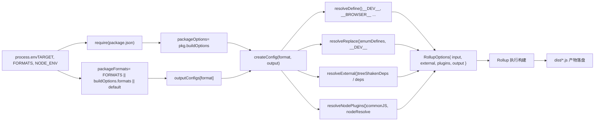

# 제 2 장: 메인 라이프사이클: 하나의 빌드 요청의 엔드투엔드 여정

이전 장에서 우리는 core 저장소가 엔지니어링 모체로서 가지는 위치와 pnpm workspace 및 루트 레벨 설정이 모든 하위 패키지를 어떻게 통일적으로 제약하는지 명확히 했습니다. 이제 빌드 시스템의 핵심으로 깊이 들어가 하나의 명령이 전체 빌드 프로세스를 어떻게 구동하는지 추적합니다.`node scripts/build.js vue`는 단순해 보이지만, 모든 산출물——esm-bundler, cjs, global——의 유일한 진입점입니다. 이것이 사용자 의도를 실행 가능한 빌드 작업으로 변환하는 방법을 이해하는 것은 Vue 빌드 메커니즘을 파악하는 핵심 단계입니다.

# Rollup 설정 생성: 환경 변수에서 다중 포맷 산출물까지

`build.js`가`exec`를 통해 Rollup을 시작한 후, 제어권은`rollup.config.js`로 넘어갑니다. 이 파일은 빌드 시스템의 「두뇌」입니다——환경 변수를 읽고 Rollup 설정 객체 배열을 동적으로 생성합니다.

## 환경 변수 검증 및 패키지 위치 파악

[FACT:rollup.config.js:27-29]

만약`TARGET`가 설정되지 않으면 즉시 오류를 발생시킵니다. 이는 방어적 프로그래밍입니다: Rollup 설정이 직접 호출될 수 있으며(예:`rollup -c`), 이때`build.js`가 환경 변수를 주입하지 않으므로 빠르게 실패해야 합니다.

[FACT:rollup.config.js:32-44]

여기서`build.js`의 비공개 패키지 판단 로직이 반복됩니다——왜냐하면`rollup.config.js`는 독립 프로세스로`build.js`의 메모리 상태를 공유할 수 없기 때문입니다.`resolve`함수는 상대 경로를 패키지 디렉터리 아래의 절대 경로로 해석하며,`pkg`는 대상 패키지의`package.json`내용이고,`packageOptions`는 그 안의`buildOptions`필드이며,`name`는 산출물 파일명 접두사입니다(`buildOptions.filename`를 우선 사용하고, 그렇지 않으면 디렉터리명 사용).

## 포맷 매핑 테이블:`outputConfigs`

[FACT:rollup.config.js:58-88]

이 테이블은 7가지 포맷에서 출력 설정으로의 매핑을 정의합니다. 핵심 관찰:

- `esm-bundler`、`esm-browser`、`esm-bundler-runtime`、`esm-browser-runtime`는 모두`format: 'es'`이며, 차이는 파일명에만 있습니다.
- `cjs`는`format: 'cjs'`。
- `global`이고`global-runtime`는`format: 'iife'`(즉시 실행 함수 표현식)으로,`<script>`태그로 직접 도입하기에 적합합니다.
- `runtime`접미사의 포맷은 메인`vue`패키지에만 의미가 있습니다——컴파일러를 포함하지 않아 크기가 더 작습니다.

## 포맷 선택: 3계층 우선순위

[FACT:rollup.config.js:91-92]

포맷 선택은 3계층 우선순위를 따릅니다: 명령줄`FORMATS`환경 변수 > 패키지의`buildOptions.formats`> 기본`['esm-bundler', 'cjs']`。`PROD_ONLY`환경 변수는 기본 설정을 건너뛸지 여부를 제어합니다——프로덕션 버전만 빌드하는 경우 기본 설정 배열이 비어 있고, 이후 프로덕션 설정만 푸시됩니다.

## 프로덕션 설정 추가 로직

[FACT:rollup.config.js:97-114]

일 때, 각 포맷에 대해:`NODE_ENV === 'production'`만약

- 이면, 건너뜁니다(해당 패키지는 프로덕션 버전이 필요하지 않음).`packageOptions.prod === false`만약
- 이면,`cjs`를 추가합니다——`createProductionConfig`파일을 생성합니다.`.prod.js`만약
- 와 일치하면,`/^(global|esm-browser)(-runtime)?/`를 추가합니다——압축 버전을 생성합니다.`createMinifiedConfig`〔설계 추론 및 아키텍처 트레이드오프〕

> **[Design Inference & Architectural Trade-offs]**
> 는`cjs`를 사용하고`createProductionConfig`는`global`/`esm-browser`를 사용할까요? 왜냐하면 CJS는 Node용이므로 Node 환경은 압축이 필요하지 않지만(사용자가 직접 처리), dev/prod 분기를 구분해야 하기 때문입니다; 반면 브라우저에서 직접 도입하는 산출물은 크기를 줄이기 위해 반드시 압축해야 합니다. 이 차이는 두 팩토리 함수의 구현에 반영됩니다.`createMinifiedConfig`: 설정 생성의 핵심

## `createConfig`는 가장 큰 함수로, 포맷과 출력 설정을 받아 완전한 Rollup 설정 객체를 반환합니다.

`createConfig`시작 부분은 일련의 불리언 플래그 계산입니다:

[FACT:rollup.config.js:125-142]

:

- `isProductionBuild`환경 변수 또는 파일명에`__DEV__`포함 여부로 판단.`.prod.js`: 포맷명 정규식 매칭으로 판단.
- `isBundlerESMBuild`、`isBrowserESMBuild`、`isCJSBuild`、`isGlobalBuild`: 패키지명이
- `isServerRenderer`인지 여부: Vue 2 호환 빌드 관련.`server-renderer`。
- `isCompatPackage`、`isCompatBuild`: 전역 빌드 또는 브라우저 ESM 빌드이며, 비브라우저 분기가 활성화되지 않음.
- `isBrowserBuild`이러한 플래그는 이후

에서 반복적으로 사용되며, 설정 차별화의 핵심 근거입니다.`resolveDefine`、`resolveReplace`、`resolveExternal`출력 설정의 기본 사항: banner 저작권 헤더,

[FACT:rollup.config.js:144-157]

모드(compat 패키지는`exports`사용, 나머지는`auto`사용), CJS 빌드에`named`상호운용 활성화, sourcemap은 환경 변수로 제어,`esModule`와`externalLiveBindings: false`는 Rollup 4의 호환성 설정입니다. 전역 빌드는 추가로`reexportProtoFromExternal: false`를 설정합니다, 즉`output.name`에 마운트되는 변수명입니다.`window`진입 파일 선택

## 기본 진입은

[FACT:rollup.config.js:159-168]

이지만,`src/index.ts`접미사의 포맷은`runtime`를 사용합니다`src/runtime.ts`. compat 패키지의 ESM 빌드는 default와 named를 동시에 내보내야 하므로 별도의`esm-index.ts` / `esm-runtime.ts`진입점을 사용한다.

## 매크로 정의:`resolveDefine`

[FACT:rollup.config.js:170-218]

`resolveDefine`소스 코드의`__COMMIT__`、`__VERSION__`、`__BROWSER__`등의 매크로를 리터럴로 치환하는 치환 테이블을 반환한다. 이 매크로들은 소스 코드에서 조건부 컴파일에 사용된다—예를 들어`if (__DEV__) { ... }`프로덕션 빌드에서`if (false) { ... }`로 치환되어 Tree-shaking으로 제거된다.

핵심 설계:`__FEATURE_OPTIONS_API__`、`__FEATURE_PROD_DEVTOOLS__`등의 기능 플래그는`esm-bundler`빌드에서`__VUE_OPTIONS_API__`과 같은 식별자로 유지되어 최종 사용자가 번들러 설정으로 오버라이드할 수 있게 한다. 반면 다른 빌드에서는`true`또는`false`。

[FACT:rollup.config.js:203-206]

로 직접 하드코딩된다.`esm-bundler`가 아닌 빌드에서는`__DEV__`를 하드코딩하는데, 이들의 dev/prod 분기가 빌드 시점에 이미 확정되기 때문이다.

[FACT:rollup.config.js:210-216]

마지막 단계에서는 환경 변수로 모든 매크로 정의를 오버라이드할 수 있어`__RUNTIME_COMPILE__=true pnpm build runtime-core`과 같은 인라인 오버라이드를 지원한다.

## 치환 플러그인:`resolveReplace`

[FACT:rollup.config.js:222-255]

`resolveReplace`의 외부에서 esbuild가 처리할 수 없는 치환을 처리한다:`resolveDefine`병합

- (에서 온`enumDefines`의 열거형 인라인 정의).`inlineEnums`프로덕션 브라우저 빌드에서 오류 생성 함수에
- 어노테이션을 추가하여 Tree-shaking을 돕는다.`/*@__PURE__*/`빌드에서
- `esm-bundler`를`__DEV__`로 치환하여 번들러가 결정하게 한다.`!!(process.env.NODE_ENV !== 'production')`브라우저 ESM 빌드에서
- 를 빈 객체로 치환하여 브라우저 오류를 방지한다.`process.env`외부 의존성:

## 이것이 이전 장 끝의 사고 문제의 핵심이다. 브라우저 빌드는`resolveExternal`

[FACT:rollup.config.js:257-283]

만 external로 반환한다—이 의존성들은 import되지만 브라우저 분기에서 실제로 실행되지 않으며, 여기에 나열된 것은 Rollup의 경고를 억제하기 위해서일 뿐이다. Node/ESM-bundler 빌드는 모든`treeShakenDeps`과`dependencies`, 그리고`peerDependencies`등의 Node 내장 모듈을 externalize한다.`path`、`url`、`stream`최종 설정 객체

## 반환되는 설정 객체는 다음을 포함한다:

[FACT:rollup.config.js:319-352]

: 진입 파일의 절대 경로.

- `input`: 외부 의존성 목록.
- `external`: 플러그인 배열, 순서는 json → alias → enumPlugin → replace → esbuild → nodePlugins.
- `plugins`: 출력 설정.
- `output`:
- `onwarn`경고 필터링 (Vue 소스 코드에 순환 의존성이 있지만 런타임에는 무해함).`CIRCULAR_DEPENDENCY`: 모든 모듈에 부작용이 없음을 Rollup에 알려 공격적 Tree-shaking 수행.
- `treeshake.moduleSideEffects: false`아래 그림은 환경 변수에서 최종 설정까지의 데이터 흐름을 보여준다:

복사

# 의 프로세스 관리

## `exec`는

`build.js`를 통해 Rollup 자식 프로세스를 시작한다:`exec`는

[FACT:scripts/utils.js:64-114]

`exec`를 래핑하여 Promise를 반환한다. 핵심 설계:`spawn`의 기본값은

- `stdio`—stdin 무시, stdout/stderr 파이프 캡처.`['ignore', 'pipe', 'pipe']`—Windows에서는 명령을 올바르게 파싱하기 위해 shell이 필요하다.
- `shell: process.platform === 'win32'`과
- 배열을 통해 출력을 수집하고,`stderrChunks`이벤트에서 연결한다.`stdoutChunks`종료 코드가 0이면 resolve, 그렇지 않으면 stderr 내용과 함께 reject.`exit`〔설계 추론 및 아키텍처 트레이드오프〕
- 주의:

> **[Design Inference & Architectural Trade-offs]**
> 를 호출할 때`build.js`를 전달하는데, 이는 기본 파이프 설정을 오버라이드하여 Rollup의 출력이 터미널로 직접 전달되게 한다. 이는 빌드 도구의 올바른 동작이다—사용자는 빌드 진행 상황을 실시간으로 볼 필요가 있다.`exec`크기 검사:`{ stdio: 'inherit' }`크기 검사에는 두 가지 건너뛰기 조건이 있다:

## 가 참이거나, 형식이 지정되었지만`checkAllSizes`

[FACT:scripts/build.js:206-215]

를 포함하지 않는 경우. 크기 검사는 전역 빌드 산출물에만 적용되기 때문이다—그것은 최종 사용자가 직접 가져오는 파일로 크기에 가장 민감하다.`devOnly`는 두 파일을 검사한다:`global`와

[FACT:scripts/build.js:222-228]

`checkSize`(후자는 형식이 지정되지 않았거나`${target}.global.prod.js`가 지정된 경우에만 검사).`${target}.runtime.global.prod.js`는 파일을 읽고,`global-runtime`와

[FACT:scripts/build.js:235-264]

`checkFileSize`로 압축 후 크기를 계산하며,`gzipSync`로 출력을 포맷한다.`brotliCompressSync`가 참이면 결과를`prettyBytes`에 기록한다—이것이 CI에서 크기 예산 검사의 데이터 소스이다.`writeSize`타입 선언 빌드`temp/size/${fileName}.json`만약

## 가 참이면

[FACT:scripts/build.js:94-108]

를 호출하고,`buildTypes`를 통해 대상 목록을 전달한다. 이는 실제로 빌드된 패키지에 대해서만 타입 선언을 생성하도록 보장한다.`pnpm run build-dts`설계 고찰 및 프로덕션 함정`--environment TARGETS:...`왜

# 를 직접 전달하지 않고

**를 사용하는가?`--environment`Rollup의**는 설정 파일에서`--environment`를 통해 읽을 수 있는 유일한 인자 전달 방식이다.`process.env`인자를 직접 전달하려면`--config`를 파싱해야 하지만,`process.argv`는 구조화된 키-값 쌍 파싱을 제공한다.`--environment`의 정규식 함정.

**`fuzzyMatchTarget`에서** `target.match(partialTarget)`는 사용자 입력이다. 사용자가`partialTarget`를 입력하면 정규식에서 리터럴이므로 문제없지만,`runtime-core`，`-`를 입력하면 임의의 문자와 매칭되어 예상치 못한 대상을 매칭할 수 있다. 이는 퍼지 매칭의 고유한 위험이지만, Vue의 패키지 이름에는 정규식 특수 문자가 없어 실제로는 발생하지 않는다.`runtime.core`，`.`동시 빌드의 자원 경쟁.

**는** `runParallel`를 동시성 상한으로 사용하지만, 각 Rollup 프로세스 자체도 워커를 시작한다. CI의 저코어 컨테이너에서는 메모리 오버플로가 발생할 수 있다. 프로덕션에서 OOM이 발생하면`cpus().length`또는 동시성 수를 줄여 완화할 수 있다.`--max-old-space-size`의 캐시 수명 주기.

**`scanEnums`는** `removeCache`에서 호출되지만,`finally`자체가 오류를 던지면`scanEnums`가 할당되지 않아`removeCache`의 호출이 실패한다. 실제로`finally`가 반환하는 함수는`scanEnums`이전에 이미 확정되므로 이 위험은 존재하지 않는다—하지만 이는 읽을 때 확인해야 할 타이밍 세부 사항이다.`try`의 누락 위험.

**`resolveExternal`이전 장의 사고 문제에서 이미 지적했다:**에 새 의존성을 추가하면서`runtime-core`를 업데이트하는 것을 잊으면, 브라우저 빌드가 해당 의존성을 번들에 포함시키게 되어(external 목록에 없으므로) 크기가 팽창한다. 이는 '화이트리스트 external' 전략의 고유한 대가이다.`resolveExternal`이 장 요약

# 한 번의

의 완전한 여정:`node scripts/build.js vue`가 명령줄을 파싱하고,

1. `parseArgs`를 동기적으로 가져온다.`commit`가

2. `run()`를 호출하여 열거형 캐시를 생성하고, 대상을 파싱하며(`scanEnums`또는`fuzzyMatchTarget`),`allTargets`）。

3. `buildAll`를 통해`runParallel`를 동시 스케줄링하여`build`。

4. `build`패키지 디렉터리를 찾고,`package.json`를 읽고, 비공개 패키지를 필터링하고,`dist`를 정리하고,`--environment`인자를 조립하고, 호출한다`exec`Rollup을 시작합니다.

5. `rollup.config.js`환경 변수를 읽고,`createConfig`를 통해 설정 배열을 생성하며,`resolveDefine`/`resolveReplace`/`resolveExternal`매크로, 치환, 외부 의존성을 각각 처리합니다.

6. Rollup이 빌드를 실행하고, 산출물이`dist/`。

7. `checkAllSizes`에 기록됩니다. gzip/brotli 크기를 계산하고, 선택적으로`temp/size/`。

에 씁니다.`--withTypes`8. 만약`build-dts`이면,

# 을 호출하여 타입 선언을 생성합니다.

이 장의 생각과 자가 점검`build.js`Q1:`build`의`if (!formats && fs.existsSync(...))`함수에서,`dist`이 조건은`!formats`디렉터리를 삭제할지 여부를 결정합니다. 만약`dist`이 조건을 제거하면(즉, 형식 지정 여부와 관계없이`pnpm build-all-cjs`을 삭제하면),

**같은 스크립트에서 무슨 일이 발생할까요?**：

[FACT:scripts/build.js:172-175]

`pnpm build-all-cjs`참고 해석`node scripts/build.js vue runtime compiler reactivity shared -af cjs`은[FACT:package.json:40]에 대응합니다(`-f cjs`참조). 이는`formats`을 지정하므로,`'cjs'`，`!formats`은`dist`。

이고`!formats`은 거짓이며, 현재 로직은`dist`을 삭제하지 않습니다.`build-all-cjs`만약`cjs`을 제거하면, 매 빌드마다`dist`이 삭제됩니다. 하지만`cjs`은`esm-bundler`、`global`형식만 빌드하므로, 삭제 후`build-runtime-esm`、`build-browser-esm`에는[FACT:package.json:39]산출물만 남고, 이전에 빌드한`build-sfc-playground`등의 형식은 모두 손실됩니다. 더 심각한 것은,`dist`등의 스크립트가 순차적으로 실행되며(

Q2: `runParallel`의`if (maxConcurrency <= source.length)`스크립트 참조), 각 스크립트가 이전 스크립트의 산출물을 삭제하여 최종적으로`targets.length === 1`에는 마지막 스크립트의 형식만 남게 됩니다. 이는 SFC Playground의 빌드를 망가뜨립니다. SFC Playground는 여러 형식의 산출물이 동시에 존재해야 하기 때문입니다.

**에서**：

[FACT:scripts/build.js:131-151]

이 조건의 역할은 무엇인가요? 만약 이를 제거하면, 단일 패키지(`maxConcurrency > source.length`)를 빌드할 때 무슨 일이 발생할까요?`executing`참고 해석`await Promise.race(executing)`。

이 조건은 동시성 제한을 활성화할지 여부를 제어합니다.`executing`일 때는 제한이 필요 없습니다. 모든 작업을 동시에 시작할 수 있습니다. 만약 이 조건을 제거하면, 작업이 하나뿐이어도`e`，`Promise.race`배열을 생성하고`executing.splice(executing.indexOf(e), 1)`을 실행합니다.

단일 작업의 경우,`maxConcurrency`에는 Promise가 하나만 있고`cpus().length`이 그것의 완료를 기다립니다. 이는 오류를 일으키지는 않지만, 불필요한 Promise 체인과 마이크로태스크 스케줄링 오버헤드를 초래합니다. 더 중요한 것은,`executing.length >= 0`이 단일 작업 시나리오에서도 여전히 올바르게 작동하므로 기능적으로는 차이가 없고, 성능상 미미한 손실만 있습니다.`Promise.race([])`진짜 위험은: 만약`cpus().length`이 0이면(이론적으로 불가능합니다.

Q3: `resolveExternal`이 최소 1이기 때문입니다),`treeShakenDeps`이 항상 참이 되고,

**이 영원히 대기하게 됩니다. 하지만**：

[FACT:rollup.config.js:257-283]

`treeShakenDeps`이 이 경계가 트리거되지 않도록 보장합니다.`source-map-js`、`@babel/parser`、`estree-walker`、`entities/decode`에서 브라우저 빌드는`compiler-sfc`을 external로 반환하지만, 이러한 의존성은 브라우저 분기에서 실제로 실행되지 않습니다. 만약 이들을 external 목록에서 제거하면(즉, Rollup이 이들을 번들링하도록 하면), 무슨 일이 발생할까요?`__BROWSER__`참고 해석

은`treeshake.moduleSideEffects: false`（[FACT:rollup.config.js:355-355]을 포함합니다. 이들은`if (!__BROWSER__)`등의 패키지의 의존성이며, 브라우저 빌드에서는`__BROWSER__`매크로를 통해 조건부 컴파일로 제외됩니다.`true`만약 external에서 제거하면, Rollup은 이러한 의존성을 해석하고 번들링하려고 시도합니다.

이고, 이러한 의존성의 import 문이`onwarn`분기에 위치하므로, esbuild의 define이

을`scripts/dev.js`으로 치환하여 분기가 데드 코드로 표시됩니다. Rollup의 Tree-shaking이 이러한 import를 제거하여 최종 산출물에는 이러한 의존성의 코드가 포함되지 않습니다.
