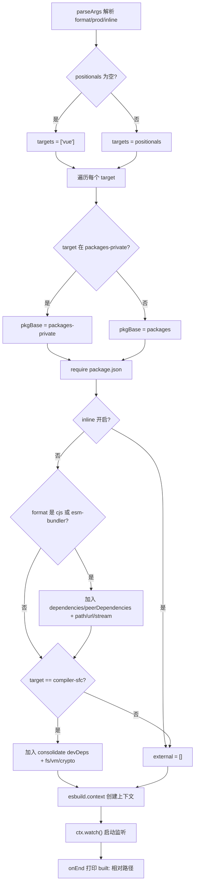
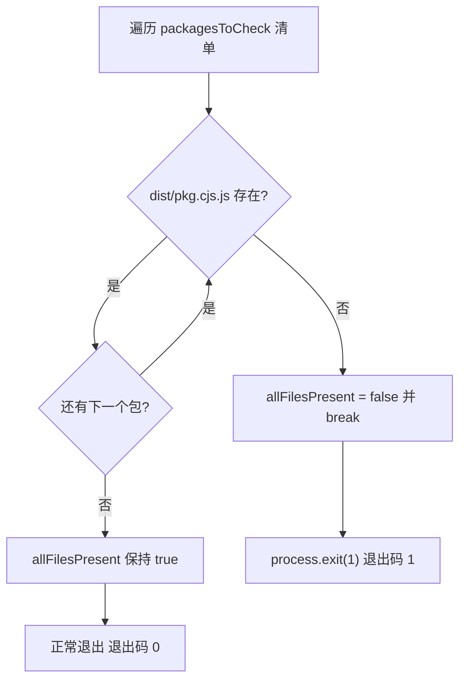
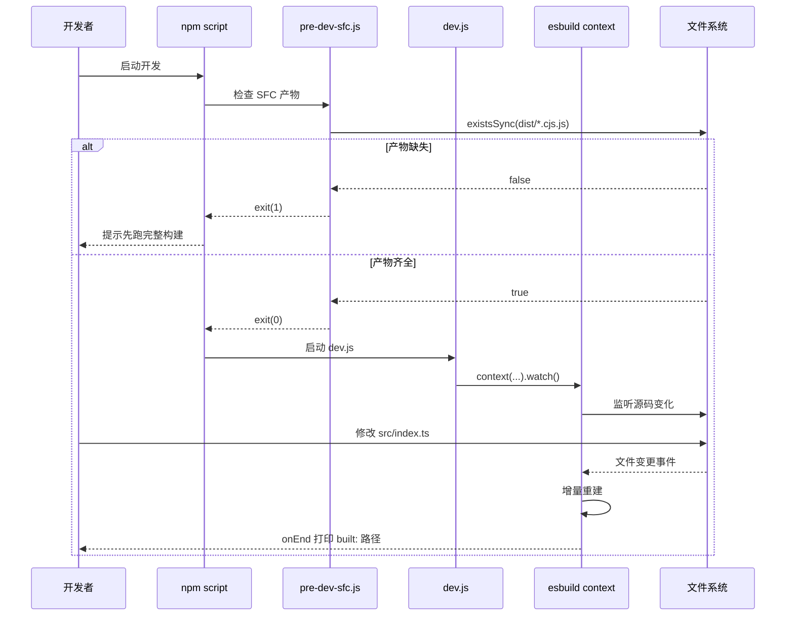

# 이 SFC 사전 컴파일과 협력하여 밀리초 수준의 개발 피드백 루프를 구현하는 방법을 살펴보겠습니다.

제 3 장: 개발 모드 링크: dev 스크립트와 SFC 사전 컴파일의 협력 메커니즘`scripts/dev.js`소속 프로젝트: vuejs/core`scripts/pre-dev-sfc.js`전체 진행률: 제 3 / 14 장

# 검증 상태: FACT 행 번호 실제 앵커링

## 이전 장에서 우리는 프로덕션 빌드가 인자 파싱부터 다중 형식 산출물 기록까지의 전체 링크를 추적했습니다. 그 링크가 추구하는 것은 산출물의 완전성과 규범성입니다. 반면 개발 모드의 핵심 요구는 단 하나입니다. 한 줄의 코드를 수정하면 브라우저에서 즉시 효과를 볼 수 있어야 합니다. 프로덕션 빌드의 "인자 파싱 → 설정 생성 → 전체 번들링 → 기록" 링크는 수십 초가 걸려 이 요구를 전혀 충족할 수 없습니다. Vue core 저장소는 이를 위해 독립적인 개발 모드 링크를 유지합니다:

은 esbuild의 watch 모드로 증분 빌드를 수행하고,[FACT:scripts/dev.js:3-5]

은 메인 빌드 전에 SFC 컴파일러를 미리 컴파일합니다. 이 장에서는 이 둘의 협력 메커니즘을 분석합니다.

## 3.1 dev.js: esbuild로 속도를 얻는 증분 빌더

직관적 모델`parseArgs`프로덕션 빌드는 "인쇄소의 정식 조판 및 인쇄"와 같습니다. 품질 우선이고 느려도 괜찮습니다. 개발 빌드는 "초안지 위의 연필 스케치"와 같습니다. 아름다움을 추구하지 않고, 그리자마자 나타나는 것만 추구합니다. Vue가 이 스케치를 그리기 위해 Rollup 대신 esbuild를 선택한 이유는 파일开头의 주석에 적혀 있습니다. Rollup 산출물이 더 작고 Tree-shaking이 더 좋지만, esbuild가 훨씬 빠릅니다.`format`만약 이 스크립트가 없다면, 개발자는 변경할 때마다 전체 프로덕션 빌드를 실행해야 하며, 피드백 루프가 밀리초 수준에서 분 수준으로 퇴화하여 핫 업데이트 경험이 완전히 사라집니다.`global`）、`prod`인자 파싱과 형식 추론`false`）、`inline`(기본`false`）。[FACT:scripts/dev.js:18-40]위치 인자는`targets`로 수집되며, 비어 있으면 기본값은`['vue']`。[FACT:scripts/dev.js:42-53]

> **[Design Inference & Architectural Trade-offs]**
> 여기 놓치기 쉬운 세부 사항이 있다:`rawFormat`과`format`는 두 번의 할당이다.`parseArgs`의`default: 'global'`는 이미`rawFormat`에 값이 있음을 보장하지만, 스크립트는 여전히`const format = rawFormat || 'global'`를 폴백으로 작성했다.[FACT:scripts/dev.js:42]이는 방어적 작성 방식으로,`parseArgs`의 동작 변경이나 명시적으로 빈 문자열이 전달될 때 다운스트림`format.startsWith`에서 오류가 발생하는 것을 방지한다.

`format`esbuild 출력 형식으로의 매핑은 세 갈래 분기이다:`global`로 시작하면`iife`로 매핑,`cjs`와 같으면`cjs`로 매핑, 나머지는 모두`esm`。[FACT:scripts/dev.js:42-53]산출물 파일명 접미사는`-runtime`접미사로 별도 처리된다:`global-runtime`는`runtime.global`로 변환되고, 나머지는 그대로 유지된다.[FACT:scripts/dev.js:42-53]

## 대상 패키지 위치 파악 및 출력 경로

스크립트는 먼저`packages-private`디렉터리 목록을 읽어 대상 패키지가 공개 패키지인지 비공개 패키지인지 판단한다.[FACT:scripts/dev.js:56]각 target에 대해 패키지 기본 경로를`packages`로 할지`packages-private`로 할지 결정한 뒤,`require`그`package.json`를 통해`version`와`buildOptions`。[FACT:scripts/dev.js:58-63]

출력 파일명에는 특례가 있다:`vue-compat`target은`vue`로 이름이 변경되어 산출물이`vue-compat.global.js`。[FACT:scripts/dev.js:64-69]로 불리는 것을 방지한다. 최종 경로는`packages/vue/dist/vue.global.js`，`prod`가 참일 때`prod.`세그먼트를 삽입한다.

## external 해석: 의존성을 산출물에 번들링하지 않기

`external`배열은 어떤 모듈을 번들링하지 않을지 결정한다. 로직은 두 계층으로 나뉜다:

첫 번째 계층,`inline`가 활성화되지 않았고 형식이`cjs`이거나`esm-bundler`를 포함할 때,`dependencies`、`peerDependencies`의 키를 모두 external에 추가하고,`path`、`url`、`stream`세 개의 Node 내장 모듈을 하드코딩한다.[FACT:scripts/dev.js:76-88]주석은 이 세 가지가`@vue/compiler-sfc`와`server-renderer`를 위해 준비되었음을 명확히 설명한다.

두 번째 계층,`compiler-sfc`target에 대해 추가로`@vue/consolidate`의`devDependencies`를 해석하여, 그것들과`fs`、`vm`、`crypto`등을 함께 external로 지정한다.[FACT:scripts/dev.js:90-112]코드에는`react-dom/server`、`teacup/lib/express`、`arc-templates/dist/es5`、`then-pug`、`then-jade`등 템플릿 엔진 경로도 하드코딩되어 있다 — 이들은 consolidate가 지원하는 템플릿 엔진으로, 선택적 의존성에 속하며 강제 설치할 수 없다.

> **[Design Inference & Architectural Trade-offs]**
> 이 로직은`rollup.config.js`와 상당히 중복되며, 소스 주석도 이를 인정한다(`TODO this logic is largely duplicated from rollup.config.js`). 공통 함수로 추출하지 않은 이유는 dev와 prod의 external 전략에 미세한 차이가 있기 때문이다(dev는 빌드 가속을 위해 더 공격적으로 external화한다). 억지로 통일하면 오히려 결합도가 높아진다.

## 플러그인 및 define 주입

플러그인 배열은 기본적으로`log-rebuild`하나만 있으며,`onEnd`훅에서 빌드 산출물의 상대 경로를 출력한다.[FACT:scripts/dev.js:115-124]이는 개발자가 "변경이 적용되었음"을 인지하는 유일한 피드백 신호이다.

> **[Design Inference & Architectural Trade-offs]**
> 두 번째 플러그인은 조건부이다: 형식이`cjs`가 아니고 패키지의`buildOptions.enableNonBrowserBranches`가 참일 때`polyfillNode()`。[FACT:scripts/dev.js:126-128]를 마운트한다.`compiler-sfc`과 같은 패키지(예:

`define`)는 브라우저 빌드에서도 여전히 Node 분기를 타므로, 브라우저 환경에서 실행되려면 Node 내장 모듈의 polyfill이 필요하다.[FACT:scripts/dev.js:141-159]블록은 이 장에서 정보 밀도가 가장 높은 부분이다.`__XXX__`소스의 모든

- `__COMMIT__`매크로를 리터럴로 치환한다:`"dev"`，`__VERSION__`는
- `__DEV__`로 고정, 패키지 버전을 가져온다;`prod`는`__TEST__`플래그로 결정되며,`false`；
- `__BROWSER__`는 항상`format !== 'cjs' && !pkg.buildOptions?.enableNonBrowserBranches`。[FACT:scripts/dev.js:146-148]의 도출이 가장 미묘하다:
- `__SSR__`즉, "cjs가 아니고 패키지가 비브라우저 분기를 지원하지 않을 때"만 브라우저 환경으로 표시된다;`format !== 'global'`는
- `__COMPAT__`즉, global 빌드는 SSR 분기를 활성화하지 않는다;`vue-compat`는 target이
- 인지 여부로 결정된다;`__FEATURE_SUSPENSE__`、`__FEATURE_OPTIONS_API__`、`__FEATURE_PROD_DEVTOOLS__`、`__FEATURE_PROD_HYDRATION_MISMATCH_DETAILS__`세 개의 feature flag(

)는 dev 모드에서 모두 하드코딩된다.`vitest.config.ts`이 매크로들은`define`의[FACT:vitest.config.ts:6-21]블록과 일대일로 대응한다.`__TEST__`테스트 환경에서는`true`、`__DEV__`를`true`로 설정하고

## 를

로 설정하는데, dev 빌드와의 차이가 바로 "테스트 vs 개발" 두 가지 실행 상태의 구분점이다.`esbuild.context(...).then(ctx => ctx.watch())`。[FACT:scripts/dev.js:130-161] `context`watch 모드 시작`watch()`마지막 단계는`onEnd`로 빌드 컨텍스트를 생성하되 즉시 실행하지 않고,

# 에서 로그를 출력한다.

## 복사

3.2 pre-dev-sfc.js: 순환 의존성을 해결하는 사전 컴파일 센티넬`compiler-sfc`직관적 모델`compiler-core`"닭이 먼저냐 달걀이 먼저냐" 딜레마를 상상해 보자:`compiler-core`의 소스에서`compiler-sfc`를 import하는데,`.vue`는 개발 상태에서`pre-dev-sfc.js`를 처리하기 위해

## 가 필요하다. 둘 다 esbuild watch로 실시간 컴파일한다면, 먼저 컴파일하는 쪽이 교착 상태에 빠진다.

의 역할은 "먼저 달걀을 부화시키고, 그다음 닭을 기른다" — 메인 빌드 시작 전에 이 패키지들의 CJS 산출물이 이미 존재하도록 보장하는 것이다.`compiler-sfc`、`compiler-core`、`compiler-dom`、`compiler-ssr`、`shared`。[FACT:scripts/pre-dev-sfc.js:4-10]체크리스트 및 단락 로직`packages/${pkg}/dist/${pkg}.cjs.js`스크립트는 고정 목록을 유지한다:[FACT:scripts/pre-dev-sfc.js:4-23]

각 패키지에 대해`allFilesPresent`가 존재하는지 확인한다.`false`하나라도 누락되면,`break`를[FACT:scripts/pre-dev-sfc.js:20-21]로 설정하고 즉시`allFilesPresent`하며, 나머지 패키지는 더 이상 확인하지 않는다.`process.exit(1)`마지막으로[FACT:scripts/pre-dev-sfc.js:25-27]

## 가 거짓이면,

는 0이 아닌 코드로 종료한다.`exit(1)`종료 코드의 의미`&&`이 스크립트 자체는 어떤 컴파일도 수행하지 않으며, "존재성 단언"만 한다.

# 체인이나 CI 스크립트)에게 보내는 신호이다: 산출물이 불완전하니 먼저 전체 빌드를 한 번 실행해야 한다. 모두 존재하면 정상 종료(종료 코드 0)하고 메인 빌드가 계속된다.

`scripts/dev.js`복사`scripts/aliases.js`3.3 aliases.js와 vitest.config.ts: 개발 상태 링크의 나머지 절반[FACT:scripts/aliases.js:7-7]

## 는 "산출물을 어떻게 빠르게 생성할까"를 해결하지만, 개발 시에는 또 다른 경로가 있다: 테스트 실행.

`resolveEntryForPkg`는 vitest와 rollup에 공유 경로 별칭을 제공한다.`packages/${p}/src/index.ts`。[FACT:scripts/aliases.js:7-7]별칭 생성 로직`vue`、`vue/compiler-sfc`、`vue/server-renderer`、`@vue/compat`。[FACT:scripts/aliases.js:16-21]

는 패키지 이름을`packages`기본 entries에는 네 가지 특수 매핑이 하드코딩되어 있다:`vue`이후`nonSrcPackages`（`sfc-playground`、`template-explorer`、`dts-test`디렉터리 아래 모든 하위 디렉터리를 순회하며,`@vue/${dir}`자체를 건너뛰고,[FACT:scripts/aliases.js:23-35]

> **[Design Inference & Architectural Trade-offs]**
> 이미 존재하는 key를 건너뛰고, 디렉터리여야만`nonSrcPackages`제외 목록은 이 세 패키지에`src/index.ts`진입점이 없어 강제 매핑 시 파싱 실패가 발생하기 때문입니다.

## vitest의 define과 별칭 소비

`vitest.config.ts`직접 import`entries`로서`resolve.alias`。[FACT:vitest.config.ts:3][FACT:vitest.config.ts:22-24]그`define`블록과 dev.js의 매크로 주입이 대조를 이룹니다: 테스트 환경`__DEV__: true`、`__TEST__: true`、`__BROWSER__: false`、`__CJS__: true`。[FACT:vitest.config.ts:6-21]

테스트는 다섯 개의 project로 분할됩니다:`unit`、`unit-gc`、`unit-jsdom`、`e2e`、`e2e-browser`。[FACT:vitest.config.ts:51-118]그중`unit-gc`을 사용하고`pool: 'forks'`을 전달하며`--expose-gc`를 통해 수동으로 GC를 트리거해야 하는 SSR 테스트를 전문적으로 실행합니다.[FACT:vitest.config.ts:65-76] `e2e-browser`는 playwright의 chromium 인스턴스를 활성화하여 Transition 관련 테스트를 실행합니다.[FACT:vitest.config.ts:99-117]

# 설계 사고

**왜 dev는 esbuild를 쓰고 prod는 Rollup을 쓰는가?**이는 기술 선택의 임의성이 아니라 두 시나리오의 제약이 다르기 때문입니다. 개발 상태는 산출물 크기에 민감하지 않고 피드백 지연에 극도로 민감합니다; 생산 상태는 반대입니다. esbuild는 Go로 작성되어 병렬화 수준이 높아 콜드 스타트와 증분 빌드가 한 자릿수 빠르지만, Tree-shaking과 코드 분할 능력은 Rollup보다 약합니다.[FACT:scripts/dev.js:3-5]두 도구를 각각 두 시나리오에 서비스하는 것은 공학적으로 실용적인 절충입니다.

> **[Design Inference & Architectural Trade-offs]**
> **pre-dev-sfc는 왜 검사만 하고 컴파일하지 않는가?**만약 그것이 스스로 컴파일을 트리거하면 순환 의존성을 다시 끌어들입니다—그것은`compiler-sfc`을 컴파일해야 하는데, 컴파일 과정 자체가`compiler-sfc`의 산출물에 의존할 수 있습니다. 그래서 그것은 '단언'만 할 수 있으며, '산출물 부재'라는 사실을 상위 계층에 노출시키고 상위 계층이 전체 빌드를 실행할지 오류로 종료할지 결정합니다. 이는 '센티넬 모드'입니다: 문제를 해결하지 않고 문제만 보고합니다.

**external 목록의 중복은 기술 부채인가?**dev.js와 rollup.config.js의 external 로직이 중복되며, 소스 주석도 이를 인정합니다.[FACT:scripts/dev.js:73]그러나两者的 external 집합은 완전히 일치하지 않습니다—dev는 속도를 위해 더 공격적으로 external화합니다. 강제로 공통 함수를 추출하려면 매개변수화된 차이 스위치를 도입해야 하여 오히려 두 곳의 로직이 모두 더 읽기 어려워집니다. 이는 '중복이 잘못된 추상화보다 낫다'의 전형적인 트레이드오프입니다.

# 이 장 요약

이 장은 Vue core 개발 상태 체인의 세 가지 퍼즐 조각을 분해했습니다:

1. **`scripts/dev.js`**: esbuild의`context().watch()`을 사용하여 증분 빌드를 구현하고,`parseArgs`을 통해 형식과 플래그 비트를解析하며, 동적으로`require`대상 패키지`package.json`출력 경로를 찾고,`__DEV__`、`__BROWSER__`등의 매크로를 주입하여 조건부 컴파일을 제어하며,`log-rebuild`플러그인으로 매번 재빌드 후 피드백을 출력합니다.

2. **`scripts/pre-dev-sfc.js`**: 메인 빌드 전에 다섯 개 핵심 패키지의 CJS 산출물 존재 여부를 검사하고, 누락 시 종료 코드 1로 단락하여 순환 의존성으로 인한 빌드 교착을 방지합니다.

3. **`scripts/aliases.js` + `vitest.config.ts`**: 테스트 체인에 공유 경로 별칭을 제공하고, 특수 항목을 하드코딩하고 일반 항목을 동적 스캔하며, 다중 project 구성으로 단위, GC, jsdom, e2e, 브라우저 e2e 다섯 가지 테스트 시나리오를 커버합니다.

# 이 장 사고와 자체 테스트

Q1: 만약`scripts/pre-dev-sfc.js`에서`break`을 제거하면(즉 모든 패키지를 검사한 후 종료 결정), 어떤 시나리오에서 개발자 경험이 나빠지나요? 왜 소스 작성자는 '첫 번째 누락 발견 시 단락'을 선택했나요?

**참고解析**：

[FACT:scripts/pre-dev-sfc.js:4-23]

`break`은`if (!fs.existsSync(...))`분기 내에 위치하며, 패키지 산출물 누락 발견 시 즉시 루프를 빠져나갑니다.

만약`break`을 제거하면, 스크립트는 나머지 패키지를 계속 검사하고 최종적으로`allFilesPresent`은 여전히`false`이며 종료 코드는 여전히 1,**기능적으로 동등**합니다. 그러나 차이는:

1. **성능**: 다섯 번의`existsSync`호출 자체는 빠르지만, 목록이 수십 개 패키지로 확장되면 단락은 많은 무의미한 stat 시스템 호출을 절약합니다.

2. **의미론**: 단락은 '하나라도 누락되면 전체가 불완전하다'를 표현합니다—이는 불리언 단언이며 구체적으로 몇 개가 누락되었는지 알 필요가 없습니다. 계속 검사해도 추가 정보가 생성되지 않습니다.

3. **개발자 경험**: 실제로 나빠지는 것은 '오류 메시지'입니다. 현재 스크립트는 어떤 패키지가 누락되었는지 출력하지 않아 개발자는 종료 코드 1만 봅니다. 만약`break`을 제거하고 로그를 추가하면 오히려 개발자에게 'compiler-core와 shared 누락'을 알려줄 수 있습니다—하지만 이는 추가 코드가 필요합니다. 작성자는 최소 구현을 선택하고 '어느 것이 누락되었는지' 진단을 상위 빌드 스크립트의 오류에 남깁니다.

그래서`break`의 핵심 동기는 '단언 의미론 + 성능'이며 경험 최적화가 아닙니다.

Q2: `scripts/dev.js`에서`__BROWSER__`의 추론은`format !== 'cjs' && !pkg.buildOptions?.enableNonBrowserBranches`입니다. 어떤 패키지의`buildOptions.enableNonBrowserBranches`이`true`이고 개발자가`-f global`으로 빌드하면, 이때`__BROWSER__`은`false`입니다. 이는 어떤 결과를 초래하나요? 만약 실수로`true`로 변경하면 어떻게 되나요?

**참고解析**：

[FACT:scripts/dev.js:146-148]

当`format = 'global'`이고`enableNonBrowserBranches = true`일 때:

- `format !== 'cjs'`은`true`
- `!pkg.buildOptions?.enableNonBrowserBranches`은`false`
- 전체`__BROWSER__ = false`

이는 소스의 모든`if (__BROWSER__)`분기가 esbuild의 define에 의해`if (false)`로 대체되고, 브라우저 전용 코드는 Tree-shaking으로 제거되며, 비브라우저 분기(Node 전용 로직)는 유지됨을 의미합니다.

**결과**: global 빌드 산출물은 원래 브라우저에서 실행되어야 하지만 Node 전용 분기를 포함합니다. 만약 이 분기들이`fs`、`path`등 Node 내장 모듈을 참조하면 브라우저 로드 시 '모듈 미정의' 오류가 발생합니다. 이것이`enableNonBrowserBranches`이 참인 패키지(예:`compiler-sfc`)가 일반적으로 global 빌드에 사용되지 않거나`polyfillNode()`플러그인 폴백이 필요한 이유입니다.[FACT:scripts/dev.js:126-128]

**만약 실수로`true`**：`__BROWSER__ = true`로 변경하면, 브라우저 분기가 유지되고 Node 분기가 제거됩니다.`compiler-sfc`과 같이 반드시 Node 환경에서 SFC 컴파일을 실행해야 하는 패키지의 경우, 핵심 기능(파일 읽기, Node API 호출)이 Tree-shaking으로 제거되어 산출물이 Node에서 실행 시 '함수 미정의' 오류가 발생합니다.

Q3: `scripts/aliases.js`에서 동적 스캔`packages`디렉토리 시`nonSrcPackages`（`sfc-playground`、`template-explorer`、`dts-test`을 건너뜁니다). 만약 어떤 새 패키지가`packages`디렉토리에 추가되었지만`src/index.ts`, 그리고 추가되지 않았을 때`nonSrcPackages`, 무슨 일이 발생할까? vitest 실행 시 어느 단계에서 오류가 발생할까?

**참고 해석**：

[FACT:scripts/aliases.js:23-35]

동적 스캔 로직은: 각 디렉터리에 대해, 만약`dir !== 'vue'`, 에 없고`nonSrcPackages`, key가 존재하지 않으며, 디렉터리라면, 추가한다`entries['@vue/${dir}'] = resolveEntryForPkg(dir)`。

`resolveEntryForPkg`가 반환하는 것은`packages/${p}/src/index.ts`의 경로이다.[FACT:scripts/aliases.js:7-7]주의할 점은**파일 존재 여부를 확인하지 않고**, 단순히 경로를拼接한다.

**결과**: 별칭은 등록되지만, 존재하지 않는 파일을 가리킨다. vitest가 import를 해석할 때, 어떤 테스트 파일이 이 패키지를 import하면, Vite의 resolve 플러그인이 해당 경로를 로드하려고 시도하며, 「모듈을 해석할 수 없음」 또는 「파일이 존재하지 않음」 오류를 발생시킨다.

**오류 발생 단계**:`aliases.js`실행 시(문자열拼接만 수행)가 아니라, vitest 시작 후 처음으로 해당 import를 해석할 때 발생한다. 만약 어떤 테스트도 이 패키지를 import하지 않으면, 오류는 발생하지 않는다——별칭은 그저`entries`객체 안에躺해 있을 뿐이다.

**회피 방법**: 이런`src/index.ts`가 없는 패키지를`nonSrcPackages`에 추가하거나, 새 패키지에 표준 진입점이 있는지 확인한다. 이것이`nonSrcPackages`를 수동으로 유지해야 하는 이유이다——그것은 「관례가 설정보다 우선」의 예외 목록이다.

세 가지 협업의 경계는 매우 명확하다:`pre-dev-sfc`는 「산출물이 준비되었는지」를 관리하고,`dev.js`는 「산출물을 어떻게 빠르게 갱신할지」를 관리하며,`aliases`는 「테스트가 소스를 어떻게 해석할지」를 관리한다. 개발 모드 링크는 속도 문제를 해결했지만, 빌드 시기에는 또 다른 더 은밀한 최적화가 있다——코드가 브라우저에서 실행되기 전에 완료되는 변환들이다. 다음 장에서는 컴파일 시기 마법으로 들어가, 열거형 인라인과 Tree-shaking 검증 메커니즘이 빌드 시기에 TypeScript enum을 리터럴로 대체하고, 필요 시 가져오기 약속이 깨지지 않도록 보장하는 방법을 살펴본다.
