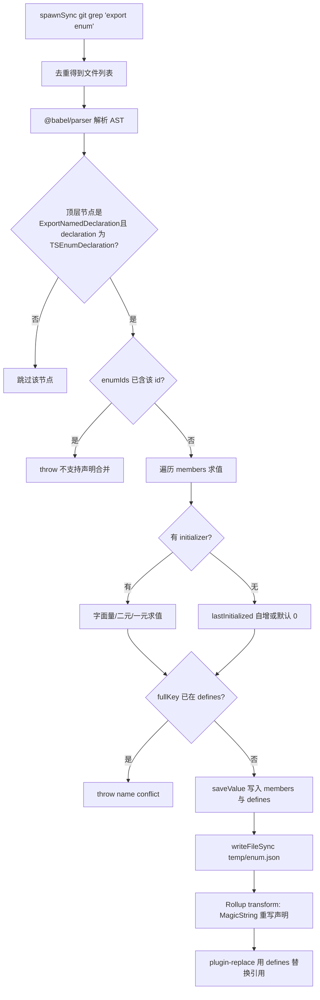
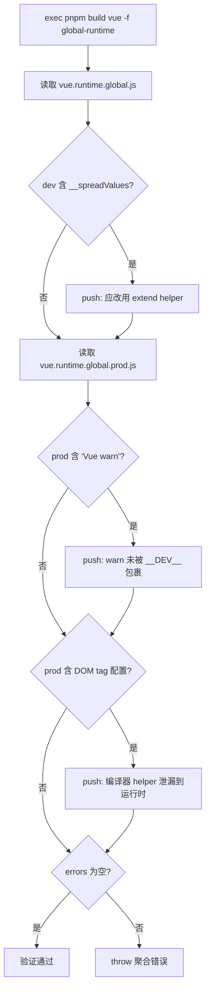

# 제 4 장: 컴파일 시기 마법: 열거형 인라인과 Tree-shaking 검증 메커니즘

이전 장에서 우리는 개발 모드 링크가 파일 감시와 증분 빌드로 「한 줄 수정 즉시 적용」의 속도를 얻는 방법을 보았다. 하지만 속도 외에도, Vue에는 더 은밀한 제약이 하나 있다: 배포 산출물의 크기가 제어 가능해야 한다는 것이다. 이 제약의 적 중 하나는 TypeScript의 enum이다——그것은 런타임에 실제로 존재하는 객체이며, Tree-shaking을破坏한다. 이 장에서는 컴파일 시기로 들어가, scripts/inline-enums.js가 코드가 브라우저에서 실행되기 전에 열거형을 리터럴로 「용해」하는 방법을 살펴본다; 그런 다음 scripts/verify-treeshaking.js가 빌드 후에 산출물 문자열로 「필요 시 가져오기」 약속이 조용히 깨지지 않았는지 역검증하는 방법을 살펴본다.

# 4.1 열거형 인라인: 런타임 객체를 리터럴로 용해

## 직관적 모델

요리책을 하나 썼는데, 그 안에 「약간의 소금」이 반복적으로 등장한다고 상상해보자. 매번 요리할 때마다 부록을 펼쳐 「약간 = 3그램」을 확인해야 한다면, 느릴 뿐만 아니라 자리도 차지한다. 열거형 인라인이 하는 일은, 인쇄 전에全书의 「약간의 소금」을 직접 「3그램 소금」으로 대체하고, 부록 페이지를 찢어버리는 것이다. 독자(런타임)에게 결과는 완전히 동일하지만, 책은 더 얇아진다.

만약 그것이 없다면, 시스템은 어떤 재앙에 직면할까? TypeScript의 일반`enum`은 컴파일 후 실제 객체 리터럴을 생성하며, 양방향 매핑(`Enum[Enum.A] === 'A'`)을 가진다. 이 객체는**부작용이 있는 모듈 수준 선언**이며, Rollup은 그것이 사용되지 않았음을 증명할 수 없어, 보존할 수밖에 없다——비록 당신이 그 중 한 멤버만 import했더라도, 전체 열거형 객체와 역방향 매핑이 산출물에 포함된다.[FACT:scripts/inline-enums.js:3-9]의 주석은 매우 직설적으로 말한다: 그들은 한때`const enum`를 사용했지만, issue #1228 때문에 일반 enum으로 변경했고, 그래서 이 스크립트로 「const enum의 제로 비용 이점을 수동으로 되찾았다」.

## 데이터 구조와 메모리 레이아웃

스크립트의 핵심은 세 가지 타입 정의이며, 그것들을 이해하면 전체 데이터 흐름을 이해한 것이다.[FACT:scripts/inline-enums.js:33-36]

- `EnumMember`：`{ name, value }`, 단일 열거형 멤버의 이름과 평가된 리터럴.
- `EnumDeclaration`：`{ id, range: [start, end], members }`。`range`은**소스 바이트 오프셋**으로,`export enum X { ... }`전체 선언의 파일 내 시작과 끝 위치를 가리킨다——이것이 이후 MagicString 정밀 대체의 앵커이다.
- `EnumData`：`{ declarations, defines }`。`declarations`은 파일 경로로 인덱싱되어, 해당 파일의 모든 열거형 선언 대체 범위를 기록한다;`defines`은 플랫 매핑으로, 키는 `` `${열거형 이름}.${멤버 이름}` `` 形式的字符串，值是 `JSON.stringify` 후의 리터럴이다.

여기에 핵심 설계가 하나 있다:`defines`의 키는**파일 경로를 포함하지 않는다**。[FACT:scripts/inline-enums.js:98-103]주석이 이유를 설명한다——`ErrorCodes`은 동시에`@vue/compiler-core`과`@vue/runtime-core`에 존재할 수 있으므로, 같은 이름의 열거형이 파일 간에 존재하는 것을 허용한다; 하지만 같은`ErrorCodes.__EXTEND_POINT__`은 두 개의 같은 이름 열거형에서 중복될 수 없다, 그렇지 않으면`fullKey in defines`에命中하여, 직접`name conflict`를 던진다. 이것은 「멤버 이름 기준 전역 고유」 제약이며, 「열거형 이름 기준 전역 고유」가 아니다.

캐시는`temp/enum.json`。[FACT:scripts/inline-enums.js:33-36]에 저장된다. 왜 디스크에 저장해야 할까? 왜냐하면`scanEnums()`은 빌드 진입점에서 한 번만 호출되지만, Rollup은 각 패키지, 각 형식마다**독립적인 프로세스**。[FACT:scripts/inline-enums.js:39-41]를 시작한다. 주석이 지적한다: 데이터는 동시 Rollup 프로세스 간에 공유되어야 하므로, 반드시 디스크에 직렬화되어, 각 프로세스의`inlineEnums()`가 다시 읽는다.

## Step-by-Step: grep에서 리터럴 대체까지

**첫 번째 단계:`export enum`를 포함하는 모든 파일을 grep한다.**[FACT:scripts/inline-enums.js:51-61]은`spawnSync('git', ['grep', 'export enum'])`를 사용하여, 출력 형태는`path:line:content`이며, 그런 다음`:`로 첫 번째 세그먼트(파일 경로)를 잘라내고,`Set`로 중복을 제거한다. 여기서 사용된 것은`git grep`파일 시스템을 순회하는 대신 — Git이 추적하는 파일만 자연스럽게 스캔하고, 자동으로 제외합니다`node_modules`와 빌드 산출물을.

**2단계: Babel이 파싱하고 열거형 정보를 수집합니다.**[FACT:scripts/inline-enums.js:64-70]각 파일에 대해`@babel/parser`를 사용하여`typescript`플러그인,`sourceType: 'module'`을 AST로 파싱한 다음, 오직`ast.program.body`의 최상위 노드만 순회합니다.[FACT:scripts/inline-enums.js:74-79]오직`ExportNamedDeclaration`이면서 그`declaration.type === 'TSEnumDeclaration'`인 노드만 인식합니다 — 즉,**내보내지 않은 enum은 처리되지 않습니다**。

각 열거형 선언에 대해, 스크립트는 멤버를 하나씩 평가합니다. 멤버 평가는 세 가지 경로로 나뉩니다:

1. **리터럴 초기화**：`StringLiteral`또는`NumericLiteral`직접`init.value`。[FACT:scripts/inline-enums.js:114-119]

2. **이항 표현식**: 예를 들어`1 << 2`. 재귀적으로`resolveValue`을 호출하여 좌우 피연산자를 처리하며, 피연산자는 리터럴일 수도 있고`MemberExpression`(즉, 앞서 정의된 열거형 멤버 참조)일 수도 있습니다.[FACT:scripts/inline-enums.js:121-151]핵심은`MemberExpression`분기에 있습니다: 이것은`content.slice(node.start, node.end)`를 사용하여**원본 소스 텍스트**에서 표현식 문자열(예:`ErrorCodes.FOO`)을 잘라낸 후,`defines`을 조회합니다. 찾지 못하면`unhandled enum initialization expression`。[FACT:scripts/inline-enums.js:132-141]을 던집니다. 이것이`defines`이 반드시 전역 평면 매핑이어야 하는 이유를 설명합니다 — 교차 열거형 참조 시, 참조 대상이 다른 파일에 있을 수 있지만 키는 오직`枚举名.成员名`。

3. **단항 표현식**: 예를 들어`-1`, 을`-1`문자열로 조합한 후`evaluate`로 평가합니다.[FACT:scripts/inline-enums.js:152-163]

평가 자체는`new Function('return ' + exp)()`。[FACT:scripts/inline-enums.js:39-41]를 사용합니다. 이것은**통제된 eval**입니다: 입력은 소스에서 이미 파싱된 AST 조각에서 오며, 임의의 사용자 입력이 아니므로 안전 경계가 통제 가능합니다.

**3단계: 초기화자가 없는 멤버 처리 (자동 증가 의미론).**[FACT:scripts/inline-enums.js:171-183]멤버에`initializer`이 없으면: 첫 번째 멤버는 기본적으로`0`; 이후 멤버의`lastInitialized`이 숫자면`++`; 문자열이면`wrong enum initialization sequence`을 던집니다 — 문자열 열거형 멤버는 암시적 자동 증가를 허용하지 않기 때문입니다. 이것이 바로 TypeScript 열거형의 의미론입니다.

**4단계: 캐시 쓰기 및 정리 함수 반환.**[FACT:scripts/inline-enums.js:200-213] `scanEnums()`클로저를 반환하며, 호출 시`rmSync`캐시 파일을 삭제합니다.`build.js`에서 이를 사용합니다.`try/finally`이는 빌드 중간에 오류가 발생하더라도 캐시가 정리되어 다음 빌드를 오염시키지 않도록 보장합니다.[FACT:scripts/build.js:81-112]5단계: Rollup transform 단계 교체.

**캐시를 다시 읽고, Rollup 플러그인을 구성합니다.** `inlineEnums()`에서[FACT:scripts/inline-enums.js:219-234]이`transform(code, id)`에 매칭되면, MagicString을 사용하여`id`이 선언 부분을 객체 리터럴로 교체합니다.`enumData.declarations`교체 후 형태는`[start, end]`입니다. 주목할 점은[FACT:scripts/inline-enums.js:242-274]

단순히 열거형을 삭제하는 것이 아니라`export const X = { ... }`객체 리터럴로 재작성하며, 숫자 멤버에 대해서는 추가로 역방향 매핑을 생성한다는 것입니다:**주석은 TypeScript 공식 문서의 reverse-mappings 규칙을 인용합니다: 문자열 열거형 멤버는 역방향 매핑을 생성하지 않고, 숫자 멤버는 생성합니다. 이는 교체 후 런타임 동작이 원래 enum과 완전히 일치하도록 보장합니다.**실제로 런타임 오버헤드를 제거하는 것은`JSON.stringify(value.toString()) + ': ' + JSON.stringify(name)`。[FACT:scripts/inline-enums.js:257-270]이

에 전달되어`defines`에 대한 모든`@rollup/plugin-replace`。[FACT:rollup.config.js:222-223]참조가`X.Member`교체 플러그인에서 직접 리터럴로 바뀌는 것이며, 따라서 재작성된 객체 리터럴이 아무도 사용하지 않으면 Tree-shaking으로 제거될 수 있습니다.**아래 흐름도는 grep부터 교체까지의 전체 의사결정 경로를 보여줍니다:**복사

설계 고찰과 함정

## 왜냐하면

**은 열거형 선언 부분만 교체하고 나머지 소스 바이트는 전혀 건드리지 않으며,**정확한 sourcemap도 생성할 수 있기 때문입니다.`s.update(start, end, ...)`Babel로 전체 AST를 다시 출력하면 원본 형식, 주석이 손실되고 sourcemap 품질이 저하됩니다.`s.generateMap()`왜[FACT:scripts/inline-enums.js:277-281]이고

**`range`이 아닌가?`node.start/node.end`이 단언하는 것은`declaration.start`？**[FACT:scripts/inline-enums.js:189-193](즉,`node.start`노드)이며, 교체 범위는`ExportNamedDeclaration`전체를 포함하여`export enum X {...}`키워드까지 포함합니다. 교체 텍스트는`export`로 시작하여 정확히 이어집니다.`export const`함정 포인트:

**의 전역 고유성 제약.`defines`서로 다른 두 파일에 각각**이 있고 둘 다`ErrorCodes`을 정의하면, 빌드가 바로 실패합니다.`__EXTEND_POINT__`이것은 버그가 아니라 의도된 설계입니다 — 왜냐하면[FACT:scripts/inline-enums.js:101-103]은 전역 교체 테이블이라 파일 출처를 구분할 수 없기 때문입니다. 프로덕션 환경에서 새 열거형 멤버를 추가할 때, 이름이 기존 열거형 멤버와 충돌하면 여기서 터집니다.`defines`함정 포인트:

**의 평가 시점.`new Function`이항 표현식 평가는**단계에서 발생하며, 이 시점에`scanEnums`에 아직 참조된 멤버가 없을 수 있습니다 (참조 순서가 뒤바뀐 경우).`defines`이[FACT:scripts/inline-enums.js:136-140]을 던집니다. 이는 열거형 멤버 참조가 반드시 「먼저 정의 후 참조」의 소스 순서를 따라야 함을 요구합니다.`unhandled enum initialization expression`4.2 Tree-shaking 검증: 산출물 문자열로 약속을 역증명

# 직관적 모델

## 열거형 인라인은 「사전 최적화」이지만, 최적화가 실제로 효과가 있는가? 만약 어떤 helper가 잘못된 작성 방식 때문에 우연히 유지되면, 크기가 조용히 팽창하는데 개발자는 전혀 눈치채지 못합니다.

이 바로 그 「사후 품질 검사관」입니다: 산출물을 빌드한 다음, 부검하듯이 산출물에`verify-treeshaking.js`있어서는 안 될 것이 있는지 확인합니다**. 이것이 없다면, Vue의 온디맨드 임포트 약속이 어느 리팩토링 후 조용히 깨질 수 있으며, 사용자가 패키지가 커졌다고 불평할 때까지 발견되지 않습니다.**데이터 구조와 검사 항목

## 이 스크립트에는 복잡한 데이터 구조가 없고, 핵심은

배열과 세 번의`errors`검사입니다.`includes`먼저[FACT:scripts/verify-treeshaking.js:6-6]형식을 빌드한 다음, dev와 prod 산출물을 각각 읽습니다.`global-runtime`세 가지 검사 항목은 세 가지 「Tree-shaking 실패」 유형에 대응합니다:

dev 산출물에

1. **포함 — 이것은 esbuild가`__spreadValues`**。[FACT:scripts/verify-treeshaking.js:13-19]객체 전개 구문을 위해 생성한 helper입니다. 이것이 나타나면 런타임 코드에서 객체 전개를 사용했으며, Vue 규약상`{ ...obj }`helper로 바꿔야 추가 코드를 피할 수 있음을 의미합니다.`extend`prod 산출물에

2. **포함 — 이는`Vue warn`**。[FACT:scripts/verify-treeshaking.js:26-31]호출이`warn()`조건으로 감싸지지 않아 경고 코드가 프로덕션 번들로 유출되었음을 의미합니다.`__DEV__`prod 산출물에 DOM tag 설정 목록

3. **포함 — 예:**。[FACT:scripts/verify-treeshaking.js:33-42]. 이것들은`html,body,base`、`svg,animate,animateMotion`、`annotation,annotation-xml,maction`。这些是 `isHTMLTag()`helper 내부의 데이터는 원래 컴파일러에만 존재하고 런타임에 의해 제거되어야 한다. 만약 런타임 산출물에 나타난다면, 런타임 경로가 컴파일러 전용 helper를 잘못 사용했음을 의미한다.

## Step-by-Step: 검증 프로세스

[FACT:scripts/verify-treeshaking.js:5-5]먼저`exec('pnpm', ['build', 'vue', '-f', 'global-runtime'])`를 실행하여`vue`패키지의`global-runtime`형식만 빌드한다——이것이 최소화된 런타임 산출물이며, 누출을 드러내기에 가장 적합하다. 빌드 완료 후 두 파일을 동기적으로 읽고, 하나씩`includes`를 검사하여 적중하면`errors`에 설명이 포함된 메시지를 push한다. 마지막으로`errors.length`가 0이 아니면 집계 오류를 throw한다.[FACT:scripts/verify-treeshaking.js:44-48]

## 설계 고찰과 함정

> **[Design Inference & Architectural Trade-offs]**
> **왜 문자열`includes`을 사용하고 AST 분석을 사용하지 않는가?**이것은 "센티넬 검사"이지 "정밀 분석"이 아니기 때문이다. 완전성을 추구하지 않고, 역사적으로 실제 발생했던 세 가지 유형의 회귀에 대해 저비용 경보를 설정한다. 문자열 매칭은 의존성 제로, 파싱 오버헤드 제로이며, 압축된 산출물에도 동일하게 효과적이다——AST 분석은 minify 후에 오히려 더 어렵다.

> **[Design Inference & Architectural Trade-offs]**
> **왜`global-runtime`？**만 검증하는가? 이 형식은 모든 의존성을 인라인(`external`이 비어 있음)하므로, 크기에 가장 민감하고 잘못 도입되기 가장 쉬운 산출물이다. 이것이 깨끗하면 다른 형식도 보통 깨끗하다. 동시에 빌드가 빨라 CI에 자주 넣기에 적합하다.

> **[Design Inference & Architectural Trade-offs]**
> **함정 포인트: 검사 항목이 "블랙리스트"이므로 코드 진화에 따라 무효화될 수 있다.**만약 언젠가`isHTMLTag`의 데이터 구조가 변경되어`html,body,base`라는 문자열이 더 이상 나타나지 않으면, 검사는 유명무실해진다. 이는 유지보수자가 관련 helper를 수정할 때 여기의 센티넬 문자열을 동기적으로 업데이트해야 함을 요구한다. 이것이 블랙리스트식 검증의 고유한 대가다.

# 4.3 Rollup과의 협업: 플러그인 순서와 define 주입

열거형 인라인은 독립적으로 실행되지 않고, Rollup의 플러그인 파이프라인에 내장되어 있다. 파이프라인에서의 위치를 이해해야`defines`을`replace`이 아닌`esbuild`。

[FACT:rollup.config.js:47-50]에게 맡기는 이유를 이해할 수 있다. 설정 모듈 최상위에서`inlineEnums()`을 호출하고,`[enumPlugin, enumDefines]`을 구조 분해한다. 이는**각 Rollup 프로세스 시작 시**실행되며,`scanEnums`이 작성한 캐시를 읽는다.

플러그인 배열의 순서는 다음과 같다:`json` → `alias` → `enumPlugin` → `...resolveReplace()` → `esbuild`。[FACT:rollup.config.js:324-339] `enumPlugin`이`replace`보다 앞에 위치하며, 이는 열거형 선언의 재작성이 먼저 발생하고, 그 다음`replace`이`defines`을 사용하여 참조를 교체함을 의미한다. 그리고`esbuild`이 마지막에 위치하여 TS 트랜스파일을 담당한다.

왜`defines`이`replace`을 거치지 않고`esbuild`의`define`？[FACT:rollup.config.js:220-221]을 거치지 않는가? 주석이 답을 준다: esbuild의 define은 "다소 엄격하여 리터럴 JSON 또는 식별자만 허용한다". 그리고 열거형 멤버 이름`ErrorCodes.__EXTEND_POINT__`은 점이 있는 멤버 표현식이므로, esbuild의 define은 이런 키를 직접 처리할 수 없다. 따라서 임의의 문자열 키 교체를 지원하는`@rollup/plugin-replace`을 사용해야 한다.[FACT:rollup.config.js:250-251]그리고`preventAssignment: true`을 설정하여 할당문 왼쪽도 교체되는 것을 방지한다.

`resolveReplace()`에서`const replacements = { ...enumDefines }`이 첫 번째 단계다.[FACT:rollup.config.js:222-223]이후에야 프로덕션 환경의`/*@__PURE__*/`주석,`__DEV__`등의 교체가 중첩된다. 이 순서가 열거형 리터럴 교체가 항상 유효하도록 보장한다.

# 설계 고찰

**열거형 인라인의 본질은 "빌드 시점 복잡성으로 런타임 크기를 교환"하는 것이다.**TypeScript의 타입 시스템 의미론(열거형 평가, 자동 증가, 역방향 매핑)을 빌드 시점에 완전히 재현한다——`scanEnums`의 평가 로직은 거의 TS 컴파일러 열거형 평가의 부분집합이다.[FACT:scripts/inline-enums.js:110-183]이는 유지보수 비용을 초래한다: TS가 새로운 열거형 문법(예: 더 복잡한 상수 표현식)을 추가하면 여기도 따라가야 하며, 그렇지 않으면`unhandled`오류를 throw한다. 그러나 이득은 명확하다: 런타임에 열거형 객체가 없어 Tree-shaking이 철저해진다.

> **[Design Inference & Architectural Trade-offs]**
> **검증 스크립트와 인라인 스크립트는 "약속과 이행"의 한 쌍이다.**인라인 스크립트는 "열거형이 런타임 크기를 차지하지 않는다"고 약속하고, 검증 스크립트는 "다른 코드도 몰래 크기를 차지하지 않았다"고 검사한다. 둘 다 함께 Vue의 크기 예산을 수호한다. 이러한 "최적화 + 검증"의 쌍 설계는 대형 프론트엔드 라이브러리 엔지니어링의 전형적인 패턴이다: 모든 최적화에는 회귀를 방지하기 위한 자동화 검사가 필요하다.

**크로스 프로세스 캐시는 동시 빌드의 필수품이다.** `scanEnums`단일 실행,`inlineEnums`다중 읽기 패턴은[FACT:scripts/inline-enums.js:39-41]"한 번 스캔, N개 프로세스 소비" 문제를 해결한다. 캐시가 없으면 각 Rollup 프로세스가 다시 grep + 파싱해야 하여 막대한 IO와 CPU를 낭비한다.

# 이 장 요약

# 이 장 고찰과 자가 테스트

Q1: 만약`scanEnums`의`saveValue`에 있는`if (fullKey in defines)`충돌 검사를 삭제하면, 어떤 시나리오에서 빌드 산출물에 오류가 발생하는가?

**참고 해석**：

`defines`은 전역 플랫 매핑이며, 키는`枚举名.成员名`이고 파일 경로를 포함하지 않는다.[FACT:scripts/inline-enums.js:98-103]충돌 검사를 삭제하면, 두 개의 서로 다른 파일에 각각 동명의 열거형이 있고 동명의 멤버(예:`@vue/compiler-core`과`@vue/runtime-core`모두`ErrorCodes.__EXTEND_POINT__`를 가짐)를 정의한 경우, 나중에 쓰는 쪽이 먼저 쓰는 쪽을 덮어쓴다.

결과:`defines['ErrorCodes.__EXTEND_POINT__']`값이 하나만 남고,`plugin-replace`은 교체 시 파일 출처를 구분할 수 없어**모든**파일의`ErrorCodes.__EXTEND_POINT__`을 동일한 값으로 교체한다.[FACT:rollup.config.js:222-223]따라서其中一个 패키지의 열거형 멤버 값이 조용히 변조되어, 런타임 동작이 잘못되고 극히 찾기 어렵다——소스 코드는 완전히 올바르게 보이기 때문이다.

이것이 바로 주석이 "동명 열거형의 파일 간 허용은 허용하지만, 동명 멤버는 허용하지 않는다"고 강조하는 이유다.[FACT:scripts/inline-enums.js:98-100]충돌 검사는 전역 교체 테이블이 오염되는 것을 방지하는 문지기다.

Q2: 만약`rollup.config.js`의 플러그인 배열에서`enumPlugin`과`...resolveReplace()`의 순서를 바꾸면 어떻게 되는가?

**참고 해석**：

현재 순서는`enumPlugin`이 앞,`replace`이 뒤다.[FACT:rollup.config.js:331-332]Rollup의`transform`훅은 플러그인 배열 순서대로 실행된다.

만약 바꾸면,`replace`이 먼저 실행되고, 이때 열거형 선언은 아직 원래의`export enum X { ... }`형태다.`replace``defines`을 사용하여`X.Member`참조를 교체한다——하지만 이때 참조가 아직 있으므로 교체는 유효하다. 문제는`enumPlugin`이 이후 실행될 때 발생한다:`s.update(start, end, ...)`을 사용하여 선언 부분을 재작성한다.[FACT:scripts/inline-enums.js:250-273]하지만`replace`이 이미`code`을 수정했고,`enumPlugin`이 얻는`code`은`replace`의 출력은, 그 바이트 오프셋이 이미`scanEnums`에 기록된`range`(원본 소스 기반)**과 더 이상 대응하지 않습니다**。

결과: MagicString이 잘못된 오프셋에서 잘라내어, 산출물의 구문이 엉망이 됩니다. 이는 플러그인 파이프라인의 암묵적 계약을 드러냅니다:**소스 오프셋 기반 변환은 반드시 가장 먼저 실행되어야 하며**, 이후 변환들이 그 출력 위에서 안전하게 계속될 수 있습니다.

Q3: `verify-treeshaking.js`은 세 개의 문자열 센티널만 검사합니다. 만약 어떤 리팩터링이`isHTMLTag`의 내부 데이터를`'html,body,base'`에서 배열 형태`['html','body','base']`로 바꾼다면, 검증 스크립트는 어떻게 될까요? 이것이 드러내는 설계 결함은 무엇일까요?

**참고 해석**：

검증 스크립트는`prodBuild.includes('html,body,base')`로 검사합니다.[FACT:scripts/verify-treeshaking.js:33-37]만약 데이터가 배열로 바뀌면, 압축 산출물에 더 이상 쉼표로 연결된 문자열이 나타나지 않아,`includes`이`false`을 반환하고, 검사는**조용히 통과합니다**——설령`isHTMLTag`이 실제로 런타임 산출물에 누출되었더라도 말입니다.

이는 블랙리스트식 문자열 검증의 고유한 결함을 드러냅니다:**센티널 문자열이 소스 구현과 결합되어 있어, 구현이 바뀌면 검증이 즉시 무효화됩니다**. 이는 '알려지지 않은 누출'을 감지할 수 없고, 오직 '알려져 있고 문자열 형태가 변하지 않은 누출'만 감지할 수 있습니다.

> **[Design Inference & Architectural Trade-offs]**
> 개선 방향: 더 안정적인 식별자(예: 함수 이름`isHTMLTag`)를 검사하도록 바꾸거나, 소스 레벨에서 lint 규칙으로 런타임의 컴파일러 helper import를 금지하고 산출물 문자열에 의존하지 않을 수 있습니다. 그러나 현재 비용 제약 아래에서는 문자열 센티널이 '충분하고 저렴한' 절충안입니다.

열거형 인라인은 '빌드 시점에 런타임 오버헤드를 어떻게 제거할 것인가'를 해결했고, 검증 스크립트는 '최적화가 깨지지 않았음을 어떻게 확인할 것인가'를 해결했습니다. 그러나 빌드 산출물에는 JS 외에도, 마찬가지로 파이프라인 가공이 필요한 산출물 유형이 하나 더 있습니다——타입 선언 파일입니다. 다음 장에서는 타입 산출물 파이프라인으로 들어가, Vue가 소스`.d.ts`에서 어떻게 배포급 타입 패키지를 생성하는지, 그리고`dts-test`이 어떻게 타입 계약 테스트로 공개 API의 타입 형태를 지키는지 살펴봅니다.

이 장에서는 컴파일 시점의 두 핵심 스크립트를 해부했습니다. inline-enums.js는 git grep으로 열거형을 찾고, Babel로 AST를 파싱하고, new Function으로 멤버를 평가하고, MagicString으로 선언을 정밀하게 재작성하며, 최종적으로 defines 전역 치환 테이블을 통해 열거형 참조를 리터럴로 바꿔 열거형 객체가 Tree-shaking으로 제거될 수 있게 합니다. verify-treeshaking.js는 빌드 후 문자열 센티널로 산출물을 검사하여 세 가지 알려진 Tree-shaking 누출이 회귀하지 않도록 보장합니다. 둘 중 하나는 '최적화'를, 다른 하나는 '최적화가 깨지지 않았음'을 검증하며, 함께 Vue의 크기 약속을 수호합니다. 다음으로, 우리는 컴파일 시점에서 타입 산출물 생성 경로로 전환하여, Vue가 소스 타입과 배포 타입의 엄격한 일치를 어떻게 보장하는지 살펴봅니다.
