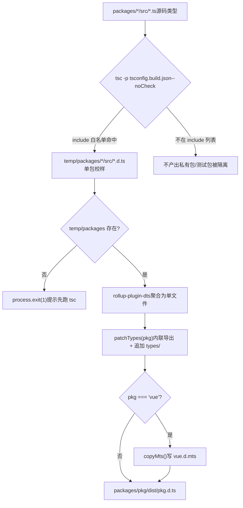
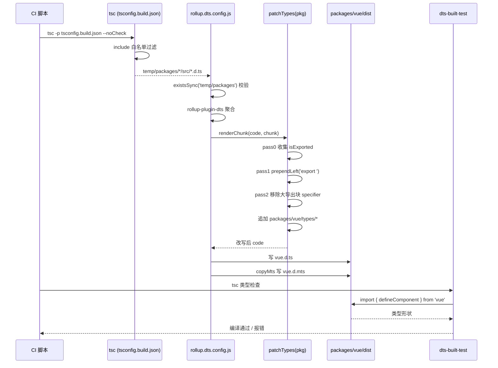

# 제 5 장: 타입 산출물 파이프라인: 소스 .d.ts에서 배포급 타입 패키지까지

이전 장에서 우리는`inline-enums.js`과`verify-treeshaking.js`을 해부했습니다: 하나는 enum 참조를 리터럴로 바꿔 열거형 객체가 제거될 수 있게 하는 역할을, 다른 하나는 빌드 후 문자열 센티널로 세 가지 알려진 누출이 회귀하지 않았음을 확인하는 역할을 합니다. 둘은 함께 Vue의 런타임 크기 약속을 수호했습니다. 그러나 빌드 산출물은 JS만이 아닙니다. 사용자가`import { ref } from 'vue'`할 때, 편집기에서 뜨는 타입 힌트,`tsc`의 사용자 코드에 대한 타입 검사는 모두 또 다른 산출물 유형——`.d.ts`선언 파일에 의존합니다. JS 산출물이 틀리면 런타임에 오류가 납니다; 타입 산출물이 틀리면 사용자 측 컴파일 시점에 오류가 나거나, 더 나쁘게는: 타입이 조용히 표류하여 사용자 코드는 컴파일을 통과하지만 타입 형태가 실제 런타임 동작과 맞지 않습니다. 이 장에서는 Vue가 각 하위 패키지`src`에 흩어진 소스 타입을 어떻게 배포급 타입 패키지로 집계하고,`dts-built-test`으로 실제 빌드 산출물에 타입 스모크 테스트를 수행하는지 추적합니다.

# 5.1 2단계 타입 파이프라인: tsc가 산출하고, rollup이 집계

## 직관적 모델

인쇄 파이프라인을 상상해 보세요: 첫 번째 단계에서 각 하위 패키지가 각자의 원고(`.ts`소스)를 단일 페이지 교정지(`.d.ts`)로 조판합니다; 두 번째 단계에서 수십 장의 교정지를 목차 순서대로 한 권의 책(배포급`.d.ts`)으로 제본하고, 머리말과 꼬리말(export 선언)을 통일합니다.

만약 이 파이프라인이 없다면, Vue는 배포 타입 파일을 수동으로 유지해야 하고, 소스가 바뀔 때마다 수동으로 동기화해야 합니다——이는 타입 표류의 온상입니다. Vue의 방식은:**타입 산출물은 전적으로 소스에서 생성되며, 절대 손으로 작성하지 않습니다**。

## 첫 번째 단계: tsconfig.build.json이 산출 범위를 정한다

`tsconfig.build.json`은 이 파이프라인의 첫 번째 단계 설정입니다. 루트`tsconfig.json`를 상속하고, 빌드 관련 옵션만 덮어씁니다.

[FACT:tsconfig.build.json:3-9]

핵심 옵션을 하나씩 해부합니다:

- `declaration: true`: tsc가 각 소스 파일에 대응하는`.d.ts`。
- `emitDeclarationOnly: true`：**을 생성하게 합니다**타입만 산출하고, JS는 산출하지 않습니다. JS는 Rollup이 담당하며, tsc는 여기서 순전히 타입 추출기입니다.
- `stripInternal: true`:`@internal`이 표시된 선언은 모두`.d.ts`에서 제거됩니다. 이것은 Vue가 공개 API 표면을 통제하는 첫 번째 관문입니다——내부 구현 세부사항이`export`되더라도,`@internal`이 붙어 있으면 배포 타입에 누출되지 않습니다.
- `composite: false`: 프로젝트 참조(project references)의 증분 빌드 모드를 끕니다. Vue는 여기서 패키지 간 증분이 필요 없으며, 끄면`.tsbuildinfo`이 가져오는 추가 상태를 피할 수 있습니다.

`include`목록은 어떤 디렉터리가 산출에 참여하는지 정확히 규정합니다:

[FACT:tsconfig.build.json:10-23]

여기서**은 12개 디렉터리만 나열했음에**주목하세요`packages/`。`packages-private/`、`packages/dts-test/`、`packages/sfc-playground/`등은 포함되지 않습니다. 이는 다음을 의미합니다: 프라이빗 패키지와 테스트 패키지의 타입은**결코**배포 산출물에 진입합니다. 이것은 물리적 격리입니다 — 관례가 아니라 설정에 의한 것입니다.

> **[Design Inference & Architectural Trade-offs]**
> 왜 블랙리스트가 아닌 화이트리스트를 사용하는가? monorepo에서 새 하위 패키지가 추가되는 것은 일상적이기 때문입니다. 만약`exclude`블랙리스트를 사용하면, 새 프라이빗 패키지를 추가할 때 exclude에 넣는 것을 잊으면 그 타입이 조용히 배포 산출물에 섞여 들어갑니다. 화이트리스트는 반대입니다: 새 패키지는 기본적으로 빌드에 참여하지 않으며 명시적으로 추가해야 하므로 「안전한 기본값」 원칙에 부합합니다.

실행`tsc -p tsconfig.build.json --noCheck`후, 산출물은`temp/packages/<pkg>/src/*.d.ts`에 떨어집니다. 주의`--noCheck`: 타입 검사를 건너뛰고 emit만 수행합니다. 타입 검사는 별도의`tsc --noEmit`가 담당하며, 빌드 단계에서는 중복 검사하지 않아 시간을 절약합니다.

## 2단계: rollup.dts.config.js 집계

2단계는`rollup.dts.config.js`가 구동합니다. 그 진입점은 먼저 사전 검증을 한 번 수행합니다:

[FACT:rollup.dts.config.js:15-22]

만약`temp/packages`가 존재하지 않으면, 1단계가 실행되지 않았다는 뜻이므로 스크립트는 바로`process.exit(1)`하고 먼저`tsc`를 실행하라고 안내합니다. 이것은 파이프라인의**순서 계약**입니다: rollup 단계는 tsc 단계의 산출물에 강하게 의존하며, 둘 중 하나라도 빠지면 안 됩니다.

이어서 모든 하위 패키지 디렉터리를 읽고,`TARGETS`환경 변수를 통한 부분 집합 빌드를 지원합니다:

[FACT:rollup.dts.config.js:15-22]

`TARGETS`메커니즘은 특정 몇 개 패키지의 타입만 재빌드할 수 있게 하여, 개발 디버깅 시 피드백 루프를 현저히 단축합니다.

핵심은`targetPackages.map(...)`가 각 패키지마다 Rollup 설정을 하나씩 생성한다는 것입니다:

[FACT:rollup.dts.config.js:23-42]

필드별 해석:

- `input: ./temp/packages/${pkg}/src/index.d.ts`: 진입점은 1단계에서 산출된 타입 파일이며, 소스 코드`.ts`。
- `output.file: packages/${pkg}/dist/${pkg}.d.ts`가 아닙니다: 산출물은 각 패키지 자신의`dist`디렉터리에 떨어지며, 파일명은 패키지명과 일치합니다 (예:`vue.d.ts`）。
- `format: 'es'`: 타입 파일은 통일적으로 ES module 형식을 사용합니다.
- `plugins: [dts(), patchTypes(pkg), ...(pkg === 'vue' ? [copyMts()] : [])]`: 세 개의 플러그인, 앞의 두 개는 모든 패키지에 적용되고,`copyMts`는`vue`패키지에만 적용됩니다.

`onwarn`훅은 따로 언급할 가치가 있습니다:

[FACT:rollup.dts.config.js:23-42]

dts rollup 과정에서 모든 비상대 경로 import는 기본적으로 외부화(externalized)됩니다. 이로 인해 Rollup이`UNRESOLVED_IMPORT`경고를 냅니다. 하지만 이것은**예상된 동작**입니다 — 타입 파일 안의`import { X } from 'some-pkg'`는 원래 외부 참조로 남아야 하며, 번들에 포함되어서는 안 됩니다. 그래서 스크립트는 「비상대 경로의 미해결 임포트」에 대해서는 바로`return`경고를 삼키고, 상대 경로의 미해결 임포트에 대해서만 기본`warn`。

> **[Design Inference & Architectural Trade-offs]**
> 여기에는 미묘한 점이 있습니다:`!warning.exporter?.startsWith('.')`는 exporter가`.`로 시작하는지를 판단합니다. 상대 경로 임포트가 미해결이면 1단계 산출물에 누락이 있다는 뜻이며, 이는 진짜 문제이므로 반드시 경고해야 합니다. 이 구분은 경고 노이즈를 최소로 줄이면서도 진짜 오류를 놓치지 않습니다.

## 파이프라인 전경

이 그림은 2단계 제어 흐름을 고정합니다:`tsc`의 화이트리스트가 누가 파이프라인에 들어갈 수 있는지를 결정하고,`rollup`의`check`가 계속할 수 있는지를 결정하며,`patchTypes`는 반드시 거쳐야 하는 단계이고,`copyMts`는`vue`패키지 전용 분기입니다.

# 5.2 patchTypes: 집계 산출물을 배포급 형태로 재작성

## 직관적 모델

`rollup-plugin-dts`가 수십 개의`.d.ts`를 하나의 파일로 병합한 후, 산출되는 형태는 「먼저 한 무더기의 타입을 선언하고, 마지막에 하나의 거대한`export { A, B, C, ... }`로 통일 export」하는 것입니다. 이는 사람이 읽기에 불친절하고, 일부 툴체인(예: VitePress의`defineComponent`호출)에서는 「추론된 타입을 참조 없이 명명할 수 없음」 오류를 유발하기도 합니다.

`patchTypes`는 바로 이**후처리 정형 공정**입니다: 「집중 export」를 「즉석 인라인 export」로 바꾸고, 이어서 패키지 전용 타입 증강을 덧붙입니다.

## 데이터 구조: 두 개의 Set과 세 번의 순회

`patchTypes`는 Rollup 플러그인을 반환하며, 핵심 로직은`renderChunk`훅 안에 있습니다. 그것은 두 개의 집합을 유지합니다:

[FACT:rollup.dts.config.js:87-88]

- `isExported`: 모든**원래부터 export되던**타입 이름을 기록합니다 (`export { ... }`선언에서 온 것).
- `shouldRemoveExport`: 모든**큰 export 블록에서 제거해야 할**타입 이름을 기록합니다 (이미 인라인 export되었기 때문).

처리 흐름은 세 번의 패스(pass 0 / pass 1 / pass 2)로 나뉘며, 이는 전형적인 「먼저 수집, 그다음 재작성, 마지막 정리」 패턴입니다.

## Step-by-Step Walkthrough

**Pass 0: 모든 이미 export된 타입 이름을 수집합니다.**

[FACT:rollup.dts.config.js:90-100]

AST 최상위 노드를 순회하며,`ExportNamedDeclaration`이면서**source를 가지지 않는**(즉`export ... from '...'`의 재export가 아닌) 경우, 그 specifier의 local name을`isExported`。

**에 추가합니다.`export`Pass 1: 선언 노드에 즉석에서**

[FACT:rollup.dts.config.js:102-125]

접두사를 추가합니다.`VariableDeclaration`、`TSTypeAliasDeclaration`、`TSInterfaceDeclaration`、`TSDeclareFunction`、`TSEnumDeclaration`、`ClassDeclaration`최상위 노드를 순회하며,`processDeclaration`。

`processDeclaration`여섯 종류의 선언에 대해

[FACT:rollup.dts.config.js:70-85]

의 로직을 호출합니다:

세 단계:`id`1.

가 없으면 바로 반환합니다 (예: 익명 선언).`_`2. 이름이**로 시작하면 건너뜁니다 — 이것은**관례

입니다: 밑줄 접두사 타입은 내부 보조 타입이며 export하지 않습니다.`shouldRemoveExport`3. 이름을`isExported`에 추가하고; 만약 그 이름이`prependLeft`에 있으면 (즉 원래부터 export되던 것), 선언 시작 위치에`export `문자열을

합니다.`VariableDeclaration`주의

[FACT:rollup.dts.config.js:104-115]

분기에는 추가 단언이 있습니다:`declare const`만약 하나의`declare const a, b`가 여러 declarator를 선언하면 (예:`processDeclaration`), 바로 오류를 던집니다. 왜냐하면`declarations[0]`는**만 처리하므로, 다중 declarator는 누락 처리를 유발하기 때문입니다. 여기서는**빠른 실패

**를 선택하고 조용한 오류를 택하지 않으며, 이는 방어적 프로그래밍의 구현입니다.**

[FACT:rollup.dts.config.js:127-171]

Pass 2: 큰 export 블록에서 이미 인라인된 타입을 제거합니다.`ExportNamedDeclaration`를 순회하며, 각 specifier에 대해:

- 만약 그 local name이`shouldRemoveExport`에 있고,`exported === local`(즉`export { Foo as Bar }`의 이름 변경 상황을 제외)라면, 해당 specifier를 제거합니다.
- 제거 시 MagicString으로 정밀 삭제합니다: 뒤에 specifier가 더 있으면 다음 specifier의 start까지 삭제하고; 마지막이면 이전 것의 end 또는 자신의 start까지 삭제합니다.
- 만약 전체 export 블록의 모든 specifier가 제거되면, 전체`ExportNamedDeclaration`노드를 삭제합니다.

**마무리: 패키지 전용 타입을 덧붙입니다.**

[FACT:rollup.dts.config.js:172-183]

`code = s.toString()`는 재작성된 코드를 받은 후,`packages/${pkg}/types`디렉터리가 존재하는지 확인합니다. 존재하면 디렉터리 아래 모든 파일 내용을 읽어, 줄바꿈으로 이어 붙인 뒤 코드 끝에 추가합니다.

> **[Design Inference & Architectural Trade-offs]**
> 이`types/`디렉터리는**수동으로 유지 관리하는 타입 강화**진입점으로, 소스 코드에서 자동 생성할 수 없는 타입(예: JSX 전역 강화, 매크로 타입 선언)을 넣는 곳입니다. 자동 생성된 타입과 같은 파일에서 병합되지만 출처는 명확히 분리됩니다—자동 생성은 위, 수동 강화는 아래.

## 왜 반드시 인라인 export여야 하는가?

주석에 직접적인 이유가 제시되어 있습니다:

[FACT:rollup.dts.config.js:45-51]

원문: 모든 타입을 인라인 export로 바꾸고 큰 export 블록에서 제거하라, 그렇지 않으면 VitePress의`defineComponent`호출에서 「the inferred type cannot be named without a reference」 오류가 발생한다.

> **[Design Inference & Architectural Trade-offs]**
> 이 오류의 본질은: TypeScript가 타입을 생성할 때, 어떤 타입이 「다른 모듈의 export를 참조」해야만 이름을 붙일 수 있고 그 참조가 소비 측에서 보이지 않으면 오류가 발생한다는 것입니다. 중앙 집중식 export 블록은 타입 이름과 선언 위치를 분리시켜 이 문제를 악화시킵니다. 인라인 export는 각 타입이 선언 지점에서 바로 보이게 하여 이 간접 계층을 제거합니다.

## copyMts: Node ESM/CJS 듀얼 모드를 위한 타입 제공

`copyMts`플러그인은`vue`패키지에만 적용됩니다:

[FACT:rollup.dts.config.js:196-204]

그것은`writeBundle`훅에서`vue.d.ts`의 내용을 그대로`vue.d.mts`。

에 씁니다.

[FACT:rollup.dts.config.js:188-192]

주석에 이유가 설명되어 있습니다:`package.json`TypeScript 4.7의**exports 규범에 따라, Node ESM과 CJS 모두에 올바른 타입을 제공하려면**반드시 두 개의 독립적인 선언 파일이 필요합니다`vue.d.ts`. 그래서 빌드 시`vue.d.mts`。

> **[Design Inference & Architectural Trade-offs]**
> 로 복사합니다.`package.json`〔설계 추론 및 아키텍처 트레이드오프〕`exports`왜 재생성이 아니라 복사인가? ESM과 CJS의 타입 형태가 완전히 동일하고 차이는 파일 확장자와

# 의

## 매핑뿐이기 때문입니다. 복사가 가장 저렴한 방안이며 rollup을 다시 돌리는 것을 피합니다.

5.3 dts-built-test: 실제 산출물에 대한 타입 스모크 테스트`patchTypes`직관적 모델`import`앞 두 절은 타입 산출물이 생성되고 형태가 올바름을 보장합니다. 하지만 「생성 가능」이 「올바르게 생성됨」과 같지는 않습니다. 만약

`dts-built-test`의 어떤 순회에 버그가 있어 어떤 export를 잘못 삭제하면 산출물은 여전히 생성되지만 사용자가**할 때 타입 누락을 발견하게 됩니다.**은`import`실제 빌드 산출물에서 실행하는 타입 스모크 테스트`vue`입니다: 소스 타입을 테스트하지 않고

## 이미 게시된

패키지를 소비하여 핵심 타입 형태에 회귀가 없는지 검증합니다.

[FACT:packages-private/dts-built-test/src/index.ts:3-6]

데이터 구조: 최소화된 타입 단언

- 전체 테스트 패키지의 핵심에는 단 하나의 파일만 있습니다:`vue`줄별 해석:`defineComponent`L1:**에서**를 import합니다. 여기서 import하는 것은`packages/vue/dist/vue.d.ts`패키지 이름
- 이며 상대 경로가 아닙니다—그것은`_CustomPropsNotErased`이 실제 산출물을 소비합니다.
- L3-6: 컴포넌트`// #8376`를 정의하며 빈 props와 빈 setup을 가집니다.
- L8: 주석`CustomPropsNotErased`, 구체적 issue를 가리킵니다.`_CustomPropsNotErased`L9-12:`{ foo: string }`를 export하며 타입은

와**`defineComponent`의 교차 타입입니다.`{ foo: string }`이 테스트가 검증하는 것은:`foo`의 반환 타입이**。

> **[Design Inference & Architectural Trade-offs]**
> 속성이 지워지지 않는지`defineComponent`〔설계 추론 및 아키텍처 트레이드오프〕

## issue #8376의 배경 추측:

[FACT:packages-private/dts-built-test/package.json:1-11]

의 반환 타입이 어떤 조건부 타입이나 매핑 타입 처리를 거쳐 교차 타입의 추가 속성이 「지워질」 수 있습니다. 이 테스트는 최소 재현으로 이 동작을 고정하며 회귀 시 타입 검사 단계에서 오류가 발생합니다.

- `private: true`패키지 구성: workspace 의존성이 실제 산출물을 가리킴
- `types: dist/index.d.ts`핵심 필드:
- `dependencies`: npm에 게시하지 않음.`workspace:*`: 타입 진입점이 빌드 산출물을 가리킴.`@vue/shared`、`@vue/reactivity`、`vue`。

> **[Design Inference & Architectural Trade-offs]**
> 의존성:`@vue/shared`〔설계 추론 및 아키텍처 트레이드오프〕`@vue/reactivity`왜`vue`와`types`에 의존하는가? 왜냐하면`dist`의 타입이 이 두 패키지의 타입을 참조할 수 있기 때문입니다. workspace 모드에서 pnpm은 이 의존성들을 로컬 패키지에 심볼릭 링크하고 로컬 패키지의**필드는 각자의**아래 산출물을 가리킵니다. 이렇게 전체 테스트 체인이 소비하는 것은

## 빌드 산출물

`dts-built-test`이며 소스 코드가 아닙니다.`src/index.ts`테스트 실행 방법`tsc`자체에는 테스트 스크립트가 없고 그것의`tsc`이 곧 테스트 케이스입니다. 실행 방식은: CI에서

> **[Design Inference & Architectural Trade-offs]**
> 가 오류를 내고 CI가 실패합니다.**〔설계 추론 및 아키텍처 트레이드오프〕**이 설계의 교묘함은 「타입 계약」을`tsc`컴파일 가능한 코드

## 로 인코딩한다는 점입니다. 추가 단언 라이브러리도, 런타임도 필요 없이

자체가 테스트 러너입니다. 타입이 맞으면 컴파일 통과, 틀리면 컴파일 실패.`dts-built-test`dts-test와의 분업`dts-test`이 장의

- `dts-built-test`과 다음 장의**는 다른 것입니다:**(이 장): 소비
- `dts-test`빌드 산출물**, 게시 수준 타입 형태 검증.**(다음 장): 소비

> **[Design Inference & Architectural Trade-offs]**
> , API 표면 계약 검증.`patchTypes`〔설계 추론 및 아키텍처 트레이드오프〕`stripInternal`왜 두 계층이 필요한가? 소스 타입과 산출물 타입이 일치하지 않을 수 있기 때문입니다.`types/`의 AST 재작성,`dts-built-test`의 제거,

## 디렉터리의 추가는 모두 소스 타입이 올바른 전제에서 산출물 수준 버그를 유발할 수 있습니다.

타입 파이프라인의 전체 시퀀스`patchTypes`복사`dts-built-test`이 시퀀스 다이어그램은 크로스 모듈 협업을 고정합니다: CI가 tsc와 Rollup 두 단계를 구동하고,

# 의 세 번 순회가 핵심 가공이며,

## 가 마지막에 산출물을 소비하여 검증합니다.

`patchTypes`설계 사고, 오류 복구 및 프로덕션 함정`code.replace(...)`왜 문자열 치환이 아니라 MagicString을 쓰는가?

1. **전 과정에서**가 아니라 MagicString으로 정밀 재작성을 합니다. 이유는 두 가지:`start`/`end`위치 정밀

2. **: AST 노드가 자체적으로**MagicString은 매핑을 생성하여 재작성된 타입 파일이 여전히 소스 코드로 추적될 수 있게 한다. 타입 파일의 sourcemap 용도는 제한적이지만, 일관성을 유지하는 것은 좋은 관행이다.

## 빠른 실패 vs 조용한 허용

`patchTypes`여러 곳에서 사용`assert`：

[FACT:rollup.dts.config.js:74-74]

[FACT:rollup.dts.config.js:107-108]

[FACT:rollup.dts.config.js:147-148]

이러한 단언은 예상치 못한 AST 형태를 만나면 즉시 오류를 발생시킨다. 대비`onwarn`에서`UNRESOLVED_IMPORT`을 조용히 삼키는 것——**예상된 노이즈는 삼키고, 예상치 못한 형태는 빠르게 실패**. 이것이 빌드 스크립트의 올바른 자세다: 빌드가 실패하더라도 형태가 잘못된 타입 파일을 생성하지 않는 것이 낫다.

## 프로덕션 함정:`_`접두사 규칙

`processDeclaration`건너뛰기`_`로 시작하는 타입:

[FACT:rollup.dts.config.js:76-78]

이는 소스 코드에서`_`로 시작하는 모든 내보낸 타입이 인라인 내보내기되지 않음을 의미한다. 어떤 타입이 공개되어야 하는데 이름이`_`로 시작하기 때문에 건너뛰어지면, 사용자 측에서 "타입이 존재하지 않음" 오류를 만나게 된다.

> **[Design Inference & Architectural Trade-offs]**
> 이런 문제를 조사하는 방법: 먼저 산출물`vue.d.ts`에서 해당 타입이 여전히 큰 내보내기 블록에 있는지 확인하고, 다음으로 소스 코드에서 해당 타입 이름이`_`로 시작하는지 확인한다. 이는 명명 규칙과 도구 동작의 암시적 결합으로, 함정에 빠지기 쉽다.

## 프로덕션 함정: 다중 declarator 단언

[FACT:rollup.dts.config.js:106-115]

만약 어떤`.d.ts`에`declare const a, b`이 나타나면, 빌드가 직접 오류를 발생시킨다. 이는 수동 작성 타입에서는 드물지만, 어떤 도구가 생성한 타입 파일이 이런 형태를 사용하면 트리거된다. 오류 메시지에 문제 코드 조각이 출력되어 위치 파악이 용이하다.

# 이 장 요약

이 장에서는 Vue 타입 산출물의 전체 파이프라인을 추적했다:

1. **첫 번째 단계 (tsc)**：`tsconfig.build.json`을 사용하여`include`화이트리스트로 산출 범위를 정확히划定하고,`emitDeclarationOnly`타입만 출력하며,`stripInternal`내부 선언을 제거한다. 산출물은`temp/packages/`。

2. **두 번째 단계 (rollup)**：`rollup.dts.config.js`을 사용하여`rollup-plugin-dts`각 패키지 타입을 집계하고,`patchTypes`세 번의 AST 순회를 통해 집중 내보내기를 인라인 내보내기로 재작성하며,`types/`디렉토리의 수동 강화를 추가한다.`copyMts`을 위해`vue`패키지에 추가로`.d.mts`。

3. **생성**검증 단계 (dts-built-test)

# : 실제 빌드 산출물에서 타입 스모크 테스트를 수행하고, 컴파일 가능한 코드로 핵심 타입 형태를 고정하여 타입 드리프트를 방지한다.

이 장 사고와 자가 테스트`tsconfig.build.json`Q1: 만약`include`의`["packages"]`화이트리스트를

**(즉, 전체 packages 디렉토리 포함)로 변경하면 어떻게 될까? 어떤 시나리오에서 배포 타입 오염이 발생할까?**：

`include`참고 해석`["packages"]`12개의 정확한 디렉토리에서`packages-private`로 변경하면, 모든 하위 패키지(`packages/*`외의 모든[FACT:tsconfig.build.json:10-23]

포함)가 tsc 산출에 참여한다.

1. `temp/packages/`결과 체인:`.d.ts`。

2. `rollup.dts.config.js`아래에 많은 패키지의`readdirSync('temp/packages')`의[FACT:rollup.dts.config.js:15-22]

3. `targetPackages`가 이렇게 많아진 패키지를 읽는다.`packages/<pkg>/dist/<pkg>.d.ts`。[FACT:rollup.dts.config.js:15-22]

기본값은 모든 패키지와 같으므로, 각 패키지에 대해`dist`생성`package.json`오염 시나리오: 만약 어떤 패키지가 배포되어서는 안 되는 경우(예: 내부 도구 패키지), 그 타입 산출물이`private: true`아래에 나타난다. 만약 해당 패키지의

에

Q2: `patchTypes`이 없으면, 배포 스크립트가 그것을 함께 npm에 배포하여 내부 타입이 유출될 수 있다.`processDeclaration`이것이 바로 화이트리스트 설계의 가치다: 새 패키지는 기본적으로 참여하지 않으며, 명시적으로 추가해야 한다. 이는 안전한 기본값에 부합한다.`_`의 pass 1에서,`return`은`_`로 시작하는 타입을 직접`_InternalType`. 만약 어떤 공개 API의 타입이 우연히

**로 시작하면(예:**：

`processDeclaration`이 실수로 내보내짐), 사용자 측에서 어떤 현상이 보일까? 어떻게 조사할까?`_`참고 해석`shouldRemoveExport`이`export `。[FACT:rollup.dts.config.js:76-78]

로 시작하면 직접 반환하며,

에 추가하지도 않고,`export`。

를 prepend하지도 않는다.`shouldRemoveExport`결과:

1. 해당 타입은 인라인**을 얻지 못한다.**2. 또한 큰 내보내기 블록에서 제거되지 않는다(

에 없기 때문).`export { _InternalType }`3. 따라서 그것은`stripInternal`여전히 큰 내보내기 블록에 있으며`tsc`, 이론적으로 여전히 가져올 수 있다.

하지만 문제는: 큰 내보내기 블록의

이 선언 위치를 참조한다는 것이다. 만약 그 선언이 어떤 이유(예:`vue.d.ts`)로 제거되면, 내보내기 블록은 존재하지 않는 이름을 참조하게 되어`export`오류가 발생한다.

조사 방법:`_`1. 산출물

에서 해당 타입이 선언 위치에

이 없으면서 큰 내보내기 블록에서 참조되는지 확인한다.`_`2. 소스 코드에서 해당 타입 이름이

Q3: `dts-built-test`로 시작하는지 확인한다.`src/index.ts`3. 명명 문제로 확인되면, 밑줄 접두사를 제거하도록 이름을 바꾸면 된다.`typeof _CustomPropsNotErased & { foo: string }`이는 명명 규칙과 도구 동작의 암시적 결합을 드러낸다:`foo`접두사는 원래 "내부"를 의미하지만, 도구는 이를 "내보내지 않음"으로 간주한다. 두 의미가 완전히 일치하지 않는다.`Omit<typeof _CustomPropsNotErased, never> & { foo: string }`의

**이 교차 타입**：

`Omit<T, never>`을 사용하여**이 지워지지 않음을 검증한다. 만약 교차 타입을**로 변경하면, 테스트가 여전히 #8376의 회귀를 잡을 수 있을까? 왜?

- 참고 해석`T & { foo: string }`은 새로운 매핑 타입을 생성하여`foo`재계산`defineComponent`T의 모든 속성을 재계산한다. 만약 #8376의 버그가 "교차 타입의 추가 속성이 지워짐"이라면:`foo`원래写法
- `Omit`: 직접 교차,`Omit`은 교차 타입의 일부이며, 만약`T`의 반환 타입 처리 로직이 교차의 추가 속성을 지우면,`{ foo: string }`이 손실된다.`Omit`写法:

[FACT:packages-private/dts-built-test/src/index.ts:9-12]

먼저**에 매핑을 수행한 후**과 교차.`Omit`、`Pick`의 매핑 과정이 타입 구조를 변경하여 버그의 트리거 조건이 더 이상 성립하지 않을 수 있다——버그가 존재하더라도 테스트가 통과할 수 있다.

> **[Design Inference & Architectural Trade-offs]**
> 최소성

이 매우 중요하다: 버그의 트리거 경로를 정확히 재현해야 한다. 어떤 추가 타입 변환(예:`dts-built-test`)도 버그를 가릴 수 있다. 이것이 테스트에서 더 "우아한"写法 대신 가장 소박한 교차 타입을 사용하는 이유다.`dts-test`, Vue가 타입 계약 테스트로 공개 API 표면을 어떻게 보호하는지 살펴보자.

세 가지가 「생성 → 정형 → 검증」의 폐쇄 루프를 구성하여 소스 타입과 배포 타입이 엄격히 일치하도록 보장한다. 그러나 타입 패키지 자체가 올바르다는 것이 공개 API의 타입 형태가 고정되었다는 것을 의미하지는 않는다. 다음 장에서는 깊이 들어가`packages-private/dts-test`, 20여 개의`.test-d.ts`파일이 어떻게`expectType`등의 도구를 사용하여 「타입이 곧 API 계약」을 회귀 가능한 자동화 테스트로 만드는지 살펴본다.
