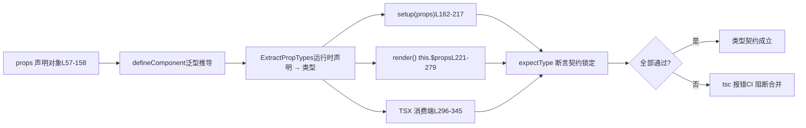

# 제 6 장: 타입 계약 테스트: dts-test가 API 표면을 어떻게 보호하는가

이전 장에서 우리는 타입 선언의 생성 경로를 추적하며, Vue가 빌드 설정과 스모크 테스트를 통해 「소스 타입」과 「배포 타입」이 엄격히 일치하도록 보장하는 방법을 살펴보았다. 그러나 타입 계약은 「형태가 맞는가」에 그치지 않고, 더 중요한 것은 「API 표면이 예상에 부합하는가」— 어떤 타입을 내보내야 하고, 어떤 것을 내보내지 말아야 하며, 제네릭 제약이 정확한가이다. 이번 장에서는`packages-private/dts-test`로 들어가, Vue가 20여 개의`.test-d.ts`파일로 「타입이 곧 API 계약」을 회귀 가능한 자동화 테스트로 구현하는 방법을 살펴본다.

# 타입 계약 테스트의 인지 모델: 「설명서」를 「실행 가능한 계약」으로 바꾸기

`dts-test`디렉터리 안의 파일에는 직관에 반하는 특징이 하나 있다: 그것들은**거의 어떤 런타임 동작도 생성하지 않는다**.`defineComponent.test-d.tsx`를 열면 대량의`defineComponent({...})`호출을 볼 수 있지만, 테스트 실행 시 실제로 실행되지 않는다 — 이 파일들은 오직`tsc`/`vue-tsc`에 의해 타입 검사만 되고,`noEmit: true`는 어떤 JS도 산출하지 않도록 보장한다.

[FACT:packages-private/dts-test/tsconfig.test.json:1-11]

이 설정은 전체 계약 체계의 「실행 환경」이다:`noEmit`는 산출물 출력을 끄고,`jsx: preserve`는 TSX 문법을 타입 시스템 파싱용으로 남겨두며,`strict`는 모든 엄격 검사를 켜고,`moduleResolution: bundler`는 현대 번들링 시맨틱과 일치시키며,`lib`와`esnext`를 동시에 도입한다.`dom`。**만약 이 설정이 없다면,`.test-d.tsx`안의 JSX는 런타임 JSX로 처리되어 타입 단언이 의미를 잃게 된다**。

> **[Design Inference & Architectural Trade-offs]**
> 타입 테스트를`packages-private`하위 패키지로 독립시키고`packages/vue`의`__tests__`에 밀어 넣지 않은 동기는 세 가지다: 첫째, 타입 테스트의 의존성은`vue`의**배포 수준 타입**（`vue/jsx`、`vue`의`.d.ts`)이며, 소스 내부 모듈이 아니므로 물리적 격리가 공개 진입점을 강제로 통과하게 한다; 둘째,`tsc`는 타입 테스트 검사 소요 시간이 런타임 단위 테스트보다 훨씬 높아 독립 디렉터리가 CI에서 별도 스케줄링하기 편하다; 셋째,`.test-d.tsx`파일은 Vitest의 런타임 수집기에 의해 잘못 실행되지 않는다.

생활 비유: 일반 단위 테스트는 「기계에 전원을 넣고 돌려서 연기가 나는지 보는 것」이고, 타입 계약 테스트는 「계약서에 서명하기 전에 조항을 하나하나 대조하는 것」— 실제 거래는 하지 않고, 「갑이 지불할 금액」이 「위안」으로 적혀 있는지 「달러」로 적혀 있지 않은지만 확인한다. 계약 조항이 틀리면 기계가 아무리 잘 돌아가도 소용없다.

`utils.d.ts`는 이 「계약 대조」의 모든 도구를 제공한다:

[FACT:packages-private/dts-test/utils.d.ts:7-21]

핵심 도구는 단 네 개다:`expectType<T>(value: T)`는`value`의 타입이 정확히`T`；`expectAssignable<T, T2 extends T>`임을 단언한다;`T2`는`T`；`IsUnion<T>`이`T`에 할당 가능함을 단언한다;`IsAny<T>`는`T`이 유니온 타입인지 판단한다;`any`는`import 'vue/jsx'`이`<MyComponent />`인지 판단한다. L5의`JSX.Element`。

[FACT:packages-private/dts-test/utils.d.ts:7-21]

`IsUnion`에 주목하라 — 전역 JSX 네임스페이스를 등록하여 TSX 안의`T extends any ? (U extends T ? false : true) : never`가 타입 시스템에 의해`T`로 인식되게 한다.`extends false`의 구현은 자세히 볼 가치가 있다:`false`분산 조건부 타입을 활용하여, 만약**이 유니온 타입이면 각 멤버가 독립적으로 평가되고, 최종적으로**는 모든 분기가`props.jjj`를 반환하는지 판단한다. 이것은

# 타입 수준의 존재 증명`defineComponent`이다 — 「

`defineComponent.test-d.tsx`이 단일 시그니처로 병합되지 않고 반드시 유니온 타입이어야 한다」와 같은 계약을 고정하는 데 사용된다.**시나리오 기반 Walkthrough:`defineComponent({ props: {...}, setup(props) {...} })`의 props 타입 추론 전체 경로`props`는 2260줄로, 계약 체계의 핵심이다. 구체적인 시나리오를 대입해 보자:`setup`사용자가`props`를 작성하면, Vue의 타입 시스템은**런타임 선언에서

## 안의

파라미터의 정확한 타입을 추론해야 한다`ExpectedProps`. 이 경로는 Vue 타입 시스템에서 가장 복잡한 부분이다.**첫 번째 단계: 「기대 타입」을 계약 기준으로 구성**：

[FACT:packages-private/dts-test/defineComponent.test-d.tsx:21-53]

테스트 파일은 먼저`a?: number | undefined`인터페이스를 정의하여, 각 props 선언 방식이 추론해야 할 타입을`undefined`）、`aa: number`명시적으로 하드코딩한다`aaa: number | null`（`PropType<number | null>`이 인터페이스는 「계약 조항」의 서면 버전이다. 몇 가지 미묘한 타입에 주목하라:`aaaa: number | undefined`（`required: true as const`(선택적 props에`undefined`(default가 있으므로 비선택적),`props`는 명시적 선언),

## 이지만 타입에`defineComponent`

[FACT:packages-private/dts-test/defineComponent.test-d.tsx:57-158]

포함). 이러한 차이는 임의로 작성된 것이 아니라, 각각이`props`선언 안의 특정 분기에 대응한다.**두 번째 단계: 다양한 선언 방식으로**에 「먹이기」

- `a: Number`이`number | undefined`
- `aa: { type: Number as PropType<number | undefined>, default: 1 }`객체는`number`
- `aaaa: { type: Number, required: true as const }` —— `as const`선언 방식의 전수 열거 행렬`true`이며, Vue props의 모든 작성법을 커버한다:`boolean`— 생성자 축약,
- `b: { type: String, required: true as true }` —— `required: true`로 추론
- `bb: { default: 'hello' }`— default가 있으므로 비선택적`type`로 추론
- `cc: Array as PropType<string[]>`는
- `l: [Date]`이`Date | undefined`
- `ll: [Date, Number]`로 확장되는 것을 방지하고 리터럴 타입을 보존`Date | number | undefined`
- `lll: [String, Number]`는 속성을 non-void로 만든다

> **[Design Inference & Architectural Trade-offs]**
> `required: true as const`없이 default만으로 타입 추론`required: true as true`— 명시적 타입 변환`as true`— 배열 문법,`as const`로 추론**— 다중 타입 배열,**。

## 로 추론`setup` / `render` / `this`— 상동

〔설계 추론과 아키텍처 트레이드오프〕**(L70)과**。

[FACT:packages-private/dts-test/defineComponent.test-d.tsx:160-217]

`setup(props)`(L75) 두 작성법이 공존하는 것은 역사적 진화의 흔적이다: 초기에는`expectType<ExpectedProps['x']>(props.x)`를 사용했으나, 나중에

[FACT:packages-private/dts-test/defineComponent.test-d.tsx:168-170]

`// @ts-expect-error should included 'undefined'`와 함께`expectType<number>(props.aaaa)`——**의도적으로 오류를 발생시키는 단언을 작성하고,`@ts-expect-error`로 오류를 삼킨다**. 이는`props.aaaa`의 타입이**가 아님을 검증한다** `number`(그렇지 않으면 이 줄은 오류를 내지 않고,`@ts-expect-error`오히려 '삼킬 오류가 없음'으로 인해 실패한다). 이것이 타입 테스트의 '역방향 단언' 기법이다.

[FACT:packages-private/dts-test/defineComponent.test-d.tsx:204-205]

`// @ts-expect-error props should be readonly`와 함께`props.a = 1`——props가`setup`에서 읽기 전용임을 검증한다. 만약 어떤 리팩터링이 실수로 props를 변경 가능하게 만들면, 이 줄은 더 이상 오류를 내지 않고,`@ts-expect-error`가 실패한다.

`render()`에서는`this.$props`와`this.x`두 경로를 통해 단언한다:

[FACT:packages-private/dts-test/defineComponent.test-d.tsx:221-279]

L252-276은 '선언된 props도`this`에 노출되어야 한다'를 검증하고, L278-279는`this.a = 1`가 오류를 냄을 검증한다(`this`의 props도 읽기 전용). L281-287은 setup 반환값의 언래핑을 검증한다:`this.c`은`number`（`ref(1)`이 언래핑됨),`this.d.e.value`은`string`(중첩 ref는 유지됨`.value`）、`this.f.g`은`GT`（`reactive`의 branded 타입이 언래핑되지 않음).

## 네 번째 단계: TSX 소비 측의 타입 검증

타입 계약의 마지막 고리는 '사용자가 이 컴포넌트를 어떻게 사용하는가'이다. TSX에서`<MyComponent />`의 props 검증은 독립적인 타입 경로이다:

[FACT:packages-private/dts-test/defineComponent.test-d.tsx:296-322]

여기서는`<MyComponent>`가 선언된 모든 props를 받아들이는지, 그리고`class`/`style`/`key`/`ref`/`ref_for`같은 내장 속성들을 검증한다. 그 다음은**역방향 검증**：

[FACT:packages-private/dts-test/defineComponent.test-d.tsx:337-345]

`// @ts-expect-error missing required props`은 필수 props 누락 시 오류 발생을 검증하고;`wrong prop types`는 타입 불일치 시 오류 발생을 검증하며; L342는`ggg="baz"`가 오류를 냄을 검증한다(`ggg`는`'foo' | 'bar'`）。

만 받음). 전체 체인은 하나의 데이터 흐름도로 요약할 수 있다:



이 그림의 핵심은:**동일한`props`선언이 세 소비 위치의 타입 기대를 동시에 충족해야 한다**. 어느 한 곳에서든 추론 편차가 생기면`tsc`가 오류를 낸다.

# 경계와 백도어:`__typeProps`、`__typeEmits`와 조건부 타입 계약

`defineComponent`의 타입 추론에는 근본적인 한계가 있다:**런타임 props 선언은 '조건부 타입'을 표현할 수 없다**. 예를 들어 '만약`color='white'`일 때`appearance`는 반드시`'outline'`여야 한다' 같은 제약은 런타임 객체 문법으로 작성할 수 없다. Vue는 이를 위해`__typeProps`같은 '타입 백도어'를 제공한다.

## `__typeProps`: 조건부 props의 타입 탈출구

[FACT:packages-private/dts-test/defineComponent.test-d.tsx:1803-1836]

`ConditionalProps`는 유니온 타입이다:要么`color`와`appearance`가 모두 선택적이거나, 또는`color: 'white'`이고`appearance: 'outline'`이다. 테스트 검증:

- L1823-1824：`<Comp color="white" />`오류 발생——`color: 'white'`만 단독으로 주면 어느 분기도 충족하지 않음
- L1825-1826：`<Comp color="white" appearance="normal" />`오류 발생——`appearance`는 반드시`'outline'`
- L1827：`<Comp color="white" appearance="outline" />`여야 함

> **[Design Inference & Architectural Trade-offs]**
> `__typeProps`〔설계 추론과 아키텍처 트레이드오프〕

## `__typeEmits`의 설계 동기는 '런타임에 표현할 수 없는 제약을 타입 시스템이 표현하게 하는 것'이다. 이는 런타임 props 파싱에 참여하지 않으며, 순수 타입 레벨의 오버라이드이다. 대가는 사용자가 타입과 런타임 선언의 일관성을 수동으로 유지해야 한다는 점이다——이것이 바로 이것이 공식 API가 아니라 'backdoor'라고 불리는 이유이다.

`__typeEmits`: 두 가지 emits 문법의 동등성**는 두 가지 문법을 지원하며, 테스트**：

[FACT:packages-private/dts-test/defineComponent.test-d.tsx:1838-1885]

는 둘 다 동시에 고정한다`{ change: [id: number], update: [value: string] }`객체 문법`this.$props.onChange?.(123)`은 명명된 튜플로 매개변수를 표현한다. 테스트 검증`onChange?.('123')`통과,

[FACT:packages-private/dts-test/defineComponent.test-d.tsx:1887-1934]

오류 발생.`{ (e: 'change', id: number): void; (e: 'update', value: string): void }`호출 시그니처 문법**은 오버로드로 표현한다.**두 문법의 테스트 본문은 거의 줄 단위로 동일하다**——이것은 의도적이다: 계약은 두 작성 방식이**완전히 동등한

> **[Design Inference & Architectural Trade-offs]**
> 〔설계 추론과 아키텍처 트레이드오프〕`defineEmits`왜 두 문법을 유지하는가? 객체 문법은

## `__typeRefs`의 작성 방식에 더 가깝고, 호출 시그니처 문법은 전통적인 TS 이벤트 타입에 더 가깝다. Vue는 둘 다 지원하면서 동작 일관성을 보장해야 한다. 테스트의 '줄 단위 미러' 구조가 가장 강력한 동등성 증명이다.`__typeEl`와

[FACT:packages-private/dts-test/defineComponent.test-d.tsx:1936-1952]

`__typeRefs`: 컴포넌트 간 참조와 호스트 노드 타입`Parent`는 부모 컴포넌트가 자식 컴포넌트 ref의 타입을 정확히 알 수 있게 한다.`__typeRefs: { child: ComponentInstance<typeof Child> }`는`refs.child.$refs.foo`를 선언하며, 따라서`number`。

[FACT:packages-private/dts-test/defineComponent.test-d.tsx:1963-1977]

`__typeEl`는**로 추론될 수 있다. 더 미묘하다. L1963-1977의 테스트 주석은 설계 의도를 명확히 밝힌다:`Element`**커스텀 렌더러(TUI, canvas, native)의 호스트 노드는 DOM`TypeEl`가 아니므로,`Element`는`CustomElement`로 제약될 수 없다. 테스트는`$el`인터페이스로

> **[Design Inference & Architectural Trade-offs]**
> 〔설계 추론과 아키텍처 트레이드오프〕`TypeEl`이것은 Vue 3가 커스텀 렌더러를 지원하는 타입 레벨 보장이다. 만약`Element`，`@vue/runtime-test`가`$el`로 하드 제약된다면, 이러한 비 DOM 렌더러 사용자들은

## 타입을 올바르게 추론할 수 없다. 계약 테스트가 여기서 수호하는 것은 '렌더러 무관성'이다.

`function syntax w/ runtime props`제네릭 컴포넌트와 런타임 props의 상호 배타 제약**섹션은 중요한 규칙 하나를 고정한다:**。

[FACT:packages-private/dts-test/defineComponent.test-d.tsx:1501-1545]

제네릭 컴포넌트는 객체 런타임 props와 공존할 수 없다`generics aren't supported with object runtime props`L1501의 주석`<Comp3<string>>`은 계약 선언이다. L1525-1535는 제네릭 setup + 객체 props 오류 발생을 검증하고; L1538-1539는

> **[Design Inference & Architectural Trade-offs]**
> 〔설계 추론과 아키텍처 트레이드오프〕`ExtractPropTypes`이 제약의 근본 원인은 타입 추론 순서이다: 객체 props는

# 가 먼저 타입을 확정해야 하는데, 제네릭은 인스턴스화 시점에만 확정할 수 있어 둘이 충돌한다. 배열 props는 타입 추출에 참여하지 않으므로 충돌하지 않는다. 계약 테스트는 이 '타입 시스템 제한'을 회귀 가능한 단언으로 고정한다.

## `@ts-expect-error`설계 사고, 오류 복구, 프로덕션 함정

`@ts-expect-error`의 양날의 검**는 타입 계약 테스트의 핵심 도구이지만, 치명적인 함정이 있다:`@ts-expect-error`그 아래의 코드가 더 이상 오류를 내지 않으면,**자체가 오류를 낸다

[FACT:packages-private/dts-test/defineComponent.test-d.tsx:1354-1362]

. 이는 보호처럼 보이지만, 실제로는 테스트 작성자가 '오류가 발생하는 위치'를 정밀하게 제어할 것을 요구한다.`// @ts-expect-error missing prop`이 코드를 보라:`<Comp msg={123} />`는**의**바로 위 줄에`expectType<JSX.Element>(...)`놓였지만, 전체 표현식은`@ts-expect-error`로 감싸여 있다. 만약`expectType`의 위치가 한 줄 어긋나거나, 오류가 실제로

> **[Design Inference & Architectural Trade-offs]**
> 〔설계 추론과 아키텍처 트레이드오프〕`@ts-expect-error`프로덕션 함정 포인트: TypeScript 버전 업그레이드로 오류 위치가 미세 조정되면, 다수의**가 집단적으로 무효화될 수 있다. Vue의 대응 전략은`@ts-expect-error`를**단언 대상 코드에 바짝 붙이고

## `IsAny`과`IsUnion`: 타입 수준의 '존재성 증명'

[FACT:packages-private/dts-test/defineComponent.test-d.tsx:1991-1993]

`expectType<IsAny<typeof props.foo>>(false)`검증`props.foo`은`any`이 아니다. 이것은**역방향 계약**: 타입이 올바를 뿐만 아니라 타입이 '`any`」。`any`으로 퇴화하지 않아야' 함을 요구한다.`any`은 타입 시스템의 블랙홀로, 어떤

[FACT:packages-private/dts-test/defineComponent.test-d.tsx:195-196]

`expectType<IsUnion<typeof props.jjj>>(true)`검증`jjj`은 유니온 타입이다.`jjj`이`((arg1: string) => string) | ((arg1: string, arg2: string) => string)`로 선언되었을 때, 타입 시스템이 이를 단일 시그니처로 병합하면,`IsUnion`이`false`을 반환하여 테스트가 실패한다.

> **[Design Inference & Architectural Trade-offs]**
> 이 두 도구가 지키는 것은 '타입의 정확성'이지 '타입의 올바름'이 아니다.`any`으로 퇴화하거나 유니온이 병합된 타입은 대부분의 사용 시나리오에서 '사용 가능해 보이지만', IDE 힌트와 컴파일 타임 검사를 잃게 된다. 계약 테스트는 반드시 이러한 정확성을 고정해야 한다.

## 선언 순서의 암묵적 계약

[FACT:packages-private/dts-test/defineComponent.test-d.tsx:1784-1801]

이 주석은 극히 중요하다:`code generated by tsc / vue-tsc, make sure this continues to work so we don't accidentally change the args order of DefineComponent`。`DefineComponent`에는 13개의 제네릭 매개변수가 있으며, 순서는**공개 계약**——`vue-tsc`이 생성하는 컴포넌트 타입은 이 순서에 의존한다. 테스트는`declare const MyButton: DefineComponent<...>`로 13개의 매개변수를 모두 명시적으로 작성하여 순서를 고정한다.

> **[Design Inference & Architectural Trade-offs]**
> 이것은 가장 간과되기 쉬운 계약이다: 제네릭 매개변수 순서는 '구현 세부사항'이 아니라 '생성 코드의 ABI'이다. 순서를 조정하는 모든 PR은`vue-tsc`이 생성하는`.d.ts`을 런타임 타입과 호환되지 않게 만든다. 계약 테스트는 여기서 'ABI 호환성 가드' 역할을 한다.

## 크로스 파일 계약:`componentInstance.test-d.tsx`의 보충

`componentInstance.test-d.tsx`은 154줄에 불과하지만,`ComponentInstance`유틸리티 타입의 모든 입력 형태를 커버한다:

[FACT:packages-private/dts-test/componentInstance.test-d.tsx:10-40]

`ComponentInstance<typeof CompSetup>`은`defineComponent`결과에서 인스턴스 타입을 추출하고;`ComponentInstance<typeof CompFunctional>`은 함수형 컴포넌트에서 추출하며;`ComponentInstance<typeof CompFunction>`은 순수 함수에서 추출한다. 세 가지 모두`ComponentPublicInstance`기반 클래스를 추론해야 한다.

[FACT:packages-private/dts-test/componentInstance.test-d.tsx:71-116]

더 극단적인 것은 '`defineComponent`래핑 없는 순수 객체'이다:`CompObjectSetup`、`CompObjectData`、`CompObjectNoProps`세 가지 형태 모두`ComponentInstance`이 올바르게 추출할 수 있어야 한다. L113-114는 특히 반직관적이다:`CompObjectNoProps`에는`props`선언이 없지만,`compObjectNoProps.test`은 여전히`string | undefined`으로 추론된다——이것은`ComponentPublicInstance`기반 클래스가 제공하는 폴백이다.

[FACT:packages-private/dts-test/componentInstance.test-d.tsx:143-147]

L141의`#12751`테스트는 하나의 경계를 고정한다:`__typeEmits`로 선언된`'update:visible'`이벤트는 인스턴스에서`comp['onUpdate:visible']`(콜론이 붙은 문자열 키)로 노출되어야 하며,`$props`타입은`{ 'onUpdate:visible'?: (value?: boolean) => any }`이다. L152-153은`comp['$props']['$props']`오류를 검증한다——타입 재귀 자기 참조를 방지한다.

# 이 장 요약

`dts-test`디렉토리는 20여 개의`.test-d.ts`파일로 '타입이 곧 API 계약'을 회귀 가능한 자동화 테스트로 구현한다. 핵심 메커니즘은 세 계층이다:

1. **도구 계층**：`expectType`、`expectAssignable`、`IsUnion`、`IsAny`은 타입 단언 원시 요소를 제공하고,`@ts-expect-error`은 역방향 단언 기능을 제공한다.

2. **계약 계층**：`ExpectedProps`인터페이스는 '어떤 타입이 추론되어야 하는지'를 명시적으로 고정하고,`props`선언 매트릭스는 모든 작성법을 열거하며, 세 가지 소비 위치(`setup`/`render`/TSX)에서 교차 검증한다.

3. **백도어 계층**：`__typeProps`、`__typeEmits`、`__typeRefs`、`__typeEl`은 런타임에서 표현할 수 없는 타입 제약에 탈출구를 제공하며, 동시에 두 가지 emits 문법의 동등성을 고정한다.

# 이 장 생각해보기와 자가 테스트

Q1: 만약`defineComponent.test-d.tsx`L168-170의`@ts-expect-error`을 삭제하고`expectType<number>(props.aaaa)`만 남기면 어떻게 되는가? 왜 이 테스트는 '조용히 실패'하는가?

**참고 해석**：

`props.aaaa`은`{ type: Number as PropType<number | undefined>, required: true as const }`로 선언되었고, 그 추론 타입은`number | undefined`이다(`PropType<number | undefined>`이 명시적으로`undefined`）。

`expectType<number>(props.aaaa)`을 포함하여`props.aaaa`이 정확히`number`이기를 요구하기 때문이다). 실제 타입이`number | undefined`이므로, 이 줄**자체가 오류를 발생시킨다**。`@ts-expect-error`의 역할은 '여기서 오류가 발생할 것으로 예상하고, 이를 삼킨다'이다.

만약`@ts-expect-error`을 삭제하면, 이 줄은 직접 오류를 발생시켜 테스트가 실패한다——'더 엄격해진' 것처럼 보인다. 하지만 문제는:**만약 어떤 리팩토링으로`props.aaaa`이 실제로`number`이 된다면(버그 수정 또는 동작 변경), 이 줄은 더 이상 오류를 발생시키지 않고,`@ts-expect-error`을 삭제한 후에는 테스트가 통과한다**——이때 테스트는 '타입이 올바름'과 '타입이 잘못되었지만 우연히 오류가 발생하지 않음'을 구분할 수 없다.

을 유지하는`@ts-expect-error`작성법은**양방향 고정**이다: '현재 타입이`number | undefined`이어야 함'(`@ts-expect-error`을 통해`expectType<number>`의 오류를 삼킴)과 '타입이`number`이어서는 안 됨'(`number`，`@ts-expect-error`이 되면 삼킬 오류가 없어 실패함)을 모두 요구한다. 이것이 타입 계약 테스트의 핵심 기법이다——**'오류 예상'을 사용하여 '타입이 반드시 특정 성분을 포함해야 함'을 고정한다**。

[FACT:packages-private/dts-test/defineComponent.test-d.tsx:168-170]

Q2: `__typeProps`백도어 테스트(L1803-1836)는 조건부 유니온 타입의 제약을 검증한다. 만약`ConditionalProps`을 유니온 타입에서`{ color?: 'normal' | 'primary' | 'secondary' | 'white'; appearance?: 'normal' | 'outline' | 'text' }`(즉, 모든 옵션을 평탄화)로 변경하면, 테스트는 어떻게 실패하는가? 이것은`__typeProps`의 어떤 설계 제약을 설명하는가?

**참고 해석**：

평탄화된 타입은 임의의`color`과`appearance`조합을 허용하며,`color: 'white'` + `appearance: 'normal'`을 포함한다. 하지만 테스트 L1825-1826은 이 조합이**오류를 발생시키기를**：

```
// @ts-expect-error
;
```

명시적으로 요구한다. 만약 타입이 평탄화되면, 이 줄은 더 이상 오류를 발생시키지 않고,`@ts-expect-error`은 '삼킬 오류가 없음'으로 인해 실패한다. 동시에 L1823-1824의`<Comp color="white" />`도 '오류'에서 '통과'로 바뀌어, 마찬가지로`@ts-expect-error`을 실패하게 만든다.

이것은`__typeProps`의 설계 제약이 다음과 같음을 설명한다:**그것은 유니온 타입의 '분기 상호 배타' 의미를 반드시 보존해야 한다**。`__typeProps`은 단순한 '타입 커버리지'가 아니라 '타입 시스템으로 런타임 props가 표현할 수 없는 조건부 제약을 표현하는 것'이다. 만약 구현 시`Props`에`Prettify`이나`Omit`같은 매핑 변환을 적용하면, 유니온 분기의 판별성을 파괴하여 제약이 무효화될 수 있다.

> **[Design Inference & Architectural Trade-offs]**
> 이것이 또한`__typeProps`의 테스트 케이스가 더 '우아한' 매핑 타입이 아닌 가장 소박한`CommonProps & ConditionalProps`교차를 사용하는 이유이다——어떤 추가적인 타입 변환도 버그를 은폐할 수 있다.

Q3: `DefineComponent`의 13개 제네릭 매개변수 순서는 L1784-1801에 의해 명시적으로 고정된다. 만약 어떤 리팩토링으로 9번째 매개변수(`VNodeProps & AllowedComponentProps & ComponentCustomProps`)와 10번째 매개변수(`Readonly<ExtractPropTypes<{}>>`)를 교환하면, 어떤 다운스트림이 영향을 받는가? 왜 계약 테스트가 반드시 이 순서를 고정해야 하는가?

**참고 해석**：

`DefineComponent`의 제네릭 매개변수 순서는`vue-tsc`이 컴포넌트 타입을 생성할 때의 'ABI'이다. 사용자가`<script setup>`에`defineProps` / `defineEmits`，`vue-tsc`을 작성하면 L1999-2116과 유사한`CreateComponentPublicInstance<...>`타입이 생성되며, 여기서 제네릭 매개변수의**위치**가 각 타입 매개변수의 의미를 결정한다.

만약 9번째, 10번째 매개변수를 교환하면:

1. `vue-tsc`이 생성하는`.d.ts`은 이전 순서로 매개변수를 채우지만,`DefineComponent`은 새 순서로 해석한다——`VNodeProps & AllowedComponentProps & ComponentCustomProps`은 props 타입으로,`Readonly<ExtractPropTypes<{}>>`은 VNode 속성으로 취급된다. 결과는**사용자 컴포넌트의 props 타입이 전부 어긋남**。

2. L1786-1800의`declare const MyButton: DefineComponent<...>`은 직접 오류를 발생시킴——왜냐하면`{}`과`VNodeProps & ...`이 호환되지 않기 때문이다.

3. L1999-2116의`ErrorMessage`타입(시뮬레이션`vue-tsc`생성 결과)도 오류를 발생시킴.

계약 테스트가 순서를 고정하는 가치의 핵심은:**그것이 「제네릭 매개변수 순서」를 「구현 세부사항」에서 「공개 계약」으로 승격시킨다는 점이다**. 순서를 조정하는 모든 PR은 L1786-1800을 즉시 실패하게 만들어, 호환되지 않는 변경이 릴리스에 진입하는 것을 막는다.

[FACT:packages-private/dts-test/defineComponent.test-d.tsx:1784-1801]

> **[Design Inference & Architectural Trade-offs]**
> 이것이 타입 계약 테스트에서 가장 과소평가되는 가치다: 그것이 지키는 것은 「타입이 맞느냐」가 아니라 「타입 시스템의 인터페이스 안정성」이다. 제네릭 매개변수 순서,`@ts-expect-error`의 위치,`IsAny`의 반환값은 모두 「타입 ABI」의 구성 요소다.

타입 계약 테스트는 「API 표면이 예상에 부합하는가」를 해결한다. 하지만 타입은 Vue 엔지니어링의 절반일 뿐이다——나머지 절반은 「사용자가 브라우저에서 이러한 API의 동작을 실시간으로 어떻게 검증하는가」다. 다음 장에서는 SFC Playground로 들어가, Vue가 컴파일러, 런타임, 타입 시스템을 브라우저 내 실시간 디버깅 환경에 어떻게 패키징하여, 사용자가 코드를 수정하는 순간 컴파일 산출물과 실행 결과를 볼 수 있게 하는지 살펴본다.

계약 테스트가 지키는 것은 「타입이 맞느냐」뿐만 아니라 「타입이 얼마나 정확하냐」(`IsAny`/`IsUnion`), 「제네릭 매개변수 순서가 안정적이냐」(`DefineComponent`13개 매개변수), 「렌더러 무관성」(`__typeEl`이`Element`으로 제약되지 않음)도 포함한다. 이러한 제약이 한번 깨지면, 사용자 측의 IDE 힌트,`vue-tsc`이 생성하는 타입 모두가 표류하게 된다. 그리고 타입 계약의 안정성은 궁극적으로 개발자의 일상적인 디버깅 경험에 봉사해야 한다——다음 장에서는`packages-private/sfc-playground`으로 들어가, 순수 프론트엔드 Playground가 브라우저 내에서 SFC 컴파일과 실시간 미리보기의 폐쇄 루프를 어떻게 완성하는지 살펴본다.
