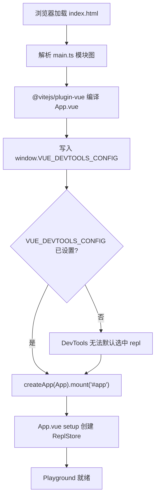
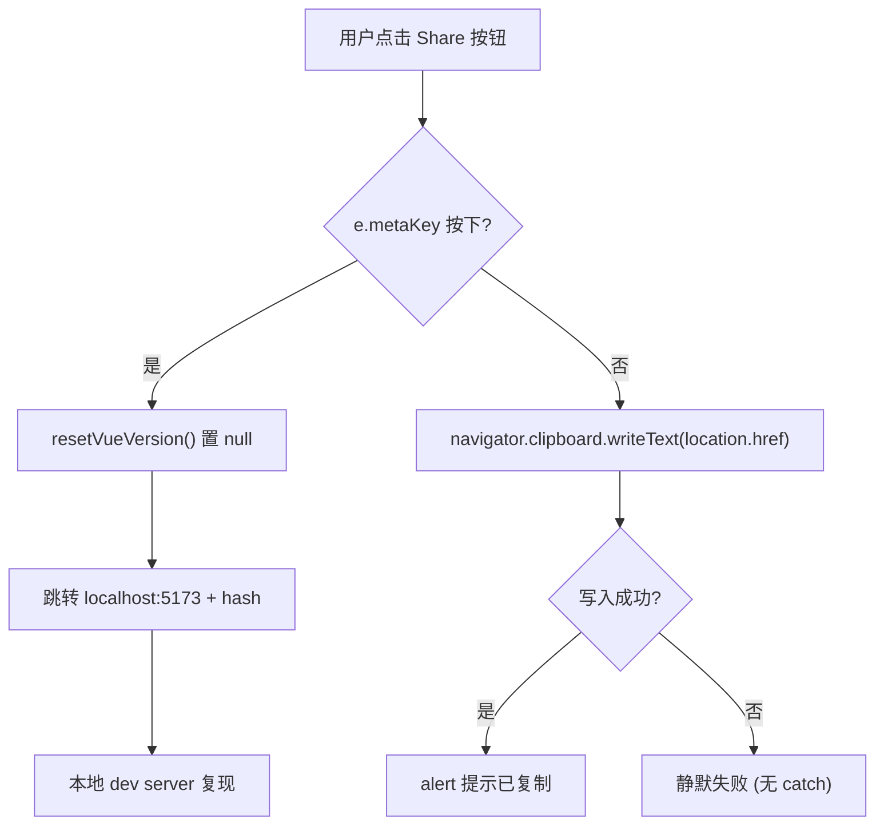
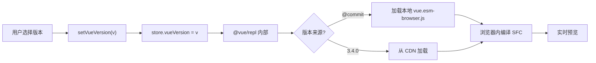

# 제 7 장: SFC Playground: 브라우저 내 실시간 컴파일과 디버깅 서브시스템

이전 장에서 우리는 20여 개의`.test-d.ts`파일로 「타입이 곧 API 계약」을 CI에 못 박았다. 하지만 타입 계약은 「API 표면이 어떻게 생겼는가」만 답할 뿐, 「이 SFC가 컴파일되면 실제로 어떻게 생겼는가」「SSR 모드에서 렌더링 결과가 일치하는가」는 답할 수 없다. 뒤의 두 질문에 답하기 위해 Vue 팀은 브라우저에서 전체 컴파일 파이프라인을 실행할 수 있는 샌드박스가 필요했다——그것이 바로`packages-private/sfc-playground`이다. 이것은`packages/`아래의 공개 패키지와 본질적으로 다르다:`package.json`에서`"private": true`이고`"version": "0.0.0"` [FACT:packages-private/sfc-playground/package.json:2-4], 이는 결코 npm에 배포되지 않고 단지 공식 디버깅 도구임을 의미한다. 그 의존성에서`vue`은`workspace:*` [FACT:packages-private/sfc-playground/package.json:19]을 가리키며, 즉 npm의 안정 버전이 아닌 로컬 소스 빌드 산출물이다——이로 인해 Playground는 자연스럽게 「현재 commit의 살아있는 데모」가 된다. 이번 장은 세 가지 질문에 집중한다: 진입점이 어떻게 초기화되는가, Header가 어떻게 상태 전환을 구동하는가, 빌드 시점 상수가 어떻게 주입되는가.

# 1. 진입점의 미니멀리즘: main.ts와 ReplStore의 초기화 계약

## 직관적 모델

`main.ts`은 단 9줄로, 「부팅 자체 점검 스크립트」와 같다: Vue 애플리케이션이 마운트되기 전에 먼저`window`에 전역 설정을 넣어 Vue DevTools에게 「기본적으로 어떤 app을 선택할지」 알려준다. 이 단계가 없으면 DevTools를 열 때 여러 app 인스턴스(Playground 자체 + 사용자 REPL에서 실행되는 코드)에 직면하여 자동으로 포커스할 수 없고, 디버깅 경험이 수동 전환으로 퇴화한다.

## 데이터 구조와 전역 부작용

`main.ts`의 핵심은`createApp`이 아니라,`window`에 대한 오염적 쓰기다:

[FACT:packages-private/sfc-playground/src/main.ts:4-7]

```ts
// @ts-expect-error Custom window property
window.VUE_DEVTOOLS_CONFIG = {
  defaultSelectedAppId: 'repl',
}
```

여기서 주목할 만한 두 가지 엔지니어링 세부사항이 있다:

> **[Design Inference & Architectural Trade-offs]**
> 1. **`@ts-expect-error`이 아니라`@ts-ignore`**：`window`의 표준 타입`Window & typeof globalThis`에는`VUE_DEVTOOLS_CONFIG`필드가 없다.`@ts-expect-error`을 사용한다는 것은 「여기서 오류가 발생할 것을 알고 있으며, 반드시 오류가 발생해야 한다고 요구한다」는 의미다——만약 미래에 어떤`@types/*`이 이 필드를 보완하면,`@ts-expect-error`은 「오류가 발생하지 않음」으로 인해 역으로 오류를 발생시켜, 작성자에게 해당 주석을 제거하도록 알린다. 이는 이전 장의 타입 계약 테스트 사고와 일맥상통한다:**타입 시스템으로 의도를 지키고, 문제를 덮지 않는다**。

> **[Design Inference & Architectural Trade-offs]**
> 2. **`defaultSelectedAppId: 'repl'`의 문자열 규약**: 이`'repl'`은`@vue/repl`내부에서 app을 생성할 때 사용하는 id와 완전히 일치해야 한다. 이것은 크로스 패키지 리터럴 계약으로, 어떤 타입 제약도 보호하지 않는다——만약`@vue/repl`이 id를 변경하면, Playground의 DevTools 기본 선택이 조용히 무효화된다.

## Step-by-Step: HTML에서 마운트까지

실행 흐름은 매우 짧지만, 각 단계마다 암묵적 제약이 있다:

1. 브라우저가`index.html`을 로드하며, 여기에는`<div id="app">`이 포함된다(본 자료에는 제공되지 않았지만,`mount('#app')`으로 역추론 가능).

2. 모듈 그래프 해석:`main.ts`상단`import App from './App.vue'` [FACT:packages-private/sfc-playground/src/main.ts:2]이`@vitejs/plugin-vue`의 SFC 컴파일을 트리거한다.

> **[Design Inference & Architectural Trade-offs]**
> 3. **핵심 순서**：`window.VUE_DEVTOOLS_CONFIG`은`createApp(App).mount('#app')` [FACT:packages-private/sfc-playground/src/main.ts:9]이전에 쓰여야 한다. DevTools의 hook은`createApp`내부에서 등록되므로, mount 이후에 설정을 쓰면 최초 선택에 영향을 미칠 수 없다.

4. `mount('#app')`이`App.vue`의 setup을 트리거하고, 이어서`ReplStore`을 생성한다(`App.vue`에서, 본 자료에는 포함되지 않음).



## 설계 사고와 함정

`main.ts`의 미니멀리즘은 의도적이다:**복잡성을 전부`App.vue`과`ReplStore`**. 진입점은 '전역 부수 효과 주입 + 마운트' 두 가지만 담당하며, 어떤 비즈니스 로직도 여기에 나타나서는 안 된다. 이는 Playground가 '제품'이 아닌 '디버깅 도구'로서의 선택——SSR 호환성, 다중 진입점, 지연 로딩이 필요 없다.

> **[Design Inference & Architectural Trade-offs]**
> 프로덕션 함정 포인트:`window.VUE_DEVTOOLS_CONFIG`는**전역 싱글톤**. 만약 Playground가 DevTools를 사용하는 다른 페이지(예: iframe 시나리오)에 임베드되면, 나중에 작성된 것이 먼저 것을 덮어쓴다. Playground는 일반적으로 독립 배포되므로 이 위험은 수용된다.

---

# 2. Header.vue: computed 파생 상태와 emit 단방향 데이터 흐름

## 직관적 모델

`Header.vue`는 Playground의 '제어판'——버전 선택, PROD/DEV 전환, SSR 스위치, 테마 전환, 공유, 다운로드. 그것 자체는**어떤 비즈니스 상태도 보유하지 않으며**, 모든 상태는`props.store`와 불리언 props에서 오고, 모든 변경은`emit`를 통해 부모 컴포넌트에 보고된다. 이러한 '더미 컴포넌트 + 이벤트 버블링' 제약이 없다면, Header는 상태가 흩어지는 재앙 지역이 될 것이며, 버전 전환과 SSR 전환의 부수 효과를 중앙 관리할 수 없게 된다.

## 데이터 구조와 필드 분석

Header의 props 정의는 그 책임을 이해하는 열쇠다:

[FACT:packages-private/sfc-playground/src/Header.vue:13-19]

```ts
const props = defineProps()
```

다섯 개의 props는 두 가지로 나뉜다:

- **`store: ReplStore`**: 유일한 상태 컨테이너 참조,`@vue/repl`에서 옴. Header는 이를 통해`store.loading`、`store.vueVersion`、`store.typescriptVersion`를 읽고, 직접`store.vueVersion`。
- **네 개의 불리언/리터럴 props**：`prod`、`ssr`、`autoSave`、`theme`. 이들은**제어된 상태**이며, Header는 읽기만 하고 쓰지 않으며, 변경은 반드시`emit`。

해당 emit 목록[FACT:packages-private/sfc-playground/src/Header.vue:20-28]：

```ts
const emit = defineEmits([
  'toggle-theme',
  'toggle-ssr',
  'toggle-prod',
  'toggle-autosave',
  'reload-page',
])
```

주의`toggle-theme`는`toggleDark()`내부`emit`에 의해`toggle-ssr`/`toggle-prod`/`toggle-autosave`지만,`$emit`는 템플릿에서 직접[FACT:packages-private/sfc-playground/src/Header.vue:102-118]의`<script setup>`. 이러한 혼용은 Vue 3**의 일반적인 스타일:`$emit`**。

## 부수 효과가 필요할 때는 함수 emit, 순수 전달 시에는 템플릿

Step-by-Step: 버전 표시와 전환

**시나리오: 사용자가 Playground를 열면, Header는 현재 Vue 버전을 표시해야 한다.**

[FACT:packages-private/sfc-playground/src/Header.vue:30-37]

```ts
const vueVersion = computed(() => {
  if (store.loading) {
    return 'loading...'
  }
  return store.vueVersion || `@${__COMMIT__}`
})
```

복사`loading`여기에는 세 가지 우선순위가 있다:`'loading...'`상태 →`store.vueVersion`; 사용자가 명시적으로 버전 선택 →`@${__COMMIT__}`; 그렇지 않으면 →`__COMMIT__`(현재 commit 짧은 해시).

**는 빌드 시 주입된 상수이며, 다음 섹션에서 자세히 설명한다.**

[FACT:packages-private/sfc-playground/src/Header.vue:88-88]

```html

```

복사**여기서 주의`v-model`**를 사용하지 않고`:model-value` + `@update:model-value`, 명시적으로`vueVersion`로 분리했다. 이유는`setVueVersion`가 computed(읽기 전용)이므로 직접 양방향 바인딩할 수 없으며, 반드시`store.vueVersion`：

[FACT:packages-private/sfc-playground/src/Header.vue:39-41]

```ts
async function setVueVersion(v: string) {
  store.vueVersion = v
}

function resetVueVersion() {
  store.vueVersion = null
}
```

> **[Design Inference & Architectural Trade-offs]**
> `setVueVersion`복사`async`〔설계 추론 및 아키텍처 트레이드오프〕`await`는`VersionSelect`로 선언되었지만 내부에

**가 없다——이것은 역사적 유산인가 의도적인가? 추측컨대**

[FACT:packages-private/sfc-playground/src/Header.vue:76-80]

```html

```

단계 3: TypeScript 버전 비교`v-model`복사`store.typescriptVersion`TypeScript 버전은**를 사용했는데,**는 쓰기 가능한 일반 속성이므로 computed 래핑이 필요 없다.

## 동일한 컴포넌트가 동일한 템플릿에서 두 가지 바인딩 방식을 사용하는 것

[FACT:packages-private/sfc-playground/src/Header.vue:58-66]

```ts
function toggleDark() {
  const cls = document.documentElement.classList
  cls.toggle('dark')
  localStorage.setItem(
    'vue-sfc-playground-prefer-dark',
    String(cls.contains('dark')),
  )
  emit('toggle-theme', cls.contains('dark'))
}
```

테마 전환: 부수 효과와 emit의 조합**복사`props.theme`**이 함수는 세 가지를 한다: DOM class 조작, localStorage에 영속화, emit으로 부모 컴포넌트에 알림.`toggle-theme`주의: 직접`theme`를 변경하지 않는다——props는 읽기 전용이므로, 부모 컴포넌트가`:title`를 받은 후에야[FACT:packages-private/sfc-playground/src/Header.vue:123]。

> **[Design Inference & Architectural Trade-offs]**
> 문구**〔설계 추론 및 아키텍처 트레이드오프〕**。`document.documentElement.classList.toggle('dark')`여기 미묘한 설계가 있다:`theme`DOM class 조작과 Vue 반응형 상태는 두 개의 독립 경로

## 는 직접 DOM을 변경하고,

[FACT:packages-private/sfc-playground/src/Header.vue:47-56]

```ts
async function copyLink(e: MouseEvent) {
  if (e.metaKey) {
    resetVueVersion()
    // hidden logic for going to local debug from play.vuejs.org
    window.location.href = 'http://localhost:5173/' + window.location.hash
    return
  }
  await navigator.clipboard.writeText(location.href)
  alert('Sharable URL has been copied to clipboard.')
}
```

숨겨진 로직: copyLink의 metaKey 분기**복사**이것은`play.vuejs.org`개발자 백도어`localhost:5173`:`// hidden logic for going to local debug from play.vuejs.org` [FACT:packages-private/sfc-playground/src/Header.vue:47-56]에서 Cmd를 누른 채 공유 버튼을 클릭하면

> **[Design Inference & Architectural Trade-offs]**
> `resetVueVersion()`는 이것이 의도적으로 숨겨진 기능임을 명확히 표시한다.`store.vueVersion`〔설계 추론 및 아키텍처 트레이드오프〕`null`는 이동 전에 호출되어



## 로 설정하여, 로컬 디버깅이 온라인에서 선택된 버전이 아닌 현재 commit을 사용하도록 보장한다.

> **[Design Inference & Architectural Trade-offs]**
> **설계 사고와 함정`navigator.clipboard`〔설계 추론 및 아키텍처 트레이드오프〕**。`copyLink`함정 1:[FACT:packages-private/sfc-playground/src/Header.vue:47-56]의 권한과 보안 컨텍스트`writeText`에는 try/catch가 없다

> **[Design Inference & Architectural Trade-offs]**
> **는 reject되어 처리되지 않은 Promise rejection을 초래한다. Playground는 HTTPS에 배포되므로 위험이 수용되지만, 이는 전형적인 '프로덕션 환경 함정'이다.`toggleDark`〔설계 추론 및 아키텍처 트레이드오프〕**。`'vue-sfc-playground-prefer-dark'`함정 2:

**의 localStorage key 하드코딩`currentCommit`는 문자열 리터럴이며 상수 추출이 없다. 향후 key를 변경하려면 전역 검색이 필요하다.`vueVersion`함정 3:**와`:class="{ active: vueVersion === \`@${currentCommit}\` }"` [FACT:packages-private/sfc-playground/src/Header.vue:88-88]문자열 연결로 비교한다. 만약`__COMMIT__`주입 실패(변환됨`undefined`), 여기서는`'@undefined'`로 변해 영원히 일치하지 않는다. 빌드 시점 상수 주입의 신뢰성이 UI 정확성을 직접 결정한다—이것이 바로 다음 절의 주제다.

---

# 3. 빌드 시점 상수 주입: __COMMIT__과 copyVuePlugin의 이중 책임

## 직관적 모델

`vite.config.ts`은 Playground의 '조립 공장'이다: 빌드 시`git rev-parse`을 실행해 commit 해시를 얻고,`define`를 통해 전역 상수`__COMMIT__`로 만든다. 동시에 커스텀 플러그인을 통해`packages/vue/dist/`아래의 ESM 브라우저 산출물을 Playground의 산출물 디렉터리로 복사한다. 이 단계가 없으면 Playground는 브라우저에서 '현재 commit의 Vue 런타임'을 로드할 수 없다—npm의 안정 버전에만 의존해야 하므로 '살아있는 데모'의 의미를 잃는다.

## 데이터 구조와 빌드 시점 상수

[FACT:packages-private/sfc-playground/vite.config.ts:7-9]

```ts
const commit = spawnSync('git', ['rev-parse', '--short=7', 'HEAD'])
  .stdout.toString()
  .trim()
```

`spawnSync`은 git 명령을 동기 실행하여,`--short=7`로 7자리 짧은 해시를 얻는다. 동기 실행은 의도적이다:**설정 파일이 모듈 로드 시점에`commit`의 값이 필요하다**. 비동기면 Vite의 설정 파싱 타이밍이 어긋난다.

[FACT:packages-private/sfc-playground/vite.config.ts:23-26]

```ts
define: {
  __COMMIT__: JSON.stringify(commit),
  __VUE_PROD_DEVTOOLS__: JSON.stringify(true),
},
```

`define`은 Vite의**텍스트 치환**메커니즘이다: 소스의 모든`__COMMIT__`이`JSON.stringify(commit)`의 결과(즉 따옴표가 붙은 문자열 리터럴)로 치환된다.`JSON.stringify`은 필수다—만약 그냥`commit`이라고 쓰면 치환 후 맨 식별자`abc1234`가 되어 변수명으로 취급되고 문자열이 아니다.

> **[Design Inference & Architectural Trade-offs]**
> `__VUE_PROD_DEVTOOLS__: true`은 또 다른 핵심 상수다: Vue의**프로덕션 빌드**에서도 DevTools 지원을 유지하게 한다. 기본적으로 프로덕션 빌드는 크기를 줄이기 위해 DevTools hook을 제거하지만, Playground는 사용자 코드를 디버깅해야 하므로 강제로 켠다.

## Step-by-Step: copyVuePlugin의 산출물 운반

[FACT:packages-private/sfc-playground/vite.config.ts:32-63]

```ts
function copyVuePlugin(): Plugin {
  return {
    name: 'copy-vue',
    generateBundle() {
      const copyFile = (file: string) => {
        const filePath = path.resolve(
          import.meta.dirname,
          '../../packages',
          file,
        )
        const basename = path.basename(file)
        if (!fs.existsSync(filePath)) {
          throw new Error(
            `${basename} not built. ` +
              `Run "nr build vue -f esm-browser" first.`,
          )
        }
        this.emitFile({
          type: 'asset',
          fileName: basename,
          source: fs.readFileSync(filePath, 'utf-8'),
        })
      }

      copyFile(`vue/dist/vue.esm-browser.js`)
      copyFile(`vue/dist/vue.esm-browser.prod.js`)
      copyFile(`vue/dist/vue.runtime.esm-browser.js`)
      copyFile(`vue/dist/vue.runtime.esm-browser.prod.js`)
      copyFile(`server-renderer/dist/server-renderer.esm-browser.js`)
    },
  }
}
```

핵심을 하나씩 분석:

1. **`generateBundle`훅**: Rollup이 번들을 생성한 후, 디스크에 쓰기 전에 실행된다. 이때`emitFile`로 산출물에 추가 파일을 넣을 수 있다.

2. **`import.meta.dirname`**: Node 20.11+에서 제공하는 ESM 버전`__dirname`. 경로`../../packages`는`packages-private/sfc-playground/`에서 저장소 루트로 올라간 뒤`packages/`。

3. **로 들어간다. 존재성 검사 + 명확한 오류**: 만약`vue.esm-browser.js`이 없으면 수정 지침이 담긴 오류를 던진다`Run "nr build vue -f esm-browser" first.`. 이것은**개발자 경험**의 전범이다—오류 메시지가 바로 어떻게 고칠지 알려준다.

4. **다섯 산출물**：`vue`의 전체 버전/런타임 버전 × dev/prod, 그리고`server-renderer`. 이 다섯 파일이 바로 Playground가 브라우저에서 동적 import하는 후보 집합이며, Header의 버전 전환과 SSR 토글에 대응한다.

> **[Design Inference & Architectural Trade-offs]**
> **왜 이 다섯인가?**전체 버전(컴파일러 포함)은 '런타임 컴파일' 시나리오용; 런타임 버전은 '사전 컴파일' 시나리오용; dev/prod는 Header의 PROD/DEV 전환에 대응; server-renderer는 SSR 토글에 대응. 이 다섯 파일이 Playground의 'Vue 런타임 매트릭스'를 구성한다.

## 버전 전환의 전체 데이터 흐름

Header의`setVueVersion`과 copyVuePlugin의 산출물을 연결해 보면:



주의:`@${__COMMIT__}`이 특수 값은 copyVuePlugin이 복사한 로컬 산출물에 대응하며 CDN이 아니다. 이것이 Playground가 Vue의 브라우저 빌드 산출물을 반드시 복사해야 하는 이유다—**'This Commit' 옵션은 로컬 파일이 필요하다**。

## 설계 사고와 함정

> **[Design Inference & Architectural Trade-offs]**
> **함정 1:`spawnSync`의 실패 처리**. 만약 현재 디렉터리가 git 저장소가 아니면(예: tarball 압축 해제),`spawnSync`은 0이 아닌 종료 코드를 반환하고,`stdout`은 비어 있으며,`commit`은 빈 문자열이 된다. 이때`__COMMIT__`은`""`로 치환되고, Header의`@${currentCommit}`은`'@'`이 된다. 명시적 오류 처리가 없다.

> **[Design Inference & Architectural Trade-offs]**
> **함정 2:`optimizeDeps.exclude: ['@vue/repl']`** [FACT:packages-private/sfc-playground/vite.config.ts:27-29]. Vite는 기본적으로 콜드 스타트를 가속하기 위해 의존성을 사전 번들링하지만,`@vue/repl`은 제외된다. 이유는`@vue/repl`내부에서 동적 import와 worker를 사용하는데, 사전 번들링이 이 메커니즘을 깨뜨리기 때문이다. 이는 Vite 생태계에서 흔한 '사전 번들링과 동적 로딩 충돌' 문제다.

> **[Design Inference & Architectural Trade-offs]**
> **함정 3:`script.fs`설정** [FACT:packages-private/sfc-playground/vite.config.ts:13-19]。`@vitejs/plugin-vue`의`script.fs`옵션은 SFC의`<script>`블록이`fs`를 통해 파일을 읽도록 허용한다. 여기서`fs.existsSync`와`fs.readFileSync`를 전달하는 것은 SFC의`import`문 파싱을 지원하기 위함이다(예:`import x from './foo'`는 파일 존재 여부를 확인해야 함).**이것이 Playground가 브라우저에서 완전한 모듈 해석을 시뮬레이션할 수 있는 핵심이다**—Node의 fs 능력을 컴파일러의 해석 단계에 주입한다.

---

# 설계 사고: Playground의 아키텍처 트레이드오프

세 소절을 연결해 보면, Playground의 아키텍처는 명확한 원칙을 따른다:**'상태'와 '부작용'을 분리하고, '빌드 시점'과 '런타임'을 분리한다**。

- `main.ts`은 전역 부작용 주입만 하고 비즈니스 상태는 건드리지 않는다.
- `Header.vue`은 순수 표시 컴포넌트로, 상태는 props로 들어오고 emit으로 나간다.
- `vite.config.ts`은 '현재 commit'이라는 빌드 시점 정보를 상수로 고정하고, 런타임에는 읽기 전용이다.

> **[Design Inference & Architectural Trade-offs]**
> 이러한 분리는 직접적인 이점을 준다:**Playground는 어떤 Vue 앱에도 임베드될 수 있다**(예: 문서 사이트의 내장 예제). 단지`store`과 네 개의 불리언 props만 제공하면 된다.

대가는**상태 분산**：`store`에서`@vue/repl`내부에서, 불리언 상태는 부모 컴포넌트에 있고, DOM class는`document.documentElement`에 있으며, localStorage에도 하나 더 있다. 네 곳의 상태를 수동으로 동기화해야 하며, 어느 한 곳이라도 동기화되지 않으면 UI 불일치가 발생한다.

> **[Design Inference & Architectural Trade-offs]**
> 또 다른 트레이드오프는**SSR 호환 포기**。`main.ts`직접 접근`window`，`Header.vue`의`toggleDark`직접 접근`document`이다. Playground는 순수 CSR 애플리케이션이므로 서버 사이드 렌더링을 고려할 필요가 없다.

---

# 이 장의 요약

이 장에서는`packages-private/sfc-playground`의 세 가지 핵심 파일을 분석했다:

1. **`main.ts`**: 9줄짜리 진입점, 핵심은`window.VUE_DEVTOOLS_CONFIG`의 주입 순서——반드시`mount`이전이어야 한다.

2. **`Header.vue`**:`computed`을 통해`vueVersion`을 파생하고,`emit`을 통해 모든 상태 변경을 보고한다.`copyLink`의`metaKey`분기는 숨겨진 로컬 디버깅 백도어이다.

3. **`vite.config.ts`**：`spawnSync`은 commit 해시를 가져오고,`define`은`__COMMIT__`，`copyVuePlugin`을 주입하여 다섯 개의 Vue 브라우저 빌드 산출물을 Playground 산출물 디렉토리로 옮긴다.

세 가지를 관통하는 주된 흐름은**빌드 시점 상수와 런타임 상태의 경계**：`__COMMIT__`는 읽기 전용 빌드 시점 사실이고,`store.vueVersion`은 변경 가능한 런타임 선택이며, Header의`vueVersion`computed가 둘을 하나의 표시 문자열로 통합한다.

# 이 장의 생각과 자가 점검

Q1: 만약`main.ts`에서`window.VUE_DEVTOOLS_CONFIG`의 할당을`createApp(App).mount('#app')`이후로 옮기면 어떻게 되는가? 왜인가?

**참고 해석**：`window.VUE_DEVTOOLS_CONFIG`은 Vue DevTools가`createApp`내부에서 hook을 등록할 때 읽는 설정[FACT:packages-private/sfc-playground/src/main.ts:4-9]。`createApp`은 즉시`__VUE_DEVTOOLS_GLOBAL_HOOK__`을 등록하며, 이때 DevTools는`defaultSelectedAppId`을 읽어 기본으로 어떤 app을 선택할지 결정한다. 만약 할당이`mount`보다 늦으면, DevTools는 이미 최초 app 선택을 완료한 상태이므로 설정이 적용되지 않고, 사용자가 DevTools에서 수동으로`repl`app으로 전환해야 한다. 더 은밀한 문제는:`@vue/repl`내부에서도 app을 생성하기 때문에, 늦은 할당은 DevTools가 Playground 자체를 기본으로 선택하게 하여 사용자 REPL 대신 선택할 수 있다는 점이다. 이는 디버깅 도구에서 '전역 부수 효과 주입 순서'의 중요성을 보여준다.

Q2: `Header.vue`의`toggleDark()`은 DOM class, localStorage, emit을 동시에 조작하지만`props.theme`을 직접 수정하지는 않는다. 만약 부모 컴포넌트가`toggle-theme`이벤트를 받고`theme`prop 업데이트를 거부하면 어떤 UI 불일치가 발생하는가? 소스 코드 수준에서 어떻게 찾을 수 있는가?

**참고 해석**：`toggleDark()`은[FACT:packages-private/sfc-playground/src/Header.vue:58-66]에서`document.documentElement.classList.toggle('dark')`을 직접 호출하며, 이는 즉시 DOM의`dark`class를 변경하고 CSS 변수 전환을 트리거한다([FACT:packages-private/sfc-playground/src/Header.vue:186-186]의`.dark nav`규칙 참조). 그러나 템플릿의`:title`문구[FACT:packages-private/sfc-playground/src/Header.vue:123]는`props.theme`에 의존하므로, 부모 컴포넌트가 업데이트하지 않으면 title은 이전 값에 머문다. 찾는 방법: 브라우저 DevTools에서`<html>`의 class와 버튼의 title 속성이 모순되는지 확인한다. 근본 원인은 'DOM 부수 효과'와 'Vue 반응형 상태'가 두 개의 독립적인 경로를 가며 단일 데이터 소스가 없다는 것이다.

Q3: `copyVuePlugin`은`generateBundle`에서 각 파일에 대해`fs.existsSync`검사를 수행하고, 누락 시 수정 지침이 포함된 오류를 던진다. 만약 이 검사를 제거하고 직접`fs.readFileSync`하면, CI 환경(vue를 먼저 빌드하지 않은 경우)에서 어떻게 되는가? 오류 메시지는 개발자를 어떻게 오도하는가?

**참고 해석**: 검사를 제거하면,`fs.readFileSync`이`ENOENT: no such file or directory, open '.../packages/vue/dist/vue.esm-browser.js'` [FACT:packages-private/sfc-playground/vite.config.ts:32-63]을 던진다. 이 오류는 개발자에게 '파일이 존재하지 않는다'고만 알려줄 뿐, '먼저`nr build vue -f esm-browser`을 실행해야 한다'고는 알려주지 않는다. CI 환경에서 개발자는 경로 설정 오류, 권한 문제, git 서브모듈 미초기화로 오인하여 많은 시간을 낭비할 수 있다. 원래 코드의`throw new Error(\`${basename} not built. Run "nr build vue -f esm-browser" first.\`)`은 '증상'과 '수정 동작'을 묶어 놓았으며, 이는 개발자 경험 설계의 핵심 세부 사항이다. 이는 또한 Playground의 빌드 스크립트가 Vue 코어 빌드 스크립트와 명확한 의존 순서를 가져야 하는 이유를 설명한다.

---

다음 장에서는`packages-private/template-explorer`으로 들어가, Vue가 컴파일러의 중간 산출물(AST, 변환 결과, 코드 생성)을 어떻게 시각화하여 개발자가 템플릿에서 렌더 함수까지의 각 변환 단계를 단계별로 관찰할 수 있는지 살펴본다. Playground의 '엔드투엔드 블랙박스'와 달리, Template Explorer는 '화이트박스 프로브'이다.

여기까지 우리는 SFC Playground가 어떻게 컴파일 파이프라인을 브라우저로 옮기는지 확인했다: 진입점 초기화, Header 상태 전환, 빌드 시점 상수 주입이 함께 실시간 디버깅 가능한 샌드박스를 구성한다. 그러나 Playground의 관점은 항상 '전체 SFC의 컴파일과 실행'이며, '컴파일러가 특정 템플릿 표현식에 대해 정확히 어떤 변환을 수행하는가'를 직접 답하지는 않는다. 다음 장에서는 Template Explorer로 들어가,`@vue/compiler-dom`과`@vue/compiler-ssr`의 컴파일 결과를 한 줄씩 펼쳐 보여주고, SourceMapConsumer로 소스와 산출물의 매핑을 구축하여 컴파일러의 내부 동작을 관찰 가능하고 역추적 가능한 프로브로 만드는 방법을 살펴본다.
