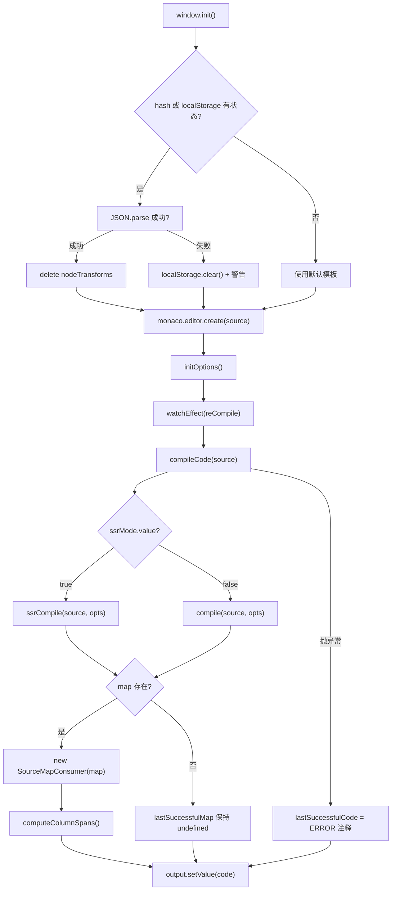
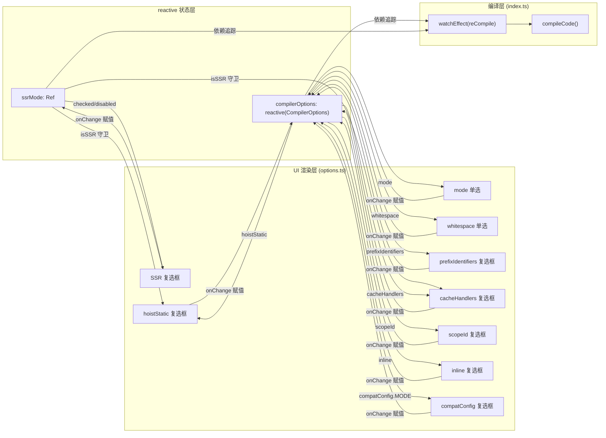

# 제 8 장: Template Explorer: 컴파일러 동작의 시각화 프로브

지난 장에서 우리는 SFC Playground가 'SFC 입력 → 브라우저 내 컴파일 → 실시간 미리보기'라는 전체 체인을 어떻게 블랙박스로 캡슐화하는지 살펴보았다. 개발자는 최종 렌더링 결과만 볼 뿐, 컴파일러가 중간에 무엇을 하는지는 볼 수 없다. 템플릿에 커스텀 디렉티브를 작성하거나 hoistStatic을 켠 후 결과물에 갑자기 _hoisted_1 변수가 잔뜩 생겼을 때, Playground는 '컴파일러가 왜 이렇게 생성했는가'에 답할 수 없다. Template Explorer의 포지셔닝은 정반대다. @vue/compiler-dom과 @vue/compiler-ssr의 컴파일 산출물, AST, 오류 마커, 그리고 소스 코드에서 산출물로의 위치 매핑을 전부 펼쳐 놓는다. 핵심은 '실행'이 아니라 '관찰'이다. 이 장은 세 파일을 중심으로 전개된다. index.ts는 컴파일 호출과 SourceMap 양방향 매핑을 담당하고, options.ts는 reactive로 수십 개의 CompilerOptions를 관리하며 UI를 구동하고, theme.ts는 Monaco 에디터 테마를 커스터마이즈한다.

# 一、컴파일 호출과 SourceMap 양방향 매핑: index.ts

## 직관적 모델

Template Explorer의`index.ts`는 '양방향 번역기'와 같다. 왼쪽에는 템플릿을 입력하고, 오른쪽에는 렌더 함수를 출력한다. 하지만 번역기보다 한 가지 능력이 더 있다. 왼쪽의 특정 줄에 커서를 놓으면 오른쪽에서 대응하는 산출물이 하이라이트되고, 반대로 오른쪽에 커서를 놓으면 왼쪽에서 대응하는 템플릿이 하이라이트된다. SourceMap 매핑이 없다면 이 도구는 나란히 놓인 두 개의 텍스트 상자로 전락하여, 개발자는 육안으로만 비교할 수 있고 '템플릿 몇 번째 줄 → 산출물 몇 번째 줄'이라는 인과 사슬을 구축할 수 없다.

## 데이터 구조와 메모리 레이아웃

`index.ts`에는 복잡한 Struct가 없지만, 전체 도구의 동작을 결정하는 몇 가지 핵심 모듈 레벨 상태 변수가 있다.

`lastSuccessfulCode`과`lastSuccessfulMap`는 컴파일 결과의 캐시[FACT:packages-private/template-explorer/src/index.ts:74-75]다. 전자는 문자열이고, 후자는`SourceMapConsumer | undefined`이다. 주목할 점은`lastSuccessfulMap`이 초기에`undefined`이며, 컴파일이 성공하고`map`이 존재할 때만[FACT:packages-private/template-explorer/src/index.ts:99-100]로 할당된다는 것이다. 이`undefined`상태는 이후 모든 커서 매핑 로직의 가드 조건이다. 컴파일이 실패하면 매핑 기능은 예외를 던지는 대신 자동으로 조용히 비활성화된다.

`PersistedState`인터페이스는 localStorage와 URL hash에 영속화되는 상태 형태를 정의한다.[FACT:packages-private/template-explorer/src/index.ts:26-30]：`src`(템플릿 소스),`ssr`(SSR 모드 여부),`options`(컴파일러 옵션). 여기에는 핵심 설계가 하나 있다.`options`의 타입은 완전한`CompilerOptions`이지만, 실제 영속화 시에는 '기본값과 다른 항목'만 저장하며, 이 잘라내기 로직은`reCompile`에서 수행된다.

`sharedEditorOptions`는 두 에디터가 공유하는 생성 옵션[FACT:packages-private/template-explorer/src/index.ts:26-30]：`fontSize: 14`、`scrollBeyondLastLine: false`、`renderWhitespace: 'selection'`、`minimap.enabled: false`이다. minimap을 끈 이유는 템플릿과 산출물이 보통 수십 줄에 불과하여 minimap이 오히려 가로 공간을 차지하기 때문이다.

## Step-by-Step Walkthrough

**시나리오: 사용자가 페이지를 열고`
{{ msg }}
`를 입력한 다음 커서를 이동한다.**

**첫 번째 단계: 초기화와 상태 복원.** `window.init`는 전역 진입점[FACT:packages-private/template-explorer/src/index.ts:41]이다. 먼저 커스텀 테마를 등록하고 활성화한[FACT:packages-private/template-explorer/src/index.ts:44-45]다음, URL hash 또는 localStorage에서 상태 복원을 시도한다[FACT:packages-private/template-explorer/src/index.ts:49-56]. 여기서 디코딩 순서에 주목하자. 먼저`atob`그다음`escape`, 그다음`decodeURIComponent`. hash 파싱이 실패하면`localStorage.getItem('state')`로 fallback하고, 다시`{}`로 fallback한다. 전체 JSON.parse가 실패하면 localStorage를 비우고 경고를 출력한다[FACT:packages-private/template-explorer/src/index.ts:57-64]。

. 상태 복원 후에는 쉽게 간과되는 세부 사항이 하나 있다.`delete persistedState.options?.nodeTransforms` [FACT:packages-private/template-explorer/src/index.ts:69]. 주석에 이유가 설명되어 있다. 함수는 직렬화할 수 없으므로 영속화 시`nodeTransforms`이 손실되고, 복원 시 빈 객체가 남아 있으면 컴파일러 동작이 비정상이 될 수 있다. 이는 '직렬화 불가능한 필드 영속화'의 전형적인 함정이다.

**두 번째 단계: 컴파일 핵심`compileCode`。**. 이것은 전체 도구의 심장[FACT:packages-private/template-explorer/src/index.ts:76-106]이다. 먼저`console.clear()`를 수행한 다음,`ssrMode.value`에 따라`ssrCompile`또는`compile` [FACT:packages-private/template-explorer/src/index.ts:80]를 선택한다. 주목할 점은`compileFn`의 호출 인자다. 전개`compilerOptions`, 강제`filename: 'ExampleTemplate.vue'`、`sourceMap: true`, 그리고`onError`콜백을 주입하여 오류를 수집한다[FACT:packages-private/template-explorer/src/index.ts:82-89]。

. 여기에는 설계 결정이 하나 있다.`filename`이`'ExampleTemplate.vue'`로 하드코딩되어 있다. 이 값은 이후`generatedPositionFor`호출에서 정확히 일치해야[FACT:packages-private/template-explorer/src/index.ts:189]하며, 그렇지 않으면 SourceMap 조회가 빈 결과를 반환한다. 이는 암묵적 계약이다. 두 곳의 문자열이 일치해야 하지만, 이를 보장하는 타입 시스템은 없다.

컴파일이 완료되면 오류가 Monaco의 marker 형식으로 변환되어 에디터에 설정된다[FACT:packages-private/template-explorer/src/index.ts:91-95]。`formatError`.`CompilerError`의`loc`를 Monaco의`startLineNumber/startColumn/endLineNumber/endColumn` [FACT:packages-private/template-explorer/src/index.ts:108-119]로 변환한다. 주목할 점은`errors.filter(e => e.loc)`이다. 위치 정보가 있는 오류만 마킹되며,`loc`이 없는 오류(예: 전역 설정 오류)는 콘솔에만 출력된다.

**세 번째 단계: SourceMap 구축.**컴파일이 성공하면,`lastSuccessfulMap = new SourceMapConsumer(map!)` [FACT:packages-private/template-explorer/src/index.ts:99], 이어서`computeColumnSpans()` [FACT:packages-private/template-explorer/src/index.ts:100]。`computeColumnSpans`를 호출한다.`source-map-js`의 핵심 API 중 하나로, 각 매핑 세그먼트의 열 범위를 미리 계산하여`generatedPositionFor`가 반환하는`lastColumn`필드를 사용할 수 있게 한다. 이 단계가 없으면 역방향 매핑은 시작 열만 찾을 수 있고 전체 토큰 범위를 하이라이트할 수 없다.

**네 번째 단계: 양방향 커서 매핑.**사용자가**소스 에디터**에서 커서를 이동하면`editor.onDidChangeCursorPosition` [FACT:packages-private/template-explorer/src/index.ts:184]가 트리거된다. 콜백은 100ms debounce 후`lastSuccessfulMap.generatedPositionFor({ source: 'ExampleTemplate.vue', line, column: column - 1 })` [FACT:packages-private/template-explorer/src/index.ts:188-192]를 호출한다. 주목할 점은`column - 1`이다. Monaco의 열 번호는 1부터 시작하고 SourceMap의 열 번호는 0부터 시작한다. 반환된`pos`에`line`과`column`이 있으면 출력 에디터에 데코레이터를 생성하여 해당 범위를 하이라이트하고[FACT:packages-private/template-explorer/src/index.ts:194-206], 해당 위치로 스크롤한다[FACT:packages-private/template-explorer/src/index.ts:207-210]。

. 역방향 매핑은`output.onDidChangeCursorPosition`에서[FACT:packages-private/template-explorer/src/index.ts:223]이루어진다. 이는`originalPositionFor` [FACT:packages-private/template-explorer/src/index.ts:227-230]를 호출하지만 가드가 하나 더 있다. 무시`pos.line === 1 && pos.column === 0`의 「mock location」[FACT:packages-private/template-explorer/src/index.ts:231-237]. 이 가드는 매우 중요합니다——컴파일러가 생성한 일부 코드(예:`import`문 또는 helper 함수)에는 대응하는 템플릿 위치가 없어서, SourceMap이`{ line: 1, column: 0 }`를 자리 표시자로 반환합니다. 이를 무시하지 않으면, 이 줄들에 커서를 놓았을 때 잘못해서 템플릿 첫 번째 줄을 하이라이트하게 됩니다.

**다섯 번째 단계: 상태 지속화.** `reCompile`은 컴파일을 트리거할 뿐만 아니라 현재 상태를 localStorage와 URL hash에 기록하는 역할도 합니다[FACT:packages-private/template-explorer/src/index.ts:121-146]. 지속화할 때 하나의 잘라내기 로직이 있습니다:`compilerOptions`을 순회하면서, 「객체가 아니고 기본값과 같지 않은」 항목만 저장합니다[FACT:packages-private/template-explorer/src/index.ts:125-133]. 이것은 왜`bindingMetadata`같은 객체 타입 옵션이 지속화되지 않는지를 설명합니다——너무 복잡하고, 기본값만으로도 시연에 충분하기 때문입니다.

## 설계 사고와 프로덕션 함정

**왜`source-map-js`를 쓰고`source-map`？** `source-map`를 쓰지 않는가? 는 Mozilla의 원본 라이브러리로, 용량이 크고 (새 버전에서는) WASM에 의존합니다.`source-map-js`는 순수 JS 구현으로, 용량이 작아 브라우저 환경에 적합합니다. Template Explorer는 순수 프런트엔드 도구로서`source-map-js`를 선택한 것은 합리적입니다[FACT:packages-private/template-explorer/package.json:15]。

**debounce 지연 선택.**소스 편집기의 debounce 기본값은 300ms[FACT:packages-private/template-explorer/src/index.ts:271]이고, 커서 이동의 debounce는 100ms[FACT:packages-private/template-explorer/src/index.ts:215]입니다. 이 차이는 의도적입니다: 컴파일은 무거운 작업이라 300ms로 빈번한 트리거를 피하고, 커서 이동은 가벼운 작업이라 100ms로 반응감을 보장합니다. 하지만 100ms도 커서를 빠르게 움직일 때 하이라이트 깜빡임을 일으킬 수 있습니다——이는 수용 가능한 절충입니다.

**`window.init`의 전역 마운트.**주의:`window.init`와`window.monaco`는 모두 전역[FACT:packages-private/template-explorer/src/index.ts:19-23]에 마운트됩니다. 이는 Monaco 편집기가 CDN의`loader.js`을 통해 비동기 로드되고, 로드 완료 후`window.init`을 호출하기 때문입니다. 이러한 「전역 콜백」 패턴은 비모듈 환경에서 Monaco의 표준 사용법이지만, 현대 ESM 빌드 방식과는 잘 맞지 않습니다.

---

# 둘째, reactive 기반 옵션 패널: options.ts

## 직관적 모델

`options.ts`은 「콘솔 패널」과 같습니다: 위에 십여 개의 스위치와 라디오 버튼이 있고, 각각이 컴파일러의 한 동작에 대응합니다. 어떤 스위치든 움직이면 오른쪽의 컴파일 산출물이 즉시 바뀝니다. 이 모듈이 없다면, 개발자는 소스의`compile`호출 인자를 수정한 뒤 다시 컴파일해야만 하고, 서로 다른 옵션의 효과를 실시간으로 비교할 수 없습니다.

## 데이터 구조와 메모리 레이아웃

`options.ts`의 핵심은 세 개의 export입니다:

`ssrMode`은`ref(false)` [FACT:packages-private/template-explorer/src/options.ts:5]입니다. 이것은`compilerOptions`과 독립적인데, SSR 모드가 전환하는 것은 컴파일 함수 자체(`compile` vs `ssrCompile`)이지 컴파일 옵션이 아니기 때문입니다.

`defaultOptions`은 완전한`CompilerOptions`객체[FACT:packages-private/template-explorer/src/options.ts:5-27]입니다. 모든 옵션의 기본값을 정의하며,`mode: 'module'`、`prefixIdentifiers: false`、`hoistStatic: false`、`cacheHandlers: false`、`scopeId: null`、`inline: false`、`ssrCssVars: '{ color }'`、`compatConfig: { MODE: 3 }`、`whitespace: 'condense'`와 7개의 바인딩 타입을 포함하는`bindingMetadata` [FACT:packages-private/template-explorer/src/options.ts:18-26]。

`compilerOptions`을 포함합니다.`reactive(Object.assign({}, defaultOptions))` [FACT:packages-private/template-explorer/src/options.ts:29-31]는`Object.assign({}, ...)`입니다. 여기서`reactive(defaultOptions)`로 얕은 복사를 했다는 점에 주의하세요——만약 그냥`compilerOptions`하면,`defaultOptions`을 수정할 때`reCompile`이 오염되어

## Step-by-Step Walkthrough

**안의 「기본값과 비교」 로직이 무효화됩니다.**

**시나리오: 사용자가 「hoistStatic」 체크박스를 클릭.** `App`첫 번째 단계: UI 렌더링.`setup`컴포넌트의[FACT:packages-private/template-explorer/src/options.ts:33-35]는 렌더 함수`ssrMode.value`、`compilerOptions.mode`、`compilerOptions.prefixIdentifiers`를 반환합니다. 이 렌더 함수는[FACT:packages-private/template-explorer/src/options.ts:36-39]등의 반응형 상태를 읽으므로, 이 상태들이 변하면 전체 UI가 다시 렌더링됩니다.

**두 번째 단계: 체크박스의 checked 바인딩.** `hoistStatic`체크박스의`checked`속성은`compilerOptions.hoistStatic && !isSSR` [FACT:packages-private/template-explorer/src/options.ts:150]입니다. 여기에는 하나의 로직이 있습니다: SSR 모드에서는`hoistStatic`이 강제로 선택 해제되어 표시되는데, SSR 컴파일이 정적 호이스팅을 지원하지 않기 때문입니다. 동시에`disabled: isSSR` [FACT:packages-private/template-explorer/src/options.ts:151]은 사용자가 SSR 모드에서 이를 전환할 수 없도록 보장합니다.

**세 번째 단계: onChange 처리.**사용자가 체크박스를 클릭하면,`onChange`이[FACT:packages-private/template-explorer/src/options.ts:152-156]을 트리거하여,`e.target.checked`을 직접`compilerOptions.hoistStatic`에 할당합니다.`compilerOptions`이`reactive`이므로, 이 할당은 의존성 추적을 트리거하고, 이어서`watchEffect(reCompile)` [FACT:packages-private/template-explorer/src/index.ts:266]을 트리거하며, 최종적으로 다시 컴파일합니다.

**네 번째 단계: 옵션 간 연동.**주의:`cacheHandlers`의`checked`은`usePrefix && compilerOptions.cacheHandlers && !isSSR` [FACT:packages-private/template-explorer/src/options.ts:166]，`disabled`이고`!usePrefix || isSSR` [FACT:packages-private/template-explorer/src/options.ts:167]은`cacheHandlers`입니다. 이는`prefixIdentifiers`이`mode === 'module'`또는`prefixIdentifiers`에 의존한다는 뜻입니다. 이러한 연동 관계는 UI에서 다음과 같이 나타납니다:`function`이 켜져 있지 않고 모드가`cacheHandlers`일 때,

`scopeId`체크박스는 비활성화됩니다.`disabled: !isModule` [FACT:packages-private/template-explorer/src/options.ts:182]，`checked: isModule && compilerOptions.scopeId` [FACT:packages-private/template-explorer/src/options.ts:183]의 연동은 더 복잡합니다:`isModule`. module 모드에서만 scopeId를 설정할 수 있고, onChange 시`null` [FACT:packages-private/template-explorer/src/options.ts:184-189]。

**이 false이면 강제로** `initOptions`로 설정됩니다`createApp(App).mount(document.getElementById('header')!)` [FACT:packages-private/template-explorer/src/options.ts:232-234]다섯 번째 단계: 마운트.`vue`이`createApp`을 호출합니다. 여기서는`@vue/runtime-dom`패키지의`options.ts`을 사용했고,`vue`이 아닙니다——

## 패키지에 직접 의존할 수 있기 때문입니다.

**복사`reactive`설계 사고와 프로덕션 함정`ref`？** `compilerOptions`왜`reactive`를 쓰고`compilerOptions.hoistStatic = true`를 쓰지 않는가?`compilerOptions.value.hoistStatic = true`은 십여 개 필드를 포함한 객체라서,`reactive`를 쓰면`compilerOptions.xxx`을 직접

**`bindingMetadata`할 수 있고**이 필요 없습니다. 이는 UI 코드에서 더 간결합니다. 하지만[FACT:packages-private/template-explorer/src/options.ts:18-26]의 대가는 구조 분해가 반응성을 잃는다는 것입니다——소스에는 어떤 구조 분해도 없고, 전부`SETUP_CONST`、`SETUP_REF`、`SETUP_LET`、`SETUP_MAYBE_REF`、`PROPS`을 통해 접근합니다. 이것이 올바른 사용법입니다.`prefixIdentifiers`의 기본값 설계.`$setup`기본값은 7개의 바인딩`prefixIdentifiers`을 포함하며,

**`compatConfig`의 다섯 가지 타입을 포괄합니다. 이는 개발자가** `compilerOptions.compatConfig!.MODE = 2` [FACT:packages-private/template-explorer/src/options.ts:216-220]을 열면 서로 다른 바인딩 타입이 산출물의`reactive`접근 방식에 미치는 영향을 즉시 볼 수 있게 하기 위함입니다. 이 기본값이 없다면,`reactive`의 효과는 매우 단조로울 것입니다.`compatConfig`의 중첩 반응성.`CompatConfig | undefined`이러한 중첩 할당은`!`아래에서 반응형입니다. 왜냐하면`compatConfig`이 중첩 객체를 재귀적으로 프록시하기 때문입니다. 하지만

**`ssrMode`의 타입이`compilerOptions`이므로** `ssrMode`단언을 사용했다는 점에 주의하세요. 기본값에`ref`，`compilerOptions`이 없으면 여기서 런타임 크래시가 발생합니다.`reactive`와`ssr`의 책임 분리.`compilerOptions`은`ssr`이고`CompilerOptions`은

---

# 입니다. 왜

## 을

`theme.ts`에디터에 "새로운 스킨을 입히는" 것과 같습니다: 각 문법 토큰의 색상과 폰트 스타일을 정의합니다. 이 모듈이 없으면 Monaco는 기본`vs-dark`테마를 사용하며, 사용은 가능하지만 Vue 템플릿의 HTML 태그, 표현식, 디렉티브가 시각적으로 구분되지 않아 개발자가 핵심 부분을 빠르게 찾기 어렵습니다.

## 데이터 구조와 메모리 레이아웃

`theme.ts`Monaco`IStandaloneThemeData`인터페이스에 부합하는 객체를 내보냅니다[FACT:packages-private/template-explorer/src/theme.ts:1-244]. 세 개의 최상위 필드가 있습니다:

`base: 'vs-dark'`기본 테마를 지정합니다[FACT:packages-private/template-explorer/src/theme.ts:2]，`inherit: true`기본 테마를 상속하는 규칙을 나타냅니다[FACT:packages-private/template-explorer/src/theme.ts:3]. 즉, 차이점 부분만 정의하면 되고, 정의되지 않은 토큰은`vs-dark`。

`rules`으로 폴백됩니다. 배열이며, 각 요소는`token`(Monaco의 토큰 이름)과`foreground`/`background`/`fontStyle` [FACT:packages-private/template-explorer/src/theme.ts:4-235]을 포함합니다. 이 배열은 50개 이상의 항목을 가지며, number, comment, keyword, string, variable, entity.name.tag 등의 토큰 타입을 커버합니다.

`colors`에디터 UI의 색상을 정의합니다[FACT:packages-private/template-explorer/src/theme.ts:236-243]：`editor.foreground`、`editor.background`、`editor.selectionBackground`、`editor.lineHighlightBackground`、`editorCursor.foreground`、`editorWhitespace.foreground`。

## Step-by-Step Walkthrough

**시나리오: 페이지 로드 시 테마를 등록합니다.**

**첫 번째 단계: 테마를 정의합니다.** `monaco.editor.defineTheme('my-theme', theme)` [FACT:packages-private/template-explorer/src/index.ts:44]. 이 호출은`theme.ts`의 내보낸 객체를 Monaco의 테마 레지스트리에 등록하며, 키 이름은`'my-theme'`。

**두 번째 단계: 테마를 활성화합니다.** `monaco.editor.setTheme('my-theme')` [FACT:packages-private/template-explorer/src/index.ts:45]. 이 코드는 반드시`defineTheme`이후에 호출해야 하며, 그렇지 않으면 "테마가 정의되지 않음" 오류가 발생합니다.

**세 번째 단계: 토큰 매칭.**Monaco가 템플릿 코드를 렌더링할 때, HTML 언어 서비스로 코드를 토큰화한 다음 토큰 이름으로`rules`의 규칙을 조회합니다. 예를 들어`
`의`div`은`entity.name.tag`으로 표시되며,`foreground: 'cc6666'` [FACT:packages-private/template-explorer/src/theme.ts:41-44]에 매칭되어 빨간색으로 표시됩니다.

## 설계 고민과 프로덕션 함정

**왜`inherit: true`？**을 사용하는가? 상속하지 않으면 템플릿에 나타나지 않는 것들(예:`markup.heading`、`meta.diff`)을 포함한 모든 토큰의 색상을 정의해야 합니다. 상속을 통해 테마 파일은 템플릿과 JS 산출물에 실제로 나타나는 토큰에만 집중하면 됩니다.

**토큰 이름의 계층 매칭.**Monaco의 토큰 매칭은 접두사 매칭입니다:`entity.name.tag`은`entity.name.tag.html`、`entity.name.tag.css`등을 매칭합니다. 소스 코드에서`entity.name.tag` [FACT:packages-private/template-explorer/src/theme.ts:41-44]과`entity.name.tag.css` [FACT:packages-private/template-explorer/src/theme.ts:169-172]을 동시에 정의하며, 후자가 전자의 CSS 특정 시나리오를 덮어씁니다.

**`colors`과`rules`의 분업.** `rules`은 코드 텍스트의 색상을 제어하고,`colors`은 에디터 UI(배경, 커서, 선택된 줄)의 색상을 제어합니다. 둘은 독립적이지만 시각적으로 조화를 이루어야 합니다. 소스 코드에서`editor.background: '#1D1F21'`과`base: 'vs-dark'`의 기본 배경이 유사한 것은 시각적 일관성을 유지하기 위함입니다.

---

# 설계 고민: 시각화 프로브의 엔지니어링 트레이드오프

Template Explorer와 SFC Playground의 핵심 차이는 "관찰 입도"입니다. Playground는 "전체 SFC가 컴파일된 후 실행 가능한가"를 관찰하고, Template Explorer는 "단일 템플릿 표현식이 무엇으로 컴파일되는가"를 관찰합니다. 이 차이가 두 도구의 기술 선택을 결정합니다:

**SourceMapConsumer의 도입은 필연적입니다.**이것이 없으면 개발자는 소스와 산출물을 육안으로 비교할 수밖에 없어, 정확한 "몇 번째 줄 → 몇 번째 줄" 매핑을 구축할 수 없습니다. 하지만 SourceMapConsumer의 API는 비동기이며(새 버전은 Promise 반환), 소스 코드에서는 동기 버전`source-map-js`을 사용합니다. 이는 호출 로직을 단순화하기 위함입니다.

**`reactive`관리 옵션은 Vue 생태계의 자연스러운 선택입니다.**네이티브 DOM 이벤트로 십여 개 옵션의 상태 동기화를 수동 관리한다면 코드량이 두 배가 됩니다.`reactive`의 의존성 추적이 "옵션 변경 → 재컴파일"이라는 체인을 자동화하여,`watchEffect(reCompile)`한 줄의 코드로 구독이 완료됩니다.

**Monaco의 전역 로딩 모드는 역사적 부담입니다.** `window.monaco`과`window.init`의 전역 마운트 방식은 Monaco의 AMD 로더 설계에서 비롯됩니다. 현대 ESM 빌드에서는 이질적으로 보이지만, Monaco의 크기(약 5MB) 때문에 온디맨드 로딩은 여전히 필요합니다.

---

# 이 장 요약

Template Explorer는 "화이트박스 프로브"입니다: 컴파일 산출물을 실행하지 않고 컴파일 과정만 보여줍니다.`index.ts`을 통해`compileCode`또는`@vue/compiler-dom`을 호출하고,`@vue/compiler-ssr`로 소스와 산출물의 양방향 매핑을 구축하며, Monaco의 데코레이터 API로 커서 연동 하이라이트를 구현합니다.`SourceMapConsumer``options.ts`으로`reactive`을 관리하고,`CompilerOptions`을 통해 재컴파일을 구동하며, 옵션 간 연동 관계(예: SSR 비활성화`watchEffect`)를 UI 레이어에서 명시적으로 코딩합니다.`hoistStatic``theme.ts`Monaco 테마를 커스터마이즈하여 템플릿과 산출물의 문법 토큰이 명확히 시각적으로 구분되도록 합니다.

이 도구의 핵심 가치는 "도구로 컴파일러 동작을 역추적"하는 것입니다:`hoistStatic`이 특정 템플릿에 무엇을 했는지 확실하지 않을 때, Template Explorer를 열고 옵션을 전환하며 산출물 변화를 관찰하세요. 이는 컴파일러 소스 코드를 읽는 것보다 직관적이고, 추측보다 신뢰할 수 있습니다.

# 이 장 생각해보기와 자가 점검

Q1: 만약`index.ts`에서`originalPositionFor`의 mock location 가드(`pos.line === 1 && pos.column === 0`)를 삭제하면, 어떤 시나리오에서 잘못된 하이라이트가 발생할까요? 왜 컴파일러는`{ line: 1, column: 0 }`같은 매핑을 생성할까요?

**참고 해석**: 가드는[FACT:packages-private/template-explorer/src/index.ts:231-237]에 위치합니다. 컴파일러는 산출물 생성 시 템플릿에 대응 위치가 없는 코드를 삽입합니다. 예를 들어`import { createElementVNode as _createElementVNode } from 'vue'`같은 helper import 문이나`export function render(_ctx, _cache) { ... }`같은 함수 시그니처가 그렇습니다. 이 코드들은 SourceMap에 원본 위치가 없어,`source-map-js`이`{ line: 1, column: 0 }`을 플레이스홀더로 반환합니다. 가드를 삭제하면 사용자가 이 줄들에 커서를 놓았을 때,`originalPositionFor`이 반환하는`{ line: 1, column: 0 }`, 코드는 이를 유효한 위치로 간주하여 소스 코드 편집기의 첫 번째 행 첫 번째 열에 하이라이트 데코레이터를 생성합니다. 결과적으로: 사용자가 산출물의`import`행을 클릭하면, 소스 코드 편집기의 첫 번째 행이 잘못 하이라이트되어 오해를 유발합니다. 이 가드의 본질은 「실제 매핑과 자리 표시자 매핑을 구분」하는 것이며,`{ line: 1, column: 0 }`은`source-map-js`에서 약속된 「매핑 없음」 센티널 값입니다.

Q2: `reCompile`에서 지속성 옵션을 설정할 때, 조건`typeof val !== 'object' && val !== defaultOptions[key]`은 모든 객체 타입 옵션을 건너뜁니다. 만약`bindingMetadata`이 사용자에 의해 수정되면(예: 콘솔을 통해), 페이지를 새로 고친 후 이 수정 사항은 손실됩니다. 이것은 버그인가 의도된 설계인가? 지속성에서`bindingMetadata`을 지원하려면 어떤 문제를 해결해야 하는가?

**참고 해석**: 조건은[FACT:packages-private/template-explorer/src/index.ts:129]에 위치합니다. 이것은 의도된 설계이며, 그 이유는 세 가지입니다: 첫째,`bindingMetadata`의 값은`BindingTypes`열거형으로, 직렬화 후에는 숫자가 되며, 역직렬화 시 「사용자가 명시적으로 0으로 설정」과 「기본값」을 구분할 수 없습니다; 둘째,`compatConfig`는 중첩 객체이며,`val !== defaultOptions[key]`는 참조를 비교하므로 항상 true가 되어 모든 객체 옵션이 지속화됩니다; 셋째,`nodeTransforms`은 함수를 포함하여 직렬화할 수 없으며, 소스 코드에서 이미`delete persistedState.options?.nodeTransforms`을 통해[FACT:packages-private/template-explorer/src/index.ts:69]을 처리합니다. 만약`bindingMetadata`을 지원하려면, 깊은 비교(참조 비교가 아닌)를 구현해야 하며, 열거형 값의 직렬화/역직렬화도 처리해야 합니다. 더 근본적인 문제는:`bindingMetadata`은 UI에 편집 진입점이 없어 사용자가 콘솔을 통해서만 수정할 수 있으며, 이러한 수정 자체는 지속화되어서는 안 된다는 것입니다.

Q3: `options.ts`에서`compilerOptions`은`reactive(Object.assign({}, defaultOptions))`으로 생성됩니다. 만약`Object.assign({}, defaultOptions)`을 직접`reactive(defaultOptions)`으로 변경하면, 사용자가 옵션을 전환한 후 페이지를 새로 고칠 때 어떤 일이 발생하는가? 왜 그런가?

**참고 해석**：`Object.assign({}, defaultOptions)`은 얕은 복사이며,[FACT:packages-private/template-explorer/src/options.ts:29-31]에 위치합니다. 만약`reactive(defaultOptions)`，`compilerOptions`과`defaultOptions`으로 변경하면 동일한 객체를 가리키게 됩니다. 사용자가`hoistStatic`을 true로 전환하면,`compilerOptions.hoistStatic`이 true가 되고 동시에`defaultOptions.hoistStatic`도 true가 됩니다. 그런 다음`reCompile`의 지속성 로직[FACT:packages-private/template-explorer/src/index.ts:129]이`val !== defaultOptions[key]`을 비교할 때,`val`과`defaultOptions[key]`이 모두 true이므로 조건이 false가 되어 해당 옵션은 localStorage에 저장되지 않습니다. 페이지를 새로 고친 후,`defaultOptions`이`hoistStatic: false`으로 재초기화되어 사용자의 수정 사항이 손실됩니다. 더 심각한 것은,`defaultOptions`이 오염된 후에는 이후 모든 「기본값과 비교」 로직이 무효화되어 지속성 기능이 완전히 붕괴됩니다. 이 버그의 은밀함은: 단일 세션 내에서는 모든 것이 정상이며, 새로 고친 후에만 발견할 수 있다는 점입니다.

---

다음 장에서는`scripts/release.js`으로 들어가, Vue가 대화형 상태 머신을 사용하여 버전 번호 업데이트, 빌드, 테스트, Git 커밋, 태그 지정 및 npm publish의 전체 흐름을 어떻게 편성하는지 살펴봅니다. Template Explorer의 「관찰」과 달리, release.js는 「실행」입니다 — 여러 단계 사이에서 상태를 유지하고, 실패 롤백을 처리하며, 대화형 확인과 자동화 사이에서 균형을 잡아야 합니다.

Template Explorer를 통해 우리는 컴파일러 내부 상태 — AST, 컴파일 산출물, SourceMap — 을 대화형 시각화 프로브로 변환하여 「컴파일러가 왜 이렇게 생성하는가」를 추측에서 관찰로 바꾸는 방법을 익혔습니다. 이러한 내부 상태에 대한 정밀한 제어와 편성은 Vue의 릴리스 프로세스에서도 동일하게 나타납니다: 다음 장에서는 scripts/release.js를 깊이 파고들어, 500여 행의 상태 머신이 parseArgs로 10여 개의 플래그를 파싱하고, enquirer를 통해 버전 번호를 대화형으로 확인하며, 순서대로 빌드, 테스트, Git 커밋, 태그 지정 및 npm publish를 트리거하여, 한 번의 정식 릴리스 뒤에 숨은 완전한 상태 흐름과 실패 롤백 전략을 밝혀냅니다.
