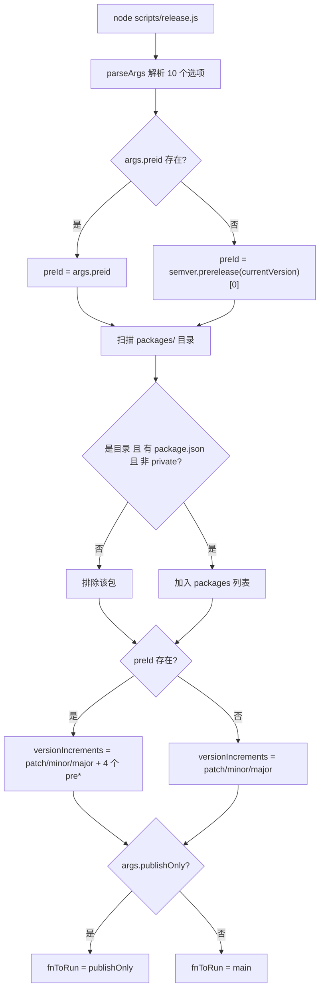
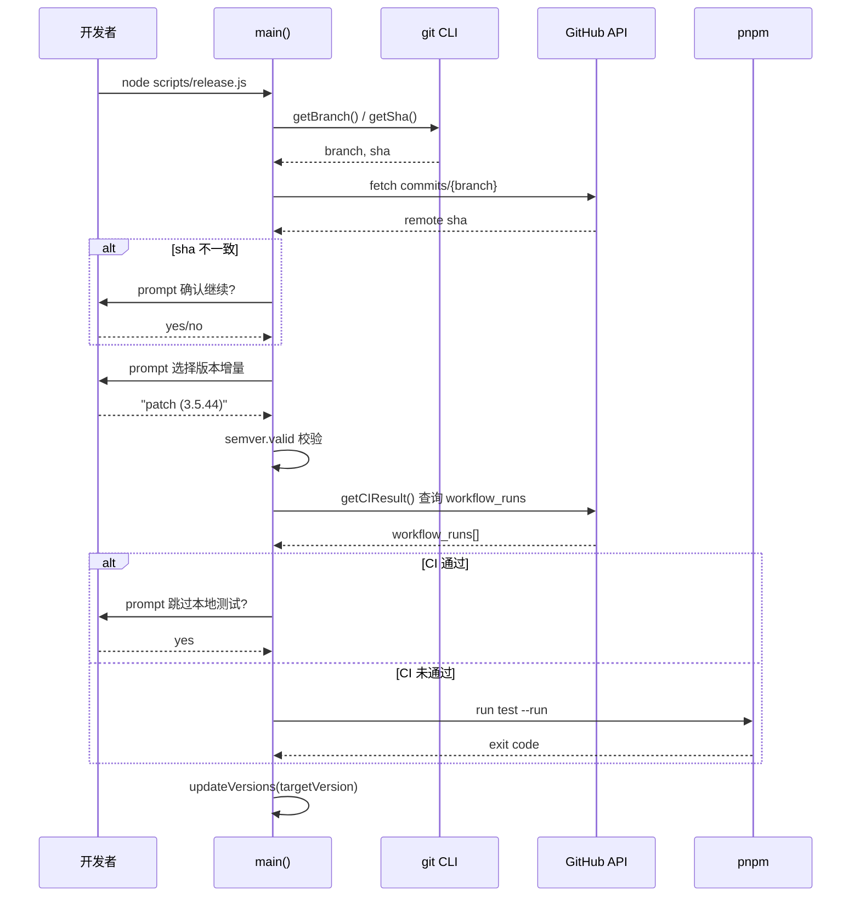
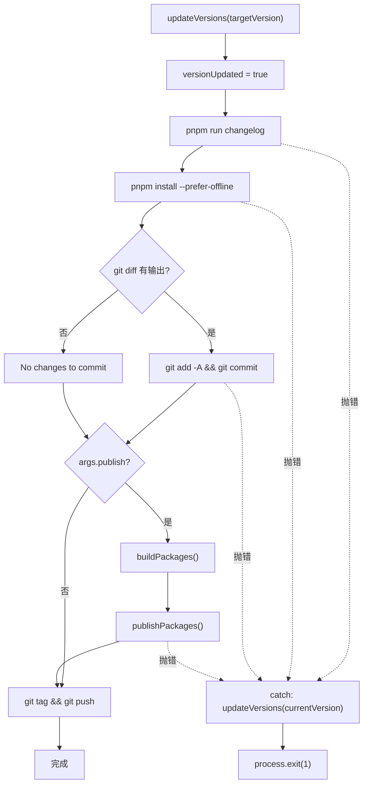

# 제 9 장: 릴리스 자동화: release.js의 상태 머신과 대화형 편성

이전 장에서 우리는 template-explorer를 통해 컴파일러 동작을 역추적하고, 도구로 내부 메커니즘을 관찰하는 방법론을 익혔습니다. 이제 시선을 컴파일 타임에서 릴리스 타임으로 돌립니다 — 이것은 모든 오픈 소스 프로젝트에서 가장 위험한 순간입니다: 버전 번호, 빌드 산출물, Git 히스토리, npm registry라는 네 가지 되돌릴 수 없는 외부 시스템을 동시에 건드리기 때문입니다. 잘못된 npm publish는 취소할 수 없고, 잘못된 태그 푸시는 모든 다운스트림 사용자의 의존성 해석을 오염시킵니다. Vue core는 537행의 scripts/release.js로 이러한 위험을 길들입니다 — 이것은 순수한 자동화 스크립트도, 순수한 수동 체크리스트도 아니며, 대화형 상태 머신입니다: 핵심 지점에서는 멈춰서 사람에게 묻고, 예측 가능한 지점에서는 완전 자동으로 실행하며, 어느 단계에서든 실패하면 버전 번호를 시작점으로 롤백합니다. 이 장에서는 이 편성기의 세 가지 핵심 메커니즘을 분석합니다: 인자 파싱과 상태 초기화, 대화형 버전 결정과 CI 게이트, 그리고 릴리스 순서와 실패 롤백.

# 인자 파싱과 전역 상태 초기화

## 직관적 모델

`release.js`을 구식 세탁기의 제어판이라고 상상해 보세요: 다이얼(`parseArgs`플래그와 전역 상태의 메모리 레이아웃

## 标志位与全局状态的内存布局

> **[Design Inference & Architectural Trade-offs]**
> 스크립트가 시작된 후 가장 먼저 하는 일은 명령줄 인자를 구조화된 객체로 파싱하는 것입니다. 여기서는 Node 내장`parseArgs`을 사용했으며,`yargs`이나`commander`가 아닙니다 — 이는 서드파티 의존성을 제거하기 위한 것으로, 배포 스크립트 자체는 어떤 환경에서도 실행될 수 있어야 하기 때문입니다. 심지어`node_modules`이 절반만 설치된 경우에도 말입니다.

[FACT:scripts/release.js:27-62]은 10개의 옵션을 정의하며, 네 가지 범주로 나눌 수 있습니다:

- **버전 시맨틱 범주**：`preid`(프리릴리스 식별자, 예:`alpha`/`beta`/`rc`）、`tag`（npm dist-tag）
- **건너뛰기 범주**：`skipBuild`、`skipTests`、`skipGit`、`skipPrompts`— 이 네 개의 불리언 스위치가 「자동화 정도」를 조절하는 노브를 구성합니다
- **실행 모드 범주**：`dry`(드라이 런),`publish`(로컬에서 직접 배포할지 여부),`publishOnly`(버전 업데이트 없이 배포만)
- **대상 범주**：`registry`(사용자 정의 registry 주소)

주의:`publish`의 기본값은`false` [FACT:scripts/release.js:51-54]이며, 다른 불리언 항목에는 기본값이 없습니다(즉`undefined`). 이 비대칭은 의도적입니다:`publish`의 시맨틱은 「로컬에서 npm publish를 실행할지 여부」이며, 기본적으로 배포하지 않고 배포 동작을 GitHub Actions에 위임합니다; 반면`skipXxx`의 기본`undefined`은 「지정되지 않음」을 의미하며, 이후 로직에서 「사용자가 명시적으로`--skipTests`를 전달했는지」와 「사용자가 전달하지 않았는지」를 구분합니다.

파싱이 완료되면 스크립트는 인자를 모듈 수준 변수 집합에 펼쳐 놓습니다[FACT:scripts/release.js:64-66]：

```js
const preId = args.preid || semver.prerelease(currentVersion)?.[0]
const isDryRun = args.dry
let skipTests = args.skipTests
const skipBuild = args.skipBuild
const skipPrompts = args.skipPrompts
const skipGit = args.skipGit
```

여기에는 음미할 만한 두 가지 설계가 있습니다. 첫째,`preId`의 값 우선순위는 「명령줄 명시적 지정 > 현재 버전 번호에서 추론」입니다[FACT:scripts/release.js:64-66]. 만약 현재`package.json`의 버전이`3.5.0-beta.1`이라면,`semver.prerelease`은`['beta', 1]`을 반환하고,`[0]`를 취하면`'beta'`을 얻습니다. 이는 beta 브랜치에서 연속으로 릴리스할 때 매번`--preid beta`을 입력할 필요가 없다는 것을 의미합니다. 둘째,`skipTests`은`let`로 선언하고 나머지는`const` [FACT:scripts/release.js:64-66]을 사용하는데, 이는`runTestsIfNeeded`에서 CI 결과에 의해 동적으로 재작성되기 때문입니다 — 이것은 「지연 결정」의 상태 비트입니다.

바로 이어서 패키지 발견 로직[FACT:scripts/release.js:68-83]입니다:`packages/`디렉터리를 읽고, 디렉터리가 아닌 항목,`package.json`이 없는 항목, 그리고`private: true`인 패키지를 필터링합니다. 여기서`packages/`이 아닌`packages-private/`을 읽는다는 점에 주의하세요 — 후자는 내부 디버그 패키지로, 절대 배포되지 않습니다.

## 배포 순서 정렬 알고리즘

[FACT:scripts/release.js:85-85]은 단순해 보이지만 매우 중요한 함수를 정의합니다:

```js
const sortPackagesForPublishing = (packageNames) => [
  ...packageNames.filter(p => p !== 'vue'),
  ...packageNames.filter(p => p === 'vue'),
]
```

이것은`vue`이 진입점 패키지를 마지막으로 정렬합니다. 주석[FACT:scripts/release.js:85-85]이 그 이유를 설명합니다: 만약`vue`을 먼저 배포하면, 사용자가`@vue/runtime-core`등의 내부 패키지가 아직 게시되지 않은 상태에서 새 버전의`vue`을 설치할 수 있게 되고, npm은 일치하는 내부 의존성을 찾지 못해 오류를 발생시킵니다. 이것은 npm 생태계에서의 「배포 원자성」에 대한 타협안입니다 — npm에는 패키지 간 트랜잭션이 없으므로, 순서에 의존해 원자성에 근접할 수밖에 없습니다.

## 버전 증분 후보 집합의 동적 구성

[FACT:scripts/release.js:111-116]은 대화형 메뉴의 후보 항목을 구성합니다:

```js
const versionIncrements = [
  'patch', 'minor', 'major',
  ...(preId ? ['prepatch', 'preminor', 'premajor', 'prerelease'] : []),
]
```

이것은 조건부 전개입니다: 오직`preId`이 존재할 때(즉 현재 프리릴리스 채널에 있거나, 사용자가 명시적으로`--preid`을 지정했을 때)만 프리릴리스 관련 증분 유형을 메뉴에 추가합니다. 만약 현재가 안정 버전`3.5.43`이고`preid`이 지정되지 않았다면, 메뉴에는`patch/minor/major`세 항목만 있습니다 — 사용자가 실수로 안정 버전을`3.5.44-0`같은 어중간한 프리릴리스 버전으로 만드는 것을 방지합니다.

`inc`함수[FACT:scripts/release.js:120-120]은`semver.inc`을 캡슐화하고,`preId`을 세 번째 인자로 전달합니다. 여기에는 타입 방어가 있습니다:`typeof preId === 'string' ? preId : undefined`— 왜냐하면`preId`은`string | undefined`일 수 있고,`semver.inc`은`string | undefined`을 기대하기 때문입니다. 이 삼항 표현식은 TS의 타입 내로잉을 충족시키기 위한 것입니다.

## 실행 원시 연산: run과 dryRun의 이중 트랙

[FACT:scripts/release.js:122-123]은 이 장에서 가장 정교한 설계 중 하나입니다:

```js
const run = async (bin, args, opts = {}) =>
  exec(bin, args, { stdio: 'inherit', ...opts })
const dryRun = async (bin, args, opts = {}) =>
  console.log(pico.blue(`[dryrun] ${bin} ${args.join(' ')}`), opts)
const runIfNotDry = isDryRun ? dryRun : run
```

`run`은 하위 프로세스의 stdio를`inherit`로 설정하여 빌드/테스트 출력이 터미널로 직접 전달되게 합니다 — 이는 장시간 실행되는 빌드에 매우 중요하며, 사용자가 실시간 진행 상황을 볼 수 있습니다.`dryRun`은 명령을 실행하지 않고 출력만 합니다.`runIfNotDry`은 「전략 선택」입니다: 모듈 로드 시점에 함수 포인터를`dryRun`또는`run`에 바인딩하면, 이후 모든 호출 지점에서 더 이상`isDryRun`。

> **[Design Inference & Architectural Trade-offs]**
> 을 판단할 필요가 없습니다. 이러한 「초기화 시 전략 결정」 패턴은 「각 호출 지점에서 판단」하는 것보다 오류가 발생할 가능성이 적습니다: 만약 어떤 호출 지점에서`isDryRun`판단을 잊으면, 드라이 런 모드에서 실제로 부작용이 실행됩니다. 반면`runIfNotDry`은 판단을 한 곳에 집중시켜 이러한 누락 가능성을 제거합니다.



---

# 대화형 버전 결정과 CI 게이트

## 직관적 모델

이 단계는 공항 보안 검색과 같습니다: 먼저 탑승권을 확인하고(로컬 commit이 원격과 동기화되었는지), 다음으로 어디로 가는지 확인하고(버전 번호), 마지막으로 보안 검색을 통과했는지 확인합니다(CI 통과 여부). 어느 하나라도 통과하지 못하면 전체 프로세스가 중단됩니다. 만약 이 게이트가 없다면, 푸시되지 않은 로컬 commit이 태그가 붙고 배포될 수 있어, npm의 버전에 대응하는 소스 코드가 GitHub에 존재하지 않게 됩니다 — 이것은 가장 해결하기 어려운 배포 사고입니다.

## 동기화 검사와 버전 선택

`main`함수가 가장 먼저 하는 일은`isInSyncWithRemote()` [FACT:scripts/release.js:141-141]입니다. 이 함수[FACT:scripts/release.js:337-363]의 로직은: 현재 브랜치 이름을 가져오고, GitHub API를 요청해 해당 브랜치의 최신 commit SHA를 가져와 로컬`git rev-parse HEAD`과 비교합니다. 만약 일치하지 않으면, 빨간색 경고 확인 대화상자[FACT:scripts/release.js:348-355]를 띄워 사용자가 계속할지 결정하게 합니다. 만약 API 요청이 실패하면(네트워크 문제, 토큰 없음),`false`을 반환하고[FACT:scripts/release.js:365-367]。

> **[Design Inference & Architectural Trade-offs]**
> 을 종료합니다. 여기의 설계 철학은 「실패 시 중단」입니다: 네트워크 이상 시에는 상태가 불확실한 상황에서 계속 진행하기보다 배포를 허용하지 않는 편이 낫습니다. 배포는 되돌릴 수 없지만, 스크립트를 다시 실행하는 비용은 매우 낮기 때문입니다.

버전 번호 결정은 두 가지 경로로 나뉩니다. 만약 사용자가 명령줄에서 위치 인자를 전달했다면(예:`node scripts/release.js 3.6.0`），`targetVersion`는 해당 값을 직접 취합니다[FACT:scripts/release.js:141-141]. 그렇지 않으면 대화형 메뉴[FACT:scripts/release.js:152-176]로 들어갑니다: 먼저 사용자가 증분 유형을 선택하게 하고, 만약`custom`을 선택하면 입력 상자를 하나 더 띄워 사용자가 버전 번호를 직접 입력하게 합니다.

주의:[FACT:scripts/release.js:174]이 줄:

```js
targetVersion = release.match(/\((.*)\)/)?.[1] ?? ''
```

메뉴 항목의 형식은`patch (3.5.44)`이며, 이 정규식은 괄호 안에서 실제 버전 번호를 추출합니다. 만약 사용자가`custom`을 선택하면, 다른 분기[FACT:scripts/release.js:164-172]。

로 갑니다. 그 후 「2차 파싱」 로직[FACT:scripts/release.js:178-182]이 있습니다: 만약`targetVersion`이 정확히`patch`/`minor`이런 증분 키워드(사용자가 직접 전달할 수 있는`node release.js minor`)는`inc`을 호출하여 구체적인 버전 번호로 변환합니다. 마지막으로`semver.valid`로[FACT:scripts/release.js:184-186]을 검증하고, 잘못된 버전 번호는 즉시 오류를 발생시킵니다.

## CI 게이트: runTestsIfNeeded의 삼상태 로직

이것은 전체 장에서 가장 복잡한 제어 흐름입니다.[FACT:scripts/release.js:281-317]의`runTestsIfNeeded`은 실제로 삼상태 의사결정 기계입니다:

**상태 1: 사용자가 명시적으로`--skipTests`**。`skipTests`을 전달했고 초기값이`true`이면, 전체 함수 본문을 건너뛰고 "Tests skipped."를 출력합니다.[FACT:scripts/release.js:314-316]。

**상태 2: 건너뛰지 않았고 CI가 통과됨**. 스크립트가`getCIResult()` [FACT:scripts/release.js:319-335]을 호출하면, GitHub Actions API에 요청하여`ci`이라는 이름이고`conclusion === 'success'`인 workflow run이 존재하는지 확인합니다.[FACT:scripts/release.js:319-335]. 통과하면 사용자에게 "CI가 통과되었습니다. 로컬 테스트를 건너뛰시겠습니까?"라고 묻습니다.[FACT:scripts/release.js:288-295]. 사용자가`--skipPrompts`을 켰다면 로컬 테스트를 자동으로 건너뜁니다.[FACT:scripts/release.js:296-298]。

**상태 3: 건너뛰지 않았고 CI가 통과되지 않음**.`--skipPrompts`이 켜져 있으면 직접 오류를 발생시킵니다.[FACT:scripts/release.js:299-304]：

```js
throw new Error(
  'CI for the latest commit has not passed yet. ' +
    'Only run the release workflow after the CI has passed.',
)
```

이 켜져 있지 않으면`--skipPrompts`은`skipTests`을 유지하고`undefined`, 마지막 로컬 테스트 분기로 떨어져[FACT:scripts/release.js:307-313]를 실행합니다.`pnpm run test --run`。

여기에는 미묘한 세부 사항이 있습니다.[FACT:scripts/release.js:285]：

```js
skipTests ||= isCIPassed
```

`||=`은 논리 OR 할당입니다: 오직`skipTests`이 거짓 값(`undefined`또는`false`)일 때만`isCIPassed`으로 할당됩니다. 이는 사용자가 명시적으로`--skipTests`（`true`을 전달한 경우 이 줄이 그것을 변경하지 않으며, 사용자가 전달하지 않은 경우(`undefined`) CI 결과로 설정한다는 것을 의미합니다. 그러나 바로 뒤에[FACT:scripts/release.js:287-298]이 CI 통과 시 다시 할당하므로 —`||=`이 줄의 실제 역할은 단지 "CI가 통과되지 않으면`skipTests`을`false`으로 설정"하여 이후의`if (!skipTests)`분기가 로컬 테스트를 실행하도록 하는 것입니다.

> **[Design Inference & Architectural Trade-offs]**
> 이 로직은 한 바퀴 돌았지만, 본질적으로 표현하려는 것은 "CI 통과 → 로컬 테스트를 건너뛸 수 있음(단, 사용자에게 물어봄); CI 미통과 → 반드시 로컬 테스트를 실행해야 함(사용자가 명시적으로 건너뛰기를 요청하지 않는 한)"입니다.`||=`과 이후 덮어쓰기 방식은 간결하지만 가독성이 높지 않으며, 전형적인 "상태 비트가 여러 곳에서 수정되는" 코드 스멜입니다.



## 버전 번호 쓰기: updateVersions의 순회

[FACT:scripts/release.js:377-384]의`updateVersions`은 두 가지를 합니다: 루트`package.json`을 업데이트하고, 모든 하위 패키지를 순회하며`updatePackage`。`updatePackage` [FACT:scripts/release.js:391-398]을 호출하여 JSON을 읽고,`name`과`version`을 수정하고,`JSON.stringify(pkg, null, 2) + '\n'`으로 다시 씁니다 — 끝의`\n`에 주목하세요. 이는 파일이 줄바꿈으로 끝나도록 유지하여 git diff에서 "No newline at end of file"이 표시되는 것을 방지하기 위함입니다.

`getNewPackageName`매개변수의 기본값은`keepThePackageName` [FACT:scripts/release.js:105]입니다. 즉, 패키지 이름을 변경하지 않습니다. 이 매개변수의 존재는 "사용자 정의 registry에 게시할 때 패키지 이름을 바꾸는" 시나리오를 지원하기 위함입니다 — 현재 호출 지점은 모두 기본값을 전달하지만, 인터페이스는 확장성을 위해预留되어 있습니다.

---

# 게시 순서, 멱등성 및 실패 롤백

## 직관적 모델

이 단계는 도미노와 같습니다:`updateVersions`이 첫 번째 카드(버전 번호 변경)를 넘어뜨리면, 이후의 changelog, lockfile, commit, tag, publish가 차례로 넘어집니다. 중간에 어떤 카드가 걸리면, 이미 넘어진 카드를 다시 세우는 메커니즘이 반드시 있어야 합니다 — 그렇지 않으면 저장소는 "버전 번호는 변경되었지만 게시되지 않은" 반쪽짜리 상태로 남게 됩니다.

## 멱등 게시: isPackagePublished와 오류 폴백

> **[Design Inference & Architectural Trade-offs]**
> `publishPackage` [FACT:scripts/release.js:439-489]은 게시의 핵심입니다. 먼저 dist-tag[FACT:scripts/release.js:442-451]을 결정합니다:`--tag`매개변수를 우선 사용하고, 그렇지 않으면 버전 번호의`alpha`/`beta`/`rc`키워드를 기반으로 추론합니다. 여기서`version.includes('alpha')`이 아닌`semver.prerelease`을 사용한 것에 주목하세요 — 버전 번호가`3.5.0-alpha.1`，`includes`형태일 수 있기 때문입니다. 충분히 간단하고 오판하지 않습니다.

게시 전에 멱등성 검사가 있습니다.[FACT:scripts/release.js:453-458]：

```js
if (!isDryRun && (await isPackagePublished(packageName, version))) {
  console.log(pico.yellow(`Skipping already published: ${pkgVersion}`))
  alreadyPublishedPackages.push(pkgVersion)
  return
}
```

`isPackagePublished` [FACT:scripts/release.js:491-513]이`npm view <pkg>@<version> version`을 실행하여, 성공하면`true`을 반환하고, E404 유형 오류가 발생하면`false`을 반환합니다. 이 검사의 의미는: 게시 프로세스가 네트워크 중단으로 재실행될 수 있으며, 재실행 시 이미 게시된 패키지는 다시 게시되어서는 안 된다는 것입니다(npm은 중복 버전을 거부합니다).

그러나 검사 자체도 실패할 수 있습니다 — 예를 들어`npm view`이 네트워크 타임아웃으로 E404가 아닌 오류를 발생시키는 경우입니다. 이때`isPackagePublished`은 오류를 위로 던져[FACT:scripts/release.js:507-510]전체 게시를 중단시킵니다. 이는 "위험을 감수하느니 중단하는 편이 낫다"의 또 다른 구현입니다.

검사가 통과하더라도,`pnpm publish`자체는 경쟁 상태(다른 CI가 방금 동일 버전을 게시함)로 인해 여전히 실패할 수 있습니다. 그래서`publishPackage`은 catch 블록에서 2차 폴백을 수행합니다.[FACT:scripts/release.js:480-488]：

```js
} catch (e) {
  if (e.message?.match(/previously published/)) {
    console.log(pico.red(`Skipping already published: ${pkgVersion}`))
    alreadyPublishedPackages.push(pkgVersion)
  } else {
    throw e
  }
}
```

이`previously published`과 일치할 때만 오류를 삼키고, 다른 오류는 모두 다시 던집니다. 이는 "정밀한 내결함성"입니다: 알려진, 안전하게 무시할 수 있는 오류에만降级 처리를 합니다.

## 게시 플래그의 동적 조립

[FACT:scripts/release.js:412-432]은 실행 환경에 따라`pnpm publish`의 추가 플래그를 조립합니다:

```js
const additionalPublishFlags = []
if (isDryRun) additionalPublishFlags.push('--dry-run')
if (isDryRun || skipGit || process.env.CI)
  additionalPublishFlags.push('--no-git-checks')
if (process.env.CI && !args.registry)
  additionalPublishFlags.push('--provenance')
```

`--no-git-checks`은 세 가지 경우에 활성화됩니다: dry run, git 건너뛰기, 또는 CI에서. 이유는`pnpm publish`이 기본적으로 작업 영역이 깨끗한지, 현재 브랜치가 게시 브랜치인지 등을 확인하는데, CI에서는 이러한 검사가 오탐을 일으키기 때문입니다.

`--provenance`은 CI이고 사용자 정의 registry가 지정되지 않은 경우에만[FACT:scripts/release.js:425-427]을 활성화합니다. provenance는 npm의 공급망 보안 기능으로, 빌드 산출물의 출처 정보(어떤 commit, 어떤 workflow)를 서명하여 패키지에 첨부합니다. 그러나 사용자 정의 registry(예: 내부 사설 registry)는 일반적으로 provenance를 지원하지 않으므로`!args.registry`조건을 추가했습니다.

## 실패 롤백: versionUpdated 플래그

으로 돌아가서`main`의 끝부분[FACT:scripts/release.js:528-537]：

```js
fnToRun().catch(err => {
  if (versionUpdated) {
    updateVersions(currentVersion)
  }
  console.error(err)
  process.exit(1)
})
```

`versionUpdated`은 모듈 수준 불리언으로, 초기값이`false` [FACT:scripts/release.js:24-27]이며,`updateVersions`호출이 성공한 직후`true` [FACT:scripts/release.js:208]으로 설정됩니다. 이후 어떤 단계(changelog 생성, lockfile 업데이트, git commit, publish)에서 오류가 발생하면, catch 블록이 이 플래그를 확인하여`true`이면 버전 번호를`currentVersion`。

> **[Design Inference & Architectural Trade-offs]**
> 이 롤백은 "최선의 노력" 방식입니다: 오직`package.json`의 버전 번호만 롤백하며, changelog 파일, lockfile, 이미 실행된 git commit은 롤백하지 않습니다. 만약 오류가 git commit 이후에 발생하면, 저장소에는 "버전 번호는 롤백되었지만 commit은 이미 존재하는" 중간 상태가 남게 됩니다. 이는 설계상의 트레이드오프입니다——완전한 롤백에는`git reset`이 필요하지만, 그렇게 하면 사용자가 이미 수행했을 수 있는 다른 변경사항을 훼손하게 됩니다. 그래서 스크립트는 가장 핵심적인 버전 번호만 롤백하고 나머지는 사용자가 수동으로 처리하도록 선택합니다.

주의`publishOnly`경로[FACT:scripts/release.js:519-526]는`versionUpdated`을 설정하지 않습니다. 그 의미가 "배포만 하고 버전은 변경하지 않음"이기 때문입니다——실패하더라도 롤백할 필요가 없습니다. 하지만`targetVersion`이 존재할 때`updateVersions` [FACT:scripts/release.js:519-526]을 호출하며, 이때 실패하면 버전 번호가 롤백되지 않습니다. 이는 잠재적인 경계 문제이며, 장 말미의 사고 문제를 참고하세요.



## 배포 순서와 vue 패키지의 특수 처리

`publishPackages` [FACT:scripts/release.js:412-432]은`sortPackagesForPublishing(packages)`의 결과를 순회하며, 하나씩`publishPackage`을 호출합니다. 정렬에서`vue`을 마지막에 배치하기[FACT:scripts/release.js:85-85]때문에, 전체 배포 순서는 내부 패키지가 먼저 배포되도록 보장합니다.

`publishPackage`은 내부적으로`cwd: getPkgRoot(pkgName)` [FACT:scripts/release.js:475]을 사용하여 작업 디렉터리를 하위 패키지 디렉터리로 전환하므로,`pnpm publish`은 루트 패키지가 아닌 하위 패키지를 배포합니다. 주석[FACT:scripts/release.js:462-463]은 특히 "npm publish로 변경하지 말 것"을 경고합니다——왜냐하면`pnpm publish`은`workspace:*`의존성 프로토콜을 올바르게 처리하여 실제 버전 번호로 변환하지만,`npm publish`은`workspace:*`을 그대로 유지하여 설치 실패를 초래하기 때문입니다.

---

# 설계 고찰

**왜`parseArgs`대신`yargs`？**을 사용하는가? 배포 스크립트는 "최후의 방어선"이며, 어떤 환경에서도 실행 가능해야 합니다. 서드파티 CLI 라이브러리가 의존성 트리 손상으로 로드에 실패하면 전체 배포 프로세스가 마비됩니다. Node 내장`parseArgs`은 기능이 빈약하지만(서브커맨드 미지원, 자동 help 미지원), 의존성이 없고 위험도 없습니다.

**왜`publish`의 기본값을`false`？**로 설정하는가? Vue의 정식 배포는 GitHub Actions를 통해 이루어지며([FACT:scripts/release.js:256-263]의 안내 메시지 참조), 로컬 스크립트는 버전 번호 변경, changelog 생성, tag 생성, 푸시만 담당합니다. 실제`npm publish`는 CI에서 실행되어 CI의 provenance 서명과 통제된 환경을 활용할 수 있습니다.`--publish`플래그는 유지관리자가 긴급 상황에서 로컬 배포를 할 수 있는 탈출구입니다.

**왜 롤백은 버전 번호만 롤백하는가?**완전한 롤백은 "어떤 변경이 스크립트에 의한 것이고 어떤 것이 사용자에 의한 것인지"를 이해해야 하는데, 이는 git 레벨에서 구분할 수 없기 때문입니다. 스크립트는 자신이 가장 확실하게 변경했다고 판단하는 것——`package.json`의 버전 번호——만 롤백하고 나머지는 사용자의 판단에 맡깁니다.

---

# 이 장의 요약

`scripts/release.js`은 537줄의 코드로 "대화형 상태 머신"을 구현했으며, 그 핵심 설계는 세 가지로 요약할 수 있습니다:

1. **파라미터가 곧 정책**: 10개의 플래그가 모듈 로드 시 파싱되어 전역 변수로 평탄화되고,`runIfNotDry`이 초기화 시 정책을 바인딩하여 호출 지점에서 판단 누락을 방지합니다.

2. **게이트 사전 배치**: 동기화 검사, 버전 검증, CI 게이트가 모든 부작용 발생 전에 완료되어 "전부 하거나 전혀 하지 않거나"를 보장합니다.

3. **정밀한 내결함성**：`isPackagePublished`사전 검사 +`previously published`오류 폴백이 이중 멱등성 보호를 구성하며,`versionUpdated`플래그가 최소한의 롤백을 구현합니다.

이 메커니즘은 이전 장의 Template Explorer와 흥미로운 대조를 이룹니다: Template Explorer는 "관찰"——컴파일러 내부 상태를 시각화하고, release.js는 "실행"——배포 프로세스의 각 단계 상태를 명시화합니다. 둘 다 동일한 엔지니어링 철학을 보여줍니다:**암시적 상태를 명시적 상태로, 통제 불가능한 부작용을 통제 가능한 단계로**。

# 이 장의 사고와 자가 점검

Q1: 만약[FACT:scripts/release.js:285]의`skipTests ||= isCIPassed`을`skipTests = isCIPassed`으로 변경하면, 사용자가 명시적으로`--skipTests`을 전달했고 CI가 통과하지 못한 경우 어떤 일이 발생하는가? 왜인가?

**참고 해석**: 원래 로직에서 사용자가`--skipTests`을 전달하면`skipTests`은 초기에`true` [FACT:scripts/release.js:64-66]，`||=`이며 이를 변경하지 않으므로,`runTestsIfNeeded`은[FACT:scripts/release.js:282]의`if (!skipTests)`에서 거짓으로 판정되어 바로[FACT:scripts/release.js:314-316]으로 이동하여 "Tests skipped."를 출력합니다. 만약`skipTests = isCIPassed`으로 변경하면,`skipTests`이 강제로`false`로 설정되고(CI 미통과), 이후[FACT:scripts/release.js:287]의`if (isCIPassed)`이 거짓이 되어[FACT:scripts/release.js:299]의`else if (skipPrompts)`에 도달합니다——만약`--skipPrompts`이 활성화되지 않았다면,`skipTests`은`false`을 유지하고, 최종적으로[FACT:scripts/release.js:307-313]에서 로컬 테스트를 실행합니다. 이는 사용자의 "명시적 테스트 건너뛰기" 의도를 위반하며, CI 환경(`--skipPrompts`)에서는 직접 오류[FACT:scripts/release.js:300-303]를 발생시켜 배포가 중단됩니다.`||=`의 존재는 바로 사용자의 명시적 선택을 존중하기 위한 것입니다.

Q2: `publishOnly`경로[FACT:scripts/release.js:519-526]는`targetVersion`이 존재할 때`updateVersions`을 호출하지만,`versionUpdated`을 설정하지 않습니다. 만약 이때`buildPackages`또는`publishPackages`이 오류를 발생시키면 어떤 일이 발생하는가? 이 설계는 합리적인가?

**참고 해석**：`publishOnly`이`updateVersions(targetVersion)` [FACT:scripts/release.js:519-526]을 호출하여 모든`package.json`의 버전 번호를 변경했지만,`versionUpdated = true`을 설정하지 않았습니다. 이후`buildPackages` [FACT:scripts/release.js:519-526]또는`publishPackages` [FACT:scripts/release.js:519-526]이 오류를 발생시키면,`fnToRun().catch` [FACT:scripts/release.js:528-537]이`versionUpdated`을`false`로 확인하여 버전 번호를 롤백하지 않습니다. 결과적으로 저장소는 "버전 번호는 변경되었지만 배포는 실패한" 상태에 머물게 됩니다. 이 설계는`publishOnly`의 원래 의미(배포만, 버전 변경 없음)에서는 합리적입니다——왜냐하면`targetVersion`은 보통 전달되지 않아`updateVersions`이 실행되지 않기 때문입니다. 하지만 사용자가`targetVersion`을 전달하면 이 경로에 롤백 취약점이 존재합니다. 수정 방법은[FACT:scripts/release.js:519-526]후에`versionUpdated = true`을 추가하거나,`publishOnly`이`main`의 롤백 로직을 재사용하도록 하는 것입니다.

Q3: `isPackagePublished` [FACT:scripts/release.js:491-513]은`npm view`을 사용하여 패키지가 이미 배포되었는지 확인합니다. 만약 네트워크 타임아웃으로`npm view`이 E404가 아닌 오류를 발생시키면 어떤 일이 발생하는가? 이 동작은 CI 재실행 시나리오에서 안전한가?

**참고 해석**：`isPackagePublished`은 catch 블록에서[FACT:scripts/release.js:507-510]을 호출하여`isPackageNotFoundError`오류 유형을 판단합니다. 이 함수[FACT:scripts/release.js:515-515]는`/E404|No match found|No matching version|notarget/i`만 매칭합니다. 네트워크 타임아웃 오류의 message에는 이러한 키워드가 포함되지 않으므로,`isPackageNotFoundError`은`false`，`isPackagePublished`을 반환하고 오류를 다시 발생시킵니다[FACT:scripts/release.js:507-510]. 이 오류는 상위로 전파되어`publishPackage` [FACT:scripts/release.js:453]전체 배포가 중단된다. CI 재실행 시나리오에서 이는 "분명 패키지는 배포되었는데 네트워크 흔들림 때문에 중단"되는 상황을 초래한다. 하지만 이는 안전한 실패 방향이다. 중단이 "미배포"로 오판하여 중복 배포하는 것보다 낫다. 중복 배포는 npm의`previously published`오류를 발생시키고[FACT:scripts/release.js:491-492]에 의해 처리되지만, 네트워크 왕복 한 번을 낭비하게 된다. 따라서 "네트워크 오류 시 중단"은 보수적이지만 올바른 선택이다.

---

다음 장에서는`.github/workflows/`로 들어가서, release.js가 tag를 푸시한 후 GitHub Actions가 어떻게 후속 빌드와 배포를 이어받는지, 그리고 CI 게이트의 완전한 구현을 살펴본다.

여기까지 release.js가 상태 머신과 대화형 오케스트레이션으로 되돌릴 수 없는 배포 리스크를 어떻게 최소화하는지 살펴보았다. 하지만 배포 스크립트 자체는 실행자일 뿐이고, 언제 트리거할지, 어떤 조건으로 통과시킬지를 실제로 결정하는 것은 더 상위 계층의 자동화 게이트키퍼다. 다음 장에서는 .github/workflows 디렉터리 아래의 CI/CD 체계를 분석한다. ci.yml이 PR 단계에서 lint/typecheck/test 삼중 게이트를 어떻게 수행하는지, release.yml이 tag 푸시 시 배포를 어떻게 트리거하는지, size-report.yml과 size-data.yml이 패키지 크기 회귀를 어떻게 추적하는지, autofix.yml이 포맷 문제를 어떻게 자동 수정하는지. Vue가 GitHub Actions로 엔지니어링 규범을 우회할 수 없는 파이프라인으로 어떻게 고정하는지 이해하게 될 것이다.
