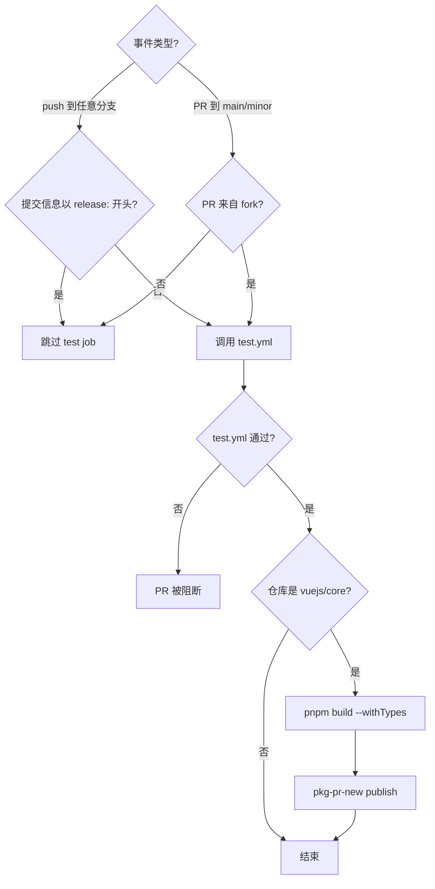
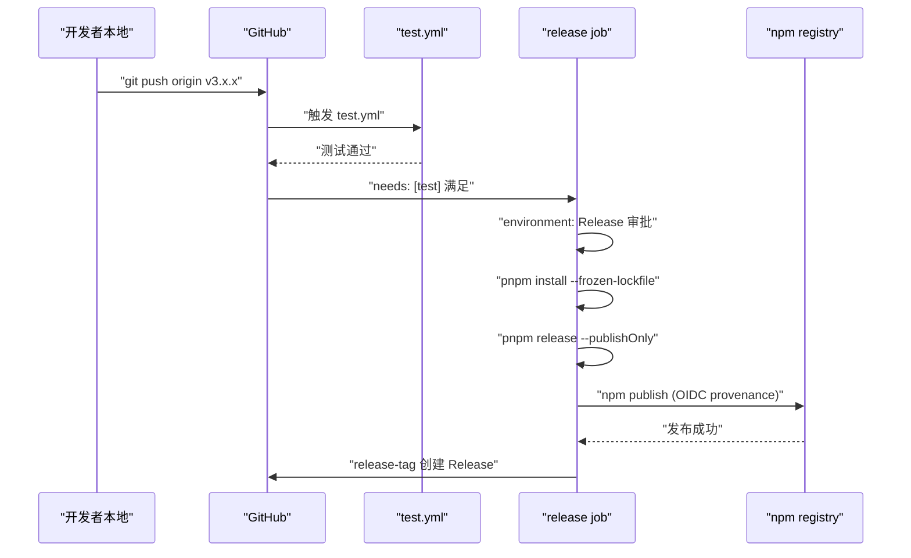
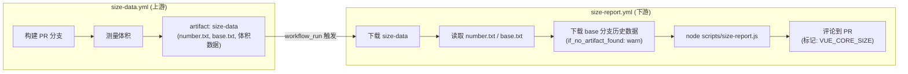

# 제 10 장: CI/CD 워크플로: PR에서 Release까지의 자동화 게이트키퍼

이전 장에서 우리는`scripts/release.js`가 대화형 상태 머신으로 한 번의 릴리스의 각 단계를 어떻게 연결하는지 살펴보았다. 하지만 그 스크립트에는 전제가 하나 있다. 누군가 또는 어떤 시스템이 반드시 능동적으로 호출해야 한다는 것이다. Vue core 저장소에서 이 능동적 호출자는 유지관리자의 로컬 터미널이 아니라 GitHub Actions다. release.js는 실행자이고, workflows는 결정자다. 어떤 이벤트가 어떤 작업을 트리거하는지, 어떤 조건에서 통과시키고 어떤 조건에서 차단하는지를 결정한다. 이 장은`.github/workflows/`디렉터리 아래의 네 파일에 집중한다.`ci.yml`(PR 게이트와 지속적 사전 배포),`release.yml`(tag 트리거 정식 배포),`size-report.yml`(크기 회귀 보고),`autofix.yml`(포맷 자동 수정). 이들의 핵심을 이해하는 것은 YAML 문법을 외우는 것이 아니라, Vue 팀이 엔지니어링 규범을 우회할 수 없는 파이프라인 제약으로 어떻게 번역하는지를 꿰뚫어 보는 것이다.

# 1. ci.yml: 삼중 게이트와 지속적 사전 배포

## 직관적 모델

`ci.yml`를 공항 보안 검색대라고 상상해 보자. 모든 PR은 이 관문을 통과해야 한다. lint는 수하물에 금지품이 있는지 검사하고, typecheck는 신분증이 진짜 유효한지 확인하며, test는 위험물을 소지하지 않았는지 검증한다. 하지만 보안 검색대는 하나가 아니다. Vue는 여기에 "지속적 사전 배포" 통로도 하나 걸어두어, 각 PR의 빌드 산출물을 pkg-pr-new에 직접 배포함으로써 기여자가 실제 npm 설치 시나리오에서 자신의 변경을 검증할 수 있게 한다.

이 관문이 없다면, 어떤 병합이든 포맷 오류, 타입 허점, 동작 회귀를 main 브랜치로 가져올 수 있으며, main 브랜치는 이후 모든 release의 원천이다.

## 트리거 조건과 동시성 제어

`ci.yml`의 트리거 설정은 한 줄씩 분해할 가치가 있다.

[FACT:.github/workflows/ci.yml:2-11]

```yaml
on:
  push:
    branches:
      - '**'
    tags:
      - '!**'
  pull_request:
    branches:
      - main
      - minor
```

여기에는 두 가지 핵심 설계가 있다. 첫째,`push`이벤트는 모든 브랜치(`'**'`)를 감시하지만,`tags: ['!**']`로 모든 tag 푸시를 명시적으로 제외한다. 왜 tag를 제외하는가? tag 푸시는`release.yml`가 단독으로 처리하기 때문이다. 만약`ci.yml`도 tag에 반응하면 배포 흐름과 CI 흐름이 중복 트리거되어 runner 자원을 낭비하고 심지어 경쟁 상태를 일으킬 수 있다. 둘째,`pull_request`는`main`과`minor`두 브랜치만 감시한다. 이것이 Vue의 이중 브랜치 전략이다.`main`는 안정 버전을 담당하고,`minor`는 사전 배포 버전을 담당한다.

[FACT:.github/workflows/ci.yml:22-22]

```yaml
concurrency:
  group: ${{ github.workflow }}-${{ github.event.pull_request.number || github.ref }}
  cancel-in-progress: ${{ github.event_name == 'pull_request' }}
```

동시성 제어는 여기서 가장 정교한 부분이다.`group`의 표현식은`github.event.pull_request.number || github.ref`를 fallback으로 사용한다. PR 이벤트는 PR 번호를 그룹 키로 사용하고, push 이벤트는 ref(브랜치 이름)를 그룹 키로 사용한다. 이는 동일한 PR의 여러 푸시가 같은 동시성 그룹에 속한다는 뜻이다. 그리고`cancel-in-progress`는 PR 이벤트일 때만`true`로 설정된다. 세 번의 커밋을 연속 푸시하면 앞의 두 CI는 자동 취소되고 최신 것만 유지된다.

> **[Design Inference & Architectural Trade-offs]**
> 이 설계의 동기는 명확하다. PR 단계에서 개발자는 자주 푸시하고, 오래된 커밋의 CI 결과는 이미 무의미하므로 취소하면 runner 시간을 크게 절약할 수 있다. 하지만 main 브랜치로의 push는 취소할 수 없다. main에서의 각 push가 배포 전 마지막 검증일 수 있기 때문에, 취소하면 검증 공백이 생긴다.

## 삼중 게이트의 입구: test job의 조건 판단

[FACT:.github/workflows/ci.yml:22-22]

```yaml
jobs:
  test:
    if: ${{ ! startsWith(github.event.head_commit.message, 'release:') && (github.event_name == 'push' || github.event.pull_request.head.repo.full_name != github.repository) }}
    uses: ./.github/workflows/test.yml
```

이`if`조건은 두 개의 논리곱(`&&`) 분기를 포함하며, 각각을 풀어볼 가치가 있다.

첫 번째 조건`! startsWith(github.event.head_commit.message, 'release:')`: 커밋 메시지가`release:`开头，跳过测试。这正是上一章 release.js 推送的提交信息格式——release.js 在本地已经跑过完整测试，CI 不需要重复验证。这是一个「信任上游」的优化。

> **[Design Inference & Architectural Trade-offs]**
> 두 번째 조건`(github.event_name == 'push' || github.event.pull_request.head.repo.full_name != github.repository)`: push 이벤트는 항상 테스트를 실행하고, PR 이벤트는 PR이 fork에서 온 경우(`head.repo.full_name != github.repository`)를 요구한다. 왜 fork의 PR만 실행할까? 같은 저장소 브랜치의 PR은 보통 핵심 팀 멤버가 생성하며, 그들의 브랜치 push는 이미 push 이벤트의 CI를 트리거했기 때문이다. 반면 fork의 PR은 push 이벤트를 트리거하지 않으므로(fork의 push는 업스트림 저장소에 알리지 않음), 반드시 PR 이벤트에서 보충 실행해야 한다.

주의`uses: ./.github/workflows/test.yml`——이것은 reusable workflow 호출이다.`test.yml`는 독립적인 workflow 파일로,`ci.yml`와`release.yml`에 의해 공유된다. 이러한 재사용은 여러 workflow에서 lint/typecheck/test 단계를 중복 정의하는 것을 피한다.

## 지속적 프리릴리스: pkg-pr-new의 역할

[FACT:.github/workflows/ci.yml:25-51]

```yaml
continuous-release:
  if: github.repository == 'vuejs/core'
  runs-on: ubuntu-latest
  steps:
    - name: Checkout
      uses: actions/checkout@3d3c42e5aac5ba805825da76410c181273ba90b1 # v7.0.1
      with:
        persist-credentials: false
    # ... 安装 pnpm、Node.js、依赖 ...
    - name: Build
      run: pnpm build --withTypes
    - name: Release
      run: pnpx pkg-pr-new publish --compact --pnpm './packages/*' --packageManager=pnpm,npm,yarn
```

`continuous-release`job은`vuejs/core`메인 저장소에서만 실행되며(`if: github.repository == 'vuejs/core'`), fork에서는 실행되지 않는다. 이는 세 가지를 한다: 빌드(`pnpm build --withTypes`, 타입 선언 포함), 그런 다음`pkg-pr-new`를 사용하여`./packages/*`아래의 모든 패키지를 임시 npm registry에 게시한다.

> **[Design Inference & Architectural Trade-offs]**
> 이 메커니즘의 가치는 기여자가 자신의 프로젝트에서 직접`npm install`이 PR의 빌드 산출물을 설치하여 변경 사항이 실제로 문제를 해결했는지 검증할 수 있다는 것이다. 이는 "CI가 초록불이다"를 보는 것보다 더 설득력이 있는데, 실제 패키지 소비 시나리오를 검증하기 때문이다.

모든 action이 commit SHA(예:`actions/checkout@3d3c42e5...`)를 고정하고,`@v4`와 같은 유동 tag를 사용하지 않는다는 점에 주의하라. 이는 공급망 보안의 강제 요구사항이다——action 저장소가 침해된 후 악성 코드가 자동으로 유입되는 것을 방지한다.

## ci.yml 제어 흐름도



---

# 2. release.yml: tag 푸시 후의 릴리스 오케스트레이션

## 직관적 모델

만약`ci.yml`이 보안 검색대라면,`release.yml`은 발사대다. release.js가 로컬에서 버전 번호 업데이트, 커밋, tag 생성 및 푸시를 완료한 후, tag 푸시 이벤트가`release.yml`의 엔진을 점화한다. 먼저 전체 테스트를 한 번 실행하고(재확인), 그런 다음 보호된`Release`환경에서`pnpm release --publishOnly`를 실행하며, 마지막으로 GitHub Release를 생성한다.

이것이 없다면, release.js가 푸시한 tag는 단지 Git 참조일 뿐이며, npm에 새 버전이 없고 GitHub에 Release 페이지가 없다.

## 트리거 조건: tag만 인식

[FACT:.github/workflows/release.yml:3-6]

```yaml
on:
  push:
    tags:
      - 'v*' # Push events to matching v*, i.e. v1.0, v20.15.10
```

오직`v*`형식의 tag 푸시만 감시한다. 이는`ci.yml`의`tags: ['!**']`과 상호 보완적이다——둘은 엄격히 상호 배타적이며 동시에 트리거되지 않는다.

## 릴리스 job의 가드 조건

[FACT:.github/workflows/release.yml:8-21]

```yaml
jobs:
  test:
    uses: ./.github/workflows/test.yml

  release:
    if: github.repository == 'vuejs/core'
    needs: [test]
    runs-on: ubuntu-latest
    permissions:
      contents: write
      id-token: write
    environment: Release
```

여기에는 세 겹의 가드가 있으며, 각 층은 생략할 수 없다.

첫 번째 층`if: github.repository == 'vuejs/core'`: fork에서의 잘못된 릴리스 트리거를 방지한다. 누군가 저장소를 fork하고`v1.0.0`tag를 푸시하면, 이 조건이 릴리스 프로세스 실행을 차단한다.

두 번째 층`needs: [test]`: release job은 test job에 의존한다. test job은`test.yml`을 호출하며, 테스트가 실패하면 release job은 시작조차 되지 않는다. 이는 "릴리스 전 반드시 테스트 통과"라는 강제 제약이다.

> **[Design Inference & Architectural Trade-offs]**
> 세 번째 층`environment: Release`: 이것은 GitHub Environment로, 배포 보호 규칙(예: 특정 인원의 승인 필요)을 구성할 수 있다. 이는 tag 푸시가 workflow를 트리거하더라도 릴리스 단계가 실행되려면 수동 승인이 필요할 수 있음을 의미한다——이는 되돌릴 수 없는 작업에 대한 마지막 방어선이다.

권한 측면에서,`contents: write`는 GitHub Release 생성에 사용되고,`id-token: write`는 npm의 provenance 인증(OIDC token)에 사용된다. 여기에는`packages: write`이 없다는 점에 주의하라. Vue는 GitHub Packages가 아닌 npm에 게시하기 때문이다.

## 릴리스 단계의 전체 체인

[FACT:.github/workflows/release.yml:37-46]

```yaml
- name: Install deps
  run: pnpm install --frozen-lockfile

- name: Update npm
  run: npm i -g npm@latest

- name: Build and publish
  id: publish
  run: |
    pnpm release --publishOnly
```

> **[Design Inference & Architectural Trade-offs]**
> 세 단계 각각에는 고려 사항이 있다.`--frozen-lockfile`는 CI 환경이 lockfile에 따라 엄격히 설치되도록 보장하여, 의존성 버전 드리프트로 인해 빌드 산출물이 로컬과 불일치하는 것을 방지한다.`npm i -g npm@latest`는 최신 npm CLI를 얻기 위한 것이다——provenance와 OIDC 인증은 비교적 새로운 버전의 npm에 의존하며, 구버전은 이러한 기능을 지원하지 않을 수 있기 때문이다.

`pnpm release --publishOnly`는 이전 장 release.js의 진입점이다.`--publishOnly`플래그는 release.js에게 알린다: 대화형 버전 번호 선택을 건너뛰고, Git 커밋과 tag 생성을 건너뛰며(tag가 이미 존재하므로), 빌드와 npm publish만 실행한다.

## GitHub Release 생성

[FACT:.github/workflows/release.yml:48-57]

```yaml
- name: Create GitHub release
  id: release_tag
  uses: yyx990803/release-tag@8cccf7c5aa332d71d222df46677f70f77a8d2dc0 # v1.0.0
  env:
    GITHUB_TOKEN: ${{ secrets.GITHUB_TOKEN }}
  with:
    tag_name: ${{ github.ref }}
    body: |
      For stable releases, please refer to [CHANGELOG.md](...) for details.
      For pre-releases, please refer to [CHANGELOG.md](...) of the `minor` branch.
```

> **[Design Inference & Architectural Trade-offs]**
> 여기서는 Vue 창시자 에반 유가 직접 유지 관리하는`release-tag` action。`tag_name: ${{ github.ref }}`를 사용하여 트리거 이벤트의 ref(즉`refs/tags/v3.x.x`). Release body에는 구체적인 변경 내용을 쓰지 않고 CHANGELOG.md를 가리킨다 — Vue의 changelog는 conventional-changelog에 의해 자동 생성되므로, Release body를 수동으로 유지하면 changelog와 불일치가 발생하기 때문이다.

## release.yml 시퀀스 다이어그램



---

# 三、size-report.yml과 autofix.yml: 크기 추적과 포맷 자가 치유

## size-report.yml: 워크플로 간 크기 회귀 보고서

`size-report.yml`의 트리거 방식은 매우 특별하다 — push나 PR에 의해 직접 트리거되는 것이 아니라, 다른 워크플로의 완료 이벤트에 의해 트리거된다.

[FACT:.github/workflows/size-report.yml:3-7]

```yaml
on:
  workflow_run:
    workflows: ['size data']
    types:
      - completed
```

`workflow_run`이벤트 리스너 이름은`size data`인 워크플로가 완료될 때이다. 이것은 2단계 설계이다:`size-data.yml`(이 장에서는 소스 코드를 제공하지 않음)은 PR에서 빌드하고 크기를 측정하여 결과를 artifact로 업로드하는 역할을 한다;`size-report.yml`은`size data`이 완료된 후 artifact를 다운로드하고, 보고서를 생성하여 PR에 코멘트를 단다.

[FACT:.github/workflows/size-report.yml:20-23]

```yaml
if: >
  github.repository == 'vuejs/core' &&
  github.event.workflow_run.event == 'pull_request' &&
  github.event.workflow_run.conclusion == 'success'
```

삼중 가드: 메인 저장소, PR 이벤트, 업스트림 워크플로 성공. 만약`size data`이 실패하면 보고서 job은 실행되지 않는다 — 보고할 데이터가 없기 때문이다.

데이터 흐름 과정은 다음과 같다:

[FACT:.github/workflows/size-report.yml:41-46]

```yaml
- name: Download Size Data
  uses: dawidd6/action-download-artifact@d63b86af1b34672e53c440b1b83979861906bad7 # v24
  with:
    name: size-data
    run_id: ${{ github.event.workflow_run.id }}
    path: temp/size
```

업스트림 워크플로 run에서`size-data`artifact를`temp/size`로 다운로드한다. 그런 다음 PR 번호와 base 브랜치를 병렬로 읽는다:

[FACT:.github/workflows/size-report.yml:48-59]

```yaml
- parallel:
    - name: Read PR Number
      id: pr-number
      uses: juliangruber/read-file-action@271ff311a4947af354c6abcd696a306553b9ec18 # v1.1.8
      with:
        path: temp/size/number.txt
    - name: Read base branch
      id: pr-base
      uses: juliangruber/read-file-action@271ff311a4947af354c6abcd696a306553b9ec18 # v1.1.8
      with:
        path: temp/size/base.txt
```

`parallel`은 GitHub Actions의 문법 설탕으로, 의존 관계가 없는 두 단계를 동시에 실행하게 한다.`number.txt`과`base.txt`은`size-data.yml`이 측정 시 기록한 메타데이터 파일이다.

이어서 base 브랜치의 과거 크기 데이터를 다운로드하여 비교에 사용한다:

[FACT:.github/workflows/size-report.yml:61-69]

```yaml
- name: Download Previous Size Data
  uses: dawidd6/action-download-artifact@d63b86af1b34672e53c440b1b83979861906bad7 # v24
  with:
    branch: ${{ steps.pr-base.outputs.content }}
    workflow: size-data.yml
    event: push
    name: size-data
    path: temp/size-prev
    if_no_artifact_found: warn
```

주의`if_no_artifact_found: warn`— base 브랜치에 아직 과거 데이터가 없으면(예: 새 브랜치) 실패하지 않고 경고만 한다. 이는 첫 실행 시에도 보고서가 생성되도록 보장하며, 단지 비교 기준선이 없을 뿐이다.

마지막으로 보고서를 생성하고 코멘트를 단다:

[FACT:.github/workflows/size-report.yml:71-89]

```yaml
- name: Prepare report
  run: node scripts/size-report.js > size-report.md

- name: Read Size Report
  id: size-report
  uses: juliangruber/read-file-action@271ff311a4947af354c6abcd696a306553b9ec18 # v1.1.8
  with:
    path: ./size-report.md

- name: Create Comment
  uses: actions-cool/maintain-one-comment-backup@fbbc22ad1809c1bcf46f19b58397b6254773588c # backup for v3.0.0
  with:
    token: ${{ secrets.GITHUB_TOKEN }}
    number: ${{ steps.pr-number.outputs.content }}
    body: |
      ${{ steps.size-report.outputs.content }}
      
    body-include: ''
```

`scripts/size-report.js`은`temp/size`과`temp/size-prev`아래의 데이터를 읽어 Markdown 보고서를 생성한다.`maintain-one-comment-backup`action은`body-include: '<!-- VUE_CORE_SIZE -->'`을 마커로 사용하여 동일한 PR에 크기 보고서 코멘트가 하나만 유지되도록 한다(추가가 아닌 업데이트). L81의 주석은 원래 action 저장소가 GitHub에 의해 차단되었기 때문에 백업 저장소를 사용하고 commit을 고정했음을 설명한다.

## autofix.yml: 포맷 문제의 자동 수정

`autofix.yml`은 매우 실제적인 문제를 해결한다: 기여자가 제출한 코드 포맷이 prettier/eslint 규범에 맞지 않아 CI가 오류를 내고, 기여자가 수동으로`pnpm lint --fix`을 실행한 후 다시 제출해야 한다. 이 워크플로는 이 단계를 자동화한다.

[FACT:.github/workflows/autofix.yml:3-8]

```yaml
on:
  pull_request:

concurrency:
  group: ${{ github.workflow }}-${{ github.event.pull_request.number }}
  cancel-in-progress: ${{ github.event_name == 'pull_request' }}
```

모든 PR을 트리거하며, 동시성 제어는`ci.yml`과 유사하다 — 동일한 PR의 새 푸시는 이전 autofix 실행을 취소한다.

[FACT:.github/workflows/autofix.yml:35-41]

```yaml
- name: Run eslint
  run: pnpm run lint --fix

- name: Run prettier
  run: pnpm run format

- uses: autofix-ci/action@7a166d7532b277f34e16238930461bf77f9d7ed8
```

먼저 eslint의`--fix`을 실행하고, 그다음 prettier 포맷을 실행하며, 마지막으로`autofix-ci/action`이 수정된 파일을 PR 브랜치에 직접 커밋한다. 주의`pnpm run format`은 그 자체가 포맷 명령이다(`--fix`플래그가 필요 없음, format 스크립트 내부가 바로`prettier --write`）。

> **[Design Inference & Architectural Trade-offs]**
> 이 메커니즘의 핵심은`autofix-ci/action`이 PR 작성자의 신원으로 수정을 커밋한다는 점이다, bot 신원이 아니라. 이렇게 하면 기여자가 추가 작업을 할 필요 없이 포맷 수정이 자동으로 그들의 PR에 나타난다. 하지만 이는 기여자의 브랜치에 보호 규칙이 있으면(bot 푸시 불허) autofix가 실패한다는 것을 의미한다 — 이는 기여자가 수동으로 처리해야 하는 경계 사례이다.

## size-report 데이터 흐름도



---

# 설계 사고: 규범을 파이프라인으로 고정화

이 네 가지 워크플로를 되돌아보면, 관통하는 몇 가지 설계 원칙을 볼 수 있다.

**첫째, 권한 최소화.** `ci.yml`과`autofix.yml`은 모두`permissions: contents: read`을 선언하고, 오직`release.yml`만`contents: write`이 필요하며`id-token: write`。`size-report.yml`은`pull-requests: write`과`issues: write`이 필요하여 코멘트를 단다. 각 워크플로는 실제로 필요한 권한만 가진다.

**둘째, 공급망 보안.**모든 서드파티 action은 부동 tag가 아닌 commit SHA로 고정된다.`size-report.yml`L81의 주석은 원래 action 저장소가 차단된 후 백업 저장소로 전환하고 commit을 고정했음을 직접 설명한다 — 이는 공급망 공격에 대한 실전 방어이다.

**셋째, 책임 분리와 재사용.** `test.yml`은`ci.yml`과`release.yml`에 의해 공유되어 테스트 로직 중복을 피한다.`size-data.yml`과`size-report.yml`을 분리하여 측정과 보고가 각자 독립적으로 진화하게 한다.

**넷째, 실패 방향의 선택.** `size-report.yml`의`if_no_artifact_found: warn`은 「실패 대신 경고」를 선택한다, 역사 데이터 부족이 PR을 차단해서는 안 되기 때문이다. 반면`release.yml`의`needs: [test]`은 「테스트 실패 시 릴리스 차단」을 선택한다, 릴리스는 되돌릴 수 없는 작업이기 때문이다.

**다섯째, 동시성 제어의 차별화.**PR 이벤트는 이전 실행을 취소하고(`cancel-in-progress: true`), push 이벤트는 취소하지 않는다(`cancel-in-progress: false`). 이 차이는 두 이벤트의 의미를 반영한다: PR의 이전 커밋은 이미 무의미하고, push의 각 커밋은 최종 상태일 수 있다.

---

# 이 장 요약

이 장에서는 Vue core 저장소의 네 가지 핵심 워크플로를 분석했다:

- **`ci.yml`**: PR 게이트 + 지속적 프리릴리스.`if`조건으로 push/PR과 fork/동일 저장소를 구분하고,`concurrency`로 오래된 PR 실행을 취소하며,`pkg-pr-new`로 설치 가능한 프리릴리스 패키지를 릴리스한다.
- **`release.yml`**: tag로 트리거되는 정식 릴리스. 3중 가드(저장소 검사, needs test, environment 승인)를 통해 테스트를 통과하고 승인된 tag만 npm에 배포할 수 있다.
- **`size-report.yml`**: 워크플로 간 번들 크기 회귀 보고서.`workflow_run`이벤트로 업스트림`size data`완료를 감지하고, artifact를 다운로드하여 base 브랜치 데이터와 비교한 뒤 PR에 댓글로 피드백한다.
- **`autofix.yml`**: 포맷 자동 수정. PR에서 eslint --fix와 prettier를 실행하고,`autofix-ci/action`를 통해 수정 사항을 PR 브랜치에 직접 커밋한다.

이 네 가지 워크플로가 함께 「우회할 수 없는 파이프라인」을 구성한다: 코드 규범은 autofix가 자동 수정하고, 타입과 테스트는 ci.yml이 강제 검사하며, 번들 크기 회귀는 size-report가 추적하고, 릴리스는 release.yml이 다중 가드 아래에서 실행한다.

# 이 장의 생각과 자가 점검

Q1: 만약`ci.yml`에서`cancel-in-progress`값을 항상`true`로 변경하면(`github.event_name == 'pull_request'`조건을 제거하면), 어떤 시나리오에서 문제가 발생하는가?

**참고 해설**：`cancel-in-progress`이 항상`true`이라는 것은 main 브랜치에 push할 때 새로운 push가 실행 중인 기존 CI를 취소한다는 의미이다. 다음 시나리오를 고려해 보자: main 브랜치에 두 개의 PR이 연속으로 병합되었고, 첫 번째 PR의 CI가 실행 중이며(전체 lint/typecheck/test 포함), 두 번째 PR의 병합이 새로운 CI 실행을 트리거했다. 만약`cancel-in-progress`이`true`이면, 첫 번째 PR의 CI가 취소된다——하지만 첫 번째 PR의 코드는 이미 main에 있으므로, 그 CI 결과는 main 브랜치의 건강 상태를 판단하는 데 매우 중요하다. 이를 취소한다는 것은 main 브랜치에 완전히 검증되지 않은 코드가 존재한다는 뜻이다. 반면[FACT:.github/workflows/ci.yml:22-22]의 조건`github.event_name == 'pull_request'`은 바로 이 문제를 피하기 위한 것이다: PR 이벤트일 때만 기존 실행을 취소하고, push 이벤트는 절대 취소하지 않는다.

Q2: `release.yml`에서`release`job의`if: github.repository == 'vuejs/core'`과`environment: Release`은 각각 어떤 시나리오를 방어하는가? 둘 중 하나를 제거하면 어떻게 되는가?

**참고 해설**：`if: github.repository == 'vuejs/core'` [FACT:.github/workflows/release.yml:14]은 fork 시나리오를 방어한다. 누군가 vuejs/core를 fork하고`v3.99.0`tag를 push하면, 이 조건이 없을 경우 워크플로가 fork 저장소에서`pnpm release --publishOnly`을 실행한다. fork 저장소에는 npm token이 없어 실제로 배포할 수는 없지만, runner 리소스를 낭비하고 오해를 유발하는 실패 알림을 생성할 수 있다.`environment: Release` [FACT:.github/workflows/release.yml:21]은 「tag push 후 자동 배포」의 위험을 방어한다——수동 승인을 구성할 수 있게 하여, tag가 push되더라도 배포에는 메인테이너의 확인이 필요하도록 보장한다. 만약`if`조건을 제거하면 fork가 리소스를 낭비하고,`environment`을 제거하면 tag push 권한이 있는 누구나 최종 수동 확인 단계 없이 배포를 트리거할 수 있다. 둘은 서로 다른 계층의 방어이며, 서로를 대체할 수 없다.

Q3: `size-report.yml`에서`if_no_artifact_found: warn`의 선택과`release.yml`에서`needs: [test]`의 선택은 각각 어떤 실패 방향 설계 철학을 보여주는가? 이 두 전략을 서로 바꾸면 어떻게 되는가?

**참고 해설**：`if_no_artifact_found: warn` [FACT:.github/workflows/size-report.yml:69]은 「기록 데이터가 없을 때 실패 대신 경고」를 선택한다. 번들 크기 보고서는 보조 정보이지 차단 조건이 아니기 때문이다. 만약`fail`로 변경하면, 새로운 브랜치나 최초 실행 PR이 base 데이터를 찾지 못해 실패하게 되는데, 이는 명백히 합리적이지 않다.`needs: [test]` [FACT:.github/workflows/release.yml:15]은 「테스트 실패 시 배포 차단」을 선택한다. 배포는 되돌릴 수 없는 작업이므로 코드 품질을 반드시 보장해야 하기 때문이다. 만약 서로 바꾼다면——size-report는 데이터가 없을 때 실패하고, release는 테스트가 실패해도 배포한다——전자는 정상 PR을 차단하는 대량의 오탐을 유발하고, 후자는 테스트되지 않은 코드가 npm에 진입하게 한다. 이는 「보조 정보는 관대하게, 되돌릴 수 없는 작업은 엄격하게」라는 실패 방향 설계 원칙을 보여준다.

---

다음 장에서는 번들 크기 예산 메커니즘의 핵심을 깊이 파고든다:`scripts/size-report.js`이 어떻게 크기 데이터를 파싱하고, 증분을 계산하며, 출력을 포맷하는지, 그리고`usage-size`의 측정 철학——Vue가 왜 「전체 패키지 크기」가 아닌 「실제 사용 크기」를 측정하기로 선택했는지.

PR 게이트부터 tag 릴리스까지, 네 개의 워크플로 파일이 함께 우회할 수 없는 자동화 가드 체인을 구성한다. 하지만 파이프라인이 병합을 차단할 수 있는 전제는 정량화 가능한 판단 근거를 확보하는 것이다. 다음 장에서는 Vue가 번들 크기라는 핵심 지표를 어떻게 엔지니어링적으로 관리하는지에 초점을 맞춘다:`scripts/size-report.js`이 각 산출물의 gzip 후 크기를 어떻게 계산하고 베이스라인과 비교하는지,`scripts/usage-size.js`이 실제 사용자 도입 시나리오를 어떻게 시뮬레이션하여 실제 오버헤드를 추정하는지, 그리고 CI가 크기 초과 시 어떻게 병합을 차단하는지.
