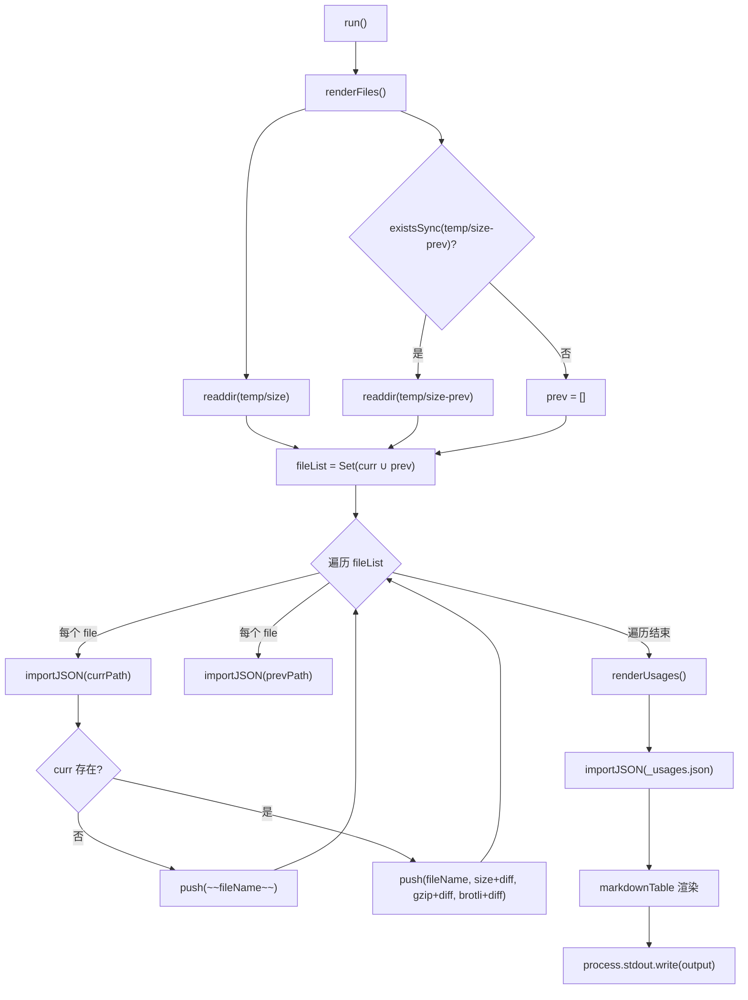
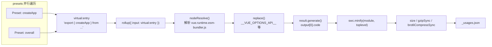

# 제 11 장: 번들 크기 예산 메커니즘: size-report와 usage-size의 측정 철학

지난 장에서 우리는 Vue가 GitHub Actions를 사용하여 lint, 타입 검사, 테스트, 번들 크기 추적을 우회할 수 없는 파이프라인으로 고정하는 것을 보았다. 그중 size-report.yml과 size-data.yml은 변경이 있을 때마다 크기 데이터를 남기는 역할을 한다. 하지만 파이프라인은 실행만 담당할 뿐, "얼마나 커졌는지, 어디가 커졌는지"를 실제로 답하는 것은 이번 장에서 분석할 두 스크립트이다. 번들 크기 예산의 핵심 모순은 패키지 크기가 감지할 수는 있지만 정확히 원인을 귀속시키기 어려운 지표라는 점이다. 사용자가 "Vue가 너무 크다"고 불평할 때, 유지보수자는 세 가지 질문에 답해야 한다 — 얼마나 커졌는가? 어디가 커졌는가? 이번 변경이 더 크게 만들었는가? scripts/size-report.js는 비교를 담당하고, scripts/usage-size.js는 원인 귀속을 담당하며, 둘은 함께 번들 크기 예산의 측정 철학을 구성한다.

# 11.1 size-report: 크기 차이를 읽기 쉬운 Markdown 표로 변환

## 직관적 모델

당신이 물류 회사의 품질 검사원이라고 상상해 보자. 각 소포(빌드 산출물)는 출고 전에 무게를 재야 하며, 당신의 일은 무게를 재는 것 자체가 아니라 "오늘의 무게"와 "어제의 무게"를 한 표에 나란히 놓고, 굵은`+2.3 kB`로 어떤 소포가 무거워졌는지 표시하는 것이다. 이 비교 표가 없다면 유지보수자는 고립된 숫자 더미만 볼 수 있어 특정 PR이 크기 회귀를 도입했는지 판단할 수 없다.

`size-report.js`이 바로 그 품질 검사원이다. 이것은 크기 데이터를 생성하지 않으며(그것은`usage-size.js`와 빌드 스크립트의 일이다), 단지 두 디렉터리의 JSON 파일을 소비하여 Markdown 보고서를 생성한다.

## 데이터 구조와 디렉터리 규약

스크립트의 핵심 규약은 두 상수에 숨어 있다. 현재 데이터 디렉터리는`temp/size`이고, 역사적 기준선 디렉터리는`temp/size-prev`。

[FACT:scripts/size-report.js:23-24]

이다. 이 두 디렉터리의 이름은 임의가 아니다:`temp/size`은`size-data.yml`워크플로가 매 실행 시 생성하여 artifact[FACT:.github/workflows/size-data.yml:53-57]로 업로드하고,`temp/size-prev`은`size-report.yml`이 기준선 artifact를 가져온 후 압축을 풀어 얻는다. 디렉터리 이름 자체가 데이터 흐름의 계약이다.

스크립트는 세 가지 타입 별칭을 정의하며, 이들은 JSON 파일의 구조를 정확히 묘사한다:

[FACT:scripts/size-report.js:8-21]

`SizeResult`에는 세 개의 숫자 필드가 있다:`size`(비압축),`gzip`、`brotli`。`BundleResult`여기에`file`필드가 추가되어 파일 이름을 표시한다.`UsageResult`은`Record`이며, 키는 preset 이름이고 값은`SizeResult & { name: string }`이다 — 여기에는`name`필드가 하나 더 있는데, JSON 객체의 키는`Object.values`이후에 손실되므로 이름을 값 안에 중복 저장해야 하기 때문이다.

## Step-by-Step Walkthrough

메인 흐름은 매우 간단하며, 두 단계와 한 번의 출력만 있다:

[FACT:scripts/size-report.js:23-38]

`run()`먼저`renderFiles()`를 호출하여 산출물 파일 표를 렌더링하고, 그다음`renderUsages()`를 호출하여 사용 시나리오 표를 렌더링하며, 마지막으로 모듈 수준 변수`output`에 누적된 문자열을 한 번에 stdout[FACT:scripts/size-report.js:25]에 쓴다. 이 "문자열을 누적한 후 한 번에 출력"하는 패턴은 여러 번의`process.stdout.write`연결 오버헤드를 피하고 출력 순서를 완전히 제어할 수 있게 한다.

**첫 번째 단계: 파일 목록을 수집하고 합집합을 구한다.**

[FACT:scripts/size-report.js:44-49]

`filterFiles`두 종류의 파일을 필터링한다:`_`로 시작하는 파일(예:`_usages.json`)과`.txt`로 끝나는 파일(예:`number.txt`、`base.txt`). 이 두 종류는 메타데이터이지 크기 데이터가 아니다. 그런 다음 현재 디렉터리와 역사 디렉터리 파일 이름의 합집합`fileList`을 구한다 —`Set`로 중복을 제거한다. 왜 합집합을 구하는가? 파일이 역사 디렉터리에만 존재할 수도 있고(이번 빌드에서 해당 산출물이 삭제됨), 현재 디렉터리에만 존재할 수도 있기 때문이다(이번 빌드에서 산출물이 새로 추가됨). 두 경우 모두 보고서에 반영해야 한다.

**두 번째 단계: 파일별 비교.**

[FACT:scripts/size-report.js:43-75]

합집합의 각 파일에 대해 두 디렉터리에서 각각 JSON 가져오기를 시도한다.`importJSON`의 구현은 "파일이 없으면 undefined 반환"이다:

[FACT:scripts/size-report.js:112-115]

여기서는 동적`import()`과`with: { type: 'json' }`가져오기 어설션을 사용하며,`fs.readFileSync` + `JSON.parse`는 사용하지 않는다. 전자는 Node의 모듈 로더가 처리하고, 후자는 인코딩과 파싱 오류를 수동으로 처리해야 한다.`import()`를 선택한 대가는 Promise를 반환한다는 것이므로 전체`renderFiles`는 async이다.

핵심 분기는`if (!curr)`에 있다: 현재 디렉터리에 이 파일이 없으면 해당 산출물이 삭제된 것이므로 Markdown의 취소선 문법`~~fileName~~`으로[FACT:scripts/size-report.js:60-61]를 표시한다. 그렇지 않으면 정상적으로 한 행을 렌더링하며, 각 숫자 뒤에`getDiff`의 결과를 붙인다.

**세 번째 단계: 차이 계산.**

[FACT:scripts/size-report.js:124-130]

`getDiff`에는 세 개의 조기 반환 지점이 있다:`prev === undefined`일 때 빈 문자열 반환(기준선이 없어 비교 불가);`diff === 0`일 때 빈 문자열 반환(변화 없음, 노이즈 표시 안 함); 그렇지 않으면 굵은 부호 있는 차이를 반환한다.`prettyBytes(diff)`은 음수도 올바르게 처리하여`-1.2 kB`같은 형식을 출력하며,`sign`변수는 양수일 때만`+`。

**를 붙인다.**

[FACT:scripts/size-report.js:80-103]

`renderUsages`네 번째 단계: usage 표 렌더링.`renderFiles`와`_usages.json`의 구조 차이는 주목할 만하다: 이것은`Object.values(curr)`를 직접 가져오는데, usage 데이터가 이 파일 하나에 고정적으로 존재하기 때문이다.`prev?.[usage.name]`는 Record를 배열로 변환한 후`name`를 통해 이름으로 역사 데이터를 찾는다 — 이것이 바로`.filter(usage => !!usage)`필드를 중복 저장하는 이유이다.`map`이 줄은 실제로 중복인데,

가 항상 배열 요소를 반환하며 falsy 값을 생성하지 않기 때문이다.`markdown-table`마지막으로[FACT:scripts/size-report.js:72-74]。

## 복사

> **[Design Inference & Architectural Trade-offs]**
> **〔설계 추론과 아키텍처 트레이드오프〕`import()`왜`readFileSync`？**가 아니라`import()`를 사용하는가? 동적

**`filterFiles`의 JSON 가져오기 어설션은 Node 20+의 표준 방식이며, ESM 환경에서 JSON 로딩을 자연스럽게 처리한다. 대가는 동기 컨텍스트에서 사용할 수 없고, 매 가져오기가 모듈 캐시에 저장된다는 점인데, 이 일회성 스크립트에서는 캐시가 문제가 되지 않는다.`file[0] !== '_'`의**판단.`readdir`이 판단은 파일 이름이 비어 있지 않다고 가정한다. 만약`file[0]`가 빈 문자열을 반환한다면(이론적으로 불가능),`undefined`，`undefined !== '_'`는

**삭제된 산출물 처리.**어떤 산출물이 삭제되면, 보고서는 취소선으로 표시하지 직접 제거하지 않습니다. 이는 의도된 설계입니다: 유지보수자는 "이 파일이 사라졌다"는 것을 확인해야 하며, 조용히 테이블에서 사라지게 해서는 안 됩니다. 만약 그냥 필터링해버리면, 독자는 해당 산출물이 존재한 적이 없다고 오해할 것입니다.

# 11.2 usage-size: 실제 사용자의 도입 시나리오 시뮬레이션

## 직관적 모델

`size-report`"전체 패키지가 얼마나 큰지"를 알려주지만, 이는 사용자가 진정으로 관심 있는 질문에 답하지 못합니다: "나는`createApp`만 사용하는데, 실제로 얼마나 많은 코드를 다운로드해야 하는가?" 전체 패키지 부피에는 당신이 영원히 사용하지 않을 수 있는 많은 코드가 포함되어 있습니다 (예:`defineCustomElement`、`Transition`、`KeepAlive`）。`usage-size.js`의 역할은 "전형적인 사용자"를 연기하는 것입니다: 특정 API만 import하는 가상 진입 파일을 작성하고, Rollup으로 번들링하여 최종 산출물이 얼마나 큰지 확인합니다.

이는 식당이 "주방에 있는 모든 식재료의 총 무게는 50킬로그램"이라고 말하지 않고, "궁바오지딩 한 접시를 주문하면 실제로 사용되는 식재료는 300그램"이라고 말하는 것과 같습니다.

## 데이터 구조: Preset 배열

스크립트의 핵심 데이터 구조는`presets`배열이며, 각 요소는 하나의 사용 시나리오를 설명합니다:

[FACT:scripts/usage-size.js:27-55]

`Preset`타입에는 세 개의 필드가 있습니다:`name`(표시 이름),`imports`(Vue에서 import하는 API 목록), 선택적`replace`(추가 컴파일 타임 대체). 다섯 개의 preset이 최소에서 최대 사용 시나리오를 커버합니다:

- `createApp (CAPI only)`:`createApp`만 import하고,`__VUE_OPTIONS_API__`을`'false'`로 대체하여 순수 컴포지션 API 사용자[FACT:scripts/usage-size.js:35-40]
- `createApp`:`createApp`만 import하고, Options API 유지[FACT:scripts/usage-size.js:35-40]
- `createSSRApp`: SSR 시나리오[FACT:scripts/usage-size.js:35-40]
- `defineCustomElement`: Web Components 시나리오[FACT:scripts/usage-size.js:35-40]
- `overall`: 여섯 개의 핵심 API를 import하여 "풀기능" 사용자 시뮬레이션[FACT:scripts/usage-size.js:44-54]

진입 파일은 runtime-only의 esm-bundler 산출물로 고정됩니다:

[FACT:scripts/usage-size.js:24-28]

`vue.runtime.esm-bundler.js`을 선택하고 전체 버전`vue.esm-bundler.js`이 아닌 이유는, 런타임 버전이 템플릿 컴파일러를 포함하지 않아 현대 빌드 도구 사용자의 실제 상황에 더 가깝기 때문입니다—그들은 SFC로 템플릿을 사전 컴파일하며, 런타임 컴파일러가 필요하지 않습니다.

## Step-by-Step Walkthrough

**첫 번째 단계: 모든 preset의 bundle을 병렬로 생성.**

[FACT:scripts/usage-size.js:62-69]

`main()`각 preset에 대해`generateBundle`의 Promise를 생성하고,`Promise.all`로 병렬 실행합니다. 여기서 병렬은 안전합니다. 각`generateBundle`호출이 독립적인`rollup()`을 가지며, 상태를 공유하지 않기 때문입니다.

**두 번째 단계: 가상 진입점 구성.**

[FACT:scripts/usage-size.js:94-96]

이것이 전체 스크립트에서 가장 정교한 부분입니다. 임시 파일을 디스크에 쓰지 않고, 가상 모듈 ID`virtual:entry`를 구성하며, 내용은 re-export 문입니다:`export { createApp } from '/absolute/path/to/vue.runtime.esm-bundler.js'`.`entry`는 절대 경로입니다. Rollup이 이를 해석할 수 있어야 하기 때문입니다.

**세 번째 단계: Rollup 플러그인 체인 구성.**

[FACT:scripts/usage-size.js:98-121]

플러그인 배열의 순서가 매우 중요합니다:

1. **사용자 정의`usage-size-plugin`**：`resolveId`이`virtual:entry`을 가로채서 자체를 반환하고,`load`이 가상 내용[FACT:scripts/usage-size.js:101-110]을 반환합니다. 이것이 Rollup 가상 모듈의 표준 패턴입니다.

2. **`nodeResolve()`**:`vue.runtime.esm-bundler.js`내부의 import[FACT:scripts/usage-size.js:111]。

3. **`replace`**해석: 컴파일 타임 상수 주입[FACT:scripts/usage-size.js:112-119]。

`replace`플러그인의 구성은 esm-bundler 산출물의 핵심 메커니즘을 드러냅니다:`__VUE_OPTIONS_API__`、`__VUE_PROD_DEVTOOLS__`과 같은 런타임 플래그를 유지하며, 사용자의 빌드 도구가 대체합니다. 여기서 스크립트가 사용자를 대신해 대체합니다:

- `process.env.NODE_ENV` → `"production"`: 프로덕션 분기로
- `__VUE_PROD_DEVTOOLS__` → `'false'`: devtools 지원 비활성화
- `__VUE_PROD_HYDRATION_MISMATCH_DETAILS__` → `'false'`: hydration 상세 오류 비활성화
- `__VUE_OPTIONS_API__` → `'true'`: 기본적으로 Options API 유지

그런 다음`...preset.replace`을 확장하여 preset이 기본값을 덮어쓸 수 있게 합니다.`createApp (CAPI only)`preset이 바로 이 메커니즘을 사용하여`__VUE_OPTIONS_API__`을`'false'` [FACT:scripts/usage-size.js:35-40]。

`preventAssignment: true`으로 변경`obj.process.env.NODE_ENV = x`과 같은 할당문 대체 방지[FACT:scripts/usage-size.js:117]。

**네 번째 단계: 생성, 압축, 측정.**

[FACT:scripts/usage-size.js:123-134]

`result.generate({})`이 코드를 생성하고,`output[0].code`을 가져옵니다. 그런 다음 SWC로 압축:

[FACT:scripts/usage-size.js:125-130]

`module: true`은 입력이 ESM임을 나타내고,`toplevel: true`은 최상위 스코프 변수 이름 압축을 허용합니다. 압축 후 세 가지 지표를 각각 계산합니다:`minified.length`(바이트 길이),`gzipSync(minified).length`、`brotliCompressSync(minified).length`。

여기서는`node:zlib`의 동기 API를 사용하며, 비동기 버전이 아닙니다. 일회성 스크립트에서는 동기 API가 더 간결하고, 압축 자체가 CPU 집약적 작업이므로 비동기가 병렬 이점을 가져오지 않습니다.

**다섯 번째 단계: 출력 및 지속화.**

[FACT:scripts/usage-size.js:62-86]

결과는 먼저 사람이 읽을 수 있는 형식으로 콘솔에 출력되며,`pico`로 색상[FACT:scripts/usage-size.js:62-86]을 입힙니다. 그런 다음`temp/size/_usages.json`에 쓰고,`Object.fromEntries`로 배열을 다시 Record로 변환하며, 키는 preset 이름[FACT:scripts/usage-size.js:81-85]。

`--write`플래그는 각 preset의 비압축 bundle을 디스크에 추가로 쓸지 여부를 제어[FACT:scripts/usage-size.js:136-138], 디버깅용.

## 설계 고찰 및 함정

> **[Design Inference & Architectural Trade-offs]**
> **왜 임시 파일 대신 가상 모듈을 사용하는가?**임시 파일은 경로 처리, 정리, 동시 쓰기 충돌을 다뤄야 합니다. 가상 모듈은 진입 내용을 메모리에 유지하며, Rollup의`resolveId`/`load`훅이 자연스럽게 이 패턴을 지원합니다. 대가는 ID를 정확히 일치시켜야 한다는 것이며, 철자 오류가 있으면 Rollup이 "진입점을 해석할 수 없음"을 보고합니다.

**`replace`의`preventAssignment`함정.**만약`preventAssignment: true`，`replace`을 설정하지 않으면, 플러그인이`process.env.NODE_ENV = 'x'`과 같은 할당문도 대체하여`"production" = 'x'`구문 오류를 발생시킵니다. Vue 소스 코드에는 실제로`process.env.NODE_ENV`에 대한 할당이 존재하므로(테스트 도구에서), 이 옵션은 필수입니다.

**`__VUE_OPTIONS_API__`의 기본값 선택.**스크립트는 기본값을`'true'` [FACT:scripts/usage-size.js:116]으로 설정하며,`'false'`이 아닙니다. 이는 보수적인 선택입니다: 사용자가 구성하지 않으면, Vue는 Options API 지원을 유지합니다.`createApp (CAPI only)`preset은 명시적으로`'false'`으로 덮어쓰며, 비활성화 후의 부피 이득을 보여줍니다. 이 비교 자체가 사용자에게 주는 문서입니다: "Options API를 끄면 얼마나 절약되는지"를 알려줍니다.

**병렬`Promise.all`의 실패 의미론.**만약 어떤 preset의 번들링이 실패하면,`Promise.all`즉시 reject되며, 다른 진행 중인 패키징은 취소되지 않습니다 (Rollup은 취소 메커니즘을 제공하지 않습니다). CI에서 이는 한 번의 실패가 다른 preset의 계산을 낭비한다는 것을 의미하지만, 스크립트 자체는 비제로 종료 코드로 끝나므로 CI가 올바르게 포착할 수 있습니다.

# 11.3 데이터에서 게이트까지: CI가 이 보고서들을 소비하는 방법

## 데이터 흐름 전경

이 두 스크립트를 이해하려면, 반드시 CI 파이프라인에 다시 넣어서 봐야 합니다.`size-data.yml`main/minor로 push하거나 PR 시 실행되며`pnpm run size` [FACT:.github/workflows/size-data.yml:45]를 생성하고`temp/size`디렉토리를 만든 후 artifact로 업로드합니다[FACT:.github/workflows/size-data.yml:53-57]。

PR의 경우, 추가로 두 개의 메타데이터 파일을 작성합니다:

[FACT:.github/workflows/size-data.yml:47-51]

`number.txt`에는 PR 번호를 저장하고,`base.txt`에는 대상 브랜치 이름을 저장합니다. 이 두 파일이 바로`size-report.js`에서`filterFiles`가 필터링해야 할`.txt`파일입니다[FACT:scripts/size-report.js:44-45]. 이들의 존재 목적은 다운스트림의`size-report.yml`가 「어떤 베이스라인과 비교해야 하는지」 알게 하기 위함입니다.

## 베이스라인 획득과 비교

`size-report.yml`(이전 장에서 상세히 설명)의 워크플로는: 현재 PR의`size-data`artifact를 다운로드하고, 대상 브랜치의 베이스라인 artifact를 다운로드하고, 베이스라인을`temp/size-prev`에 압축 해제한 후,`size-report.js`를 실행하여 Markdown 보고서를 생성하고 PR에 코멘트합니다.

여기에는 핵심적인 설계 제약이 있습니다:`size-report.js`자체는 베이스라인 획득을 담당하지 않으며,`temp/size-prev`가 이미 존재한다고 가정합니다. 존재하지 않으면,`existsSync(prevDir)`는 false를 반환하고,`prev`는 빈 배열[FACT:scripts/size-report.js:48]이 되며, 모든 diff는 빈 문자열이 됩니다. 이는 우아한 성능 저하입니다: 베이스라인이 없어도 보고서는 여전히 생성되며, 단지 차이를 표시하지 않을 뿐입니다.

## 크기 게이트의 판정 로직

> **[Design Inference & Architectural Trade-offs]**
> 흔한 오해를 하나 명확히 할 필요가 있습니다:`size-report.js`자체는 게이트 판정을 하지 않습니다. 보고서만 생성하고, 종료 코드를 반환하지 않으며, 임계값을 설정하지 않습니다. 실제 게이트는`size-report.yml`워크플로 레벨에서 발생합니다——보고서의 diff 값을 파싱하고, 임계값을 초과하면 job을 실패시키는 단계를 포함할 수 있습니다.

이러한 「측정과 판정의 분리」 설계에는 깊은 이유가 있습니다: 측정 스크립트는 순수하게 유지되어 사실만 생성해야 하며, 판정 로직은 워크플로 레벨에 있어야 합니다. 임계값은 버전, 브랜치, 릴리스 단계에 따라 변할 수 있기 때문입니다. 임계값을`size-report.js`에 하드코딩하면 재사용이 어려워집니다.

# 설계 사고

**왜 크기 예산에 두 세트의 측정이 필요한가?**전체 패키지 크기와 usage 크기는 서로 다른 질문에 답합니다. 전체 패키지 크기는 「상한」입니다——최악의 경우 사용자가 얼마나 다운로드해야 하는지 알려줍니다. usage 크기는 「전형값」입니다——대부분의 사용자가 실제로 얼마나 다운로드하는지 알려줍니다. 둘을 결합해야 완전한 크기 초상화를 제공할 수 있습니다. 전체 패키지 크기만 있으면 유지보수자가 인기 없는 API를 과도하게 최적화하는 경향이 있고, usage 크기만 있으면 일부 엣지 시나리오의 크기 폭발을 놓칠 수 있습니다.

**gzip과 brotli 이중 지표의 의미.**현대 CDN은 일반적으로 brotli를 지원하지만, 모든 시나리오에서 활성화되는 것은 아닙니다. 둘 다 보고하면 유지보수자가 「gzip만 지원하는 환경에서 크기가 어떤지」 평가할 수 있습니다. brotli는 일반적으로 gzip보다 15-20% 작으며, 이 차이 자체가 가치 있는 정보입니다.

**데이터 형식의 안정성 계약.** `size-report.js`와`usage-size.js`는 JSON 파일을 통해 디커플링됩니다.`usage-size.js`가 쓰고`_usages.json`，`size-report.js`가 읽습니다. 이 계약의 필드명(`name`、`size`、`gzip`、`brotli`)은 암묵적이며, schema 검증이 없습니다. 만약`usage-size.js`가 필드명을 바꾸고`size-report.js`동기화를 잊으면, 보고서는 조용히 잘못된 데이터를 표시합니다. 이것이 현재 설계의 취약점입니다.

# 이 장 요약

# 이 장 사고와 자가 점검

Q1: `size-report.js`의`filterFiles`는`_`로 시작하는 파일을 필터링합니다. 만약`usage-size.js`가 출력 파일을`_usages.json`에서`usages.json`로 이름을 바꾸면, 무슨 일이 발생할까요?

**참고 해석**：`filterFiles`의 필터 조건은`file[0] !== '_' && !file.endsWith('.txt')` [FACT:scripts/size-report.js:44-45]입니다. 파일 이름이`usages.json`로 바뀌면,`_`로 시작하지 않으므로`filterFiles`에 의해 유지되어`fileList`합집합에 들어갑니다. 그러면`renderFiles`는 그것을 bundle 파일로 처리하려고 시도합니다:`importJSON`는 성공적으로 import할 수 있지만(합법적 JSON이므로), 그 구조는`Record<string, UsageResult>`가 아니라`BundleResult`이므로,`curr?.file`는`undefined`，`fileName`이 빈 문자열이 되고,`curr.size`도`undefined`，`prettyBytes(undefined)`이 되어 오류를 던지거나 비정상 출력합니다. 이는 보고서 생성 실패를 초래합니다. 이 문제의 근원은`filterFiles`가 파일명 접두사를 「메타데이터 vs 데이터」 구분 기준으로 사용하고, 디렉토리 구조나 명시적 매니페스트를 사용하지 않는다는 점입니다. 더 견고한 방법은 usage 데이터를 하위 디렉토리에 넣거나, 명시적 메타데이터 파일 목록을 유지하는 것입니다.

Q2: `usage-size.js`에서`Promise.all(tasks)`는 모든 preset의 패키징을 병렬 실행합니다. 만약 어떤 preset의`replace`설정에서`__VUE_OPTIONS_API__`를 누락하면, 무슨 일이 발생할까요? 왜 기본값이`'true'`가 아니라`'false'`？

**인가?**：`replace`참고 해석`__VUE_OPTIONS_API__: 'true'`플러그인 설정에서,`...preset.replace`는 기본값이고, 그 다음[FACT:scripts/usage-size.js:116-118]를 전개하여`'true'`를 덮어쓸 수 있게 합니다. 만약 어떤 preset이 설정을 누락하면, 기본값`'true'`를 사용합니다. 즉 Options API 지원을 유지하므로 크기가 다소 커집니다. 기본값을`__VUE_OPTIONS_API__`로 설정하는 것은 보수적 선택입니다: 「사용자가 설정하지 않았을 때의 실제 동작」을 반영합니다. Vue의 esm-bundler 산출물에서,`'false'`의 기본 동작은 Options API를 유지하는 것입니다(사용자가 명시적으로 끄지 않는 한). 만약 기본값을`createApp (CAPI only)`로 설정하면, 명시적으로 설정하지 않은 모든 preset이 작은 크기를 표시하여 사용자가 「설정하지 않으면 크기를 절약할 수 있다」고 오해하게 만듭니다.`'false'` [FACT:scripts/usage-size.js:35-40]preset이 명시적으로

Q3: `size-report.js`로 설정된 것은, 바로 「명시적으로 끈 후의 이득」을 보여주어 기본값과 대비를 이루기 위함입니다.`importJSON`의`import()`는`fs.readFileSync`가 아니라 동적`temp/size-prev`를 사용합니다. 만약

**디렉토리의 어떤 JSON 파일이 손상되면(불법 JSON), 두 구현의 동작은 어떻게 다를까요?**참고 해석`import()`: 동적`SyntaxError`는 불법 JSON을 파싱할 때`importJSON`를 던지며, 이 오류는`existsSync`내부의`existsSync`파일 존재 여부만 확인하고 내용의 적법성은 확인하지 않음[FACT:scripts/size-report.js:112-115]. 오류는 상위로 전파되어`renderFiles`로 전달되어 전체 보고서 생성이 실패하게 됩니다. 만약`fs.readFileSync` + `JSON.parse`를 사용하면 마찬가지로 오류가 발생하지만,`importJSON`내부에서 try-catch로 감싸서`undefined`를 반환하여 우아한 성능 저하를 구현할 수 있습니다. 현재 구현은 오류를 전파하도록 선택했으며, 이는 "artifact의 JSON은 반드시 유효하다"는 암묵적 가정을 내포합니다. 이 가정은 CI 환경에서는 일반적으로 성립하는데, 파일이`usage-size.js`와 빌드 스크립트에 의해 생성되기 때문입니다. 하지만 로컬 디버깅 시 JSON 파일을 수동으로 수정하여 손상시킨 경우, 보고서는 해당 파일을 건너뛰지 않고 바로 크래시됩니다. 이는 "데이터 소스를 신뢰한다"는 설계 선택입니다.

---

크기 예산 메커니즘은 "무엇을 측정할 것인가"와 "어떻게 비교할 것인가" 문제를 해결했지만, 빌드 산출물 자체가 재현 가능하다는 전제에 의존합니다. 다음 장에서는 최소 디버깅 샌드박스로 들어갑니다:`vite-debug`최소한의 설정으로 상호작용 가능한 Vue 개발 환경을 어떻게 시작하는지, 그리고 그것이 로컬 빌드 산출물과 어떻게 연동되어 소스 코드 수정부터 런타임 검증까지의 폐쇄 루프를 형성하는지 살펴봅니다.

여기까지 크기 예산의 측정 폐쇄 루프가 명확해졌습니다: size-report.js는 디렉토리 비교로 "얼마나 커졌는가"를 답하고, usage-size.js는 가상 모듈로 실제 임포트 시나리오를 시뮬레이션하여 "어디가 큰가"를 답하며, 게이트 판정은 워크플로우 계층에 맡깁니다. 이 메커니즘은 크기 회귀를 모호한 불평에서 추적 가능한 데이터로 바꿔줍니다. 하지만 데이터는 문제가 존재한다는 것만 알려줄 뿐, 실제로 위치를 파악하고 수정하려면 문제를 빠르게 재현할 수 있는 최소 환경이 필요합니다. 다음 장에서는 packages-private/vite-debug로 들어가서 Vue가 Vite + SFC로 극도로 간소화된 디버깅 샌드박스를 어떻게 구축하여 "실제 소스 코드에서 최소 재현하기"를 일상적인 실천으로 만드는지 살펴봅니다.
