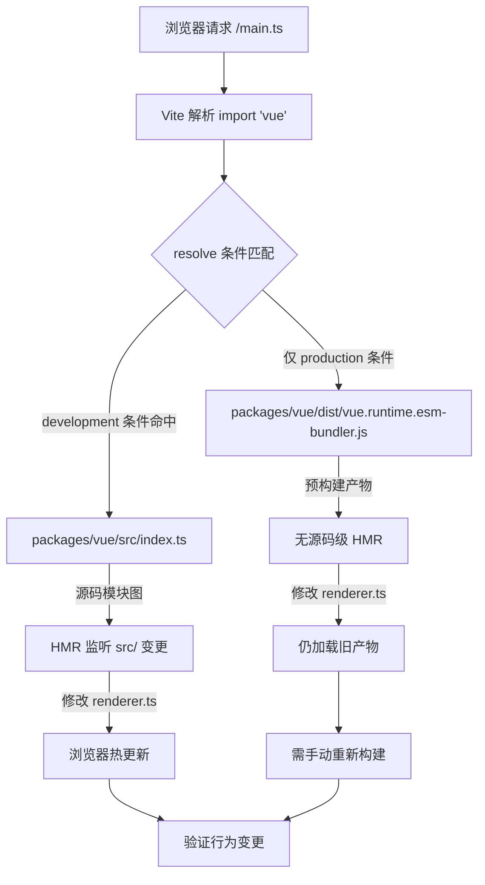

# 제 12 장: 최소 디버깅 샌드박스: vite-debug와 로컬 개발 폐쇄 루프

이전 장에서 우리는 크기 예산의 측정 폐쇄 루프를 완성했습니다: size-report.js는 "얼마나 커졌는가"를 답하고, usage-size.js는 "어디가 큰가"를 답하며, 워크플로우 계층이 게이트 판정을 담당합니다. 하지만 이 메커니즘에는 암묵적 전제가 있습니다—빌드 산출물 자체가 재현 가능해야 한다는 것입니다. 특정 패키지의 크기가 비정상적으로 팽창했거나 특정 런타임 동작이 예상과 다를 때, 로컬 소스를 빠르게 로드하고 수정 후 즉시 결과를 확인할 수 있는 최소 환경이 필요합니다. packages-private/vite-debug가 바로 그 환경입니다. 파일이 단 네 개, 총 40줄 미만의 코드지만, Vue core 저장소에서 "실제 소스 코드에서 최소 재현하기"의 일상적 실천 진입점을 구성합니다. 이 장에서는 이 샌드박스의 구성 논리를 파일별로 분해하고, 왜 packages가 아닌 packages-private 디렉토리에 배치되었는지 설명합니다.

# 1. 샌드박스의 골격:`main.ts`와`App.vue`의 최소 마운트 체인

## 직관적 모델

전체 Vue 런타임을 하나의 엔진에 비유한다면,`vite-debug`는 "베어메탈 테스트 벤치"입니다—외장도, 계기판도 없이 엔진이 돌아가게 하는 최소한의 배선만 있습니다. 그 가치는 기능 완전성에 있지 않고,**모든 방해 변수를 배제**하는 데 있습니다: 특정 버그가 반응형 시스템이나 렌더러 내부에 있다고 의심될 때, 디버깅 환경 자체의 복잡성이 노이즈 소스가 되는 것을 원하지 않을 것입니다.

## 데이터 구조와 파일 레이아웃

먼저`main.ts`의 전체 내용을 봅니다:

[FACT:packages-private/vite-debug/main.ts:4-4]

```ts
import { createApp } from 'vue'
import App from './App.vue'

const app = createApp(App)

app.mount('#app')
```

이 여섯 줄의 코드는 Vue 애플리케이션 시작의 표준 패러다임이지만, 각 줄은 디버깅 시나리오에서 정확한 엔지니어링 의미를 가집니다:

- **L1**의`import { createApp } from 'vue'`에서,`'vue'`라는 모듈 식별자가 최종적으로 무엇으로 해석되는지는 전적으로`vite.config.ts`와`package.json`의 의존성 선언에 의해 결정됩니다. 이것이 전체 샌드박스의 가장 핵심적인 부분입니다—나중에 이것이 어떻게 로컬 소스를 가리키게 되는지 살펴보겠습니다.
- **L2**의`import App from './App.vue'`은`@vitejs/plugin-vue`의 SFC 컴파일 파이프라인을 트리거합니다: Vite가 dev server 시작 시 이 플러그인을 등록하고, 브라우저가`App.vue`를 요청하면 플러그인이 이를`<script>`、`<template>`、`<style>`세 개의 가상 모듈로 분해하여 각각 컴파일합니다.
- **L4**의`createApp(App)`은 앱 인스턴스를 생성하며, 이때 Vue 내부에서`app._context`、`app._instance`등의 핵심 필드를 초기화하지만 아직 렌더링은 트리거되지 않습니다.
- **L6**의`app.mount('#app')`은 실제 시작 스위치입니다: DOM에서 id가`app`인 컨테이너 요소를 찾아 루트 컴포넌트 인스턴스를 생성하고 첫 렌더링을 트리거합니다.

여기서`index.html`의 참조가 없다는 점에 주목하세요—Vite의 관례는 프로젝트 루트 디렉토리의`index.html`를 진입 HTML로 사용하며, 여기에는`<div id="app"></div>`과`<script type="module" src="/main.ts"></script>`가 포함됩니다. 이 파일은 이 장의 keyFiles에는 없지만,`app.mount('#app')`가 성공할 수 있는 전제입니다.

## 시나리오 기반 워크스루: 한 번의 클릭의 전체 체인

이제`App.vue`를 봅니다. 이것은 이 샌드박스의 "실험 매체"입니다:

[FACT:packages-private/vite-debug/App.vue:4-8]

```vue

import { ref } from 'vue'

const count = ref(0)

  {{ count }}

button {
  color: red;
}

```

구체적인 시나리오를 대입해봅니다:**사용자가 브라우저에서 버튼을 클릭하면 무슨 일이 일어나는가?**

**첫 번째 단계: SFC 컴파일 시점 (dev server 시작 시)**

`@vitejs/plugin-vue`이`App.vue`를 세 부분으로 컴파일합니다:

- `<script setup>`블록은 컴포넌트의`setup()`함수로 컴파일되고,`ref(0)`호출은`RefImpl`객체를 반환하며, 그`.value`는 초기에`0`。
- `<template>`블록은 렌더 함수로 컴파일되고,`{{ count }}`는`_toDisplayString(count.value)`，`@click="count++"`로 변환되며,`onClick: $event => (count.value++)`。
- `<style>`는`<style>`블록은 CSS 모듈로 컴파일되어

**태그를 통해 DOM에 주입됩니다.`app.mount`두 번째 단계: 첫 렌더링 (**

`createApp(App)`호출 시)`mount('#app')`때, 루트 컴포넌트의`ComponentInternalInstance`를 생성하고,`setup()`을 실행하여`count`의 RefImpl을 얻은 다음, 렌더 함수를 호출하여 VNode 트리를 생성한다. 렌더 함수에서`count.value`을 읽으면`track`이 의존성을 수집하는 것이 트리거된다——현재 활성 렌더 이펙트(`ReactiveEffect`)가`count`의`dep`에 기록된다.

**세 번째 단계: 클릭 이벤트(사용자 상호작용 시)**

브라우저가`click`이벤트를 트리거하면, Vue의 이벤트 핸들러가`count.value++`을 실행한다. 이것은 setter 작업으로,`trigger`을 트리거한다:`count.dep`에 수집된 이펙트를 순회하며 재렌더링을 스케줄링한다. 동기 업데이트이고 배치 큐에 없기 때문에, 렌더 이펙트가 즉시 실행되어 렌더 함수를 다시 호출하고, 새로운 VNode를 생성한 후, 이전 VNode와 diff하여 텍스트 내용이`0`에서`1`로 변경된 것을 발견하고, 실제 DOM의`textContent`。

을 업데이트한다. 전체 체인은 아래의 데이터 흐름도로 표현할 수 있다:

```mermaid
flowchart LR
    subgraph compile["编译期 (Vite Dev Server)"]
        sfc["App.vue"] -->|"@vitejs/plugin-vue"| script["setup() 函数"]
        sfc -->|"@vitejs/plugin-vue"| render["渲染函数"]
        sfc -->|"@vitejs/plugin-vue"| style["CSS 模块"]
    end
    subgraph runtime["运行时 (浏览器)"]
        script -->|"ref(0)"| refimpl["RefImpl { value: 0 }"]
        render -->|"读取 count.value"| track["track() 收集依赖"]
        click["用户点击"] -->|"count.value++"| trigger["trigger() 触发更新"]
        trigger -->|"调度渲染副作用"| rerender["重新执行渲染函数"]
        rerender -->|"diff + patch"| dom["更新真实 DOM"]
    end
    track -.->|"dep 记录 ReactiveEffect"| trigger
```

이 다이어그램의 핵심은:**컴파일 타임 산출물과 런타임 동작 사이의 결합점은 단 두 개뿐이다**——`ref(0)`이 반환하는 RefImpl 객체, 그리고 렌더 함수에서의`count.value`읽기/쓰기. 이는 반응형 시스템의 특정 분기(예:`trigger`의 스케줄링 로직)를 디버깅하려면, 이`App.vue`에서 해당 읽기/쓰기 패턴을 구성하기만 하면 된다는 것을 의미한다.

## 설계 사고: 왜`ref`이고`reactive`？

> **[Design Inference & Architectural Trade-offs]**
> `ref(0)`대신`reactive({ count: 0 })`을 기본 예제로 선택한 것은 디버깅 우선이라는 고려를 내포한다:`ref`의`.value`접근 경로가 더 짧아, 디버거에서`RefImpl`객체를 펼칠 때`_value`、`dep`、`__v_isRef`등의 내부 필드를 직접 볼 수 있는 반면,`reactive`이 반환하는 Proxy 객체는 콘솔에서 펼치면 getter가 트리거되어 원래 상태 관찰을 방해할 수 있다. "최소 재현" 시나리오에서는 Proxy 간접 계층을 하나 줄이는 것이 더 적은 변수를 의미한다.

---

# 2. 별칭 해석:`vite.config.ts`과`package.json`이 어떻게`'vue'`을 로컬 소스 코드로 가리키는가

## 직관적 모델

`vite.config.ts`은 단 여섯 줄이지만, 전체 샌드박스의 "라우팅 허브"이다——`import { createApp } from 'vue'`의`'vue'`이 최종적으로 npm의 배포 버전을 로드하는지, 아니면 저장소에서 개발 중인 소스 코드를 로드하는지를 결정한다. 올바른 별칭 구성이 없으면,`App.vue`에서 수정한 코드가 디버깅 중인 Vue 소스 코드를 전혀 트리거하지 않을 수 있어, 디버깅이 "잘못된 과녁을 향해 총을 쏘는" 것이 된다.

## 데이터 구조와 해석 체인

먼저`vite.config.ts`：

[FACT:packages-private/vite-debug/vite.config.ts:4-6]

```ts
import { defineConfig } from 'vite'
import vue from '@vitejs/plugin-vue'

export default defineConfig({
  plugins: [vue()],
})
```

여기서**명시적인`resolve.alias`구성이 없다**. 그렇다면`'vue'`은 어떻게 로컬 소스 코드로 해석되는가? 답은`package.json`에 있다:

[FACT:packages-private/vite-debug/package.json:1-15]

```json
{
  "name": "vite-debug",
  "private": true,
  "type": "module",
  "scripts": {
    "dev": "vite",
    "build": "vite build",
    "serve": "vite preview"
  },
  "devDependencies": {
    "@vitejs/plugin-vue": "catalog:",
    "vite": "catalog:",
    "vue": "workspace:*"
  }
}
```

핵심은**L13**：`"vue": "workspace:*"`이다. 이것은 pnpm workspace 프로토콜 선언으로,`vite-debug`이 npm registry의 버전이 아닌 monorepo의`vue`라는 로컬 패키지에 의존함을 나타낸다. pnpm은`node_modules/vue`에 심볼릭 링크를 생성하여`packages/vue`(Vue의 메인 패키지 디렉토리)를 가리킨다.

하지만 이것만으로는 부족하다——`packages/vue`의`package.json`에서`main`/`module`/`exports`필드는 일반적으로**빌드 산출물**(예:`dist/vue.runtime.esm-bundler.js`)을 가리키며,`src/`아래의 소스 코드가 아니다.`packages/runtime-core/src/renderer.ts`을 수정했지만 재빌드하지 않으면, Vite는 여전히 이전`dist`파일을 로드한다.

> **[Design Inference & Architectural Trade-offs]**
> 이것이 Vue core 저장소의`packages/vue/package.json`에 일반적으로`"development"`조건부 내보내기 또는 유사한 소스 진입점 매핑이 구성되는 이유이다——dev 모드에서 Vite의`resolve.conditions`은`development`조건을 우선 매칭하여`src/index.ts`대신`dist`을 로드한다. 이 메커니즘 덕분에`vite-debug`은 명시적 alias 구성 없이도 소스 수정 후 HMR을 통해 즉시 효과를 볼 수 있다.

## 시나리오 기반 Walkthrough: 한 번의`import 'vue'`해석 과정

시나리오 대입:**Vite dev server가 브라우저의`main.ts`요청을 받고`import { createApp } from 'vue'`을 만났을 때, 해석 체인은 어떻게 되는가?**



이 흐름도는 핵심 분기를 드러낸다:**만약`development`조건이 올바르게 구성되지 않으면, 소스 수정 후 브라우저가 핫 업데이트되지 않는다**, "코드를 바꿨는데 동작이 변하지 않는" 혼란에 빠지게 된다.排查 방법은 브라우저 DevTools의 Network 패널에서`vue`모듈의 실제 로드 경로를 확인하는 것이다——만약`dist/`경로가 보이면, 소스 진입점 매핑이 적용되지 않은 것이다.

## 설계 사고: 왜`vite.config.ts`에 명시적으로 alias를 작성하지 않는가?

> **[Design Inference & Architectural Trade-offs]**
> 자연스러운 의문은: 왜`vite.config.ts`에 직접`resolve: { alias: { vue: '../../packages/vue/src/index.ts' } }`을 작성하지 않는가? 이렇게 하면 직관적이지만 두 가지 문제가 있다:

1. **하위 경로 임포트 파괴**: Vue의 공개 API에는`vue/server-renderer`、`vue/compiler-sfc`등의 하위 경로가 포함된다.`'vue'`자체만 alias하면, 하위 경로 임포트는 여전히`dist`을 거쳐, 일부 모듈은 소스에서, 일부는 산출물에서 오게 되어 동작이 일관되지 않는다.

2. **조건부 내보내기 메커니즘 우회**: Vue의`package.json`에서`exports`필드는 이미 완전한 조건부 내보내기 매핑(`development`/`production`/`browser`/`node`등)을 정의하고 있으며, alias는 이 메커니즘을 덮어써서 디버깅 환경과 실제 사용자 환경의 해석 동작에 차이를 발생시킨다.

따라서,`vite-debug`은 "workspace 프로토콜 신뢰 + 조건부 내보내기"의 조합을 선택하여 해석 체인을 실제 사용 시나리오에 최대한 가깝게 만든다. 이는 또한`package.json`에서`"vue": "workspace:*"`이 필수적인 이유를 설명한다——이것이 pnpm 심볼릭 링크를 트리거하고, 나아가 Vite가`node_modules/vue`을 통해`packages/vue`을 찾을 수 있게 하는 전제 조건이다.

## 프로덕션 함정:`catalog:`프로토콜과 버전 드리프트

주의:`package.json`에서**L11-L12**이`"catalog:"`프로토콜을 사용한다:

```json
"@vitejs/plugin-vue": "catalog:",
"vite": "catalog:",
```

이것은 pnpm의 catalog 기능으로, 버전 번호가`pnpm-workspace.yaml`의`catalog`필드에 의해 통합 관리됨을 나타낸다. 그 역할은**monorepo에서 여러 패키지가 동일 의존성을 참조할 때 버전 드리프트를 방지하는 것**。

> **[Design Inference & Architectural Trade-offs]**
> 디버깅 시나리오에서 이것은 숨겨진 함정을 초래한다: 만약`vite-debug`Vite 또는 plugin-vue의 버그로 의심되는 상황을 만나서 임시로 버전을 업그레이드해 검증하려 할 때, 직접 수정하는 것은`package.json`에 있는`catalog:`은 무효하다——당신은`pnpm-workspace.yaml`에 있는 catalog 정의를 수정해야 하며, 이는 해당 catalog를 사용하는 모든 패키지에 영향을 준다. 올바른 방법은 임시로 명시적 버전 번호(예:`"vite": "5.0.0"`)로 바꾸고, 검증이 끝난 후 다시`catalog:`。

---

# 으로 되돌리는 것이다. 三、`packages-private`의 격리 설계: 왜 디버그 샌드박스는 외부에 배포되지 않는가

## 직관적 모델

`packages-private`디렉터리는 회사의 「내부 실험실」과 같다——안에 있는 샘플은 외부에 판매되지 않고 테스트와 데모에만 사용된다. 이는`packages`디렉터리와 물리적으로 격리되어 디버그 코드가 실수로 npm에 배포되는 것을 방지한다.

## 격리 메커니즘의 3중 보장

**첫 번째 층: 디렉터리 격리**

`packages-private/vite-debug`은`packages/`아래에 있지 않으며,`pnpm-workspace.yaml`은 일반적으로`packages/*`과`packages-private/*`을 모두 workspace 멤버로 선언하지만, 배포 스크립트(예:`scripts/release.js`)는`packages/`아래의 패키지만 순회한다.

**두 번째 층:`private: true`**

[FACT:packages-private/vite-debug/package.json:3]

```json
"private": true,
```

이 줄은 npm/pnpm의 강제 제약이다:`private`으로 표시된 패키지는**영원히`npm publish`로 배포될 수 없다**, 수동으로 실행해도 거부된다. 이것이 실수 배포를 방지하는 마지막 방어선이다.

**세 번째 층:`version`필드 없음**

주의:`package.json`에는`version`필드가 없다. npm 규범은 배포 가능한 패키지에 반드시`version`이 있어야 한다고 요구하며, 해당 필드가 없는 패키지는`npm publish`시 오류가 발생한다. 이것은 「이중 보험」이다——설령`private`이 실수로 삭제되더라도`version`이 없으면 여전히 배포가 차단된다.

## 설계 사고: 디버그 샌드박스와 Playground의 역할 분담

Vue core 저장소에는 이미 기능이 완전한`SFC Playground`이 있다(7장에서 논의함). 왜 아직도`vite-debug`？

> **[Design Inference & Architectural Trade-offs]**
> 둘의 포지셔닝은 완전히 다르다:

| 차원 | SFC Playground | vite-debug |
| --- | --- | --- |
| 실행 환경 | 브라우저 내(컴파일도 브라우저에서) | Node.js + 브라우저 |
| 소스 로딩 | CDN 또는 사전 빌드된 산출물을 통해 | 로컬 소스를 직접 로드 |
| 디버깅 능력 | 브라우저 샌드박스에 제한됨 | Node.js 디버거, 브레이크포인트 사용 가능 |
| 소스 수정 | 지원하지 않음 | HMR 지원 |
| 적용 시나리오 | 컴파일 출력 검증, 재현 공유 | 런타임 내부 동작 디버깅 |

`vite-debug`의 핵심 가치는**실제 Node.js 환경에서 실행된다는 점이다**, 당신은`node --inspect`로 디버거를 붙이고,`packages/reactivity/src/effect.ts`에 브레이크포인트를 걸어`ReactiveEffect`의 생성과 스케줄링 과정을 관찰할 수 있다. 이것은 Playground가 제공할 수 없는 것이다.

## 프로덕션 함정: HMR 경계와 상태 손실

> **[Design Inference & Architectural Trade-offs]**
> 을 사용해 디버깅할 때 흔한 혼란은:`vite-debug`에 있는`App.vue`의 초기값을 수정한 후, 브라우저의 카운트가 리셋되지 않는다는 점이다. 이는 Vite의 HMR이`count`블록을 처리할 때`<script setup>`컴포넌트 상태를 유지하고 렌더 함수만 교체하기**때문이다. 상태를 완전히 리셋해야 한다면 수동으로 페이지를 새로고침하거나,**에`App.vue`를 추가해`import.meta.hot?.invalidate()`강제로 전체 페이지를 새로고침해야 한다.

또 다른 함정은:`packages/runtime-core/src/`아래의 소스를 수정할 때, HMR 전파 경로가 자동으로 트리거되지 않을 수 있다는 점이다——왜냐하면`vite-debug`의 HMR 경계는`App.vue`레벨에 정의되어 있고,`packages/`아래의 소스 변경은 Vite의 모듈 그래프를 통해 전파되어야 하기 때문이다. 소스를 수정한 후 브라우저가 반응하지 않으면 Vite 터미널 출력에`hmr update`로그가 있는지 확인하라. 없다면 dev server를 재시작해야 할 수도 있다.

---

# 이 장의 요약

`packages-private/vite-debug`은 네 개의 파일과 40줄 미만의 코드로 완전한 디버깅 폐루프를 구축했다:

1. **`main.ts`**은 최소 마운트 경로를 제공한다:`createApp(App).mount('#app')`, 모든 불필요한 초기화 로직을 배제한다.

2. **`App.vue`**은 실험 매체로서:`ref`+ 템플릿 보간 + 이벤트 처리를 통해 반응형 시스템의 주요 경로를 커버한다.

3. **`vite.config.ts` + `package.json`**은`workspace:*`프로토콜과 조건부 내보내기를 통해`'vue'`을 로컬 소스로 해석하여 「소스 수정 즉시 반영」을 구현한다.

4. **`packages-private` + `private: true`+`version`**없음의 3중 격리로 디버그 코드가 실수로 배포되지 않도록 보장한다.

이 샌드박스의 엔지니어링 철학은:**디버깅 환경 자체의 복잡도는 0에 가까워야 하며, 모든 복잡도는 디버깅 대상 소스에 남겨두어야 한다**. 당신이`packages/reactivity`에서 재현하기 어려운 버그를 만났을 때,`vite-debug`은 마음대로 수정하고 즉시 검증할 수 있는 실험대를 제공한다.

# 이 장의 생각과 자가 점검

Q1: 만약`package.json`에 있는`"vue": "workspace:*"`을`"vue": "^3.4.0"`으로 바꾸면,`vite-debug`에서`packages/reactivity/src/ref.ts`을 수정한 후 브라우저의 동작은 어떻게 변할까? 왜 그런가?

**참고 해석**:`"^3.4.0"`으로 바꾸면 pnpm은 npm registry에서 Vue 3.4.x의 배포 버전을 다운로드하고, 로컬`packages/vue` [FACT:packages-private/vite-debug/package.json:13]에 링크하지 않는다. 이때`import { createApp } from 'vue'`은`node_modules/.pnpm/vue@3.4.x/node_modules/vue/dist/vue.runtime.esm-bundler.js`으로 해석된다, 즉 사전 빌드된 산출물이다.`packages/reactivity/src/ref.ts`을 수정해도 HMR이 전혀 트리거되지 않는다. Vite의 모듈 그래프에 이 파일이 전혀 포함되지 않기 때문이다. 브라우저에서 실행되는 것은 여전히 npm 버전의`ref`구현이다. 이 실험은`workspace:*`이 소스 레벨 디버깅의 필요조건임을 역으로 검증한다.

Q2: `App.vue`에서`<style>`블록에`scoped`을 추가하지 않았다면, 이 샌드박스에서 두 개의 컴포넌트 인스턴스를 동시에 마운트하면 스타일은 어떻게 될까? 이것은`vite-debug`의 디버깅 목표와 어떤 관계가 있는가?

**참고 해석**:`scoped`이 없을 때,`button { color: red }`은 전역 스타일[FACT:packages-private/vite-debug/App.vue:4-8]이 되어 페이지의 모든`<button>`요소에 적용된다. 두 개의 컴포넌트 인스턴스를 마운트하면 두 인스턴스의 버튼이 모두 빨간색이 된다. 디버깅 목표와의 관계는:`vite-debug`의 포지셔닝은 「최소 재현」이지 「스타일 격리 검증」이 아니다.`scoped`을 생략하면 컴파일 시`data-v-xxx`속성을 주입하는 변수가 줄어들어 디버거의 DOM 구조가 더 깨끗해진다. 만약`scoped`스타일의 컴파일 로직을 디버깅해야 한다면 명시적으로`scoped`을 추가하고`@vitejs/plugin-vue`이 생성하는 속성 주입 코드를 관찰해야 한다.

Q3: 당신이`packages/runtime-core/src/renderer.ts`의`patch`함수에`console.log`한 줄을 추가했지만 브라우저 콘솔에 출력이 없다고 가정하자. 최소 세 가지 가능한 원인을 나열하고, 각각 어떻게排查할지 설명하라.

**참고 해석**：

원인 1:**소스 엔트리가 적용되지 않음**。`'vue'`이`dist`산출물로 해석되었고`src`。점검: DevTools Network 패널에서`vue`모듈의 로딩 경로를 확인하고, 만약`dist/`로 시작한다면 조건부 내보내기가 매칭되지 않은 것입니다`development`조건[FACT:packages-private/vite-debug/package.json:13]。

원인 2:**HMR이 전파되지 않음**. Vite의 모듈 그래프가`packages/runtime-core/src/renderer.ts`의 변경을`vite-debug`로 전파하지 않았습니다. 점검: Vite 터미널에`hmr update`로그가 있는지 확인하고, 없다면 dev server를 재시작하세요.

원인 3:**`patch`함수가 호출되지 않음**. 만약 현재 페이지에서 어떤 DOM 업데이트도 트리거되지 않았다면(예: 버튼 클릭 없음),`patch`은 최초 마운트 시에만 한 번 실행될 수 있으며, 최초 마운트는 당신이`console.log`를 추가하기 전에 발생했습니다. 점검: 페이지를 새로고침하거나,`App.vue`에 업데이트를 트리거하는 동작을 추가하세요.

원인 4 (보충):**빌드 캐시**. Vite의 의존성 사전 빌드 캐시(`node_modules/.vite`)가 여전히 구버전을 사용하고 있을 수 있습니다. 점검:`node_modules/.vite`를 삭제한 후 재시작하세요.

---

볼륨 예산은 "문제가 존재한다"는 것을 알려주고,`vite-debug`은 "문제를 직접 재현"할 수 있게 해줍니다. 하지만 이 샌드박스 모드를 전체 monorepo로 확장하려 하면 일련의 경계 조건에 직면하게 됩니다: CI 환경에서의 workspace 프로토콜 해석 차이,`catalog:`버전 고정의 업그레이드 딜레마,`packages-private`와`packages`사이의 의존성 방향 제약…… 다음 장에서는 아키텍처 트레이드오프와 함정 회피 가이드로 들어가, monorepo 엔지니어링이 실제 프로젝트에서 드러내는 경계 조건을 체계적으로 정리합니다.

여기까지 우리는 볼륨 측정에서 최소 재현까지의 엔지니어링 폐쇄 루프를 완성했습니다: vite-debug는 극도로 간결한 네 개의 파일로 "실제 소스 코드에서 빠르게 검증하기"를 일상적으로 사용 가능한 실천으로 만들었습니다. 하지만 이 체계를 실제로 복제하기 시작하면 더 많은 숨겨진 트레이드오프를 발견하게 됩니다——왜 packages-private는 반드시 packages와 물리적으로 격리되어야 하는가? 왜 열거형 인라인은 반드시 Rollup 이전에 완료되어야 하는가? 다음 장에서는 앞 열두 장에서 드러난 핵심 결정 지점과 프로덕션 함정 기록을 총정리하여, 완전한 함정 회피 체크리스트와 의사결정 근거를 제공합니다.
