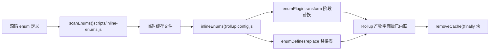
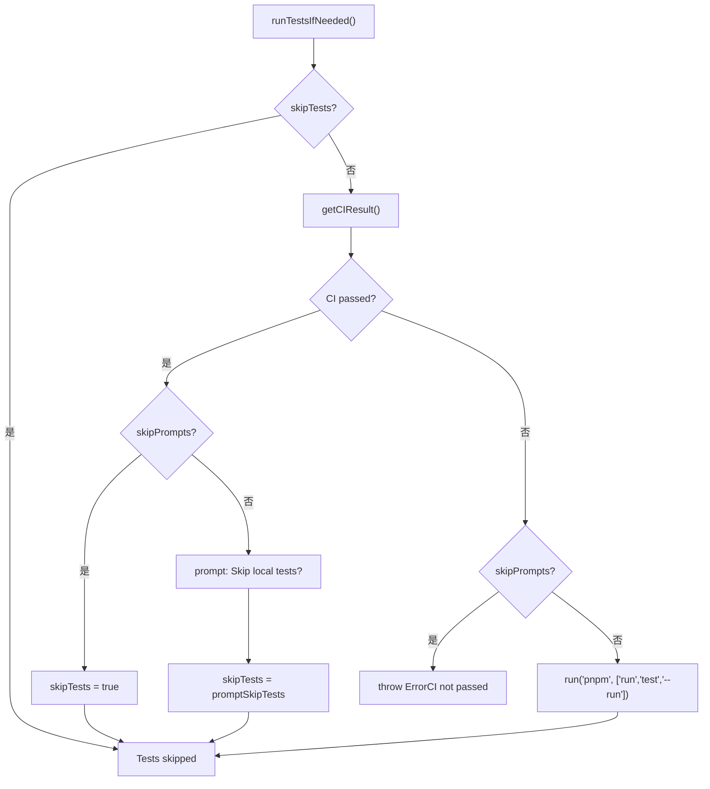

# 제 13 장: 아키텍처 트레이드오프와 함정 회피 가이드: monorepo 엔지니어링의 경계 조건

이전 장에서 우리는`packages-private/vite-debug`를切口로 삼아 실제 소스 코드에서 최소 재현을 하는 디버깅 패러다임을 익혔습니다. 이러한 내부 디버깅 패키지가 점점 많아지면 현실적인 문제가 떠오릅니다: 이들이 외부에 배포되는 정식 패키지와 같은 workspace에 공존하는데, 어떻게 배포 프로세스가 잘못 건드리지 않도록 보장할 수 있을까? 이번 장에서는 monorepo 엔지니어링의 경계 조건을 깊이 파고들어,`packages`와`packages-private`의 이중 디렉터리 계약에서 출발하여 아키텍처 트레이드오프 뒤의 방어적 설계를 분석하고, 실행 가능한 함정 회피 가이드를 제시합니다.

# 13.2 타이밍 철칙: 열거형 인라인은 반드시 Rollup 실행보다 먼저

## 직관적 모델

열거형 인라인은 마치 "포장하기 전에 부품의 라벨을 숫자로 바꾸는 것"과 같습니다. 만약 포장 작업자(Rollup)가 이미 포장을 시작했는데 당신이 라벨을 바꾸면, 상자 안의 부품과 라벨이 맞지 않게 됩니다.`build.js`은`scanEnums()` / `removeCache()`이 함수 쌍을 사용하여 인라인을 엄격하게 Rollup 이전에 끼워 넣습니다.

## 데이터 구조와 생명주기

`inline-enums.js`이 내보내는`scanEnums()`은`removeCache`클로저를 반환하며, 이는 소스 코드의 enum 정의를 스캔하고 Rollup이 소비할 임시 파일을 생성합니다[FACT:scripts/build.js:30-34]。`build.js`의`run()`은`try/finally`을 사용하여 캐시 정리를 보장합니다[FACT:scripts/build.js:81-112]：

```js
const removeCache = scanEnums()
try {
  // ... buildAll / checkAllSizes / build-dts
} finally {
  removeCache()
}
```

`rollup.config.js`은 모듈 최상위에서`inlineEnums()`을 호출하여`[enumPlugin, enumDefines]` [FACT:rollup.config.js:47-50]을 얻으며, 여기서`enumPlugin`은 plugins 배열에 삽입되고[FACT:rollup.config.js:331-331]，`enumDefines`은 replace 플러그인의 교체 테이블에 병합됩니다[FACT:rollup.config.js:222-223]。

## Step-by-Step: 한 번의 빌드에서 열거형의 완전한 생명주기

1. `build.js`의`run()`은 먼저`scanEnums()`을 호출하여 모든 패키지의 enum 정의를 스캔하고 임시 캐시에 기록한 후`removeCache` [FACT:scripts/build.js:87-87]。

2. `buildAll`을 반환하고 동시에 여러 Rollup 프로세스를 시작합니다[FACT:scripts/build.js:119-121]。

3. 각 Rollup 프로세스는 설정 로딩 단계에서`inlineEnums()`을 실행하여 이전 단계에서 생성된 캐시를 읽고`enumPlugin`과`enumDefines` [FACT:rollup.config.js:47-50]。

4. `enumPlugin`을 얻습니다. transform 단계에서 소스 코드의 enum 참조를 리터럴로 교체하며;`enumDefines`은 replace의 보충으로서 크로스 모듈 상수 교체를 처리합니다[FACT:rollup.config.js:222-223]。

5. 빌드 종료 시,`finally`블록이`removeCache()`을 호출하여 임시 파일을 정리합니다[FACT:scripts/build.js:119-121]。



## 설계 사고와 함정

> **[Design Inference & Architectural Trade-offs]**
> 왜 Rollup 플러그인을 transform 단계에서 즉석 스캔하여 사용하지 않는가? 열거형 인라인은**크로스 패키지 전역 뷰**：`runtime-core`가 필요하기 때문입니다. 참조된 enum은`shared`에 정의되어 있을 수 있으며, 단일 Rollup 프로세스는 자신의 패키지 소스 트리만 보기 때문에 크로스 패키지 교체를 완료할 수 없습니다.`scanEnums()`이 빌드 전에 전역 캐시를 구축하는 것은 바로 이 가시성 문제를 해결하기 위한 것입니다.

프로덕션 함정 포인트:`removeCache()`을`finally`에 두면 빌드 중간에 오류가 발생해도 정리된다는 의미입니다. 하지만 디버깅 시 수동으로 프로세스를 중단하면(Ctrl+C),`finally`이 실행되지 않을 수 있으며, 잔여 캐시 파일로 인해 다음 빌드에서 만료된 열거형을 읽게 됩니다. 점검 방법:`temp/`디렉터리에 잔여 enum 캐시 파일이 있는지 확인하고, 수동으로 삭제한 후 재시도하세요.

---

# 13.3 배포 오케스트레이터:`release.js`의 skip 플래그 비트 매트릭스

## 직관적 모델

`release.js`은 결혼식 총감독과 같고,`skipBuild` / `skipTests` / `skipGit` / `skipPrompts`네 개의 스위치는 "리허설 건너뛰기", "서약 건너뛰기", "사진 촬영 건너뛰기", "확인 건너뛰기" 버튼입니다. 각 버튼의 존재는 하나의 실제 시나리오에 대응합니다: CI 환경은`skipPrompts`이 필요하고, 로컬 디버깅은`skipGit`이 필요하며, 긴급 핫픽스는`skipTests`。

## 이 필요합니다

플래그 비트의 데이터 구조와 기본값`parseArgs`네 개의 skip 플래그는[FACT:scripts/release.js:39-50]에서 선언되고[FACT:scripts/release.js:64-66]：

```js
let skipTests = args.skipTests
const skipBuild = args.skipBuild
const skipPrompts = args.skipPrompts
const skipGit = args.skipGit
```

복사`skipTests`주의`let`선언, 왜냐하면 그것은`runTestsIfNeeded()`에서 동적으로 재작성되기 때문이다[FACT:scripts/release.js:281-317]。

## Step-by-Step: 한 번의 release의 전체 의사결정 흐름

`main()`의 실행 순서[FACT:scripts/release.js:143-279]：

1. **원격 동기화 검사**：`isInSyncWithRemote()`로컬 HEAD와 원격 브랜치 SHA를 비교하고, 불일치 시 확인 대화상자를 띄운다[FACT:scripts/release.js:337-363]。

2. **버전 선택**: 위치 인자가 없을 때`versionIncrements`선택 메뉴를 띄운다[FACT:scripts/release.js:152-176]。

3. **테스트 의사결정**：`runTestsIfNeeded()`은 skip 로직이 가장 밀집된 곳이다[FACT:scripts/release.js:281-317]。

4. **버전 업데이트**：`updateVersions()`모든 패키지를 순회하며`package.json` [FACT:scripts/release.js:377-398]。

5. **Changelog 생성**: 호출`pnpm run changelog` [FACT:scripts/release.js:211-212]。

6. **Git 커밋**：`skipGit`이 참이면 전체 구간을 건너뛴다[FACT:scripts/release.js:231-240]。

7. **발행**: 오직`args.publish`이 참일 때만 실행`buildPackages()` + `publishPackages()` [FACT:scripts/release.js:243-246]。

`runTestsIfNeeded()`의 분기 로직은 별도로 펼쳐볼 가치가 있다:



## 설계 사고와 함정

> **[Design Inference & Architectural Trade-offs]**
> `skipTests`을 사용하고`let`이 아닌`const`의 설계는 "CI가 통과했으면 로컬 테스트를 자동으로 건너뛴다"는 최적화 경로를 지원하기 위해서다. 이는 CI 발행 시나리오에서 많은 시간을 절약한다—GitHub Actions의`release.yml`이 이미 전체 테스트를 돌렸으므로, 로컬에서 다시 돌리는 것은 순전히 낭비다.

**발행 순서의 숨겨진 계약**：`sortPackagesForPublishing`은`vue`을 마지막에 배치한다[FACT:scripts/release.js:85-85], 주석에 명확히 "사용자는 내부 패키지가 사용 가능해지기 전에 새로운 엔트리 패키지를 설치할 수 없다"고 설명되어 있다. 만약 이 순서를 수정하면, 사용자가`npm install vue@next`할 때 아직 발행되지 않은 의존성 버전을 가져올 수 있어`ERR_MODULE_NOT_FOUND`。

**멱등성 보호**：`publishPackage`은 발행 전에`isPackagePublished`을 호출하여 registry[FACT:scripts/release.js:453-458]를 확인하고, 발행 실패 시`previously published`오류를 캐치하여[FACT:scripts/release.js:480-488]을 건너뛰는 것으로 강등한다. 이로써 release 스크립트를 안전하게 재시도할 수 있다—네트워크 중단 후 다시 실행해도 "패키지가 이미 존재함" 때문에 전체가 실패하지 않는다.

**실패 롤백**：`fnToRun().catch()`은`versionUpdated`이 참일 때`updateVersions(currentVersion)`을 호출하여 버전 번호를 롤백한다[FACT:scripts/release.js:528-537]. 하지만 주의: 이것은`package.json`의 버전 필드만 롤백하며,**이미`git commit`된 커밋은 롤백하지 않는다**. 만약`skipGit`이 거짓인 상태에서 발행이 실패하면, 수동으로`git reset`。

---

# 설계 사고: 세 가지 트레이드오프의 공통 패턴

이 장의 세 가지 핵심 트레이드오프를 돌아보면,它们은 동일한 설계 철학을 공유한다:**"잊기 쉬운 런타임 검사"를 "우회 불가능한 구조적 제약"으로 전환한다**。

- `packages-private`물리적 격리: 스크립트 작성자가`private`필드를 기억해 검사하는 것에 의존하지 않고, 스캔 범위에서 자연스럽게 제외되도록 한다.
- 열거형 인라인 사전 배치: Rollup 플러그인이 transform 시 "우연히" 크로스 패키지 enum을 볼 수 있는 것에 의존하지 않고, 빌드 전에 전역 캐시를 구축한다.
- `release.js`의 skip 매트릭스: 발행자가 "CI가 통과했으면 로컬 테스트를 돌릴 필요 없다"는 것을 기억하는 것에 의존하지 않고, 스크립트가 자동으로 CI 상태를 조회하고`skipTests`。

> **[Design Inference & Architectural Trade-offs]**
> 이 패턴의 대가는**스크립트 복잡도 상승**：`build.js`이다.`privatePackages`목록을 유지해야 하고,`rollup.config.js`디렉터리 탐지 로직을 중복해야 하며,`release.js`네 가지 skip 플래그의 교차 조합을 처리해야 한다. 하지만 Vue처럼 매주 여러 번 발행하는 저장소에서는 구조적 제약이 가져오는 신뢰성 이익이 복잡도 비용을 훨씬 능가한다.

---

# 이 장 요약

이 장은 소스 코드에서 출발하여 Vue core 엔지니어링 체계의 세 가지 핵심 경계 조건을 분석했다:

1. **`packages-private`과`packages`의 물리적 격리**는 workspace glob,`build.js`디렉터리 탐지,`release.js`필터 세 곳이 공동으로 보장한다[FACT:pnpm-workspace.yaml:1-3][FACT:scripts/build.js:153-170][FACT:scripts/release.js:68-83]。

2. **열거형 인라인의 타이밍 제약**은`scanEnums()` / `removeCache()`의`try/finally`구조가 강제로 보장하며, Rollup 설정이 모듈 최상위에서 캐시를 소비한다[FACT:scripts/build.js:81-112][FACT:rollup.config.js:47-50]。

3. **`release.js`의 skip 플래그 비트 매트릭스**는 CI 발행, 로컬 디버깅, 긴급 핫픽스 세 가지 시나리오를 지원하며,`skipTests`의 동적 재작성과 발행 순서 정렬이 가장 간과되기 쉬운 두 가지 숨겨진 계약이다[FACT:scripts/release.js:281-317][FACT:scripts/release.js:85-85]。

# 이 장 사고와 자가 점검

Q1: 만약`build.js`에서`build(target)`함수의`privatePackages.includes(target)`판단을 제거하고, 통일적으로`packages`을`pkgBase`로 사용하면, 어떤 시나리오에서 문제가 발생하는가?

**참고 해석**：`build.js:160-164`의 디렉터리 탐지는 프라이빗 패키지가 빌드될 수 있는 유일한 입구다. 제거하면,`nr build vite-debug`은`packages/vite-debug`에서`package.json`을 찾게 되고, 해당 디렉터리가 존재하지 않으므로,`fs.readFileSync`이 직접`ENOENT`을 던진다. 더 은밀한 문제는: 만약 미래에 누군가`packages/`아래에 동명의 디렉터리를 생성하면, 빌드가 조용히 잘못된 디렉터리의 설정을 사용하여 산출물 경로와`buildOptions`이 전부 어긋난다. 또한,`rollup.config.js:37-42`은 독립적인 디렉터리 탐지 로직을 가지고 있어, 두 곳을 반드시 동기화하여 수정해야 한다. 그렇지 않으면 "`build.js`은 패키지를 찾았지만 Rollup은 찾지 못함"의 불일치 상태가 발생한다.

Q2: `release.js`의`runTestsIfNeeded()`에서,`skipTests ||= isCIPassed`이 코드 줄(`release.js:285`)은`skipPrompts`이 참이고 CI가 통과하지 않았을 때 어느 분기로 가는가? 만약`else if (skipPrompts)`분기의`throw`을 제거하면 어떤 결과가 발생하는가?

**참고 해석**: 만약`skipPrompts`이 참이고 CI가 통과하지 않았을 때,`skipTests ||= isCIPassed`에서`isCIPassed`은`false`，`skipTests`로 원래 값(보통`false`)을 유지한다. 이후`else if (skipPrompts)`분기로 진입하여`Error`（`release.js:299-304`을 던진다). 만약 이`throw`을 제거하면, 코드는 계속 실행되어`if (!skipTests)`분기로 가서, 비대화형 환경에서`pnpm run test --run`을 실행한다. 이는 CI에서 테스트가 환경 차이로 실패하거나, 더 나쁘게는—테스트는 통과했지만 CI가 실제로 통과하지 않은(예: CI가 다른 테스트 하위 집합을 실행) 상태에서 완전히 검증되지 않은 버전을 발행할 수 있다.

Q3: `rollup.config.js:55`의`inlineEnums()`은 모듈 최상위에서 호출되고,`build.js:87`의`scanEnums()`은`run()`함수 내에서 호출된다. 만약 이两者的 실행 시점을 교환하면(즉`inlineEnums()`을 Rollup의`buildStart`훅에서 호출하게 하면), 무엇이 파괴되는가?

**참고 해석**：`scanEnums()`은 모든 Rollup 프로세스가 시작되기 전에 완료되어야 한다. 왜냐하면**모든 패키지**의 소스 코드를 스캔하여 전역 enum 캐시를 구축해야 하기 때문이다.`inlineEnums()`은`rollup.config.js`모듈 최상위에서 호출되며, 이때 Rollup은 아직 어떤 빌드도 시작하지 않았고 캐시는 이미 준비되어 있다. 만약`buildStart`에서 호출하도록 변경하면, 각 Rollup 프로세스가 독립적으로 스캔하게 된다—하지만`buildAll`은 동시 실행되므로(`build.js:119-121`), 여러 프로세스가 동시에 같은 파일들을 스캔하면 경쟁 상태가 발생한다: 프로세스 A가 프로세스 B가 아직 쓰기를 완료하지 않은 캐시 파일을 읽을 수 있어, enum 교체가 불완전해진다. 더 심각한 것은,`scanEnums()`이 반환하는`removeCache`클로저가 스캔 시의 파일 핸들 상태에 의존하므로, 동시성 시나리오에서 정리 시점을 조율할 수 없다.

이중 디렉터리 계약, 빌드 스크립트의 귀속 판정, 배포 스크립트의 2차 필터링—이러한 메커니즘들은 함께 monorepo 엔지니어링의 안전 경계를 규정한다. 그러나 경계는 불변하지 않는다: 빌드 도구가 Rollup에서 Rolldown으로 마이그레이션되고, 타입 테스트와 런타임 테스트가 융합되면서, 기존의 트레이드오프 전략도 새로운 도전에 직면하게 될 것이다. 다음 장에서는 3.0에서 3.4까지의 변경 궤적을 기반으로 차세대 엔지니어링 체계의 진화 방향을 전망한다.
