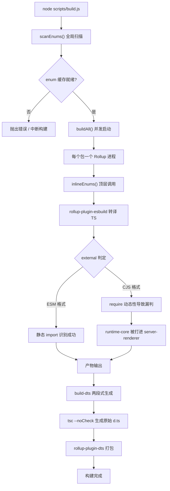
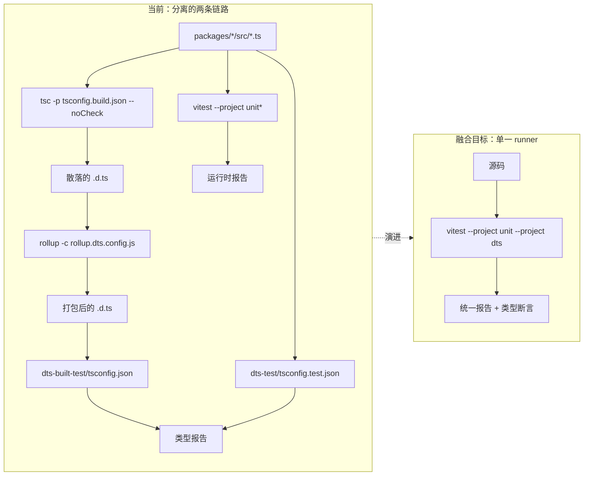
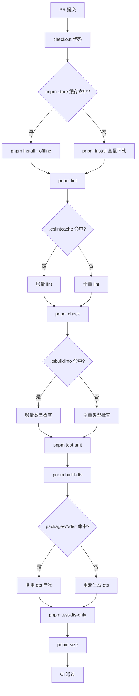

# 제 14 장: 미래 진화: 3.x에서 차세대 엔지니어링 체계로

이전 장에서 우리는 Vue core 엔지니어링 체계의 「안전 경계」—이중 디렉터리 계약, 빌드 스크립트 귀속 판정, 배포 스크립트 2차 필터링—을 정리했다. 이러한 메커니즘들은 일회성 설계가 아니라 3.0에서 3.4까지의 반복 속에서 거듭 다듬어진 것이다. 이번 장에서는 다른 시각으로 전환한다: 「지금 어떤 모습인가」가 아니라 「어떻게 지금의 모습이 되었는가」를 보고, 이를 바탕으로 차세대 엔지니어링 체계가 어디로 향할지 추론한다. 이번 장의 소스 자료는 changelogs/CHANGELOG-3.3.md, changelogs/CHANGELOG-3.4.md 그리고 저장소 루트의 package.json이다. 변경 로그는 단순히 「무엇을 수정했는가」의 기록처럼 보이지만, 그것은 엔지니어링 체계의 가장 진실한 건강 검진 보고서다: build: 접두사의 모든 커밋, types: 접두사의 모든 변경, 의존성 버전의 모든 롤백이 현재 아키텍처의 응력점을 드러낸다. 우리가 해야 할 일은 이러한 응력점에서 진화 방향을 읽어내는 것이다. 변경 로그를 「기능 목록」이 아니라 「엔지니어링 체계의 관측 창」으로 취급하는 것이 이번 장의 핵심 방법론이다. 기능 변경은 Vue가 무엇을 할 수 있는지 알려주고, 빌드·타입·CI 관련 변경은 Vue의 엔지니어링 체계가 「어디가 아픈지」를 알려준다.

# 1. 빌드 도구 체인의 응력점: Rollup에서 Rolldown으로의 마이그레이션 잠재력

## 직관적 모델

빌드 도구 체인을 하나의 조립 라인이라고 상상해 보자: Rollup은 메인 조립대, esbuild는 빠른 절단(TS 트랜스파일)을 담당하고, terser는 최종 번들 압축을 담당한다. 제품(Vue 런타임)이 점점 복잡해지고 조립대의 공정이 많아지면서, 메인 조립대 자체가 병목이 된다. Rolldown의 위치는 Rust로 다시 작성된 메인 조립대다—그것이 대체하려는 것은 esbuild가 아니라 Rollup 자체다.

이러한 진화 압력이 없다면, 시스템이 직면하는 「재앙」은 붕괴가 아니라**빌드 시간이 패키지 수에 따라 선형적으로 팽창하는 것**이다: 하위 패키지를 하나 추가할 때마다 Rollup 프로세스를 하나 더 띄우고, enum 캐시를 한 번 더 스캔하고, dts 생성을 한 라운드 더 실행해야 한다.

## 데이터 구조와 의존성 배치

먼저 현재 도구 체인의 정적 스냅샷을 보자.`package.json`의`devDependencies`은 정확한 「조립대 목록」이다:

[FACT:package.json:103-106]

```
    "rollup": "^4.63.3",
    "rollup-plugin-dts": "^6.5.1",
    "rollup-plugin-esbuild": "^6.2.1",
    "rollup-plugin-polyfill-node": "^0.13.0",
```

여기서 세 가지 핵심 사실을 읽을 수 있다. 첫째, Rollup 메이저 버전은`^4.63.3`이며, Rollup 4.x의 성숙기에 있다. 둘째,`rollup-plugin-esbuild`이 TS 트랜스파일을 담당한다는 것은 Rollup 자체가 TS를 파싱하지 않고 esbuild가 내놓은 JS만 처리한다는 의미다. 셋째,`rollup-plugin-dts`이 독립적으로`.d.ts`패키징을 담당하며, 이것이 바로 이전 장에서 논의한`dts-built-test`독립성의 물질적 기초다.

다음으로 빌드 스크립트의 진입점 구성을 보자:

[FACT:package.json:8-9]

```
    "build": "node scripts/build.js",
    "build-dts": "tsc -p tsconfig.build.json --noCheck && rollup -c rollup.dts.config.js",
```

`build-dts`은 「2단계」 방식이다: 먼저`tsc --noCheck`이 원시 선언 파일을 생성하고(`--noCheck`은 타입 검사를 건너뛰고 emit만 수행), 그다음`rollup -c rollup.dts.config.js`이 흩어진`.d.ts`을 단일 파일로 패키징한다. 이 설계 자체가 Rollup 능력에 대한 의존이다—`rollup-plugin-dts`은 타입 의존성을 추적하기 위해 Rollup의 모듈 그래프가 필요하다.

## 시나리오 기반: 한 번의`build:`커밋이 드러낸 것

변경 로그에서`build:`접두사 항목은 빌드 도구 체인 응력점의 직접적 증거다. 세 가지를 골라 보자.

첫째, 3.4.32의 minify 설정 정렬:

[FACT:changelogs/CHANGELOG-3.4.md:84]

```
* **build:** use consistent minify options from previous terser config ([789675f](https://github.com/vuejs/core/commit/789675f65d2b72cf979ba6a29bd323f716154a4b))
```

이 커밋의 동기는 「terser에서 esbuild minify로 마이그레이션한 후 압축 옵션이 일치하지 않음」이다. 이는 마이그레이션 중간 상태를 드러낸다: Vue는 한때 terser로 압축했고, 나중에 esbuild로 바꿨지만(`devDependencies`의`esbuild: ^0.28.2`이 이를 입증한다), 압축 옵션이 완전히 정렬되지 않아 산출물 크기나 동작에 편차가 생겼다. 이것이 바로 「조립대 부품 교체」 시의 전형적 대가다.

둘째, 3.4.38의 entities 버전 롤백:

[FACT:changelogs/CHANGELOG-3.4.md:6]

```
* **build:** revert entities to 4.5 to avoid runtime resolution errors ([f349af7](https://github.com/vuejs/core/commit/f349af7b65b9f8605d8b7bafcc06c25ab1f2daf0)), closes [#11603](https://github.com/vuejs/core/issues/11603)
```

`entities`은 HTML 엔티티 디코딩 라이브러리로,`compiler-dom`이 의존한다. 4.5로 롤백한 이유는 새 버전이 런타임 파싱에서 문제를 일으켰기 때문이다. 이 커밋은 다음을 보여준다:**빌드 도구 체인의 의존성 업그레이드는 고립되어 있지 않으며, 간접 의존성의 버전 변동이 런타임 동작까지 관통할 수 있다**。

셋째, 3.4.29의 server-renderer cjs 빌드 오염:

[FACT:changelogs/CHANGELOG-3.4.md:155]

```
* **build:** fix accidental inclusion of runtime-core in server-renderer cjs build ([11cc12b](https://github.com/vuejs/core/commit/11cc12b915edfe0e4d3175e57464f73bc2c1cb04)), closes [#11137](https://github.com/vuejs/core/issues/11137)
```

이것은 가장 전형적인 빌드 버그 유형이다: CJS 형식에서`server-renderer`이 실수로`runtime-core`을 자신의 산출물에 포함시켰다. 원인은 보통 Rollup의`external`판정이 CJS 형식에서失效하기 때문이다—ESM은`import`문으로 외부 의존성을 정적으로 식별할 수 있지만, CJS의`require`동적성이 더 강해 오판하기 쉽다. 이 커밋은 Rollup 설정의`external`로직의 취약성을 직접 지적한다.

## 마이그레이션 잠재력의 Mermaid 묘사

아래 그림은 현재 빌드 파이프라인의 제어 흐름을 묘사하고, Rolldown 마이그레이션이 건드릴 노드를 표시한다:



> **[Design Inference & Architectural Trade-offs]**
> Rolldown의 마이그레이션 가치는: 「패키지마다 하나의 프로세스」라는 동시성 모델을 「단일 프로세스 내 병렬」 모델로 바꾸는 것이다,`scanEnums()`의 전역 스캔과`inlineEnums()`의 교체를 동일한 Rust 런타임 내에서 조정할 수 있어, 이전 장에서 논의한 「동시 스캔 경쟁 조건」 문제가 근본적으로 사라진다. 하지만 마이그레이션의 저항도 여기에 있다——`rollup-plugin-esbuild`、`rollup-plugin-dts`이러한 플러그인 생태계는 Rolldown이 호환 계층을 제공해야 하며, 그리고`external`판정 로직은 재작성해야 한다.

## 설계 고민과 함정

**왜 마이그레이션이 한 번에 이루어지지 않는가?**을 보라`package.json`의`engines`필드를:

[FACT:package.json:61-63]

```
  "engines": {
    "node": ">=20.0.0"
  },
```

Node 20은 하드 하한이다. Rolldown은 Rust 네이티브 모듈로서, 대응하는 N-API 바인딩과 사전 컴파일된 바이너리 배포가 필요하다. 일단 도입하면,`pnpm install`의 소요 시간, 크로스 플랫폼(Windows/macOS/Linux) 바이너리 호환성, CI 캐시 전략을 모두 재설계해야 한다. 이는 「의존성 하나 교체」처럼 간단한 것이 아니라,**전체 설치-빌드-캐시 체인의 재보정**。

**이다.**：`build-dts`프로덕션 함정`tsc --noCheck`의`.d.ts`는 양날의 검이다. 타입 검사를 건너뛰면 emit이 빨라지지만, 이는`pnpm check`（`tsc --incremental --noEmit`생성 단계에서 타입 오류를 발견하지 못한다는 뜻이다——타입 오류는 오직`test-dts`)와`--noCheck`로만 뒷받침할 수 있다. 만약 Rolldown 마이그레이션 후 이 두 단계를 합치고 싶다면, 타입 검사가 빌드를 느리게 만들지 않도록 보장해야 한다, 그렇지 않으면

---

# 의 초심에 어긋난다.

## 二、타입 테스트와 런타임 테스트의 융합 추세

직관 모델`.d.ts`타입 테스트와 런타임 테스트를 두 개의 독립적인 품질 검사 관문으로 상상해보자: 하나는 「설명서(**)가 제대로 쓰였는지」를 검사하고, 하나는 「기계(런타임)가 제대로 돌아가는지」를 검사한다. 두 관문은 각각 독립적인 작업대, 독립적인 도구, 독립적인 보고서를 가진다. 융합 추세의 의미는:**

동일한 테스트 케이스로 설명서와 기계를 동시에 검증할 수 있는가?**융합이 없다면, 시스템이 직면하는 재앙은**：`.d.ts`타입과 런타임 동작의 드리프트`ref()`이`Ref<T>`을 반환한다고 말하지만, 런타임에 실제로 반환되는 객체 형태가 바뀌어, 타입 테스트는 통과하고 런타임 테스트도 통과하지만, 둘을 조합하면 틀린 것이다.

## 데이터 구조: 테스트 스크립트의 편성 레이아웃

`package.json`의`scripts`안에서, 테스트 관련 항목은 명확히 두 그룹으로 나뉜다:

[FACT:package.json:19-24]

```
    "test": "vitest",
    "test-unit": "vitest --project unit*",
    "test-e2e": "node scripts/build.js vue -f global -d && vitest --project e2e --project e2e-browser",
    "test-dts": "run-s build-dts test-dts-only",
    "test-dts-only": "tsc -p packages-private/dts-built-test/tsconfig.json && tsc -p ./packages-private/dts-test/tsconfig.test.json",
    "test-coverage": "vitest run --project unit* --coverage",
```

여기서 핵심 구조는`test-dts`의`run-s build-dts test-dts-only`——이것은**직렬**이다: 먼저`.d.ts`을 빌드하고, 그다음 타입 테스트를 실행한다. 그리고`test-dts-only`내부는 다시**두 개의 독립적인`tsc`프로세스**이다: 하나는`dts-built-test`를 실행하고(빌드 산출물 검증), 하나는`dts-test`를 실행한다(소스 타입 검증).

주목하라,`test-unit`는`vitest --project unit*`，`test-e2e`을 사용하고`vitest --project e2e --project e2e-browser`는`--project`을 사용한다. 이는 Vitest의**메커니즘이 이미 테스트를 「단위/엔드투엔드/브라우저」로 서로 다른 project로 나누었음을 보여준다.**융합의 물리적 기반은 이미 존재한다

## : Vitest의 project 메커니즘은 동일한 runner 안에서 서로 다른 유형의 테스트를 실행할 수 있게 한다.`types:`시나리오 기반: 한 번의

커밋의 전체 경로`types:`변경 로그에서

접두사의 항목 밀도가 매우 높다, 이는 타입 시스템 복잡도의 직접적 반영이다. 우리는 전형적인 타입 수정 하나를 추적한다.

[FACT:changelogs/CHANGELOG-3.4.md:23-24]

```
* Revert "fix(types/ref): allow getter and setter types to be unrelated ([#11442](https://github.com/vuejs/core/issues/11442))" ([b1abac0](https://github.com/vuejs/core/commit/b1abac06cdb198bd72f8e614b1f68b92e1c78339))
* Revert "fix(types/ref): correct type inference for nested refs ([#11536](https://github.com/vuejs/core/issues/11536))" ([3a56315](https://github.com/vuejs/core/commit/3a56315f94bc0e11cfbb288b65482ea8fc3a39b4))
```

복사

[FACT:changelogs/CHANGELOG-3.4.md:55]

```
* **types/ref:** allow getter and setter types to be unrelated ([#11442](https://github.com/vuejs/core/issues/11442)) ([e0b2975](https://github.com/vuejs/core/commit/e0b2975ef65ae6a0be0aa0a0df43fb887c665251))
```

[FACT:changelogs/CHANGELOG-3.4.md:30]

```
* **types/ref:** correct type inference for nested refs ([#11536](https://github.com/vuejs/core/issues/11536)) ([536f623](https://github.com/vuejs/core/commit/536f62332c455ba82ef2979ba634b831f91928ba)), closes [#11532](https://github.com/vuejs/core/issues/11532) [#11537](https://github.com/vuejs/core/issues/11537)
```

복사**3.4.35 병합에서 3.4.37 롤백까지, 중간에 패치 버전 하나만 지났다. 이 「병합-롤백」의 빠른 순환은 타입 테스트의 근본적 딜레마를 드러낸다:**。`allow getter and setter types to be unrelated`타입 테스트는 「타입 시그니처가 예상에 부합하는지」를 검증할 수 있지만, 「이 타입 시그니처가 실제 코드에서 사용하기 좋은지」는 검증할 수 없다`ref`이 타입 테스트에서는 완전히 통과할 수 있지만, 실제 사용 시

## 의 타입 추론을 지나치게 느슨하게 만들어, 다운스트림 코드의 타입 안전성을 파괴한다.

타입 테스트 융합의 Mermaid 묘사



> **[Design Inference & Architectural Trade-offs]**
> 〔설계 추론과 아키텍처 트레이드오프〕`dts-built-test`융합의 기술 경로는 아마도:`dts-test`과`tsc`의`expectTypeOf`호출을 Vitest의 커스텀 project로 캡슐화하여, 타입 단언을`vitest`형태로 테스트 파일에 인라인시키는 것이다. 이렇게 하면 한 번의`tsc`호출로 런타임 단언과 타입 단언을 동시에 실행하고, 보고서를 통일할 수 있다. 하지만 저항은:

## 의 타입 검사는 「전량」이고, Vitest의 테스트는 「파일별」이어서, 둘의 증분 전략이 호환되지 않는다.

**설계 고민과 함정`dts-built-test`왜`dts-test`？**는`dts-built-test`로부터 독립적이어야 하는가?**이전 장에서 이미 논의했으니, 여기서는 진화 관점에서 보충한다:**（`rollup-plugin-dts`이 검증하는 것은`.d.ts`），`dts-test`빌드 산출물**이다**패키징된

[FACT:changelogs/CHANGELOG-3.4.md:9]

```
* **types:** add fallback stub for DOM types when DOM lib is absent ([#11598](https://github.com/vuejs/core/issues/11598)) ([4db0085](https://github.com/vuejs/core/commit/4db0085de316e1b773f474597915f9071d6ae6c6))
```

소스 타입`dts-built-test`이다. 만약 융합 시 둘을 합치면, 「빌드 산출물이 소스 타입과 일치하는가」라는 핵심 검사점을 잃게 된다. 3.4.38의 이 커밋이 바로 빌드 산출물 타입의 중요성을 입증한다:`.d.ts`복사

**「DOM lib이 누락되었을 때 fallback stub 제공」——이것은 빌드 산출물 수준의 타입 호환성 수정으로, 오직**과 같은 「패키징된**을 소비하는」 시나리오에서만 발견될 수 있다.**프로덕션 함정`packages-private/dts-test`내부 테스트 케이스를 사용하기 때문에 모든 다운스트림 사용법을 커버할 수 없다. 융합 트렌드가 '두 runner를 합치는 것'에만 집중하고 '실제 다운스트림 피드백을 어떻게 도입할 것인가'를 해결하지 않는다면, 그것은 형식적인 융합에 불과하다.

---

# 三、CI 캐시의 세밀한 최적화 방향

## 직관적 모델

CI 캐시를 창고의 '자재 준비 구역'이라고 상상해 보자: 매번 빌드할 때마다 준비 구역에서 원자재(의존성, 빌드 산출물, 타입 캐시)를 꺼내야 한다. 만약 준비 구역에 큰 상자 하나만 있고, 무엇이든 꺼내려면 상자 전체를 뒤져야 한다면, 캐시 적중률이 아무리 높아도 빨라질 수 없다. 세밀한 최적화란:**큰 상자를 용도별로 분류된 작은 칸으로 나누는 것**。

세밀한 캐시가 없다면 시스템이 직면하는 재앙은**캐시 무효화의 연쇄 증폭**: 소스 코드 한 줄을 바꾸면 전체`node_modules`캐시가 무효화되고, CI가 모든 의존성을 다시 설치하며, 빌드 시간이 2분에서 10분으로 늘어난다.

## 데이터 구조: 캐시 가능한 것들의 분류

부터`package.json`에서 몇 가지 캐시 가능한 '자재'를 식별할 수 있다:

첫 번째 유형, 의존성 설치 산출물.`packageManager`필드가 pnpm 버전을 고정한다:

[FACT:package.json:4]

```
  "packageManager": "pnpm@12.4.2",
```

pnpm의`node_modules`은 심볼릭 링크 구조이며, 캐시되는 것은 pnpm의 content-addressable store이고, 평평한`node_modules`이 아니다. 이는 캐시 키가`pnpm-lock.yaml`의 해시를 기반으로 해야 함을 의미하며,`package.json`。

이 아니다.`clean`두 번째 유형, 빌드 산출물.

[FACT:package.json:10]

```
    "clean": "rimraf --glob packages/*/dist temp .eslintcache",
```

`packages/*/dist`、`temp`、`.eslintcache`복사`dist`——이 세 가지 유형의 산출물은 독립적으로 캐시할 수 있다.`temp`은 빌드 출력,`bench.json`），`.eslintcache`은 임시 파일(예:

은 lint 캐시.`check`세 번째 유형, 타입 검사 캐시.`--incremental`：

[FACT:package.json:15]

```
    "check": "tsc --incremental --noEmit",
```

`--incremental`복사`.tsbuildinfo`를 사용하여`tsc`파일을 생성하는데, 이것은 타입 검사의 증분 캐시다. CI에서 이 파일을 캐시하면

## 의 두 번째 실행이 훨씬 빨라진다.

시나리오 기반: 한 번의 PR CI 실행 흐름`packages/reactivity/src/ref.ts`전형적인 시나리오를 대입해 보자: 개발자가

를 수정하고 PR을 제출했다. CI는 어떤 단계를 실행해야 하고, 어떤 것이 캐시를 적중시킬 수 있을까?`scripts`부터`simple-git-hooks`에서 CI의 실행 시퀀스를 추론할 수 있다(`pre-commit`의

[FACT:package.json:48-51]

```
  "simple-git-hooks": {
    "pre-commit": "pnpm lint-staged && pnpm check",
    "commit-msg": "node scripts/verify-commit.js"
  },
```

복사`pre-commit`로컬`lint-staged`은`check`과`lint`、`check`、`test-unit`、`test-dts`、`size`를 실행한다. CI에서는

- `lint`등을 실행한다. 각 단계의 캐시 전략은 다르다:`.eslintcache`: 캐시
- `check`, 키는 소스 파일 해시 기반.`.tsbuildinfo`: 캐시`tsconfig`, 키는
- `test-unit`과 소스 해시 기반.
- `test-dts`: Vitest는 자체 캐시가 있지만, 일반적으로 CI에서는 테스트 결과를 캐시하지 않고 의존성만 캐시한다.`build-dts`: 의존성`packages/*/dist`의 산출물, 캐시 키는
- `size`의 해시 기반.

## : 빌드 산출물에 의존, 캐시 키는 위와 동일.



> **[Design Inference & Architectural Trade-offs]**
> 〔설계 추론과 아키텍처 트레이드오프〕**세밀한 캐시의 핵심 모순은**캐시 키의 세밀도`packages/*`: 키가 너무 굵으면(예: commit hash만 기반) 적중률이 낮고; 키가 너무 세밀하면(예: 각 파일의 해시 기반) 키 계산 오버헤드가 캐시 이익을 상쇄한다. Vue 같은 monorepo의 합리적인 전략은 '패키지별 샤딩'이다: 각`dist`，`reactivity`하위 패키지가 독립적으로 캐시되므로`compiler-core`의 변경이`dist`의

## 캐시를 무효화하지 않는다.

**설계 사고와 함정`size`왜**스크립트를 여러 하위 명령으로 나눠야 할까?

[FACT:package.json:11-14]

```
    "size": "run-s \"size-*\" && node scripts/usage-size.js",
    "size-global": "node scripts/build.js vue runtime-dom -f global -p --size",
    "size-esm-runtime": "node scripts/build.js vue -f esm-bundler-runtime",
    "size-esm": "node scripts/build.js runtime-dom runtime-core reactivity shared -f esm-bundler",
```

`size`복사`run-s "size-*"`는`size-`를 사용하여 모든`size`접두사 하위 명령을 직렬로 실행한다. 이러한 '접두사 집계' 패턴은 각 볼륨 차원(global, esm-runtime, esm)이 독립적으로 캐시되고 독립적으로 실패할 수 있게 한다. 만약 하나의 큰 명령으로 합치면, 어느 한 차원이 초과해도 전체

**가 실패하여 어느 차원의 문제인지 파악할 수 없다.**프로덕션 함정 포인트**: CI 캐시에서 가장 빠지기 쉬운 함정은**캐시 오염`clean`——잘못된 산출물을 캐시하여 이후 빌드가 오염된 데이터를 기반으로 하게 된다.

[FACT:package.json:10]

```
    "clean": "rimraf --glob packages/*/dist temp .eslintcache",
```

복사`packages/*/dist`주목할 점은 이것이`packages-private/*/dist`을 정리하고,`packages-private`을 정리하지 않는다는 것이다. 이는`packages-private`의 산출물이 일반적인 정리 범위에 포함되지 않음을 의미한다——만약 CI가`clean`의 산출물을 캐시했는데`packages-private`가 그것을 정리하지 않으면, '구버전 playground 산출물을 캐시한' 문제가 발생할 수 있다. 세밀한 캐시 설계 시 반드시

---

# 를 별도로 처리해야 한다.

설계 사고: 엔지니어링 체계를 제품의 생명주기로 보기**세 섹션의 실마리를 연결하면 명확한 주선이 보인다:**。

Vue의 엔지니어링 체계는 '사용 가능'에서 '사용하기 좋음'으로, '수동 오케스트레이션'에서 '선언적 구성'으로 나아가고 있다

빌드 툴체인의 마이그레이션(Rollup → Rolldown)은 '성능 주도' 진화다: 패키지 수가 일정 수준으로 증가하면 프로세스 수준 동시성의 오버헤드가 이익을 초과하므로, 더 가벼운 동시성 모델로 교체해야 한다.

타입 테스트의 융합은 '일관성 주도' 진화다: 타입 시그니처의 변경 빈도가 런타임 동작의 변경 빈도를 초과하면, 분리된 두 테스트 세트가 부담이 되므로 동일한 케이스를 공유해야 한다.

> **[Design Inference & Architectural Trade-offs]**
> 〔설계 추론과 아키텍처 트레이드오프〕**이 세 진화선의 공통 제약은**하위 호환성`BREAKING CHANGES`이다. Vue의 릴리스 전략(변경 로그의

---

# 단락에서 볼 수 있음)은 minor 버전에서 'type-only breaking change'를 허용하지만, 런타임 breaking change는 허용하지 않는다. 이는 엔지니어링 체계의 진화가 반드시 보장해야 함을 의미한다: 내부 툴체인이 어떻게 바뀌든, 산출물의 공개 API와 런타임 동작은 변하지 않아야 한다. 이것이 모든 진화 결정의 단단한 경계다.

이 장 요약`package.json`이 장은 변경 로그와

1. **에서 출발하여 Vue core 엔지니어링 체계의 세 가지 진화선을 정리했다:**：Rollup 4.x + esbuild + rollup-plugin-dts의 현재 조합에서, 그 응력점은`build:`접두사가 붙은 커밋들에서 드러난다 (minify 설정 정렬, entities 버전 롤백, CJS external 누락 판정). Rolldown 마이그레이션의 잠재력은 「단일 프로세스 병렬」이 「다중 프로세스 동시」를 대체하는 데서 오고, 저항은 플러그인 생태계와 크로스 플랫폼 바이너리 배포에서 온다.

2. **타입 테스트 융합**：`test-dts`의`run-s build-dts test-dts-only`직렬 구조, 그리고`dts-built-test`과`dts-test`의 이중`tsc`프로세스는 현재 분리 형태의 물리적 증거다. 융합의 기술적 경로는 Vitest의`--project`메커니즘을 빌리는 것이고, 저항은`tsc`전량 검사와 Vitest의 파일 단위 테스트 증분 전략이 호환되지 않는다는 점이다.

3. **CI 캐시 세분화**：`packageManager`pnpm 고정,`clean`세 가지 산출물 정리,`check`사용`--incremental`、`size`접두사로 집계 — 이것들은 모두 캐시 가능물의 분류 근거다. 핵심 모순은 캐시 키의 입도이며, 합리적 전략은 「패키지별 샤딩」이다.

가장 중요한 인식 전환은 이것이다:**엔지니어링 체계 자체가 하나의 제품이며, 그것은 자신만의 사용자(기여자), 자신만의 성능 지표(빌드 시간, CI 분 수), 자신만의 호환성 제약(산출물 API 불변)을 가진다**. 그것은 일회성 설계가 아니라 지속적 반복이 필요하다.

# 이 장의 사고와 자가 점검

Q1: `package.json:9`의`build-dts`은`tsc -p tsconfig.build.json --noCheck`을 사용했다. 만약`--noCheck`을 제거하면, Rolldown 마이그레이션 후 어떤 연쇄 반응이 일어날까?

**참고 해석**：`--noCheck`의 역할은 타입 검사를 건너뛰고 emit만 하는 것이다. 그것을 제거하면,`tsc`은`.d.ts`을 생성하기 전에 전량 타입 검사를 수행한다. 현재 Rollup 아키텍처에서는 이것이 단지`build-dts`을 느리게 만들 뿐이지만; Rolldown 마이그레이션 후에는 문제가 증폭된다: Rolldown의 핵심 셀링 포인트는 「단일 프로세스 병렬 빌드」인데, 만약`build-dts`단계에서 전량`tsc`검사를 도입하면, 그것이 전체 파이프라인의 직렬 병목이 된다 — 모든 패키지의 빌드가 이 검사 완료를 기다려야 한다. 더 심각한 것은,`tsc`의 타입 검사가 단일 스레드라서 Rolldown의 병렬 능력을 활용할 수 없다는 점이다. 올바른 방법은`--noCheck`을 유지하고, 타입 검사를 독립적인`pnpm check`（`package.json:15`)와`test-dts`（`package.json:22`)에 맡겨 빌드와 검사를 분리하는 것이다.

Q2: 변경 로그 3.4.37이 두 개의`types/ref`수정(`CHANGELOG-3.4.md:23-24`)을 연속 롤백했는데, 이 두 수정은 3.4.35에서 막 병합되었다(`CHANGELOG-3.4.md:30,55`). 만약 타입 테스트와 런타임 테스트가 이미 융합되었다면, 이 「병합-롤백」 순환을 피할 수 있었을까? 왜?

**참고 해석**: 완전히 피할 수는 없지만, 순환을 단축할 수는 있다. 융합 후의 타입 테스트는 여전히 「타입 시그니처가 단언에 부합하는지」만 검증할 수 있는데,`allow getter and setter types to be unrelated`같은 수정의 문제는 「타입 시그니처가 너무 느슨해서 다운스트림 코드의 타입 안전성을 깨뜨린다」는 것이다 — 이것은**다운스트림 사용법**의 문제이지,**시그니처 자체**의 문제가 아니다. 융합이 순환을 단축할 수 있는 지점은: 만약 타입 단언과 런타임 단언이 같은 테스트 파일에 작성되면, 개발자가 「타입 시그니처는 바뀌었지만 런타임 동작은 바뀌지 않았다」는 불일치를 더 빨리 발견할 수 있다. 하지만 진정으로 롤백을 피하려면 실제 다운스트림 프로젝트의 타입 검사를 도입해야 하는데(예를 들어`packages-private/dts-test`을 「다운스트림 사용법 시뮬레이션」 테스트 세트로 확장), 이는 단순한 「runner 융합」의 범주를 넘어선다.

Q3: `package.json:10`의`clean`스크립트는`packages/*/dist`을 정리하지만,`packages-private/*/dist`은 정리하지 않는다. 만약 CI가 「패키지별 샤딩」의 세분화된 캐시 전략을 채택하면, 이 비대칭이 어떤 프로덕션 함정을 초래할까?

**참고 해석**: 함정은 「`packages-private`의 오래된 산출물을 캐시하는 것」에 있다.`packages-private`은`sfc-playground`、`template-explorer`등의 디버깅 도구를 포함하는데, 그들의 빌드 산출물(예:`packages-private/sfc-playground/dist`)이 CI에 캐시되고`clean`이 그것들을 정리하지 않으면, 다음과 같은 일이 발생한다: 소스 코드는 업데이트되었지만 CI가 오래된 playground 산출물을 재사용해서`build-sfc-playground`（`package.json:39`)의 검증 결과가 왜곡된다. 더 은밀한 것은,`dev-sfc-prepare`（`package.json:34`)가`packages-private`의 산출물 존재 여부를 검사하는데, 만약 오래된 산출물이 캐시되면 재빌드를 건너뛰어 개발자가 환경이 새 것이라고 착각하게 만든다. 세분화된 캐시를 설계할 때는 반드시`packages-private`을 위해 별도의 캐시 키를 정의하거나, 아예 그 산출물을 캐시하지 않아야 한다 — 디버깅 도구이므로 재빌드 비용이 낮고 캐시 이득이 작기 때문이다.

변경 로그의 관측 창을 통해, 우리는 현재 엔지니어링 체계의 응력점을 식별했고, 이를 근거로 차세대 체계의 가능한 진화 방향을 추론했다. 이러한 방향은 공중누각이 아니라, 실제 프로덕션의 시행착오와 트레이드오프에서 자라난 것이다. 이로써, 전서의 Vue 엔지니어링 체계 분석은 일단락되지만, 엔지니어링 탐구는 끝이 없다 — 다음 장은 마지막 장으로서, 시점을 Vue 자체에서 멀리 끌어올려 이러한 경험이 더 넓은 엔지니어링 시나리오로 어떻게 이전될 수 있는지 논의한다.
