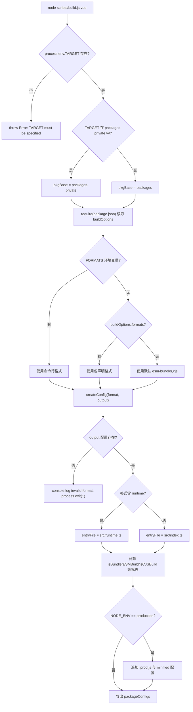

# Capítulo 1: Cognição macro: a filosofia de design de engenharia do repositório core

Antes de começar a rastrear qualquer linha da implementação de reatividade ou do DOM virtual, precisamos primeiro entender o corpo de engenharia no qual esse código vive. Ao abrir o repositório Vue core, a primeira coisa que chama atenção não é a lógica central do framework, mas`package.json`e`pnpm-workspace.yaml`arquivos de configuração de engenharia como esses — eles não contêm nenhuma funcionalidade de tempo de execução, mas determinam se todo o framework pode ser corretamente construído, testado e publicado. Este capítulo responde exatamente a essa questão preliminar: o que é, afinal, o repositório core. Ele não é`@vue/runtime-core`aquele pacote npm, mas sim o corpo de engenharia que abriga`runtime-core`、`reactivity`、`compiler-sfc`e mais de uma dezena de pacotes publicados publicamente, além de pacotes experimentais privados como`sfc-playground`、`template-explorer`. Entender a forma de organização desse corpo é o pré-requisito para todos os capítulos seguintes (build, tipos, publicação, orçamento de tamanho). Este capítulo se desenrola em três linhas principais: a estrutura de diretórios dupla do workspace, a restrição unificada de TypeScript e Rollup no nível raiz, e a filosofia de desacoplamento entre "repositório de código-fonte" e "artefatos de publicação".

# I. Estrutura de diretórios dupla: o isolamento físico entre packages e packages-private

## Modelo intuitivo

Imagine o repositório core como um prédio de P&D.`packages/`é a linha de produtos oficial, e o que é produzido ali deve receber uma marca e ser vendido no mercado;`packages-private/`é o laboratório interno, e as amostras dentro dele servem apenas para depuração e demonstração, nunca para envio externo. Ambos compartilham o mesmo conjunto de água e eletricidade (dependências, ferramentas de build), mas o sistema de controle de acesso (fluxo de publicação) os trata de forma diferente.

Sem essa camada de isolamento físico, um pacote playground usado para depuração interna poderia facilmente ser publicado por engano no npm — isso não é uma hipótese, mas um acidente clássico de monorepo.

## Estrutura de dados e layout de memória

A fronteira do workspace é definida por`pnpm-workspace.yaml`. Ele tem apenas três linhas de declaração efetiva:

[FACT:pnpm-workspace.yaml:1-3]

```yaml
packages:
  - 'packages/*'
  - 'packages-private/*'
```

Esses dois globs dizem ao pnpm:`packages/`e`packages-private/`cada subdiretório sob eles é um pacote independente. O pnpm criará links simbólicos para eles, fazendo com que`@vue/runtime-core`ao referenciar`@vue/reactivity`aponte diretamente para o diretório de código-fonte local, em vez de baixar do registry.

Logo em seguida, a seção`catalog:`é o mecanismo de**diretório de versões de dependências**do pnpm:

[FACT:pnpm-workspace.yaml:5-13]

```yaml
catalog:
  '@babel/parser': ^7.29.8
  '@babel/types': ^7.29.8
  'entities': '^7.0.1'
  'estree-walker': ^2.0.2
  'magic-string': ^0.30.21
  'source-map-js': ^1.2.1
  'vite': ^8.3.0
  '@vitejs/plugin-vue': ^6.0.9
```

No`package.json`raiz, o correspondente escrito é`"@babel/parser": "catalog:"` [FACT:package.json:65-65]。`catalog:`é um placeholder, e o pnpm o substitui durante a instalação pela versão declarada na seção catalog. O ganho disso é:`@babel/parser`a versão de`pnpm-workspace.yaml`é mantida em apenas um lugar,

## , e todos os pacotes que a referenciam se alinham automaticamente, eliminando a deriva de versão do tipo "pacote A usa 7.28, pacote B usa 7.29".`pnpm install`Walkthrough orientado por cenário: o que acontece após um

Suponha que você execute`pnpm install`na raiz do repositório. Colocando-se nesse cenário, rastreie passo a passo:

**Primeiro passo: portão do preinstall.**o pnpm, antes da instalação, dispara o`package.json`do`preinstall`raiz:

[FACT:package.json:45-45]

```json
"preinstall": "npx only-allow pnpm"
```

> **[Design Inference & Architectural Trade-offs]**
> `only-allow pnpm`verifica se o gerenciador de pacotes atual é o pnpm; se não for, ele reporta erro e sai imediatamente. A existência dessa linha de script significa que: instalar o repositório core com npm ou yarn falhará. Por que é obrigatório travar no pnpm? Porque o repositório core depende dos links simbólicos de workspace e do mecanismo de catalog do pnpm, os workspaces do npm não suportam a sintaxe`catalog:`, e o modo PnP do yarn altera os caminhos de resolução de módulos, causando comportamento inconsistente de`createRequire`nos scripts de build.

**Segundo passo: resolver o workspace.**o pnpm lê`pnpm-workspace.yaml`, escaneia`packages/*`e`packages-private/*`, e cria um registro de pacote para cada diretório que contém`package.json`.

**Terceiro passo: aplicar a substituição do catalog.**no`package.json`raiz, todos os`catalog:`Os espaços reservados são substituídos pelas versões reais do segmento catalog e, em seguida, a instalação é unificada.

**Quarto passo: hook postinstall.**Após a conclusão da instalação, é acionado:

[FACT:package.json:46-46]

```json
"postinstall": "simple-git-hooks"
```

`simple-git-hooks`Lê a raiz`package.json`no campo`simple-git-hooks`, gravando os hooks do Git em`.git/hooks/`：

[FACT:package.json:48-51]

```json
"simple-git-hooks": {
  "pre-commit": "pnpm lint-staged && pnpm check",
  "commit-msg": "node scripts/verify-commit.js"
}
```

`pre-commit`O hook executa lint-staged e verificação de tipos antes de cada commit,`commit-msg`O hook valida o formato da mensagem de commit (Vue usa conventional commits). Observe a simetria entre`preinstall`e`postinstall`: o primeiro faz o controle de acesso (permitindo apenas pnpm), o segundo estabelece a defesa (instalando hooks do Git).

## Reflexões de design e armadilhas

> **[Design Inference & Architectural Trade-offs]**
> **Por que usar dois globs em vez de um`packages*/`？**Listar explicitamente dois diretórios torna a semântica de "público" e "privado" visível no nível de configuração. Qualquer novo desenvolvedor que leia`pnpm-workspace.yaml`saberá imediatamente que o repositório tem duas categorias de pacotes. Se fosse escrito como`packages*/`, essa semântica ficaria oculta.

**`allowBuilds`e segurança da cadeia de suprimentos.**Observe esta configuração:

[FACT:pnpm-workspace.yaml:15-21]

```yaml
allowBuilds:
  '@parcel/watcher': true
  '@swc/core': true
  'esbuild': true
  'puppeteer': true
  'simple-git-hooks': true
  'unrs-resolver': true
```

O pnpm proíbe por padrão que pacotes de dependência executem scripts de instalação (postinstall), pois esta é uma entrada comum para ataques à cadeia de suprimentos.`allowBuilds`é uma lista de permissões: apenas os pacotes listados podem executar scripts de build.`@swc/core`、`esbuild`precisa baixar binários nativos específicos da plataforma,`puppeteer`precisa baixar o Chromium,`simple-git-hooks`precisa escrever hooks do Git — todos esses são comportamentos legítimos em tempo de build, portanto são explicitamente permitidos.

**`minimumReleaseAge: 1440`O significado profundo de .**Esta linha de configuração exige que versões recém-publicadas de dependências tenham "pelo menos 24 horas" (1440 minutos) antes de poderem ser instaladas:

[FACT:pnpm-workspace.yaml:33-33]

```yaml
minimumReleaseAge: 1440
```

> **[Design Inference & Architectural Trade-offs]**
> Este é um mecanismo de período de resfriamento para se defender contra envenenamento da cadeia de suprimentos do npm. Depois que um atacante sequestra um pacote e publica uma versão maliciosa, geralmente ela é descoberta e removida em poucas horas. Definir um período de resfriamento de 24 horas permite que o repositório core evite essa janela. Já`minimumReleaseAgeExclude`permite abrir exceções para patches de segurança específicos:

[FACT:pnpm-workspace.yaml:36-38]

```yaml
minimumReleaseAgeExclude:
  # Renovate security update: vitest@4.1.11
  - vitest@4.1.11
```

O comentário deixa claro que esta é uma atualização de segurança acionada pelo Renovate, que precisa entrar em vigor imediatamente, portanto isenta do período de resfriamento.

---

# II. tsconfig raiz: restringir uniformemente as fronteiras de tipo de todos os subpacotes

## Modelo intuitivo

Se cada subpacote mantivesse seu próprio tsconfig, surgiriam fissuras como "o pacote A usa`strict: false`, o pacote B usa`strict: true`". O tsconfig raiz é a**constituição**: ele define as regras de tipo que todos os subpacotes devem seguir em conjunto; os subpacotes só podem adicionar sobre essa base, não podem violá-la.

## Estrutura de dados e layout de memória

A raiz`tsconfig.json`do`compilerOptions`é a base de todo o sistema de tipos do repositório. Destacamos alguns campos-chave:

[FACT:tsconfig.json:5-29]

```json
"target": "es2016",
"module": "esnext",
"moduleResolution": "bundler",
"strict": true,
"noUnusedLocals": true,
"isolatedModules": true,
"isolatedDeclarations": true,
"composite": true,
"paths": {
  "@vue/compat": ["./packages/vue-compat/src"],
  "@vue/*": ["./packages/*/src"],
  "vue": ["./packages/vue/src"]
}
```

Interpretação item a item:

- `target: es2016`: rebaixa a sintaxe de saída para ES2016. Isso ecoa o`target`do esbuild na configuração do Rollup (`isServerRenderer || isCJSBuild ? 'es2019' : 'es2016'` [FACT:rollup.config.js:337-337]）。
- `moduleResolution: bundler`: adota resolução de módulos no estilo bundler, permitindo omitir extensões e suportar o campo`exports`.
- `strict: true`: ativa todas as verificações estritas, incluindo`strictNullChecks`、`noImplicitAny`etc.
- `noUnusedLocals: true`: variáveis locais não utilizadas geram erro diretamente. Esta regra tem significado prático em conjunto com Tree-shaking — variáveis não utilizadas costumam ser um sinal de código morto.
- `isolatedModules: true`: exige que cada arquivo possa ser transpilado independentemente. Este é o pré-requisito para ferramentas como esbuild/swc que "transpilam arquivo por arquivo, sem análise de tipos entre arquivos".
- `isolatedDeclarations: true`: exige que todas as exportações tenham tipo explicitamente anotado. Esta regra serve diretamente ao pipeline de geração de`.d.ts`— apenas com anotação explícita o`tsc`pode gerar arquivos de declaração rapidamente sem fazer inferência completa de tipos.
- `composite: true`: ativa os metadados de build incremental necessários para project references.

`paths`O campo  é o**espelho na camada de tipos**：`@vue/*`do workspace, mapeando para`./packages/*/src`, permitindo que o TypeScript resolva diretamente para o código-fonte em tempo de compilação, em vez de para o link simbólico em`node_modules`. Isso complementa os links simbólicos em tempo de execução do pnpm — em tempo de execução depende-se do pnpm, em tempo de compilação depende-se dos paths.

## Walkthrough orientado por cenário: uma verificação de tipos de`pnpm check`

`check`O script é`tsc --incremental --noEmit` [FACT:package.json:15-15]. Colocando neste cenário:

**Primeiro passo: ler o escopo de include.**O`include`do tsconfig determina quais arquivos participam da verificação:

[FACT:tsconfig.json:31-39]

```json
"include": [
  "packages/global.d.ts",
  "packages/*/src",
  "packages/*/__tests__",
  "packages/vue/jsx-runtime",
  "packages/runtime-dom/types/jsx.d.ts",
  "scripts/*",
  "rollup.*.js"
]
```

Observe que`scripts/*`e`rollup.*.js`também estão no escopo de verificação. Isso significa que os próprios scripts de build também estão sujeitos a restrições de tipo —`rollup.config.js`o`// @ts-check` [FACT:rollup.config.js:1-1]no topo, combinado com anotações de tipo JSDoc, permite que este arquivo puramente JS também seja verificado pelo`tsc`.

**Segundo passo: aplicar a exclusão do exclude.**

[FACT:tsconfig.json:40-40]

```json
"exclude": ["packages-private/sfc-playground/src/vue-dev-proxy*"]
```

> **[Design Inference & Architectural Trade-offs]**
> `sfc-playground`O arquivo`vue-dev-proxy`em  é excluído. Por quê? Arquivos desse tipo geralmente são código proxy gerado dinamicamente em tempo de execução, cuja forma de tipo é instável; incluí-los na verificação geraria ruído.

**Terceiro passo: verificação incremental.** `--incremental`faz com que`tsc`armazene em cache o resultado da verificação anterior em`.tsbuildinfo`, reexaminando apenas os arquivos alterados.`--noEmit`indica verificar sem emitir — verificação de tipos e geração de artefatos são dois pipelines independentes.

## Reflexões de design e armadilhas

**`isolatedDeclarations`Custo e benefício de .**Após ativar esta regra, qualquer exportação deve ter o tipo de retorno explicitamente anotado, por exemplo`export function foo(): number`em vez de`export function foo() { return 1 }`. Isso aumenta o custo de escrita, mas em troca traz um grande aumento na velocidade de geração de`.d.ts`—`tsc`é possível produzir arquivos de declaração sem inferência entre arquivos. Isso ecoa o`build-dts`no script`tsc -p tsconfig.build.json --noCheck`de`--noCheck`: como os tipos já estão explicitamente anotados, ao gerar arquivos de declaração pode-se até pular a verificação.

**`types`Injeção global do campo .**

[FACT:tsconfig.json:21-21]

```json
"types": ["vitest/globals", "puppeteer", "node"]
```

Esses três pacotes de tipos são injetados globalmente, o que significa que arquivos de teste podem usar diretamente`describe`、`it`、`expect`sem import, e testes e2e podem usar diretamente os tipos de`puppeteer`. Este é um trade-off entre conveniência e poluição — quanto mais tipos globais, maior o risco de conflitos de nomes, mas melhor a experiência de escrita do código de teste.

---

# 三、Configuração do Rollup: da buildOptions à fábrica unificada de artefatos multi-formato

## Modelo intuitivo

A configuração do Rollup é a**oficina de montagem final**do repositório core. Ela não se importa com o que cada pacote faz especificamente, apenas com "quais formatos este pacote deve produzir, onde está o arquivo de entrada de cada formato, e quais dependências devem ser externalizadas". O campo`package.json`em`buildOptions`de cada subpacote é a nota de envio colada na encomenda, e a oficina de montagem final trabalha seguindo a nota.

## Estrutura de dados e layout de memória

Logo na entrada do arquivo de configuração, estabelece-se o modelo de "construção por pacote":

[FACT:rollup.config.js:32-44]

```js
if (!process.env.TARGET) {
  throw new Error('TARGET package must be specified via --environment flag.')
}
...
const privatePackages = fs.readdirSync('packages-private')
const pkgBase = privatePackages.includes(process.env.TARGET)
  ? `packages-private`
  : `packages`
const packagesDir = path.resolve(__dirname, pkgBase)
const packageDir = path.resolve(packagesDir, process.env.TARGET)
...
const pkg = require(resolve(`package.json`))
const packageOptions = pkg.buildOptions || {}
const name = packageOptions.filename || path.basename(packageDir)
```

Decisões de design principais:`TARGET`A variável de ambiente especifica qual pacote construir. A configuração usa`fs.readdirSync('packages-private')`para determinar se o pacote pertence ao diretório público ou privado, decidindo assim`pkgBase`. Esta é uma**sondagem de diretório em tempo de execução**——não é necessário manter uma lista de "quais pacotes são privados", a própria estrutura de diretórios é a verdade.

`buildOptions`é um campo personalizado no`package.json`do subpacote,`packageOptions.filename`determina o prefixo do nome do arquivo de artefato,`packageOptions.formats`determina o formato de construção padrão.

O mapeamento de formato para artefato é definido por`outputConfigs`:

[FACT:rollup.config.js:58-88]

```js
const outputConfigs = {
  'esm-bundler': { file: resolve(`dist/${name}.esm-bundler.js`), format: 'es' },
  'esm-browser': { file: resolve(`dist/${name}.esm-browser.js`), format: 'es' },
  cjs:           { file: resolve(`dist/${name}.cjs.js`),         format: 'cjs' },
  global:        { file: resolve(`dist/${name}.global.js`),      format: 'iife' },
  'esm-bundler-runtime': { file: resolve(`dist/${name}.runtime.esm-bundler.js`), format: 'es' },
  'esm-browser-runtime': { file: resolve(`dist/${name}.runtime.esm-browser.js`), format: 'es' },
  'global-runtime':      { file: resolve(`dist/${name}.runtime.global.js`),      format: 'iife' },
}
```

Sete formatos, cobrindo três cenários de consumo:`esm-bundler`para consumo por empacotadores como Vite/webpack,`esm-browser`para consumo de ESM nativo do navegador,`global`para consumo pela tag`<script>`. Os com sufixo`-runtime`são construções "somente runtime", abertas apenas para o pacote`vue`principal.

## Walkthrough orientado a cenários: o fluxo completo de decisão de uma`pnpm build vue`execução

Assumindo a execução do cenário`node scripts/build.js vue`.`TARGET=vue`, rastreando as decisões dentro de`createConfig`:

**Primeiro passo: determinar a lista de formatos.**

[FACT:rollup.config.js:91-92]

```js
const defaultFormats = ['esm-bundler', 'cjs']
const inlineFormats = process.env.FORMATS && process.env.FORMATS.split(',')
const packageFormats = inlineFormats || packageOptions.formats || defaultFormats
const packageConfigs = process.env.PROD_ONLY
  ? []
  : packageFormats.map(format => createConfig(format, outputConfigs[format]))
```

Prioridade: linha de comando`FORMATS`> subpacote`buildOptions.formats`> padrão`['esm-bundler', 'cjs']`。`PROD_ONLY`Se a variável de ambiente for verdadeira, pula construções não-produção, mantendo apenas as configurações`.prod.js`adicionadas posteriormente.

**Segundo passo: calcular as flags de construção.** `createConfig`Internamente, deriva-se um conjunto de flags booleanas a partir da string de formato:

[FACT:rollup.config.js:131-142]

```js
const isProductionBuild = process.env.__DEV__ === 'false' || /\.prod\.js$/.test(output.file)
const isBundlerESMBuild = /esm-bundler/.test(format)
const isBrowserESMBuild = /esm-browser/.test(format)
const isServerRenderer = name === 'server-renderer'
const isCJSBuild = format === 'cjs'
const isGlobalBuild = /global/.test(format)
const isCompatPackage = pkg.name === '@vue/compat'
const isCompatBuild = !!packageOptions.compat
const isBrowserBuild =
  (isGlobalBuild || isBrowserESMBuild || isBundlerESMBuild) &&
  !packageOptions.enableNonBrowserBranches
```

Essas flags são a**fonte única de verdade**para todas as decisões subsequentes: seleção de arquivo de entrada, substituição de define, determinação de external, montagem de plugins, tudo depende delas.

**Terceiro passo: selecionar o arquivo de entrada.**

[FACT:rollup.config.js:159-168]

```js
let entryFile = /runtime$/.test(format) ? `src/runtime.ts` : `src/index.ts`

if (isCompatPackage && (isBrowserESMBuild || isBundlerESMBuild)) {
  entryFile = /runtime$/.test(format)
    ? `src/esm-runtime.ts`
    : `src/esm-index.ts`
}
```

A entrada padrão é`src/index.ts`, construções somente runtime usam`src/runtime.ts`. O pacote compat (`@vue/compat`, ou seja, construção compatível com Vue 2) precisa fornecer exportações default e named simultaneamente, o que faria o Rollup reportar erro para alvos não-ESM, portanto usa-se uma entrada`esm-index.ts` / `esm-runtime.ts`separada para construções ESM.

**Quarto passo: gerar a tabela de substituição de define.** `resolveDefine`Substitui constantes de tempo de compilação como`__DEV__`、`__BROWSER__`no código-fonte por literais:

[FACT:rollup.config.js:170-201]

```js
const replacements = {
  __COMMIT__: `"${process.env.COMMIT}"`,
  __VERSION__: `"${masterVersion}"`,
  __TEST__: `false`,
  __BROWSER__: String(isBrowserBuild),
  __GLOBAL__: String(isGlobalBuild),
  __ESM_BUNDLER__: String(isBundlerESMBuild),
  __ESM_BROWSER__: String(isBrowserESMBuild),
  __CJS__: String(isCJSBuild),
  __SSR__: String(!isGlobalBuild),
  __COMPAT__: String(isCompatBuild),
  __FEATURE_SUSPENSE__: `true`,
  __FEATURE_OPTIONS_API__: isBundlerESMBuild ? `__VUE_OPTIONS_API__` : `true`,
  __FEATURE_PROD_DEVTOOLS__: isBundlerESMBuild ? `__VUE_PROD_DEVTOOLS__` : `false`,
  __FEATURE_PROD_HYDRATION_MISMATCH_DETAILS__: isBundlerESMBuild ? `__VUE_PROD_HYDRATION_MISMATCH_DETAILS__` : `false`,
}
```

Há uma estratificação engenhosa aqui:**as feature flags não são hardcoded nas construções esm-bundler, mas mantidas como identificadores como`__VUE_OPTIONS_API__`**, deixadas para o empacotador do usuário final substituir. Assim o usuário pode desativar o suporte a Options API via`define: { __VUE_OPTIONS_API__: false }`, permitindo Tree-shake do código relacionado. Já nas construções global/esm-browser, essas flags são hardcoded como`true`/`false`, pois os artefatos consumidos diretamente pelo navegador não têm empacotador envolvido.

**Quinto passo: permitir sobrescrita por variáveis de ambiente.**

[FACT:rollup.config.js:208-216]

```js
// allow inline overrides like
//__RUNTIME_COMPILE__=true pnpm build runtime-core
Object.keys(replacements).forEach(key => {
  if (key in process.env) {
    const value = process.env[key]
    assert(typeof value === 'string')
    replacements[key] = value
  }
})
```

Qualquer chave define pode ser sobrescrita por uma variável de ambiente de mesmo nome. O exemplo dado no comentário é`__RUNTIME_COMPILE__=true pnpm build runtime-core`——usado para depurar um branch de compilação específico.

**Sexto passo: montar a cadeia de plugins.**

[FACT:rollup.config.js:324-342]

```js
plugins: [
  json({ namedExports: false }),
  alias({ entries }),
  enumPlugin,
  ...resolveReplace(),
  esbuild({
    tsconfig: path.resolve(__dirname, 'tsconfig.json'),
    sourceMap: output.sourcemap,
    minify: false,
    target: isServerRenderer || isCJSBuild ? 'es2019' : 'es2016',
    define: resolveDefine(),
  }),
  ...resolveNodePlugins(),
  ...plugins,
],
```

A ordem dos plugins importa:`json`primeiro processa importações JSON,`alias`mapeia`@vue/*`para caminhos do código-fonte,`enumPlugin`faz inline de enums,`replace`faz substituição de strings,`esbuild`faz transpilação TS. Note que o`esbuild`de`tsconfig`aponta para o tsconfig raiz——**todos os subpacotes compartilham a mesma configuração de tipos**, o que é exatamente a manifestação em tempo de construção da "constituição" discutida na seção dois.

**Sétimo passo: adição de construção de produção.**Se`NODE_ENV=production`：

[FACT:rollup.config.js:97-114]

```js
if (process.env.NODE_ENV === 'production') {
  packageFormats.forEach(format => {
    if (packageOptions.prod === false) {
      return
    }
    if (format === 'cjs') {
      packageConfigs.push(createProductionConfig(format))
    }
    if (/^(global|esm-browser)(-runtime)?/.test(format)) {
      packageConfigs.push(createMinifiedConfig(format))
    }
  })
}
```

O formato CJS adiciona uma versão`.prod.js`(substituindo por`__DEV__=false`), os formatos global e esm-browser adicionam uma versão minificada (minify com swc).`packageOptions.prod === false`Pacotes

podem optar por sair desse mecanismo.



## Copiar

**`external`Reflexões de design e armadilhas** `resolveExternal`A estratégia de três ramos de

[FACT:rollup.config.js:257-283]

```js
function resolveExternal() {
  const treeShakenDeps = ['source-map-js', '@babel/parser', 'estree-walker', 'entities/decode']

  if (isGlobalBuild || isBrowserESMBuild || isCompatPackage) {
    if (!packageOptions.enableNonBrowserBranches) {
      return treeShakenDeps
    }
  } else {
    return [
      ...Object.keys(pkg.dependencies || {}),
      ...Object.keys(pkg.peerDependencies || {}),
      ...['path', 'url', 'stream'],
      ...treeShakenDeps,
    ]
  }
}
```

Copiar`treeShakenDeps`Construções de navegador (global/esm-browser) fazem inline de todas as dependências, listando apenas`dependencies`como external para suprimir avisos——essas dependências não são realmente referenciadas no branch de navegador, sendo removidas por Tree-shaking. Construções Node/esm-bundler externalizam todos os`peerDependencies`e

**`onwarn`, deixando o consumidor gerenciar as versões das dependências.**

[FACT:rollup.config.js:344-348]

```js
onwarn: (msg, warn) => {
  if (msg.code !== 'CIRCULAR_DEPENDENCY') {
    warn(msg)
  }
},
```

Copiar`runtime-core`Avisos de dependência circular são silenciados. Existe uma referência circular legítima entre`reactivity`e

**`treeshake.moduleSideEffects: false`no Vue (o sistema reativo precisa referenciar o tipo de instância do componente), esses ciclos são seguros em tempo de execução, portanto são filtrados.**

[FACT:rollup.config.js:355-355]

```js
treeshake: {
  moduleSideEffects: false,
},
```

Copiar**Isso diz ao Rollup: todos os módulos não têm efeitos colaterais, importações não referenciadas podem ser removidas com segurança. Esta é uma**suposição agressiva

**——se algum módulo executar código com efeitos colaterais no nível superior (como registrar variáveis globais), ele pode ser removido erroneamente. O código-fonte do Vue garante por convenção que todos os módulos são puros, portanto essa otimização pode ser ativada.`pure_getters`A armadilha de**

[FACT:rollup.config.js:373-388]

```js
async renderChunk(contents, _, { format }) {
  const { code } = await minifySwc(contents, {
    module: format === 'es',
    format: { comments: false },
    compress: { ecma: 2016, pure_getters: true },
    safari10: true,
    mangle: true,
  })
  return { code: banner + code, map: null }
}
```

`pure_getters: true`Copiar`obj.foo`diz ao minificador que "acessos a propriedades não têm efeitos colaterais", podendo remover com segurança chamadas de getter não utilizadas. Isso é perigoso para o código reativo do Vue——`track()`) em vez de efeitos colaterais implícitos de getter, portanto é seguro.`map: null`indica que nenhum sourcemap é gerado após a compressão — artefatos de produção não precisam de mapeamento de depuração.

---

# Reflexão de design: por que o repositório de código-fonte e os artefatos de publicação devem ser desacoplados

Voltando à proposição central deste capítulo. O design de engenharia do repositório core tem uma linha condutora que permeia todo o processo:**A responsabilidade do repositório de código-fonte é "produzir", a responsabilidade dos artefatos de publicação é "consumir", e ambos são desacoplados através do pipeline de build**。

Isso se manifesta concretamente em três níveis:

**Primeiro, o código-fonte não é publicado diretamente.** `package.json`O`private: true` [FACT:package.json:2-2]indica que o pacote raiz nunca é publicado. O`package.json`de cada subpacote`main`/`module`/`exports`campo aponta para`dist/`os artefatos sob, e não`src/`. Quando o usuário instala`vue`, ele recebe o`.js`e o`.d.ts`construídos, enquanto o código-fonte permanece no repositório.

**Segundo, o formato dos artefatos é determinado pelo cenário de consumo.**Os sete formatos não são uma listagem arbitrária, mas correspondem a sete caminhos reais de consumo: usuários do Vite recebem`esm-bundler`, usuários de CDN recebem`global`, usuários de Node SSR recebem`cjs`. A lógica de seleção de formato está centralizada em`rollup.config.js`um único lugar, e os subpacotes só precisam declarar em`buildOptions.formats`quais são necessários.

**Terceiro, tipos e implementação são separados.** `build-dts`O script`tsc -p tsconfig.build.json --noCheck && rollup -c rollup.dts.config.js` [FACT:package.json:9-9]indica que`.d.ts`a geração é um pipeline independente.`isolatedDeclarations: true`permite que a geração de arquivos de declaração pule a verificação de tipos (`--noCheck`), porque os tipos já estão explicitamente anotados.

> **[Design Inference & Architectural Trade-offs]**
> A motivação profunda desse desacoplamento é:**A forma de organização do código-fonte serve ao desenvolvedor, a forma de organização dos artefatos serve ao consumidor, e as soluções ótimas de ambos são diferentes**. O código-fonte precisa de uma estrutura de diretórios clara, informações completas de tipos, sourcemaps depuráveis; os artefatos precisam de volume mínimo, formato de módulo correto, superfície de API estável. Forçar a unificação de ambos (por exemplo, publicar diretamente o código-fonte TS) prejudicaria a experiência de ambos os lados.

---

# Resumo do capítulo

Este capítulo estabeleceu uma compreensão macro do repositório core a partir de três dimensões:

1. **Estrutura de diretórios dupla**：`packages/`e`packages-private/`o isolamento físico, combinado com os symlinks do pnpm workspace e o catálogo de versões, realiza uma fronteira clara entre "pacotes públicos" e "pacotes privados".`preinstall`O gate de`allowBuilds`, a whitelist de`minimumReleaseAge`, e o período de resfriamento de

2. **juntos formam a linha de defesa de segurança da cadeia de suprimentos.**tsconfig de nível raiz`paths`: como a constituição de tipos de todos os subpacotes, através do mapeamento de`isolatedDeclarations`realiza a resolução de workspace em tempo de compilação, através de`composite`e

3. **suporta build incremental e geração rápida de arquivos de declaração.**Fábrica unificada Rollup`TARGET`: tendo a variável de ambiente`buildOptions`como ponto de entrada, lê metainformações dos subpacotes através de

, e através de um conjunto de flags booleanas direciona a seleção de entrada, substituição de define, determinação de external e montagem de plugins, produzindo finalmente artefatos em sete formatos.**A filosofia central é**o desacoplamento entre repositório de código-fonte e artefatos de publicação

---

# : o repositório é responsável pela produção, os artefatos são responsáveis pelo consumo, e o pipeline de build é a única ponte entre ambos.

Transição para o próximo capítulo`scripts/build.js`Este capítulo respondeu "o que é o repositório core". Mas a estrutura estática do repositório é apenas o palco; o verdadeiro drama acontece durante a execução de uma requisição de build:

# como analisar argumentos de linha de comando, como chamar a API do Rollup, como lidar com falhas de build e concorrência. O próximo capítulo rastreará a jornada ponta a ponta de uma requisição de build desde a entrada até o artefato, transformando a compreensão estática estabelecida neste capítulo em uma visão dinâmica de execução.

Reflexões e autoavaliação deste capítulo`pnpm-workspace.yaml`Q1: Se em`minimumReleaseAge: 1440`o`0`fosse alterado para`minimumReleaseAgeExclude`, que riscos seriam introduzidos no cenário de atualização de dependências? Por que a existência de

**é necessária?**：

`minimumReleaseAge: 1440` [FACT:pnpm-workspace.yaml:33-33]Análise de referência`0`exige que versões recém-publicadas de dependências só possam ser instaladas após 24 horas. Se fosse alterado para

, qualquer versão recém-publicada poderia ser imediatamente puxada.`@babel/parser`Cenário de risco: um atacante compromete alguma dependência transitiva (por exemplo, alguma versão patch de

`minimumReleaseAgeExclude` [FACT:pnpm-workspace.yaml:36-38]), publicando uma versão com script postinstall malicioso. Durante o período de resfriamento de 24 horas, a comunidade geralmente descobre o problema e remove a versão; se o período de resfriamento fosse 0, o CI do repositório core poderia atualizar automaticamente e executar o script malicioso dentro da janela de ataque.`vitest@4.1.11`A existência de

Q2: `rollup.config.js`se deve ao fato de que o mecanismo de período de resfriamento entra em conflito com a urgência de patches de segurança. O`resolveDefine`no comentário é uma atualização de segurança detectada pelo Renovate — esse tipo de atualização precisa entrar em vigor imediatamente, e esperar 24 horas na verdade prolonga a janela de exposição. Portanto, é necessária uma lista explícita de isenções para que atualizações de segurança contornem o período de resfriamento. Isso reflete o princípio de design de segurança "padrão conservador, exceções explícitas".`__FEATURE_OPTIONS_API__`Em`isBundlerESMBuild ? '__VUE_OPTIONS_API__' : 'true'`, o tratamento de`'true'`para

**é**：

[FACT:rollup.config.js:192-194]

```js
__FEATURE_OPTIONS_API__: isBundlerESMBuild
  ? `__VUE_OPTIONS_API__`
  : `true`,
```

para todos os formatos, que impacto isso teria no usuário final?`__FEATURE_OPTIONS_API__`Análise de referência`__VUE_OPTIONS_API__`Copiar`define: { __VUE_OPTIONS_API__: false }`No build esm-bundler,`data`、`methods`、`computed`é mantido como o identificador

, deixado para o bundler do usuário final substituir. O usuário pode definir`'true'`em sua própria configuração de build, permitindo que o Tree-shaking remova todo o código relacionado à Options API (a lógica de tratamento de opções como`define`), reduzindo significativamente o volume do artefato.

Se fosse alterado para retornar**para todos os formatos, o código da Options API no artefato esm-bundler seria mantido de forma hardcoded, a configuração**do usuário deixaria de funcionar, e não seria possível fazer Tree-shake. Para um projeto que usa apenas Composition API, isso adicionaria desnecessariamente vários KB ao volume do artefato.

Q3: `rollup.config.js`de`resolveExternal`, a construção do navegador retorna apenas`treeShakenDeps`como external, enquanto a construção Node retorna todos os`dependencies`. Suponha que um dia alguém adicione uma nova dependência de runtime`runtime-core`, mas esqueça de atualizar`foo-lib`a lógica de`resolveExternal`. O que acontecerá na construção do navegador?

**Análise de referência**：

[FACT:rollup.config.js:257-283]

A construção do navegador (`isGlobalBuild || isBrowserESMBuild`) em`!packageOptions.enableNonBrowserBranches`retorna apenas`treeShakenDeps`（`source-map-js`、`@babel/parser`、`estree-walker`、`entities/decode`). Isso significa que`foo-lib`não está na lista de external,

Até aqui, já vimos em nível macro a filosofia de design geral do repositório core como matriz de engenharia: a estrutura de workspace com dois diretórios delimita a fronteira entre pacotes públicos e pacotes experimentais privados, as configurações TypeScript e Rollup no nível raiz fornecem restrições unificadas, e o desacoplamento entre o repositório de código-fonte e os artefatos de publicação torna possível a saída em múltiplos formatos. Essas percepções abrem caminho para o aprofundamento posterior nos elos concretos de engenharia. No próximo capítulo, desviaremos o olhar da estrutura estática para o fluxo dinâmico, tomando`node scripts/build.js vue`como ponto de partida, rastreando a jornada ponta a ponta de uma requisição completa de build, desde a análise de argumentos de linha de comando, localização do pacote-alvo, geração da configuração Rollup até a gravação dos artefatos em disco, para ver como build.js analisa flags como formats/devOnly/release via parseArgs, como faz require dinâmico do package.json do pacote-alvo e lê buildOptions, e finalmente impulsiona rollup.config.js a produzir artefatos em múltiplos formatos como esm-bundler, cjs e global.
