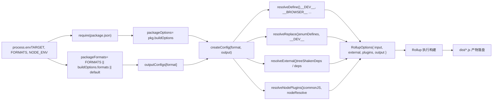

# Capítulo 2: Ciclo de vida do tronco principal: a jornada ponta a ponta de uma requisição de build

No capítulo anterior, esclarecemos a posição do repositório core como matriz de engenharia e como o pnpm workspace e as configurações no nível raiz restringem uniformemente todos os subpacotes. Agora, vamos nos aprofundar no núcleo do sistema de build e rastrear como um comando impulsiona todo o fluxo de build.`node scripts/build.js vue`parece simples, mas é a única entrada para todos os artefatos — esm-bundler, cjs, global. Entender como ele traduz a intenção do usuário em tarefas de build executáveis é um passo fundamental para dominar o mecanismo de build do Vue.

# Geração da configuração Rollup: de variáveis de ambiente a artefatos em múltiplos formatos

`build.js`via`exec`inicia o Rollup, o controle passa para`rollup.config.js`. Este arquivo é o "cérebro" do sistema de build — ele lê variáveis de ambiente e gera dinamicamente um array de objetos de configuração Rollup.

## Validação de variáveis de ambiente e localização de pacotes

[FACT:rollup.config.js:27-29]

Se`TARGET`não estiver definido, lança erro diretamente. Isso é programação defensiva: a configuração Rollup pode ser chamada diretamente (como`rollup -c`), e nesse momento não há`build.js`injetando variáveis de ambiente, então é preciso falhar rapidamente.

[FACT:rollup.config.js:32-44]

Aqui se repete a lógica de determinação de pacote privado em`build.js`— porque`rollup.config.js`é um processo independente e não pode compartilhar o estado em memória de`build.js`.`resolve`A função resolve caminhos relativos para caminhos absolutos dentro do diretório do pacote,`pkg`é o conteúdo de`package.json`do pacote-alvo,`packageOptions`é o campo`buildOptions`dentro dele,`name`é o prefixo do nome do arquivo de artefato (prioriza`buildOptions.filename`, caso contrário usa o nome do diretório).

## Tabela de mapeamento de formatos:`outputConfigs`

[FACT:rollup.config.js:58-88]

Esta tabela define o mapeamento de 7 formatos para configurações de saída. Observações-chave:

- `esm-bundler`、`esm-browser`、`esm-bundler-runtime`、`esm-browser-runtime`são todos`format: 'es'`, a diferença está apenas no nome do arquivo.
- `cjs`é`format: 'cjs'`。
- `global`e`global-runtime`é`format: 'iife'`(expressão de função imediatamente invocada), adequado para introdução direta via tag`<script>`.
- `runtime`Formatos com sufixo só fazem sentido para o pacote principal`vue`— eles não incluem o compilador e têm tamanho menor.

## Seleção de formato: três níveis de prioridade

[FACT:rollup.config.js:91-92]

A seleção de formato segue três níveis de prioridade: linha de comando`FORMATS`variável de ambiente > do pacote`buildOptions.formats`> padrão`['esm-bundler', 'cjs']`。`PROD_ONLY`A variável de ambiente controla se a configuração base é ignorada — se apenas a versão de produção for construída, o array de configuração base fica vazio e, em seguida, apenas a configuração de produção é adicionada.

## Lógica de adição da configuração de produção

[FACT:rollup.config.js:97-114]

Quando`NODE_ENV === 'production'`, para cada formato:

- Se`packageOptions.prod === false`, pula (o pacote não precisa de versão de produção).
- Se for`cjs`, adiciona`createProductionConfig`— gera o arquivo`.prod.js`.
- Se corresponder a`/^(global|esm-browser)(-runtime)?/`, adiciona`createMinifiedConfig`— gera a versão minificada.

> **[Design Inference & Architectural Trade-offs]**
> Por que`cjs`usa`createProductionConfig`enquanto`global`/`esm-browser`usa`createMinifiedConfig`? Porque CJS é para Node, e o ambiente Node não precisa de minificação (o usuário cuidará disso), mas precisa distinguir os ramos dev/prod; já os artefatos introduzidos diretamente no navegador precisam ser minificados para reduzir tamanho. Essa diferença se reflete na implementação das duas funções de fábrica.

## `createConfig`: o núcleo da geração de configuração

`createConfig`é a maior função; ela recebe formato e configuração de saída e retorna o objeto completo de configuração Rollup.

[FACT:rollup.config.js:125-142]

No início há uma série de cálculos de flags booleanas:

- `isProductionBuild`: determinado via`__DEV__`variável de ambiente ou se o nome do arquivo contém`.prod.js`.
- `isBundlerESMBuild`、`isBrowserESMBuild`、`isCJSBuild`、`isGlobalBuild`: correspondência por regex no nome do formato.
- `isServerRenderer`: se o nome do pacote é`server-renderer`。
- `isCompatPackage`、`isCompatBuild`: relacionado à construção compatível com Vue 2.
- `isBrowserBuild`: construção global ou construção ESM para navegador, e sem habilitar o ramo não-navegador.

Essas flags são usadas repetidamente no`resolveDefine`、`resolveReplace`、`resolveExternal`subsequente e são a base central para a diferenciação das configurações.

[FACT:rollup.config.js:144-157]

Configurações básicas de saída: cabeçalho de copyright no banner, modo`exports`(pacotes compat usam`auto`, os demais usam`named`), construção CJS habilita interoperabilidade`esModule`, sourcemap controlado por variável de ambiente,`externalLiveBindings: false`e`reexportProtoFromExternal: false`são configurações de compatibilidade do Rollup 4. A construção global define adicionalmente`output.name`, ou seja, o nome da variável montada em`window`.

## Seleção do arquivo de entrada

[FACT:rollup.config.js:159-168]

A entrada padrão é`src/index.ts`, mas formatos com sufixo`runtime`usam`src/runtime.ts`。A build ESM do pacote compat precisa exportar tanto default quanto named, então usa uma entrada`esm-index.ts` / `esm-runtime.ts`separada.

## Definições de macro:`resolveDefine`

[FACT:rollup.config.js:170-218]

`resolveDefine`Retorna uma tabela de substituição, substituindo no código-fonte`__COMMIT__`、`__VERSION__`、`__BROWSER__`e outras macros por literais. Essas macros são usadas no código-fonte para compilação condicional — por exemplo`if (__DEV__) { ... }`em builds de produção é substituído por`if (false) { ... }`, e então removido pelo Tree-shaking.

Design principal:`__FEATURE_OPTIONS_API__`、`__FEATURE_PROD_DEVTOOLS__`e outros feature flags são mantidos em builds`esm-bundler`como identificadores`__VUE_OPTIONS_API__`, permitindo que usuários finais os sobrescrevam via configuração do bundler; enquanto em outros builds são codificados diretamente como`true`ou`false`。

[FACT:rollup.config.js:203-206]

builds não`esm-bundler`codificam diretamente`__DEV__`, porque seus ramos dev/prod já são determinados em tempo de build.

[FACT:rollup.config.js:210-216]

A última etapa permite que variáveis de ambiente sobrescrevam qualquer definição de macro, suportando`__RUNTIME_COMPILE__=true pnpm build runtime-core`sobrescritas inline como essa.

## Plugin de substituição:`resolveReplace`

[FACT:rollup.config.js:222-255]

`resolveReplace`Processa fora do`resolveDefine`substituições que o esbuild não consegue processar:

- Mescla`enumDefines`(definições de inline de enum provenientes de`inlineEnums`).
- Em builds de produção para navegador, adiciona anotação`/*@__PURE__*/`às funções de criação de erro, auxiliando o Tree-shaking.
- `esm-bundler`Em builds`__DEV__`, substitui`!!(process.env.NODE_ENV !== 'production')`por
- , deixando o bundler decidir.`process.env`Em builds ESM para navegador, substitui

## por um objeto vazio, evitando erros no navegador.`resolveExternal`

[FACT:rollup.config.js:257-283]

Dependências externas:`treeShakenDeps`Este é o núcleo da questão de reflexão no final do capítulo anterior. O build para navegador retorna apenas`dependencies`como external — essas dependências, embora importadas, não serão realmente executadas no ramo do navegador; são listadas aqui apenas para suprimir avisos do Rollup. Os builds Node/ESM-bundler externalizam todos`peerDependencies`e`path`、`url`、`stream`, bem como módulos internos do Node como

## .

[FACT:rollup.config.js:319-352]

Objeto de configuração final

- `input`O objeto de configuração retornado contém:
- `external`: caminho absoluto do arquivo de entrada.
- `plugins`: lista de dependências externas.
- `output`: array de plugins, na ordem json → alias → enumPlugin → replace → esbuild → nodePlugins.
- `onwarn`: configuração de saída.`CIRCULAR_DEPENDENCY`: filtra avisos
- `treeshake.moduleSideEffects: false`(existem dependências circulares no código-fonte do Vue, mas são inofensivas em tempo de execução).

: informa ao Rollup que todos os módulos não têm efeitos colaterais, Tree-shaking agressivo.

# Copiar

## `exec`Gravação de artefatos em disco e verificação de tamanho

`build.js`Gerenciamento de processos de`exec`Inicia o subprocesso do Rollup através de

[FACT:scripts/utils.js:64-114]

`exec`:`spawn`encapsula

- `stdio`, retornando uma Promise. Design principal:`['ignore', 'pipe', 'pipe']`o padrão é
- `shell: process.platform === 'win32'`— stdin ignorado, stdout/stderr capturados por pipe.
- — no Windows é necessário shell para analisar corretamente o comando.`stderrChunks`Coleta a saída através dos arrays`stdoutChunks`e`exit`, concatenando no evento
- .

> **[Design Inference & Architectural Trade-offs]**
> 〔Inferência de design e trade-offs arquiteturais〕`build.js`Note que`exec`ao chamar`{ stdio: 'inherit' }`passa

## , o que sobrescreve a configuração padrão de pipe, fazendo a saída do Rollup ser transmitida diretamente ao terminal. Este é o comportamento correto de uma ferramenta de build — o usuário precisa ver o progresso do build em tempo real.`checkAllSizes`

[FACT:scripts/build.js:206-215]

Verificação de tamanho:`devOnly`A verificação de tamanho tem duas condições de skip:`global`é verdadeiro, ou um formato foi especificado mas não contém

[FACT:scripts/build.js:222-228]

`checkSize`. Porque a verificação de tamanho é apenas para artefatos de build global — esses são os arquivos que o usuário final importa diretamente, e o tamanho é mais sensível.`${target}.global.prod.js`Verifica dois arquivos:`${target}.runtime.global.prod.js`e`global-runtime`(o último só é verificado quando nenhum formato é especificado ou

[FACT:scripts/build.js:235-264]

`checkFileSize`é especificado).`gzipSync`Lê o arquivo, calcula o tamanho comprimido com`brotliCompressSync`e`prettyBytes`, formata a saída com`writeSize`. Se`temp/size/${fileName}.json`for verdadeiro, grava o resultado em

## — esta é a fonte de dados para a verificação de orçamento de tamanho no CI.

[FACT:scripts/build.js:94-108]

Construção de declarações de tipo`buildTypes`Se`pnpm run build-dts`for verdadeiro, chama`--environment TARGETS:...`, passando a lista de alvos através de

# . Isso garante que declarações de tipo sejam geradas apenas para os pacotes realmente construídos.

**Reflexões de design e armadilhas em produção`--environment`Por que usar**em vez de passar parâmetros diretamente?`--environment`O`process.env`do Rollup é a única forma de passar parâmetros que pode ser lida no arquivo de configuração através de`--config`. Passar diretamente o parâmetro`process.argv`requer analisar`--environment`, enquanto

**`fuzzyMatchTarget`fornece análise estruturada de pares chave-valor.** `target.match(partialTarget)`A armadilha de regex em`partialTarget`.`runtime-core`，`-`Em`runtime.core`，`.`, o

**é entrada do usuário. Se o usuário inserir** `runParallel`, é literal na regex, sem problema; mas se inserir`cpus().length`, corresponderá a qualquer caractere, podendo corresponder a alvos inesperados. Este é o risco inerente da correspondência difusa, mas os nomes de pacotes do Vue não contêm caracteres especiais de regex, então na prática não é acionado.`--max-old-space-size`Competição de recursos em builds concorrentes.

**`scanEnums`Usa** `removeCache`como limite de concorrência, mas cada processo Rollup em si também inicia workers. Em contêineres de CI com poucos núcleos, isso pode causar estouro de memória. Em produção, se ocorrer OOM, pode ser mitigado através de`finally`ou reduzindo a concorrência.`scanEnums`Ciclo de vida do cache de`removeCache`.`finally`É chamado em`scanEnums`, mas se`try`em si lançar erro,

**`resolveExternal`não será atribuído, e a chamada em**falhará. Na prática, a função retornada por`runtime-core`já está determinada antes de`resolveExternal`, então esse risco não existe — mas este é um detalhe de temporização que precisa ser confirmado durante a leitura.

# Risco de omissão em

.`node scripts/build.js vue`A questão de reflexão do capítulo anterior já apontou: se adicionar uma nova dependência a

1. `parseArgs`mas esquecer de atualizar`commit`, o build para navegador incluirá essa dependência no bundle (porque não está na lista external), causando aumento de tamanho. Este é o custo inerente da estratégia de "whitelist external".

2. `run()`Resumo do capítulo`scanEnums`A jornada completa de um`fuzzyMatchTarget`:`allTargets`）。

3. `buildAll`analisa a linha de comando,`runParallel`obtido sincronamente.`build`。

4. `build`Chama`package.json`para gerar o cache de enum, analisa os alvos (`dist`ou`--environment`através de`exec`Iniciar o Rollup.

5. `rollup.config.js`Ler as variáveis de ambiente, através de`createConfig`Gerar o array de configuração,`resolveDefine`/`resolveReplace`/`resolveExternal`Processar separadamente macros, substituições e dependências externas.

6. O Rollup executa a build, os artefatos são gravados em disco em`dist/`。

7. `checkAllSizes`Calcular o tamanho gzip/brotli, opcionalmente escrever em`temp/size/`。

8. Se`--withTypes`, chamar`build-dts`Gerar as declarações de tipo.

# Reflexões e autoavaliação deste capítulo

Q1: Em`build.js`da`build`função`if (!formats && fs.existsSync(...))`esta condição determina se deve excluir`dist`diretório. Se remover`!formats`esta condição (ou seja, excluir independentemente do formato especificado`dist`), em`pnpm build-all-cjs`um script como este, o que aconteceria?

**Análise de referência**：

[FACT:scripts/build.js:172-175]

`pnpm build-all-cjs`Corresponde a`node scripts/build.js vue runtime compiler reactivity shared -af cjs`(ver[FACT:package.json:40]). Ele especifica`-f cjs`, portanto`formats`é`'cjs'`，`!formats`é falso, a lógica atual não excluirá`dist`。

Se remover`!formats`, cada build irá excluir`dist`. Mas`build-all-cjs`apenas constrói`cjs`formato, após a exclusão`dist`restará apenas`cjs`artefatos, os anteriormente construídos`esm-bundler`、`global`e outros formatos serão todos perdidos. Mais grave ainda,`build-runtime-esm`、`build-browser-esm`e outros scripts serão executados em sequência (ver[FACT:package.json:39]do`build-sfc-playground`script), cada script irá excluir os artefatos do script anterior, resultando em`dist`contendo apenas o formato do último script. Isso quebraria a build do SFC Playground — ele precisa que múltiplos formatos de artefatos existam simultaneamente.

Q2: `runParallel`Em`if (maxConcurrency <= source.length)`qual é a função desta condição? Se removê-la, ao construir um único pacote (`targets.length === 1`) o que aconteceria?

**Análise de referência**：

[FACT:scripts/build.js:131-151]

Esta condição controla se o limitador de concorrência é habilitado. Quando`maxConcurrency > source.length`, não é necessário limitar — todas as tarefas podem iniciar simultaneamente. Se remover esta condição, mesmo com apenas uma tarefa, será criado`executing`array e executado`await Promise.race(executing)`。

Para uma única tarefa,`executing`há apenas uma Promise`e`，`Promise.race`que aguardará sua conclusão. Isso não causaria erro, mas introduziria cadeias de Promise e overhead de agendamento de microtarefas desnecessários. Mais importante,`executing.splice(executing.indexOf(e), 1)`ainda funciona corretamente no cenário de tarefa única, então funcionalmente não há diferença, apenas uma pequena perda de desempenho.

O risco real está em: se`maxConcurrency`for 0 (teoricamente impossível, pois`cpus().length`é no mínimo 1),`executing.length >= 0`seria sempre verdadeiro,`Promise.race([])`ficaria suspenso para sempre. Mas`cpus().length`garante que este limite não será acionado.

Q3: `resolveExternal`Em`treeShakenDeps`, a build do navegador retorna

**como external, mas essas dependências não serão realmente executadas no branch do navegador. Se removê-las da lista external (ou seja, deixar o Rollup tentar empacotá-las), o que aconteceria?**：

[FACT:rollup.config.js:257-283]

`treeShakenDeps`Análise de referência`source-map-js`、`@babel/parser`、`estree-walker`、`entities/decode`contém`compiler-sfc`. Estas são`__BROWSER__`dependências de pacotes como

, excluídas por compilação condicional através da macro`treeshake.moduleSideEffects: false`（[FACT:rollup.config.js:355-355]na build do navegador.`if (!__BROWSER__)`Se removidas do external, o Rollup tentaria resolver e empacotar essas dependências. Como`__BROWSER__`), e as instruções de importação dessas dependências estão localizadas em`true`branch, o define do esbuild substituiria

por`onwarn`, fazendo o branch ser marcado como código morto. O Tree-shaking do Rollup removeria essas importações, e o artefato final não conteria o código dessas dependências.

Mas o problema é: o Rollup precisa resolver os módulos antes do Tree-shaking. Se essas dependências não estiverem instaladas (por exemplo, em um ambiente CI enxuto), o Rollup reportaria um erro de "não foi possível resolver o módulo". Listá-las como external é uma medida defensiva — mesmo que as dependências não existam, o Rollup não tentará resolvê-las, apenas emitirá um aviso (e`scripts/dev.js`filtraria avisos de dependências não circulares).
