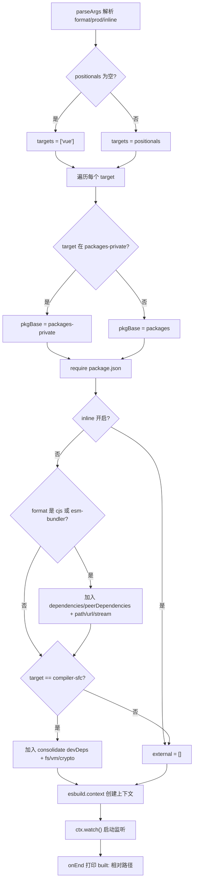
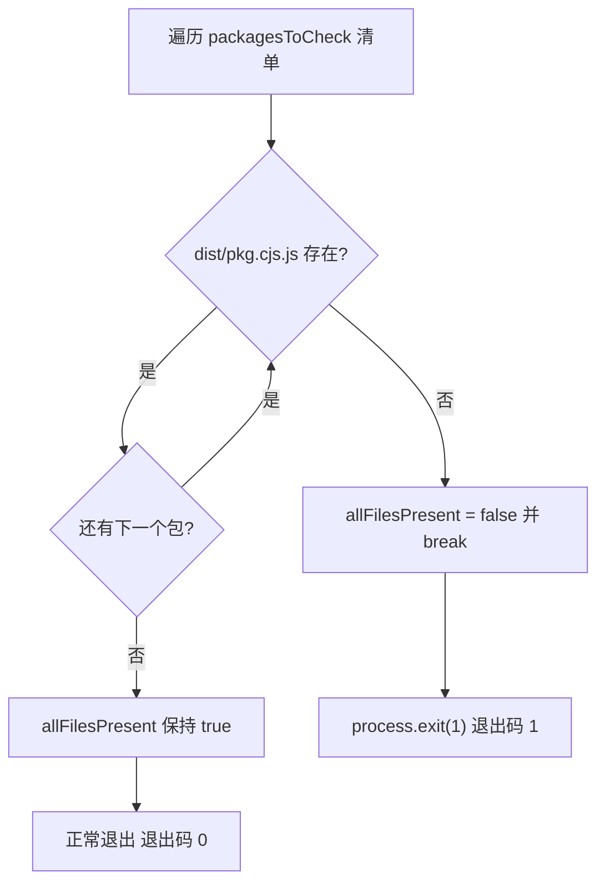
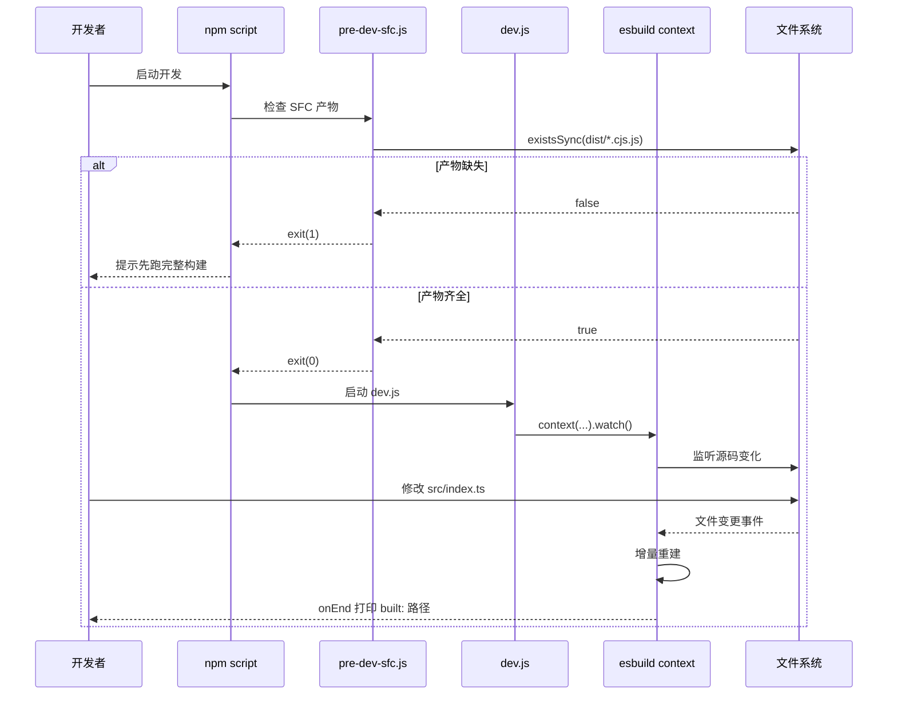

# Voltar ao topo ↑

Progresso do livro: Capítulo 3 / 14`scripts/dev.js`Status de verificação: Linhas FACT com ancoragem real`scripts/pre-dev-sfc.js`No capítulo anterior, rastreamos a cadeia completa da build de produção, desde a análise de parâmetros até a gravação de artefatos em múltiplos formatos, uma cadeia que busca a completude e padronização dos artefatos. Já a demanda central do fluxo de desenvolvimento é apenas uma: alterar uma linha de código e ver o efeito imediatamente no navegador. A cadeia da build de produção — "analisar parâmetros → gerar configuração → empacotar tudo → gravar em disco" — leva dezenas de segundos, incapaz de atender a essa demanda. O repositório do Vue core mantém, para isso, uma cadeia independente de desenvolvimento:

# usar o modo watch do esbuild para build incremental,

## pré-compilar o compilador de SFC antes da build principal. Este capítulo disseca o mecanismo de colaboração entre os dois.

3.1 dev.js: o construtor incremental que troca velocidade pelo esbuild[FACT:scripts/dev.js:3-5]

Modelo intuitivo

## A build de produção é como "a gráfica fazendo a composição formal para impressão" — qualidade em primeiro lugar, ser mais lento não importa; a build de desenvolvimento é como "um esboço a lápis no rascunho" — sem buscar refinamento, apenas que apareça assim que a caneta tocar o papel. O Vue escolhe o esbuild em vez do Rollup para fazer esse esboço, e o motivo está escrito no comentário no início do arquivo: os artefatos do Rollup são menores e o Tree-shaking é melhor, mas o esbuild é muito mais rápido.

Sem este script, o desenvolvedor teria que rodar uma build de produção completa a cada alteração, e o ciclo de feedback degradaria de milissegundos para minutos, destruindo completamente a experiência de hot update.`parseArgs`Análise de parâmetros e derivação de formato`format`A entrada do script usa o`global`）、`prod`nativo do Node para analisar três opções:`false`）、`inline`(padrão`false`）。[FACT:scripts/dev.js:18-40]parâmetros posicionais são coletados como`targets`, se vazio então o padrão é`['vue']`。[FACT:scripts/dev.js:42-53]

> **[Design Inference & Architectural Trade-offs]**
> Há um detalhe fácil de ignorar aqui:`rawFormat`e`format`são duas atribuições.`parseArgs`de`default: 'global'`já garante que`rawFormat`tem valor, mas o script ainda escreveu`const format = rawFormat || 'global'`como fallback.[FACT:scripts/dev.js:42]Isso é uma escrita defensiva, para evitar que`parseArgs`mudanças de comportamento ou passagem explícita de string vazia façam o`format.startsWith`downstream lançar erro.

`format`O mapeamento para o formato de saída do esbuild tem três ramos: começando com`global`mapeia para`iife`, igual a`cjs`mapeia para`cjs`, todo o resto`esm`。[FACT:scripts/dev.js:42-53]O sufixo do nome do arquivo de saída é tratado separadamente pelo sufixo`-runtime`:`global-runtime`se torna`runtime.global`, o restante permanece como está.[FACT:scripts/dev.js:42-53]

## Localização do pacote alvo e caminho de saída

O script primeiro lê`packages-private`a lista de diretórios, para determinar se o pacote alvo pertence a pacote público ou privado.[FACT:scripts/dev.js:56]Para cada target, decide se o caminho base do pacote é`packages`ou`packages-private`, depois`require`seu`package.json`para obter`version`e`buildOptions`。[FACT:scripts/dev.js:58-63]

O nome do arquivo de saída tem um caso especial:`vue-compat`o target será renomeado para`vue`, para evitar que o artefato se chame`vue-compat.global.js`。[FACT:scripts/dev.js:64-69]O caminho final tem a forma`packages/vue/dist/vue.global.js`，`prod`quando verdadeiro, insere`prod.`o segmento.

## Resolução de external: evitar empacotar dependências no artefato

`external`O array determina quais módulos não serão empacotados. A lógica é dividida em duas camadas:

Primeira camada, quando`inline`não está ativado e o formato é`cjs`ou contém`esm-bundler`, adiciona todas as chaves de`dependencies`、`peerDependencies`ao external, e codifica fixamente`path`、`url`、`stream`três módulos internos do Node.[FACT:scripts/dev.js:76-88]O comentário explica claramente que esses três são para`@vue/compiler-sfc`e`server-renderer`.

Segunda camada, para o target`compiler-sfc`, resolve adicionalmente`@vue/consolidate`o`devDependencies`de`fs`、`vm`、`crypto`, colocando-os junto com[FACT:scripts/dev.js:90-112]etc. como external.`react-dom/server`、`teacup/lib/express`、`arc-templates/dist/es5`、`then-pug`、`then-jade`O código também codifica fixamente caminhos de template engines como

> **[Design Inference & Architectural Trade-offs]**
> 〔Inferência de design e trade-offs arquiteturais〕`rollup.config.js`Este trecho de lógica é altamente duplicado com`TODO this logic is largely duplicated from rollup.config.js`, os comentários do código-fonte também admitem isso (

## ). A razão de não extrair uma função comum é que as estratégias de external de dev e prod têm diferenças sutis (dev é mais agressivo em externalizar para acelerar o build), forçar a unificação aumentaria o acoplamento.

Plugins e injeção de define`log-rebuild`O array de plugins tem por padrão apenas um`onEnd`, no hook[FACT:scripts/dev.js:115-124]imprime o caminho relativo do artefato de build.

> **[Design Inference & Architectural Trade-offs]**
> 〔Inferência de design e trade-offs arquiteturais〕`cjs`O segundo plugin é condicional: quando o formato não é`buildOptions.enableNonBrowserBranches`e o`polyfillNode()`。[FACT:scripts/dev.js:126-128]do pacote é verdadeiro, monta`compiler-sfc`Pacotes como este (ex:

`define`) ainda seguem o ramo Node em builds de navegador, precisam de polyfill de módulos internos do Node para rodar no ambiente de navegador.[FACT:scripts/dev.js:141-159]O bloco é a parte de maior densidade de informação deste capítulo.`__XXX__`Ele substitui todas as macros

- `__COMMIT__`no código-fonte por literais:`"dev"`，`__VERSION__`fixado como
- `__DEV__`pega a versão do pacote;`prod`determinado pela flag`__TEST__`,`false`；
- `__BROWSER__`sempre é`format !== 'cjs' && !pkg.buildOptions?.enableNonBrowserBranches`。[FACT:scripts/dev.js:146-148]A derivação de é a mais sutil:
- `__SSR__`Ou seja, apenas "não cjs e o pacote não suporta ramo não-navegador" é marcado como ambiente de navegador;`format !== 'global'`é
- `__COMPAT__`, ou seja, builds global não ativam o ramo SSR;`vue-compat`determinado por se o target é
- ;`__FEATURE_SUSPENSE__`、`__FEATURE_OPTIONS_API__`、`__FEATURE_PROD_DEVTOOLS__`、`__FEATURE_PROD_HYDRATION_MISMATCH_DETAILS__`três feature flags (

) são todos fixados no modo dev.`vitest.config.ts`Essas macros correspondem um a um com o bloco`define`em[FACT:vitest.config.ts:6-21].`__TEST__`O ambiente de teste define`true`、`__DEV__`como`true`como

## , a diferença com o build dev é exatamente o ponto de distinção entre os dois estados de execução "teste vs desenvolvimento".

Inicialização do modo watch`esbuild.context(...).then(ctx => ctx.watch())`。[FACT:scripts/dev.js:130-161] `context`O último passo é`watch()`criar o contexto de build mas não executar imediatamente,`onEnd`só então realmente inicia o monitoramento de arquivos. Depois disso o esbuild mantém internamente o grafo de dependências, qualquer mudança em arquivo dependido dispara rebuild incremental, o callback de conclusão do rebuild

# Copiar

## 3.2 pre-dev-sfc.js: sentinela de pré-compilação para quebrar dependência circular

Modelo intuitivo`compiler-sfc`Imagine um dilema "ovo e galinha":`compiler-core`o código-fonte de importa`compiler-core`, e`compiler-sfc`em modo de desenvolvimento precisa de`.vue`para processar arquivos`pre-dev-sfc.js`. Se ambos dependem de compilação em tempo real via esbuild watch, quem compilar primeiro trava.

## O papel de é "chocar o ovo primeiro, depois criar a galinha" — antes do build principal iniciar, garantir que os artefatos CJS desses pacotes já existam.

Checklist e lógica de curto-circuito`compiler-sfc`、`compiler-core`、`compiler-dom`、`compiler-ssr`、`shared`。[FACT:scripts/pre-dev-sfc.js:4-10]O script mantém uma lista fixa:`packages/${pkg}/dist/${pkg}.cjs.js`Para cada pacote, verifica se[FACT:scripts/pre-dev-sfc.js:4-23]

existe.`allFilesPresent`Se qualquer um estiver faltando,`false`define como`break`e imediatamente[FACT:scripts/pre-dev-sfc.js:20-21], não verifica os pacotes restantes.`allFilesPresent`Finalmente, se`process.exit(1)`for falso,[FACT:scripts/pre-dev-sfc.js:25-27]

## sai com código diferente de zero.

Semântica do código de saída`exit(1)`Este script em si não executa nenhuma compilação, ele apenas faz "asserção de existência".`&&`É o sinal para o chamador superior (geralmente a cadeia

# Copiar

`scripts/dev.js`3.3 aliases.js e vitest.config.ts: a outra metade do fluxo em desenvolvimento`scripts/aliases.js`resolve "como gerar artefatos rapidamente", mas em desenvolvimento há outro caminho: rodar testes.[FACT:scripts/aliases.js:7-7]

## fornece aliases de caminho compartilhados para vitest e rollup.

`resolveEntryForPkg`Lógica de geração de aliases`packages/${p}/src/index.ts`。[FACT:scripts/aliases.js:7-7]mapeia nomes de pacotes para`vue`、`vue/compiler-sfc`、`vue/server-renderer`、`@vue/compat`。[FACT:scripts/aliases.js:16-21]

entries base codifica fixamente quatro mapeamentos especiais:`packages`Em seguida percorre todos os subdiretórios sob`vue`, pula`nonSrcPackages`（`sfc-playground`、`template-explorer`、`dts-test`em si, pula`@vue/${dir}`), pula keys já existentes, e deve ser diretório, só então adiciona ao mapeamento[FACT:scripts/aliases.js:23-35]

> **[Design Inference & Architectural Trade-offs]**
> 〔Inferência de design e trade-offs arquiteturais〕`nonSrcPackages`A lista de exclusão deve-se ao facto de estes três pacotes não terem`src/index.ts`entrada, forçar o mapeamento causaria falha na análise.

## O define do vitest e o consumo de aliases

`vitest.config.ts`importar diretamente`entries`como`resolve.alias`。[FACT:vitest.config.ts:3][FACT:vitest.config.ts:22-24]o seu`define`bloco contrasta com a injeção de macros do dev.js: ambiente de teste`__DEV__: true`、`__TEST__: true`、`__BROWSER__: false`、`__CJS__: true`。[FACT:vitest.config.ts:6-21]

Os testes são divididos em cinco projetos:`unit`、`unit-gc`、`unit-jsdom`、`e2e`、`e2e-browser`。[FACT:vitest.config.ts:51-118]entre os quais`unit-gc`usa`pool: 'forks'`e passa`--expose-gc`, dedicado a executar testes SSR que requerem acionamento manual do GC.[FACT:vitest.config.ts:65-76] `e2e-browser`Por sua vez, ativa a instância chromium do playwright, executando testes relacionados com Transition.[FACT:vitest.config.ts:99-117]

# Reflexão de design

**Porque é que o dev usa esbuild e o prod usa Rollup?**Isto não é uma escolha técnica arbitrária, mas sim porque as restrições dos dois cenários são diferentes. Em desenvolvimento, o tamanho do artefacto não é sensível, mas a latência de feedback é extremamente sensível; em produção, o inverso. O esbuild é escrito em Go, com alto grau de paralelização, arranque a frio e construção incremental uma ordem de magnitude mais rápidos, mas a sua capacidade de Tree-shaking e divisão de código é inferior à do Rollup.[FACT:scripts/dev.js:3-5]Usar dois conjuntos de ferramentas para servir dois cenários é um compromisso pragmático de engenharia.

> **[Design Inference & Architectural Trade-offs]**
> **Porque é que o pre-dev-sfc apenas verifica e não compila?**Se ele próprio acionasse a compilação, traria de volta a dependência circular — ele precisa de compilar`compiler-sfc`, e o processo de compilação em si pode depender dos`compiler-sfc`artefactos de . Portanto, só pode fazer uma "asserção", expondo o facto de "artefacto em falta" à camada superior, que decide se executa a construção completa ou termina com erro. Isto é um "padrão sentinela": não resolve o problema, apenas o reporta.

**A duplicação da lista external é dívida técnica?**A lógica external do dev.js e do rollup.config.js está duplicada, e os comentários no código-fonte também o admitem.[FACT:scripts/dev.js:73]Mas os conjuntos external de ambos não são completamente idênticos — o dev, por questões de velocidade, externaliza de forma mais agressiva. Extrair forçadamente uma função comum exigiria introduzir interruptores de diferença parametrizados, tornando ambas as lógicas mais difíceis de ler. Este é um exemplo típico do compromisso "duplicação é melhor que abstração errada".

# Resumo do capítulo

Este capítulo desmontou as três peças do puzzle da cadeia de desenvolvimento do Vue core:

1. **`scripts/dev.js`**: usar o`context().watch()`do esbuild para implementar construção incremental, através do`parseArgs`analisar formato e flags, dinamicamente`require`o pacote alvo`package.json`localizar o caminho de saída, injetar`__DEV__`、`__BROWSER__`e outras macros para controlar compilação condicional, e usar o`log-rebuild`plugin para imprimir feedback após cada reconstrução.

2. **`scripts/pre-dev-sfc.js`**: antes da construção principal, verificar se os artefactos CJS dos cinco pacotes principais existem; se faltarem, terminar com código de saída 1, evitando deadlock de construção causado por dependências circulares.

3. **`scripts/aliases.js` + `vitest.config.ts`**: fornecer aliases de caminho partilhados para a cadeia de testes, itens especiais codificados manualmente mais itens genéricos com varrimento dinâmico, em conjunto com configuração multi-projeto cobrindo cinco cenários de teste: unitário, GC, jsdom, e2e e e2e de browser.

# Reflexão e autoavaliação do capítulo

Q1: Se removermos o`scripts/pre-dev-sfc.js`do`break`(ou seja, verificar todos os pacotes antes de decidir sair), em que cenários isso degradaria a experiência do programador? Porque é que o autor do código-fonte escolheu "curto-circuito ao encontrar a primeira falha"?

**Análise de referência**：

[FACT:scripts/pre-dev-sfc.js:4-23]

`break`está localizado no`if (!fs.existsSync(...))`ramo, e assim que se deteta a falta de um artefacto de pacote, sai imediatamente do ciclo.

Se removermos o`break`, o script continuaria a verificar os restantes pacotes, e no final o`allFilesPresent`continuaria a ser`false`, o código de saída continuaria a ser 1,**funcionalmente equivalente**. Mas a diferença está em:

1. **Desempenho**: as cinco chamadas`existsSync`são rápidas em si, mas se a lista se expandir para dezenas de pacotes, o curto-circuito poupa uma grande quantidade de chamadas de sistema stat desnecessárias.

2. **Semântica**: o curto-circuito expressa "basta faltar um para o todo estar incompleto" — é uma asserção booleana, não é necessário saber quantos faltam especificamente. Continuar a verificar não produz informação adicional.

3. **Experiência do programador**: na verdade, o que piora é a "mensagem de erro". O script atual não imprime qual pacote falta, o programador só vê o código de saída 1. Se removermos o`break`e adicionarmos logs, poderíamos informar o programador "falta compiler-core e shared" — mas isso exigiria código adicional. O autor escolheu a implementação mais simples, deixando o diagnóstico de "qual falta" para a mensagem de erro do script de construção da camada superior.

Portanto, a motivação central do`break`é "semântica de asserção + desempenho", e não otimização de experiência.

Q2: `scripts/dev.js`Em`__BROWSER__`a derivação de`format !== 'cjs' && !pkg.buildOptions?.enableNonBrowserBranches`é`buildOptions.enableNonBrowserBranches`. Suponha que o`true`de um pacote é`-f global`, e o programador usa`__BROWSER__`para construir, neste caso`false`é`true`. Que consequências isso causaria? E se fosse alterado erroneamente para

**?**：

[FACT:scripts/dev.js:146-148]

Análise de referência`format = 'global'`Quando`enableNonBrowserBranches = true`e

- `format !== 'cjs'`:`true`
- `!pkg.buildOptions?.enableNonBrowserBranches`é`false`
- é`__BROWSER__ = false`

o todo`if (__BROWSER__)`Isto significa que todos os ramos`if (false)`no código-fonte são substituídos pelo define do esbuild por

**, o código exclusivo do browser é removido pelo Tree-shaking, e os ramos não-browser (lógica exclusiva do Node) são preservados.**Consequência`fs`、`path`: o artefacto de construção global deveria correr no browser, mas contém ramos exclusivos do Node. Se esses ramos referenciarem`enableNonBrowserBranches`e outros módulos internos do Node, ao carregar no browser dará erro de "módulo não definido". É precisamente por isso que pacotes com`compiler-sfc`verdadeiro (como`polyfillNode()`) normalmente não são usados para construção global, ou precisam do[FACT:scripts/dev.js:126-128]

**plugin como salvaguarda.`true`**：`__BROWSER__ = true`Se fosse alterado erroneamente para`compiler-sfc`, o ramo do browser seria preservado e o ramo do Node removido. Para

Q3: `scripts/aliases.js`, um pacote que tem de correr compilação SFC no ambiente Node, isso faria com que funcionalidades centrais (leitura de ficheiros, chamadas à API do Node) fossem removidas pelo Tree-shaking, e o artefacto ao correr no Node daria erro de "função não definida".`packages`Em`nonSrcPackages`（`sfc-playground`、`template-explorer`、`dts-test`, ao varrer dinamicamente o diretório`packages`, foi ignorado`src/index.ts`, e não foi adicionado a`nonSrcPackages`, o que acontece? Em qual etapa o vitest lançará erro durante a execução?

**Análise de referência**：

[FACT:scripts/aliases.js:23-35]

A lógica de varredura dinâmica é: para cada diretório, se`dir !== 'vue'`, não está em`nonSrcPackages`, a key não existe, e é um diretório, então adiciona a`entries['@vue/${dir}'] = resolveEntryForPkg(dir)`。

`resolveEntryForPkg`retorna o caminho de`packages/${p}/src/index.ts`.[FACT:scripts/aliases.js:7-7]Observe que ele**não verifica se o arquivo existe**, apenas concatena o caminho.

**Consequência**: o alias será registrado, mas apontará para um arquivo inexistente. Quando o vitest resolve o import, se algum arquivo de teste importar esse pacote, o plugin resolve do Vite tentará carregar esse caminho e reportará "não foi possível resolver o módulo" ou "arquivo não existe".

**Etapa do erro**: não é durante a execução de`aliases.js`(ele apenas faz concatenação de strings), mas após o vitest iniciar, na primeira vez que esse import for resolvido. Se nenhum teste importar esse pacote, não haverá erro — o alias apenas ficará parado no objeto`entries`.

**Forma de evitar**: adicione esse tipo de pacote sem`src/index.ts`a`nonSrcPackages`, ou garanta que o novo pacote tenha uma entrada padrão. É também por isso que`nonSrcPackages`precisa ser mantido manualmente — é a lista de exceções do "convenção sobre configuração".

A fronteira da colaboração entre os três é bem clara:`pre-dev-sfc`gerencia "se o artefato está pronto",`dev.js`gerencia "como atualizar o artefato rapidamente",`aliases`gerencia "como os testes resolvem o código-fonte". A cadeia em tempo de desenvolvimento resolve o problema de velocidade, mas na fase de build há outro tipo de otimização mais oculta — aquelas transformações concluídas antes de o código ser executado pelo navegador. O próximo capítulo entrará na magia do tempo de compilação, para ver como o inline de enums e o mecanismo de verificação de Tree-shaking substituem TypeScript enum por literais durante o build e garantem que a promessa de importação sob demanda não seja quebrada.
