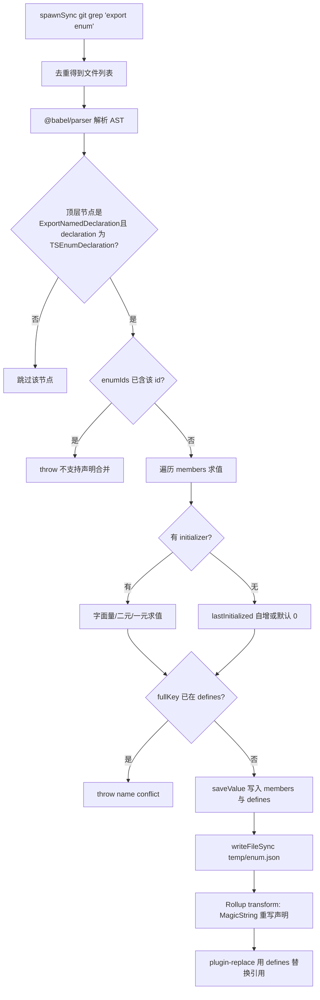
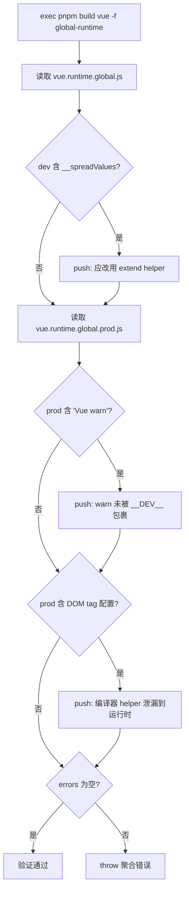

# Capítulo 4: Magia do tempo de compilação: inline de enums e mecanismo de verificação de Tree-shaking

No capítulo anterior vimos como a cadeia em tempo de desenvolvimento troca observação de arquivos e build incremental pela velocidade de "alterar uma linha e entrar em vigor imediatamente". Mas além da velocidade, Vue tem outra restrição mais oculta: o tamanho do artefato publicado deve ser controlável. Um dos inimigos dessa restrição é o enum do TypeScript — ele é um objeto real em tempo de execução e quebra o Tree-shaking. Este capítulo entra no tempo de compilação para ver como scripts/inline-enums.js "dissolve" enums em literais antes de o código ser executado pelo navegador; e depois ver como scripts/verify-treeshaking.js, após o build, usa strings do artefato para verificar reversamente que a promessa de "importação sob demanda" não foi silenciosamente quebrada.

# 4.1 Inline de enums: dissolvendo objetos de tempo de execução em literais

## Modelo intuitivo

Imagine que você escreveu uma receita na qual "um pouco de sal" aparece repetidamente. Se toda vez que cozinhasse fosse preciso ir ao apêndice consultar "um pouco = 3 gramas", seria lento e ocuparia espaço. O que o inline de enums faz é, antes da impressão, substituir diretamente todo "um pouco de sal" do livro por "3 gramas de sal" e depois rasgar aquela página do apêndice. Para o leitor (tempo de execução), o resultado é exatamente o mesmo, mas o livro fica mais fino.

Sem isso, que desastre o sistema enfrentaria? Um`enum`comum do TypeScript, após compilação, gera um objeto literal real e com mapeamento bidirecional (`Enum[Enum.A] === 'A'`). Esse objeto é**uma declaração em nível de módulo com efeitos colaterais**, e o Rollup não consegue provar que ele não é usado, então só pode mantê-lo — mesmo que você importe apenas um de seus membros, todo o objeto enum junto com o mapeamento reverso será incluído no artefato.[FACT:scripts/inline-enums.js:3-9]O comentário de`const enum`diz claramente: eles já usaram

## , mas por causa da issue #1228 mudaram para enum comum, então usam este script para "recuperar manualmente o benefício de custo zero do const enum".

Estrutura de dados e layout de memória[FACT:scripts/inline-enums.js:33-36]

- `EnumMember`：`{ name, value }`O núcleo do script são três definições de tipo; entendê-las é entender todo o fluxo de dados.
- `EnumDeclaration`：`{ id, range: [start, end], members }`。`range`, o nome de um único membro de enum e o literal após avaliação.**é**o deslocamento em bytes do código-fonte`export enum X { ... }`, apontando para a posição inicial e final de toda a declaração
- `EnumData`：`{ declarations, defines }`。`declarations`no arquivo — esta é a âncora para a substituição precisa posterior com MagicString.`defines`indexado por caminho de arquivo, registrando os intervalos de substituição de todas as declarações de enum nesse arquivo;` `é um mapeamento plano, cuja chave é o literal após `` `` 形式的字符串，值是 `${nomeDoEnum}.${nomeDoMembro}

JSON.stringify`.`defines`Há um design-chave aqui:**a chave de**。[FACT:scripts/inline-enums.js:98-103]não contém caminho de arquivo`ErrorCodes`O comentário explica o motivo —`@vue/compiler-core`pode existir simultaneamente em`@vue/runtime-core`e`ErrorCodes.__EXTEND_POINT__`, então enums com o mesmo nome podem existir em arquivos diferentes; mas o mesmo`fullKey in defines`não pode se repetir em dois enums com o mesmo nome, caso contrário`name conflict`é acionado e lança

diretamente. Esta é uma restrição de "unicidade global por nome de membro", não de "unicidade global por nome de enum".`temp/enum.json`。[FACT:scripts/inline-enums.js:33-36]O cache fica em`scanEnums()`Por que precisa ser gravado em disco? Porque**é chamado apenas uma vez na entrada do build, e o Rollup iniciará**。[FACT:scripts/inline-enums.js:39-41]processos independentes`inlineEnums()`para cada pacote e cada formato. O comentário aponta: os dados precisam ser compartilhados entre processos concorrentes do Rollup, então devem ser serializados em disco e lidos de volta pelo

## de cada processo.

**Step-by-Step: de grep à substituição por literais`export enum`Primeiro passo: grep de todos os arquivos contendo**[FACT:scripts/inline-enums.js:51-61].`spawnSync('git', ['grep', 'export enum'])`usa`path:line:content`, com saída no formato`:`, depois corta o primeiro segmento por`Set`(caminho do arquivo), e usa`git grep`em vez de percorrer o sistema de arquivos — ele naturalmente varre apenas os arquivos rastreados pelo Git, excluindo automaticamente`node_modules`e artefatos de build.

**Segundo passo: o Babel analisa e coleta informações de enum.**[FACT:scripts/inline-enums.js:64-70]Para cada arquivo usa`@babel/parser`com`typescript`plugin,`sourceType: 'module'`analisa em AST, e então percorre apenas`ast.program.body`os nós de nível superior.[FACT:scripts/inline-enums.js:74-79]Reconhece apenas`ExportNamedDeclaration`e cujo`declaration.type === 'TSEnumDeclaration'`nó — ou seja,**enums não exportados não serão processados**。

Para cada declaração de enum, o script avalia membro por membro. A avaliação de membros segue três caminhos:

1. **Inicialização literal**：`StringLiteral`ou`NumericLiteral`obtém diretamente`init.value`。[FACT:scripts/inline-enums.js:114-119]

2. **Expressão binária**: como`1 << 2`. Recursivamente`resolveValue`processa os operandos esquerdo e direito, os operandos podem ser literais ou`MemberExpression`(ou seja, referência a um membro de enum já definido anteriormente).[FACT:scripts/inline-enums.js:121-151]O ponto-chave está no`MemberExpression`branch: ele usa`content.slice(node.start, node.end)`a partir do**texto do código-fonte original**para extrair a string da expressão (como`ErrorCodes.FOO`), depois consulta`defines`. Se não encontrar, lança`unhandled enum initialization expression`。[FACT:scripts/inline-enums.js:132-141]Isso explica por que`defines`deve ser um mapeamento global plano — ao referenciar entre enums, o referenciado pode vir de outro arquivo, mas a chave reconhece apenas`枚举名.成员名`。

3. **Expressão unária**: como`-1`, monta a string`-1`e usa`evaluate`para avaliar.[FACT:scripts/inline-enums.js:152-163]

A avaliação em si usa`new Function('return ' + exp)()`。[FACT:scripts/inline-enums.js:39-41]Este é um**eval controlado**: a entrada vem de fragmentos de AST já analisados no código-fonte, não de entrada arbitrária do usuário, então o limite de segurança é controlável.

**Terceiro passo: processar membros sem inicializador (semântica de auto-incremento).**[FACT:scripts/inline-enums.js:171-183]Se o membro não tem`initializer`: o primeiro membro por padrão`0`; membros subsequentes, se`lastInitialized`for numérico então`++`; se for string, lança`wrong enum initialization sequence`— porque membros de enum string não permitem auto-incremento implícito. Esta é exatamente a semântica do enum do TypeScript.

**Quarto passo: gravar cache e retornar função de limpeza.**[FACT:scripts/inline-enums.js:200-213] `scanEnums()`Retorna um closure, cuja chamada`rmSync`exclui o arquivo de cache.`build.js`Usa-o em`try/finally`.[FACT:scripts/build.js:81-112]Isso garante que mesmo se um erro for lançado no meio do build, o cache será limpo, não contaminando o próximo build.

**Quinto passo: substituição na fase de transform do Rollup.** `inlineEnums()`Lê de volta o cache, constrói um plugin Rollup.[FACT:scripts/inline-enums.js:219-234]Em`transform(code, id)`, se`id`corresponder a`enumData.declarations`, usa MagicString para substituir`[start, end]`este trecho de declaração por um object literal.[FACT:scripts/inline-enums.js:242-274]

A forma após a substituição é`export const X = { ... }`. Note que ele**não simplesmente remove o enum**, mas reescreve como object literal, e gera mapeamento reverso adicional para membros numéricos:`JSON.stringify(value.toString()) + ': ' + JSON.stringify(name)`。[FACT:scripts/inline-enums.js:257-270]O comentário cita a regra de reverse-mappings da documentação oficial do TypeScript: membros de enum string não geram mapeamento reverso, membros numéricos geram. Isso garante que o comportamento em tempo de execução após a substituição seja completamente idêntico ao enum original.

E o que realmente elimina a sobrecarga em tempo de execução é`defines`ser entregue a`@rollup/plugin-replace`。[FACT:rollup.config.js:222-223]Todas as`X.Member`referências a**são**no plugin de substituição diretamente trocadas por literais, então aquele object literal reescrito, se ninguém o usar, pode ser eliminado pelo Tree-shaking.

O fluxograma abaixo descreve o caminho completo de decisão do grep até a substituição:

## Reflexões de design e armadilhas

**Por que usar MagicString em vez de regenerar o arquivo inteiro?**Porque`s.update(start, end, ...)`substitui apenas o trecho da declaração do enum, os demais bytes do código-fonte permanecem intactos,`s.generateMap()`e ainda gera sourcemap preciso.[FACT:scripts/inline-enums.js:277-281]Se usasse Babel para reimprimir todo o AST, perderia a formatação original, comentários, e a qualidade do sourcemap diminuiria.

**`range`Por que`node.start/node.end`em vez de`declaration.start`？**[FACT:scripts/inline-enums.js:189-193]afirma`node.start`(ou seja,`ExportNamedDeclaration`nó), o escopo de substituição cobre`export enum X {...}`todo o trecho, incluindo`export`a palavra-chave. O texto de substituição começa com`export const`, conectando-se perfeitamente.

**Armadilhas:`defines`A restrição de unicidade global de**Se dois arquivos diferentes tiverem cada um um`ErrorCodes`, e ambos definirem`__EXTEND_POINT__`, o build falhará diretamente.[FACT:scripts/inline-enums.js:101-103]Isso não é um bug, mas um design intencional — porque`defines`é uma tabela de substituição global, incapaz de distinguir a origem do arquivo. Em ambiente de produção, ao adicionar novos membros de enum, se o nome conflitar com um membro de enum existente, explodirá aqui.

**Armadilha:`new Function`O momento de avaliação de**A avaliação de expressão binária ocorre na`scanEnums`fase, neste momento`defines`pode ainda não ter o membro referenciado (se a ordem de referência estiver invertida).[FACT:scripts/inline-enums.js:136-140]lançará`unhandled enum initialization expression`. Isso exige que a referência a membros de enum siga a ordem do código-fonte de "definir antes de referenciar".

# 4.2 Verificação de Tree-shaking: usar strings do artefato para provar a promessa inversamente

## Modelo intuitivo

O inline de enum é uma "otimização prévia", mas a otimização realmente funciona? Se algum helper for mantido acidentalmente por escrita inadequada, o tamanho inflará silenciosamente, e o desenvolvedor nem perceberá.`verify-treeshaking.js`É o "inspetor de qualidade posterior": ele constrói o artefato, e então como uma autópsia verifica no artefato**se coisas que não deveriam aparecer aparecem**. Sem ele, a promessa de importação sob demanda do Vue pode silenciosamente quebrar após alguma refatoração, até que usuários reclamem que o pacote cresceu.

## Estrutura de dados e itens de verificação

Este script não tem estrutura de dados complexa, o núcleo é um`errors`array e três`includes`verificações.[FACT:scripts/verify-treeshaking.js:6-6]Ele primeiro constrói`global-runtime`formato, depois lê separadamente os artefatos dev e prod.

Os três itens de verificação correspondem a três tipos de "falha de Tree-shaking":

1. **artefato dev contém`__spreadValues`**。[FACT:scripts/verify-treeshaking.js:13-19]Este é o helper gerado pelo esbuild para`{ ...obj }`sintaxe de spread de objeto. Se ele aparecer, significa que o código em tempo de execução usou spread de objeto, enquanto a convenção do Vue deveria usar`extend`helper para evitar código extra.

2. **artefato prod contém`Vue warn`**。[FACT:scripts/verify-treeshaking.js:26-31]significa que há`warn()`chamada não envolvida por`__DEV__`condição, causando vazamento de código de aviso no pacote de produção.

3. **artefato prod contém lista de configuração de DOM tag**。[FACT:scripts/verify-treeshaking.js:33-42]como`html,body,base`、`svg,animate,animateMotion`、`annotation,annotation-xml,maction`. Estes são`isHTMLTag()`Os dados internos de helpers como este deveriam existir apenas no compilador e ser eliminados pelo runtime. Se aparecerem no artefato de runtime, isso indica que o caminho de runtime usou erroneamente um helper exclusivo do compilador.

## Passo a passo: fluxo de verificação

[FACT:scripts/verify-treeshaking.js:5-5]Primeiro`exec('pnpm', ['build', 'vue', '-f', 'global-runtime'])`, construir apenas`vue`o pacote`global-runtime`no formato — este é o artefato de runtime mais minimizado, ideal para expor vazamentos. Após a construção, ler os dois arquivos de forma síncrona, verificar`includes`um por um, e ao encontrar correspondência, fazer push de uma mensagem com explicação em`errors`. Por fim, se`errors.length`for diferente de zero, lançar um erro agregado.[FACT:scripts/verify-treeshaking.js:44-48]

## Reflexões de design e armadilhas

> **[Design Inference & Architectural Trade-offs]**
> **Por que usar string`includes`em vez de análise AST?**Porque isto é uma "verificação sentinela", não uma "análise precisa". Não busca completude, apenas configura alertas de baixo custo para três tipos de regressão que realmente ocorreram historicamente. Correspondência de strings tem zero dependências, zero custo de parsing, e é igualmente eficaz em artefatos minificados — análise AST, após minify, torna-se ainda mais difícil de fazer.

> **[Design Inference & Architectural Trade-offs]**
> **Por que verificar apenas`global-runtime`？**este formato inlining todas as dependências (`external`vazio), é o artefato mais sensível a tamanho e mais suscetível a ser introduzido erroneamente. Se ele está limpo, outros formatos geralmente também estão. Além disso, sua construção é rápida, adequada para rodar frequentemente em CI.

> **[Design Inference & Architectural Trade-offs]**
> **Armadilha: os itens de verificação são uma "lista negra", que se torna ineficaz com a evolução do código.**Se algum dia`isHTMLTag`a estrutura de dados mudar,`html,body,base`esta string não aparecerá mais, e a verificação se tornará inútil. Isso exige que os mantenedores atualizem sincronamente as strings sentinela aqui ao modificar helpers relacionados. Este é o custo inerente da verificação por lista negra.

# 4.3 Colaboração com Rollup: ordem de plugins e injeção de define

O inlining de enums não opera isoladamente; ele está embutido no pipeline de plugins do Rollup. Entender sua posição no pipeline é essencial para compreender por que`defines`deve ser entregue a`replace`em vez de`esbuild`。

[FACT:rollup.config.js:47-50]chamar no nível superior do módulo de configuração`inlineEnums()`, desestruturando`[enumPlugin, enumDefines]`. Note que isto é executado**a cada inicialização de processo do Rollup**, lendo o cache escrito por`scanEnums`.

A ordem do array de plugins é:`json` → `alias` → `enumPlugin` → `...resolveReplace()` → `esbuild`。[FACT:rollup.config.js:324-339] `enumPlugin`vem antes de`replace`, significando que a reescrita das declarações de enum ocorre primeiro, e então`replace`usa`defines`para substituir referências. E`esbuild`vem por último, responsável pela transpilação TS.

Por que`defines`usa`replace`e não`esbuild`? O comentário em`define`？[FACT:rollup.config.js:220-221]dá a resposta: o define do esbuild "é um pouco estrito, permitindo apenas JSON literal ou identificadores". E nomes de membros de enum como`ErrorCodes.__EXTEND_POINT__`são expressões de membro com ponto, e o define do esbuild não consegue lidar diretamente com tais chaves. Portanto, é obrigatório usar`@rollup/plugin-replace`, que suporta substituição de chaves de string arbitrárias.[FACT:rollup.config.js:250-251]E configurou`preventAssignment: true`, evitando substituir também o lado esquerdo de instruções de atribuição.

`resolveReplace()`Em`const replacements = { ...enumDefines }`é o primeiro passo.[FACT:rollup.config.js:222-223]Somente depois é que se sobrepõem as anotações de produção`/*@__PURE__*/`,`__DEV__`e outras substituições. Esta ordem garante que a substituição de literais de enum sempre tenha efeito.

# Reflexões de design

**A essência do inlining de enums é "trocar complexidade em tempo de build por tamanho em tempo de runtime".**Ele reproduz completamente em tempo de build a semântica do sistema de tipos do TypeScript (avaliação de enum, auto-incremento, mapeamento reverso) —`scanEnums`a lógica de avaliação em[FACT:scripts/inline-enums.js:110-183]é quase um subconjunto da avaliação de enum do compilador TS. Isso traz custo de manutenção: se o TS adicionar nova sintaxe de enum (como expressões constantes mais complexas), aqui deve-se acompanhar, caso contrário lança erro`unhandled`. Mas o benefício é claro: zero objetos de enum em runtime, permitindo Tree-shaking completo.

> **[Design Inference & Architectural Trade-offs]**
> **O script de verificação e o script de inlining são um par de "promessa e cumprimento".**O script de inlining promete "enums não ocupam tamanho em runtime", o script de verificação checa "outros códigos também não ocupam tamanho secretamente". Ambos juntos protegem o orçamento de tamanho do Vue. Este design pareado de "otimização + verificação" é um padrão típico de engenharia em grandes bibliotecas frontend: qualquer otimização precisa de uma verificação automatizada para prevenir regressões.

**Cache entre processos é essencial para builds concorrentes.** `scanEnums`O padrão de execução única,`inlineEnums`múltiplas leituras,[FACT:scripts/inline-enums.js:39-41]resolve o problema de "uma varredura, N processos consumindo". Sem cache, cada processo Rollup teria que refazer grep + parsing, desperdiçando muito IO e CPU.

# Resumo do capítulo

# Reflexões e autoavaliação do capítulo

Q1: Se remover`scanEnums`em`saveValue`a verificação de conflito de`if (fullKey in defines)`, em quais cenários isso causaria erros no artefato de build?

**Análise de referência**：

`defines`é um mapeamento global plano, com chave`枚举名.成员名`, sem incluir caminho de arquivo.[FACT:scripts/inline-enums.js:98-103]Após remover a verificação de conflito, se dois arquivos diferentes tiverem enums com o mesmo nome e definirem membros com o mesmo nome (como`@vue/compiler-core`e`@vue/runtime-core`ambos tendo`ErrorCodes.__EXTEND_POINT__`), o último a escrever sobrescreverá o primeiro.

Consequências:`defines['ErrorCodes.__EXTEND_POINT__']`restará apenas um valor, e`plugin-replace`ao substituir não conseguirá distinguir a origem do arquivo, substituindo**todos**os`ErrorCodes.__EXTEND_POINT__`em todos os arquivos pelo mesmo valor.[FACT:rollup.config.js:222-223]Assim, o valor do membro de enum de um dos pacotes é silenciosamente adulterado, causando comportamento incorreto em runtime e extremamente difícil de depurar — porque o código-fonte parece completamente correto.

É exatamente por isso que o comentário enfatiza "permitir enums com mesmo nome entre arquivos, mas não permitir membros com mesmo nome".[FACT:scripts/inline-enums.js:98-100]A verificação de conflito é o guardião que impede a contaminação da tabela global de substituição.

Q2: Se inverter a ordem de`rollup.config.js`e`enumPlugin`no array de plugins em`...resolveReplace()`, o que aconteceria?

**Análise de referência**：

A ordem atual é`enumPlugin`primeiro,`replace`depois.[FACT:rollup.config.js:331-332]O hook`transform`do Rollup executa na ordem do array de plugins.

Se invertido,`replace`rodaria primeiro, quando as declarações de enum ainda estão na forma original`export enum X { ... }`.`replace`usa`defines`para substituir referências de`X.Member`— mas as referências ainda estão lá, a substituição funcionaria. O problema surge quando`enumPlugin`roda em seguida: ele usa`s.update(start, end, ...)`para reescrever o segmento de declaração.[FACT:scripts/inline-enums.js:250-273]Mas`replace`já modificou`code`, e o`enumPlugin`obtido por`code`é`replace`的输出，其字节偏移已与`scanEnums`记录的`range`（基于原始源码）**不再对应**。

后果：MagicString 会在错误的偏移处切割，产物语法错乱。这揭示了插件流水线的一个隐含契约：**基于源码偏移的变换必须最先执行**，后续变换才能安全地在其输出上继续。

Q3: `verify-treeshaking.js`只检查三个字符串哨兵。若某次重构把`isHTMLTag`内部数据从`'html,body,base'`改成数组形式`['html','body','base']`，验证脚本会怎样？这暴露了什么设计缺陷？

**参考解析**：

验证脚本用`prodBuild.includes('html,body,base')`检查。[FACT:scripts/verify-treeshaking.js:33-37]若数据改成数组，压缩产物里不再出现逗号连接的字符串，`includes`返回`false`，检查**静默通过**——即使`isHTMLTag`真的泄漏进了运行时产物。

这暴露了黑名单式字符串验证的固有缺陷：**哨兵字符串与源码实现耦合，实现一变，验证即失效**。它无法检测「未知的泄漏」，只能检测「已知的、且字符串形态未变的泄漏」。

> **[Design Inference & Architectural Trade-offs]**
> 改进方向：可以改为检查更稳定的标识符（如函数名`isHTMLTag`），或在源码层面用 lint 规则禁止运行时 import 编译器 helper，而非依赖产物字符串。但在当前成本约束下，字符串哨兵是「够用且廉价」的折中。

枚举内联解决了「构建期如何消除运行时开销」，验证脚本解决了「如何确认优化没被破坏」。但构建产物除了 JS，还有一类同样需要流水线加工的产物——类型声明文件。下一章将进入类型产物流水线，看 Vue 如何从源码`.d.ts`生成发布级类型包，以及`dts-test`如何用类型契约测试守住公开 API 的类型形状。

本章拆解了编译期的两个关键脚本。inline-enums.js 用 git grep 定位枚举、Babel 解析 AST、new Function 求值成员、MagicString 精确重写声明，最终通过 defines 全局替换表把枚举引用变成字面量，让枚举对象可被 Tree-shaking 摇掉。verify-treeshaking.js 则在构建后用字符串哨兵检查产物，确保三类已知的 Tree-shaking 泄漏不会回归。两者一个负责「优化」，一个负责「验证优化没被破坏」，共同守护 Vue 的体积承诺。接下来，我们将从编译期转向类型产物的生成链路，看 Vue 如何保证源码类型与发布类型严格一致。
