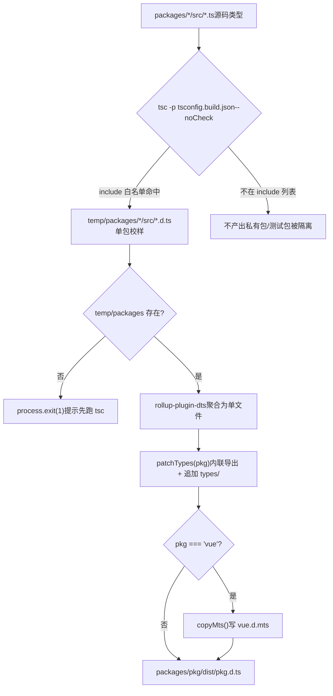
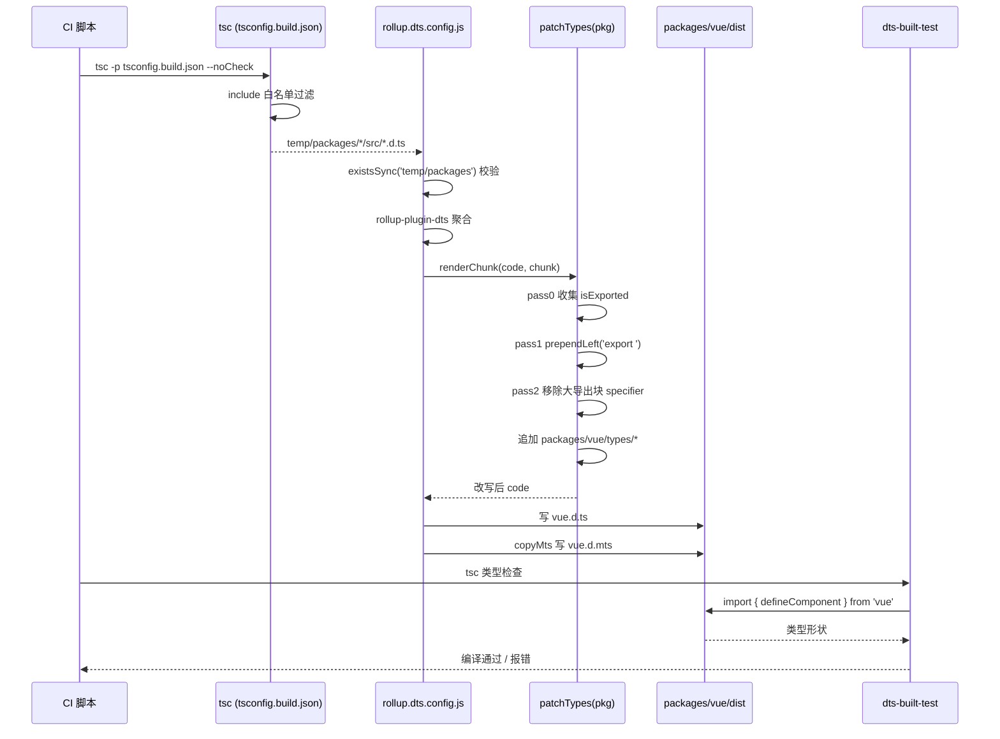

# 第 5 章：类型产物流水线：从源码 .d.ts 到发布级类型包

上一章我们拆解了`inline-enums.js`与`verify-treeshaking.js`：一个负责把 enum 引用替换成字面量、让枚举对象能被摇掉，另一个负责在构建后用字符串哨兵确认三类已知泄漏没有回归。两者共同守护了 Vue 的运行时体积承诺。但构建产物不止 JS。当用户`import { ref } from 'vue'`时，编辑器弹出的类型提示、`tsc`对用户代码的类型检查，全都依赖另一类产物——`.d.ts`声明文件。JS 产物错了，运行时报错；类型产物错了，用户侧编译期就报错，或者更糟：类型静默漂移，用户代码能编译通过，但类型形状与真实运行时行为不符。本章追踪 Vue 如何把散落在各子包`src`里的源码类型，聚合成发布级的类型包，并用`dts-built-test`在真实构建产物上做类型冒烟测试。

# 5.1 两阶段类型流水线：tsc 出料，rollup 聚合

## 直觉模型

想象一条印刷流水线：第一阶段，每个子包各自把自己的手稿（`.ts`源码）排版成单页校样（`.d.ts`）；第二阶段，把几十张校样按目录顺序装订成一本书（发布级`.d.ts`），并统一页眉页脚（导出声明）。

若没有这条流水线，Vue 就得手工维护一份发布类型文件，源码一改就得同步手改——这是类型漂移的温床。Vue 的做法是：**类型产物完全由源码生成，绝不手写**。

## 第一阶段：tsconfig.build.json 划定出料范围

`tsconfig.build.json`是这条流水线的第一阶段配置。它继承根`tsconfig.json`，只覆盖构建相关选项。

[FACT:tsconfig.build.json:3-9]

关键选项逐个拆解：

- `declaration: true`：让 tsc 为每个源文件生成对应`.d.ts`。
- `emitDeclarationOnly: true`：**只出类型，不出 JS**。JS 由 Rollup 负责，tsc 在这里纯粹是类型提取器。
- `stripInternal: true`：凡是标注`@internal`的声明一律从`.d.ts`中剔除。这是 Vue 控制公开 API 表面的第一道闸门——内部实现细节即使被`export`，只要打了`@internal`就不会泄漏到发布类型里。
- `composite: false`：关闭项目引用（project references）的增量构建模式。Vue 这里不需要跨包增量，关掉可避免`.tsbuildinfo`带来的额外状态。

`include`列表则精确划定了哪些目录参与出料：

[FACT:tsconfig.build.json:10-23]

注意这里**只列了 12 个目录**，而不是整个`packages/`。`packages-private/`、`packages/dts-test/`、`packages/sfc-playground/`等都不在其中。这意味着：私有包和测试包的类型**永远不会**Entra nos artefatos de publicação. Este é um isolamento físico — não por convenção, mas por configuração.

> **[Design Inference & Architectural Trade-offs]**
> Por que usar lista de permissões em vez de lista de bloqueio? Porque adicionar novos subpacotes em um monorepo é a norma. Se usar`exclude`lista de bloqueio, ao adicionar um novo pacote privado e esquecer de incluí-lo no exclude, seus tipos vazarão silenciosamente para os artefatos de publicação. A lista de permissões é o oposto: novos pacotes por padrão não participam da build, precisam ser explicitamente adicionados, seguindo o princípio de "padrões seguros".

Após executar`tsc -p tsconfig.build.json --noCheck`os artefatos ficam em`temp/packages/<pkg>/src/*.d.ts`. Observe`--noCheck`: pula a verificação de tipos, apenas faz emit. A verificação de tipos é responsabilidade de um`tsc --noEmit`separado, a fase de build não repete a verificação, economizando tempo.

## Segunda fase: agregação do rollup.dts.config.js

A segunda fase é impulsionada por`rollup.dts.config.js`. Seu entrypoint primeiro faz uma validação prévia:

[FACT:rollup.dts.config.js:15-22]

Se`temp/packages`não existir, significa que a primeira fase não foi executada, o script diretamente`process.exit(1)`e avisa para executar`tsc`primeiro. Este é o**contrato de ordem**do pipeline: a fase do rollup depende fortemente dos artefatos da fase do tsc, ambos são indispensáveis.

Em seguida, lê todos os diretórios de subpacotes e suporta a variável de ambiente`TARGETS`para build de subconjunto:

[FACT:rollup.dts.config.js:15-22]

`TARGETS`O mecanismo permite reconstruir apenas os tipos de alguns pacotes, encurtando significativamente o ciclo de feedback durante o desenvolvimento e depuração.

O núcleo é`targetPackages.map(...)`gerar uma configuração Rollup para cada pacote:

[FACT:rollup.dts.config.js:23-42]

Interpretação campo por campo:

- `input: ./temp/packages/${pkg}/src/index.d.ts`: a entrada é o arquivo de tipos produzido na primeira fase, não o código-fonte`.ts`。
- `output.file: packages/${pkg}/dist/${pkg}.d.ts`: os artefatos ficam no`dist`diretório de cada pacote, com nome de arquivo igual ao nome do pacote (como`vue.d.ts`）。
- `format: 'es'`: arquivos de tipo usam uniformemente o formato ES module.
- `plugins: [dts(), patchTypes(pkg), ...(pkg === 'vue' ? [copyMts()] : [])]`: três plugins, os dois primeiros se aplicam a todos os pacotes,`copyMts`se aplica apenas ao pacote`vue`.

`onwarn`O hook

[FACT:rollup.dts.config.js:23-42]

merece menção separada:`UNRESOLVED_IMPORT`Durante o processo de dts rollup, todos os imports de caminhos não relativos são externalizados por padrão. Isso faz o Rollup emitir**avisos. Mas isso é**comportamento esperado`import { X } from 'some-pkg'`— os`return`nos arquivos de tipo devem ser mantidos como referências externas, não devem ser empacotados. Então o script para "imports não resolvidos de caminhos não relativos" diretamente`warn`。

> **[Design Inference & Architectural Trade-offs]**
> padrão`!warning.exporter?.startsWith('.')`〔Inferência de design e trade-offs arquiteturais〕`.`Há uma sutileza aqui:

## verifica se o exporter começa com

Visão geral do pipeline`tsc`Copiar`rollup`Este diagrama ancora o fluxo de controle das duas fases:`check`a lista de permissões de`patchTypes`determina quem pode entrar no pipeline,`copyMts`o`vue`de

# determina se pode continuar,

## é uma etapa obrigatória,

`rollup-plugin-dts`é o branch exclusivo do pacote`.d.ts`.`export { A, B, C, ... }`5.2 patchTypes: reescrever os artefatos agregados para o formato de nível de publicação`defineComponent`Modelo intuitivo

`patchTypes`Após**mesclar dezenas de**em um único arquivo, o formato resultante é "primeiro declarar um monte de tipos, no final usar um enorme

## para exportar uniformemente". Isso não é amigável para leitura humana, e para algumas toolchains (como a chamada

`patchTypes`do VitePress) ainda dispara o erro "tipo inferido não pode ser nomeado sem referência".`renderChunk`é este

[FACT:rollup.dts.config.js:87-88]

- `isExported`processo de pós-processamento e modelagem**: mudar "exportação centralizada" para "exportação inline no local", depois anexar aprimoramentos de tipo específicos do pacote.**Estrutura de dados: dois Sets e três passagens`export { ... }`retorna um plugin Rollup, a lógica central está no hook
- `shouldRemoveExport`. Ele mantém duas coleções:**: registra todos os**nomes de tipos que

já eram exportados originalmente

## Step-by-Step Walkthrough

**(vindos de declarações**

[FACT:rollup.dts.config.js:90-100]

).`ExportNamedDeclaration`: registra todos os**nomes de tipos que**precisam ser removidos do bloco de exportação grande`export ... from '...'`(porque já foram exportados inline).`isExported`。

**O fluxo de processamento é dividido em três passagens (pass 0 / pass 1 / pass 2), este é o padrão típico de "primeiro coletar, depois reescrever, por fim limpar".`export`Pass 0: coletar todos os nomes de tipos já exportados.**

[FACT:rollup.dts.config.js:102-125]

Percorre os nós de nível superior da AST, para todo`VariableDeclaration`、`TSTypeAliasDeclaration`、`TSInterfaceDeclaration`、`TSDeclareFunction`、`TSEnumDeclaration`、`ClassDeclaration`que`processDeclaration`。

`processDeclaration`não tem source

[FACT:rollup.dts.config.js:70-85]

(ou seja, não é

reexportação), adiciona o local name do seu specifier em`id`Pass 1: adicionar o prefixo

inline para nós de declaração.`_`Percorre os nós de nível superior, para**seis tipos de declaração chama**a lógica:

Três passos:`shouldRemoveExport`1. Sem`isExported`retorna diretamente (como declarações anônimas).`prependLeft`2. Se o nome começa com`export `pula — esta é a

convenção`VariableDeclaration`: tipos com prefixo de underscore são tipos auxiliares internos, não são exportados.

[FACT:rollup.dts.config.js:104-115]

3. Adiciona o nome em`declare const`; se o nome estiver em`declare const a, b`(ou seja, já era exportado originalmente), insere`processDeclaration`uma string`declarations[0]`na posição inicial da declaração.**Observe que o branch**tem uma asserção adicional:

**Se um**

[FACT:rollup.dts.config.js:127-171]

declara múltiplos declarators (como`ExportNamedDeclaration`), lança erro diretamente. Porque

- só processa`shouldRemoveExport`, múltiplos declarators causariam processamento incompleto. Aqui escolhe-se`exported === local`falha rápida`export { Foo as Bar }`em vez de erro silencioso, é a manifestação de programação defensiva.
- Pass 2: remover tipos já inline do bloco de exportação grande.
- Percorre`ExportNamedDeclaration`, para cada specifier:

**Se seu local name está em**

[FACT:rollup.dts.config.js:172-183]

`code = s.toString()`, e`packages/${pkg}/types`(excluindo o caso de renomeação

> **[Design Inference & Architectural Trade-offs]**
> Este`types/`diretório é**um ponto de entrada de aprimoramento de tipos mantido manualmente**, usado para armazenar tipos que não podem ser gerados automaticamente a partir do código-fonte (como aprimoramentos globais de JSX, declarações de tipos de macros). Ele é mesclado no mesmo arquivo que os tipos gerados automaticamente, mas as origens são claramente separadas — os gerados automaticamente ficam em cima, os aprimoramentos manuais embaixo.

## Por que a exportação inline é obrigatória?

O comentário fornece a razão direta:

[FACT:rollup.dts.config.js:45-51]

O texto original diz: altere todos os tipos para exportação inline e remova-os do bloco de exportação grande, caso contrário, no VitePress`defineComponent`a chamada reportará "the inferred type cannot be named without a reference".

> **[Design Inference & Architectural Trade-offs]**
> A essência desse erro é: quando o TypeScript gera tipos, se um tipo só pode ser nomeado por meio de "referenciar a exportação de outro módulo", e essa referência não é visível no lado do consumidor, ocorre um erro. O bloco de exportação centralizado separa o nome do tipo da localização da declaração, agravando esse problema. A exportação inline torna cada tipo visível no local da declaração, eliminando essa camada indireta.

## copyMts: fornece tipos para o modo duplo Node ESM/CJS

`copyMts`O plugin só tem efeito para o pacote`vue`:

[FACT:rollup.dts.config.js:196-204]

Ele, no hook`writeBundle`, grava o conteúdo de`vue.d.ts`exatamente como está em`vue.d.mts`。

O comentário explica a razão:

[FACT:rollup.dts.config.js:188-192]

De acordo com a especificação`package.json`exports do TypeScript 4.7, para fornecer tipos corretamente tanto para Node ESM quanto para CJS,**é necessário ter dois arquivos de declaração independentes**. Portanto, durante o build,`vue.d.ts`é copiado como`vue.d.mts`。

> **[Design Inference & Architectural Trade-offs]**
> Por que copiar em vez de regenerar? Porque as formas de tipo de ESM e CJS são completamente idênticas; a diferença está apenas na extensão do arquivo e no mapeamento`package.json`de`exports`. Copiar é a solução mais barata, evitando executar o rollup novamente.

# 5.3 dts-built-test: teste de fumaça de tipos em artefatos reais

## Modelo intuitivo

As duas seções anteriores garantem que os artefatos de tipo podem ser gerados e têm a forma correta. Mas "poder ser gerado" não é o mesmo que "ser gerado corretamente". Se`patchTypes`alguma passagem de`import`tiver um bug e excluir acidentalmente alguma exportação, o artefato ainda poderá ser gerado, mas o usuário

`dts-built-test`descobrirá que o tipo está faltando. Isso é**um teste de fumaça de tipos executado sobre o artefato de build real**: ele não testa os tipos do código-fonte, mas sim`import`o pacote`vue`já publicado, verificando se as formas de tipos críticas não sofreram regressão.

## Estrutura de dados: uma asserção de tipo minimizada

O núcleo de todo o pacote de teste é apenas um arquivo:

[FACT:packages-private/dts-built-test/src/index.ts:3-6]

Leitura linha por linha:

- L1: importa`vue`de`defineComponent`. Observe que aqui é importado o**nome do pacote**, não um caminho relativo — ele consome o artefato real`packages/vue/dist/vue.d.ts`.
- L3-6: define um componente`_CustomPropsNotErased`, com props vazias e setup vazio.
- L8: comentário`// #8376`, apontando para uma issue específica.
- L9-12: exporta`CustomPropsNotErased`, com tipo sendo a interseção de`_CustomPropsNotErased`e`{ foo: string }`.

Este teste verifica que:**`defineComponent`o tipo de retorno de`{ foo: string }`, após a interseção com`foo`, não tem a propriedade**。

> **[Design Inference & Architectural Trade-offs]**
> 〔Inferência de design e trade-offs de arquitetura〕`defineComponent`Contexto especulado da issue #8376:

## o tipo de retorno de

[FACT:packages-private/dts-built-test/package.json:1-11]

pode passar por algum tipo condicional ou tipo mapeado, fazendo com que propriedades extras na interseção sejam "apagadas". Este teste fixa esse comportamento com uma reprodução mínima; se houver regressão, ocorrerá erro na fase de verificação de tipos.

- `private: true`Configuração do pacote: dependência de workspace apontando para o artefato real
- `types: dist/index.d.ts`Campos-chave:
- `dependencies`: não é publicado no npm.`workspace:*`: entrada de tipos aponta para o artefato de build.`@vue/shared`、`@vue/reactivity`、`vue`。

> **[Design Inference & Architectural Trade-offs]**
> , três dependências`@vue/shared`:`@vue/reactivity`〔Inferência de design e trade-offs de arquitetura〕`vue`Por que depender de`types`e`dist`? Porque os tipos de**podem referenciar os tipos desses dois pacotes. No modo workspace, o pnpm cria links simbólicos dessas dependências para os pacotes locais, e o campo**dos pacotes locais aponta para os artefatos em seus respectivos

## . Assim, toda a cadeia de teste consome

`dts-built-test`artefatos de build`src/index.ts`, não código-fonte.`tsc`Como o teste é executado`tsc`Ele próprio não tem script de teste; seu

> **[Design Inference & Architectural Trade-offs]**
> para fazer verificação de tipos nesse pacote. Se a forma do tipo sofrer regressão,**reporta erro e o CI falha.**〔Inferência de design e trade-offs de arquitetura〕`tsc`A engenhosidade desse design está em codificar o "contrato de tipos" como

## código compilável

. Não precisa de biblioteca de asserção extra, não precisa de runtime;`dts-built-test`ele próprio é o executor de testes. Se os tipos estiverem certos, compila; se estiverem errados, falha na compilação.`dts-test`Divisão de responsabilidades com dts-test

- `dts-built-test`Observe que o**deste capítulo e o**do próximo capítulo são duas coisas diferentes:
- `dts-test`(este capítulo): consome**artefatos de build**, verifica formas de tipos em nível de publicação.

> **[Design Inference & Architectural Trade-offs]**
> tipos do código-fonte`patchTypes`, verifica o contrato da superfície da API.`stripInternal`〔Inferência de design e trade-offs de arquitetura〕`types/`Por que são necessárias duas camadas? Porque os tipos do código-fonte e os tipos do artefato podem ser inconsistentes.`dts-built-test`A reescrita de AST do

## , a remoção do

, tudo isso pode introduzir bugs em nível de artefato mesmo com os tipos do código-fonte corretos.`patchTypes`O`dts-built-test`protege especificamente esse último quilômetro.

# Linha do tempo completa do pipeline de tipos

## Cópia

`patchTypes`Este diagrama de sequência ancora a colaboração entre módulos: o CI impulsiona duas fases, tsc e Rollup,`code.replace(...)`as três passagens de

1. **são o processamento central,**e no final consome o artefato para validação.`start`/`end`Reflexões de design, recuperação de erros e armadilhas em produção

2. **Por que usar MagicString em vez de substituição de string?**：MagicString consegue gerar mapeamentos, permitindo que os arquivos de tipo reescritos ainda possam ser rastreados de volta ao código-fonte. Embora o uso de sourcemap para arquivos de tipo seja limitado, manter a consistência é uma boa prática.

## Falha rápida vs tolerância silenciosa

`patchTypes`usado em vários lugares`assert`：

[FACT:rollup.dts.config.js:74-74]

[FACT:rollup.dts.config.js:107-108]

[FACT:rollup.dts.config.js:147-148]

Essas asserções lançam erro imediatamente ao encontrar formas de AST inesperadas. Em contraste com`onwarn`onde`UNRESOLVED_IMPORT`é silenciosamente engolido——**ruído esperado é engolido, formas inesperadas falham rapidamente**. Essa é a postura correta de um script de build: é preferível que o build falhe a produzir arquivos de tipo com forma incorreta.

## Armadilhas em produção:`_`convenção de prefixo

`processDeclaration`Pular`_`tipos que começam com:

[FACT:rollup.dts.config.js:76-78]

Isso significa que qualquer tipo exportado no código-fonte que comece com`_`não será exportado inline. Se um tipo deveria ser público, mas for pulado por ter nome começando com`_`, o usuário encontrará o erro "tipo não existe".

> **[Design Inference & Architectural Trade-offs]**
> A abordagem para investigar esse tipo de problema: primeiro verificar se o tipo ainda está no grande bloco de exportação do artefato`vue.d.ts`, depois verificar se o nome do tipo no código-fonte começa com`_`. Isso é um acoplamento implícito entre convenção de nomenclatura e comportamento da ferramenta, fácil de cair em armadilha.

## Armadilha em produção: asserção de múltiplos declarators

[FACT:rollup.dts.config.js:106-115]

Se em algum`.d.ts`aparecer`declare const a, b`, o build lança erro diretamente. Isso é raro em tipos escritos à mão, mas se algum arquivo de tipo gerado por ferramenta usar essa forma, será acionado. A mensagem de erro imprime o trecho de código problemático, facilitando a localização.

# Resumo do capítulo

Este capítulo rastreou o pipeline completo dos artefatos de tipo do Vue:

1. **Primeira fase (tsc)**：`tsconfig.build.json`usa`include`whitelist para delimitar precisamente o escopo de saída,`emitDeclarationOnly`apenas emite tipos,`stripInternal`remove declarações internas. Os artefatos ficam em`temp/packages/`。

2. **Segunda fase (rollup)**：`rollup.dts.config.js`usa`rollup-plugin-dts`para agregar os tipos de cada pacote,`patchTypes`através de três passagens de travessia de AST reescreve exportações centralizadas em exportações inline, e anexa`types/`melhorias manuais do diretório.`copyMts`para`vue`pacote gera adicionalmente`.d.mts`。

3. **Fase de validação (dts-built-test)**：realiza smoke test de tipos nos artefatos reais de build, usando código compilável para fixar formas de tipos críticos, prevenindo deriva de tipos.

# Reflexões e autoavaliação do capítulo

Q1: Se alterarmos`tsconfig.build.json`de`include`whitelist para`["packages"]`（ou seja, incluindo todo o diretório packages）, o que aconteceria? Em quais cenários isso causaria poluição de tipos publicados?

**Análise de referência**：

`include`Ao mudar de 12 diretórios precisos para`["packages"]`, todos os subpacotes (incluindo`packages-private`todos os`packages/*`fora de ) participarão da saída do tsc.[FACT:tsconfig.build.json:10-23]

Cadeia de consequências:

1. `temp/packages/`haverá muitos`.d.ts`。

2. `rollup.dts.config.js`de pacotes extras`readdirSync('temp/packages')`de[FACT:rollup.dts.config.js:15-22]

3. `targetPackages`lerá esses pacotes extras.`packages/<pkg>/dist/<pkg>.d.ts`。[FACT:rollup.dts.config.js:15-22]

por padrão é igual a todos os pacotes, então será gerado para cada pacote`dist`Cenário de poluição: se algum pacote não deveria ser publicado (como pacotes de ferramentas internas), seus artefatos de tipo aparecerão em`package.json`. Se o`private: true`desse pacote não tiver

, o script de publicação pode publicá-lo junto no npm, causando vazamento de tipos internos.

Q2: `patchTypes`Isso é exatamente o valor do design de whitelist: novos pacotes por padrão não participam, precisam ser explicitamente adicionados, seguindo o princípio de valores padrão seguros.`processDeclaration`No pass 1 de`_`, para`return`tipos que começam com`_`diretamente`_InternalType`. Se o tipo de alguma API pública começar com

**（como**：

`processDeclaration`exportado acidentalmente）, o que o usuário veria? Como investigar?`_`Análise de referência`shouldRemoveExport`ao encontrar`export `。[FACT:rollup.dts.config.js:76-78]

que começa com

retorna diretamente, sem adicionar a`export`。

, nem prepend`shouldRemoveExport`Consequências:

1. Esse tipo não obterá inline**2. Ele também não será removido do grande bloco de exportação (porque não está em**).

3. Portanto ele`export { _InternalType }`ainda está no grande bloco de exportação`stripInternal`, teoricamente ainda pode ser importado.`tsc`Mas o problema é: o

no grande bloco de exportação

referencia a posição da declaração. Se essa declaração for removida por algum motivo (como`vue.d.ts`), o bloco de exportação referenciará um nome inexistente, causando`export`erro.

Abordagem de investigação:`_`1. Verificar no artefato

se o tipo não tem

na declaração, e é referenciado no grande bloco de exportação.`_`2. Verificar no código-fonte se o nome do tipo começa com

Q3: `dts-built-test`.`src/index.ts`3. Se confirmado que é problema de nomenclatura, renomear removendo o prefixo de underscore resolve.`typeof _CustomPropsNotErased & { foo: string }`Isso expõe o acoplamento implícito entre convenção de nomenclatura e comportamento da ferramenta:`foo`o prefixo originalmente significa "interno", mas a ferramenta o trata como "não exportado", os dois significados não são completamente consistentes.`Omit<typeof _CustomPropsNotErased, never> & { foo: string }`de

**usa tipo de interseção**：

`Omit<T, never>`para validar**não é apagado. Se mudarmos o tipo de interseção para**, o teste ainda conseguiria capturar a regressão #8376? Por quê?

- Análise de referência`T & { foo: string }`criará um novo tipo mapeado, que irá`foo`recalcular`defineComponent`todas as propriedades de T. Se o bug #8376 for "propriedades extras em tipo de interseção são apagadas", então:`foo`Escrita original
- `Omit`：interseção direta,`Omit`é parte do tipo de interseção, se`T`a lógica de tratamento do tipo de retorno apagar propriedades extras na interseção,`{ foo: string }`será perdido.`Omit`escrita:

[FACT:packages-private/dts-built-test/src/index.ts:9-12]

primeiro faz mapeamento em**, depois faz interseção com**.`Omit`、`Pick`o processo de mapeamento pode alterar a estrutura do tipo, fazendo com que a condição de disparo do bug não se aplique mais——mesmo que o bug exista, o teste pode passar.

> **[Design Inference & Architectural Trade-offs]**
> minimalidade

do caso de teste é crucial: ele deve reproduzir precisamente o caminho de disparo do bug. Qualquer transformação extra de tipo (como`dts-built-test`) pode mascarar o bug. É por isso que no teste se usa o tipo de interseção mais simples, em vez de uma escrita mais "elegante".`dts-test`, veja como o Vue usa testes de contrato de tipo para proteger a superfície da API pública.

Os três formam um ciclo fechado de "geração → modelagem → verificação", garantindo que os tipos do código-fonte e os tipos publicados sejam estritamente consistentes. No entanto, o fato de o pacote de tipos em si estar correto não significa que a forma do tipo da API pública esteja travada. No próximo capítulo vamos aprofundar em`packages-private/dts-test`, para ver como mais de 20`.test-d.ts`arquivos usam`expectType`e outras ferramentas para transformar "tipo como contrato de API" em testes automatizados regressáveis.
