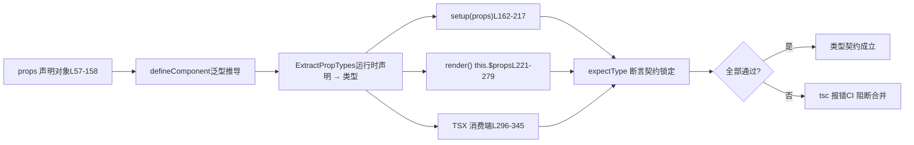

# Capítulo 6: Testes de contrato de tipo: como o dts-test protege a superfície da API

No capítulo anterior, rastreamos a cadeia de geração das declarações de tipo e vimos como o Vue garante, por meio de configuração de build e testes de fumaça, que "tipos do código-fonte" e "tipos publicados" sejam estritamente consistentes. Mas o contrato de tipo não se limita a "a forma está correta"; mais crucial ainda é "se a superfície da API atende ao esperado" — quais tipos devem ser exportados, quais não devem, e se as restrições genéricas são precisas. Este capítulo entra em`packages-private/dts-test`, para ver como o Vue usa mais de 20`.test-d.ts`arquivos para transformar "tipo como contrato de API" em testes automatizados regressáveis.

# Modelo cognitivo dos testes de contrato de tipo: transformar o "manual" em um "contrato executável"

`dts-test`Os arquivos no diretório**têm uma característica contraintuitiva: eles**quase não produzem nenhum comportamento em tempo de execução`defineComponent.test-d.tsx`. Ao abrir`defineComponent({...})`, você verá muitas chamadas`tsc`/`vue-tsc`, mas elas nunca são realmente executadas durante a execução dos testes — esses arquivos são apenas submetidos a`noEmit: true`para verificação de tipos,

[FACT:packages-private/dts-test/tsconfig.test.json:1-11]

garantindo que nenhum JS seja produzido.`noEmit`Esta configuração é o "ambiente de execução" de todo o sistema de contrato:`jsx: preserve`desativa a emissão de artefatos,`strict`preserva a sintaxe TSX para o sistema de tipos analisar,`moduleResolution: bundler`ativa todas as verificações estritas,`lib`corresponde à semântica moderna de empacotamento,`esnext`e ao mesmo tempo introduz`dom`。**e`.test-d.tsx`Sem esse conjunto de configuração,**。

> **[Design Inference & Architectural Trade-offs]**
> seria tratado como JSX de tempo de execução, e as asserções de tipo perderiam sentido`packages-private`〔Inferência de design e trade-offs arquiteturais〕`packages/vue`Separar os testes de tipo em um subpacote`__tests__`em vez de colocá-los dentro de`vue`de**tem três motivações: primeiro, as dependências dos testes de tipo são os**（`vue/jsx`、`vue`tipos em nível de publicação de`.d.ts`), e não módulos internos do código-fonte; o isolamento físico força o uso da entrada pública; segundo,`tsc`a verificação de tipos dos testes de tipo leva muito mais tempo do que os testes unitários em tempo de execução, e um diretório independente facilita o agendamento separado no CI; terceiro,`.test-d.tsx`os arquivos

não são executados por engano pelo coletor de tempo de execução do Vitest.

`utils.d.ts`Analogia cotidiana: testes unitários comuns são como "ligar a máquina e rodá-la para ver se solta fumaça", enquanto testes de contrato de tipo são como "conferir cláusula por cláusula antes de assinar o contrato" — sem transação real, apenas confirmando que "valor a pagar pela parte A" está escrito como "renminbi" e não "dólar". Se as cláusulas do contrato estiverem erradas, não adianta a máquina rodar bem.

[FACT:packages-private/dts-test/utils.d.ts:7-21]

fornece todas as ferramentas para essa "conferência de contrato":`expectType<T>(value: T)`Há apenas quatro ferramentas principais:`value`afirma que`T`；`expectAssignable<T, T2 extends T>`é exatamente do tipo`T2`afirma que`T`；`IsUnion<T>`é atribuível a`T`determina se`IsAny<T>`é um tipo união;`T`determina se`any`é`import 'vue/jsx'`. Observe o`<MyComponent />`na L5 — ele registra o namespace global JSX, permitindo que`JSX.Element`。

[FACT:packages-private/dts-test/utils.d.ts:7-21]

`IsUnion`em TSX seja reconhecido pelo sistema de tipos como`T extends any ? (U extends T ? false : true) : never`A implementação de`T`merece uma análise detalhada:`extends false`utiliza tipos condicionais distributivos; se`false`for um tipo união, cada membro será avaliado independentemente, e no final**determina se todos os ramos retornam**. Esta é uma`props.jjj`prova de existência no nível de tipo

# — usada para travar contratos como "`defineComponent`deve ser um tipo união e não ser mesclado em uma única assinatura".

`defineComponent.test-d.tsx`Walkthrough orientado por cenário:**cadeia completa de inferência de tipos de props em`defineComponent({ props: {...}, setup(props) {...} })`tem 2260 linhas e é o núcleo do sistema de contrato. Vamos nos colocar em um cenário concreto:`props`o usuário escreve`setup`, e o sistema de tipos do Vue precisa inferir, a partir da declaração em tempo de execução de`props`, o tipo preciso do parâmetro**em

## . Essa cadeia é a parte mais complexa do sistema de tipos do Vue.

Primeiro passo: construir o "tipo esperado" como referência do contrato`ExpectedProps`O arquivo de teste primeiro define a interface**, fixando explicitamente o tipo que cada forma de declaração de props deveria inferir**：

[FACT:packages-private/dts-test/defineComponent.test-d.tsx:21-53]

Essa interface é a versão escrita das "cláusulas do contrato". Observe alguns tipos sutis:`a?: number | undefined`(props opcionais com`undefined`）、`aa: number`(tem default, portanto não opcional),`aaa: number | null`（`PropType<number | null>`declarado explicitamente),`aaaa: number | undefined`（`required: true as const`mas o tipo contém`undefined`). Essas diferenças não são escritas aleatoriamente; cada uma corresponde a um ramo específico na declaração de`props`.

## Segundo passo: "alimentar"`defineComponent`

[FACT:packages-private/dts-test/defineComponent.test-d.tsx:57-158]

com várias formas de declaração`props`Este trecho**o objeto é**uma matriz exaustiva de formas de declaração

- `a: Number`, cobrindo todas as maneiras de escrever props no Vue:`number | undefined`
- `aa: { type: Number as PropType<number | undefined>, default: 1 }`—— forma abreviada de construtor, inferida como`number`
- `aaaa: { type: Number, required: true as const }` —— `as const`—— tem default, inferido como não opcional`true`evita que`boolean`seja ampliado para
- `b: { type: String, required: true as true }` —— `required: true`, preservando o tipo literal
- `bb: { default: 'hello' }`torna a propriedade não void`type`—— sem
- `cc: Array as PropType<string[]>`, inferindo o tipo apenas pelo default
- `l: [Date]`—— conversão explícita de tipo`Date | undefined`
- `ll: [Date, Number]`—— sintaxe de array, inferida como`Date | number | undefined`
- `lll: [String, Number]`—— array de múltiplos tipos, inferido como

> **[Design Inference & Architectural Trade-offs]**
> `required: true as const`〔Inferência de design e trade-offs arquiteturais〕`required: true as true`(L70) e`as true`(L75) coexistem como vestígios de evolução histórica: no início usava-se`as const`, depois se descobriu que**era mais geral (capaz de travar simultaneamente outros literais no objeto), mas a forma antiga foi mantida para verificar compatibilidade retroativa. Este é o valor típico dos testes de contrato —**。

## eles travam ao mesmo tempo "a nova forma é utilizável" e "a forma antiga não regride"`setup` / `render` / `this`Terceiro passo: afirmar em três posições

Este é o design mais engenhoso dos testes de contrato:**o mesmo tipo de props deve ser inferido corretamente em três posições de consumo diferentes**。

[FACT:packages-private/dts-test/defineComponent.test-d.tsx:160-217]

`setup(props)`faz`expectType<ExpectedProps['x']>(props.x)`para cada prop. Observe o tratamento especial em L168-170:

[FACT:packages-private/dts-test/defineComponent.test-d.tsx:168-170]

`// @ts-expect-error should included 'undefined'`Combinado com`expectType<number>(props.aaaa)`——**Escrever deliberadamente uma asserção que gera erro, usando`@ts-expect-error`para engolir o erro**. Isso verifica que`props.aaaa`o tipo de**não é** `number`(caso contrário, esta linha não geraria erro,`@ts-expect-error`e sim falharia por "não haver erro para engolir"). Esta é a técnica de "asserção reversa" para testes de tipo.

[FACT:packages-private/dts-test/defineComponent.test-d.tsx:204-205]

`// @ts-expect-error props should be readonly`Combinado com`props.a = 1`— verifica que as props são somente leitura em`setup`. Se alguma refatoração acidentalmente tornar as props mutáveis, esta linha deixa de gerar erro e`@ts-expect-error`falhará.

`render()`Já em`this.$props`e`this.x`dois caminhos de asserção:

[FACT:packages-private/dts-test/defineComponent.test-d.tsx:221-279]

L252-276 verifica que "as props declaradas também devem ser expostas em`this`", L278-279 verifica que`this.a = 1`gera erro (`this`as props em também são somente leitura). L281-287 verifica o desempacotamento do valor de retorno do setup:`this.c`é`number`（`ref(1)`desempacotado),`this.d.e.value`é`string`(ref aninhado preserva`.value`）、`this.f.g`é`GT`（`reactive`o tipo branded em não é desempacotado).

## Quarta etapa: validação de tipo no lado do consumidor TSX

O último elo do contrato de tipo é "como o usuário usa este componente". No TSX,`<MyComponent />`a validação de props de é um caminho de tipo independente:

[FACT:packages-private/dts-test/defineComponent.test-d.tsx:296-322]

Aqui verifica-se que`<MyComponent>`aceita todas as props declaradas, bem como`class`/`style`/`key`/`ref`/`ref_for`essas propriedades internas. Em seguida vem**validação reversa**：

[FACT:packages-private/dts-test/defineComponent.test-d.tsx:337-345]

`// @ts-expect-error missing required props`verifica que props obrigatórias ausentes geram erro;`wrong prop types`verifica que incompatibilidade de tipo gera erro; L342 verifica que`ggg="baz"`gera erro (`ggg`aceita apenas`'foo' | 'bar'`）。

Toda a cadeia pode ser resumida em um diagrama de fluxo de dados:



O ponto-chave deste diagrama é:**a mesma`props`declaração de deve satisfazer simultaneamente as expectativas de tipo de três posições de consumo**. Qualquer desvio de inferência em qualquer ponto fará`tsc`gerar erro.

# Fronteiras e backdoors:`__typeProps`、`__typeEmits`e contratos de tipo condicional

`defineComponent`A inferência de tipo de tem uma limitação fundamental:**declarações de props em runtime não conseguem expressar "tipos condicionais"**. Por exemplo, "quando`color='white'`,`appearance`deve ser`'outline'`" — esse tipo de restrição não pode ser escrita com a sintaxe de objeto em runtime. Vue fornece para isso`__typeProps`e outros "backdoors de tipo".

## `__typeProps`: cápsula de escape de tipo para props condicionais

[FACT:packages-private/dts-test/defineComponent.test-d.tsx:1803-1836]

`ConditionalProps`é um tipo união: ou`color`e`appearance`são ambos opcionais, ou`color: 'white'`e`appearance: 'outline'`. O teste verifica:

- L1823-1824：`<Comp color="white" />`gera erro — fornecer`color: 'white'`sozinho não satisfaz nenhum dos ramos
- L1825-1826：`<Comp color="white" appearance="normal" />`gera erro —`appearance`deve ser`'outline'`
- L1827：`<Comp color="white" appearance="outline" />`passa

> **[Design Inference & Architectural Trade-offs]**
> `__typeProps`A motivação de design de é "permitir que o sistema de tipos expresse restrições que o runtime não consegue expressar". Ele não participa da resolução de props em runtime, é puramente uma sobreposição em nível de tipo. O custo é que o usuário precisa manter manualmente a consistência entre tipos e declarações de runtime — por isso é chamado de "backdoor" e não de API oficial.

## `__typeEmits`: equivalência entre duas sintaxes de emits

`__typeEmits`suporta duas sintaxes, e o teste**trava ambas simultaneamente**：

[FACT:packages-private/dts-test/defineComponent.test-d.tsx:1838-1885]

Sintaxe de objeto`{ change: [id: number], update: [value: string] }`usa tuplas nomeadas para expressar parâmetros. O teste verifica que`this.$props.onChange?.(123)`passa,`onChange?.('123')`gera erro.

[FACT:packages-private/dts-test/defineComponent.test-d.tsx:1887-1934]

Sintaxe de assinatura de chamada`{ (e: 'change', id: number): void; (e: 'update', value: string): void }`usa overloads para expressar.**Os corpos de teste das duas sintaxes são quase idênticos linha a linha**— isso é intencional: o contrato exige que ambas as formas produzam**comportamento de tipo completamente equivalente**.

> **[Design Inference & Architectural Trade-offs]**
> Por que manter duas sintaxes? A sintaxe de objeto é mais próxima da forma de escrita de`defineEmits`, enquanto a sintaxe de assinatura de chamada é mais próxima dos tipos de evento tradicionais do TS. Vue precisa suportar ambas e garantir comportamento consistente. A estrutura de "espelhamento linha a linha" dos testes é a prova mais forte de equivalência.

## `__typeRefs`e`__typeEl`: referências entre componentes e tipos de nó hospedeiro

[FACT:packages-private/dts-test/defineComponent.test-d.tsx:1936-1952]

`__typeRefs`permite que o componente pai saiba com precisão o tipo do ref do componente filho.`Parent`declara`__typeRefs: { child: ComponentInstance<typeof Child> }`, então`refs.child.$refs.foo`pode ser inferido como`number`。

[FACT:packages-private/dts-test/defineComponent.test-d.tsx:1963-1977]

`__typeEl`é mais sutil. O comentário de teste em L1963-1977 aponta a intenção de design:**nós hospedeiros de renderizadores personalizados (TUI, canvas, native) não são DOM`Element`**, então`TypeEl`não pode ser restringido a`Element`. O teste usa a interface`CustomElement`para verificar que`$el`pode aceitar qualquer tipo de hospedeiro.

> **[Design Inference & Architectural Trade-offs]**
> Esta é a garantia em nível de tipo do Vue 3 para suportar renderizadores personalizados. Se`TypeEl`fosse rigidamente restringido a`Element`，`@vue/runtime-test`, usuários de renderizadores não-DOM como esse não conseguiriam inferir corretamente o tipo de`$el`. O teste de contrato aqui protege a "independência de renderizador".

## Restrição mutuamente exclusiva entre componentes genéricos e props de runtime

`function syntax w/ runtime props`A seção trava uma regra importante:**componentes genéricos não podem coexistir com props de runtime em objeto**。

[FACT:packages-private/dts-test/defineComponent.test-d.tsx:1501-1545]

O comentário em L1501`generics aren't supported with object runtime props`é uma declaração de contrato. L1525-1535 verifica que setup genérico + props de objeto gera erro; L1538-1539 verifica que`<Comp3<string>>`gera erro. Já props em array permitem genéricos (L1464-1499).

> **[Design Inference & Architectural Trade-offs]**
> A causa raiz desta restrição é a ordem de inferência de tipo: props de objeto exigem que`ExtractPropTypes`determine o tipo primeiro, enquanto genéricos só podem ser determinados na instanciação, e os dois entram em conflito. Props em array não participam da extração de tipo, então não há conflito. O teste de contrato solidifica essa "limitação do sistema de tipos" como asserções regressíveis.

# Reflexões de design, recuperação de erros e armadilhas em produção

## `@ts-expect-error`A faca de dois gumes de

`@ts-expect-error`é a ferramenta central dos testes de contrato de tipo, mas tem uma armadilha fatal:**quando o código abaixo dele deixa de gerar erro,`@ts-expect-error`ele próprio gera erro**. Isso parece proteção, mas na verdade exige que o autor do teste controle com precisão "onde o erro ocorre".

[FACT:packages-private/dts-test/defineComponent.test-d.tsx:1354-1362]

Veja este trecho:`// @ts-expect-error missing prop`é colocado em`<Comp msg={123} />`na**linha acima**, mas toda a expressão está envolvida em`expectType<JSX.Element>(...)`. Se a posição de`@ts-expect-error`deslocar uma linha, ou se o erro ocorrer na verdade na chamada de`expectType`em vez do JSX, o teste falhará.

> **[Design Inference & Architectural Trade-offs]**
> Armadilha em produção: quando uma atualização de versão do TypeScript causa ajustes sutis na posição do erro, muitos`@ts-expect-error`podem falhar em massa. A estratégia do Vue é**colocar`@ts-expect-error`colado ao código assertado**, e travar a versão do TypeScript no CI. Qualquer atualização do TS exige revalidação de todos os testes de tipo.

## `IsAny`e`IsUnion`：Prova de existência no nível de tipo

[FACT:packages-private/dts-test/defineComponent.test-d.tsx:1991-1993]

`expectType<IsAny<typeof props.foo>>(false)`validar`props.foo`não é`any`. Isto é**contrato reverso**: não apenas exige que o tipo esteja correto, mas também exige que o tipo "não possa degenerar para`any`」。`any`é um buraco negro do sistema de tipos, qualquer`any`fará com que asserções subsequentes percam o significado.

[FACT:packages-private/dts-test/defineComponent.test-d.tsx:195-196]

`expectType<IsUnion<typeof props.jjj>>(true)`validar`jjj`é um tipo união.`jjj`declarado como`((arg1: string) => string) | ((arg1: string, arg2: string) => string)`, se o sistema de tipos o mesclar em uma única assinatura,`IsUnion`retornará`false`, o teste falha.

> **[Design Inference & Architectural Trade-offs]**
> Essas duas ferramentas protegem a "precisão do tipo" e não a "correção do tipo". Um tipo que degenera para`any`ou uma união que é mesclada, na maioria dos cenários de uso "parece funcionar", mas perde as dicas da IDE e a verificação em tempo de compilação. Os testes de contrato devem travar essa precisão.

## Contrato implícito da ordem de declaração

[FACT:packages-private/dts-test/defineComponent.test-d.tsx:1784-1801]

Este comentário é extremamente crítico:`code generated by tsc / vue-tsc, make sure this continues to work so we don't accidentally change the args order of DefineComponent`。`DefineComponent`tem 13 parâmetros genéricos, a ordem é**Contrato público**——`vue-tsc`o tipo de componente gerado depende desta ordem. O teste usa`declare const MyButton: DefineComponent<...>`para escrever explicitamente todos os 13 parâmetros, travando a ordem.

> **[Design Inference & Architectural Trade-offs]**
> Este é o contrato mais facilmente negligenciado: a ordem dos parâmetros genéricos não é um "detalhe de implementação", mas sim a "ABI do código gerado". Qualquer PR que ajuste a ordem fará com que`vue-tsc`gere`.d.ts`incompatível com o tipo em tempo de execução. O teste de contrato desempenha aqui o papel de "guardião de compatibilidade de ABI".

## Contrato entre arquivos:`componentInstance.test-d.tsx`complemento de

`componentInstance.test-d.tsx`tem apenas 154 linhas, mas cobre`ComponentInstance`todas as formas de entrada do tipo utilitário:

[FACT:packages-private/dts-test/componentInstance.test-d.tsx:10-40]

`ComponentInstance<typeof CompSetup>`extrair o tipo de instância do resultado de`defineComponent`;`ComponentInstance<typeof CompFunctional>`extrair de componente funcional;`ComponentInstance<typeof CompFunction>`extrair de função pura. Os três devem derivar a classe base`ComponentPublicInstance`.

[FACT:packages-private/dts-test/componentInstance.test-d.tsx:71-116]

Mais extremo é o "objeto puro sem`defineComponent`envoltório":`CompObjectSetup`、`CompObjectData`、`CompObjectNoProps`as três formas devem poder ser corretamente extraídas por`ComponentInstance`. L113-114 é especialmente contra-intuitivo:`CompObjectNoProps`não tem declaração`props`, mas`compObjectNoProps.test`ainda deriva para`string | undefined`——isto é o fallback fornecido pela classe base`ComponentPublicInstance`.

[FACT:packages-private/dts-test/componentInstance.test-d.tsx:143-147]

O teste`#12751`de L141 trava uma fronteira:`__typeEmits`o evento`'update:visible'`declarado deve ser exposto na instância como`comp['onUpdate:visible']`(chave de string com dois pontos), e o tipo`$props`é`{ 'onUpdate:visible'?: (value?: boolean) => any }`. L152-153 valida`comp['$props']['$props']`erro——previne autorreferência recursiva de tipo.

# Resumo do capítulo

`dts-test`o diretório usa mais de 20 arquivos`.test-d.ts`para transformar "tipo como contrato de API" em testes automatizados regressivos. O mecanismo central tem três camadas:

1. **Camada de ferramentas**：`expectType`、`expectAssignable`、`IsUnion`、`IsAny`fornece primitivas de asserção de tipo,`@ts-expect-error`fornece capacidade de asserção reversa.

2. **Camada de contrato**：`ExpectedProps`a interface fixa explicitamente "qual tipo deve ser derivado",`props`a matriz de declaração esgota todas as formas de escrita, três posições de consumo (`setup`/`render`/TSX) validação cruzada.

3. **Camada de backdoor**：`__typeProps`、`__typeEmits`、`__typeRefs`、`__typeEl`fornece uma escotilha de escape para restrições de tipo que não podem ser expressas em tempo de execução, enquanto trava a equivalência das duas sintaxes de emits.

# Reflexões e autoavaliação do capítulo

Q1: Se removermos`defineComponent.test-d.tsx`L168-170`@ts-expect-error`, mantendo apenas`expectType<number>(props.aaaa)`, o que acontecerá? Por que este teste "falha silenciosamente"?

**Análise de referência**：

`props.aaaa`declarado como`{ type: Number as PropType<number | undefined>, required: true as const }`, seu tipo derivado é`number | undefined`(porque`PropType<number | undefined>`inclui explicitamente`undefined`）。

`expectType<number>(props.aaaa)`exige`props.aaaa`exatamente`number`. Como o tipo real é`number | undefined`, esta linha**por si só reportará erro**。`@ts-expect-error`a função é "esperar que aqui reporte erro, engoli-lo".

Se removermos`@ts-expect-error`, esta linha reportará erro diretamente, o teste falha——parece "mais rigoroso". Mas o problema é:**Se alguma refatoração fizer`props.aaaa`realmente se tornar`number`(correção de bug ou mudança de comportamento), esta linha não reportará mais erro, e após remover`@ts-expect-error`o teste passará**——neste momento o teste não consegue distinguir entre "tipo correto" e "tipo errado mas que por acaso não reporta erro".

Manter`@ts-expect-error`a forma de escrita é**travamento bidirecional**: tanto exige "o tipo atual é`number | undefined`" (através de`@ts-expect-error`engolir`expectType<number>`o erro), quanto exige "o tipo não pode ser`number`" (se se tornar`number`，`@ts-expect-error`falhará por não haver erro para engolir). Esta é a técnica central dos testes de contrato de tipo——**usar "erro esperado" para travar "o tipo deve conter certo componente"**。

[FACT:packages-private/dts-test/defineComponent.test-d.tsx:168-170]

Q2: `__typeProps`o teste de backdoor (L1803-1836) valida a restrição de tipo união condicional. Se mudarmos`ConditionalProps`de tipo união para`{ color?: 'normal' | 'primary' | 'secondary' | 'white'; appearance?: 'normal' | 'outline' | 'text' }`(ou seja, achatar todas as opções), como o teste falhará? O que isso ilustra sobre`__typeProps`qual restrição de design?

**Análise de referência**：

O tipo achatado permite qualquer combinação de`color`e`appearance`, incluindo`color: 'white'` + `appearance: 'normal'`. Mas o teste L1825-1826 exige explicitamente que esta combinação**reporte erro**：

```
// @ts-expect-error
;
```

Se o tipo for achatado, esta linha não reportará mais erro,`@ts-expect-error`falhará por "não haver erro para engolir". Ao mesmo tempo, L1823-1824`<Comp color="white" />`também mudará de "reportar erro" para "passar", também fazendo`@ts-expect-error`falhar.

Isso ilustra que`__typeProps`a restrição de design é:**Ele deve preservar a semântica de "exclusão mútua de ramos" do tipo união**。`__typeProps`não é simplesmente "sobreposição de tipos", mas sim "usar o sistema de tipos para expressar restrições condicionais que props em tempo de execução não conseguem expressar". Se na implementação`Props`fizer`Prettify`ou`Omit`algum mapeamento de transformação, pode quebrar a discriminabilidade dos ramos da união, fazendo com que a restrição falhe.

> **[Design Inference & Architectural Trade-offs]**
> É também por isso que`__typeProps`os casos de teste usam a interseção`CommonProps & ConditionalProps`mais simples, em vez de tipos mapeados mais "elegantes"——qualquer transformação de tipo adicional pode mascarar bugs.

Q3: `DefineComponent`a ordem dos 13 parâmetros genéricos de é explicitamente travada por L1784-1801. Se alguma refatoração trocar o 9º parâmetro (`VNodeProps & AllowedComponentProps & ComponentCustomProps`) com o 10º parâmetro (`Readonly<ExtractPropTypes<{}>>`), quais downstreams serão afetados? Por que o teste de contrato deve travar esta ordem?

**Análise de referência**：

`DefineComponent`a ordem dos parâmetros genéricos de é a "ABI" ao gerar o tipo de componente. Quando o usuário escreve em`vue-tsc``<script setup>`gerará um tipo`defineProps` / `defineEmits`，`vue-tsc`similar a L1999-2116, onde a`CreateComponentPublicInstance<...>`posição**dos parâmetros genéricos**determina o significado de cada parâmetro de tipo.

Se trocarmos o 9º e 10º parâmetros:

1. `vue-tsc`o`.d.ts`gerado preencherá os parâmetros na ordem antiga, mas`DefineComponent`interpretará na nova ordem——`VNodeProps & AllowedComponentProps & ComponentCustomProps`será tratado como tipo props,`Readonly<ExtractPropTypes<{}>>`será tratado como atributo VNode. O resultado é**Os tipos de props dos componentes do usuário estão todos desalinhados**。

2. L1786-1800 de`declare const MyButton: DefineComponent<...>`irá gerar erro diretamente — porque`{}`e`VNodeProps & ...`são incompatíveis.

3. L1999-2116 de`ErrorMessage`tipo (simulando`vue-tsc`resultado gerado) também irá gerar erro.

O valor de os testes de contrato fixarem a ordem está em:**ele eleva a «ordem dos parâmetros genéricos» de «detalhe de implementação» para «contrato público»**. Qualquer PR que ajuste a ordem fará L1786-1800 falhar imediatamente, impedindo que mudanças incompatíveis entrem na release.

[FACT:packages-private/dts-test/defineComponent.test-d.tsx:1784-1801]

> **[Design Inference & Architectural Trade-offs]**
> Este é o valor mais subestimado dos testes de contrato de tipo: o que eles protegem não é «se o tipo está correto», mas sim «a estabilidade da interface do sistema de tipos». A ordem dos parâmetros genéricos,`@ts-expect-error`a posição de,`IsAny`o valor de retorno de, todos fazem parte do «ABI de tipos».

Os testes de contrato de tipo resolvem «se a superfície da API corresponde ao esperado». Mas tipos são apenas metade da engenharia Vue — a outra metade é «como o usuário valida em tempo real o comportamento dessas APIs no navegador». O próximo capítulo entrará no SFC Playground, para ver como Vue empacota compilador, runtime e sistema de tipos em um ambiente de depuração em tempo real dentro do navegador, permitindo que o usuário veja o artefato de compilação e o resultado de execução no instante em que altera o código.

Os testes de contrato protegem não apenas «se o tipo está correto», mas também «se o tipo é preciso» (`IsAny`/`IsUnion`), «se a ordem dos parâmetros genéricos é estável» (`DefineComponent`13 parâmetros), «independência de renderizador» (`__typeEl`não restrito a`Element`). Uma vez que essas restrições sejam quebradas, as dicas de IDE do lado do usuário,`vue-tsc`os tipos gerados irão sofrer drift. E a estabilidade do contrato de tipo, em última análise, deve servir à experiência diária de depuração do desenvolvedor — no próximo capítulo entraremos no`packages-private/sfc-playground`, para ver como um Playground puramente frontend completa o ciclo fechado de compilação SFC e pré-visualização em tempo real dentro do navegador.
