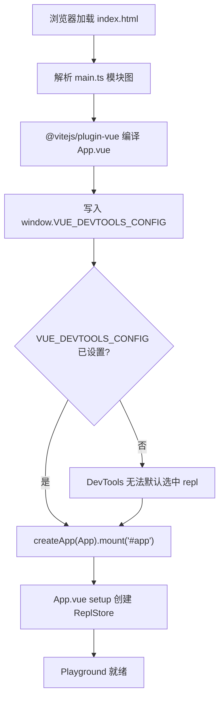
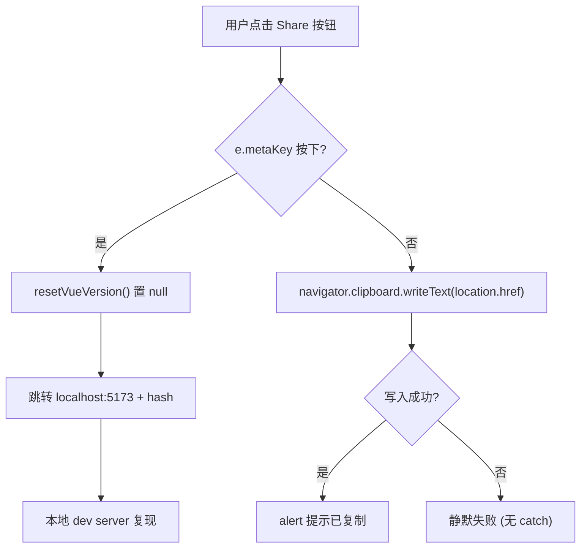
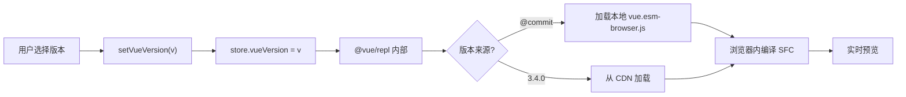

# Capítulo 7: SFC Playground: subsistema de compilação e depuração em tempo real no navegador

No capítulo anterior usamos mais de 20`.test-d.ts`arquivos para fixar «tipo como contrato de API» no CI. Mas contratos de tipo só respondem «como é a superfície da API», eles não conseguem responder «como este trecho de SFC é compilado» nem «se o resultado de renderização é consistente no modo SSR». Para responder às duas últimas perguntas, a equipe Vue precisa de um sandbox capaz de executar todo o pipeline de compilação no navegador — este é o`packages-private/sfc-playground`. Ele tem diferenças essenciais em relação aos pacotes públicos sob`packages/`:`package.json`em`"private": true`e`"version": "0.0.0"` [FACT:packages-private/sfc-playground/package.json:2-4], significa que ele nunca será publicado no npm, sendo apenas uma ferramenta oficial de depuração. Em suas dependências,`vue`aponta para`workspace:*` [FACT:packages-private/sfc-playground/package.json:19], ou seja, o artefato de build do código-fonte local, e não a versão estável no npm — isso faz do Playground naturalmente uma «demonstração viva do commit atual». Este capítulo foca em três questões: como a entrada é inicializada, como o Header impulsiona a troca de estado, e como constantes de tempo de build são injetadas.

# I. Minimalismo da entrada: o contrato de inicialização de main.ts e ReplStore

## Modelo intuitivo

`main.ts`tem apenas 9 linhas, como um «script de autoteste na inicialização»: antes de a aplicação Vue ser montada, primeiro insere em`window`uma configuração global, dizendo ao Vue DevTools «qual app selecionar por padrão». Sem esse passo, o DevTools ao abrir enfrentaria múltiplas instâncias de app (o próprio Playground + o código executado no REPL do usuário) e não conseguiria focar automaticamente, degradando a experiência de depuração para troca manual.

## Estrutura de dados e efeito colateral global

`main.ts`O núcleo de não é`createApp`, mas a escrita poluidora em`window`:

[FACT:packages-private/sfc-playground/src/main.ts:4-7]

```ts
// @ts-expect-error Custom window property
window.VUE_DEVTOOLS_CONFIG = {
  defaultSelectedAppId: 'repl',
}
```

Aqui há dois detalhes de engenharia dignos de nota:

> **[Design Inference & Architectural Trade-offs]**
> 1. **`@ts-expect-error`em vez de`@ts-ignore`**：`window`o tipo padrão de`Window & typeof globalThis`não possui o campo`VUE_DEVTOOLS_CONFIG`. Usar`@ts-expect-error`significa «eu sei que aqui vai dar erro, e exijo que dê erro» — se no futuro algum`@types/*`adicionar esse campo,`@ts-expect-error`irá gerar erro inverso por «não produzir erro», lembrando o autor a remover esse comentário. Isso está em linha com a abordagem dos testes de contrato de tipo do capítulo anterior:**usar o sistema de tipos para proteger a intenção, não para mascarar problemas**。

> **[Design Inference & Architectural Trade-offs]**
> 2. **`defaultSelectedAppId: 'repl'`a convenção de string de**: este`'repl'`deve ser completamente idêntico ao id usado internamente por`@vue/repl`ao criar o app. É um contrato literal entre pacotes, sem nenhuma proteção de restrição de tipo — uma vez que`@vue/repl`altere o id, a seleção padrão do DevTools do Playground falhará silenciosamente.

## Step-by-Step: do HTML à montagem

O fluxo de execução é extremamente curto, mas cada passo tem restrições implícitas:

1. O navegador carrega`index.html`, que contém`<div id="app">`(não fornecido neste material, mas`mount('#app')`pode-se inferir).

2. Resolução do grafo de módulos:`main.ts`no topo de`import App from './App.vue'` [FACT:packages-private/sfc-playground/src/main.ts:2]dispara`@vitejs/plugin-vue`a compilação SFC de.

> **[Design Inference & Architectural Trade-offs]**
> 3. **Ordem crítica**：`window.VUE_DEVTOOLS_CONFIG`deve ser escrito antes de`createApp(App).mount('#app')` [FACT:packages-private/sfc-playground/src/main.ts:9]. Porque o hook do DevTools é registrado dentro de`createApp`, escrever a configuração após o mount não afetará a seleção inicial.

4. `mount('#app')`dispara`App.vue`o setup de, criando então`ReplStore`(em`App.vue`, não incluído neste material).



## Reflexões de design e armadilhas

`main.ts`O minimalismo de é intencional:**empurrar toda a complexidade para`App.vue`e`ReplStore`**A entrada assume apenas duas responsabilidades: "injeção de efeitos colaterais globais + montagem". Nenhuma lógica de negócio deve aparecer aqui. Esta é uma escolha de design do Playground como "ferramenta de depuração" e não como "produto" — ele não precisa de compatibilidade com SSR, não precisa de múltiplas entradas, não precisa de lazy loading.

> **[Design Inference & Architectural Trade-offs]**
> Armadilhas em produção:`window.VUE_DEVTOOLS_CONFIG`é**Singleton global**. Se o Playground for incorporado em outra página que também usa DevTools (como em cenário de iframe), o último a escrever sobrescreve o anterior. Como o Playground geralmente é implantado de forma independente, esse risco é aceito.

---

# II. Header.vue: estado derivado por computed e fluxo de dados unidirecional via emit

## Modelo intuitivo

`Header.vue`é o "painel de controle" do Playground — seleção de versão, alternância PROD/DEV, chave SSR, alternância de tema, compartilhamento, download. Ele próprio**não mantém nenhum estado de negócio**, todo estado vem de`props.store`e props booleanas, todas as alterações são reportadas ao componente pai via`emit`. Sem essa restrição de "componente burro + propagação de eventos", o Header se tornaria um ponto crítico de estado disperso, e os efeitos colaterais da troca de versão e da alternância de SSR não poderiam ser gerenciados de forma centralizada.

## Análise da estrutura de dados e campos

A definição de props do Header é a chave para entender suas responsabilidades:

[FACT:packages-private/sfc-playground/src/Header.vue:13-19]

```ts
const props = defineProps()
```

As cinco props se dividem em duas categorias:

- **`store: ReplStore`**: referência ao único contêiner de estado, vindo de`@vue/repl`. O Header lê através dele`store.loading`、`store.vueVersion`、`store.typescriptVersion`, e escreve diretamente em`store.vueVersion`。
- **quatro props booleanas/literais**：`prod`、`ssr`、`autoSave`、`theme`. Elas são**estado controlado**, o Header apenas lê, não escreve; alterações devem`emit`。

a lista de emits correspondente[FACT:packages-private/sfc-playground/src/Header.vue:20-28]：

```ts
const emit = defineEmits([
  'toggle-theme',
  'toggle-ssr',
  'toggle-prod',
  'toggle-autosave',
  'reload-page',
])
```

Atenção`toggle-theme`embora seja`toggleDark()`internamente`emit`, mas`toggle-ssr`/`toggle-prod`/`toggle-autosave`é usado diretamente no template`$emit`o[FACT:packages-private/sfc-playground/src/Header.vue:102-118]. Essa mistura é um estilo comum do Vue 3`<script setup>`:**quando é necessário efeito colateral, usa-se emit como função; para repasse puro, usa-se o template`$emit`**。

## Passo a passo: exibição e troca de versão

Cenário: o usuário abre o Playground, o Header precisa exibir a versão atual do Vue.

**Passo 1: computed deriva o texto de exibição**

[FACT:packages-private/sfc-playground/src/Header.vue:30-37]

```ts
const vueVersion = computed(() => {
  if (store.loading) {
    return 'loading...'
  }
  return store.vueVersion || `@${__COMMIT__}`
})
```

Aqui há três níveis de prioridade:`loading`estado →`'loading...'`; usuário selecionou explicitamente uma versão →`store.vueVersion`; caso contrário →`@${__COMMIT__}`(hash curto do commit atual).`__COMMIT__`é uma constante injetada em tempo de build, detalhada na próxima seção.

**Passo 2: vinculação bidirecional do VersionSelect**

[FACT:packages-private/sfc-playground/src/Header.vue:88-88]

```html

```

Note que aqui**não foi usado`v-model`**, mas explicitamente separado em`:model-value` + `@update:model-value`. A razão é que`vueVersion`é computed (somente leitura), não pode ser vinculado bidirecionalmente de forma direta; é necessário usar`setVueVersion`essa função setter para escrever`store.vueVersion`：

[FACT:packages-private/sfc-playground/src/Header.vue:39-41]

```ts
async function setVueVersion(v: string) {
  store.vueVersion = v
}

function resetVueVersion() {
  store.vueVersion = null
}
```

> **[Design Inference & Architectural Trade-offs]**
> `setVueVersion`declarado como`async`mas internamente sem`await`— isso é legado histórico ou intencional? Presume-se que seja para alinhar com a semântica de carregamento assíncrono de`VersionSelect`(trocar de versão dispara carregamento remoto), mantendo a consistência da interface.

**Passo 3: comparação com a versão TypeScript**

[FACT:packages-private/sfc-playground/src/Header.vue:76-80]

```html

```

A versão TypeScript usou`v-model`, porque`store.typescriptVersion`é uma propriedade comum gravável, não precisa de encapsulamento com computed.**O mesmo componente usa dois modos de vinculação no mesmo template**, o que é a expressão visual de "controlado vs não controlado".

## Alternância de tema: combinação de efeitos colaterais e emit

[FACT:packages-private/sfc-playground/src/Header.vue:58-66]

```ts
function toggleDark() {
  const cls = document.documentElement.classList
  cls.toggle('dark')
  localStorage.setItem(
    'vue-sfc-playground-prefer-dark',
    String(cls.contains('dark')),
  )
  emit('toggle-theme', cls.contains('dark'))
}
```

Esta função faz três coisas: manipula a classe do DOM, persiste no localStorage, emite notificação ao componente pai.**Note que ela não altera diretamente`props.theme`**— porque props são somente leitura, o componente pai só atualiza`toggle-theme`após receber`theme`, o que por sua vez impulsiona o texto de`:title`no template[FACT:packages-private/sfc-playground/src/Header.vue:123]。

> **[Design Inference & Architectural Trade-offs]**
> Há um design sutil aqui:**A manipulação de classe do DOM e o estado reativo do Vue são dois caminhos independentes**。`document.documentElement.classList.toggle('dark')`altera diretamente o DOM, enquanto a prop`theme`é atualizada via Vue. Se os dois não estiverem sincronizados (por exemplo, o componente pai recusa a atualização), a UI apresentará inconsistência como "classe já alternada mas texto do title inalterado". Na prática, o componente pai sempre aceita o emit, então o problema não se manifesta.

## Lógica oculta: ramo metaKey do copyLink

[FACT:packages-private/sfc-playground/src/Header.vue:47-56]

```ts
async function copyLink(e: MouseEvent) {
  if (e.metaKey) {
    resetVueVersion()
    // hidden logic for going to local debug from play.vuejs.org
    window.location.href = 'http://localhost:5173/' + window.location.hash
    return
  }
  await navigator.clipboard.writeText(location.href)
  alert('Sharable URL has been copied to clipboard.')
}
```

Esta é uma**porta dos fundos para desenvolvedores**: em`play.vuejs.org`, segurar Cmd e clicar no botão de compartilhar redireciona para`localhost:5173`(servidor de dev local), levando junto o hash da URL atual. O hash codifica o estado completo do REPL (código-fonte, versão, opções), portanto a depuração local consegue reproduzir problemas de produção. O comentário`// hidden logic for going to local debug from play.vuejs.org` [FACT:packages-private/sfc-playground/src/Header.vue:47-56]marca explicitamente que esta é uma funcionalidade oculta intencional.

> **[Design Inference & Architectural Trade-offs]**
> `resetVueVersion()`é chamado antes do redirecionamento, definindo`store.vueVersion`como`null`, garantindo que a depuração local use o commit atual em vez da versão selecionada em produção.



## Reflexões de design e armadilhas

> **[Design Inference & Architectural Trade-offs]**
> **Armadilha 1:`navigator.clipboard`permissões e contexto de segurança de**。`copyLink`não tem try/catch[FACT:packages-private/sfc-playground/src/Header.vue:47-56]. Em contexto não-HTTPS ou quando o usuário nega permissão de área de transferência,`writeText`será rejeitado, causando Promise rejection não capturada. O Playground é implantado em HTTPS, o risco é aceito, mas esta é uma típica "armadilha de ambiente de produção".

> **[Design Inference & Architectural Trade-offs]**
> **Armadilha 2:`toggleDark`chave de localStorage de**。`'vue-sfc-playground-prefer-dark'`é literal de string, sem extração de constante. Se no futuro for preciso alterar a chave, será necessário buscar globalmente.

**Armadilha 3:`currentCommit`comparação entre`vueVersion`e**. No template`:class="{ active: vueVersion === \`@${currentCommit}\` }"` [FACT:packages-private/sfc-playground/src/Header.vue:88-88]Usar concatenação de strings para comparar. Se`__COMMIT__`a injeção falhar (tornar-se`undefined`), aqui tornar-se-á`'@undefined'`, nunca correspondendo. A confiabilidade da injeção de constantes em tempo de build determina diretamente a correção da UI — este é precisamente o tema da próxima secção.

---

# III. Injeção de constantes em tempo de build: as responsabilidades duplas de __COMMIT__ e copyVuePlugin

## Modelo intuitivo

`vite.config.ts`é a «oficina de montagem» do Playground: executa em tempo de build`git rev-parse`para obter o hash do commit, através de`define`transforma-o na constante global`__COMMIT__`; simultaneamente, através de um plugin personalizado, copia os artefactos ESM de browser em`packages/vue/dist/`para o diretório de artefactos do Playground. Sem este passo, o Playground não conseguiria carregar no browser «o runtime Vue do commit atual» — dependeria apenas da versão estável do npm, perdendo o sentido de «demonstração ao vivo».

## Estruturas de dados e constantes em tempo de build

[FACT:packages-private/sfc-playground/vite.config.ts:7-9]

```ts
const commit = spawnSync('git', ['rev-parse', '--short=7', 'HEAD'])
  .stdout.toString()
  .trim()
```

`spawnSync`executa sincronamente o comando git,`--short=7`obtém o hash curto de 7 caracteres. A execução síncrona é intencional:**o ficheiro de configuração precisa do valor de`commit`durante o carregamento do módulo**, e a assincronia perturbaria a ordem de resolução da configuração do Vite.

[FACT:packages-private/sfc-playground/vite.config.ts:23-26]

```ts
define: {
  __COMMIT__: JSON.stringify(commit),
  __VUE_PROD_DEVTOOLS__: JSON.stringify(true),
},
```

`define`é o mecanismo de**substituição de texto**do Vite: todas as ocorrências de`__COMMIT__`no código-fonte são substituídas pelo resultado de`JSON.stringify(commit)`(ou seja, um literal de string entre aspas).`JSON.stringify`é necessário — se escrevêssemos diretamente`commit`, após a substituição tornar-se-ia o identificador nu`abc1234`, tratado como nome de variável e não como string.

> **[Design Inference & Architectural Trade-offs]**
> `__VUE_PROD_DEVTOOLS__: true`é outra constante crucial: permite que a**build de produção**do Vue também preserve o suporte a DevTools. Por defeito, a build de produção remove o hook de DevTools para reduzir tamanho, mas o Playground precisa de depurar código do utilizador, pelo que é forçado a ativar.

## Passo a passo: o transporte de artefactos do copyVuePlugin

[FACT:packages-private/sfc-playground/vite.config.ts:32-63]

```ts
function copyVuePlugin(): Plugin {
  return {
    name: 'copy-vue',
    generateBundle() {
      const copyFile = (file: string) => {
        const filePath = path.resolve(
          import.meta.dirname,
          '../../packages',
          file,
        )
        const basename = path.basename(file)
        if (!fs.existsSync(filePath)) {
          throw new Error(
            `${basename} not built. ` +
              `Run "nr build vue -f esm-browser" first.`,
          )
        }
        this.emitFile({
          type: 'asset',
          fileName: basename,
          source: fs.readFileSync(filePath, 'utf-8'),
        })
      }

      copyFile(`vue/dist/vue.esm-browser.js`)
      copyFile(`vue/dist/vue.esm-browser.prod.js`)
      copyFile(`vue/dist/vue.runtime.esm-browser.js`)
      copyFile(`vue/dist/vue.runtime.esm-browser.prod.js`)
      copyFile(`server-renderer/dist/server-renderer.esm-browser.js`)
    },
  }
}
```

Análise ponto a ponto dos aspetos-chave:

1. **`generateBundle`hook**: executa após o Rollup gerar o bundle e antes de escrever no disco. Neste momento pode-se`emitFile`inserir ficheiros adicionais nos artefactos.

2. **`import.meta.dirname`**: versão ESM de`__dirname`fornecida pelo Node 20.11+. O caminho`../../packages`sobe de`packages-private/sfc-playground/`até à raiz do repositório, depois entra em`packages/`。

3. **verificação de existência + erro explícito**: se`vue.esm-browser.js`não existir, lança um erro com instruções de correção`Run "nr build vue -f esm-browser" first.`. Este é um**exemplo exemplar de experiência de programador**— a mensagem de erro diz diretamente como corrigir.

4. **Cinco artefactos**：`vue`versão completa/runtime × dev/prod, mais`server-renderer`. Estes cinco ficheiros são precisamente o conjunto de candidatos a import dinâmico do Playground no browser, correspondendo à alternância de versão e ao interruptor SSR no Header.

> **[Design Inference & Architectural Trade-offs]**
> **Porque estes cinco?**A versão completa (com compilador) serve o cenário de «compilação em runtime»; a versão runtime serve o cenário de «pré-compilação»; dev/prod correspondem à alternância PROD/DEV no Header; server-renderer corresponde ao interruptor SSR. Estes cinco ficheiros constituem a «matriz de runtime Vue» do Playground.

## O fluxo de dados completo da alternância de versão

Ligando o`setVueVersion`do Header aos artefactos do copyVuePlugin:



Atenção ao valor especial`@${__COMMIT__}`: corresponde aos artefactos locais copiados pelo copyVuePlugin, não ao CDN. É por isso que o Playground tem de copiar os artefactos de build de browser do Vue —**a opção «This Commit» precisa de ficheiros locais**。

## Reflexões de design e armadilhas

> **[Design Inference & Architectural Trade-offs]**
> **Armadilha 1:`spawnSync`tratamento de falha**. Se o diretório atual não for um repositório git (por exemplo, extraído de um tarball),`spawnSync`devolve um código de saída não nulo,`stdout`fica vazio,`commit`torna-se string vazia. Neste caso`__COMMIT__`é substituído por`""`, e no Header`@${currentCommit}`torna-se`'@'`. Não há tratamento de erro explícito.

> **[Design Inference & Architectural Trade-offs]**
> **Armadilha 2:`optimizeDeps.exclude: ['@vue/repl']`** [FACT:packages-private/sfc-playground/vite.config.ts:27-29]. O Vite, por defeito, pré-empacota dependências para acelerar o arranque a frio, mas`@vue/repl`é excluído. A razão é que`@vue/repl`usa internamente import dinâmico e workers, e o pré-empacotamento quebraria esses mecanismos. Este é um problema comum no ecossistema Vite de «conflito entre pré-empacotamento e carregamento dinâmico».

> **[Design Inference & Architectural Trade-offs]**
> **Armadilha 3:`script.fs`configuração** [FACT:packages-private/sfc-playground/vite.config.ts:13-19]。`@vitejs/plugin-vue`a opção`script.fs`permite que o bloco`<script>`do SFC leia ficheiros através de`fs`. Aqui passam-se`fs.existsSync`e`fs.readFileSync`, para suportar a análise de instruções`import`no SFC (por exemplo,`import x from './foo'`precisa de verificar se o ficheiro existe).**Esta é a chave para o Playground conseguir simular a resolução completa de módulos no browser**— injeta a capacidade fs do Node na fase de resolução do compilador.

---

# Reflexão de design: os compromissos arquiteturais do Playground

Ligando as três subsecções, a arquitetura do Playground segue um princípio claro:**separar «estado» de «efeitos secundários», separar «tempo de build» de «tempo de execução»**。

- `main.ts`apenas injeta efeitos secundários globais, sem tocar no estado de negócio.
- `Header.vue`é um componente puramente de apresentação, com estado a entrar via props e a sair via emit.
- `vite.config.ts`fixa a informação de tempo de build «commit atual» como constante, apenas de leitura em tempo de execução.

> **[Design Inference & Architectural Trade-offs]**
> Esta separação traz um benefício direto:**o Playground pode ser embutido em qualquer aplicação Vue**(por exemplo, exemplos incorporados em sites de documentação), bastando fornecer`store`e quatro props booleanas.

O custo é**Estado disperso**：`store`Em`@vue/repl`, o estado booleano está no componente pai, a classe DOM está em`document.documentElement`, e ainda há uma cópia no localStorage. Quatro locais de estado precisam ser sincronizados manualmente, e qualquer dessincronização causará inconsistência na UI.

> **[Design Inference & Architectural Trade-offs]**
> Outro trade-off é**abrir mão da compatibilidade com SSR**。`main.ts`acessar diretamente`window`，`Header.vue`do`toggleDark`acessar diretamente`document`. O Playground é uma aplicação puramente CSR, não precisa considerar renderização no servidor.

---

# Resumo do capítulo

Este capítulo analisou`packages-private/sfc-playground`os três arquivos centrais:

1. **`main.ts`**: entrada de 9 linhas, o núcleo é a ordem de injeção de`window.VUE_DEVTOOLS_CONFIG`— deve ser antes de`mount`.

2. **`Header.vue`**: através de`computed`deriva`vueVersion`, através de`emit`reporta todas as mudanças de estado.`copyLink`o`metaKey`branch é um backdoor oculto de depuração local.

3. **`vite.config.ts`**：`spawnSync`obtém o hash do commit,`define`injeta`__COMMIT__`，`copyVuePlugin`para mover os cinco artefatos de build do Vue para o navegador para o diretório de artefatos do Playground.

O fio condutor que atravessa os três é**a fronteira entre constantes de tempo de build e estado de tempo de execução**：`__COMMIT__`é um fato somente-leitura de tempo de build,`store.vueVersion`é uma escolha mutável de tempo de execução, o`vueVersion`computed do Header unifica ambos em uma única string de exibição.

# Reflexões e autoavaliação do capítulo

Q1: Se movermos a atribuição de`main.ts`em`window.VUE_DEVTOOLS_CONFIG`para depois de`createApp(App).mount('#app')`, o que acontecerá? Por quê?

**Análise de referência**：`window.VUE_DEVTOOLS_CONFIG`é a configuração lida pelo Vue DevTools ao registrar o hook dentro de`createApp`registrará imediatamente[FACT:packages-private/sfc-playground/src/main.ts:4-9]。`createApp`, nesse momento o DevTools lerá`__VUE_DEVTOOLS_GLOBAL_HOOK__`para decidir qual app selecionar por padrão. Se a atribuição ocorrer depois de`defaultSelectedAppId`, o DevTools já terá concluído a primeira seleção de app, a configuração não terá efeito, e o usuário precisará alternar manualmente no DevTools para o`mount`app. Mais sutil ainda: como`repl`também cria um app internamente, uma atribuição tardia pode fazer o DevTools selecionar por padrão o próprio Playground em vez do REPL do usuário, sendo necessário alternar manualmente ao depurar o código do usuário. Isso demonstra a importância da "ordem de injeção de efeitos colaterais globais" em ferramentas de depuração.`@vue/repl`o

Q2: `Header.vue`opera simultaneamente a classe DOM, o localStorage e o emit, mas não modifica diretamente`toggleDark()`. Se o componente pai, ao receber o evento`props.theme`, recusar atualizar o`toggle-theme`prop, que inconsistência de UI aparecerá? Como localizar no nível do código-fonte?`theme`Análise de referência

**em**：`toggleDark()`chama diretamente[FACT:packages-private/sfc-playground/src/Header.vue:58-66], o que altera imediatamente a`document.documentElement.classList.toggle('dark')`class no DOM, disparando a troca de variáveis CSS (ver`dark`a regra[FACT:packages-private/sfc-playground/src/Header.vue:186-186]). Mas o texto`.dark nav`no template`:title`depende de[FACT:packages-private/sfc-playground/src/Header.vue:123], se o componente pai não atualizar, o title permanecerá no valor antigo. Método de localização: inspecionar no DevTools do navegador se a class de`props.theme`e o atributo title do botão se contradizem. A causa raiz é que "efeitos colaterais no DOM" e "estado reativo do Vue" seguem dois caminhos independentes, sem uma única fonte de dados.`<html>`em

Q3: `copyVuePlugin`faz uma verificação de`generateBundle`para cada arquivo, lançando um erro com instruções de correção quando ausente. Se removermos essa verificação e fizermos`fs.existsSync`diretamente, o que acontecerá em um ambiente de CI (sem construir o vue previamente)? Como a mensagem de erro enganaria o desenvolvedor?`fs.readFileSync`Análise de referência

**: após remover a verificação,**lançará`fs.readFileSync`. Esse erro apenas informa ao desenvolvedor que "o arquivo não existe", mas não informa que "é necessário executar`ENOENT: no such file or directory, open '.../packages/vue/dist/vue.esm-browser.js'` [FACT:packages-private/sfc-playground/vite.config.ts:32-63]primeiro". Em um ambiente de CI, o desenvolvedor pode erroneamente pensar que é um erro de configuração de caminho, problema de permissão ou submódulo git não inicializado, desperdiçando muito tempo investigando. O`nr build vue -f esm-browser`do código original vincula o "sintoma" à "ação de correção", sendo um detalhe crucial de design de experiência do desenvolvedor. Isso também explica por que o script de build do Playground deve ter uma ordem de dependência clara em relação ao script de build do núcleo do Vue.`throw new Error(\`${basename} not built. Run "nr build vue -f esm-browser" first.\`)`O próximo capítulo entrará em

---

, para ver como o Vue visualiza os produtos intermediários do compilador (AST, resultados de transformação, geração de código), permitindo que o desenvolvedor observe passo a passo cada transformação do template até a função de renderização. Diferente do "black box ponta a ponta" do Playground, o Template Explorer é uma "sonda white box".`packages-private/template-explorer`Até aqui, vimos como o SFC Playground traz o pipeline de compilação para o navegador: inicialização da entrada, troca de estado do Header e injeção de constantes de tempo de build juntos formam um sandbox depurável em tempo real. Mas a perspectiva do Playground é sempre "a compilação e execução do SFC inteiro", ele não responde diretamente "o que o compilador realmente fez com uma determinada expressão de template". O próximo capítulo entrará no Template Explorer, para ver como ele expõe linha a linha os resultados de compilação de

e`@vue/compiler-dom`, usando SourceMapConsumer para estabelecer o mapeamento entre código-fonte e artefato, transformando o comportamento interno do compilador em uma sonda observável e reversível.`@vue/compiler-ssr`← Capítulo anterior: Capítulo 6
