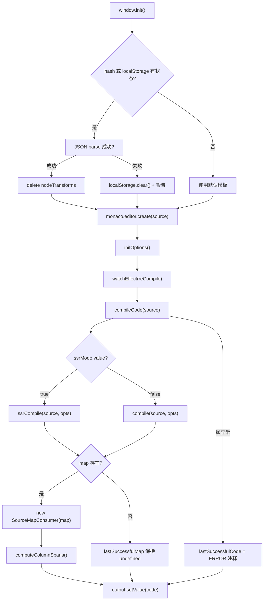
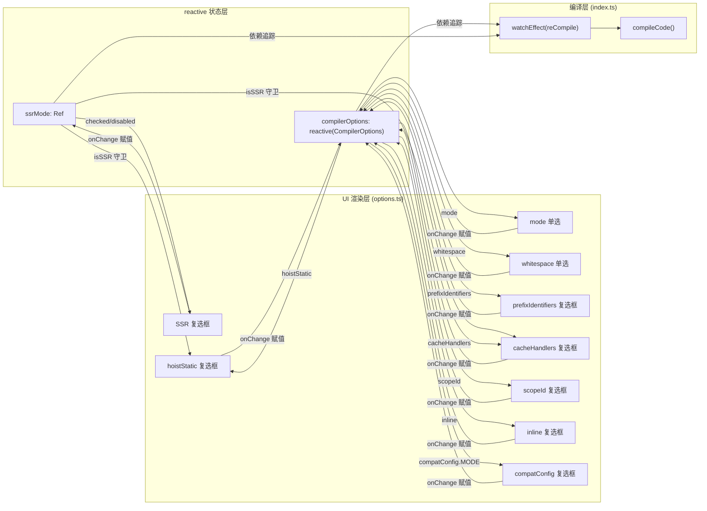

# Projeto pertencente: vuejs/core

No capítulo anterior, vimos como o SFC Playground encapsula toda a cadeia de "entrada SFC → compilação no navegador → pré-visualização em tempo real" numa caixa negra: o programador vê o resultado final da renderização, mas não vê o que o compilador faz pelo meio. Quando se escreve uma diretiva personalizada no template, ou quando se ativa hoistStatic e o resultado passa a incluir uma série de variáveis _hoisted_1, o Playground não consegue responder a "porque é que o compilador gera isto?". O Template Explorer tem precisamente a posição oposta: expõe por completo o resultado da compilação do @vue/compiler-dom e do @vue/compiler-ssr, a AST, as marcações de erro e o mapeamento de posições do código-fonte para o resultado. O seu núcleo não é "executar", mas "observar". Este capítulo organiza-se em torno de três ficheiros: index.ts trata da chamada de compilação e do mapeamento bidirecional de SourceMap, options.ts usa reactive para gerir dezenas de CompilerOptions e impulsionar a UI, theme.ts personaliza o tema do editor Monaco.

# Um, chamada de compilação e mapeamento bidirecional de SourceMap: index.ts

## Modelo intuitivo

O Template Explorer`index.ts`é como uma "máquina de tradução bidirecional": à esquerda entra o template, à direita sai a função de renderização. Mas tem uma capacidade extra em relação a uma máquina de tradução — quando colocas o cursor numa linha à esquerda, a direita realça o resultado correspondente; inversamente, se colocares o cursor à direita, a esquerda realça o template correspondente. Sem o mapeamento de SourceMap, esta ferramenta degeneraria em duas caixas de texto lado a lado, e o programador só poderia comparar a olho, sem conseguir estabelecer a cadeia causal "linha X do template → linha Y do resultado".

## Estruturas de dados e disposição em memória

`index.ts`não tem Structs complexas, mas tem algumas variáveis de estado críticas ao nível do módulo, que determinam o comportamento de toda a ferramenta:

`lastSuccessfulCode`e`lastSuccessfulMap`são a cache do resultado da compilação[FACT:packages-private/template-explorer/src/index.ts:74-75]. A primeira é uma string, a segunda é`SourceMapConsumer | undefined`. Nota que`lastSuccessfulMap`começa como`undefined`, e só é atribuído quando a compilação é bem-sucedida e`map`existe[FACT:packages-private/template-explorer/src/index.ts:99-100]. Este`undefined`estado é a condição de guarda para toda a lógica de mapeamento do cursor a seguir — se a compilação falhar, a funcionalidade de mapeamento desativa-se silenciosamente, em vez de lançar uma exceção.

`PersistedState`A interface define a forma do estado persistido em localStorage e no hash do URL[FACT:packages-private/template-explorer/src/index.ts:26-30]：`src`(código-fonte do template),`ssr`(se está em modo SSR),`options`(opções do compilador). Aqui há uma decisão de design importante:`options`o tipo de é o`CompilerOptions`completo, mas na persistência real só se guardam "os itens diferentes dos valores predefinidos"; esta lógica de recorte é feita em`reCompile`.

`sharedEditorOptions`são as opções de construção partilhadas pelos dois editores[FACT:packages-private/template-explorer/src/index.ts:26-30]：`fontSize: 14`、`scrollBeyondLastLine: false`、`renderWhitespace: 'selection'`、`minimap.enabled: false`. O minimap está desligado porque o template e o resultado costumam ter apenas algumas dezenas de linhas, e o minimap acaba por ocupar espaço horizontal.

## Step-by-Step Walkthrough

**Cenário: o utilizador abre a página, introduz`
{{ msg }}
`, e depois move o cursor.**

**Primeiro passo: inicialização e restauro de estado.** `window.init`é o ponto de entrada global[FACT:packages-private/template-explorer/src/index.ts:41]. Primeiro regista e ativa o tema personalizado[FACT:packages-private/template-explorer/src/index.ts:44-45], depois tenta restaurar o estado a partir do hash do URL ou do localStorage[FACT:packages-private/template-explorer/src/index.ts:49-56]. Nota a ordem de descodificação: primeiro`atob`e depois`escape`, e em seguida`decodeURIComponent`. Se a análise do hash falhar, faz fallback para`localStorage.getItem('state')`, e depois fallback para`{}`. Se todo o JSON.parse falhar, limpa o localStorage e imprime um aviso[FACT:packages-private/template-explorer/src/index.ts:57-64]。

Depois de restaurar o estado, há um detalhe fácil de ignorar:`delete persistedState.options?.nodeTransforms` [FACT:packages-private/template-explorer/src/index.ts:69]. O comentário explica a razão — as funções não podem ser serializadas, por isso na persistência`nodeTransforms`perde-se, e ao restaurar, se ficar um objeto vazio residual, isso provoca comportamento anómalo no compilador. Esta é a armadilha clássica de "persistir campos não serializáveis".

**Segundo passo: núcleo da compilação`compileCode`。**Este é o coração de toda a ferramenta[FACT:packages-private/template-explorer/src/index.ts:76-106]. Primeiro`console.clear()`, depois, conforme`ssrMode.value`, escolhe`ssrCompile`ou`compile` [FACT:packages-private/template-explorer/src/index.ts:80]. Nota os parâmetros da chamada a`compileFn`: expande`compilerOptions`, força`filename: 'ExampleTemplate.vue'`、`sourceMap: true`, e injeta`onError`callback para recolher erros[FACT:packages-private/template-explorer/src/index.ts:82-89]。

Aqui há uma decisão de design:`filename`está fixado em`'ExampleTemplate.vue'`. Este valor, nas chamadas subsequentes a`generatedPositionFor`, tem de corresponder exatamente a[FACT:packages-private/template-explorer/src/index.ts:189], caso contrário a consulta ao SourceMap devolve um resultado vazio. Este é um contrato implícito — as duas strings têm de ser iguais, mas nenhum sistema de tipos o garante.

Depois de concluída a compilação, os erros são convertidos para o formato de marker do Monaco e definidos no editor[FACT:packages-private/template-explorer/src/index.ts:91-95]。`formatError`converte`CompilerError`de`loc`para o`startLineNumber/startColumn/endLineNumber/endColumn` [FACT:packages-private/template-explorer/src/index.ts:108-119]do Monaco. Nota`errors.filter(e => e.loc)`— só os erros com informação de posição são marcados; os erros sem`loc`(como erros de configuração global) só são impressos na consola.

**Terceiro passo: criação do SourceMap.**Depois de a compilação ser bem-sucedida,`lastSuccessfulMap = new SourceMapConsumer(map!)` [FACT:packages-private/template-explorer/src/index.ts:99], e logo a seguir chama`computeColumnSpans()` [FACT:packages-private/template-explorer/src/index.ts:100]。`computeColumnSpans`é uma API fundamental de`source-map-js`: pré-calcula a amplitude de colunas de cada segmento de mapeamento, de modo a que`generatedPositionFor`devolva o`lastColumn`campo disponível. Sem este passo, o mapeamento inverso só consegue localizar a coluna inicial, sem conseguir realçar todo o intervalo do token.

**Quarto passo: mapeamento bidirecional do cursor.**Quando o utilizador, no**editor de código-fonte**, move o cursor, dispara`editor.onDidChangeCursorPosition` [FACT:packages-private/template-explorer/src/index.ts:184]. O callback, após 100ms de debounce, chama`lastSuccessfulMap.generatedPositionFor({ source: 'ExampleTemplate.vue', line, column: column - 1 })` [FACT:packages-private/template-explorer/src/index.ts:188-192]. Nota`column - 1`: os números de coluna do Monaco começam em 1, enquanto os do SourceMap começam em 0. O`pos`devolvido, se tiver`line`e`column`, cria um decorador no editor de saída para realçar o intervalo correspondente[FACT:packages-private/template-explorer/src/index.ts:194-206], e faz scroll até essa posição[FACT:packages-private/template-explorer/src/index.ts:207-210]。

O mapeamento inverso está em`output.onDidChangeCursorPosition`em[FACT:packages-private/template-explorer/src/index.ts:223]. Chama`originalPositionFor` [FACT:packages-private/template-explorer/src/index.ts:227-230], mas com uma guarda adicional: ignora`pos.line === 1 && pos.column === 0`de "mock location"[FACT:packages-private/template-explorer/src/index.ts:231-237]. Este guard é crucial — certos códigos gerados pelo compilador (como`import`instruções ou funções helper) não têm posição de template correspondente, e o SourceMap retorna`{ line: 1, column: 0 }`como placeholder. Se não for ignorado, colocar o cursor nessas linhas irá destacar erroneamente a primeira linha do template.

**Quinto passo: persistência de estado.** `reCompile`não apenas dispara a compilação, mas também é responsável por gravar o estado atual no localStorage e no URL hash[FACT:packages-private/template-explorer/src/index.ts:121-146]. Na persistência há uma lógica de filtragem: percorre`compilerOptions`, salvando apenas itens que "não são objetos e não são iguais ao valor padrão"[FACT:packages-private/template-explorer/src/index.ts:125-133]. Isso explica por que`bindingMetadata`opções desse tipo de objeto não são persistidas — é muito complexo, e o valor padrão já é suficiente para demonstração.

## Reflexões de design e armadilhas em produção

**Por que usar`source-map-js`em vez de`source-map`？** `source-map`é a biblioteca original da Mozilla, tem tamanho grande e depende de WASM (versões novas).`source-map-js`é uma implementação pura em JS, de tamanho pequeno, adequada para ambiente de navegador. O Template Explorer, sendo uma ferramenta puramente frontend, escolher`source-map-js`é razoável[FACT:packages-private/template-explorer/package.json:15]。

**Escolha do delay do debounce.**O debounce do editor de código-fonte tem padrão de 300ms[FACT:packages-private/template-explorer/src/index.ts:271], enquanto o debounce do movimento do cursor é de 100ms[FACT:packages-private/template-explorer/src/index.ts:215]. Essa diferença é intencional: compilar é uma operação pesada, 300ms evita disparos frequentes; mover o cursor é uma operação leve, 100ms garante sensação de resposta. Mas 100ms ainda pode causar piscadas no destaque ao mover o cursor rapidamente — é um trade-off aceitável.

**`window.init`Montagem global de**. Observe que`window.init`e`window.monaco`estão ambos montados no global[FACT:packages-private/template-explorer/src/index.ts:19-23]. Isso porque o editor Monaco é carregado assincronamente via CDN`loader.js`, e após o carregamento chama`window.init`. Esse padrão de "callback global" é o uso padrão do Monaco em ambientes não modularizados, mas é incompatível com formas modernas de build ESM.

---

# Dois, painel de opções orientado por reactive: options.ts

## Modelo intuitivo

`options.ts`funciona como um "painel de console": há mais de uma dúzia de switches e radio buttons, cada um correspondendo a um comportamento do compilador. Ao alternar qualquer switch, o artefato de compilação à direita muda imediatamente. Sem esse módulo, o desenvolvedor só poderia alterar os parâmetros da chamada de`compile`no código-fonte e recompilar, sem conseguir comparar em tempo real os efeitos de diferentes opções.

## Estrutura de dados e layout de memória

`options.ts`O núcleo de

`ssrMode`são três exportações:`ref(false)` [FACT:packages-private/template-explorer/src/options.ts:5]é um`compilerOptions`. Ele é independente de`compile` vs `ssrCompile`, porque o modo SSR alterna a própria função de compilação (

`defaultOptions`), e não as opções de compilação.`CompilerOptions`é um objeto completo de[FACT:packages-private/template-explorer/src/options.ts:5-27]. Ele define os valores padrão de todas as opções, incluindo`mode: 'module'`、`prefixIdentifiers: false`、`hoistStatic: false`、`cacheHandlers: false`、`scopeId: null`、`inline: false`、`ssrCssVars: '{ color }'`、`compatConfig: { MODE: 3 }`、`whitespace: 'condense'`, e um`bindingMetadata` [FACT:packages-private/template-explorer/src/options.ts:18-26]。

`compilerOptions`contendo 7 tipos de binding`reactive(Object.assign({}, defaultOptions))` [FACT:packages-private/template-explorer/src/options.ts:29-31]é`Object.assign({}, ...)`. Observe que aqui foi usado`reactive(defaultOptions)`para cópia superficial — se fosse diretamente`compilerOptions`, modificar`defaultOptions`contaminaria`reCompile`, fazendo com que a lógica de "comparação com o valor padrão" em

## Step-by-Step Walkthrough

**falhasse.**

**Cenário: o usuário clica na checkbox "hoistStatic".** `App`Primeiro passo: renderização da UI.`setup`O[FACT:packages-private/template-explorer/src/options.ts:33-35]do componente`ssrMode.value`、`compilerOptions.mode`、`compilerOptions.prefixIdentifiers`retorna uma função de renderização[FACT:packages-private/template-explorer/src/options.ts:36-39]. Essa função de renderização lê

**e outros estados reativos** `hoistStatic`, portanto quando esses estados mudam, toda a UI é re-renderizada.`checked`Segundo passo: binding checked da checkbox.`compilerOptions.hoistStatic && !isSSR` [FACT:packages-private/template-explorer/src/options.ts:150]A propriedade`hoistStatic`da checkbox`disabled: isSSR` [FACT:packages-private/template-explorer/src/options.ts:151]é

**. Há uma lógica aqui: no modo SSR,**é forçado a aparecer como não marcado, porque a compilação SSR não suporta hoisting estático. Ao mesmo tempo,`onChange`garante que o usuário não possa alterná-lo no modo SSR.[FACT:packages-private/template-explorer/src/options.ts:152-156]Terceiro passo: tratamento do onChange.`e.target.checked`Quando o usuário clica na checkbox,`compilerOptions.hoistStatic`dispara`compilerOptions`, atribuindo diretamente`reactive`a`watchEffect(reCompile)` [FACT:packages-private/template-explorer/src/index.ts:266]. Como

**é**de`cacheHandlers`, essa atribuição dispara o rastreamento de dependências, que por sua vez dispara`checked`, e finalmente recompila.`usePrefix && compilerOptions.cacheHandlers && !isSSR` [FACT:packages-private/template-explorer/src/options.ts:166]，`disabled`Quarto passo: interligação entre opções.`!usePrefix || isSSR` [FACT:packages-private/template-explorer/src/options.ts:167]Observe que`cacheHandlers`o`prefixIdentifiers`de`mode === 'module'`é`prefixIdentifiers`é`function`. Isso significa que`cacheHandlers`depende de

`scopeId`ou`disabled: !isModule` [FACT:packages-private/template-explorer/src/options.ts:182]，`checked: isModule && compilerOptions.scopeId` [FACT:packages-private/template-explorer/src/options.ts:183]. Essa relação de interligação se manifesta na UI como: quando`isModule`não está ativado e o modo é`null` [FACT:packages-private/template-explorer/src/options.ts:184-189]。

**, a checkbox** `initOptions`fica desabilitada.`createApp(App).mount(document.getElementById('header')!)` [FACT:packages-private/template-explorer/src/options.ts:232-234]A interligação de`vue`é mais complexa:`createApp`. Só no modo module é possível definir scopeId, e no onChange, se`@vue/runtime-dom`for false, será forçado para`options.ts`Quinto passo: montagem.`vue`chama

## do pacote

**, e não`reactive`— porque`ref`？** `compilerOptions`é código de camada de aplicação, podendo depender diretamente do pacote completo`reactive`.`compilerOptions.hoistStatic = true`Copiar`compilerOptions.value.hoistStatic = true`Reflexões de design e armadilhas em produção`reactive`Por que usar`compilerOptions.xxx`em vez de

**`bindingMetadata`é um objeto contendo mais de uma dúzia de campos; usar**permite diretamente[FACT:packages-private/template-explorer/src/options.ts:18-26], sem precisar de`SETUP_CONST`、`SETUP_REF`、`SETUP_LET`、`SETUP_MAYBE_REF`、`PROPS`. Isso é mais conciso no código de UI. Mas o custo de`prefixIdentifiers`é que a desestruturação perde reatividade — no código-fonte não há nenhuma desestruturação, tudo é acessado via`$setup`, o que é o uso correto.`prefixIdentifiers`Design dos valores padrão de

**`compatConfig`. Os valores padrão de** `compilerOptions.compatConfig!.MODE = 2` [FACT:packages-private/template-explorer/src/options.ts:216-220]incluem 7 bindings`reactive`, cobrindo`reactive`cinco tipos. Isso é para que o desenvolvedor, ao abrir`compatConfig`, possa ver imediatamente o impacto de diferentes tipos de binding na forma de acesso a`CompatConfig | undefined`no artefato. Sem esse valor padrão,`!`o efeito de`compatConfig`seria muito monótono.

**`ssrMode`Reatividade aninhada de`compilerOptions`. Atribuições aninhadas como** `ssrMode`são reativas sob`ref`，`compilerOptions`, porque`reactive`faz proxy recursivo de objetos aninhados. Mas observe que o tipo de`ssr`é`compilerOptions`, então foi usada uma asserção`ssr`. Se não houvesse`CompilerOptions`nos valores padrão, aqui ocorreria um crash em tempo de execução.

---

# Separação de responsabilidades entre

## e

`theme.ts`É como "trocar a pele" do editor: define a cor e o estilo de fonte de cada token de sintaxe. Sem este módulo, o Monaco usaria o tema`vs-dark`padrão, que embora funcional, faria com que tags HTML, expressões e diretivas em templates Vue carecessem de distinção visual, dificultando a localização rápida de partes-chave pelo desenvolvedor.

## Estrutura de dados e layout de memória

`theme.ts`Exporta um objeto compatível com a interface do Monaco`IStandaloneThemeData`.[FACT:packages-private/template-explorer/src/theme.ts:1-244]Ele possui três campos de nível superior:

`base: 'vs-dark'`Especifica o tema base[FACT:packages-private/template-explorer/src/theme.ts:2]，`inherit: true`Representa regras que herdam do tema base[FACT:packages-private/template-explorer/src/theme.ts:3]. Isso significa que só é necessário definir as diferenças; tokens não definidos farão fallback para`vs-dark`。

`rules`É um array, cada elemento contém`token`(nome do token no Monaco) e`foreground`/`background`/`fontStyle` [FACT:packages-private/template-explorer/src/theme.ts:4-235]. Este array tem mais de 50 entradas, cobrindo tipos de token como number, comment, keyword, string, variable, entity.name.tag, etc.

`colors`Define as cores da UI do editor[FACT:packages-private/template-explorer/src/theme.ts:236-243]：`editor.foreground`、`editor.background`、`editor.selectionBackground`、`editor.lineHighlightBackground`、`editorCursor.foreground`、`editorWhitespace.foreground`。

## Step-by-Step Walkthrough

**Cenário: registrar o tema no carregamento da página.**

**Primeiro passo: definir o tema.** `monaco.editor.defineTheme('my-theme', theme)` [FACT:packages-private/template-explorer/src/index.ts:44]. Esta chamada registra`theme.ts`o objeto exportado no registro de temas do Monaco, com a chave`'my-theme'`。

**Segundo passo: ativar o tema.** `monaco.editor.setTheme('my-theme')` [FACT:packages-private/template-explorer/src/index.ts:45]. Esta linha deve ser chamada após`defineTheme`, caso contrário lançará o erro "tema não definido".

**Terceiro passo: correspondência de tokens.**Quando o Monaco renderiza o código do template, ele tokeniza o código usando o serviço de linguagem HTML e então busca pelo nome do token as regras em`rules`. Por exemplo,`
`em`div`será marcado como`entity.name.tag`, correspondendo a`foreground: 'cc6666'` [FACT:packages-private/template-explorer/src/theme.ts:41-44], exibido em vermelho.

## Reflexões de design e armadilhas em produção

**Por que usar`inherit: true`？**Se não herdar, seria necessário definir as cores de todos os tokens, incluindo aqueles que não aparecem no template (como`markup.heading`、`meta.diff`). A herança permite que o arquivo de tema foque apenas nos tokens que realmente aparecem no template e no produto JS.

**Correspondência hierárquica de nomes de token.**A correspondência de tokens do Monaco é por prefixo:`entity.name.tag`corresponderá a`entity.name.tag.html`、`entity.name.tag.css`etc. O código-fonte define tanto`entity.name.tag` [FACT:packages-private/template-explorer/src/theme.ts:41-44]quanto`entity.name.tag.css` [FACT:packages-private/template-explorer/src/theme.ts:169-172], o último sobrescrevendo o cenário CSS específico do primeiro.

**`colors`Divisão de responsabilidades entre`rules`e** `rules`controla a cor do texto do código,`colors`controla as cores da UI do editor (fundo, cursor, linha selecionada). Ambos são independentes, mas precisam de coordenação visual. No código-fonte,`editor.background: '#1D1F21'`e`base: 'vs-dark'`têm fundos padrão próximos, para manter consistência visual.

---

# Reflexão de design: trade-offs de engenharia de uma sonda visual

A diferença central entre o Template Explorer e o SFC Playground está na "granularidade de observação". O Playground observa "se o SFC completo compilado pode ser executado", enquanto o Template Explorer observa "no que uma única expressão de template é compilada". Essa diferença determina as escolhas técnicas das duas ferramentas:

**A introdução do SourceMapConsumer é inevitável.**Sem ele, o desenvolvedor só poderia comparar código-fonte e produto a olho nu, sem estabelecer um mapeamento preciso de "linha X → linha Y". Mas a API do SourceMapConsumer é assíncrona (versões novas retornam Promise); o código-fonte usa a versão síncrona`source-map-js`, para simplificar a lógica de chamada.

**`reactive`Gerenciar opções é a escolha natural no ecossistema Vue.**Se fosse usado gerenciamento manual de sincronização de estado de uma dúzia de opções com eventos DOM nativos, a quantidade de código dobraria.`reactive`O rastreamento de dependências de`watchEffect(reCompile)`torna automática a cadeia "mudança de opção → recompilação", com uma linha de código realizando a subscrição.

**O modo de carregamento global do Monaco é um fardo histórico.** `window.monaco`O modo de montagem global de`window.init`e

---

# vem do design do carregador AMD do Monaco. Em builds ESM modernos, isso parece deslocado, mas o tamanho do Monaco (cerca de 5MB) torna o carregamento sob demanda ainda necessário.

Resumo do capítulo`index.ts`O Template Explorer é uma "sonda de caixa branca": ele não executa o produto compilado, apenas mostra o processo de compilação.`compileCode`Através de`@vue/compiler-dom`chamando`@vue/compiler-ssr`ou`SourceMapConsumer`, usa`options.ts`para estabelecer mapeamento bidirecional entre código-fonte e produto, e implementa destaque sincronizado do cursor via API de decoradores do Monaco.`reactive`Usa`CompilerOptions`para gerenciar`watchEffect`, aciona recompilação via`hoistStatic`, e as relações de dependência entre opções (como SSR desabilitando`theme.ts`) são codificadas explicitamente na camada de UI.

Personaliza o tema do Monaco, dando aos tokens de sintaxe do template e do produto uma distinção visual clara.`hoistStatic`O valor central desta ferramenta está em "usar a ferramenta para inferir o comportamento do compilador": quando você não tem certeza do que

# fez com um determinado template, abra o Template Explorer, alterne as opções e observe as mudanças no produto. Isso é mais intuitivo do que ler o código-fonte do compilador e mais confiável do que adivinhar.

Reflexões e autoavaliação do capítulo`index.ts`Q1: Se for removida a guarda de mock location (`originalPositionFor`) de`pos.line === 1 && pos.column === 0`em`{ line: 1, column: 0 }`, em quais cenários isso causaria destaque incorreto? Por que o compilador gera mapeamentos como

**?**Análise de referência[FACT:packages-private/template-explorer/src/index.ts:231-237]: A guarda está em`import { createElementVNode as _createElementVNode } from 'vue'`. O compilador, ao gerar o produto, insere código sem posição correspondente no template, como instruções de importação de helpers como`export function render(_ctx, _cache) { ... }`, ou assinaturas de função como`source-map-js`. Esses códigos não têm posição original no SourceMap,`{ line: 1, column: 0 }`retornará`originalPositionFor`como placeholder. Se a guarda for removida, quando o usuário posicionar o cursor nessas linhas,`{ line: 1, column: 0 }`, o código considerará esta uma posição válida e criará um decorador de destaque na primeira linha e primeira coluna do editor de código-fonte. O resultado é: o usuário clica no artefato`import`linha, a primeira linha do editor de código-fonte é destacada incorretamente, causando confusão. A essência desta guarda é "distinguir mapeamento real de mapeamento de espaço reservado", e`{ line: 1, column: 0 }`é`source-map-js`o valor sentinela de "sem mapeamento" convencionado.

Q2: `reCompile`opções de persistência, a condição`typeof val !== 'object' && val !== defaultOptions[key]`ignorará todas as opções do tipo objeto. Se`bindingMetadata`for modificado pelo usuário (por exemplo, através do console), esta modificação será perdida após atualizar a página. Isto é um bug ou design intencional? Se quisermos suportar`bindingMetadata`na persistência, quais problemas precisam ser resolvidos?

**Análise de referência**: a condição está localizada em[FACT:packages-private/template-explorer/src/index.ts:129]. Isto é design intencional, por três razões: primeiro,`bindingMetadata`o valor é`BindingTypes`enum, após serialização é um número, e na desserialização não é possível distinguir entre "usuário definiu explicitamente como 0" e "valor padrão"; segundo,`compatConfig`é um objeto aninhado,`val !== defaultOptions[key]`compara referências, sempre será true, fazendo com que todas as opções de objeto sejam persistidas; terceiro,`nodeTransforms`contém funções, não pode ser serializado, e no código-fonte já foi tratado através de`delete persistedState.options?.nodeTransforms`para lidar com[FACT:packages-private/template-explorer/src/index.ts:69]. Se quisermos suportar`bindingMetadata`, é necessário implementar comparação profunda (em vez de comparação por referência), e também lidar com a serialização/desserialização de valores enum. O problema mais fundamental é:`bindingMetadata`não tem entrada de edição na UI, o usuário só pode modificar através do console, e este tipo de modificação por si só não deveria ser persistida.

Q3: `options.ts`em`compilerOptions`é criado com`reactive(Object.assign({}, defaultOptions))`. Se`Object.assign({}, defaultOptions)`for alterado para diretamente`reactive(defaultOptions)`, o que acontecerá após o usuário alternar a opção e atualizar a página? Por quê?

**Análise de referência**：`Object.assign({}, defaultOptions)`é uma cópia superficial, localizada em[FACT:packages-private/template-explorer/src/options.ts:29-31]. Se for alterado para`reactive(defaultOptions)`，`compilerOptions`e`defaultOptions`apontarão para o mesmo objeto. Quando o usuário alternar`hoistStatic`para true,`compilerOptions.hoistStatic`se torna true, e ao mesmo tempo`defaultOptions.hoistStatic`também se torna true. Então a lógica de persistência em`reCompile`[FACT:packages-private/template-explorer/src/index.ts:129]irá comparar`val !== defaultOptions[key]`, neste momento`val`e`defaultOptions[key]`são ambos true, a condição é false, e esta opção não será salva no localStorage. Após atualizar a página,`defaultOptions`é reinicializado como`hoistStatic: false`, a modificação do usuário é perdida. Mais grave ainda, após`defaultOptions`ser poluído, toda a lógica subsequente de "comparação com valor padrão" falhará, causando o colapso completo da funcionalidade de persistência. A sutileza deste bug está em: tudo funciona normalmente dentro de uma única sessão, só é possível descobrir após atualizar.

---

O próximo capítulo entrará em`scripts/release.js`, para ver como o Vue orquestra todo o fluxo de atualização de número de versão, build, testes, commit Git, criação de tag e npm publish com uma máquina de estados interativa. Diferente da "observação" do Template Explorer, o release.js é "execução" — ele precisa manter estado entre múltiplos passos, lidar com rollback em caso de falha, e equilibrar entre confirmação interativa e automação.

Através do Template Explorer, dominamos como transformar o estado interno do compilador — AST, artefatos de compilação, SourceMap — em sondas visualizáveis interativas, transformando "por que o compilador gera assim" de suposição em observação. Este controle preciso e orquestração do estado interno também se reflete no processo de release do Vue: o próximo capítulo mergulhará em scripts/release.js, para ver como uma máquina de estados de mais de 500 linhas usa parseArgs para analisar mais de dez flags, confirma interativamente o número de versão através do enquirer, e dispara sequencialmente build, testes, commit Git, criação de tag e npm publish, revelando o fluxo completo de estados e a estratégia de rollback em caso de falha por trás de um lançamento oficial.
