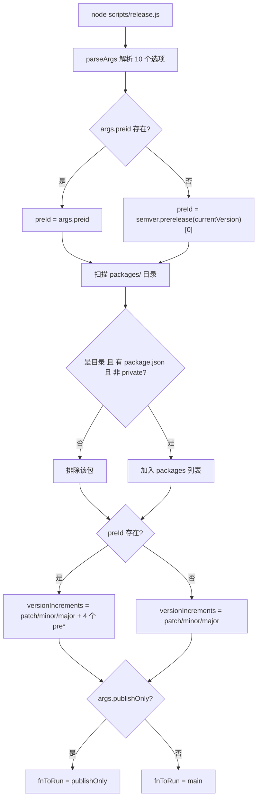
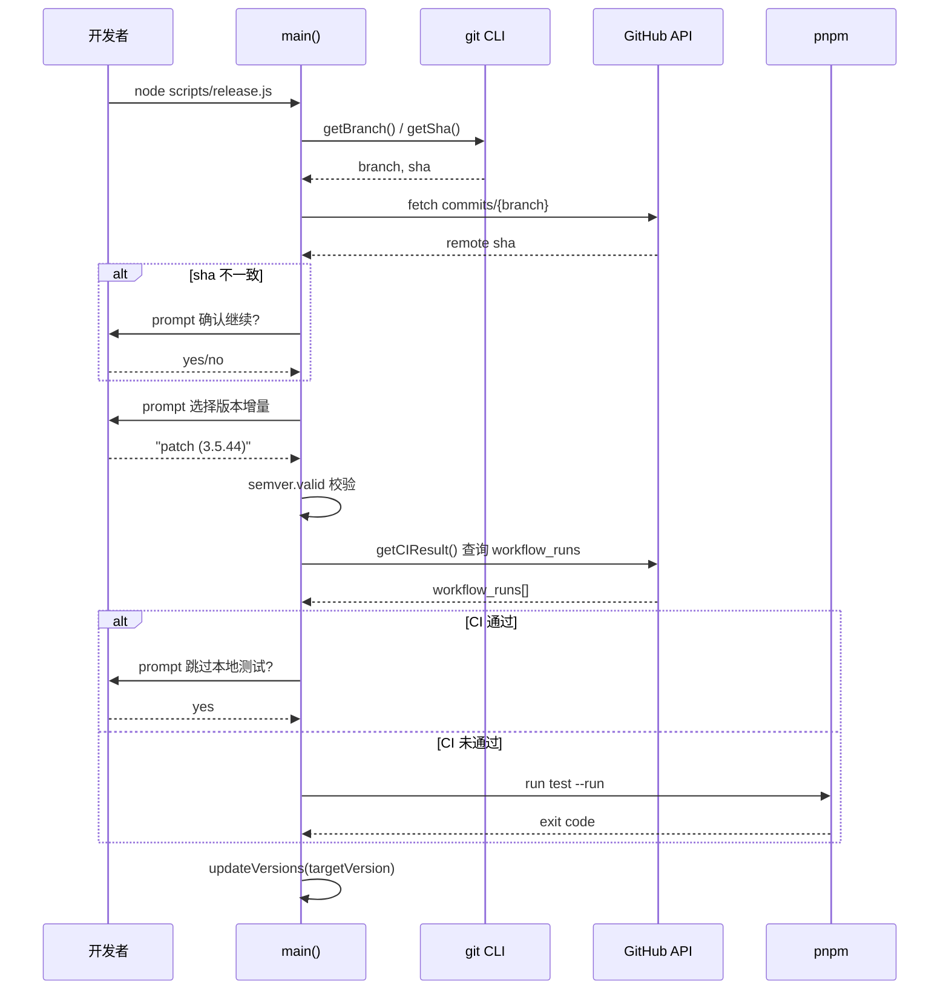
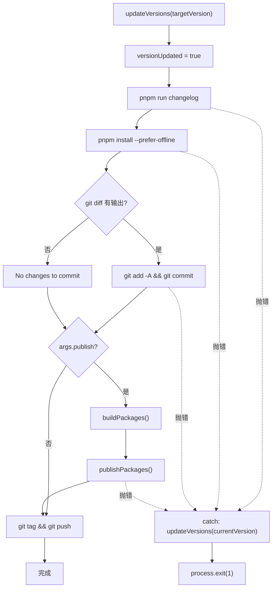

# Capítulo 9: Automação de Release: Máquina de Estados e Orquestração Interativa do release.js

No capítulo anterior, através do template-explorer, inferimos o comportamento do compilador e dominamos a metodologia de usar ferramentas para observar mecanismos internos. Agora, voltamos nosso olhar do tempo de compilação para o tempo de release — este é o momento mais perigoso de qualquer projeto open source: ele toca simultaneamente quatro sistemas externos irreversíveis: número de versão, artefatos de build, histórico Git e npm registry. Um npm publish errado não pode ser desfeito, um push de tag errado poluirá a resolução de dependências de todos os usuários downstream. O Vue core usa um scripts/release.js de 537 linhas para domar este perigo — ele não é nem um script puramente automatizado, nem uma lista de verificação puramente manual, mas sim uma máquina de estados interativa: para em pontos críticos para perguntar ao humano, executa totalmente automático em pontos previsíveis, e faz rollback do número de versão ao ponto inicial em caso de falha em qualquer passo. Este capítulo desmontará os três mecanismos centrais deste orquestrador: análise de parâmetros e inicialização de estado, decisão interativa de versão e gate de CI, e ordem de release e rollback em caso de falha.

# Análise de parâmetros e inicialização de estado global

## Modelo intuitivo

Imagine`release.js`como o painel de controle de uma máquina de lavar antiga: o botão (`parseArgs`) decide qual modo usar, as luzes indicadoras (variáveis globais) registram em qual estágio está atualmente, e o botão "cancelar" (tratamento de erros) deve ser capaz de restaurar a máquina ao estado antes de começar a encher de água. Sem esta lógica de inicialização, o script perderia o controle na questão "qual versão o usuário realmente quer lançar" — ou lançaria a versão errada, ou travaria no CI esperando uma entrada de teclado que nunca chegará.

## Layout de memória de flags e estado global

> **[Design Inference & Architectural Trade-offs]**
> A primeira coisa que o script faz após iniciar é analisar os argumentos da linha de comando em um objeto estruturado. Aqui é usado o`parseArgs`integrado do Node, em vez de`yargs`ou`commander`— isso é para eliminar dependências de terceiros, porque o próprio script de publicação precisa rodar em qualquer ambiente, mesmo que`node_modules`esteja pela metade.

[FACT:scripts/release.js:27-62]define 10 opções, que podem ser divididas em quatro categorias:

- **Categoria de semântica de versão**：`preid`(identificador de pré-lançamento, como`alpha`/`beta`/`rc`）、`tag`（npm dist-tag）
- **Categoria de pulo**：`skipBuild`、`skipTests`、`skipGit`、`skipPrompts`— esses quatro interruptores booleanos constituem os botões de ajuste do "grau de automação"
- **Categoria de modo de execução**：`dry`(simulação),`publish`(se publica diretamente localmente),`publishOnly`(apenas publica sem atualizar a versão)
- **Categoria de alvo**：`registry`(endereço de registry personalizado)

Observe que o valor padrão de`publish`é`false` [FACT:scripts/release.js:51-54], enquanto os outros itens booleanos não têm valor padrão (ou seja,`undefined`). Essa assimetria é intencional:`publish`A semântica de é "se deve executar npm publish localmente", por padrão não publica, deixando a ação de publicação para o GitHub Actions; enquanto`skipXxx`por padrão`undefined`significa "não especificado", e a lógica subsequente distinguirá "o usuário passou explicitamente`--skipTests`" de "o usuário não passou".

Após a análise, o script achata os parâmetros em um conjunto de variáveis em nível de módulo[FACT:scripts/release.js:64-66]：

```js
const preId = args.preid || semver.prerelease(currentVersion)?.[0]
const isDryRun = args.dry
let skipTests = args.skipTests
const skipBuild = args.skipBuild
const skipPrompts = args.skipPrompts
const skipGit = args.skipGit
```

Há dois designs interessantes aqui. Primeiro, a prioridade de valor de`preId`é "especificação explícita na linha de comando > inferência a partir da versão atual"[FACT:scripts/release.js:64-66]. Se a versão atual de`package.json`for`3.5.0-beta.1`, então`semver.prerelease`retornará`['beta', 1]`, e ao obter`[0]`resulta em`'beta'`. Isso significa que, ao publicar versões consecutivas no branch beta, não é necessário digitar`--preid beta`toda vez. Segundo,`skipTests`é declarado com`let`enquanto os outros usam`const` [FACT:scripts/release.js:64-66], porque ele será dinamicamente reescrito pelo resultado do CI em`runTestsIfNeeded`— este é um estado de "decisão adiada".

Em seguida vem a lógica de descoberta de pacotes[FACT:scripts/release.js:68-83]: lê o diretório`packages/`, filtra itens que não são diretórios, itens sem`package.json`, e pacotes`private: true`. Observe que aqui é lido`packages/`em vez de`packages-private/`— este último é um pacote de depuração interno, nunca publicado.

## Algoritmo de ordenação da sequência de publicação

[FACT:scripts/release.js:85-85]define uma função aparentemente simples, mas crucial:

```js
const sortPackagesForPublishing = (packageNames) => [
  ...packageNames.filter(p => p !== 'vue'),
  ...packageNames.filter(p => p === 'vue'),
]
```

Ela coloca o pacote de entrada`vue`por último. O comentário[FACT:scripts/release.js:85-85]explica o motivo: se`vue`for publicado primeiro, os usuários poderão instalar a nova versão de`@vue/runtime-core`antes que pacotes internos como`vue`estejam online, e o npm reportará erro por não encontrar a dependência interna correspondente. Esta é a solução de compromisso da "atomicidade de publicação" no ecossistema npm — o npm não tem transações entre pacotes, então só resta aproximar a atomicidade pela ordem.

## Construção dinâmica do conjunto de candidatos de incremento de versão

[FACT:scripts/release.js:111-116]constrói os itens candidatos do menu interativo:

```js
const versionIncrements = [
  'patch', 'minor', 'major',
  ...(preId ? ['prepatch', 'preminor', 'premajor', 'prerelease'] : []),
]
```

Esta é uma expansão condicional: somente quando`preId`existe (ou seja, atualmente está no canal de pré-lançamento, ou o usuário especificou explicitamente`--preid`), os tipos de incremento relacionados a pré-lançamento são adicionados ao menu. Se atualmente for uma versão estável`3.5.43`e`preid`não for especificado, o menu terá apenas os três itens`patch/minor/major`— evitando que o usuário, por operação equivocada, transforme a versão estável em uma versão de pré-lançamento meia-boca como`3.5.44-0`.

`inc`A função[FACT:scripts/release.js:120-120]encapsula`semver.inc`, passando`preId`como terceiro parâmetro. Há uma defesa de tipo aqui:`typeof preId === 'string' ? preId : undefined`— porque`preId`pode ser`string | undefined`, e`semver.inc`espera`string | undefined`, esta expressão ternária serve para satisfazer o narrowing de tipo do TS.

## Primitivas de execução: o sistema de trilhos duplos de run e dryRun

[FACT:scripts/release.js:122-123]é um dos designs mais engenhosos de todo o capítulo:

```js
const run = async (bin, args, opts = {}) =>
  exec(bin, args, { stdio: 'inherit', ...opts })
const dryRun = async (bin, args, opts = {}) =>
  console.log(pico.blue(`[dryrun] ${bin} ${args.join(' ')}`), opts)
const runIfNotDry = isDryRun ? dryRun : run
```

`run`define o stdio do subprocesso como`inherit`, permitindo que a saída de build/teste seja transmitida diretamente ao terminal — isso é crucial para builds de longa duração, pois o usuário pode ver o progresso em tempo real.`dryRun`apenas imprime o comando sem executá-lo.`runIfNotDry`é uma "seleção de estratégia": no carregamento do módulo, o ponteiro de função é vinculado a`dryRun`ou`run`, e todos os pontos de chamada subsequentes não precisam mais julgar`isDryRun`。

> **[Design Inference & Architectural Trade-offs]**
> Esse padrão de "decidir a estratégia na inicialização" é menos propenso a erros do que "julgar em cada ponto de chamada": se algum ponto de chamada esquecer de julgar`isDryRun`, no modo dry run ele realmente executará efeitos colaterais. Já`runIfNotDry`concentra o julgamento em um único lugar, eliminando a possibilidade desse tipo de omissão.



---

# Decisão interativa de versão e portão de CI

## Modelo intuitivo

Esta etapa é como a segurança do aeroporto: primeiro verifica seu cartão de embarque (se o commit local está sincronizado com o remoto), depois confirma para onde você vai (número da versão) e, por fim, verifica se você já passou pela segurança (se o CI passou). Se qualquer etapa falhar, todo o processo é interrompido. Sem esse portão, um commit local não enviado poderia ser marcado com tag e publicado, fazendo com que o código-fonte correspondente à versão no npm simplesmente não exista no GitHub — este é o acidente de publicação mais difícil de diagnosticar.

## Verificação de sincronização e seleção de versão

`main`A primeira coisa que a função`isInSyncWithRemote()` [FACT:scripts/release.js:141-141]faz é[FACT:scripts/release.js:337-363]. A lógica desta função`git rev-parse HEAD`é: obter o nome do branch atual, solicitar à API do GitHub o SHA do commit mais recente desse branch, e comparar com o[FACT:scripts/release.js:348-355]local. Se forem diferentes, exibe uma caixa de confirmação com aviso vermelho`false`, permitindo que o usuário decida se continua. Se a requisição à API falhar (problema de rede, sem token), retorna diretamente[FACT:scripts/release.js:365-367]。

> **[Design Inference & Architectural Trade-offs]**
> 〔Inferência de design e trade-offs de arquitetura〕

A filosofia de design aqui é "falha significa interrupção": em caso de anomalia de rede, é melhor não permitir a publicação do que arriscar continuar com estado desconhecido. Porque a publicação é irreversível, e o custo de executar o script novamente é baixo.`node scripts/release.js 3.6.0`），`targetVersion`A determinação do número da versão segue dois caminhos. Se o usuário passou um parâmetro posicional na linha de comando (como[FACT:scripts/release.js:141-141], usa diretamente esse valor[FACT:scripts/release.js:152-176]. Caso contrário, entra no menu interativo`custom`: primeiro deixa o usuário escolher o tipo de incremento; se escolher

, então exibe outra caixa de entrada para o usuário digitar manualmente o número da versão.[FACT:scripts/release.js:174]Observe a linha

```js
targetVersion = release.match(/\((.*)\)/)?.[1] ?? ''
```

Copiar`patch (3.5.44)`O formato do item de menu é`custom`, e esta linha de regex extrai o número de versão real dos parênteses. Se o usuário escolher[FACT:scripts/release.js:164-172]。

, segue outro branch[FACT:scripts/release.js:178-182]Em seguida há uma lógica de "segunda análise"`targetVersion`: se`patch`/`minor`Esse tipo de palavra-chave incremental (o usuário pode passar diretamente`node release.js minor`), então chama`inc`para convertê-la em um número de versão específico. Por fim, usa`semver.valid`para validar[FACT:scripts/release.js:184-186], e números de versão inválidos geram erro imediatamente.

## Portão de CI: a lógica de três estados de runTestsIfNeeded

Este é o fluxo de controle mais complexo de todo o capítulo.[FACT:scripts/release.js:281-317]O`runTestsIfNeeded`na verdade é uma máquina de decisão de três estados:

**Estado um: o usuário passou explicitamente`--skipTests`**。`skipTests`inicializado como`true`, pula todo o corpo da função e imprime "Tests skipped."[FACT:scripts/release.js:314-316]。

**Estado dois: não foi pulado, e o CI já passou**. O script chama`getCIResult()` [FACT:scripts/release.js:319-335], que solicita à API do GitHub Actions e verifica se existe um workflow run chamado`ci`e`conclusion === 'success'`[FACT:scripts/release.js:319-335]. Se passar, pergunta ao usuário "CI já passou, deseja pular os testes locais?"[FACT:scripts/release.js:288-295]. Se o usuário ativou`--skipPrompts`, pula automaticamente os testes locais[FACT:scripts/release.js:296-298]。

**Estado três: não foi pulado, e o CI não passou**. Se`--skipPrompts`estiver ativado, lança erro diretamente[FACT:scripts/release.js:299-304]：

```js
throw new Error(
  'CI for the latest commit has not passed yet. ' +
    'Only run the release workflow after the CI has passed.',
)
```

Se`--skipPrompts`não estiver ativado, então`skipTests`permanece`undefined`, cai no branch final de testes locais[FACT:scripts/release.js:307-313], executa`pnpm run test --run`。

Há um detalhe sutil aqui[FACT:scripts/release.js:285]：

```js
skipTests ||= isCIPassed
```

`||=`é atribuição lógica OU: só atribui`skipTests`quando`undefined`é um valor falso (`false`ou`isCIPassed`). Isso significa que, se o usuário passou explicitamente`--skipTests`（`true`), esta linha não o altera; se o usuário não passou (`undefined`), define-o como o resultado do CI. Mas logo em seguida[FACT:scripts/release.js:287-298]reatribui quando o CI passa — então`||=`o efeito real desta linha é apenas "se o CI não passou, define`skipTests`como`false`", fazendo com que o branch subsequente`if (!skipTests)`execute os testes locais.

> **[Design Inference & Architectural Trade-offs]**
> Essa lógica dá uma volta, mas essencialmente quer expressar: "CI passou → pode pular os testes locais (mas pergunte ao usuário); CI não passou → deve executar os testes locais (a menos que o usuário peça explicitamente para pular)". Usar`||=`mais sobrescrita posterior, embora compacto, tem baixa legibilidade e é um cheiro de código típico de "bits de estado modificados em vários lugares".



## Gravação do número de versão: a travessia de updateVersions

[FACT:scripts/release.js:377-384]O`updateVersions`faz duas coisas: atualiza o`package.json`raiz, depois percorre todos os subpacotes chamando`updatePackage`。`updatePackage` [FACT:scripts/release.js:391-398]para ler o JSON, reescrever`name`e`version`, e usar`JSON.stringify(pkg, null, 2) + '\n'`para gravar de volta — observe o`\n`no final, isso serve para manter o arquivo terminando com nova linha, evitando que o git diff mostre "No newline at end of file".

`getNewPackageName`O parâmetro`keepThePackageName` [FACT:scripts/release.js:105]tem valor padrão

---

# , ou seja, não altera o nome do pacote. A existência desse parâmetro é para suportar o cenário de "renomear pacote ao publicar em um registry personalizado" — embora os pontos de chamada atuais passem o valor padrão, a interface reserva extensibilidade.

## Ordem de publicação, idempotência e rollback em caso de falha

Modelo intuitivo`updateVersions`Esta fase é como dominós:

## derruba a primeira peça (alterar número de versão), e as peças seguintes — changelog, lockfile, commit, tag, publish — caem em sequência. Se alguma peça travar no meio, deve haver um mecanismo para levantar as peças já derrubadas — caso contrário, o repositório ficará no estado inacabado de "número de versão alterado mas não publicado".

> **[Design Inference & Architectural Trade-offs]**
> `publishPackage` [FACT:scripts/release.js:439-489]〔Inferência de design e trade-offs de arquitetura〕[FACT:scripts/release.js:442-451]é o núcleo da publicação. Primeiro determina o dist-tag`--tag`: prioriza o parâmetro`alpha`/`beta`/`rc`, caso contrário infere pela palavra-chave`version.includes('alpha')`no número de versão. Observe que aqui usa`semver.prerelease`em vez de`3.5.0-alpha.1`，`includes`— porque o número de versão pode ter a forma

, suficientemente simples e sem risco de julgamento incorreto.[FACT:scripts/release.js:453-458]：

```js
if (!isDryRun && (await isPackagePublished(packageName, version))) {
  console.log(pico.yellow(`Skipping already published: ${pkgVersion}`))
  alreadyPublishedPackages.push(pkgVersion)
  return
}
```

`isPackagePublished` [FACT:scripts/release.js:491-513]Copiar`npm view <pkg>@<version> version`executa`true`, se bem-sucedido retorna`false`, se reportar erro do tipo E404 retorna

. O significado dessa verificação é: o fluxo de publicação pode ser reexecutado devido a interrupção de rede, e pacotes já publicados não devem ser publicados novamente (o npm rejeita versões duplicadas).`npm view`Mas a própria verificação também pode falhar — por exemplo,`isPackagePublished`lança um erro não E404 devido a timeout de rede. Nesse caso[FACT:scripts/release.js:507-510]propaga o erro para cima

, fazendo toda a publicação abortar. Esta é mais uma manifestação de "prefiro abortar a arriscar".`pnpm publish`Mesmo que a verificação passe,`publishPackage`ainda pode falhar devido a corrida (outro CI acabou de publicar a mesma versão). Por isso[FACT:scripts/release.js:480-488]：

```js
} catch (e) {
  if (e.message?.match(/previously published/)) {
    console.log(pico.red(`Skipping already published: ${pkgVersion}`))
    alreadyPublishedPackages.push(pkgVersion)
  } else {
    throw e
  }
}
```

Copiar`previously published`Só engole o erro se corresponder a

## , todos os outros erros são relançados. Isso é "tolerância a falhas precisa": só faz degradação para erros conhecidos e seguramente ignoráveis.

[FACT:scripts/release.js:412-432]Montagem dinâmica das flags de publicação`pnpm publish`monta as flags adicionais de

```js
const additionalPublishFlags = []
if (isDryRun) additionalPublishFlags.push('--dry-run')
if (isDryRun || skipGit || process.env.CI)
  additionalPublishFlags.push('--no-git-checks')
if (process.env.CI && !args.registry)
  additionalPublishFlags.push('--provenance')
```

`--no-git-checks`Copiar`pnpm publish`é ativado em três casos: dry run, pular git, ou em CI. O motivo é que

`--provenance`por padrão verifica se o workspace está limpo, se o branch atual é o branch de publicação etc., e em CI essas verificações geram falsos positivos.[FACT:scripts/release.js:425-427]só é ativado em CI e quando nenhum registry personalizado é especificado`!args.registry`. provenance é um recurso de segurança da cadeia de suprimentos do npm, que assina as informações de origem do artefato de build (qual commit, qual workflow) e as anexa ao pacote. Mas registries personalizados (como registries privados internos) geralmente não suportam provenance, então foi adicionada a condição

## .

Rollback em caso de falha: a flag versionUpdated`main`Voltando ao final de[FACT:scripts/release.js:528-537]：

```js
fnToRun().catch(err => {
  if (versionUpdated) {
    updateVersions(currentVersion)
  }
  console.error(err)
  process.exit(1)
})
```

`versionUpdated`é um booleano em nível de módulo, inicializado como`false` [FACT:scripts/release.js:24-27], e definido como`updateVersions`imediatamente após a chamada bem-sucedida de`true` [FACT:scripts/release.js:208]. Se qualquer etapa subsequente (geração de changelog, atualização de lockfile, git commit, publish) lançar erro, o bloco catch verifica essa flag e, se for`true`, reverte o número de versão para`currentVersion`。

> **[Design Inference & Architectural Trade-offs]**
> Este rollback é "melhor esforço": ele apenas reverte`package.json`o número de versão em , não reverte o arquivo changelog, não reverte o lockfile, não reverte o git commit já executado. Se o erro ocorrer após o git commit, o repositório ficará em um estado intermediário de "número de versão revertido mas commit já existente". Esta é uma escolha de design — um rollback completo exigiria`git reset`, e isso destruiria outras alterações que o usuário possa ter feito. Portanto, o script opta por reverter apenas o número de versão mais crítico, deixando o restante para o usuário lidar manualmente.

Atenção`publishOnly`caminho[FACT:scripts/release.js:519-526]não define`versionUpdated`, porque sua semântica é "apenas publicar, não alterar versão" — mesmo em caso de falha, não é necessário rollback. Mas ele chama`targetVersion`quando existe`updateVersions` [FACT:scripts/release.js:519-526], e nesse caso, se falhar, o número de versão não será revertido. Este é um problema de borda potencial, veja a questão de reflexão no final do capítulo.



## Ordem de publicação e tratamento especial do pacote vue

`publishPackages` [FACT:scripts/release.js:412-432]percorre`sortPackagesForPublishing(packages)`o resultado e chama`publishPackage`um por um. Como a ordenação coloca`vue`por último[FACT:scripts/release.js:85-85], toda a sequência de publicação garante que os pacotes internos sejam publicados primeiro.

`publishPackage`internamente usa`cwd: getPkgRoot(pkgName)` [FACT:scripts/release.js:475]para mudar o diretório de trabalho para o diretório do subpacote, assim`pnpm publish`publica o subpacote e não o pacote raiz. O comentário[FACT:scripts/release.js:462-463]alerta especialmente "não mude para npm publish" — porque`pnpm publish`consegue lidar corretamente com`workspace:*`o protocolo de dependência, convertendo-o para o número de versão real, enquanto`npm publish`manteria`workspace:*`como está, causando falha na instalação.

---

# Reflexão de design

**Por que usar`parseArgs`em vez de`yargs`？**O script de publicação é a "última linha de defesa", ele deve ser executável em qualquer ambiente. Se uma biblioteca CLI de terceiros falhar ao carregar devido a uma árvore de dependências corrompida, todo o fluxo de publicação fica paralisado. O`parseArgs`nativo do Node, embora simples (não suporta subcomandos, não suporta help automático), tem zero dependências e zero risco.

**Por que definir`publish`como padrão`false`？**Porque a publicação oficial do Vue passa pelo GitHub Actions (veja[FACT:scripts/release.js:256-263]a mensagem de aviso), o script local é responsável apenas por alterar o número de versão, gerar changelog, criar tag e fazer push. O`npm publish`real é executado no CI, aproveitando a assinatura de provenance e o ambiente controlado do CI.`--publish`A flag é uma rota de escape para mantenedores publicarem localmente em situações de emergência.

**Por que o rollback reverte apenas o número de versão?**Porque um rollback completo exigiria entender "quais alterações foram feitas pelo script e quais foram feitas pelo usuário", e isso não é distinguível no nível do git. O script opta por reverter apenas o que ele tem mais certeza de ter alterado —`package.json`o número de versão — e deixa o resto para o usuário julgar.

---

# Resumo do capítulo

`scripts/release.js`implementa uma "máquina de estados interativa" com 537 linhas de código, cujo design central pode ser resumido em três pontos:

1. **Parâmetros são estratégia**: 10 flags são analisadas no carregamento do módulo e achatadas em variáveis globais,`runIfNotDry`vincula a estratégia na inicialização, evitando que pontos de chamada omitam verificações.

2. **Portões antecipados**: verificações de sincronização, validação de versão e portões de CI são concluídos antes de qualquer efeito colateral, garantindo "tudo ou nada".

3. **Tolerância a falhas precisa**：`isPackagePublished`pré-verificação +`previously published`fallback de erro constituem proteção de idempotência dupla;`versionUpdated`flags implementam rollback minimizado.

Este mecanismo forma um contraste interessante com o Template Explorer do capítulo anterior: Template Explorer é "observar" — visualizar o estado interno do compilador; release.js é "executar" — tornar explícito cada passo do estado do fluxo de publicação. Ambos refletem a mesma filosofia de engenharia:**transformar estado implícito em estado explícito, transformar efeitos colaterais incontroláveis em passos controláveis**。

# Reflexão e autoavaliação do capítulo

Q1: Se mudarmos[FACT:scripts/release.js:285]o`skipTests ||= isCIPassed`de para`skipTests = isCIPassed`, o que acontece quando o usuário passa explicitamente`--skipTests`e o CI não passou? Por quê?

**Análise de referência**: Na lógica original, quando o usuário passa`--skipTests`,`skipTests`inicialmente é`true` [FACT:scripts/release.js:64-66]，`||=`e não o altera, portanto`runTestsIfNeeded`em[FACT:scripts/release.js:282]o`if (!skipTests)`é avaliado como falso, pulando diretamente para[FACT:scripts/release.js:314-316]imprimir "Tests skipped.". Se mudarmos para`skipTests = isCIPassed`, então`skipTests`é forçado para`false`(CI não passou), em seguida[FACT:scripts/release.js:287]o`if (isCIPassed)`é falso, caindo em[FACT:scripts/release.js:299]o`else if (skipPrompts)`— se`--skipPrompts`não estiver ativado, então`skipTests`permanece`false`, e finalmente em[FACT:scripts/release.js:307-313]executa os testes locais. Isso contraria a intenção do usuário de "pular testes explicitamente", e em ambiente de CI (`--skipPrompts`) ainda lançaria diretamente o erro[FACT:scripts/release.js:300-303], causando a interrupção da publicação.`||=`A existência de é justamente para respeitar a escolha explícita do usuário.

Q2: `publishOnly`caminho[FACT:scripts/release.js:519-526]chama`targetVersion`quando existe`updateVersions`, mas não define`versionUpdated`. Se nesse momento`buildPackages`ou`publishPackages`lançar erro, o que acontece? Esse design é razoável?

**Análise de referência**：`publishOnly`chama`updateVersions(targetVersion)` [FACT:scripts/release.js:519-526]e modifica todos`package.json`os números de versão, mas não define`versionUpdated = true`. Quando posteriormente`buildPackages` [FACT:scripts/release.js:519-526]ou`publishPackages` [FACT:scripts/release.js:519-526]lança erro,`fnToRun().catch` [FACT:scripts/release.js:528-537]verifica`versionUpdated`como`false`, não reverte o número de versão. O resultado é que o repositório fica no estado de "versão alterada mas publicação falhou". Esse design é razoável sob a semântica original de`publishOnly`(apenas publicar, não alterar versão) — porque`targetVersion`normalmente não é passado,`updateVersions`não é executado. Mas quando o usuário passa`targetVersion`, esse caminho tem uma brecha de rollback. A correção é adicionar[FACT:scripts/release.js:519-526]após`versionUpdated = true`, ou fazer`publishOnly`reutilizar`main`a lógica de rollback de .

Q3: `isPackagePublished` [FACT:scripts/release.js:491-513]usa`npm view`para verificar se o pacote já foi publicado. Se um timeout de rede fizer`npm view`lançar um erro que não seja E404, o que acontece? Esse comportamento é seguro em cenários de reexecução de CI?

**Análise de referência**：`isPackagePublished`no bloco catch[FACT:scripts/release.js:507-510]chama`isPackageNotFoundError`para determinar o tipo de erro. Essa função[FACT:scripts/release.js:515-515]corresponde apenas a`/E404|No match found|No matching version|notarget/i`. A mensagem de erro de timeout de rede não contém essas palavras-chave, portanto`isPackageNotFoundError`retorna`false`，`isPackagePublished`e relança o erro[FACT:scripts/release.js:507-510]. Esse erro se propaga para cima até`publishPackage` [FACT:scripts/release.js:453], o que faz com que todo o lançamento seja abortado. Em cenários de reexecução de CI, isso leva a "o pacote já foi publicado, mas o processo é abortado devido a instabilidade de rede" — mas esta é uma direção de falha segura: abortar é melhor do que julgar erroneamente como "não publicado" e publicar novamente. A republicação acionará o erro`previously published`do npm, sendo contida pelo[FACT:scripts/release.js:491-492], mas desperdiçará uma ida e volta de rede. Portanto, "erro de rede significa abortar" é uma escolha conservadora, porém correta.

---

O próximo capítulo entrará em`.github/workflows/`, para ver como, após o release.js fazer push da tag, o GitHub Actions assume a construção e publicação subsequentes, bem como a implementação completa do gate de CI.

Até aqui, vimos claramente como o release.js usa máquina de estados e orquestração interativa para minimizar o risco irreversível de publicação. Mas o script de publicação em si é apenas o executor; quem realmente decide quando acionar e sob quais condições liberar é o guardião de automação de nível superior. O próximo capítulo analisará o sistema CI/CD no diretório .github/workflows: como o ci.yml executa o triplo gate de lint/typecheck/test na fase de PR, como o release.yml aciona a publicação no push de tag, como o size-report.yml e o size-data.yml rastreiam regressões de tamanho de pacote, e como o autofix.yml corrige automaticamente problemas de formatação. Você entenderá como o Vue usa o GitHub Actions para solidificar normas de engenharia em pipelines incontornáveis.
