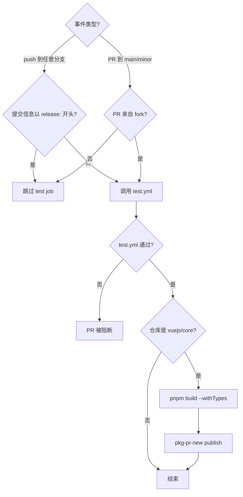
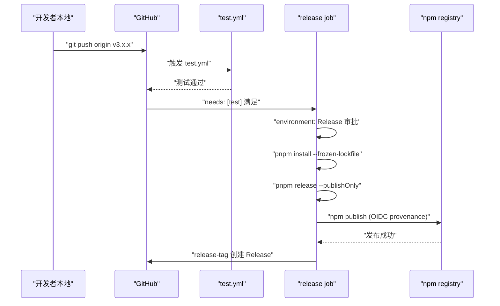
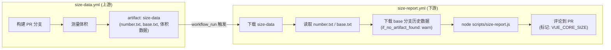

# Capítulo 10: Fluxos de trabalho CI/CD: o guardião automatizado do PR ao Release

No capítulo anterior vimos como`scripts/release.js`usa uma máquina de estados interativa para encadear cada passo de um lançamento. Mas aquele script tem um pré-requisito: ele precisa ser invocado ativamente por alguém ou algum sistema. No repositório Vue core, esse invocador ativo não é o terminal local do mantenedor, mas o GitHub Actions. O release.js é o executor, os workflows são os decisores — eles decidem qual evento aciona qual tarefa, sob quais condições liberar e sob quais condições bloquear. Este capítulo foca nos quatro arquivos dentro do diretório`.github/workflows/`:`ci.yml`(gate de PR e pré-lançamento contínuo),`release.yml`(lançamento oficial acionado por tag),`size-report.yml`(relatório de regressão de tamanho),`autofix.yml`(correção automática de formatação). Entendê-los não é memorizar a sintaxe YAML, mas ver claramente como a equipe Vue traduz normas de engenharia em restrições de pipeline incontornáveis.

# I. ci.yml: triplo gate e pré-lançamento contínuo

## Modelo intuitivo

Imagine o`ci.yml`como o ponto de segurança do aeroporto. Cada PR precisa passar por esse portão: o lint verifica se sua bagagem tem itens proibidos, o typecheck confirma que seu documento é autêntico e válido, o test verifica que você não está carregando materiais perigosos. Mas não há apenas um ponto de segurança — o Vue também pendurou aqui um canal de "pré-lançamento contínuo", publicando diretamente os artefatos de build de cada PR no pkg-pr-new, permitindo que contribuidores validem suas mudanças em cenários reais de instalação via npm.

Sem esse portão, qualquer merge poderia trazer erros de formatação, brechas de tipo ou regressões de comportamento para a branch main, e a branch main é a origem de todos os releases subsequentes.

## Condições de acionamento e controle de concorrência

`ci.yml`A configuração de acionamento do

[FACT:.github/workflows/ci.yml:2-11]

```yaml
on:
  push:
    branches:
      - '**'
    tags:
      - '!**'
  pull_request:
    branches:
      - main
      - minor
```

Copiar`push`Há dois designs-chave aqui. Primeiro, o evento`'**'`escuta todas as branches (`tags: ['!**']`), mas usa`release.yml`para excluir explicitamente todos os pushes de tag. Por que excluir tags? Porque o push de tag é tratado separadamente pelo`ci.yml`; se o`pull_request`também respondesse a tags, isso causaria acionamento duplicado do fluxo de publicação e do fluxo de CI, desperdiçando recursos de runner e até gerando condições de corrida. Segundo, o`main`escuta apenas as duas branches`minor`e`main`— esta é a estratégia de branch dupla do Vue:`minor`carrega a versão estável,

[FACT:.github/workflows/ci.yml:22-22]

```yaml
concurrency:
  group: ${{ github.workflow }}-${{ github.event.pull_request.number || github.ref }}
  cancel-in-progress: ${{ github.event_name == 'pull_request' }}
```

Copiar`group`O controle de concorrência é o toque mais refinado aqui. A expressão do`github.event.pull_request.number || github.ref`usa`cancel-in-progress`como fallback: eventos de PR usam o número do PR como chave de agrupamento, eventos de push usam o ref (nome da branch) como chave de agrupamento. Isso significa que múltiplos pushes do mesmo PR cairão no mesmo grupo de concorrência. E o`true`só é

> **[Design Inference & Architectural Trade-offs]**
> 〔Inferência de design e trade-offs arquiteturais〕

## A motivação deste design é clara: na fase de PR, os desenvolvedores fazem push com frequência, e os resultados de CI de commits antigos já não têm significado; cancelá-los economiza muito tempo de runner. Mas push para a branch main não pode ser cancelado — porque cada push na main pode ser a última validação antes do lançamento, e cancelar causaria uma lacuna de validação.

[FACT:.github/workflows/ci.yml:22-22]

```yaml
jobs:
  test:
    if: ${{ ! startsWith(github.event.head_commit.message, 'release:') && (github.event_name == 'push' || github.event.pull_request.head.repo.full_name != github.repository) }}
    uses: ./.github/workflows/test.yml
```

Copiar`if`Esta condição`&&`contém dois ramos de conjunção lógica (

), cada um merecendo ser detalhado.`! startsWith(github.event.head_commit.message, 'release:')`A primeira condição`release:`No início, pula os testes. Este é exatamente o formato da mensagem de commit enviada pelo release.js no capítulo anterior — o release.js já executou os testes completos localmente, então o CI não precisa validar novamente. Esta é uma otimização de "confiar na origem".

> **[Design Inference & Architectural Trade-offs]**
> A segunda condição`(github.event_name == 'push' || github.event.pull_request.head.repo.full_name != github.repository)`: eventos push sempre executam testes; eventos PR exigem que o PR venha de um fork (`head.repo.full_name != github.repository`). Por que apenas PRs de fork executam? Porque PRs de branches do mesmo repositório geralmente são criados por membros da equipe principal, e o push de seus branches já acionou o CI do evento push. Já PRs de fork não acionam o evento push (o push do fork não notifica o repositório upstream), então é necessário executá-los no evento PR.

Atenção`uses: ./.github/workflows/test.yml`——esta é uma chamada de reusable workflow.`test.yml`É um arquivo de workflow independente, compartilhado por`ci.yml`e`release.yml`. Essa reutilização evita definir repetidamente os passos de lint/typecheck/test em múltiplos workflows.

## Pré-lançamento contínuo: o papel do pkg-pr-new

[FACT:.github/workflows/ci.yml:25-51]

```yaml
continuous-release:
  if: github.repository == 'vuejs/core'
  runs-on: ubuntu-latest
  steps:
    - name: Checkout
      uses: actions/checkout@3d3c42e5aac5ba805825da76410c181273ba90b1 # v7.0.1
      with:
        persist-credentials: false
    # ... 安装 pnpm、Node.js、依赖 ...
    - name: Build
      run: pnpm build --withTypes
    - name: Release
      run: pnpx pkg-pr-new publish --compact --pnpm './packages/*' --packageManager=pnpm,npm,yarn
```

`continuous-release`O job só é executado no`vuejs/core`repositório principal (`if: github.repository == 'vuejs/core'`), não é executado em forks. Ele faz três coisas: build (`pnpm build --withTypes`, com declarações de tipo), depois usa`pkg-pr-new`para publicar todos os pacotes em`./packages/*`para um registry npm temporário.

> **[Design Inference & Architectural Trade-offs]**
> O valor deste mecanismo é que os contribuidores podem diretamente`npm install`o artefato de build deste PR em seus próprios projetos, verificando se a mudança realmente resolve o problema. Isso é mais convincente do que "ver o CI verde", porque valida um cenário real de consumo do pacote.

Observe que todas as actions estão fixadas em commit SHA (como`actions/checkout@3d3c42e5...`), em vez de usar`@v4`tags flutuantes como essa. Este é um requisito rígido de segurança da cadeia de suprimentos — evitar que código malicioso flua automaticamente após o repositório da action ser comprometido.

## Grafo de fluxo de controle do ci.yml



---

# II. release.yml: orquestração de publicação após push de tag

## Modelo intuitivo

Se`ci.yml`é o posto de segurança,`release.yml`é a plataforma de lançamento. Quando o release.js conclui localmente a atualização de versão, commit, criação de tag e push, o evento de push de tag acende o motor do`release.yml`. Ele primeiro executa os testes completos (confirmando novamente), depois executa no ambiente protegido`Release`o`pnpm release --publishOnly`, e finalmente cria o GitHub Release.

Sem ele, a tag enviada pelo release.js seria apenas uma referência Git, não haveria nova versão no npm, nem página de Release no GitHub.

## Condição de disparo: apenas tags

[FACT:.github/workflows/release.yml:3-6]

```yaml
on:
  push:
    tags:
      - 'v*' # Push events to matching v*, i.e. v1.0, v20.15.10
```

Escuta apenas push de tags no formato`v*`. Isso forma complementaridade com`ci.yml`o`tags: ['!**']`do

## — ambos são estritamente mutuamente exclusivos, não disparam ao mesmo tempo.

[FACT:.github/workflows/release.yml:8-21]

```yaml
jobs:
  test:
    uses: ./.github/workflows/test.yml

  release:
    if: github.repository == 'vuejs/core'
    needs: [test]
    runs-on: ubuntu-latest
    permissions:
      contents: write
      id-token: write
    environment: Release
```

Copiar

Aqui há três camadas de guarda, nenhuma delas pode ser omitida.`if: github.repository == 'vuejs/core'`Primeira camada`v1.0.0`: evitar disparo acidental de publicação em forks. Se alguém fizer fork do repositório e enviar uma tag

, esta condição impedirá a execução do fluxo de publicação.`needs: [test]`Segunda camada`test.yml`: o job release depende do job test. O job test chama

> **[Design Inference & Architectural Trade-offs]**
> 〔Inferência de design e trade-offs arquiteturais〕`environment: Release`Terceira camada

: este é um GitHub Environment, que pode configurar regras de proteção de deploy (como exigir aprovação de pessoas específicas). Isso significa que mesmo que o push de tag dispare o workflow, o passo de publicação pode exigir aprovação manual para executar — esta é a última linha de defesa para operações irreversíveis.`contents: write`Em termos de permissões,`id-token: write`é usado para criar o GitHub Release,`packages: write`é usado para autenticação de provenance do npm (token OIDC). Observe que não há

## aqui, porque o Vue publica no npm e não no GitHub Packages.

[FACT:.github/workflows/release.yml:37-46]

```yaml
- name: Install deps
  run: pnpm install --frozen-lockfile

- name: Update npm
  run: npm i -g npm@latest

- name: Build and publish
  id: publish
  run: |
    pnpm release --publishOnly
```

> **[Design Inference & Architectural Trade-offs]**
> 〔Inferência de design e trade-offs arquiteturais〕`--frozen-lockfile`Os três passos têm suas particularidades.`npm i -g npm@latest`garante que o ambiente de CI instale estritamente conforme o lockfile, evitando que a deriva de versões de dependências torne o artefato de build inconsistente com o local.

`pnpm release --publishOnly`é para obter o npm CLI mais recente — porque provenance e autenticação OIDC dependem de versões mais novas do npm, versões antigas podem não suportar esses recursos.`--publishOnly`é a entrada do release.js do capítulo anterior.

## A flag

[FACT:.github/workflows/release.yml:48-57]

```yaml
- name: Create GitHub release
  id: release_tag
  uses: yyx990803/release-tag@8cccf7c5aa332d71d222df46677f70f77a8d2dc0 # v1.0.0
  env:
    GITHUB_TOKEN: ${{ secrets.GITHUB_TOKEN }}
  with:
    tag_name: ${{ github.ref }}
    body: |
      For stable releases, please refer to [CHANGELOG.md](...) for details.
      For pre-releases, please refer to [CHANGELOG.md](...) of the `minor` branch.
```

> **[Design Inference & Architectural Trade-offs]**
> Copiar`release-tag` action。`tag_name: ${{ github.ref }}`〔Inferência de design e trade-offs arquiteturais〕`refs/tags/v3.x.x`). O corpo do Release não contém as mudanças específicas, mas aponta para o CHANGELOG.md — porque o changelog do Vue é gerado automaticamente pelo conventional-changelog, e manter manualmente o corpo do Release criaria inconsistências com o changelog.

## Diagrama de sequência do release.yml



---

# III. size-report.yml e autofix.yml: rastreamento de tamanho e autocorreção de formatação

## size-report.yml: relatório de regressão de tamanho entre workflows

`size-report.yml`O modo de acionamento é bastante peculiar — não é acionado diretamente por push ou PR, mas pelo evento de conclusão de outro workflow.

[FACT:.github/workflows/size-report.yml:3-7]

```yaml
on:
  workflow_run:
    workflows: ['size data']
    types:
      - completed
```

`workflow_run`O evento de escuta é chamado`size data`O workflow é concluído. Este é um design de duas fases:`size-data.yml`(o código-fonte não é fornecido neste capítulo) é responsável por construir e medir o tamanho no PR, enviando o resultado como artifact;`size-report.yml`Após`size data`ser concluído, baixa o artifact, gera o relatório e comenta no PR.

[FACT:.github/workflows/size-report.yml:20-23]

```yaml
if: >
  github.repository == 'vuejs/core' &&
  github.event.workflow_run.event == 'pull_request' &&
  github.event.workflow_run.conclusion == 'success'
```

Três guardas: repositório principal, evento de PR, workflow upstream bem-sucedido. Se`size data`falhar, o job de relatório não será executado — pois não há dados para reportar.

O fluxo de dados é o seguinte:

[FACT:.github/workflows/size-report.yml:41-46]

```yaml
- name: Download Size Data
  uses: dawidd6/action-download-artifact@d63b86af1b34672e53c440b1b83979861906bad7 # v24
  with:
    name: size-data
    run_id: ${{ github.event.workflow_run.id }}
    path: temp/size
```

Baixa do workflow run upstream o`size-data`artifact para`temp/size`. Em seguida, lê em paralelo o número do PR e a branch base:

[FACT:.github/workflows/size-report.yml:48-59]

```yaml
- parallel:
    - name: Read PR Number
      id: pr-number
      uses: juliangruber/read-file-action@271ff311a4947af354c6abcd696a306553b9ec18 # v1.1.8
      with:
        path: temp/size/number.txt
    - name: Read base branch
      id: pr-base
      uses: juliangruber/read-file-action@271ff311a4947af354c6abcd696a306553b9ec18 # v1.1.8
      with:
        path: temp/size/base.txt
```

`parallel`É um açúcar sintático do GitHub Actions que permite que dois passos sem dependências sejam executados simultaneamente.`number.txt`e`base.txt`são`size-data.yml`arquivos de metadados gravados durante a medição.

Em seguida, baixa os dados históricos de tamanho da branch base para comparação:

[FACT:.github/workflows/size-report.yml:61-69]

```yaml
- name: Download Previous Size Data
  uses: dawidd6/action-download-artifact@d63b86af1b34672e53c440b1b83979861906bad7 # v24
  with:
    branch: ${{ steps.pr-base.outputs.content }}
    workflow: size-data.yml
    event: push
    name: size-data
    path: temp/size-prev
    if_no_artifact_found: warn
```

Atenção`if_no_artifact_found: warn`— se a branch base ainda não tiver dados históricos (como uma nova branch), não falhará, apenas emitirá um aviso. Isso garante que o relatório ainda possa ser gerado na primeira execução, apenas sem linha de base de comparação.

Por fim, gera o relatório e comenta:

[FACT:.github/workflows/size-report.yml:71-89]

```yaml
- name: Prepare report
  run: node scripts/size-report.js > size-report.md

- name: Read Size Report
  id: size-report
  uses: juliangruber/read-file-action@271ff311a4947af354c6abcd696a306553b9ec18 # v1.1.8
  with:
    path: ./size-report.md

- name: Create Comment
  uses: actions-cool/maintain-one-comment-backup@fbbc22ad1809c1bcf46f19b58397b6254773588c # backup for v3.0.0
  with:
    token: ${{ secrets.GITHUB_TOKEN }}
    number: ${{ steps.pr-number.outputs.content }}
    body: |
      ${{ steps.size-report.outputs.content }}
      
    body-include: ''
```

`scripts/size-report.js`Lê`temp/size`e`temp/size-prev`os dados em, gerando um relatório em Markdown.`maintain-one-comment-backup`A action usa`body-include: '<!-- VUE_CORE_SIZE -->'`como marcador, garantindo que apenas um comentário de relatório de tamanho seja mantido no mesmo PR (atualização em vez de acréscimo). Observe o comentário na L81 explicando que o repositório original da action foi bloqueado pelo GitHub, então usaram um repositório de backup com commit fixado.

## autofix.yml: correção automática de problemas de formatação

`autofix.yml`Resolve um problema bastante prático: o código submetido pelo contribuidor não está em conformidade com as regras do prettier/eslint, o CI falha, e o contribuidor precisa executar manualmente`pnpm lint --fix`e submeter novamente. Este workflow automatiza essa etapa.

[FACT:.github/workflows/autofix.yml:3-8]

```yaml
on:
  pull_request:

concurrency:
  group: ${{ github.workflow }}-${{ github.event.pull_request.number }}
  cancel-in-progress: ${{ github.event_name == 'pull_request' }}
```

Aciona todos os PRs, com controle de concorrência similar ao`ci.yml`— novos pushes no mesmo PR cancelam execuções antigas do autofix.

[FACT:.github/workflows/autofix.yml:35-41]

```yaml
- name: Run eslint
  run: pnpm run lint --fix

- name: Run prettier
  run: pnpm run format

- uses: autofix-ci/action@7a166d7532b277f34e16238930461bf77f9d7ed8
```

Primeiro executa o`--fix`do eslint, depois a formatação do prettier, e por fim`autofix-ci/action`faz commit direto dos arquivos modificados de volta para a branch do PR. Note que`pnpm run format`já é um comando de formatação (não precisa da`--fix`flag, porque o script format internamente já é`prettier --write`）。

> **[Design Inference & Architectural Trade-offs]**
> A chave deste mecanismo é que`autofix-ci/action`fará o commit da correção como o autor do PR, não como bot. Assim, o contribuidor não precisa de nenhuma ação extra, e a correção de formatação aparece automaticamente em seu PR. Mas isso também significa que se a branch do contribuidor tiver regras de proteção (que não permitem push de bots), o autofix falhará — este é um caso limite que o contribuidor precisa resolver manualmente.

## Diagrama de fluxo de dados do size-report



---

# Reflexão de design: solidificando normas na pipeline

Revisando estes quatro workflows, é possível ver vários princípios de design que permeiam tudo.

**Primeiro, minimização de permissões.** `ci.yml`e`autofix.yml`ambos declaram`permissions: contents: read`, apenas`release.yml`precisa de`contents: write`e`id-token: write`。`size-report.yml`precisa de`pull-requests: write`e`issues: write`para postar comentários. Cada workflow obtém apenas as permissões que realmente necessita.

**Segundo, segurança da cadeia de suprimentos.**Todas as actions de terceiros são fixadas a commit SHA, em vez de tags flutuantes.`size-report.yml`O comentário na L81 explica diretamente que, após o repositório original da action ser bloqueado, mudaram para um repositório de backup e fixaram o commit — esta é uma defesa prática contra ataques à cadeia de suprimentos.

**Terceiro, separação de responsabilidades e reutilização.** `test.yml`É compartilhado por`ci.yml`e`release.yml`, evitando duplicação da lógica de teste.`size-data.yml`e`size-report.yml`são separados, permitindo que medição e relatório evoluam independentemente.

**Quarto, escolha da direção de falha.** `size-report.yml`O`if_no_artifact_found: warn`escolhe "avisar em vez de falhar", porque a falta de dados históricos não deve bloquear o PR. Já o`release.yml`do`needs: [test]`escolhe "falha no teste bloqueia o release", porque o release é uma operação irreversível.

**Quinto, diferenciação no controle de concorrência.**Eventos de PR cancelam execuções antigas (`cancel-in-progress: true`), eventos de push não cancelam (`cancel-in-progress: false`). Essa diferença reflete a semântica dos dois eventos: commits antigos de um PR já não têm significado, enquanto cada commit de um push pode ser o estado final.

---

# Resumo do capítulo

Este capítulo analisou os quatro workflows principais do repositório Vue core:

- **`ci.yml`**: portão de PR + pré-release contínuo. Através da`if`condição que distingue push/PR e fork/mesmo repositório, usa`concurrency`para cancelar execuções obsoletas de PR, e`pkg-pr-new`para publicar pacotes de pré-release instaláveis.
- **`release.yml`**：Lançamento oficial acionado por tag. Três camadas de proteção (verificação do repositório, needs test, aprovação do environment) garantem que apenas tags que passaram nos testes e foram aprovadas possam ser publicadas no npm.
- **`size-report.yml`**：Relatório de regressão de tamanho entre workflows. Através do`workflow_run`evento que escuta o upstream`size data`concluído, baixa o artifact e compara com os dados do branch base, enviando feedback ao PR na forma de comentário.
- **`autofix.yml`**：Correção automática de formatação. Executa eslint --fix e prettier no PR, através do`autofix-ci/action`faz commit das correções diretamente de volta ao branch do PR.

Esses quatro workflows juntos formam uma "pipeline impossível de contornar": a padronização de código é corrigida automaticamente pelo autofix, tipos e testes são verificados obrigatoriamente pelo ci.yml, a regressão de tamanho é rastreada pelo size-report, e o lançamento é executado pelo release.yml sob múltiplas camadas de proteção.

# Reflexões e autoavaliação deste capítulo

Q1: Se alterarmos o valor de`ci.yml`em`cancel-in-progress`para sempre`true`(ou seja, remover a condição de`github.event_name == 'pull_request'`), em quais cenários isso causaria problemas?

**Análise de referência**：`cancel-in-progress`sempre`true`significa que, ao fazer push para o branch main, um novo push cancelará a CI antiga em execução. Considere este cenário: dois PRs são mesclados consecutivamente no branch main, a CI do primeiro PR está em execução (incluindo lint/typecheck/test completos), e a mesclagem do segundo PR dispara uma nova execução de CI. Se`cancel-in-progress`for`true`, a CI do primeiro PR será cancelada — mas o código do primeiro PR já está no main, e seu resultado de CI é crucial para avaliar a saúde do branch main. Cancelá-la significa que há um trecho de código no branch main que nunca foi completamente validado. E a condição[FACT:.github/workflows/ci.yml:22-22]de`github.event_name == 'pull_request'`existe justamente para evitar esse problema: apenas eventos de PR cancelam execuções antigas, eventos de push nunca cancelam.

Q2: `release.yml`em`release`do job`if: github.repository == 'vuejs/core'`e`environment: Release`defendem quais cenários respectivamente? O que aconteceria se removêssemos um deles?

**Análise de referência**：`if: github.repository == 'vuejs/core'` [FACT:.github/workflows/release.yml:14]defende o cenário de fork. Se alguém fizer fork de vuejs/core e enviar uma`v3.99.0`tag, sem essa condição, o workflow seria executado no repositório forkado`pnpm release --publishOnly`. Embora o repositório forkado não tenha npm token e não possa realmente publicar, isso desperdiçaria recursos do runner e poderia gerar notificações de falha enganosas.`environment: Release` [FACT:.github/workflows/release.yml:21]defende o risco de "publicação automática após push de tag" — permite configurar aprovação manual, garantindo que mesmo que a tag seja enviada, a publicação exija confirmação do mantenedor. Se removermos a condição`if`, o fork desperdiçaria recursos; se removermos`environment`, qualquer pessoa com permissão de push de tag poderia acionar a publicação, sem a etapa final de confirmação humana. Ambos são defesas de níveis diferentes e não podem se substituir mutuamente.

Q3: `size-report.yml`em`if_no_artifact_found: warn`a escolha de`release.yml`e em`needs: [test]`a escolha de

**, que filosofias de design de direção de falha elas refletem respectivamente? O que aconteceria se trocássemos essas duas estratégias?**：`if_no_artifact_found: warn` [FACT:.github/workflows/size-report.yml:69]Análise de referência`fail`escolhe "avisar em vez de falhar quando faltam dados históricos", porque o relatório de tamanho é informação auxiliar, não uma condição de bloqueio. Se mudássemos para`needs: [test]` [FACT:.github/workflows/release.yml:15], então branches novos ou PRs em primeira execução falhariam por não encontrar dados base, o que é claramente irracional.

---

escolhe "bloquear a publicação se os testes falharem", porque a publicação é uma operação irreversível e deve garantir a qualidade do código. Se trocássemos — size-report falhando quando faltam dados, release publicando mesmo com testes falhando — o primeiro causaria muitos falsos positivos bloqueando PRs normais, e o segundo faria código não testado entrar no npm. Isso reflete o princípio de design de direção de falha: "informação auxiliar tolerante, operações irreversíveis rigorosas".`scripts/size-report.js`O próximo capítulo aprofundará o núcleo do mecanismo de orçamento de tamanho:`usage-size`como analisar dados de tamanho, como calcular incrementos, como formatar a saída, e a filosofia de medição do

— por que o Vue escolhe medir "tamanho de uso real" em vez de "tamanho completo do pacote".`scripts/size-report.js`Do gate de PR ao lançamento por tag, os quatro arquivos de workflow juntos formam uma cadeia automatizada de guarda intransponível. Mas a pipeline só pode bloquear merges se tiver critérios quantificáveis de julgamento. O próximo capítulo focará na governança de engenharia do Vue sobre o tamanho do pacote como métrica central:`scripts/usage-size.js`como calcular o tamanho gzip de cada artefato e comparar com a linha de base,
