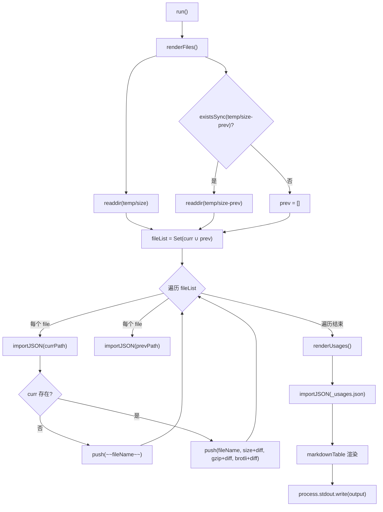
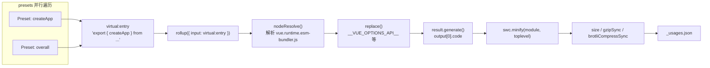

# Próximo capítulo: Capítulo 11 →

No capítulo anterior, vimos que o Vue usa GitHub Actions para solidificar lint, verificação de tipos, testes e rastreamento de tamanho em um pipeline impossível de contornar, onde size-report.yml e size-data.yml são responsáveis por deixar dados de tamanho após cada alteração. Mas o pipeline apenas executa; quem realmente responde "quanto aumentou, onde aumentou" são os dois scripts que este capítulo vai dissecar. A contradição central do orçamento de tamanho está em: o tamanho do pacote é uma métrica que só pode ser percebida, mas difícil de atribuir com precisão. Quando usuários reclamam que "o Vue está muito grande", os mantenedores precisam responder três perguntas — quanto aumentou? Onde aumentou? Esta alteração o tornou maior? scripts/size-report.js é responsável pela comparação, scripts/usage-size.js pela atribuição, e juntos formam a filosofia de medição do orçamento de tamanho.

# 11.1 size-report: transformando diferenças de tamanho em tabelas Markdown legíveis

## Modelo intuitivo

Imagine que você é um inspetor de qualidade de uma empresa de logística. Cada pacote (artefato de build) precisa ser pesado antes de sair do armazém, e seu trabalho não é a pesagem em si, mas colocar o "peso de hoje" e o "peso de ontem" lado a lado em uma tabela, usando negrito para`+2.3 kB`marcar quais pacotes ficaram mais pesados. Sem essa tabela comparativa, os mantenedores só veriam um monte de números isolados, incapazes de julgar se um PR introduziu uma regressão de tamanho.

`size-report.js`é exatamente esse inspetor. Ele não produz dados de tamanho (isso é responsabilidade do`usage-size.js`e dos scripts de build), ele apenas consome os arquivos JSON dos dois diretórios e gera um relatório Markdown.

## Estrutura de dados e convenção de diretórios

A convenção central do script está escondida em duas constantes. O diretório de dados atual é`temp/size`, o diretório de linha de base histórica é`temp/size-prev`。

[FACT:scripts/size-report.js:23-24]

A nomenclatura desses dois diretórios não é arbitrária:`temp/size`é gerado pelo`size-data.yml`workflow a cada execução e enviado como artifact[FACT:.github/workflows/size-data.yml:53-57], enquanto`temp/size-prev`é obtido pelo`size-report.yml`após baixar o artifact de linha de base e descompactá-lo. O nome do diretório em si é o contrato do fluxo de dados.

O script define três aliases de tipo, que descrevem precisamente a estrutura dos arquivos JSON:

[FACT:scripts/size-report.js:8-21]

`SizeResult`tem três campos numéricos:`size`(não comprimido),`gzip`、`brotli`。`BundleResult`adiciona sobre isso o campo`file`para exibir o nome do arquivo.`UsageResult`é um`Record`, cuja chave é o nome do preset e o valor é`SizeResult & { name: string }`— note que aqui há um campo`name`adicional, porque as chaves de objetos JSON são perdidas após`Object.values`, sendo necessário armazenar o nome redundantemente no valor.

## Step-by-Step Walkthrough

O fluxo principal é minimalista, com apenas dois passos e uma saída:

[FACT:scripts/size-report.js:23-38]

`run()`primeiro chama`renderFiles()`para renderizar a tabela de arquivos de artefato, depois chama`renderUsages()`para renderizar a tabela de cenários de uso, e finalmente escreve a string acumulada na variável de nível de módulo`output`de uma vez para stdout[FACT:scripts/size-report.js:25]. Esse padrão de "acumular string e outputar de uma vez" evita múltiplas`process.stdout.write`concatenações custosas e torna a ordem de saída totalmente controlável.

**Primeiro passo: coletar a lista de arquivos e calcular a união.**

[FACT:scripts/size-report.js:44-49]

`filterFiles`filtra dois tipos de arquivos: os que começam com`_`(como`_usages.json`) e os que terminam com`.txt`(como`number.txt`、`base.txt`). Esses dois tipos são metadados, não dados de tamanho. Em seguida, obtém a união`fileList`dos nomes de arquivos do diretório atual e do histórico — usando`Set`para deduplicar. Por que calcular a união? Porque um arquivo pode existir apenas no diretório histórico (o artefato foi removido neste build), ou apenas no diretório atual (novo artefato adicionado neste build). Ambos os casos precisam ser refletidos no relatório.

**Segundo passo: comparar arquivo por arquivo.**

[FACT:scripts/size-report.js:43-75]

Para cada arquivo na união, tenta importar o JSON de ambos os diretórios.`importJSON`A implementação de

[FACT:scripts/size-report.js:112-115]

é "retorna undefined se o arquivo não existir":`import()`Aqui usa-se`with: { type: 'json' }`dinâmico com asserção de importação`fs.readFileSync` + `JSON.parse`, em vez de`import()`. O primeiro é tratado pelo carregador de módulos do Node, o segundo requer tratamento manual de erros de codificação e parsing. O custo de escolher`renderFiles`é que ele retorna uma Promise, então todo o

é async.`if (!curr)`O branch crítico está em`~~fileName~~`: se o arquivo não existe no diretório atual, significa que o artefato foi removido, marca-se[FACT:scripts/size-report.js:60-61]com a sintaxe de riscado do Markdown`getDiff`. Caso contrário, renderiza uma linha normal, concatenando

**após cada valor numérico.**

[FACT:scripts/size-report.js:124-130]

`getDiff`Terceiro passo: calcular a diferença.`prev === undefined`tem três pontos de retorno antecipado:`diff === 0`retorna string vazia quando`prettyBytes(diff)`(sem linha de base, impossível comparar);`-1.2 kB`retorna string vazia quando`sign`(sem mudança, não exibe ruído); caso contrário, retorna a diferença com sinal em negrito. Note que`+`。

**lida corretamente com números negativos, produzindo**

[FACT:scripts/size-report.js:80-103]

`renderUsages`nesse formato, enquanto a variável`renderFiles`só adiciona`_usages.json`quando positivo.`Object.values(curr)`Quarto passo: renderizar a tabela usage.`prev?.[usage.name]`A diferença estrutural entre`name`e`.filter(usage => !!usage)`merece atenção: ele importa diretamente`map`, porque os dados de usage existem fixamente nesse único arquivo.

converte o Record em array e, através de`markdown-table`, busca os dados históricos pelo nome — exatamente por isso o campo[FACT:scripts/size-report.js:72-74]。

## Esta linha é na verdade redundante, porque

> **[Design Inference & Architectural Trade-offs]**
> **Finalmente, usa a biblioteca`import()`para renderizar o array bidimensional como tabela Markdown`readFileSync`？**Copiar`import()`Reflexões de design e armadilhas

**`filterFiles`〔Inferência de design e trade-offs arquiteturais〕`file[0] !== '_'`Por que usar**em vez de`readdir`dinâmico`file[0]`A asserção de importação para JSON é a prática padrão no Node 20+, que naturalmente lida com o carregamento de JSON em ambiente ESM. O custo é não poder ser usado em contexto síncrono, e cada importação é armazenada em cache pelo módulo — mas neste script de execução única, o cache não é problema.`undefined`，`undefined !== '_'`A verificação

**Tratamento de artefatos removidos.**Quando um artefato é removido, o relatório o marca com tachado em vez de removê-lo diretamente. Isso é um design intencional: os mantenedores precisam ver "este arquivo desapareceu", em vez de deixá-lo desaparecer silenciosamente da tabela. Se fosse filtrado diretamente, os leitores pensariam erroneamente que o artefato nunca existiu.

# 11.2 usage-size: simulando o cenário de importação de um usuário real

## Modelo intuitivo

`size-report`Diz quanto o "pacote completo" pesa, mas isso não responde à pergunta que o usuário realmente se importa: "Eu só uso`createApp`, quanto código preciso baixar de fato?" O tamanho do pacote completo inclui muito código que você talvez nunca use (como`defineCustomElement`、`Transition`、`KeepAlive`）。`usage-size.js`O papel é atuar como um "usuário típico": escrever um arquivo de entrada virtual que importa apenas APIs específicas, empacotar com Rollup e ver o tamanho do artefato final.

É como um restaurante não te dizer "o peso total de todos os ingredientes na cozinha é 50 kg", mas sim "pedindo um frango Kung Pao, os ingredientes realmente usados são 300 gramas".

## Estrutura de dados: array de Presets

A estrutura de dados central do script é o`presets`array, cada elemento descreve um cenário de uso:

[FACT:scripts/usage-size.js:27-55]

`Preset`O tipo tem três campos:`name`(nome de exibição),`imports`(lista de APIs importadas do Vue), opcional`replace`(substituições adicionais em tempo de compilação). Cinco presets cobrem cenários de uso do menor ao maior:

- `createApp (CAPI only)`: importa apenas`createApp`, e substitui`__VUE_OPTIONS_API__`por`'false'`, simulando um usuário puro de Composition API[FACT:scripts/usage-size.js:35-40]
- `createApp`: importa apenas`createApp`, mantém Options API[FACT:scripts/usage-size.js:35-40]
- `createSSRApp`: cenário SSR[FACT:scripts/usage-size.js:35-40]
- `defineCustomElement`: cenário Web Components[FACT:scripts/usage-size.js:35-40]
- `overall`: importa seis APIs principais, simulando um usuário "full-featured"[FACT:scripts/usage-size.js:44-54]

O arquivo de entrada é fixado como o artefato esm-bundler runtime-only:

[FACT:scripts/usage-size.js:24-28]

Escolher`vue.runtime.esm-bundler.js`em vez da versão completa`vue.esm-bundler.js`, porque a versão runtime não inclui o compilador de templates, sendo mais próxima da situação real de usuários de ferramentas de build modernas — eles usam SFC para pré-compilar templates e não precisam do compilador em runtime.

## Step-by-Step Walkthrough

**Primeiro passo: gerar em paralelo os bundles de todos os presets.**

[FACT:scripts/usage-size.js:62-69]

`main()`Para cada preset, criar`generateBundle`Promise, executar em paralelo com`Promise.all`. O paralelismo aqui é seguro, porque cada`generateBundle`chama independentemente`rollup()`, sem compartilhar estado.

**Segundo passo: construir a entrada virtual.**

[FACT:scripts/usage-size.js:94-96]

Esta é a parte mais engenhosa de todo o script. Ele não escreve arquivos temporários no disco, mas constrói um ID de módulo virtual`virtual:entry`, cujo conteúdo é uma instrução re-export:`export { createApp } from '/absolute/path/to/vue.runtime.esm-bundler.js'`. Note que`entry`é um caminho absoluto, porque o Rollup precisa conseguir resolvê-lo.

**Terceiro passo: configurar a cadeia de plugins do Rollup.**

[FACT:scripts/usage-size.js:98-121]

A ordem do array de plugins é crucial:

1. **Personalizado`usage-size-plugin`**：`resolveId`intercepta`virtual:entry`retorna a si mesmo,`load`retorna o conteúdo virtual[FACT:scripts/usage-size.js:101-110]. Este é o padrão padrão para módulos virtuais no Rollup.

2. **`nodeResolve()`**: resolve`vue.runtime.esm-bundler.js`imports internos[FACT:scripts/usage-size.js:111]。

3. **`replace`**: injeta constantes em tempo de compilação[FACT:scripts/usage-size.js:112-119]。

`replace`A configuração do plugin revela o mecanismo central do artefato esm-bundler: ele preserva`__VUE_OPTIONS_API__`、`__VUE_PROD_DEVTOOLS__`e outros flags de runtime, que são substituídos pela ferramenta de build do usuário. Aqui o script faz a substituição pelo usuário:

- `process.env.NODE_ENV` → `"production"`: segue o branch de produção
- `__VUE_PROD_DEVTOOLS__` → `'false'`: desativa suporte a devtools
- `__VUE_PROD_HYDRATION_MISMATCH_DETAILS__` → `'false'`: desativa mensagens detalhadas de erro de hydration
- `__VUE_OPTIONS_API__` → `'true'`: mantém Options API por padrão

Então expande`...preset.replace`, permitindo que o preset sobrescreva os valores padrão.`createApp (CAPI only)`O preset usa exatamente esse mecanismo para mudar`__VUE_OPTIONS_API__`para`'false'` [FACT:scripts/usage-size.js:35-40]。

`preventAssignment: true`Evitar substituir`obj.process.env.NODE_ENV = x`esse tipo de instrução de atribuição[FACT:scripts/usage-size.js:117]。

**Quarto passo: gerar, minificar, medir.**

[FACT:scripts/usage-size.js:123-134]

`result.generate({})`produz o código, obtém`output[0].code`. Depois minifica com SWC:

[FACT:scripts/usage-size.js:125-130]

`module: true`indica que a entrada é ESM,`toplevel: true`permite minificar nomes de variáveis no escopo de nível superior. Após a minificação, calcula três métricas separadamente:`minified.length`(comprimento em bytes),`gzipSync(minified).length`、`brotliCompressSync(minified).length`。

Note que aqui é usada a`node:zlib`API síncrona, em vez da versão assíncrona. Em um script de execução única, a API síncrona é mais concisa, e a minificação em si é uma operação intensiva de CPU, então assincronia não traria ganho de paralelismo.

**Quinto passo: saída e persistência.**

[FACT:scripts/usage-size.js:62-86]

Os resultados são primeiro impressos no console em formato legível por humanos, com`pico`colorindo[FACT:scripts/usage-size.js:62-86]. Depois escreve em`temp/size/_usages.json`, usando`Object.fromEntries`para converter o array de volta em Record, com chave sendo o nome do preset[FACT:scripts/usage-size.js:81-85]。

`--write`O flag controla se deve adicionalmente escrever o bundle não minificado de cada preset no disco[FACT:scripts/usage-size.js:136-138], para depuração.

## Reflexões de design e armadilhas

> **[Design Inference & Architectural Trade-offs]**
> **Por que usar módulo virtual em vez de arquivo temporário?**Arquivos temporários exigem lidar com caminhos, limpeza, conflitos de escrita concorrente. O módulo virtual mantém o conteúdo da entrada na memória, e o`resolveId`/`load`hook do Rollup suporta naturalmente esse padrão. O custo é que é preciso corresponder exatamente ao ID, qualquer erro de digitação fará o Rollup reportar "não foi possível resolver a entrada".

**`replace`O`preventAssignment`armadilha do**Se não definir`preventAssignment: true`，`replace`o plugin também fará substituição em`process.env.NODE_ENV = 'x'`instruções de atribuição como essa, produzindo`"production" = 'x'`erro de sintaxe. No código-fonte do Vue realmente existe atribuição a`process.env.NODE_ENV`(em ferramentas de teste), então esta opção é necessária.

**`__VUE_OPTIONS_API__`Escolha do valor padrão de**O script define o valor padrão como`'true'` [FACT:scripts/usage-size.js:116], em vez de`'false'`. Esta é uma escolha conservadora: se o usuário não configurar, o Vue manterá suporte a Options API.`createApp (CAPI only)`O preset sobrescreve explicitamente para`'false'`, mostrando o ganho de tamanho após desativar. Essa comparação em si é documentação para o usuário: dizer ao usuário "quanto se economiza desativando Options API".

**Paralelo`Promise.all`Semântica de falha do**Se o empacotamento de qualquer preset falhar,`Promise.all`será rejeitado imediatamente, os outros empacotamentos em andamento não serão cancelados (o Rollup não fornece mecanismo de cancelamento). Em CI, isso significa que uma falha desperdiça o cálculo dos outros presets, mas o script em si termina com código de saída diferente de zero, e o CI consegue capturar corretamente.

# 11.3 Dos dados ao gate: como o CI consome esses relatórios

## Panorama do fluxo de dados

Para entender esses dois scripts, é preciso colocá-los de volta no pipeline de CI.`size-data.yml`Executa ao fazer push para main/minor ou em PR`pnpm run size` [FACT:.github/workflows/size-data.yml:45], produz`temp/size`diretório, e então faz upload como artifact[FACT:.github/workflows/size-data.yml:53-57]。

Para PRs, ele também grava dois arquivos de metadados adicionais:

[FACT:.github/workflows/size-data.yml:47-51]

`number.txt`armazena o número do PR,`base.txt`armazena o nome do branch de destino. Esses dois arquivos são exatamente`size-report.js`em`filterFiles`os que devem ser filtrados`.txt`arquivos[FACT:scripts/size-report.js:44-45]. Eles existem para que o`size-report.yml`downstream saiba "com qual baseline comparar".

## Obtenção e comparação do baseline

`size-report.yml`(detalhado no capítulo anterior) o workflow é: baixar o`size-data`artifact do PR atual, baixar o artifact de baseline do branch de destino, descompactar o baseline em`temp/size-prev`, e então executar`size-report.js`para gerar o relatório Markdown e comentar no PR.

Aqui há uma restrição de design fundamental:`size-report.js`ele próprio não é responsável por obter o baseline, ele assume que`temp/size-prev`já existe. Se não existir,`existsSync(prevDir)`retorna false,`prev`array vazio[FACT:scripts/size-report.js:48], todos os diffs são strings vazias. Isso é degradação graciosa: sem baseline o relatório ainda é gerado, apenas não mostra diferenças.

## Lógica de decisão do gate de tamanho

> **[Design Inference & Architectural Trade-offs]**
> É preciso esclarecer um mal-entendido comum:`size-report.js`ele próprio não faz a decisão do gate. Ele apenas gera o relatório, não retorna código de saída, não define limiares. O gate real acontece no`size-report.yml`nível do workflow — ele pode conter um passo que analisa os valores de diff no relatório e faz o job falhar se ultrapassar o limiar.

Esse design de "separação entre medição e decisão" tem razões profundas: o script de medição deve permanecer puro, responsável apenas por produzir fatos; a lógica de decisão deve estar no nível do workflow, porque os limiares podem variar conforme versão, branch e estágio de release. Codificar os limiares diretamente em`size-report.js`tornaria difícil reutilizá-lo.

# Reflexões de design

**Por que o orçamento de tamanho precisa de dois conjuntos de medições?**O tamanho do pacote completo e o tamanho de usage respondem a perguntas diferentes. O tamanho do pacote completo é o "limite superior" — ele informa quanto o usuário precisa baixar no pior caso. O tamanho de usage é o "valor típico" — ele informa quanto a maioria dos usuários realmente baixa. Só combinando os dois é possível obter um retrato completo do tamanho. Se houvesse apenas o tamanho do pacote completo, os mantenedores tenderiam a otimizar excessivamente APIs pouco usadas; se houvesse apenas o tamanho de usage, poderiam ignorar explosões de tamanho em certos cenários de borda.

**O significado das métricas duplas de gzip e brotli.**CDNs modernas geralmente suportam brotli, mas nem todos os cenários o habilitam. Reportar ambos permite que os mantenedores avaliem "como fica o tamanho em ambientes que só suportam gzip". O brotli costuma ser 15-20% menor que o gzip, e essa diferença em si já é informação valiosa.

**O contrato de estabilidade do formato de dados.** `size-report.js`e`usage-size.js`são desacoplados via arquivos JSON.`usage-size.js`escreve`_usages.json`，`size-report.js`lê. Os nomes de campos desse contrato (`name`、`size`、`gzip`、`brotli`) são implícitos, sem validação de schema. Se`usage-size.js`mudar um nome de campo e esquecer de sincronizar`size-report.js`, o relatório exibirá dados incorretos silenciosamente. Esse é o ponto frágil do design atual.

# Resumo do capítulo

# Reflexões e autoavaliação do capítulo

Q1: `size-report.js`O`filterFiles`filtra arquivos que começam com`_`. Se`usage-size.js`renomear o arquivo de saída de`_usages.json`para`usages.json`, o que acontecerá?

**Análise de referência**：`filterFiles`A condição de filtro de`file[0] !== '_' && !file.endsWith('.txt')` [FACT:scripts/size-report.js:44-45]é`usages.json`. Se o arquivo for renomeado para`_`, ele não começa mais com`filterFiles`, será mantido por`fileList`e entrará na união de`renderFiles`. Então`importJSON`tentará tratá-lo como arquivo de bundle:`Record<string, UsageResult>`consegue importá-lo com sucesso (é JSON válido), mas sua estrutura é`BundleResult`em vez de`curr?.file`, então`undefined`，`fileName`é`curr.size`string vazia,`undefined`，`prettyBytes(undefined)`também é`filterFiles`lançará erro ou produzirá saída anômala. Isso fará o relatório falhar. A raiz do problema é que

Q2: `usage-size.js`usa o prefixo do nome do arquivo como critério para distinguir "metadados vs dados", em vez de usar estrutura de diretórios ou uma lista explícita. Uma abordagem mais robusta seria colocar os dados de usage em um subdiretório, ou manter uma lista explícita de arquivos de metadados.`Promise.all(tasks)`Em`replace`executa em paralelo o empacotamento de todos os presets. Se a configuração de`__VUE_OPTIONS_API__`de algum preset omitir`'true'`, o que acontecerá? Por que o valor padrão é definido como`'false'`？

**em vez de**：`replace`Análise de referência`__VUE_OPTIONS_API__: 'true'`Na configuração do plugin`...preset.replace`,[FACT:scripts/usage-size.js:116-118]é o valor padrão, e então o spread de`'true'`permite sobrescrever`'true'`. Se algum preset omitir a configuração, ele usará o valor padrão`__VUE_OPTIONS_API__`, ou seja, manterá o suporte à Options API, e o tamanho ficará maior. Definir o padrão como`'false'`é uma escolha conservadora: reflete "o comportamento real quando o usuário não configura". No artefato esm-bundler do Vue, o comportamento padrão de`createApp (CAPI only)`é manter a Options API (a menos que o usuário a desative explicitamente). Se o padrão fosse`'false'` [FACT:scripts/usage-size.js:35-40], todos os presets sem configuração explícita mostrariam tamanhos menores, enganando o usuário a pensar que "não configurar economiza tamanho".

Q3: `size-report.js`O preset define explicitamente`importJSON`justamente para mostrar "o ganho após desativação explícita", contrastando com o valor padrão.`import()`O`fs.readFileSync`de`temp/size-prev`usa

**dinâmico em vez de**. Se algum arquivo JSON no diretório`import()`estiver corrompido (JSON inválido), qual é a diferença de comportamento entre as duas implementações?`SyntaxError`Análise de referência`importJSON`: o`existsSync`dinâmico lança`existsSync`Apenas verifica se o arquivo existe, não verifica a validade do conteúdo[FACT:scripts/size-report.js:112-115]. O erro será propagado para cima até`renderFiles`, causando a falha na geração de todo o relatório. Se usar`fs.readFileSync` + `JSON.parse`, também lançará erro, mas pode ser envolvido com try-catch dentro de`importJSON`, retornando`undefined`para implementar degradação graciosa. A implementação atual opta por deixar o erro se propagar, com a suposição implícita de que "o JSON no artifact é sempre válido" — essa suposição geralmente é válida em ambientes de CI, pois os arquivos são gerados por`usage-size.js`e scripts de build. Mas ao depurar localmente, se o arquivo JSON for modificado manualmente e corrompido, o relatório irá travar diretamente em vez de pular o arquivo. Esta é uma escolha de design de "confiar na fonte de dados".

---

O mecanismo de orçamento de tamanho resolve as questões de "o que medir" e "como comparar", mas depende de uma premissa: o artefato de build em si é reproduzível. O próximo capítulo entrará no sandbox mínimo de depuração:`vite-debug`como iniciar um ambiente de desenvolvimento Vue interativo com o mínimo de configuração, e como ele se integra com os artefatos de build locais, formando um ciclo fechado da modificação do código-fonte até a verificação em tempo de execução.

Até aqui, o ciclo de medição do orçamento de tamanho está claro: size-report.js usa comparação de diretórios para responder "quanto aumentou", usage-size.js usa módulos virtuais para simular cenários reais de importação e responder "onde aumentou", enquanto a decisão de gate é deixada para a camada de workflow. Esse mecanismo transforma a regressão de tamanho de reclamações vagas em dados rastreáveis. Mas os dados só podem dizer que o problema existe; para realmente localizar e corrigir, ainda é necessário um ambiente mínimo que possa reproduzir o problema rapidamente. O próximo capítulo entrará em packages-private/vite-debug, para ver como o Vue usa Vite + SFC para construir um sandbox de depuração minimalista, transformando "fazer uma reprodução mínima no código-fonte real" em uma prática diária operacional.
