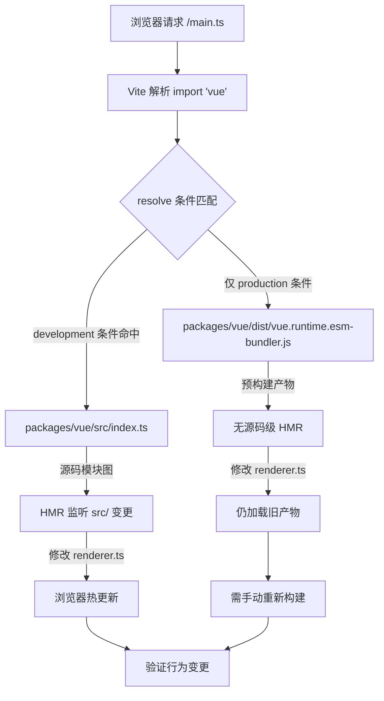

# Capítulo 12: Sandbox mínimo de depuração: vite-debug e o ciclo fechado de desenvolvimento local

No capítulo anterior, concluímos o ciclo de medição do orçamento de tamanho: size-report.js responde "quanto aumentou", usage-size.js responde "onde aumentou", e a camada de workflow é responsável pela decisão de gate. Mas esse mecanismo tem uma premissa implícita — o artefato de build em si é reproduzível. Quando você descobre que o tamanho de algum pacote aumentou anormalmente, ou que algum comportamento em tempo de execução não corresponde ao esperado, você precisa de um ambiente mínimo que possa carregar rapidamente o código-fonte local e ver o efeito imediatamente após a modificação. packages-private/vite-debug é esse ambiente. Ele tem apenas quatro arquivos, totalizando menos de 40 linhas de código, mas constitui a entrada da prática diária de "fazer uma reprodução mínima no código-fonte real" no repositório Vue core. Este capítulo irá desmontar arquivo por arquivo a lógica de construção deste sandbox, e explicar por que ele foi colocado em packages-private em vez do diretório packages.

# I. O esqueleto do sandbox:`main.ts`e`App.vue`cadeia mínima de montagem

## Modelo intuitivo

Se compararmos todo o runtime do Vue a um motor, então`vite-debug`é uma "bancada de testes bare-metal" — sem carcaça, sem painel de instrumentos, apenas a fiação mínima para fazer o motor funcionar. Seu valor não está na completude funcional, mas em**eliminar todas as variáveis de interferência**: quando você suspeita que um bug está no sistema de reatividade ou dentro do renderer, você não quer que a complexidade do próprio ambiente de depuração se torne uma fonte de ruído.

## Estrutura de dados e layout de arquivos

Vejamos primeiro`main.ts`todo o conteúdo de:

[FACT:packages-private/vite-debug/main.ts:4-4]

```ts
import { createApp } from 'vue'
import App from './App.vue'

const app = createApp(App)

app.mount('#app')
```

Estas seis linhas de código são o paradigma padrão de inicialização de uma aplicação Vue, mas cada linha tem um significado de engenharia preciso em cenários de depuração:

- **L1**Em`import { createApp } from 'vue'`de`'vue'`, para onde o identificador de módulo`vite.config.ts`é finalmente resolvido depende inteiramente das declarações de dependência de`package.json`e
- **L2**. Este é o elo mais crítico de todo o sandbox — veremos mais adiante como ele é apontado para o código-fonte local.`import App from './App.vue'`O`@vitejs/plugin-vue`de`App.vue`aciona o pipeline de compilação SFC de`<script>`、`<template>`、`<style>`: o Vite registra este plugin na inicialização do dev server, e quando o navegador solicita
- **L4**, o plugin o decompõe em`createApp(App)`três módulos virtuais compilados separadamente.`app._context`、`app._instance`O
- **L6**de`app.mount('#app')`cria a instância da aplicação; neste momento, o Vue inicializa internamente`app`e outros campos principais, mas ainda não aciona nenhuma renderização.

O`index.html`de`index.html`é o verdadeiro interruptor de inicialização: ele procura no DOM o elemento container com id`<div id="app"></div>`, cria a instância do componente raiz e aciona a primeira renderização.`<script type="module" src="/main.ts"></script>`Observe que não há referência a`app.mount('#app')`aqui — a convenção do Vite é que o

## no diretório raiz do projeto serve como HTML de entrada, contendo

e`App.vue`. Embora este arquivo não esteja nos keyFiles deste capítulo, ele é o pré-requisito para que

[FACT:packages-private/vite-debug/App.vue:4-8]

```vue

import { ref } from 'vue'

const count = ref(0)

  {{ count }}

button {
  color: red;
}

```

Walkthrough orientado a cenários: a cadeia completa de um clique**Agora vejamos**

**, que é o "veículo de experimento" deste sandbox:**

`@vitejs/plugin-vue`Copiar`App.vue`Colocando em um cenário concreto:

- `<script setup>`O que acontece quando o usuário clica no botão no navegador?`setup()`Primeiro passo: fase de compilação SFC (na inicialização do dev server)`ref(0)`compila`RefImpl`em três partes:`.value`O bloco`0`。
- `<template>`é compilado na função`{{ count }}`do componente,`_toDisplayString(count.value)`，`@click="count++"`a chamada retorna um objeto`onClick: $event => (count.value++)`。
- `<style>`cujo`<style>`é inicialmente

**O bloco`app.mount`é compilado na função de renderização,**

`createApp(App)`é convertido em`mount('#app')`, o componente raiz é criado`ComponentInternalInstance`, executa-se`setup()`para obter`count`o RefImpl de , e então a função de renderização é chamada para gerar a árvore VNode. Na função de renderização, a leitura de`count.value`aciona`track`a coleta de dependências — o efeito de renderização atualmente ativo (`ReactiveEffect`) é registrado em`count`no`dep`de .

**Terceiro passo: evento de clique (durante interação do usuário)**

O navegador dispara o evento`click`, e o manipulador de eventos do Vue executa`count.value++`. Esta é uma operação setter, que aciona`trigger`: percorre os efeitos colaterais coletados em`count.dep`, agendando a re-renderização. Como é uma atualização síncrona e não está na fila de lotes, o efeito de renderização é executado imediatamente, chamando novamente a função de renderização, gerando um novo VNode, fazendo diff com o VNode antigo, descobrindo que o conteúdo de texto mudou de`0`para`1`, e atualizando o`textContent`。

do DOM real. Todo o encadeamento pode ser representado pelo seguinte diagrama de fluxo de dados:

```mermaid
flowchart LR
    subgraph compile["编译期 (Vite Dev Server)"]
        sfc["App.vue"] -->|"@vitejs/plugin-vue"| script["setup() 函数"]
        sfc -->|"@vitejs/plugin-vue"| render["渲染函数"]
        sfc -->|"@vitejs/plugin-vue"| style["CSS 模块"]
    end
    subgraph runtime["运行时 (浏览器)"]
        script -->|"ref(0)"| refimpl["RefImpl { value: 0 }"]
        render -->|"读取 count.value"| track["track() 收集依赖"]
        click["用户点击"] -->|"count.value++"| trigger["trigger() 触发更新"]
        trigger -->|"调度渲染副作用"| rerender["重新执行渲染函数"]
        rerender -->|"diff + patch"| dom["更新真实 DOM"]
    end
    track -.->|"dep 记录 ReactiveEffect"| trigger
```

O ponto-chave deste diagrama é:**Existem apenas dois pontos de acoplamento entre os artefatos de tempo de compilação e o comportamento de tempo de execução**——`ref(0)`O objeto RefImpl retornado por , e a leitura/escrita de`count.value`na função de renderização. Isso significa que, se você quiser depurar um determinado ramo do sistema reativo (por exemplo,`trigger`a lógica de agendamento em ), basta construir o padrão de leitura/escrita correspondente neste`App.vue`.

## Reflexão de design: por que`ref`em vez de`reactive`？

> **[Design Inference & Architectural Trade-offs]**
> Escolher`ref(0)`em vez de`reactive({ count: 0 })`como exemplo padrão implica uma consideração de prioridade de depuração:`ref`O caminho de acesso de`.value`é mais curto; ao expandir o objeto`RefImpl`no depurador, é possível ver diretamente campos internos como`_value`、`dep`、`__v_isRef`, enquanto expandir o objeto Proxy retornado por`reactive`no console aciona o getter, o que pode interferir na observação do estado original. Para cenários de "reprodução mínima", reduzir uma camada de indireção Proxy significa menos variáveis.

---

# Dois, resolução de alias:`vite.config.ts`e`package.json`como apontar`'vue'`para o código-fonte local

## Modelo intuitivo

`vite.config.ts`tem apenas seis linhas, mas é o "centro de roteamento" de todo o sandbox — determina se o`import { createApp } from 'vue'`em`'vue'`será, no final, carregado da versão publicada no npm ou do código-fonte em desenvolvimento no repositório. Se não houver configuração de alias correta, o código que você modifica em`App.vue`pode nem sequer acionar a versão do código-fonte do Vue que você está depurando, e a depuração se torna "atirar no alvo errado".

## Estrutura de dados e cadeia de resolução

Primeiro veja`vite.config.ts`：

[FACT:packages-private/vite-debug/vite.config.ts:4-6]

```ts
import { defineConfig } from 'vite'
import vue from '@vitejs/plugin-vue'

export default defineConfig({
  plugins: [vue()],
})
```

Aqui**não há configuração explícita de`resolve.alias`. Então como**é resolvido para o código-fonte local? A resposta está em`'vue'`:`package.json`Copiar

[FACT:packages-private/vite-debug/package.json:1-15]

```json
{
  "name": "vite-debug",
  "private": true,
  "type": "module",
  "scripts": {
    "dev": "vite",
    "build": "vite build",
    "serve": "vite preview"
  },
  "devDependencies": {
    "@vitejs/plugin-vue": "catalog:",
    "vite": "catalog:",
    "vue": "workspace:*"
  }
}
```

. Esta é a declaração do protocolo pnpm workspace, indicando que**L13**：`"vue": "workspace:*"`depende do pacote local chamado`vite-debug`no monorepo, e não da versão no npm registry. O pnpm criará um link simbólico em`vue`, apontando para`node_modules/vue`(o diretório do pacote principal do Vue).`packages/vue`Mas isso ainda não é suficiente —

o campo`packages/vue`em`package.json`de`main`/`module`/`exports`geralmente aponta para**artefatos de build**(como`dist/vue.runtime.esm-bundler.js`), e não para o código-fonte em`src/`. Se você modificar`packages/runtime-core/src/renderer.ts`, mas não reconstruir, o Vite ainda carregará o arquivo`dist`antigo.

> **[Design Inference & Architectural Trade-offs]**
> É por isso que no`packages/vue/package.json`do repositório Vue core geralmente se configura`"development"`exportações condicionais ou mapeamentos semelhantes de entrada de código-fonte — em modo dev, o`resolve.conditions`do Vite dará prioridade à condição`development`, carregando assim`src/index.ts`em vez de`dist`. Esse mecanismo permite que`vite-debug`, sem configurar alias explicitamente, veja o efeito imediatamente via HMR após modificar o código-fonte.

## Walkthrough orientado por cenário: um processo de resolução de`import 'vue'`.

Contextualizando:**Quando o Vite dev server recebe a requisição do navegador para`main.ts`e encontra`import { createApp } from 'vue'`, como é a cadeia de resolução?**



Este fluxograma revela um ramo crítico:**Se a condição`development`não estiver configurada corretamente, após modificar o código-fonte o navegador não fará hot update**, e você ficará preso na confusão de "mudei o código, mas o comportamento não mudou". O método de investigação é verificar no painel Network do DevTools do navegador o caminho real de carregamento do módulo`vue`— se você vir o caminho`dist/`, isso indica que o mapeamento de entrada do código-fonte não entrou em vigor.

## Reflexão de design: por que não escrever alias explicitamente em`vite.config.ts`?

> **[Design Inference & Architectural Trade-offs]**
> Uma dúvida natural é: por que não escrever diretamente`vite.config.ts`em`resolve: { alias: { vue: '../../packages/vue/src/index.ts' } }`? Embora isso seja intuitivo, há dois problemas:

1. **Quebra importações de subcaminho**: A API pública do Vue inclui subcaminhos como`vue/server-renderer`、`vue/compiler-sfc`. Se apenas`'vue'`em si receber alias, as importações de subcaminho ainda passarão por`dist`, fazendo com que parte dos módulos venha do código-fonte e parte do artefato, resultando em comportamento inconsistente.

2. **Ignora o mecanismo de exportações condicionais**: No`package.json`do Vue, o campo`exports`já define o mapeamento completo de exportações condicionais (`development`/`production`/`browser`/`node`etc.); o alias sobrescreverá esse mecanismo, fazendo com que o comportamento de resolução do ambiente de depuração divirja do ambiente real do usuário.

Portanto,`vite-debug`escolhe a combinação "confiar no protocolo workspace + exportações condicionais", tornando a cadeia de resolução o mais próxima possível do cenário de uso real. Isso também explica por que`package.json`em`"vue": "workspace:*"`é necessário — é o pré-requisito para acionar o link simbólico do pnpm e, assim, permitir que o Vite encontre`node_modules/vue`através de`packages/vue`.

## Armadilhas em produção:`catalog:`protocolo e deriva de versão

Observe que`package.json`em**L11-L12**usa o protocolo`"catalog:"`:

```json
"@vitejs/plugin-vue": "catalog:",
"vite": "catalog:",
```

Este é o recurso catalog do pnpm, indicando que o número de versão é gerenciado uniformemente pelo campo`pnpm-workspace.yaml`em`catalog`. Sua função é**evitar deriva de versão quando vários pacotes no monorepo referenciam a mesma dependência**。

> **[Design Inference & Architectural Trade-offs]**
> Em cenários de depuração, isso traz uma armadilha oculta: se você em`vite-debug`Encontrou um possível bug do Vite ou do plugin-vue e quer atualizar temporariamente a versão para verificar, modificando diretamente`package.json`o`catalog:`em é ineficaz — você precisa modificar`pnpm-workspace.yaml`a definição de catalog em, o que afetará todos os pacotes que usam esse catalog. A abordagem correta é alterar temporariamente para um número de versão explícito (como`"vite": "5.0.0"`), e após a verificação, reverter para`catalog:`。

---

# III.`packages-private`O design de isolamento de: por que o sandbox de depuração não é publicado externamente

## Modelo intuitivo

`packages-private`O diretório é como o "laboratório interno" da empresa — as amostras dentro não são vendidas externamente, servem apenas para testes e demonstrações. Ele está fisicamente isolado do`packages`diretório, evitando que o código de depuração seja publicado acidentalmente no npm.

## Três camadas de garantia do mecanismo de isolamento

**Primeira camada: isolamento de diretório**

`packages-private/vite-debug`Não está sob`packages/`, enquanto`pnpm-workspace.yaml`geralmente declara`packages/*`e`packages-private/*`ambos como membros do workspace, mas scripts de publicação (como`scripts/release.js`) percorrem apenas os pacotes sob`packages/`.

**Segunda camada:`private: true`**

[FACT:packages-private/vite-debug/package.json:3]

```json
"private": true,
```

Esta linha é uma restrição obrigatória do npm/pnpm: pacotes marcados como`private`nunca podem ser**publicados`npm publish`pelo**, mesmo que executados manualmente serão rejeitados. Esta é a última linha de defesa contra publicação acidental.

**Terceira camada: sem o campo`version`**

Observe que`package.json`não possui o campo`version`. A especificação do npm exige que pacotes publicáveis tenham`version`, e pacotes sem esse campo gerarão erro ao`npm publish`. Este é o "seguro duplo" — mesmo que`private`seja removido acidentalmente, a falta de`version`ainda impedirá a publicação.

## Reflexão de design: a divisão de trabalho entre o sandbox de depuração e o Playground

O repositório do Vue core já possui um`SFC Playground`completo (discutido no Capítulo 7), por que ainda é necessário`vite-debug`？

> **[Design Inference & Architectural Trade-offs]**
> As posições dos dois são completamente diferentes:

| Dimensão | SFC Playground | vite-debug |
| --- | --- | --- |
| Ambiente de execução | No navegador (compilação também no navegador) | Node.js + navegador |
| Carregamento do código-fonte | Via CDN ou artefatos pré-compilados | Carrega diretamente o código-fonte local |
| Capacidade de depuração | Limitada pelo sandbox do navegador | Pode usar depurador do Node.js, breakpoints |
| Modificação do código-fonte | Não suportado | Suporta HMR |
| Cenários de uso | Validar saída de compilação, compartilhar reproduções | Depurar comportamento interno em tempo de execução |

`vite-debug`O valor central de está em**Ele roda em um ambiente Node.js real**, você pode usar`node --inspect`para anexar o depurador, definir breakpoints em`packages/reactivity/src/effect.ts`, observar`ReactiveEffect`o processo de criação e agendamento. Isso é algo que o Playground não pode oferecer.

## Armadilhas em produção: limites do HMR e perda de estado

> **[Design Inference & Architectural Trade-offs]**
> Ao usar`vite-debug`para depurar, uma confusão comum é: após modificar`App.vue`o valor inicial de`count`em, o contador no navegador não é redefinido. Isso ocorre porque o HMR do Vite trata blocos`<script setup>`como**preservando o estado do componente e substituindo apenas a função de renderização**. Se você precisar redefinir completamente o estado, é necessário atualizar a página manualmente, ou adicionar`App.vue`em`import.meta.hot?.invalidate()`para forçar a atualização completa da página.

Outra armadilha é: quando você modifica o código-fonte sob`packages/runtime-core/src/`, a cadeia de propagação do HMR pode não ser acionada automaticamente — porque`vite-debug`o limite do HMR é definido no nível de`App.vue`, e`packages/`as alterações no código-fonte sob precisam se propagar através do grafo de módulos do Vite. Se descobrir que o navegador não reage após modificar o código-fonte, verifique se a saída do terminal do Vite tem`hmr update`logs; se não tiver, pode ser necessário reiniciar o dev server.

---

# Resumo do capítulo

`packages-private/vite-debug`Com quatro arquivos e menos de 40 linhas de código, construiu um ciclo completo de depuração:

1. **`main.ts`**Fornece o caminho mínimo de montagem:`createApp(App).mount('#app')`, excluindo toda lógica de inicialização não essencial.

2. **`App.vue`**Como veículo de experimentação:`ref`+ interpolação de template + tratamento de eventos, cobrindo o caminho principal do sistema reativo.

3. **`vite.config.ts` + `package.json`**Através do`workspace:*`protocolo e exportações condicionais, resolve`'vue'`para o código-fonte local, alcançando "modificar o código-fonte e entrar em vigor imediatamente".

4. **`packages-private` + `private: true`+ sem`version`**isolamento em três camadas, garantindo que o código de depuração não seja publicado acidentalmente.

A filosofia de engenharia deste sandbox é:**A complexidade do próprio ambiente de depuração deve tender a zero, deixando toda a complexidade para o código-fonte sendo depurado**. Quando você encontra um bug difícil de reproduzir em`packages/reactivity`,`vite-debug`fornece uma bancada de experimentos que pode ser modificada livremente e verificada imediatamente.

# Reflexão e autoavaliação do capítulo

Q1: Se alterar`package.json`o`"vue": "workspace:*"`em para`"vue": "^3.4.0"`, após modificar`vite-debug`em`packages/reactivity/src/ref.ts`, o que acontecerá com o comportamento no navegador? Por quê?

**Análise de referência**: Após alterar para`"^3.4.0"`, o pnpm baixará a versão publicada do Vue 3.4.x do npm registry, em vez de linkar para o`packages/vue` [FACT:packages-private/vite-debug/package.json:13]local. Neste momento`import { createApp } from 'vue'`resolve para`node_modules/.pnpm/vue@3.4.x/node_modules/vue/dist/vue.runtime.esm-bundler.js`, ou seja, o artefato pré-compilado. Modificar`packages/reactivity/src/ref.ts`não acionará nenhum HMR, porque o grafo de módulos do Vite simplesmente não inclui esse arquivo. O que roda no navegador ainda é a implementação de`ref`da versão npm. Este experimento valida inversamente que`workspace:*`é uma condição necessária para depuração em nível de código-fonte.

Q2: `App.vue`O bloco`<style>`em não adicionou`scoped`, se montar duas instâncias de componente simultaneamente neste sandbox, o que acontecerá com os estilos? Qual é a relação disso com o objetivo de depuração de`vite-debug`?

**Análise de referência**: Sem`scoped`, o`button { color: red }`é um estilo global[FACT:packages-private/vite-debug/App.vue:4-8], atuará sobre todos os elementos`<button>`na página. Se montar duas instâncias de componente, os botões de ambas as instâncias ficarão vermelhos. A relação com o objetivo de depuração está em:`vite-debug`a posição de é "reprodução mínima", não "validação de isolamento de estilo". Omitir`scoped`reduz as variáveis de injeção de atributos`data-v-xxx`em tempo de compilação, tornando a estrutura DOM no depurador mais limpa. Se você precisar depurar a lógica de compilação de`scoped`estilos, deve adicionar explicitamente`scoped`e observar`@vitejs/plugin-vue`o código de injeção de atributos gerado.

Q3: Suponha que você adicionou uma linha`packages/runtime-core/src/renderer.ts`na função`patch`de`console.log`, mas o console do navegador não exibe nada. Liste pelo menos três possíveis causas e explique como investigar cada uma.

**Análise de referência**：

Causa um:**A entrada do código-fonte não entrou em vigor**。`'vue'`resolveu para o artefato`dist`em vez de`src`. Diagnóstico: no painel Network do DevTools, verifique o`vue`caminho de carregamento do módulo; se começar com`dist/`, significa que a exportação condicional não correspondeu à`development`condição[FACT:packages-private/vite-debug/package.json:13]。

Causa dois:**HMR não propagado**. O grafo de módulos do Vite não propagou as alterações de`packages/runtime-core/src/renderer.ts`para`vite-debug`. Diagnóstico: verifique se o terminal do Vite tem logs de`hmr update`; se não tiver, reinicie o dev server.

Causa três:**`patch`função não chamada**. Se a página atual não dispara nenhuma atualização do DOM (por exemplo, nenhum clique em botão),`patch`pode ser executado apenas uma vez na primeira montagem, e a primeira montagem ocorreu antes de você adicionar`console.log`. Diagnóstico: atualize a página ou adicione uma ação que dispare atualização em`App.vue`.

Causa quatro (complementar):**cache de build**. O cache de pré-build de dependências do Vite (`node_modules/.vite`) pode ainda usar a versão antiga. Diagnóstico: exclua`node_modules/.vite`e reinicie.

---

O orçamento de tamanho informa que "o problema existe",`vite-debug`permite que você "reproduza o problema com as próprias mãos". Mas quando você tenta generalizar esse modo sandbox para todo o monorepo, encontra uma série de condições de contorno: diferenças de resolução do protocolo workspace em ambientes de CI,`catalog:`o dilema de atualização com versões fixadas,`packages-private`e`packages`restrições de direção de dependência entre ... O próximo capítulo entrará em trade-offs de arquitetura e guia para evitar armadilhas, organizando sistematicamente as condições de contorno expostas pela engenharia de monorepo em projetos reais.

Até aqui, concluímos o ciclo de engenharia da medição de tamanho à reprodução mínima: o vite-debug, com apenas quatro arquivos minimalistas, transformou "validar rapidamente no código-fonte real" em uma prática de uso diário. Mas quando você realmente começa a replicar esse sistema, descobre mais trade-offs ocultos — por que packages-private deve ser fisicamente isolado de packages? Por que a inline de enums deve ser concluída antes do Rollup? O próximo capítulo reunirá os pontos de decisão críticos e registros de armadilhas em produção expostos nos doze capítulos anteriores, oferecendo uma lista completa de prevenção de armadilhas e base para decisões.
