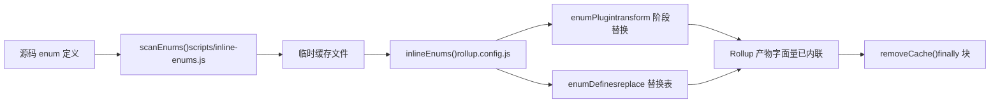
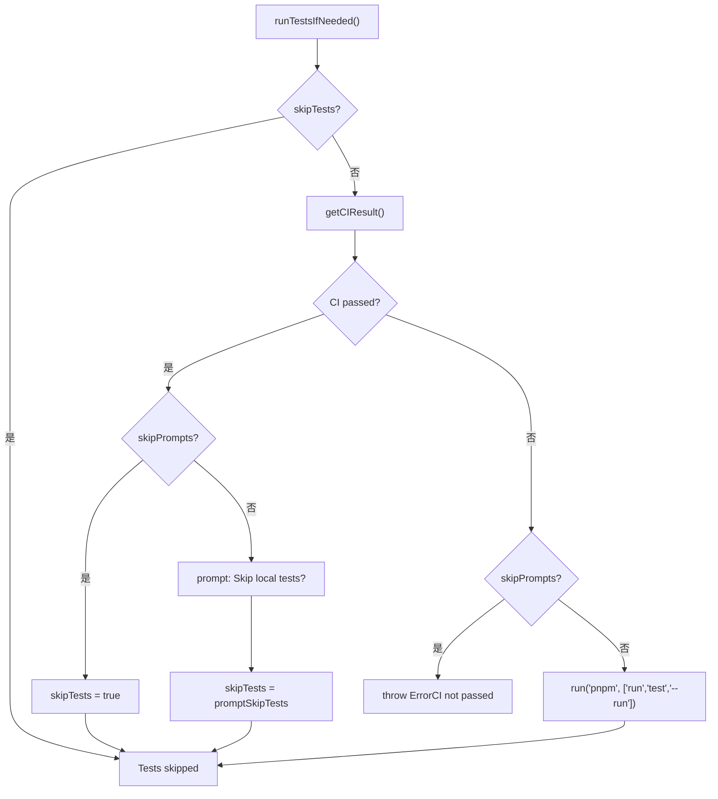

# Capítulo 13: Trade-offs de arquitetura e guia para evitar armadilhas: condições de contorno da engenharia de monorepo

No capítulo anterior, usamos`packages-private/vite-debug`como ponto de entrada e dominamos o paradigma de depuração para reprodução mínima no código-fonte real. Quando esse tipo de pacote de depuração interna se multiplica, surge um problema prático: eles coexistem no mesmo workspace com os pacotes oficiais publicados externamente; como garantir que o fluxo de publicação não os afete por engano? Este capítulo aprofundará as condições de contorno da engenharia de monorepo, partindo do contrato de diretório duplo entre`packages`e`packages-private`, analisará o design defensivo por trás dos trade-offs de arquitetura e fornecerá um guia prático para evitar armadilhas.

# 13.2 Regra temporal: a inline de enums deve ser executada antes do Rollup

## Modelo intuitivo

A inline de enums é como "trocar as etiquetas das peças por números antes de embalar". Se o empacotador (Rollup) já começou a embalar e você for alterar as etiquetas depois, as peças dentro da caixa não corresponderão mais às etiquetas.`build.js`usa`scanEnums()` / `removeCache()`este par de funções para prender estritamente a inline antes do Rollup.

## Estrutura de dados e ciclo de vida

`inline-enums.js`exporta`scanEnums()`retorna um`removeCache`closure, que varre as definições de enum no código-fonte e gera arquivos temporários para o Rollup consumir[FACT:scripts/build.js:30-34]。`build.js`de`run()`usa`try/finally`para garantir a limpeza do cache[FACT:scripts/build.js:81-112]：

```js
const removeCache = scanEnums()
try {
  // ... buildAll / checkAllSizes / build-dts
} finally {
  removeCache()
}
```

`rollup.config.js`chama no nível superior do módulo`inlineEnums()`para obter`[enumPlugin, enumDefines]` [FACT:rollup.config.js:47-50], onde`enumPlugin`insere no array plugins[FACT:rollup.config.js:331-331]，`enumDefines`e incorpora à tabela de substituição do plugin replace[FACT:rollup.config.js:222-223]。

## Passo a passo: o ciclo de vida completo de um enum em uma build

1. `build.js`de`run()`primeiro chama`scanEnums()`, varre as definições de enum de todos os pacotes e grava no cache temporário, retornando`removeCache` [FACT:scripts/build.js:87-87]。

2. `buildAll`e inicia múltiplos processos Rollup em paralelo[FACT:scripts/build.js:119-121]。

3. Cada processo Rollup executa na fase de carregamento de configuração`inlineEnums()`, lê o cache gerado na etapa anterior e obtém`enumPlugin`e`enumDefines` [FACT:rollup.config.js:47-50]。

4. `enumPlugin`na fase de transform, substitui as referências de enum no código-fonte por literais;`enumDefines`como complemento do replace, trata substituições de constantes entre módulos[FACT:rollup.config.js:222-223]。

5. Ao final da build,`finally`o bloco chama`removeCache()`para limpar arquivos temporários[FACT:scripts/build.js:119-121]。



## Reflexões de design e armadilhas

> **[Design Inference & Architectural Trade-offs]**
> Por que não usar um plugin Rollup para varrer e usar na hora, na fase de transform? Porque a inline de enums precisa de**visão global entre pacotes**：`runtime-core`o enum referenciado pode estar definido em`shared`, e um único processo Rollup só vê a árvore de código-fonte do próprio pacote, incapaz de concluir a substituição entre pacotes.`scanEnums()`estabelecer um cache global antes da build é justamente para resolver esse problema de visibilidade.

Pontos de armadilha em produção:`removeCache()`colocado em`finally`significa que a limpeza ocorrerá mesmo se a build lançar erro no meio. Mas se você interromper manualmente o processo durante a depuração (Ctrl+C),`finally`pode não ser executado, e arquivos de cache residuais farão a próxima build ler enums expirados. Método de diagnóstico: verifique se há arquivos de cache de enum residuais no diretório`temp/`, exclua manualmente e tente novamente.

---

# 13.3 Orquestrador de publicação:`release.js`matriz de flags skip de

## Modelo intuitivo

`release.js`é como o diretor-geral de um casamento,`skipBuild` / `skipTests` / `skipGit` / `skipPrompts`os quatro interruptores são os botões de "pular ensaio", "pular votos", "pular fotos" e "pular confirmação". A existência de cada botão corresponde a um cenário real: ambientes de CI precisam de`skipPrompts`, depuração local precisa de`skipGit`, hotfix emergencial precisa de`skipTests`。

## Estrutura de dados e valores padrão das flags

As quatro flags skip são declaradas em`parseArgs`em[FACT:scripts/release.js:39-50], e depois desestruturadas em variáveis locais[FACT:scripts/release.js:64-66]：

```js
let skipTests = args.skipTests
const skipBuild = args.skipBuild
const skipPrompts = args.skipPrompts
const skipGit = args.skipGit
```

Observe que`skipTests`usa`let`declaração, porque ela em`runTestsIfNeeded()`será reescrita dinamicamente[FACT:scripts/release.js:281-317]。

## Step-by-Step: o fluxo completo de decisão de um release

`main()`a ordem de execução[FACT:scripts/release.js:143-279]：

1. **Verificação de sincronização remota**：`isInSyncWithRemote()`compara o HEAD local com o SHA do branch remoto e, quando不一致, exibe uma caixa de confirmação[FACT:scripts/release.js:337-363]。

2. **Seleção de versão**: quando não há argumento posicional, abre`versionIncrements`menu de seleção[FACT:scripts/release.js:152-176]。

3. **Decisão de teste**：`runTestsIfNeeded()`é onde a lógica de skip é mais densa[FACT:scripts/release.js:281-317]。

4. **Atualização de versão**：`updateVersions()`percorre todos os pacotes e reescreve`package.json` [FACT:scripts/release.js:377-398]。

5. **Geração de Changelog**: chama`pnpm run changelog` [FACT:scripts/release.js:211-212]。

6. **Commit no Git**：`skipGit`quando verdadeiro, todo o trecho é ignorado[FACT:scripts/release.js:231-240]。

7. **Publicação**: executa somente quando`args.publish`for verdadeiro`buildPackages()` + `publishPackages()` [FACT:scripts/release.js:243-246]。

`runTestsIfNeeded()`a lógica de branch merece ser detalhada separadamente:



## Reflexões de design e armadilhas

> **[Design Inference & Architectural Trade-offs]**
> `skipTests`usa`let`em vez de`const`o design de  em vez de  existe para suportar o caminho de otimização “se o CI já passou, pular automaticamente os testes locais”. Isso economiza muito tempo em cenários de release via CI — o`release.yml`do GitHub Actions já executou os testes completos, então rodar tudo de novo localmente é puro desperdício.

**O contrato oculto da ordem de publicação**：`sortPackagesForPublishing`coloca`vue`no final[FACT:scripts/release.js:85-85], e o comentário deixa explícito que “o usuário não pode instalar o novo pacote de entrada antes que os pacotes internos estejam disponíveis”. Se você alterar essa ordenação, o usuário`npm install vue@next`pode obter uma versão cujas dependências ainda não foram publicadas, causando`ERR_MODULE_NOT_FOUND`。

**Proteção de idempotência**：`publishPackage`chama antes da publicação`isPackagePublished`verifica o registry[FACT:scripts/release.js:453-458], captura em caso de falha de publicação`previously published`erro e faz downgrade para pular[FACT:scripts/release.js:480-488]. Isso permite que o script de release seja repetido com segurança — após uma interrupção de rede, reexecutar não falhará por completo por causa de “pacote já existente”.

**Rollback em caso de falha**：`fnToRun().catch()`quando`versionUpdated`for verdadeiro, chama`updateVersions(currentVersion)`faz rollback do número de versão[FACT:scripts/release.js:528-537]. Mas atenção: isso só faz rollback do`package.json`campo de versão em**não faz rollback do commit já`git commit`enviado**. Se você publicar com falha quando`skipGit`for falso, será necessário fazer manualmente`git reset`。

---

# Reflexão de design: o padrão comum dos três trade-offs

Revisando os três trade-offs centrais deste capítulo, eles compartilham a mesma filosofia de design:**transformar “verificações em tempo de execução fáceis de esquecer” em “restrições estruturais impossíveis de contornar”**。

- `packages-private`isolamento físico: não depende de o autor do script lembrar de verificar`private`campo, mas faz com que o escopo de varredura o exclua naturalmente.
- Inline de enum antecipado: não depende de o plugin do Rollup “por acaso” conseguir ver enums entre pacotes durante o transform, mas estabelece um cache global antes do build.
- `release.js`matriz de skip de : não depende de o publicador lembrar que “se o CI passou, não precisa rodar testes locais”, mas faz o script consultar automaticamente o status do CI e reescrever`skipTests`。

> **[Design Inference & Architectural Trade-offs]**
> O custo desse padrão é**aumento da complexidade do script**：`build.js`precisa manter`privatePackages`lista,`rollup.config.js`precisa repetir a lógica de detecção de diretório,`release.js`precisa lidar com a combinação cruzada de quatro flags de skip. Mas para um repositório como o Vue, que publica várias vezes por semana, o ganho de confiabilidade trazido por restrições estruturais supera em muito o custo de complexidade.

---

# Resumo do capítulo

Este capítulo, partindo do código-fonte, decompôs três condições de contorno críticas do sistema de engenharia do Vue core:

1. **`packages-private`e`packages`isolamento físico**garantido em conjunto pelo workspace glob,`build.js`detecção de diretório,`release.js`filtro em três pontos[FACT:pnpm-workspace.yaml:1-3][FACT:scripts/build.js:153-170][FACT:scripts/release.js:68-83]。

2. **Restrição temporal do inline de enum**garantida obrigatoriamente pela`scanEnums()` / `removeCache()`de`try/finally`estrutura, com a configuração do Rollup consumindo o cache no nível superior do módulo[FACT:scripts/build.js:81-112][FACT:rollup.config.js:47-50]。

3. **`release.js`matriz de flags de skip de**atende a três cenários: release via CI, depuração local e hotfix emergencial,`skipTests`a reescrita dinâmica e a ordenação da sequência de publicação são dois contratos ocultos mais facilmente ignorados[FACT:scripts/release.js:281-317][FACT:scripts/release.js:85-85]。

# Reflexões e autoavaliação deste capítulo

Q1: Se removermos`build.js`em`build(target)`a função`privatePackages.includes(target)`verificação`packages`e usarmos uniformemente`pkgBase`como

**, em quais cenários isso causaria problemas?**：`build.js:160-164`Análise de referência`nr build vite-debug`a detecção de diretório é a única entrada pela qual pacotes privados podem ser construídos. Depois de removê-la,`packages/vite-debug`procurará em`package.json`,`fs.readFileSync`mas esse diretório não existe,`ENOENT`lança diretamente`packages/`. Um problema mais oculto é: se no futuro alguém criar um diretório com o mesmo nome em`buildOptions`, o build usará silenciosamente a configuração do diretório errado, e os caminhos de artefato e`rollup.config.js:37-42`ficarão todos desalinhados. Além disso,`build.js`tem lógica independente de detecção de diretório, e os dois pontos precisam ser modificados em sincronia, caso contrário surgirá o estado inconsistente de “

Q2: `release.js`encontrou o pacote, mas o Rollup não encontrou”.`runTestsIfNeeded()`em`skipTests ||= isCIPassed`esta linha de código (`release.js:285`) quando`skipPrompts`for verdadeiro e o CI não tiver passado, qual branch será seguido? Se removermos`else if (skipPrompts)`do branch`throw`, quais seriam as consequências?

**Análise de referência**: quando`skipPrompts`for verdadeiro e o CI não tiver passado,`skipTests ||= isCIPassed`em`isCIPassed`é`false`，`skipTests`mantém o valor original (normalmente`false`). Em seguida entra no`else if (skipPrompts)`branch, lançando`Error`（`release.js:299-304`). Se removermos este`throw`, o código continuará até`if (!skipTests)`branch, executando em ambiente não interativo`pnpm run test --run`. No CI, isso pode fazer os testes falharem por diferenças de ambiente ou, pior — os testes passarem, mas o CI na prática não ter passado (por exemplo, o CI executa um subconjunto diferente de testes), publicando uma versão sem validação completa.

Q3: `rollup.config.js:55`de`inlineEnums()`é chamado no nível superior do módulo, enquanto`build.js:87`de`scanEnums()`é chamado dentro da função`run()`. Se invertermos o momento de execução dos dois (ou seja, fazer`inlineEnums()`ser chamado no`buildStart`hook do Rollup), o que seria quebrado?

**Análise de referência**：`scanEnums()`deve ser concluído antes que todos os processos do Rollup iniciem, porque precisa escanear**todos os pacotes**o código-fonte para estabelecer o cache global de enum.`inlineEnums()`é chamado no nível superior do módulo`rollup.config.js`, quando o Rollup ainda não iniciou nenhum build, e o cache já está pronto. Se fosse alterado para ser chamado em`buildStart`, cada processo do Rollup escanearia independentemente — mas`buildAll`é executado concorrentemente (`build.js:119-121`), e vários processos escaneando simultaneamente o mesmo conjunto de arquivos gerariam uma corrida: o processo A pode ler um arquivo de cache que o processo B ainda não terminou de escrever, resultando em substituição incompleta de enum. Mais grave ainda,`scanEnums()`o retorno de`removeCache`closure depende do estado do file handle no momento da varredura, e em cenários concorrentes o momento de limpeza não pode ser coordenado.

Contrato de diretório duplo, determinação de atribuição de scripts de build, filtragem secundária de scripts de publicação — esses mecanismos juntos delimitam a fronteira de segurança da engenharia de monorepo. Mas a fronteira não é imutável: à medida que as ferramentas de build migram de Rollup para Rolldown e os testes de tipo e testes de runtime convergem, as estratégias de trade-off existentes também enfrentarão novos desafios. No próximo capítulo, com base na trajetória de mudanças de 3.0 a 3.4, vislumbraremos a direção de evolução da próxima geração do sistema de engenharia.
