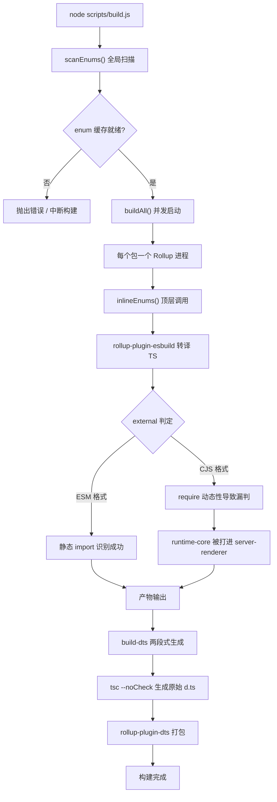
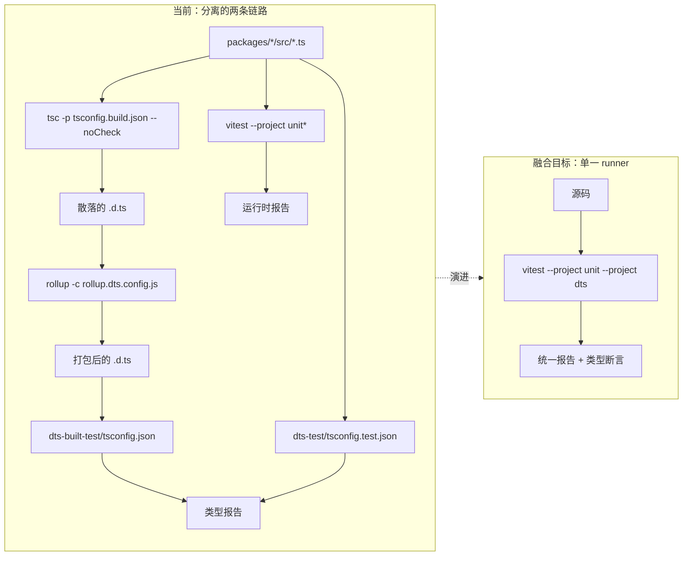
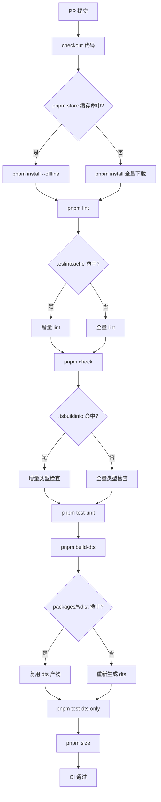

# Capítulo 14: Evolução Futura: Do 3.x à Próxima Geração do Sistema de Engenharia

No capítulo anterior, examinamos as "fronteiras de segurança" do sistema de engenharia do Vue core — contrato de diretório duplo, determinação de atribuição de scripts de build, filtragem secundária de scripts de publicação. Esses mecanismos não foram projetados de uma só vez, mas repetidamente refinados ao longo das iterações de 3.0 a 3.4. Este capítulo adota uma perspectiva diferente: não olhamos mais "como é agora", mas sim "como chegou a ser assim", e a partir disso inferimos para onde a próxima geração do sistema de engenharia irá. O material de código-fonte deste capítulo são changelogs/CHANGELOG-3.3.md, changelogs/CHANGELOG-3.4.md e o package.json na raiz do repositório. Os changelogs parecem apenas um registro de "quais bugs foram corrigidos", mas são o relatório de check-up mais autêntico do sistema de engenharia: cada commit com prefixo build:, cada alteração com prefixo types:, cada reversão de versão de dependência, tudo expõe os pontos de estresse da arquitetura atual. O que precisamos fazer é ler a direção da evolução a partir desses pontos de estresse. Tratar o changelog como uma "janela de observação do sistema de engenharia" em vez de uma "lista de funcionalidades" é a metodologia central deste capítulo. As mudanças de funcionalidade nos dizem o que o Vue pode fazer, enquanto as mudanças relacionadas a build, tipos e CI nos dizem "onde dói" no sistema de engenharia do Vue.

# I. Pontos de estresse da cadeia de ferramentas de build: o potencial de migração de Rollup para Rolldown

## Modelo intuitivo

Imagine a cadeia de ferramentas de build como uma linha de montagem: Rollup é a bancada principal de montagem, esbuild é responsável pelo corte rápido (transpilação de TS), terser é responsável pela compactação final do empacotamento. À medida que o produto (o runtime do Vue) se torna cada vez mais complexo e as etapas na bancada de montagem aumentam, a própria bancada principal se torna o gargalo. O posicionamento do Rolldown é ser a bancada principal de montagem reescrita em Rust — ele não substitui o esbuild, mas o próprio Rollup.

Se não houvesse essa pressão evolutiva, o "desastre" que o sistema enfrentaria não seria um colapso, mas sim**o tempo de build inflando linearmente com o número de pacotes**: a cada subpacote adicionado, seria necessário iniciar mais um processo Rollup, escanear mais uma vez o cache de enum, executar mais uma rodada de geração de dts.

## Estrutura de dados e layout de dependências

Primeiro, vejamos um instantâneo estático da cadeia de ferramentas atual.`package.json`O`devDependencies`é uma "lista precisa da bancada de montagem":

[FACT:package.json:103-106]

```
    "rollup": "^4.63.3",
    "rollup-plugin-dts": "^6.5.1",
    "rollup-plugin-esbuild": "^6.2.1",
    "rollup-plugin-polyfill-node": "^0.13.0",
```

Aqui podemos extrair três fatos-chave. Primeiro, a versão principal do Rollup é`^4.63.3`, estando no período de maturidade do Rollup 4.x. Segundo,`rollup-plugin-esbuild`assume a transpilação de TS, o que significa que o próprio Rollup não analisa TS, apenas processa o JS emitido pelo esbuild. Terceiro,`rollup-plugin-dts`é responsável independentemente pelo empacotamento de`.d.ts`, o que é exatamente a base material da independência de`dts-built-test`discutida no capítulo anterior.

Agora vejamos a orquestração de entrada dos scripts de build:

[FACT:package.json:8-9]

```
    "build": "node scripts/build.js",
    "build-dts": "tsc -p tsconfig.build.json --noCheck && rollup -c rollup.dts.config.js",
```

`build-dts`é "em duas etapas": primeiro`tsc --noCheck`gera os arquivos de declaração brutos (`--noCheck`pula a verificação de tipos, apenas faz emit), depois`rollup -c rollup.dts.config.js`empacota os`.d.ts`dispersos em um único arquivo. Esse design em si depende das capacidades do Rollup —`rollup-plugin-dts`precisa do grafo de módulos do Rollup para rastrear dependências de tipos.

## Orientado por cenários: o que um commit de`build:`expôs

As entradas com prefixo`build:`no changelog são evidências diretas dos pontos de estresse da cadeia de ferramentas de build. Vamos escolher três para analisar.

A primeira, o alinhamento de configuração de minify na 3.4.32:

[FACT:changelogs/CHANGELOG-3.4.md:84]

```
* **build:** use consistent minify options from previous terser config ([789675f](https://github.com/vuejs/core/commit/789675f65d2b72cf979ba6a29bd323f716154a4b))
```

A motivação deste commit é "após migrar de terser para esbuild minify, as opções de compactação ficaram inconsistentes". Isso revela um estado intermediário em migração: o Vue costumava usar terser para compactação, depois mudou para esbuild (`devDependencies`em`esbuild: ^0.28.2`confirma isso), mas as opções de compactação não foram totalmente alinhadas, causando desvios no tamanho ou comportamento do artefato. Esse é exatamente o custo típico de "trocar peças da bancada de montagem".

A segunda, a reversão da versão de entities na 3.4.38:

[FACT:changelogs/CHANGELOG-3.4.md:6]

```
* **build:** revert entities to 4.5 to avoid runtime resolution errors ([f349af7](https://github.com/vuejs/core/commit/f349af7b65b9f8605d8b7bafcc06c25ab1f2daf0)), closes [#11603](https://github.com/vuejs/core/issues/11603)
```

`entities`é uma biblioteca de decodificação de entidades HTML, dependida por`compiler-dom`. A reversão para 4.5 ocorreu porque a nova versão apresentou problemas na análise em runtime. Este commit mostra:**a atualização de dependências da cadeia de ferramentas de build não é isolada; a mudança de versão de uma dependência indireta pode permear até o comportamento em runtime**。

A terceira, a poluição do build cjs do server-renderer na 3.4.29:

[FACT:changelogs/CHANGELOG-3.4.md:155]

```
* **build:** fix accidental inclusion of runtime-core in server-renderer cjs build ([11cc12b](https://github.com/vuejs/core/commit/11cc12b915edfe0e4d3175e57464f73bc2c1cb04)), closes [#11137](https://github.com/vuejs/core/issues/11137)
```

Este é o tipo mais típico de bug de build: no formato CJS,`server-renderer`acidentalmente incluiu`runtime-core`em seu próprio artefato. A causa geralmente é a determinação de`external`do Rollup falhando no formato CJS — ESM consegue identificar estaticamente dependências externas através de`import`declarações, enquanto o CJS`require`A dinamicidade é maior, o que facilita a omissão de erros. Este commit aponta diretamente para a fragilidade da lógica`external`na configuração do Rollup.

## Representação Mermaid da energia de migração

A figura abaixo descreve o fluxo de controle do pipeline de build atual e destaca os nós que serão afetados pela migração para o Rolldown:



> **[Design Inference & Architectural Trade-offs]**
> O valor da migração para o Rolldown está em: substituir o modelo de concorrência de "um processo por pacote" por um modelo de "paralelismo em processo único",`scanEnums()`A varredura global de e a substituição de`inlineEnums()`podem ser coordenadas dentro do mesmo runtime Rust, e o problema de "condição de corrida em varredura concorrente" discutido no capítulo anterior desaparecerá pela raiz. Mas a resistência à migração também está aqui —`rollup-plugin-esbuild`、`rollup-plugin-dts`Esses ecossistemas de plugins precisam que o Rolldown forneça uma camada de compatibilidade, e a lógica de decisão de`external`precisa ser reescrita.

## Reflexões de design e armadilhas

**Por que a migração não acontecerá da noite para o dia?**Veja o campo`package.json`de`engines`:

[FACT:package.json:61-63]

```
  "engines": {
    "node": ">=20.0.0"
  },
```

Node 20 é o limite mínimo obrigatório. O Rolldown, como módulo nativo Rust, precisa das bindings N-API correspondentes e distribuição de binários pré-compilados. Uma vez introduzido,`pnpm install`o tempo de execução, a compatibilidade de binários multiplataforma (Windows/macOS/Linux) e a estratégia de cache de CI precisam ser redesenhados. Isso não é simplesmente "trocar uma dependência", mas sim**uma recalibração de toda a cadeia de instalação-build-cache**。

**Armadilhas em produção**：`build-dts`O`tsc --noCheck`de é uma faca de dois gumes. Pular a verificação de tipos acelera o emit, mas significa que`.d.ts`a fase de geração não detectará erros de tipo — erros de tipo só podem ser contidos por`pnpm check`（`tsc --incremental --noEmit`) e`test-dts`. Se após a migração para o Rolldown quisermos fundir essas duas etapas, devemos garantir que a verificação de tipos não torne o build mais lento, caso contrário, contrariaremos o propósito original de`--noCheck`.

---

# II. Tendência de fusão entre testes de tipo e testes de runtime

## Modelo intuitivo

Imagine testes de tipo e testes de runtime como dois postos de controle de qualidade independentes: um verifica se o "manual (`.d.ts`) está escrito corretamente", o outro verifica se "a máquina (runtime) está girando corretamente". Cada posto tem sua própria estação de trabalho, ferramentas e relatórios independentes. A tendência de fusão significa:**Podemos fazer com que o mesmo caso de teste valide tanto o manual quanto a máquina?**

Sem a fusão, o desastre que o sistema enfrenta é**Desvio entre tipos e comportamento em runtime**：`.d.ts`diz que`ref()`retorna`Ref<T>`, mas a forma do objeto realmente retornado em runtime mudou; o teste de tipo passa, o teste de runtime também passa, mas a combinação dos dois está errada.

## Estrutura de dados: layout de orquestração do script de teste

`package.json`Em`scripts`de , as entradas relacionadas a testes são claramente divididas em dois grupos:

[FACT:package.json:19-24]

```
    "test": "vitest",
    "test-unit": "vitest --project unit*",
    "test-e2e": "node scripts/build.js vue -f global -d && vitest --project e2e --project e2e-browser",
    "test-dts": "run-s build-dts test-dts-only",
    "test-dts-only": "tsc -p packages-private/dts-built-test/tsconfig.json && tsc -p ./packages-private/dts-test/tsconfig.test.json",
    "test-coverage": "vitest run --project unit* --coverage",
```

A estrutura-chave aqui é`test-dts`de`run-s build-dts test-dts-only`— ela é**serial**: primeiro constrói`.d.ts`, depois executa os testes de tipo. E dentro de`test-dts-only`há**dois processos`tsc`independentes**: um executa`dts-built-test`(valida os artefatos de build), outro executa`dts-test`(valida os tipos do código-fonte).

Note que`test-unit`usa`vitest --project unit*`，`test-e2e`usa`vitest --project e2e --project e2e-browser`. Isso mostra que o mecanismo de`--project`do Vitest já dividiu os testes em diferentes projects por "unidade/e2e/navegador".**A base física para a fusão já existe**: o mecanismo de project do Vitest permite executar diferentes tipos de teste no mesmo runner.

## Orientado a cenários: o caminho completo de um commit`types:`de

No changelog, a densidade de entradas com prefixo`types:`é extremamente alta, o que é um reflexo direto da complexidade do sistema de tipos. Vamos rastrear uma correção de tipo típica.

Reversão do tipo ref na 3.4.37:

[FACT:changelogs/CHANGELOG-3.4.md:23-24]

```
* Revert "fix(types/ref): allow getter and setter types to be unrelated ([#11442](https://github.com/vuejs/core/issues/11442))" ([b1abac0](https://github.com/vuejs/core/commit/b1abac06cdb198bd72f8e614b1f68b92e1c78339))
* Revert "fix(types/ref): correct type inference for nested refs ([#11536](https://github.com/vuejs/core/issues/11536))" ([3a56315](https://github.com/vuejs/core/commit/3a56315f94bc0e11cfbb288b65482ea8fc3a39b4))
```

Dois Reverts consecutivos, revertendo duas correções de tipo. Note que na 3.4.35 essas duas correções acabaram de ser mescladas:

[FACT:changelogs/CHANGELOG-3.4.md:55]

```
* **types/ref:** allow getter and setter types to be unrelated ([#11442](https://github.com/vuejs/core/issues/11442)) ([e0b2975](https://github.com/vuejs/core/commit/e0b2975ef65ae6a0be0aa0a0df43fb887c665251))
```

[FACT:changelogs/CHANGELOG-3.4.md:30]

```
* **types/ref:** correct type inference for nested refs ([#11536](https://github.com/vuejs/core/issues/11536)) ([536f623](https://github.com/vuejs/core/commit/536f62332c455ba82ef2979ba634b831f91928ba)), closes [#11532](https://github.com/vuejs/core/issues/11532) [#11537](https://github.com/vuejs/core/issues/11537)
```

Da mesclagem na 3.4.35 até a reversão na 3.4.37, houve apenas uma versão de patch de intervalo. Esse ciclo rápido de "mesclar-reverter" expõe um dilema fundamental dos testes de tipo:**Testes de tipo conseguem validar que "a assinatura de tipo está conforme o esperado", mas não conseguem validar "se essa assinatura de tipo é útil em código real"**。`allow getter and setter types to be unrelated`pode passar completamente nos testes de tipo, mas no uso real tornará a inferência de tipo de`ref`excessivamente frouxa, quebrando a segurança de tipos do código downstream.

## Representação Mermaid da fusão de testes de tipo

A figura abaixo descreve a estrutura atual de separação entre testes de tipo e testes de runtime, e a forma-alvo após a fusão:



> **[Design Inference & Architectural Trade-offs]**
> O caminho técnico para a fusão provavelmente é: encapsular as chamadas de`dts-built-test`e`dts-test`de`tsc`como um project personalizado do Vitest, permitindo que as asserções de tipo sejam embutidas nos arquivos de teste na forma de`expectTypeOf`. Assim, uma única chamada de`vitest`pode executar simultaneamente asserções de runtime e asserções de tipo, com relatório unificado. Mas a resistência está em:`tsc`a verificação de tipos de é "total", enquanto os testes do Vitest são "por arquivo", e as estratégias de incrementalidade dos dois são incompatíveis.

## Reflexões de design e armadilhas

**Por que`dts-built-test`deve ser independente de`dts-test`？**Já discutimos isso no capítulo anterior; aqui complementamos sob a perspectiva da evolução:`dts-built-test`O que**valida são os**（`rollup-plugin-dts`artefatos de build`.d.ts`），`dts-test`após o empacotamento**O que**valida são os

[FACT:changelogs/CHANGELOG-3.4.md:9]

```
* **types:** add fallback stub for DOM types when DOM lib is absent ([#11598](https://github.com/vuejs/core/issues/11598)) ([4db0085](https://github.com/vuejs/core/commit/4db0085de316e1b773f474597915f9071d6ae6c6))
```

. Se na fusão os dois forem combinados, perderemos o ponto de verificação crucial de "se os artefatos de build são consistentes com os tipos do código-fonte". Este commit da 3.4.38 confirma exatamente a importância dos tipos dos artefatos de build:`dts-built-test`Copiar`.d.ts`"Fornecer fallback stub quando a lib DOM estiver ausente" — esta é uma correção de compatibilidade de tipos no nível do artefato de build, que só pode ser descoberta no cenário de

**"consumir o**empacotado".**Armadilhas em produção**: o ciclo de "mesclar-reverter" dos testes de tipo mostra que mudanças em assinaturas de tipo precisam de validação por`packages-private/dts-test`No repositório, são usados casos de teste internos, que não cobrem todos os usos downstream. Se a tendência de fusão se concentrar apenas em "fundir dois runners", sem resolver "como introduzir feedback real de downstream", será apenas uma fusão formal.

---

# III. Direções de otimização refinada do cache de CI

## Modelo intuitivo

Imagine o cache de CI como a "área de preparação de materiais" de um armazém: cada build precisa retirar matérias-primas (dependências, artefatos de build, cache de tipos) dessa área. Se a área de preparação tiver apenas uma caixa grande, e para pegar qualquer item seja necessário revirar a caixa inteira, então mesmo com alta taxa de acerto do cache, não será rápido. Otimização refinada significa:**Dividir a caixa grande em compartimentos menores classificados por finalidade**。

Sem cache refinado, o desastre que o sistema enfrenta é**Amplificação em cascata da invalidação de cache**: alterar uma linha do código-fonte faz com que todo o`node_modules`cache seja invalidado, o CI reinstala todas as dependências, e o tempo de build passa de 2 minutos para 10 minutos.

## Estrutura de dados: classificação dos itens cacheáveis

A partir do`package.json`é possível identificar várias categorias de "materiais" cacheáveis:

Primeira categoria, produtos de instalação de dependências.`packageManager`O campo fixa a versão do pnpm:

[FACT:package.json:4]

```
  "packageManager": "pnpm@12.4.2",
```

O`node_modules`do pnpm é uma estrutura de links simbólicos; o que se cacheia é o content-addressable store do pnpm, e não o`node_modules`plano. Isso significa que a chave de cache deve ser baseada no hash do`pnpm-lock.yaml`, e não no`package.json`。

Segunda categoria, artefatos de build.`clean`O script revela a localização física dos artefatos:

[FACT:package.json:10]

```
    "clean": "rimraf --glob packages/*/dist temp .eslintcache",
```

`packages/*/dist`、`temp`、`.eslintcache`— essas três categorias de artefatos podem ser cacheadas independentemente.`dist`é a saída de build,`temp`são arquivos temporários (como`bench.json`），`.eslintcache`é o cache de lint.

Terceira categoria, cache de verificação de tipos.`check`O script usa`--incremental`：

[FACT:package.json:15]

```
    "check": "tsc --incremental --noEmit",
```

`--incremental`gera o arquivo`.tsbuildinfo`, que é o cache incremental da verificação de tipos. Se esse arquivo for cacheado no CI,`tsc`a segunda execução do

## será muito mais rápida.

Orientado a cenários: fluxo de execução do CI em um PR`packages/reactivity/src/ref.ts`Considere um cenário típico: o desenvolvedor modificou

e submeteu um PR. Quais etapas o CI precisa executar, e quais podem acertar o cache?`scripts`A partir do`simple-git-hooks`é possível inferir a sequência de execução do CI (o`pre-commit`do

[FACT:package.json:48-51]

```
  "simple-git-hooks": {
    "pre-commit": "pnpm lint-staged && pnpm check",
    "commit-msg": "node scripts/verify-commit.js"
  },
```

Copiar`pre-commit`Localmente o`lint-staged`executa`check`e`lint`、`check`、`test-unit`、`test-dts`、`size`. No CI, serão executados

- `lint`etc. A estratégia de cache de cada etapa é diferente:`.eslintcache`: cacheia
- `check`, chave baseada no hash dos arquivos-fonte.`.tsbuildinfo`: cacheia`tsconfig`, chave baseada em
- `test-unit`e no hash do código-fonte.
- `test-dts`: o Vitest tem seu próprio cache, mas normalmente no CI não se cacheiam resultados de teste, apenas dependências.`build-dts`: depende dos artefatos de`packages/*/dist`, chave de cache baseada no hash de
- `size`: depende dos artefatos de build, chave de cache igual à anterior.

## Representação Mermaid da otimização do cache de CI



> **[Design Inference & Architectural Trade-offs]**
> A contradição central do cache refinado é**a granularidade da chave de cache**: chave muito grossa (por exemplo, baseada apenas no commit hash) tem baixa taxa de acerto; chave muito fina (por exemplo, baseada no hash de cada arquivo) faz com que o custo de calcular a chave anule o ganho do cache. A estratégia razoável para monorepos como o Vue é "fragmentar por pacote": cada`packages/*`subpacote tem cache independente; alterações em`dist`，`reactivity`não invalidam o`compiler-core`cache de`dist`.

## Reflexões de design e armadilhas

**Por que o script`size`deve ser dividido em vários subcomandos?**Veja estas três linhas:

[FACT:package.json:11-14]

```
    "size": "run-s \"size-*\" && node scripts/usage-size.js",
    "size-global": "node scripts/build.js vue runtime-dom -f global -p --size",
    "size-esm-runtime": "node scripts/build.js vue -f esm-bundler-runtime",
    "size-esm": "node scripts/build.js runtime-dom runtime-core reactivity shared -f esm-bundler",
```

`size`usa`run-s "size-*"`para executar serialmente todos os subcomandos com prefixo`size-`. Esse padrão de "agregação por prefixo" permite que cada dimensão de tamanho (global, esm-runtime, esm) seja cacheada e falhe independentemente. Se fossem fundidas em um único comando grande, qualquer dimensão que ultrapassasse o limite faria todo o`size`falhar, sem ser possível localizar qual dimensão causou o problema.

**Armadilhas em produção**: a armadilha mais comum no cache de CI é**a poluição do cache**—cachear artefatos errados, fazendo com que builds subsequentes se baseiem em dados sujos.`clean`O script

[FACT:package.json:10]

```
    "clean": "rimraf --glob packages/*/dist temp .eslintcache",
```

Copiar`packages/*/dist`Observe que ele limpa`packages-private/*/dist`, e não`packages-private`. Isso significa que os artefatos de`packages-private`não estão no escopo de limpeza convencional—se o CI cachear os artefatos de`clean`e o`packages-private`não os limpar, pode surgir o problema de "cachear artefatos antigos do playground". No design de cache refinado, é necessário tratar

---

# separadamente.

Reflexão de design: o sistema de engenharia como ciclo de vida do produto**Conectando as pistas das três seções, é possível ver uma linha principal clara:**。

O sistema de engenharia do Vue está passando de "funcional" para "fácil de usar", de "orquestração manual" para "configuração declarativa"

A migração da cadeia de ferramentas de build (Rollup → Rolldown) é uma evolução "orientada a desempenho": quando o número de pacotes cresce a certo ponto, o custo da concorrência em nível de processo supera o ganho, sendo necessário trocar por um modelo de concorrência mais leve.

A fusão dos testes de tipo é uma evolução "orientada à consistência": quando a frequência de mudanças nas assinaturas de tipo supera a frequência de mudanças no comportamento em tempo de execução, os dois conjuntos separados de testes se tornam um fardo, sendo necessário que compartilhem os mesmos casos de uso.

> **[Design Inference & Architectural Trade-offs]**
> 〔Inferência de design e trade-offs arquiteturais〕**A restrição comum a essas três linhas de evolução é**a compatibilidade retroativa`BREAKING CHANGES`. A estratégia de release do Vue (visível no parágrafo

---

# do changelog) permite "type-only breaking change" em versões minor, mas não permite breaking change em tempo de execução. Isso significa que a evolução do sistema de engenharia deve garantir: independentemente de como a cadeia de ferramentas interna mude, a API pública e o comportamento em tempo de execução dos artefatos não podem mudar. Essa é a fronteira rígida de todas as decisões de evolução.

Resumo do capítulo`package.json`Este capítulo, partindo do changelog e do

1. **, organizou as três linhas de evolução do sistema de engenharia do Vue core:**：A combinação atual de Rollup 4.x + esbuild + rollup-plugin-dts tem seus pontos de estresse evidenciados em`build:`commits com o prefixo (alinhamento de configuração de minify, reversão de versão de entities, omissão na detecção de external em CJS). O potencial da migração para Rolldown vem da substituição de "concorrência multiprocesso" por "paralelismo monoprocesso", enquanto a resistência vem do ecossistema de plugins e da distribuição de binários multiplataforma.

2. **Fusão de testes de tipo**：`test-dts`do`run-s build-dts test-dts-only`estrutura serial, bem como`dts-built-test`e`dts-test`o duplo`tsc`processo, são evidências físicas da forma de separação atual. O caminho técnico para a fusão é utilizar o mecanismo de`--project`do Vitest, e a resistência é que a verificação completa de`tsc`é incompatível com a estratégia incremental de testes por arquivo do Vitest.

3. **Granularização do cache de CI**：`packageManager`fixa o pnpm,`clean`limpa três tipos de artefatos,`check`usa`--incremental`、`size`agrega por prefixo — todos esses são critérios de classificação para itens cacheáveis. A contradição central é a granularidade da chave de cache, e a estratégia razoável é "fragmentação por pacote".

A mudança de percepção mais importante é:**o próprio sistema de engenharia é um produto, com seus próprios usuários (contribuidores), suas próprias métricas de desempenho (tempo de build, minutos de CI), suas próprias restrições de compatibilidade (API de artefatos inalterada)**. Ele precisa de iteração contínua, não de um design único.

# Reflexões e autoavaliação deste capítulo

Q1: `package.json:9`do`build-dts`usou`tsc -p tsconfig.build.json --noCheck`. Se removermos`--noCheck`, quais reações em cadeia isso traria após a migração para Rolldown?

**Análise de referência**：`--noCheck`serve para pular a verificação de tipos e apenas fazer emit. Após removê-lo,`tsc`fará verificação completa de tipos antes de gerar`.d.ts`. Na arquitetura atual do Rollup, isso apenas torna`build-dts`mais lento; mas após a migração para Rolldown, o problema se amplifica: o principal atrativo do Rolldown é "build paralelo em processo único", e se a etapa de`build-dts`introduzir uma verificação completa de`tsc`, ela se torna um gargalo serial de todo o pipeline — o build de todos os pacotes precisa esperar essa verificação terminar. Pior ainda,`tsc`a verificação de tipos é single-threaded e não consegue aproveitar a capacidade paralela do Rolldown. A abordagem correta é manter`--noCheck`, delegar a verificação de tipos a`pnpm check`（`package.json:15`) e`test-dts`（`package.json:22`) independentes, desacoplando build e verificação.

Q2: O changelog 3.4.37 reverteu consecutivamente duas correções de`types/ref`(`CHANGELOG-3.4.md:23-24`), e essas duas correções tinham acabado de ser integradas na 3.4.35 (`CHANGELOG-3.4.md:30,55`). Se os testes de tipo e os testes de runtime já estivessem fundidos, esse ciclo de "integração-reversão" poderia ser evitado? Por quê?

**Análise de referência**：Não pode ser completamente evitado, mas pode encurtar o ciclo. Os testes de tipo após a fusão ainda só conseguem validar "a assinatura de tipo atende à asserção", enquanto o problema de correções como`allow getter and setter types to be unrelated`está em "a assinatura de tipo é excessivamente permissiva, quebrando a segurança de tipos do código downstream" — isso é um problema de**uso downstream**, não um problema da própria**assinatura**. Onde a fusão pode encurtar o ciclo é: se asserções de tipo e asserções de runtime estiverem escritas no mesmo arquivo de teste, o desenvolvedor pode descobrir mais rapidamente a inconsistência de "a assinatura de tipo mudou, mas o comportamento em runtime não mudou". Mas para realmente evitar reversões, é preciso introduzir verificação de tipos de projetos downstream reais (por exemplo, expandir`packages-private/dts-test`para um conjunto de testes que "simula uso downstream"), o que ultrapassa o escopo de simplesmente "fundir runners".

Q3: `package.json:10`do`clean`script limpa`packages/*/dist`, mas não limpa`packages-private/*/dist`. Se o CI adotar uma estratégia de cache de granularidade fina "fragmentada por pacote", que armadilha de produção essa assimetria traria?

**Análise de referência**：A armadilha está em "cachear artefatos antigos de`packages-private`".`packages-private`contém`sfc-playground`、`template-explorer`e outras ferramentas de depuração; se seus artefatos de build (como`packages-private/sfc-playground/dist`) forem cacheados pelo CI, e`clean`não os limpar, ocorrerá: o código-fonte foi atualizado, mas o CI reutiliza artefatos antigos do playground, distorcendo o resultado de validação de`build-sfc-playground`（`package.json:39`). De forma mais sutil,`dev-sfc-prepare`（`package.json:34`) verificará se os artefatos de`packages-private`existem; se artefatos antigos estiverem cacheados, ele pulará a reconstrução, fazendo o desenvolvedor pensar que o ambiente é novo. Ao projetar cache de granularidade fina, é preciso definir uma chave de cache separada para`packages-private`, ou simplesmente não cachear seus artefatos — porque é uma ferramenta de depuração, com baixo custo de reconstrução e baixo benefício de cache.

Através da janela de observação do changelog, identificamos os pontos de estresse do sistema de engenharia atual e, com base nisso, inferimos as possíveis direções de evolução da próxima geração do sistema. Essas direções não são castelos no ar, mas cresceram a partir de armadilhas e trade-offs reais de produção. Neste ponto, a análise do sistema de engenharia do Vue ao longo de todo o livro chega a uma pausa, mas a exploração da engenharia nunca termina — o próximo capítulo será o capítulo final, afastando a perspectiva do próprio Vue para discutir como essas experiências podem migrar para cenários de engenharia mais amplos.
