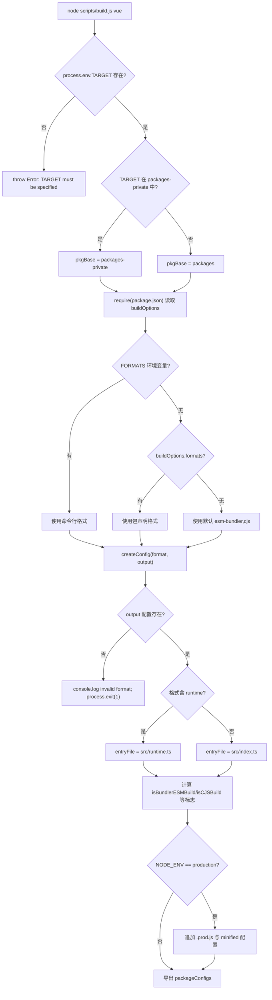

# Глава 1: Макроуровневое понимание: философия инженерного проектирования репозитория core

Прежде чем начать отслеживать любую строку реализации реактивности или виртуального DOM, нам сначала нужно понять инженерную основу, на которой существует этот код. Открыв репозиторий Vue core, первое, что бросается в глаза, — вовсе не核心 логика фреймворка, а`package.json`и`pnpm-workspace.yaml`— такие конфигурационные файлы проекта, которые не содержат никакой функциональности времени выполнения, но определяют, может ли весь фреймворк быть корректно собран, протестирован и опубликован. Именно на этот предварительный вопрос и отвечает данная глава: что такое репозиторий core. Это не`@vue/runtime-core`тот npm-пакет, а инженерная основа, несущая`runtime-core`、`reactivity`、`compiler-sfc`и ещё более десяти публично публикуемых пакетов, плюс`sfc-playground`、`template-explorer`и другие приватные экспериментальные пакеты. Понимание способа организации этой основы является предпосылкой для всех последующих глав (сборка, типы, релиз, бюджет размера). Данная глава будет разворачиваться по трём основным линиям: двойная структура каталогов workspace, унифицированные ограничения корневого TypeScript и Rollup, а также философия развязки «репозитория исходного кода» и «публикуемых артефактов».

# I. Двойная структура каталогов: физическая изоляция packages и packages-private

## Интуитивная модель

Представьте репозиторий core как здание для исследований и разработки.`packages/`— это официальная продуктовая линейка, произведённые продукты должны быть промаркированы и проданы на рынке;`packages-private/`— это внутренняя лаборатория, образцы в которой используются только для отладки и демонстрации и никогда не отправляются наружу. Оба используют одну и ту же систему водоснабжения и электричества (зависимости, инструменты сборки), но система контроля доступа (процесс релиза) относится к ним по-разному.

Без этого слоя физической изоляции внутренний отладочный playground-пакет легко может быть ошибочно опубликован в npm — это не гипотеза, а классический инцидент monorepo.

## Структуры данных и компоновка в памяти

Границы workspace определяются`pnpm-workspace.yaml`. В нём всего три строки действующих объявлений:

[FACT:pnpm-workspace.yaml:1-3]

```yaml
packages:
  - 'packages/*'
  - 'packages-private/*'
```

Эти два glob-шаблона сообщают pnpm:`packages/`и`packages-private/`каждый подкаталог является независимым пакетом. pnpm создаст для них символические ссылки, чтобы`@vue/runtime-core`при ссылке на`@vue/reactivity`указывал напрямую на локальный каталог исходного кода, а не скачивал из registry.

Следующий за этим раздел`catalog:`— это механизм pnpm**каталога версий зависимостей**:

[FACT:pnpm-workspace.yaml:5-13]

```yaml
catalog:
  '@babel/parser': ^7.29.8
  '@babel/types': ^7.29.8
  'entities': '^7.0.1'
  'estree-walker': ^2.0.2
  'magic-string': ^0.30.21
  'source-map-js': ^1.2.1
  'vite': ^8.3.0
  '@vitejs/plugin-vue': ^6.0.9
```

В корневом`package.json`соответствующая запись — это`"@babel/parser": "catalog:"` [FACT:package.json:65-65]。`catalog:`— это плейсхолдер, который pnpm при установке заменяет на версию, объявленную в разделе catalog. Выгода от этого:`@babel/parser`версия`pnpm-workspace.yaml`поддерживается только в одном месте —

## , все ссылающиеся на неё пакеты автоматически выравниваются, что исключает дрейф версий вида «пакет A использует 7.28, пакет B использует 7.29».`pnpm install`Сценарный Walkthrough: что происходит после

`pnpm install`Предположим, вы выполняете

**в корневом каталоге репозитория. Погрузившись в этот сценарий, проследим шаг за шагом:**Шаг первый: шлюз preinstall.`package.json`pnpm перед установкой запускает`preinstall`скрипт корневого

[FACT:package.json:45-45]

```json
"preinstall": "npx only-allow pnpm"
```

> **[Design Inference & Architectural Trade-offs]**
> `only-allow pnpm`〔Проектные предположения и архитектурные компромиссы〕`catalog:`проверяет, является ли текущий менеджер пакетов pnpm, и если нет — сразу завершается с ошибкой. Наличие этой строки скрипта означает: установка репозитория core через npm или yarn завершится неудачей. Почему необходимо жёстко зафиксировать pnpm? Потому что репозиторий core зависит от символических ссылок workspace и механизма catalog pnpm, workspaces npm не поддерживают`createRequire`синтаксис, а режим PnP yarn изменяет пути разрешения модулей, что приводит к несогласованному поведению

**в скриптах сборки.**Шаг второй: разрешение workspace.`pnpm-workspace.yaml`pnpm читает`packages/*`, сканирует`packages-private/*`и`package.json`, создавая запись пакета для каждого каталога, содержащего

**.**Шаг третий: применение замены catalog.`package.json`В корневом`catalog:`Заполнители заменяются фактическими версиями из раздела catalog, после чего выполняется единая установка.

**Шаг четвёртый: хук postinstall.**После завершения установки срабатывает:

[FACT:package.json:46-46]

```json
"postinstall": "simple-git-hooks"
```

`simple-git-hooks`Считывает корневой`package.json`из`simple-git-hooks`поля, записывает Git-хуки в`.git/hooks/`：

[FACT:package.json:48-51]

```json
"simple-git-hooks": {
  "pre-commit": "pnpm lint-staged && pnpm check",
  "commit-msg": "node scripts/verify-commit.js"
}
```

`pre-commit`Хук перед каждым коммитом запускает lint-staged и проверку типов,`commit-msg`Хук проверяет формат сообщения коммита (Vue использует conventional commits). Обратите внимание на симметрию`preinstall`и`postinstall`: первый стоит на страже (разрешает только pnpm), второй возводит оборону (устанавливает Git-хуки).

## Размышления о дизайне и подводные камни

> **[Design Inference & Architectural Trade-offs]**
> **Почему используются два glob-шаблона вместо одного`packages*/`？**Явное перечисление двух директорий делает семантику «публичного» и «приватного» видимой на уровне конфигурации. Любой новый разработчик, прочитав`pnpm-workspace.yaml`сразу поймёт, что в репозитории есть два типа пакетов. Если бы было написано`packages*/`, эта семантика была бы скрыта.

**`allowBuilds`и безопасность цепочки поставок.**Обратите внимание на этот фрагмент конфигурации:

[FACT:pnpm-workspace.yaml:15-21]

```yaml
allowBuilds:
  '@parcel/watcher': true
  '@swc/core': true
  'esbuild': true
  'puppeteer': true
  'simple-git-hooks': true
  'unrs-resolver': true
```

pnpm по умолчанию запрещает пакетам зависимостей выполнять установочные скрипты (postinstall), поскольку это распространённый вектор атак на цепочку поставок.`allowBuilds`— это белый список: только перечисленным пакетам разрешено запускать скрипты сборки.`@swc/core`、`esbuild`требуется загрузить платформенно-зависимые нативные бинарные файлы,`puppeteer`требуется загрузить Chromium,`simple-git-hooks`требуется записать Git-хуки — всё это легитимные действия на этапе сборки, поэтому они явно разрешены.

**`minimumReleaseAge: 1440`глубинный смысл.**Эта строка конфигурации требует, чтобы новые версии зависимостей были «старше 24 часов» (1440 минут) для возможности установки:

[FACT:pnpm-workspace.yaml:33-33]

```yaml
minimumReleaseAge: 1440
```

> **[Design Inference & Architectural Trade-offs]**
> Это механизм периода охлаждения для защиты от отравления цепочки поставок npm. После того как злоумышленник захватывает пакет и публикует вредоносную версию, обычно в течение нескольких часов её обнаруживают и отзывают. Установка 24-часового периода охлаждения позволяет репозиторию core избежать этого окна. А`minimumReleaseAgeExclude`позволяет делать исключения для определённых патчей безопасности:

[FACT:pnpm-workspace.yaml:36-38]

```yaml
minimumReleaseAgeExclude:
  # Renovate security update: vitest@4.1.11
  - vitest@4.1.11
```

Комментарий явно указывает, что это обновление безопасности, инициированное Renovate, которое должно вступить в силу немедленно, поэтому период охлаждения не применяется.

---

# Два. Корневой tsconfig: единые ограничения типовых границ для всех подпакетов

## Интуитивная модель

Если каждый подпакет поддерживает собственный tsconfig, возникнут трещины вроде «пакет A использует`strict: false`, пакет B использует`strict: true`». Корневой tsconfig — это**конституция**: он устанавливает общие правила типизации для всех подпакетов, подпакеты могут только дополнять его, но не нарушать.

## Структуры данных и размещение в памяти

Корневой`tsconfig.json`из`compilerOptions`— это фундамент всей системы типов репозитория. Выделим несколько ключевых полей:

[FACT:tsconfig.json:5-29]

```json
"target": "es2016",
"module": "esnext",
"moduleResolution": "bundler",
"strict": true,
"noUnusedLocals": true,
"isolatedModules": true,
"isolatedDeclarations": true,
"composite": true,
"paths": {
  "@vue/compat": ["./packages/vue-compat/src"],
  "@vue/*": ["./packages/*/src"],
  "vue": ["./packages/vue/src"]
}
```

Построчная расшифровка:

- `target: es2016`: выходной синтаксис понижается до ES2016. Это перекликается с`target`esbuild в конфигурации Rollup (`isServerRenderer || isCJSBuild ? 'es2019' : 'es2016'` [FACT:rollup.config.js:337-337]）。
- `moduleResolution: bundler`: используется стиль разрешения модулей, характерный для сборщиков, допускается опускание расширений, поддерживается поле`exports`.
- `strict: true`: включаются все строгие проверки, включая`strictNullChecks`、`noImplicitAny`и другие.
- `noUnusedLocals: true`: неиспользуемые локальные переменные вызывают ошибку. Это правило имеет практический смысл в сочетании с Tree-shaking — неиспользуемые переменные часто являются сигналом мёртвого кода.
- `isolatedModules: true`: требуется, чтобы каждый файл мог транслироваться независимо. Это предпосылка для таких инструментов, как esbuild/swc, которые «транслируют пофайлово и не выполняют межфайловый анализ типов».
- `isolatedDeclarations: true`: требуется, чтобы все экспорты имели явную аннотацию типа. Это правило напрямую обслуживает конвейер генерации`.d.ts`— только явная аннотация позволяет`tsc`быстро генерировать файлы деклараций без полного вывода типов.
- `composite: true`: включаются метаданные инкрементальной сборки, необходимые для ссылок на проекты (project references).

`paths`Поле — это**зеркало уровня типов**：`@vue/*`рабочей области, отображаемое на`./packages/*/src`, позволяя TypeScript во время компиляции напрямую разрешать исходный код, а не симлинки в`node_modules`. Это дополняет симлинки pnpm во время выполнения — во время выполнения полагаемся на pnpm, во время компиляции на paths.

## Сценарный Walkthrough: одна проверка типов`pnpm check`

`check`Скрипт — это`tsc --incremental --noEmit` [FACT:package.json:15-15]. Подставим этот сценарий:

**Шаг первый: чтение диапазона include.**tsconfig`include`определяет, какие файлы участвуют в проверке:

[FACT:tsconfig.json:31-39]

```json
"include": [
  "packages/global.d.ts",
  "packages/*/src",
  "packages/*/__tests__",
  "packages/vue/jsx-runtime",
  "packages/runtime-dom/types/jsx.d.ts",
  "scripts/*",
  "rollup.*.js"
]
```

Обратите внимание, что`scripts/*`и`rollup.*.js`также входят в область проверки. Это означает, что сами скрипты сборки также подчиняются типовым ограничениям —`rollup.config.js`в верхней части`// @ts-check` [FACT:rollup.config.js:1-1]в сочетании с аннотациями типов JSDoc позволяет этому чисто JS-файлу также проверяться`tsc`.

**Шаг второй: применение exclude.**

[FACT:tsconfig.json:40-40]

```json
"exclude": ["packages-private/sfc-playground/src/vue-dev-proxy*"]
```

> **[Design Inference & Architectural Trade-offs]**
> `sfc-playground`В`vue-dev-proxy`файлы

**исключены. Почему? Такие файлы обычно являются динамически генерируемым во время выполнения прокси-кодом, форма их типов нестабильна, и включение их в проверку создаёт шум.** `--incremental`Шаг третий: инкрементальная проверка.`tsc`Позволяет`.tsbuildinfo`кэшировать результаты предыдущей проверки в`--noEmit`, повторно проверяя только изменённые файлы.

## Означает только проверку без вывода — проверка типов и генерация артефактов — это два независимых конвейера.

**`isolatedDeclarations`Размышления о дизайне и подводные камни**Цена и выгода`export function foo(): number`. После включения этого правила любой экспорт должен иметь явную аннотацию возвращаемого типа, например`export function foo() { return 1 }`вместо`.d.ts`. Это увеличивает затраты на написание, но взамен даёт значительное ускорение генерации`tsc`—`build-dts`может создавать файлы деклараций без межфайлового вывода. Это перекликается с флагом`tsc -p tsconfig.build.json --noCheck`в скрипте`--noCheck`: поскольку типы уже явно аннотированы, при генерации файлов деклараций можно даже пропустить проверку.

**`types`Глобальная инъекция поля**

[FACT:tsconfig.json:21-21]

```json
"types": ["vitest/globals", "puppeteer", "node"]
```

Копировать`describe`、`it`、`expect`Эти три пакета типов внедряются глобально, что означает, что тестовые файлы могут напрямую использовать`puppeteer`без импорта, а e2e-тесты могут напрямую использовать типы

---

# III. Конфигурация Rollup: от buildOptions до унифицированной фабрики мультиформатных артефактов

## Интуитивная модель

Конфигурация Rollup — это в репозитории core**сборочный цех**. Ему не важно, чем занимается конкретный пакет, важно лишь «какие форматы должен производить этот пакет, где находятся входные файлы для каждого формата, какие зависимости должны быть внешними». Поле`package.json`в`buildOptions`каждого подпакета — это накладная, приклеенная к посылке, и сборочный цех работает по этой накладной.

## Структуры данных и размещение в памяти

Уже на входе в конфигурационный файл устанавливается модель «сборка по пакетам»:

[FACT:rollup.config.js:32-44]

```js
if (!process.env.TARGET) {
  throw new Error('TARGET package must be specified via --environment flag.')
}
...
const privatePackages = fs.readdirSync('packages-private')
const pkgBase = privatePackages.includes(process.env.TARGET)
  ? `packages-private`
  : `packages`
const packagesDir = path.resolve(__dirname, pkgBase)
const packageDir = path.resolve(packagesDir, process.env.TARGET)
...
const pkg = require(resolve(`package.json`))
const packageOptions = pkg.buildOptions || {}
const name = packageOptions.filename || path.basename(packageDir)
```

Ключевые решения:`TARGET`Переменная окружения указывает, какой пакет собирать. Конфигурация через`fs.readdirSync('packages-private')`определяет, принадлежит ли пакет к публичной или приватной директории, и тем самым решает`pkgBase`. Это**обнаружение директории во время выполнения**— не нужно поддерживать список «какие пакеты приватные», сама структура директорий является истиной.

`buildOptions`— это пользовательское поле в`package.json`подпакета,`packageOptions.filename`определяет префикс имени файла артефакта,`packageOptions.formats`определяет формат сборки по умолчанию.

Отображение форматов в артефакты определяется`outputConfigs`:

[FACT:rollup.config.js:58-88]

```js
const outputConfigs = {
  'esm-bundler': { file: resolve(`dist/${name}.esm-bundler.js`), format: 'es' },
  'esm-browser': { file: resolve(`dist/${name}.esm-browser.js`), format: 'es' },
  cjs:           { file: resolve(`dist/${name}.cjs.js`),         format: 'cjs' },
  global:        { file: resolve(`dist/${name}.global.js`),      format: 'iife' },
  'esm-bundler-runtime': { file: resolve(`dist/${name}.runtime.esm-bundler.js`), format: 'es' },
  'esm-browser-runtime': { file: resolve(`dist/${name}.runtime.esm-browser.js`), format: 'es' },
  'global-runtime':      { file: resolve(`dist/${name}.runtime.global.js`),      format: 'iife' },
}
```

Семь форматов охватывают три сценария потребления:`esm-bundler`для потребителей вроде Vite/webpack,`esm-browser`для нативного ESM в браузере,`global`для тега`<script>`. С суффиксом`-runtime`— это сборка «только runtime», доступная только для основного пакета`vue`.

## Сценарно-ориентированный Walkthrough: полный поток решений при`pnpm build vue`

Подставим выполнение`node scripts/build.js vue`.`TARGET=vue`, проследим решения внутри`createConfig`:

**Шаг первый: определение списка форматов.**

[FACT:rollup.config.js:91-92]

```js
const defaultFormats = ['esm-bundler', 'cjs']
const inlineFormats = process.env.FORMATS && process.env.FORMATS.split(',')
const packageFormats = inlineFormats || packageOptions.formats || defaultFormats
const packageConfigs = process.env.PROD_ONLY
  ? []
  : packageFormats.map(format => createConfig(format, outputConfigs[format]))
```

Приоритет: командная строка`FORMATS`> подпакет`buildOptions.formats`> значение по умолчанию`['esm-bundler', 'cjs']`。`PROD_ONLY`Если переменная окружения истинна, то непроизводственные сборки пропускаются, остаются только добавляемые позже конфигурации`.prod.js`.

**Шаг второй: вычисление флагов сборки.** `createConfig`Внутри по строке формата выводится набор булевых флагов:

[FACT:rollup.config.js:131-142]

```js
const isProductionBuild = process.env.__DEV__ === 'false' || /\.prod\.js$/.test(output.file)
const isBundlerESMBuild = /esm-bundler/.test(format)
const isBrowserESMBuild = /esm-browser/.test(format)
const isServerRenderer = name === 'server-renderer'
const isCJSBuild = format === 'cjs'
const isGlobalBuild = /global/.test(format)
const isCompatPackage = pkg.name === '@vue/compat'
const isCompatBuild = !!packageOptions.compat
const isBrowserBuild =
  (isGlobalBuild || isBrowserESMBuild || isBundlerESMBuild) &&
  !packageOptions.enableNonBrowserBranches
```

Эти флаги —**единый источник истины**для всех последующих решений: выбор входного файла, замена define, определение external, сборка плагинов — всё зависит от них.

**Шаг третий: выбор входного файла.**

[FACT:rollup.config.js:159-168]

```js
let entryFile = /runtime$/.test(format) ? `src/runtime.ts` : `src/index.ts`

if (isCompatPackage && (isBrowserESMBuild || isBundlerESMBuild)) {
  entryFile = /runtime$/.test(format)
    ? `src/esm-runtime.ts`
    : `src/esm-index.ts`
}
```

Входной файл по умолчанию —`src/index.ts`, для сборки «только runtime» используется`src/runtime.ts`. Пакет compat (`@vue/compat`, то есть сборка, совместимая с Vue 2) должен предоставлять одновременно default и named экспорты, что заставляет Rollup выдавать ошибку для не-ESM целей, поэтому для сборки ESM отдельно используется вход`esm-index.ts` / `esm-runtime.ts`.

**Шаг четвёртый: генерация таблицы замен define.** `resolveDefine`Заменяет в исходном коде такие константы времени компиляции, как`__DEV__`、`__BROWSER__`, на литералы:

[FACT:rollup.config.js:170-201]

```js
const replacements = {
  __COMMIT__: `"${process.env.COMMIT}"`,
  __VERSION__: `"${masterVersion}"`,
  __TEST__: `false`,
  __BROWSER__: String(isBrowserBuild),
  __GLOBAL__: String(isGlobalBuild),
  __ESM_BUNDLER__: String(isBundlerESMBuild),
  __ESM_BROWSER__: String(isBrowserESMBuild),
  __CJS__: String(isCJSBuild),
  __SSR__: String(!isGlobalBuild),
  __COMPAT__: String(isCompatBuild),
  __FEATURE_SUSPENSE__: `true`,
  __FEATURE_OPTIONS_API__: isBundlerESMBuild ? `__VUE_OPTIONS_API__` : `true`,
  __FEATURE_PROD_DEVTOOLS__: isBundlerESMBuild ? `__VUE_PROD_DEVTOOLS__` : `false`,
  __FEATURE_PROD_HYDRATION_MISMATCH_DETAILS__: isBundlerESMBuild ? `__VUE_PROD_HYDRATION_MISMATCH_DETAILS__` : `false`,
}
```

Здесь есть тонкое разделение на слои:**feature flags в сборке esm-bundler не хардкодятся, а сохраняются как идентификаторы вроде`__VUE_OPTIONS_API__`**, и замену выполняет сборщик конечного пользователя. Так пользователь может через`define: { __VUE_OPTIONS_API__: false }`отключить поддержку Options API и тем самым Tree-shake соответствующий код. А в сборках global/esm-browser эти флаги хардкодятся в`true`/`false`, потому что артефакты, потребляемые браузером напрямую, не проходят через сборщик.

**Шаг пятый: разрешение переопределения через переменные окружения.**

[FACT:rollup.config.js:208-216]

```js
// allow inline overrides like
//__RUNTIME_COMPILE__=true pnpm build runtime-core
Object.keys(replacements).forEach(key => {
  if (key in process.env) {
    const value = process.env[key]
    assert(typeof value === 'string')
    replacements[key] = value
  }
})
```

Любой ключ define можно переопределить одноимённой переменной окружения. В комментарии приведён пример`__RUNTIME_COMPILE__=true pnpm build runtime-core`— для отладки конкретной ветки компиляции.

**Шаг шестой: сборка цепочки плагинов.**

[FACT:rollup.config.js:324-342]

```js
plugins: [
  json({ namedExports: false }),
  alias({ entries }),
  enumPlugin,
  ...resolveReplace(),
  esbuild({
    tsconfig: path.resolve(__dirname, 'tsconfig.json'),
    sourceMap: output.sourcemap,
    minify: false,
    target: isServerRenderer || isCJSBuild ? 'es2019' : 'es2016',
    define: resolveDefine(),
  }),
  ...resolveNodePlugins(),
  ...plugins,
],
```

Порядок плагинов имеет значение:`json`сначала обрабатывает импорты JSON,`alias`сопоставляет`@vue/*`с путями исходников,`enumPlugin`выполняет инлайнинг перечислений,`replace`выполняет замену строк,`esbuild`выполняет транспиляцию TS. Обратите внимание, что`esbuild`в`tsconfig`указывает на корневой tsconfig —**все подпакеты используют одну и ту же конфигурацию типов**, и это как раз проявление «конституции», обсуждавшейся во втором разделе, на этапе сборки.

**Шаг седьмой: добавление производственной сборки.**Если`NODE_ENV=production`：

[FACT:rollup.config.js:97-114]

```js
if (process.env.NODE_ENV === 'production') {
  packageFormats.forEach(format => {
    if (packageOptions.prod === false) {
      return
    }
    if (format === 'cjs') {
      packageConfigs.push(createProductionConfig(format))
    }
    if (/^(global|esm-browser)(-runtime)?/.test(format)) {
      packageConfigs.push(createMinifiedConfig(format))
    }
  })
}
```

Для формата CJS добавляется версия`.prod.js`(с заменой`__DEV__=false`), для форматов global и esm-browser добавляется минифицированная версия (минификация через swc).`packageOptions.prod === false`Пакеты

могут отказаться от этого механизма.



## Копировать

**`external`Размышления о дизайне и подводные камни** `resolveExternal`Стратегия из трёх ветвей.

[FACT:rollup.config.js:257-283]

```js
function resolveExternal() {
  const treeShakenDeps = ['source-map-js', '@babel/parser', 'estree-walker', 'entities/decode']

  if (isGlobalBuild || isBrowserESMBuild || isCompatPackage) {
    if (!packageOptions.enableNonBrowserBranches) {
      return treeShakenDeps
    }
  } else {
    return [
      ...Object.keys(pkg.dependencies || {}),
      ...Object.keys(pkg.peerDependencies || {}),
      ...['path', 'url', 'stream'],
      ...treeShakenDeps,
    ]
  }
}
```

Копировать`treeShakenDeps`Браузерные сборки (global/esm-browser) инлайнят все зависимости и указывают как external только`dependencies`, чтобы подавить предупреждения — эти зависимости в браузерной ветке фактически не используются и будут удалены Tree-shaking. Сборки Node/esm-bundler делают внешними все`peerDependencies`и

**`onwarn`, позволяя потребителю самому управлять версиями зависимостей.**

[FACT:rollup.config.js:344-348]

```js
onwarn: (msg, warn) => {
  if (msg.code !== 'CIRCULAR_DEPENDENCY') {
    warn(msg)
  }
},
```

Копировать`runtime-core`Предупреждения о циклических зависимостях заглушаются. Между`reactivity`и

**`treeshake.moduleSideEffects: false`в Vue существуют легальные циклические ссылки (системе реактивности нужно ссылаться на тип экземпляра компонента), эти циклы безопасны во время выполнения, поэтому они фильтруются.**

[FACT:rollup.config.js:355-355]

```js
treeshake: {
  moduleSideEffects: false,
},
```

Копировать**Это говорит Rollup: все модули не имеют побочных эффектов, неиспользуемые импорты можно смело удалять. Это**агрессивное допущение

**— если какой-то модуль на верхнем уровне выполняет код с побочными эффектами (например, регистрирует глобальную переменную), он может быть ошибочно удалён. Исходный код Vue по соглашению гарантирует, что все модули чистые, поэтому эту оптимизацию можно включать.`pure_getters`Ловушка**

[FACT:rollup.config.js:373-388]

```js
async renderChunk(contents, _, { format }) {
  const { code } = await minifySwc(contents, {
    module: format === 'es',
    format: { comments: false },
    compress: { ecma: 2016, pure_getters: true },
    safari10: true,
    mangle: true,
  })
  return { code: banner + code, map: null }
}
```

`pure_getters: true`Копировать`obj.foo`говорит минификатору, что «обращение к свойству не имеет побочных эффектов», и неиспользуемые вызовы геттеров можно безопасно удалять. Для реактивного кода Vue это опасно —`track()`) а не через неявный побочный эффект getter, поэтому это безопасно.`map: null`означает, что sourcemap не генерируется после сжатия — производственным артефактам не нужны отладочные карты.

---

# Проектное размышление: почему репозиторий исходного кода и публикуемые артефакты должны быть развязаны

Вернёмся к ключевому тезису этой главы. В инженерном проектировании репозитория core есть одна сквозная линия:**Задача репозитория исходного кода — «производство», задача публикуемых артефактов — «потребление», и эти две стороны развязываются через конвейер сборки**。

Конкретно это проявляется на трёх уровнях:

**Во-первых, исходный код не публикуется напрямую.** `package.json`в`private: true` [FACT:package.json:2-2]указывает, что корневой пакет никогда не публикуется. В каждом подпакете`package.json`поле`main`/`module`/`exports`указывает на артефакты в`dist/`, а не на`src/`. Когда пользователь устанавливает`vue`, он получает собранные`.js`и`.d.ts`, а исходный код остаётся в репозитории.

**Во-вторых, формат артефактов определяется сценарием потребления.**Семь форматов перечислены не произвольно, а соответствуют семи реальным путям потребления: пользователи Vite получают`esm-bundler`, пользователи CDN получают`global`, пользователи Node SSR получают`cjs`. Логика выбора формата сосредоточена в`rollup.config.js`в одном месте, подпакетам достаточно объявить в`buildOptions.formats`, какие из них нужны.

**В-третьих, типы отделены от реализации.** `build-dts`Скрипт`tsc -p tsconfig.build.json --noCheck && rollup -c rollup.dts.config.js` [FACT:package.json:9-9]показывает, что`.d.ts`генерируется отдельным конвейером.`isolatedDeclarations: true`позволяет генерации файлов деклараций пропускать проверку типов (`--noCheck`), поскольку типы уже явно аннотированы.

> **[Design Inference & Architectural Trade-offs]**
> Глубинная мотивация такой развязки такова:**Способ организации исходного кода служит разработчикам, способ организации артефактов служит потребителям, и оптимальные решения для этих двух сторон различаются**. Исходному коду нужна чёткая структура каталогов, полная информация о типах, отлаживаемые sourcemap; артефактам нужен минимальный размер, правильный формат модулей, стабильная поверхность API. Насильственное объединение обоих (например, прямая публикация исходников TS) навредит опыту обеих сторон одновременно.

---

# Резюме главы

Эта глава сформировала макроскопическое понимание репозитория core по трём измерениям:

1. **Двухкаталожная структура**：`packages/`и`packages-private/`физически изолированы, а в сочетании с симлинками pnpm workspace и каталогом версий catalog достигается чёткая граница между «публичными пакетами» и «приватными пакетами».`preinstall`шлюз,`allowBuilds`белый список,`minimumReleaseAge`период охлаждения совместно образуют линию защиты цепочки поставок.

2. **Корневой tsconfig**: как типовая конституция для всех подпакетов, через`paths`маппинг реализует разрешение workspace на этапе компиляции, через`isolatedDeclarations`и`composite`поддерживает инкрементальную сборку и быструю генерацию файлов деклараций.

3. **Унифицированная фабрика Rollup**: с`TARGET`переменной окружения в качестве входа, через`buildOptions`читает метаинформацию подпакетов, через набор булевых флагов управляет выбором входных точек, заменой define, определением external и сборкой плагинов, в итоге производя артефакты семи форматов.

Ключевая философия —**развязка репозитория исходного кода и публикуемых артефактов**: репозиторий отвечает за производство, артефакты отвечают за потребление, конвейер сборки — единственный мост между ними.

---

# Переход к следующей главе

Эта глава ответила на вопрос «что такое репозиторий core». Но статическая структура репозитория — лишь сцена, настоящая драма разворачивается в процессе выполнения одного запроса на сборку:`scripts/build.js`как разбираются аргументы командной строки, как вызывается Rollup API, как обрабатываются сбои сборки и параллелизм. Следующая глава проследит сквозной путь одного запроса на сборку от входа до артефакта, превратив статическое понимание, построенное в этой главе, в динамическое представление выполнения.

# Вопросы для размышления и самопроверки к этой главе

Q1: Если в`pnpm-workspace.yaml`изменить`minimumReleaseAge: 1440`на`0`, какие риски это создаст в сценарии обновления зависимостей? Почему`minimumReleaseAgeExclude`необходимо?

**Справочный разбор**：

`minimumReleaseAge: 1440` [FACT:pnpm-workspace.yaml:33-33]требует, чтобы вновь опубликованная версия зависимости была доступна для установки только спустя 24 часа. Если изменить на`0`, то любая только что опубликованная версия может быть немедленно подтянута.

Сценарий риска: злоумышленник захватывает какую-либо транзитивную зависимость (например,`@babel/parser`какой-то patch-версии) и публикует версию с вредоносным postinstall-скриптом. В течение 24-часового периода охлаждения сообщество обычно обнаруживает проблему и отзывает эту версию; если период охлаждения равен 0, CI репозитория core может автоматически обновиться и выполнить вредоносный скрипт в окне атаки.

`minimumReleaseAgeExclude` [FACT:pnpm-workspace.yaml:36-38]существует потому, что механизм периода охлаждения конфликтует со срочностью security-патчей. В комментарии`vitest@4.1.11`— это обновление безопасности, обнаруженное Renovate; такие обновления должны вступать в силу немедленно, а ожидание 24 часов лишь продлевает окно экспозиции. Поэтому нужен явный список исключений, позволяющий обновлениям безопасности обходить период охлаждения. Это отражает принцип безопасного проектирования «по умолчанию консервативно, исключения явны».

Q2: `rollup.config.js`В`resolveDefine`обработка`__FEATURE_OPTIONS_API__`— это`isBundlerESMBuild ? '__VUE_OPTIONS_API__' : 'true'`. Если ошибочно изменить так, чтобы для всех форматов возвращалось`'true'`, какое влияние это окажет на конечных пользователей?

**Справочный разбор**：

[FACT:rollup.config.js:192-194]

```js
__FEATURE_OPTIONS_API__: isBundlerESMBuild
  ? `__VUE_OPTIONS_API__`
  : `true`,
```

В сборке esm-bundler`__FEATURE_OPTIONS_API__`сохраняется как идентификатор`__VUE_OPTIONS_API__`и передаётся бандлеру конечного пользователя для замены. Пользователь может в своей конфигурации сборки задать`define: { __VUE_OPTIONS_API__: false }`, чтобы Tree-shaking удалил весь код, связанный с Options API (обработку таких опций, как`data`、`methods`、`computed`), значительно уменьшив размер артефакта.

Если изменить так, чтобы для всех форматов возвращалось`'true'`, то код Options API в артефакте esm-bundler будет жёстко зафиксирован, конфигурация`define`пользователя перестанет работать, и Tree-shake станет невозможен. Для проекта, использующего только Composition API, это напрасно увеличит размер артефакта на несколько КБ.

Ключевое озарение этого дизайна:**окончательная форма артефакта esm-bundler определяется бандлером пользователя, поэтому feature flag должен разрешаться только на этапе сборки у пользователя**. А артефакты global/esm-browser выполняются непосредственно в браузере, без участия бандлера, поэтому должны быть жёстко закодированы.

Q3: `rollup.config.js`的`resolveExternal`中，браузерная сборка возвращает только`treeShakenDeps`作为 external，а Node-сборка возвращает все`dependencies`。Предположим, однажды кто-то добавил в`runtime-core`новую runtime-зависимость`foo-lib`, но забыл обновить`resolveExternal`логику. Что произойдёт в браузерной сборке?

**Справочный разбор**：

[FACT:rollup.config.js:257-283]

Браузерная сборка (`isGlobalBuild || isBrowserESMBuild`) при`!packageOptions.enableNonBrowserBranches`возвращает только`treeShakenDeps`（`source-map-js`、`@babel/parser`、`estree-walker`、`entities/decode`). Это означает, что`foo-lib`отсутствует в списке external,

На этом мы уже с макроуровня увидели общую философию проектирования репозитория core как инженерной основы: структура workspace с двумя каталогами задаёт границу между публичными и приватными экспериментальными пакетами, корневые конфигурации TypeScript и Rollup обеспечивают единые ограничения, а разделение исходного репозитория и публикуемых артефактов делает возможным вывод в нескольких форматах. Эти знания проложили путь для дальнейшего углубления в конкретные инженерные цепочки. В следующей главе мы переведём взгляд со статической структуры на динамический процесс и, начиная с`node scripts/build.js vue`, проследим полный путь одного запроса на сборку — от разбора аргументов командной строки, определения целевого пакета и генерации конфигурации Rollup до записи артефактов на диск, — чтобы увидеть, как build.js через parseArgs разбирает флаги formats/devOnly/release, как динамически require-ит package.json целевого пакета и читает buildOptions и в итоге управляет rollup.config.js, порождая артефакты в нескольких форматах, таких как esm-bundler, cjs, global.
