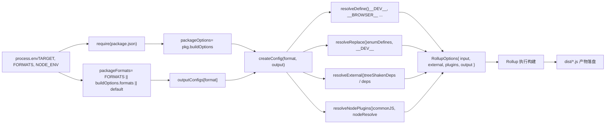

# Глава 2: Жизненный цикл магистрали: сквозной путь одного запроса на сборку

В предыдущей главе мы прояснили позиционирование репозитория core как инженерной основы и то, как pnpm workspace и корневые конфигурации единообразно ограничивают все подпакеты. Теперь мы углубимся в ядро системы сборки и проследим, как одна команда приводит в движение весь процесс сборки.`node scripts/build.js vue`看似简单，却是所有产物——esm-bundler、cjs、global——的唯一入口。Понимание того, как он переводит намерение пользователя в исполняемые задачи сборки, — ключевой шаг к освоению механизма сборки Vue.

# Генерация конфигурации Rollup: от переменных окружения к артефактам в нескольких форматах

`build.js`через`exec`启动 Rollup 后，控制权转移到`rollup.config.js`。Этот файл — «мозг» системы сборки: он читает переменные окружения и динамически генерирует массив объектов конфигурации Rollup.

## Проверка переменных окружения и определение пакета

[FACT:rollup.config.js:27-29]

Если`TARGET`未设置，直接抛错。Это защитное программирование: конфигурация Rollup может быть вызвана напрямую (например,`rollup -c`), и в этом случае`build.js`注入环境变量，必须快速失败。

[FACT:rollup.config.js:32-44]

Здесь повторяется`build.js`中的私有包判断逻辑——因为`rollup.config.js`是独立进程，无法共享`build.js`的内存状态。`resolve`函数把相对路径解析为包目录下的绝对路径，`pkg`是目标包的`package.json`内容，`packageOptions`是其中的`buildOptions`字段，`name`是产物文件名前缀（优先用`buildOptions.filename`，否则用目录名）。

## Таблица сопоставления форматов:`outputConfigs`

[FACT:rollup.config.js:58-88]

Эта таблица определяет сопоставление 7 форматов с конфигурациями вывода. Ключевые наблюдения:

- `esm-bundler`、`esm-browser`、`esm-bundler-runtime`、`esm-browser-runtime`都是`format: 'es'`，区别只在文件名。
- `cjs`是`format: 'cjs'`。
- `global`和`global-runtime`是`format: 'iife'`（немедленно вызываемое функциональное выражение），适合`<script>`标签直接引入。
- `runtime`后缀的格式只对主`vue`包有意义——它们不包含编译器，体积更小。

## Выбор формата: три уровня приоритета

[FACT:rollup.config.js:91-92]

Выбор формата следует трём уровням приоритета: командная строка`FORMATS`环境变量 > 包的`buildOptions.formats`> 默认`['esm-bundler', 'cjs']`。`PROD_ONLY`环境变量控制是否跳过基础配置——если собирать только production-версию, массив базовых конфигураций пуст, и далее добавляются только production-конфигурации.

## Логика добавления production-конфигурации

[FACT:rollup.config.js:97-114]

Когда`NODE_ENV === 'production'`, для каждого формата:

- Если`packageOptions.prod === false`, пропустить (этому пакету не нужна production-версия).
- Если это`cjs`, добавить`createProductionConfig`——生成`.prod.js`文件。
- Если соответствует`/^(global|esm-browser)(-runtime)?/`, добавить`createMinifiedConfig`——生成 сжатую версию.

> **[Design Inference & Architectural Trade-offs]**
> Почему`cjs`用`createProductionConfig`而`global`/`esm-browser`用`createMinifiedConfig`？Потому что CJS предназначен для Node, а среда Node не требует сжатия (пользователь сам с этим справится), но требует различать ветки dev/prod; а артефакты, напрямую подключаемые в браузере, обязательно должны быть сжаты для уменьшения размера. Это различие отражается в реализации двух фабричных функций.

## `createConfig`：ядро генерации конфигурации

`createConfig`是最大的函数，它接收格式和输出配置，返回完整的 Rollup 配置对象。

[FACT:rollup.config.js:125-142]

В начале вычисляется ряд булевых флагов:

- `isProductionBuild`：通过`__DEV__`环境变量或文件名是否含`.prod.js`判断。
- `isBundlerESMBuild`、`isBrowserESMBuild`、`isCJSBuild`、`isGlobalBuild`：通过格式名正则匹配。
- `isServerRenderer`：包名是否为`server-renderer`。
- `isCompatPackage`、`isCompatBuild`：Vue 2 兼容构建相关。
- `isBrowserBuild`：全局构建或浏览器 ESM 构建，且未启用非浏览器分支。

Эти флаги в дальнейшем`resolveDefine`、`resolveReplace`、`resolveExternal`中被反复使用，是配置差异化的核心依据。

[FACT:rollup.config.js:144-157]

Базовые настройки конфигурации вывода: banner с копирайтом、`exports`模式（compat 包用`auto`，其余用`named`）、CJS 构建启用`esModule`互操作、sourcemap 由环境变量控制、`externalLiveBindings: false`和`reexportProtoFromExternal: false`是 Rollup 4 的兼容性设置。Глобальная сборка дополнительно задаёт`output.name`，то есть имя переменной, под которым она монтируется в`window`.

## Выбор входного файла

[FACT:rollup.config.js:159-168]

По умолчанию вход —`src/index.ts`, но`runtime`后缀的格式用`src/runtime.ts`. ESM-сборка пакета compat должна одновременно экспортировать default и named, поэтому используется отдельная`esm-index.ts` / `esm-runtime.ts`точка входа.

## Определения макросов:`resolveDefine`

[FACT:rollup.config.js:170-218]

`resolveDefine`Возвращает таблицу замен, которая в исходном коде`__COMMIT__`、`__VERSION__`、`__BROWSER__`и другие макросы заменяются на литералы. Эти макросы используются в исходном коде для условной компиляции — например,`if (__DEV__) { ... }`в production-сборке заменяется на`if (false) { ... }`, а затем удаляется через Tree-shaking.

Ключевые решения:`__FEATURE_OPTIONS_API__`、`__FEATURE_PROD_DEVTOOLS__`и другие флаги функций в`esm-bundler`сборке сохраняются как`__VUE_OPTIONS_API__`такие идентификаторы, чтобы конечные пользователи могли переопределить их через конфигурацию бандлера; в других сборках они жёстко заданы как`true`или`false`。

[FACT:rollup.config.js:203-206]

не`esm-bundler`сборка жёстко задаёт`__DEV__`, поскольку их ветки dev/prod определяются на этапе сборки.

[FACT:rollup.config.js:210-216]

Последний шаг позволяет переменным окружения переопределять любое определение макроса, поддерживая`__RUNTIME_COMPILE__=true pnpm build runtime-core`такую встроенную замену.

## Плагин замены:`resolveReplace`

[FACT:rollup.config.js:222-255]

`resolveReplace`Обрабатывает вне`resolveDefine`замены, которые esbuild не может обработать:

- Объединяет`enumDefines`(встроенные определения перечислений из`inlineEnums`).
- В production-сборке для браузера добавляет к функциям создания ошибок`/*@__PURE__*/`аннотацию, помогающую Tree-shaking.
- `esm-bundler`В сборке`__DEV__`заменяется на`!!(process.env.NODE_ENV !== 'production')`, позволяя бандлеру решить.
- В ESM-сборке для браузера`process.env`заменяется на пустой объект, чтобы избежать ошибок в браузере.

## Внешние зависимости:`resolveExternal`

[FACT:rollup.config.js:257-283]

Это ядро вопроса для размышления в конце предыдущей главы. Сборка для браузера возвращает только`treeShakenDeps`как external — эти зависимости хотя и импортируются, но в ветке для браузера фактически не выполняются; они перечислены здесь только для подавления предупреждений Rollup. Сборки Node/ESM-bundler выносят все`dependencies`и`peerDependencies`, а также`path`、`url`、`stream`и другие встроенные модули Node.

## Итоговый объект конфигурации

[FACT:rollup.config.js:319-352]

Возвращаемый объект конфигурации содержит:

- `input`: абсолютный путь к входному файлу.
- `external`: список внешних зависимостей.
- `plugins`: массив плагинов в порядке json → alias → enumPlugin → replace → esbuild → nodePlugins.
- `output`: конфигурация вывода.
- `onwarn`: отфильтровывает`CIRCULAR_DEPENDENCY`предупреждения (в исходном коде Vue есть циклические зависимости, но они безвредны во время выполнения).
- `treeshake.moduleSideEffects: false`: сообщает Rollup, что все модули не имеют побочных эффектов, агрессивный Tree-shaking.

На следующей диаграмме показан поток данных от переменных окружения до итоговой конфигурации:

# Запись артефактов на диск и проверка размера

## `exec`Управление процессами

`build.js`через`exec`запускает дочерний процесс Rollup:

[FACT:scripts/utils.js:64-114]

`exec`инкапсулирует`spawn`, возвращая Promise. Ключевые решения:

- `stdio`по умолчанию`['ignore', 'pipe', 'pipe']`— stdin игнорируется, stdout/stderr захватываются через каналы.
- `shell: process.platform === 'win32'`— в Windows требуется shell для корректного разбора команды.
- через`stderrChunks`и`stdoutChunks`массивы собирают вывод, объединяя его в`exit`событии.
- При коде выхода 0 — resolve, иначе reject с содержимым stderr.

> **[Design Inference & Architectural Trade-offs]**
> Обратите внимание:`build.js`при вызове`exec`передаётся`{ stdio: 'inherit' }`, что переопределяет конфигурацию каналов по умолчанию, позволяя выводу Rollup напрямую транслироваться в терминал. Это правильное поведение инструмента сборки — пользователю нужно видеть прогресс сборки в реальном времени.

## Проверка размера:`checkAllSizes`

[FACT:scripts/build.js:206-215]

Проверка размера имеет два условия пропуска:`devOnly`истинно, или указан формат, но не содержит`global`. Поскольку проверка размера применяется только к артефактам глобальной сборки — это файлы, которые конечные пользователи подключают напрямую, и их размер наиболее критичен.

[FACT:scripts/build.js:222-228]

`checkSize`Проверяет два файла:`${target}.global.prod.js`и`${target}.runtime.global.prod.js`(последний проверяется только если формат не указан или указан`global-runtime`).

[FACT:scripts/build.js:235-264]

`checkFileSize`читает файл, использует`gzipSync`и`brotliCompressSync`для вычисления размера после сжатия, использует`prettyBytes`для форматированного вывода. Если`writeSize`истинно, записывает результат в`temp/size/${fileName}.json`— это источник данных для проверки бюджета размера в CI.

## Сборка объявлений типов

[FACT:scripts/build.js:94-108]

Если`buildTypes`истинно, вызывается`pnpm run build-dts`, и через`--environment TARGETS:...`передаётся список целей. Это гарантирует генерацию объявлений типов только для фактически собираемых пакетов.

# Проектные соображения и подводные камни в production

**Почему используется`--environment`вместо прямой передачи аргументов?**Rollup`--environment`— единственный способ передачи аргументов, который можно прочитать в файле конфигурации через`process.env`. Прямая передача`--config`аргументов требует разбора`process.argv`, а`--environment`предоставляет структурированный разбор пар ключ-значение.

**`fuzzyMatchTarget`Ловушка регулярных выражений в** `target.match(partialTarget)`В`partialTarget`— пользовательский ввод. Если пользователь вводит`runtime-core`，`-`, в регулярном выражении это литерал, проблем нет; но если вводится`runtime.core`，`.`, оно будет соответствовать любым символам и может совпасть с неожиданными целями. Это неотъемлемый риск нечёткого сопоставления, но имена пакетов Vue не содержат специальных символов регулярных выражений, так что на практике это не срабатывает.

**Конкуренция за ресурсы при параллельной сборке.** `runParallel`использует`cpus().length`как ограничение параллелизма, но каждый процесс Rollup сам запускает worker'ы. В контейнерах CI с малым числом ядер это может привести к переполнению памяти. В production при возникновении OOM можно смягчить проблему через`--max-old-space-size`или уменьшение числа параллельных задач.

**`scanEnums`Жизненный цикл кэша** `removeCache`вызывается в`finally`, но если`scanEnums`сам выбрасывает ошибку,`removeCache`не будет присвоен, и вызов в`finally`завершится неудачей. Фактически`scanEnums`возвращаемая функция определяется до`try`, так что этого риска не существует — но это деталь порядка выполнения, которую нужно подтвердить при чтении.

**`resolveExternal`Риск пропуска в**Вопрос для размышления из предыдущей главы уже указал: если добавить новую зависимость в`runtime-core`но забыть обновить`resolveExternal`, сборка для браузера включит эту зависимость в бандл (поскольку её нет в списке external), что приведёт к раздуванию размера. Это неотъемлемая цена стратегии «белого списка external».

# Резюме главы

Полный путь одного`node scripts/build.js vue`:

1. `parseArgs`разбирает командную строку,`commit`синхронно получает.

2. `run()`вызывает`scanEnums`для генерации кэша перечислений, разбирает цели (`fuzzyMatchTarget`или`allTargets`）。

3. `buildAll`через`runParallel`параллельно планирует`build`。

4. `build`находит каталог пакета, читает`package.json`, фильтрует приватные пакеты, очищает`dist`, собирает`--environment`аргументы, вызывает`exec`Запуск Rollup.

5. `rollup.config.js`Чтение переменных окружения через`createConfig`Генерация массива конфигураций,`resolveDefine`/`resolveReplace`/`resolveExternal`Отдельная обработка макросов, замен и внешних зависимостей.

6. Rollup выполняет сборку, артефакты записываются на диск в`dist/`。

7. `checkAllSizes`Вычисление размера gzip/brotli, опциональная запись в`temp/size/`。

8. Если`--withTypes`, вызов`build-dts`Генерация объявлений типов.

# Вопросы для размышления и самопроверки в этой главе

Q1: В`build.js`функции`build`из`if (!formats && fs.existsSync(...))`это условие определяет, удалять ли`dist`каталог. Если убрать`!formats`это условие (то есть удалять`dist`независимо от указанного формата), что произойдёт в`pnpm build-all-cjs`таком скрипте?

**Справочный разбор**：

[FACT:scripts/build.js:172-175]

`pnpm build-all-cjs`соответствует`node scripts/build.js vue runtime compiler reactivity shared -af cjs`(см.[FACT:package.json:40]). Оно указывает`-f cjs`, поэтому`formats`равно`'cjs'`，`!formats`ложно, текущая логика не удалит`dist`。

Если убрать`!formats`, каждая сборка будет удалять`dist`. Но`build-all-cjs`собирает только`cjs`формат, после удаления в`dist`останутся только`cjs`артефакты, ранее собранные`esm-bundler`、`global`и другие форматы будут полностью потеряны. Что ещё серьёзнее,`build-runtime-esm`、`build-browser-esm`и другие скрипты выполняются последовательно (см.[FACT:package.json:39]скрипт`build-sfc-playground`), каждый скрипт удаляет артефакты предыдущего, в результате в итоговом`dist`останется только формат последнего скрипта. Это нарушит сборку SFC Playground — ей требуется одновременное наличие артефактов нескольких форматов.

Q2: `runParallel`В`if (maxConcurrency <= source.length)`какова роль условия`targets.length === 1`? Если убрать его, что произойдёт при сборке одного пакета (

**)?**：

[FACT:scripts/build.js:131-151]

Справочный разбор`maxConcurrency > source.length`Это условие управляет включением ограничения параллелизма. Когда`executing`, ограничение не нужно — все задачи могут запускаться одновременно. Если убрать это условие, даже при одной задаче будет создан`await Promise.race(executing)`。

массив и выполнено`executing`Для одной задачи`e`，`Promise.race`содержит только один Promise`executing.splice(executing.indexOf(e), 1)`, который будет ждать его завершения. Это не вызовет ошибки, но добавит ненужную цепочку Promise и накладные расходы на планирование микрозадач. Что важнее,

в сценарии с одной задачей всё равно работает корректно, так что функционально разницы нет, только небольшое снижение производительности.`maxConcurrency`Настоящий риск в том, что если`cpus().length`равно 0 (теоретически невозможно, так как`executing.length >= 0`минимум 1),`Promise.race([])`всегда истинно,`cpus().length`будет вечно висеть. Но

Q3: `resolveExternal`гарантирует, что эта граница не сработает.`treeShakenDeps`В

**браузерная сборка возвращает**：

[FACT:rollup.config.js:257-283]

`treeShakenDeps`как external, но эти зависимости в браузерной ветке фактически не выполняются. Что произойдёт, если убрать их из списка external (то есть позволить Rollup попытаться упаковать их)?`source-map-js`、`@babel/parser`、`estree-walker`、`entities/decode`Справочный разбор`compiler-sfc`содержит`__BROWSER__`. Это зависимости таких пакетов, как

, в браузерной сборке они исключаются условной компиляцией через`treeshake.moduleSideEffects: false`（[FACT:rollup.config.js:355-355]макрос.`if (!__BROWSER__)`Если убрать из external, Rollup попытается разрешить и упаковать эти зависимости. Поскольку`__BROWSER__`), и операторы импорта этих зависимостей находятся в`true`ветке, define от esbuild заменит

на`onwarn`, что пометит ветку как мёртвый код. Tree-shaking в Rollup удалит эти импорты, и в итоговом артефакте не будет кода этих зависимостей.

Но проблема в том, что Rollup перед Tree-shaking должен сначала разрешить модули. Если эти зависимости не установлены (например, в минималистичном CI-окружении), Rollup выдаст ошибку «не удалось разрешить модуль». Указание их как external — это защитная мера: даже если зависимости отсутствуют, Rollup не будет пытаться их разрешить, а лишь выдаст предупреждение (а`scripts/dev.js`отфильтрует предупреждения о нециклических зависимостях).
