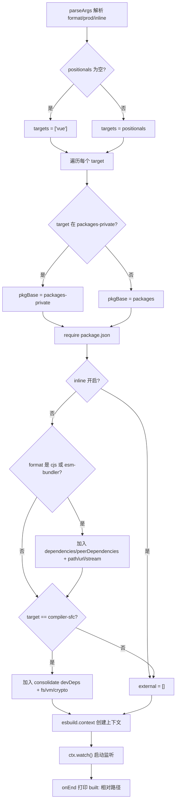
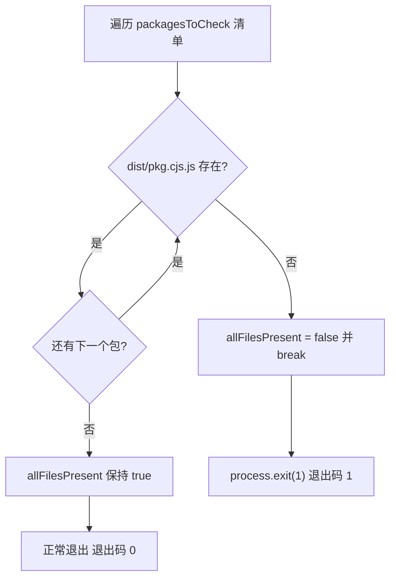
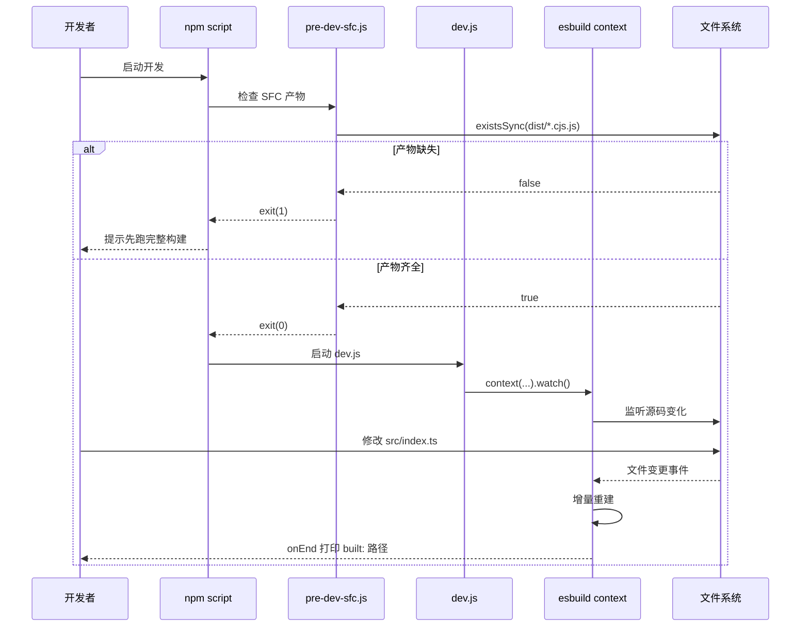

# Наверх ↑

Прогресс книги: Глава 3 / 14`scripts/dev.js`Статус проверки: FACT — номера строк реально привязаны`scripts/pre-dev-sfc.js`В предыдущей главе мы проследили полный путь производственной сборки от разбора аргументов до записи артефактов в нескольких форматах; тот путь нацелен на полноту и соответствие стандартам артефактов. А основное требование режима разработки только одно: изменить строку кода — и сразу увидеть эффект в браузере. Цепочка производственной сборки «разбор аргументов → генерация конфигурации → полная упаковка → запись на диск» занимает десятки секунд и совершенно не удовлетворяет этому требованию. Репозиторий Vue core поддерживает для этого отдельную цепочку в режиме разработки:

# использует режим watch esbuild для инкрементальной сборки,

## предварительно компилирует компилятор SFC перед основной сборкой. В этой главе разбирается механизм взаимодействия этих двух компонентов.

3.1 dev.js: инкрементальный сборщик, меняющий скорость на esbuild[FACT:scripts/dev.js:3-5]

Интуитивная модель

## Производственная сборка похожа на «официальный набор и печать в типографии» — качество в приоритете, можно и помедленнее; сборка для разработки похожа на «карандашный набросок на черновике» — не нужна красота, нужно мгновенное появление. Vue выбирает esbuild, а не Rollup, для этого наброска, и причина написана в комментарии в начале файла: артефакты Rollup меньше, Tree-shaking лучше, но esbuild намного быстрее.

Без этого скрипта разработчику при каждом изменении пришлось бы запускать полную производственную сборку, цикл обратной связи деградировал бы с миллисекунд до минут, а опыт горячей замены был бы полностью утрачен.`parseArgs`Разбор аргументов и вывод форматов`format`Точка входа скрипта использует встроенный в Node`global`）、`prod`для разбора трёх опций:`false`）、`inline`(по умолчанию`false`）。[FACT:scripts/dev.js:18-40]позиционные аргументы собираются в`targets`, если пусто, то по умолчанию`['vue']`。[FACT:scripts/dev.js:42-53]

> **[Design Inference & Architectural Trade-offs]**
> Здесь есть легко упускаемая деталь:`rawFormat`и`format`— это два присваивания.`parseArgs`в`default: 'global'`уже гарантирует, что`rawFormat`имеет значение, но скрипт всё равно пишет`const format = rawFormat || 'global'`как запасной вариант.[FACT:scripts/dev.js:42]Это защитное написание, позволяющее избежать`parseArgs`ошибок в downstream`format.startsWith`при изменении поведения или явной передаче пустой строки.

`format`Сопоставление с форматом вывода esbuild — это трёхветвевое ветвление: начинается с`global`сопоставляется с`iife`, равно`cjs`сопоставляется с`cjs`, всё остальное —`esm`。[FACT:scripts/dev.js:42-53]Суффикс имени файла артефакта обрабатывается отдельно суффиксом`-runtime`:`global-runtime`превращается в`runtime.global`, остальные остаются без изменений.[FACT:scripts/dev.js:42-53]

## Определение целевого пакета и путь вывода

Скрипт сначала читает список каталогов`packages-private`, чтобы определить, принадлежит ли целевой пакет к публичным или приватным пакетам.[FACT:scripts/dev.js:56]Для каждого target определяется, является ли базовый путь пакета`packages`или`packages-private`, затем`require`его`package.json`для получения`version`и`buildOptions`。[FACT:scripts/dev.js:58-63]

Есть особый случай с именем выходного файла:`vue-compat`цель будет переименована в`vue`, чтобы избежать артефакта с именем`vue-compat.global.js`。[FACT:scripts/dev.js:64-69]Итоговый путь имеет вид`packages/vue/dist/vue.global.js`，`prod`при значении true вставляется сегмент`prod.`.

## Разрешение external: избегание упаковки зависимостей в артефакт

`external`Массив определяет, какие модули не упаковываются. Логика разделена на два уровня:

Первый уровень: когда`inline`не включён и формат`cjs`или содержит`esm-bundler`, все ключи`dependencies`、`peerDependencies`добавляются в external, и жёстко кодируются`path`、`url`、`stream`три встроенных модуля Node.[FACT:scripts/dev.js:76-88]Комментарий явно указывает, что эти три предназначены для`@vue/compiler-sfc`и`server-renderer`.

Второй уровень: для цели`compiler-sfc`дополнительно разрешается`@vue/consolidate`из`devDependencies`, они, а также`fs`、`vm`、`crypto`и другие, помечаются как external.[FACT:scripts/dev.js:90-112]В коде также жёстко закодированы пути к шаблонизаторам, таким как`react-dom/server`、`teacup/lib/express`、`arc-templates/dist/es5`、`then-pug`、`then-jade`— это шаблонизаторы, поддерживаемые consolidate, они являются опциональными зависимостями и не могут быть принудительно установлены.

> **[Design Inference & Architectural Trade-offs]**
> Эта логика в значительной степени дублирует`rollup.config.js`, что признаётся и в комментариях исходного кода (`TODO this logic is largely duplicated from rollup.config.js`). Причина, по которой не была выделена общая функция, заключается в тонких различиях в стратегии external между dev и prod (dev более агрессивно выносит в external для ускорения сборки), и принудительное объединение, наоборот, увеличило бы связанность.

## Плагины и внедрение define

Массив плагинов по умолчанию содержит только один`log-rebuild`, который в хуке`onEnd`выводит относительный путь артефакта сборки.[FACT:scripts/dev.js:115-124]Это единственный сигнал обратной связи, позволяющий разработчику понять, что «изменения вступили в силу».

> **[Design Inference & Architectural Trade-offs]**
> Второй плагин является условным: когда формат не`cjs`и`buildOptions.enableNonBrowserBranches`пакета истинно, подключается`polyfillNode()`。[FACT:scripts/dev.js:126-128]Такие пакеты (например,`compiler-sfc`) в браузерной сборке всё ещё используют ветку Node и требуют полифилов встроенных модулей Node для работы в браузерной среде.

`define`Блок является наиболее информационно насыщенной частью этой главы.[FACT:scripts/dev.js:141-159]Он заменяет все макросы`__XXX__`в исходном коде на литералы:

- `__COMMIT__`фиксируется как`"dev"`，`__VERSION__`берётся из версии пакета;
- `__DEV__`определяется флагом`prod`,`__TEST__`всегда`false`；
- `__BROWSER__`Вывод`format !== 'cjs' && !pkg.buildOptions?.enableNonBrowserBranches`。[FACT:scripts/dev.js:146-148]наиболее тонок: то есть только «не cjs и пакет не поддерживает небраузерную ветку» помечается как браузерная среда;
- `__SSR__`равно`format !== 'global'`, то есть глобальная сборка не включает ветку SSR;
- `__COMPAT__`определяется тем, является ли target`vue-compat`;
- три feature flag (`__FEATURE_SUSPENSE__`、`__FEATURE_OPTIONS_API__`、`__FEATURE_PROD_DEVTOOLS__`、`__FEATURE_PROD_HYDRATION_MISMATCH_DETAILS__`) в режиме dev все жёстко заданы.

Эти макросы соответствуют блоку`vitest.config.ts`в`define`один к одному.[FACT:vitest.config.ts:6-21]Тестовая среда устанавливает`__TEST__`в`true`、`__DEV__`устанавливает`true`, и разница с dev-сборкой как раз и является точкой разграничения двух режимов работы: «тестирование vs разработка».

## Запуск режима watch

Последний шаг —`esbuild.context(...).then(ctx => ctx.watch())`。[FACT:scripts/dev.js:130-161] `context`создаёт контекст сборки, но не выполняет его немедленно,`watch()`только тогда действительно запускается отслеживание файлов. После этого esbuild внутренне поддерживает граф зависимостей, любое изменение отслеживаемого файла вызывает инкрементальную пересборку, и по завершении пересборки вызывается`onEnd`для вывода лога.

# 3.2 pre-dev-sfc.js: предкомпиляционный страж, разрубающий циклические зависимости

## Интуитивная модель

Представьте дилемму «курица и яйцо»:`compiler-sfc`В исходном коде`compiler-core`импортирует`compiler-core`, а`compiler-sfc`в режиме разработки нуждается в`.vue`для обработки файлов`pre-dev-sfc.js`. Если оба полагаются на实时-компиляцию esbuild watch, кто скомпилируется первым, тот и застрянет.

## Роль

— «сначала высидеть яйцо, потом вырастить курицу» — перед запуском основной сборки убедиться, что CJS-артефакты этих пакетов уже существуют.`compiler-sfc`、`compiler-core`、`compiler-dom`、`compiler-ssr`、`shared`。[FACT:scripts/pre-dev-sfc.js:4-10]Контрольный список и логика короткого замыкания`packages/${pkg}/dist/${pkg}.cjs.js`Скрипт поддерживает фиксированный список:[FACT:scripts/pre-dev-sfc.js:4-23]

Для каждого пакета проверяется наличие`allFilesPresent`.`false`Если хотя бы один отсутствует,`break`устанавливается в[FACT:scripts/pre-dev-sfc.js:20-21]и немедленно`allFilesPresent`, остальные пакеты не проверяются.`process.exit(1)`В конце, если[FACT:scripts/pre-dev-sfc.js:25-27]

## ложно,

завершается с ненулевым кодом.`exit(1)`Семантика кода выхода`&&`Этот скрипт сам по себе не выполняет никакой компиляции, он только делает «утверждение о существовании».

# в npm script или CI-скрипта): артефакты неполны, нужно сначала запустить полную сборку. Если всё существует, происходит нормальный выход (код выхода 0), и основная сборка продолжается.

`scripts/dev.js`Копировать`scripts/aliases.js`3.3 aliases.js и vitest.config.ts: другая половина цепочки разработки[FACT:scripts/aliases.js:7-7]

## Решает вопрос «как быстро генерируются артефакты», но во время разработки есть ещё один путь: запуск тестов.

`resolveEntryForPkg`Предоставляет общие псевдонимы путей для vitest и rollup.`packages/${p}/src/index.ts`。[FACT:scripts/aliases.js:7-7]Логика генерации псевдонимов`vue`、`vue/compiler-sfc`、`vue/server-renderer`、`@vue/compat`。[FACT:scripts/aliases.js:16-21]

Сопоставляет имена пакетов с`packages`Базовые entries жёстко кодируют четыре специальных сопоставления:`vue`Затем перебираются все подкаталоги в каталоге`nonSrcPackages`（`sfc-playground`、`template-explorer`、`dts-test`, пропускается сам`@vue/${dir}`, пропускается[FACT:scripts/aliases.js:23-35]

> **[Design Inference & Architectural Trade-offs]**
> .`nonSrcPackages`Список исключений потому, что эти три пакета не имеют`src/index.ts`точки входа, принудительное сопоставление приведёт к ошибке разрешения.

## define и потребление псевдонимов в vitest

`vitest.config.ts`прямой импорт`entries`в качестве`resolve.alias`。[FACT:vitest.config.ts:3][FACT:vitest.config.ts:22-24]его`define`блоки и инъекция макросов dev.js образуют контраст: тестовая среда`__DEV__: true`、`__TEST__: true`、`__BROWSER__: false`、`__CJS__: true`。[FACT:vitest.config.ts:6-21]

тесты разделены на пять проектов:`unit`、`unit-gc`、`unit-jsdom`、`e2e`、`e2e-browser`。[FACT:vitest.config.ts:51-118]среди них`unit-gc`использует`pool: 'forks'`и передаёт`--expose-gc`, специально для запуска SSR-тестов, требующих ручного запуска GC.[FACT:vitest.config.ts:65-76] `e2e-browser`включает экземпляр chromium playwright для запуска тестов, связанных с Transition.[FACT:vitest.config.ts:99-117]

# Размышления о дизайне

**Почему dev использует esbuild, а prod — Rollup?**Это не случайность технического выбора, а разные ограничения двух сценариев. В режиме разработки размер артефактов не критичен, но задержка обратной связи крайне важна; в production — наоборот. esbuild написан на Go, высоко параллелизирован, холодный старт и инкрементальная сборка быстрее на порядок, но его возможности Tree-shaking и разделения кода слабее, чем у Rollup.[FACT:scripts/dev.js:3-5]Использование двух наборов инструментов для двух сценариев — это прагматичный инженерный компромисс.

> **[Design Inference & Architectural Trade-offs]**
> **Почему pre-dev-sfc только проверяет, но не компилирует?**Если бы он сам запускал компиляцию, то снова вернул бы циклическую зависимость — ему нужно компилировать`compiler-sfc`, а сам процесс компиляции может зависеть от`compiler-sfc`артефактов. Поэтому он может только выполнять «утверждение», выставляя факт «отсутствия артефакта» на верхний уровень, который решает, запускать полную сборку или завершиться с ошибкой. Это «режим часового»: не решает проблему, а только сообщает о ней.

**Является ли дублирование списка external техническим долгом?**Логика external в dev.js и rollup.config.js дублируется, и комментарии в исходном коде это признают.[FACT:scripts/dev.js:73]Но наборы external у них не полностью совпадают — dev для скорости более агрессивно выносит в external. Принудительное выделение общей функции потребовало бы введения параметризованного переключателя различий, что сделало бы обе части логики ещё менее читаемыми. Это типичный компромисс «дублирование лучше ошибочной абстракции».

# Резюме главы

В этой главе разобраны три части мозаики цепочки режима разработки Vue core:

1. **`scripts/dev.js`**: использует`context().watch()`esbuild для реализации инкрементальной сборки, через`parseArgs`разрешает форматы и флаги, динамически`require`целевой пакет`package.json`определяет путь вывода, внедряет`__DEV__`、`__BROWSER__`и другие макросы для управления условной компиляцией, и использует`log-rebuild`плагин для вывода обратной связи после каждой пересборки.

2. **`scripts/pre-dev-sfc.js`**: перед основной сборкой проверяет наличие CJS-артефактов пяти ключевых пакетов, при отсутствии завершается с кодом 1, чтобы избежать взаимоблокировки сборки из-за циклических зависимостей.

3. **`scripts/aliases.js` + `vitest.config.ts`**: предоставляет общие псевдонимы путей для тестовой цепочки, жёстко кодирует специальные элементы и динамически сканирует общие, в сочетании с многопроектной конфигурацией охватывает пять тестовых сценариев: unit, GC, jsdom, e2e, браузерный e2e.

# Вопросы для размышления и самопроверки к главе

Q1: Если убрать`scripts/pre-dev-sfc.js`в`break`(то есть проверять все пакеты, а потом решать о выходе), в каких сценариях это ухудшит опыт разработчика? Почему автор исходного кода выбрал «короткое замыкание при обнаружении первого отсутствующего»?

**Справочный разбор**：

[FACT:scripts/pre-dev-sfc.js:4-23]

`break`находится внутри ветки`if (!fs.existsSync(...))`, при обнаружении отсутствия артефакта какого-либо пакета немедленно выходит из цикла.

Если убрать`break`, скрипт продолжит проверять остальные пакеты, в итоге`allFilesPresent`всё равно будет`false`, код выхода всё равно 1,**функционально эквивалентно**. Но разница в следующем:

1. **Производительность**: пять вызовов`existsSync`сами по себе быстры, но если список расширится до десятков пакетов, короткое замыкание сэкономит массу лишних системных вызовов stat.

2. **Семантика**: короткое замыкание выражает «если отсутствует хотя бы один, целое неполно» — это булево утверждение, не нужно знать, сколько именно отсутствует. Продолжение проверки не даёт дополнительной информации.

3. **Опыт разработчика**: на самом деле ухудшается «сообщение об ошибке». Текущий скрипт не печатает, какой пакет отсутствует, разработчик видит только код выхода 1. Если убрать`break`и добавить логирование, можно было бы сообщить разработчику «отсутствуют compiler-core и shared» — но это требует дополнительного кода. Автор выбрал минимальную реализацию, оставив диагностику «чего не хватает» на ошибки верхнего скрипта сборки.

Поэтому`break`的核心动机 — «семантика утверждения + производительность», а не оптимизация опыта.

Q2: `scripts/dev.js`В`__BROWSER__`вывод`format !== 'cjs' && !pkg.buildOptions?.enableNonBrowserBranches`. Предположим, у некоторого пакета`buildOptions.enableNonBrowserBranches`равно`true`, и разработчик собирает с помощью`-f global`, тогда`__BROWSER__`равно`false`. Каковы последствия? Что будет, если ошибочно изменить на`true`?

**Справочный разбор**：

[FACT:scripts/dev.js:146-148]

Когда`format = 'global'`и`enableNonBrowserBranches = true`:

- `format !== 'cjs'`равно`true`
- `!pkg.buildOptions?.enableNonBrowserBranches`равно`false`
- В целом`__BROWSER__ = false`

Это означает, что все ветки`if (__BROWSER__)`в исходном коде заменяются define esbuild на`if (false)`, браузерный код удаляется Tree-shaking, небраузерные ветки (логика только для Node) сохраняются.

**Последствия**: артефакт global-сборки должен работать в браузере, но содержит ветки только для Node. Если эти ветки ссылаются на встроенные модули Node, такие как`fs`、`path`, при загрузке в браузере возникнет ошибка «модуль не определён». Именно поэтому пакеты, у которых`enableNonBrowserBranches`истинно (например,`compiler-sfc`), обычно не используются для global-сборки или требуют`polyfillNode()`плагина для подстраховки.[FACT:scripts/dev.js:126-128]

**Если ошибочно изменить на`true`**：`__BROWSER__ = true`, браузерные ветки сохраняются, Node-ветки удаляются. Для`compiler-sfc`такого пакета, который обязан запускать компиляцию SFC в среде Node, это приведёт к удалению Tree-shaking основной функциональности (чтение файлов, вызов Node API), и артефакт при запуске в Node выдаст ошибку «функция не определена».

Q3: `scripts/aliases.js`В`packages`при динамическом сканировании каталога`nonSrcPackages`（`sfc-playground`、`template-explorer`、`dts-test`пропускается`packages`). Если новый пакет добавлен в каталог`src/index.ts`, и не был добавлен в`nonSrcPackages`, что произойдёт? На каком этапе vitest во время выполнения выдаст ошибку?

**Справочный разбор**：

[FACT:scripts/aliases.js:23-35]

Логика динамического сканирования такова: для каждого каталога, если`dir !== 'vue'`, отсутствует в`nonSrcPackages`, ключ ещё не существует и это каталог, то добавляется в`entries['@vue/${dir}'] = resolveEntryForPkg(dir)`。

`resolveEntryForPkg`возвращает путь`packages/${p}/src/index.ts`.[FACT:scripts/aliases.js:7-7]Обратите внимание, что он**не проверяет существование файла**, а просто конкатенирует путь.

**Последствие**: псевдоним будет зарегистрирован, но указывает на несуществующий файл. Когда vitest разрешает import, если какой-либо тестовый файл импортирует этот пакет, плагин resolve в Vite попытается загрузить этот путь и сообщит «не удалось разрешить модуль» или «файл не существует».

**Этап ошибки**: не во время выполнения`aliases.js`(он выполняет только конкатенацию строк), а после запуска vitest, при первом разрешении этого import. Если ни один тест не импортирует этот пакет, ошибки не будет — псевдоним просто лежит в объекте`entries`.

**Способ обхода**: добавить такие пакеты без`src/index.ts`в`nonSrcPackages`, или убедиться, что у нового пакета есть стандартная точка входа. Именно поэтому`nonSrcPackages`нужно поддерживать вручную — это список исключений из принципа «соглашение важнее конфигурации».

Границы взаимодействия этих трёх компонентов очень чёткие:`pre-dev-sfc`управляет тем, «готов ли артефакт»,`dev.js`управляет тем, «как быстро обновляется артефакт»,`aliases`управляет тем, «как тесты разрешают исходный код». Цепочка в режиме разработки решает проблему скорости, но на этапе сборки есть ещё один, более скрытый класс оптимизаций — те преобразования, которые выполняются до того, как код будет исполнен браузером. В следующей главе мы перейдём к магии этапа компиляции и посмотрим, как механизмы встраивания enum и проверки Tree-shaking заменяют TypeScript enum на литералы во время сборки и гарантируют, что обещание о подключении по требованию не будет нарушено.
