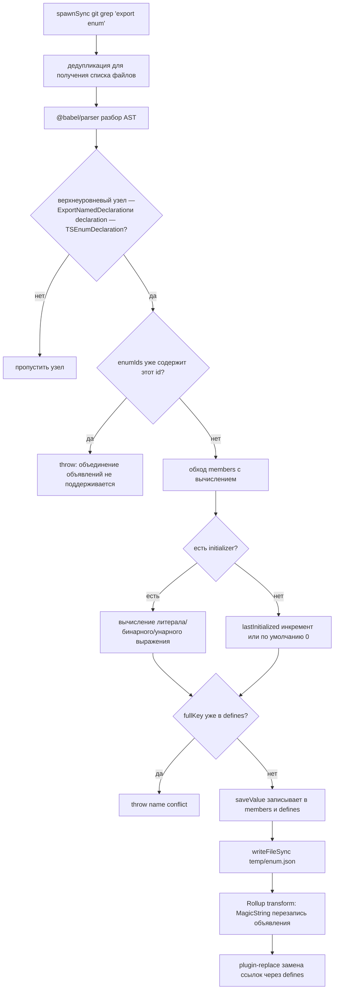
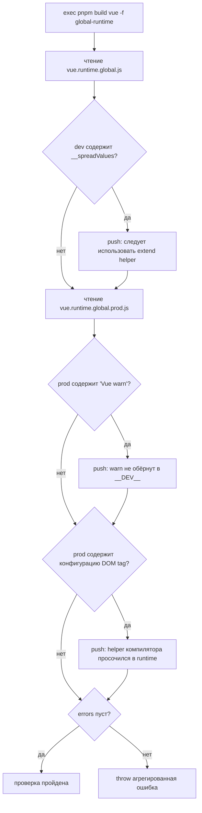

# Глава 4: Магия этапа компиляции: встраивание enum и механизм проверки Tree-shaking

В предыдущей главе мы увидели, как цепочка в режиме разработки за счёт отслеживания файлов и инкрементальной сборки обеспечивает скорость «изменил строку — сразу вступило в силу». Но помимо скорости у Vue есть ещё одно, более скрытое ограничение: размер публикуемого артефакта должен быть контролируемым. Один из врагов этого ограничения — enum в TypeScript: во время выполнения это реально существующий объект, который ломает Tree-shaking. Эта глава переносит нас на этап компиляции: посмотрим, как scripts/inline-enums.js до исполнения кода браузером «растворяет» перечисления в литералы; а затем посмотрим, как scripts/verify-treeshaking.js после сборки с помощью строк артефакта обратно проверяет, что обещание «подключения по требованию» не было незаметно нарушено.

# 4.1 Встраивание enum: растворение объекта времени выполнения в литералы

## Интуитивная модель

Представьте, что вы написали кулинарную книгу, в которой постоянно встречается «немного соли». Если каждый раз при готовке нужно листать приложение, чтобы узнать, что «немного = 3 грамма», это и медленно, и занимает место. Встраивание enum делает следующее: перед печатью заменяет во всей книге «немного соли» прямо на «3 грамма соли», а затем вырывает страницу приложения. Для читателя (времени выполнения) результат полностью тот же, но книга стала тоньше.

Если бы этого не было, с какой катастрофой столкнулась бы система? Обычный`enum`в TypeScript после компиляции создаёт реальный объектный литерал и обладает двусторонним отображением (`Enum[Enum.A] === 'A'`). Этот объект —**объявление уровня модуля с побочными эффектами**, Rollup не может доказать, что оно не используется, и потому вынужден его сохранить — даже если вы импортировали только один его член, весь объект перечисления вместе с обратным отображением будет вставлен в артефакт.[FACT:scripts/inline-enums.js:3-9]В комментарии прямо сказано: они использовали`const enum`, но из-за issue #1228 перешли на обычный enum и потому с помощью этого скрипта «вручную возвращают нулевые затраты const enum».

## Структуры данных и размещение в памяти

Ядро скрипта — три определения типов; поняв их, вы поймёте весь поток данных.[FACT:scripts/inline-enums.js:33-36]

- `EnumMember`：`{ name, value }`, имя отдельного члена перечисления и вычисленный литерал.
- `EnumDeclaration`：`{ id, range: [start, end], members }`。`range`— это**смещение в байтах исходного кода**, указывающее на начало и конец всего объявления`export enum X { ... }`в файле — это якорь для последующей точной замены через MagicString.
- `EnumData`：`{ declarations, defines }`。`declarations`индексируется по пути файла и записывает диапазоны замены всех объявлений перечислений в этом файле;`defines`— это плоское отображение, ключ — `` `${имя перечисления}.${имя члена}` `` 形式的字符串，值是 `JSON.stringify` после преобразования в литерал.

Здесь есть ключевой дизайн:`defines`ключ**не содержит путь к файлу**。[FACT:scripts/inline-enums.js:98-103]В комментарии объясняется причина —`ErrorCodes`может одновременно существовать в`@vue/compiler-core`и`@vue/runtime-core`, поэтому одноимённые перечисления могут существовать в разных файлах; но один и тот же`ErrorCodes.__EXTEND_POINT__`не допускается повторять в двух одноимённых перечислениях, иначе`fullKey in defines`сработает и сразу выбросит`name conflict`. Это ограничение «глобальной уникальности по имени члена», а не «глобальной уникальности по имени перечисления».

Кэш сохраняется в`temp/enum.json`。[FACT:scripts/inline-enums.js:33-36]Почему нужна запись на диск? Потому что`scanEnums()`в точке входа сборки вызывается только один раз, а Rollup запускает для каждого пакета и каждого формата**независимые процессы**。[FACT:scripts/inline-enums.js:39-41]В комментарии указано: данные должны совместно использоваться параллельными процессами Rollup, поэтому их необходимо сериализовать на диск, чтобы каждый процесс через свой`inlineEnums()`прочитал их обратно.

## Пошагово: от grep до замены на литералы

**Шаг первый: grep всех файлов, содержащих`export enum`.**[FACT:scripts/inline-enums.js:51-61]использует`spawnSync('git', ['grep', 'export enum'])`, вывод имеет вид`path:line:content`, затем по`:`отрезается первая часть (путь к файлу), с помощью`Set`выполняется дедупликация. Обратите внимание, что здесь используется`git grep`вместо обхода файловой системы — он естественным образом сканирует только файлы, отслеживаемые Git, автоматически исключая`node_modules`и артефакты сборки.

**Шаг второй: Babel выполняет разбор и собирает информацию о перечислениях.**[FACT:scripts/inline-enums.js:64-70]Для каждого файла используется`@babel/parser`с`typescript`плагином,`sourceType: 'module'`разбирается в AST, затем обходятся только`ast.program.body`узлы верхнего уровня.[FACT:scripts/inline-enums.js:74-79]Распознаются только`ExportNamedDeclaration`и его`declaration.type === 'TSEnumDeclaration'`узлы — то есть,**неэкспортируемые enum не обрабатываются**。

Для каждого объявления перечисления скрипт вычисляет значения членов по одному. Вычисление членов делится на три пути:

1. **Литеральная инициализация**：`StringLiteral`или`NumericLiteral`напрямую берётся`init.value`。[FACT:scripts/inline-enums.js:114-119]

2. **Бинарное выражение**: например,`1 << 2`. Рекурсивно`resolveValue`обрабатываются левый и правый операнды; операнд может быть литералом или`MemberExpression`(то есть ссылкой на ранее определённый член перечисления).[FACT:scripts/inline-enums.js:121-151]Ключевой момент —`MemberExpression`ветвь: она использует`content.slice(node.start, node.end)`из**исходного текста кода**вырезает строку выражения (например,`ErrorCodes.FOO`), затем ищет в`defines`. Если не найдено, выбрасывается`unhandled enum initialization expression`。[FACT:scripts/inline-enums.js:132-141]Это объясняет, почему`defines`должно быть глобальным плоским отображением — при кросс-перечисленческих ссылках ссылаемый элемент может быть из другого файла, но ключ распознаётся только по`枚举名.成员名`。

3. **Унарное выражение**: например,`-1`, собирается в`-1`строку и вычисляется с помощью`evaluate`.[FACT:scripts/inline-enums.js:152-163]

Само вычисление использует`new Function('return ' + exp)()`。[FACT:scripts/inline-enums.js:39-41]Это**контролируемый eval**: входные данные берутся из уже разобранного фрагмента AST в исходном коде, а не из произвольного пользовательского ввода, поэтому границы безопасности контролируемы.

**Шаг третий: обработка членов без инициализатора (семантика автоинкремента).**[FACT:scripts/inline-enums.js:171-183]Если у члена нет`initializer`: первый член по умолчанию`0`; для последующих членов, если`lastInitialized`является числом, то`++`; если строкой, выбрасывается`wrong enum initialization sequence`— потому что строковым членам перечисления не разрешён неявный автоинкремент. Это в точности семантика перечислений TypeScript.

**Шаг четвёртый: запись кэша и возврат функции очистки.**[FACT:scripts/inline-enums.js:200-213] `scanEnums()`Возвращается замыкание, при вызове которого`rmSync`удаляется файл кэша.`build.js`Используется в`try/finally`.[FACT:scripts/build.js:81-112]Это гарантирует, что даже при ошибке в середине сборки кэш будет очищен и не загрязнит следующую сборку.

**Шаг пятый: замена на этапе transform в Rollup.** `inlineEnums()`Кэш читается обратно, создаётся плагин Rollup.[FACT:scripts/inline-enums.js:219-234]В`transform(code, id)`, если`id`попадает в`enumData.declarations`, с помощью MagicString`[start, end]`этот фрагмент объявления заменяется на объектный литерал.[FACT:scripts/inline-enums.js:242-274]

Заменённая форма —`export const X = { ... }`. Обратите внимание, что он**не просто удаляет перечисление**, а переписывает его в объектный литерал и дополнительно генерирует обратное отображение для числовых членов:`JSON.stringify(value.toString()) + ': ' + JSON.stringify(name)`。[FACT:scripts/inline-enums.js:257-270]Комментарий ссылается на правило reverse-mappings из официальной документации TypeScript: для строковых членов перечисления обратное отображение не генерируется, для числовых — генерируется. Это гарантирует, что после замены поведение во время выполнения полностью совпадает с исходным enum.

А реальное устранение накладных расходов во время выполнения происходит, когда`defines`передаётся в`@rollup/plugin-replace`。[FACT:rollup.config.js:222-223]Все ссылки на`X.Member`**ссылки**в плагине замены напрямую заменяются на литералы, поэтому тот переписанный объектный литерал, если никем не используется, может быть выброшен Tree-shaking'ом.

Приведённая ниже блок-схема описывает полный путь принятия решений от grep до замены:

## Проектные соображения и подводные камни

**Почему используется MagicString, а не повторная генерация всего файла?**Потому что`s.update(start, end, ...)`заменяет только фрагмент объявления перечисления, остальные байты исходного кода полностью не трогаются,`s.generateMap()`при этом всё ещё можно сгенерировать точный sourcemap.[FACT:scripts/inline-enums.js:277-281]Если использовать Babel для повторной печати всего AST, будет потеряно исходное форматирование, комментарии, а качество sourcemap снизится.

**`range`Почему`node.start/node.end`, а не`declaration.start`？**[FACT:scripts/inline-enums.js:189-193]Утверждается`node.start`(то есть`ExportNamedDeclaration`узел), диапазон замены охватывает`export enum X {...}`весь фрагмент, включая`export`ключевое слово. Текст замены начинается с`export const`, точно продолжая.

**Подводные камни:`defines`Ограничение глобальной уникальности**Если в двух разных файлах есть по одному`ErrorCodes`, и оба определяют`__EXTEND_POINT__`, сборка сразу завершится ошибкой.[FACT:scripts/inline-enums.js:101-103]Это не баг, а намеренное решение — потому что`defines`является глобальной таблицей замены и не может различать источник по файлам. При добавлении новых членов перечисления в продакшене, если имя конфликтует с уже существующим членом перечисления, это проявится здесь.

**Подводный камень:`new Function`Момент вычисления**Вычисление бинарного выражения происходит на этапе`scanEnums`, в это время в`defines`может ещё не быть ссылаемого члена (если порядок ссылок обратный).[FACT:scripts/inline-enums.js:136-140]Выбрасывается`unhandled enum initialization expression`. Это требует, чтобы ссылки на члены перечисления следовали порядку исходного кода «сначала определение, потом ссылка».

# 4.2 Проверка Tree-shaking: обратное доказательство обещания с помощью строк артефактов

## Интуитивная модель

Встраивание перечислений — это «предварительная оптимизация», но действительно ли оптимизация срабатывает? Если какой-то helper из-за неудачного написания был случайно сохранён, размер тихо раздуется, а разработчик ничего не заметит.`verify-treeshaking.js`Это и есть тот «контролёр после факта»: он собирает артефакт, а затем, как при вскрытии, проверяет в артефакте,**не появилось ли то, чего не должно быть**. Без него обещание Vue о по требованию импорте могло бы после какого-то рефакторинга беззвучно нарушиться, пока пользователи не пожалуются на увеличение пакета.

## Структуры данных и проверяемые пункты

В этом скрипте нет сложных структур данных, ядро — это`errors`массив и три`includes`проверки.[FACT:scripts/verify-treeshaking.js:6-6]Сначала собирается`global-runtime`формат, затем по отдельности читаются dev- и prod-артефакты.

Три проверки соответствуют трём типам «провала Tree-shaking»:

1. **dev-артефакт содержит`__spreadValues`**。[FACT:scripts/verify-treeshaking.js:13-19]Это helper, генерируемый esbuild для`{ ...obj }`синтаксиса spread объекта. Если он присутствует, значит в коде времени выполнения использован spread объекта, тогда как по соглашению Vue следует использовать`extend`helper, чтобы избежать лишнего кода.

2. **prod-артефакт содержит`Vue warn`**。[FACT:scripts/verify-treeshaking.js:26-31]означает, что есть`warn()`вызов, не обёрнутый в`__DEV__`условие, из-за чего код предупреждения просочился в продакшен-пакет.

3. **prod-артефакт содержит список конфигураций DOM tag**。[FACT:scripts/verify-treeshaking.js:33-42]например,`html,body,base`、`svg,animate,animateMotion`、`annotation,annotation-xml,maction`. Это`isHTMLTag()`Данные внутри helper'ов вроде этого должны существовать только в компиляторе и удаляться во время выполнения. Если они появляются в артефактах времени выполнения, это означает, что путь времени выполнения ошибочно использует helper, предназначенный только для компилятора.

## Пошагово: процесс проверки

[FACT:scripts/verify-treeshaking.js:5-5]Сначала`exec('pnpm', ['build', 'vue', '-f', 'global-runtime'])`, собираем только`vue`пакета`global-runtime`формат — это минимальный артефакт времени выполнения, лучше всего подходящий для выявления утечек. После завершения сборки синхронно читаем оба файла, по одному`includes`проверяем, при совпадении добавляем в`errors`сообщение с объяснением. В конце, если`errors.length`не равно нулю, выбрасываем агрегированную ошибку.[FACT:scripts/verify-treeshaking.js:44-48]

## Размышления о дизайне и подводные камни

> **[Design Inference & Architectural Trade-offs]**
> **Почему используется строковый`includes`вместо AST-анализа?**Потому что это «проверка-страж», а не «точный анализ». Она не стремится к полноте, а лишь устанавливает низкозатратные сигналы тревоги для трёх типов регрессий, реально случавшихся в истории. Сопоставление строк не имеет зависимостей, нулевых затрат на парсинг и одинаково эффективно для минифицированных артефактов — AST-анализ после minify, наоборот, сложнее выполнить.

> **[Design Inference & Architectural Trade-offs]**
> **Почему проверяется только`global-runtime`？**этот формат инлайнит все зависимости (`external`пусто), это наиболее чувствительный к размеру и наиболее подверженный ошибочному включению артефакт. Если он чист, другие форматы обычно тоже чисты. При этом он быстро собирается, что удобно для частого запуска в CI.

> **[Design Inference & Architectural Trade-offs]**
> **Подводный камень: проверяемые элементы — это «чёрный список», который устаревает по мере эволюции кода.**Если однажды`isHTMLTag`структура данных изменится,`html,body,base`эта строка больше не появится, и проверка станет фиктивной. Это требует от сопровождающих синхронно обновлять строки-стражи при изменении соответствующих helper'ов. Это неизбежная цена проверки на основе чёрного списка.

# 4.3 Взаимодействие с Rollup: порядок плагинов и внедрение define

Инлайнинг перечислений не работает изолированно, он встроен в конвейер плагинов Rollup. Понимание его места в конвейере позволяет понять, почему`defines`должно передаваться в`replace`, а не`esbuild`。

[FACT:rollup.config.js:47-50]вызывается на верхнем уровне модуля конфигурации`inlineEnums()`, деструктурируя`[enumPlugin, enumDefines]`. Обратите внимание, что это выполняется**при запуске каждого процесса Rollup**, читая`scanEnums`записанный кэш.

Порядок массива плагинов таков:`json` → `alias` → `enumPlugin` → `...resolveReplace()` → `esbuild`。[FACT:rollup.config.js:324-339] `enumPlugin`стоит перед`replace`, это означает, что перезапись объявлений перечислений происходит первой, затем`replace`использует`defines`для замены ссылок. А`esbuild`стоит последним, отвечая за транспиляцию TS.

Почему`defines`идёт через`replace`, а не через`esbuild`— комментарий`define`？[FACT:rollup.config.js:220-221]даёт ответ: define в esbuild «немного строг, допускает только литеральный JSON или идентификаторы». А имена членов перечислений вроде`ErrorCodes.__EXTEND_POINT__`— это выражение-член с точкой, и define в esbuild не может напрямую обработать такой ключ. Поэтому необходимо использовать`@rollup/plugin-replace`, который поддерживает замену произвольных строковых ключей.[FACT:rollup.config.js:250-251]и установлен`preventAssignment: true`, чтобы не заменять также левую часть оператора присваивания.

`resolveReplace()`В`const replacements = { ...enumDefines }`— это первый шаг.[FACT:rollup.config.js:222-223]Только после этого накладываются производственные`/*@__PURE__*/`аннотации,`__DEV__`и другие замены. Этот порядок гарантирует, что замена литералов перечислений всегда срабатывает.

# Размышления о дизайне

**Суть инлайнинга перечислений — «обмен сложности времени сборки на объём времени выполнения».**Он полностью воспроизводит семантику системы типов TypeScript (вычисление перечислений, автоинкремент, обратное отображение) на этапе сборки —`scanEnums`логика вычисления в[FACT:scripts/inline-enums.js:110-183]почти является подмножеством вычисления перечислений компилятором TS. Это влечёт затраты на сопровождение: если TS добавит новый синтаксис перечислений (например, более сложные константные выражения), здесь нужно будет догонять, иначе будет выброшена ошибка`unhandled`. Но выгода очевидна: нулевой объект перечисления во время выполнения, Tree-shaking становится полным.

> **[Design Inference & Architectural Trade-offs]**
> **Скрипт проверки и скрипт инлайнинга — это пара «обещание и его исполнение».**Скрипт инлайнинга обещает, что «перечисления не занимают объём времени выполнения», скрипт проверки проверяет, что «другой код тоже не занимает объём тайком». Оба вместе охраняют бюджет размера Vue. Такой парный дизайн «оптимизация + проверка» — типичный паттерн инженерии крупных фронтенд-библиотек: любая оптимизация требует автоматической проверки для предотвращения регрессий.

**Межпроцессный кэш — необходимость для параллельных сборок.** `scanEnums`Режим однократного выполнения,`inlineEnums`многократного чтения[FACT:scripts/inline-enums.js:39-41]решает проблему «одно сканирование, N процессов-потребителей». Без кэша каждый процесс Rollup должен заново выполнять grep + парсинг, тратя впустую много IO и CPU.

# Резюме главы

# Вопросы для размышления и самопроверки к этой главе

Q1: Если удалить`scanEnums`в`saveValue`из`if (fullKey in defines)`проверку конфликтов, в каких сценариях это приведёт к ошибкам в артефактах сборки?

**Разбор ответа**：

`defines`— это глобальное плоское отображение, ключом является`枚举名.成员名`, без пути к файлу.[FACT:scripts/inline-enums.js:98-103]После удаления проверки конфликтов, если два разных файла имеют одноимённые перечисления и определяют одноимённые члены (например,`@vue/compiler-core`и`@vue/runtime-core`оба имеют`ErrorCodes.__EXTEND_POINT__`), последний записавший перезапишет первого записавшего.

Последствия:`defines['ErrorCodes.__EXTEND_POINT__']`останется только одно значение, а`plugin-replace`при замене не сможет различить источник файла и заменит**все**файлы`ErrorCodes.__EXTEND_POINT__`на одно и то же значение.[FACT:rollup.config.js:222-223]В результате значение члена перечисления одного из пакетов будет молча искажено, поведение во время выполнения будет ошибочным и крайне трудно диагностируемым — потому что исходный код выглядит абсолютно корректно.

Именно поэтому комментарий подчёркивает: «одноимённые перечисления в разных файлах допускаются, но одноимённые члены — нет».[FACT:scripts/inline-enums.js:98-100]Проверка конфликтов — это страж, предотвращающий загрязнение глобальной таблицы замен.

Q2: Если поменять местами`rollup.config.js`в массиве плагинов`enumPlugin`и`...resolveReplace()`, что произойдёт?

**Разбор ответа**：

Текущий порядок:`enumPlugin`впереди,`replace`позади.[FACT:rollup.config.js:331-332]Хук`transform`в Rollup выполняется в порядке массива плагинов.

Если поменять местами,`replace`запустится первым, и в этот момент объявления перечислений всё ещё в исходной`export enum X { ... }`форме.`replace`использует`defines`для замены ссылок на`X.Member`— но в этот момент ссылки ещё на месте, замена сработает. Проблема возникает, когда`enumPlugin`затем запускается: он использует`s.update(start, end, ...)`для перезаписи секции объявлений.[FACT:scripts/inline-enums.js:250-273]Но`replace`уже изменил`code`, а`enumPlugin`получает`code`— это`replace`вывод, байтовое смещение которого уже не соответствует`scanEnums`записанному`range`(на основе исходного кода)**больше не соответствует**。

Последствие: MagicString будет разрезать по неверному смещению, синтаксис артефакта будет нарушен. Это выявляет неявный контракт конвейера плагинов:**преобразования, основанные на смещениях в исходном коде, должны выполняться первыми**, чтобы последующие преобразования могли безопасно продолжать работу над их выводом.

Q3: `verify-treeshaking.js`проверяются только три строковых маркера. Если при каком-либо рефакторинге`isHTMLTag`внутренние данные из`'html,body,base'`будут изменены на форму массива`['html','body','base']`, что произойдёт со скриптом проверки? Какой недостаток проектирования это выявляет?

**справочный разбор**：

Проверка скрипта используется для`prodBuild.includes('html,body,base')`проверки.[FACT:scripts/verify-treeshaking.js:33-37]Если данные преобразовать в массив, в сжатом артефакте больше не будет строки, соединённой запятыми,`includes`возвращает`false`, проверяет**проходит молча**— даже если`isHTMLTag`действительно произошла утечка в артефакт времени выполнения.

Это выявляет врождённый недостаток проверки строк по чёрному списку:**строки-маркеры связаны с реализацией исходного кода; при изменении реализации проверка становится недействительной**. Она не способна обнаружить «неизвестные утечки», а может обнаружить только «известные утечки, строковая форма которых не изменилась».

> **[Design Inference & Architectural Trade-offs]**
> Направление улучшения: можно перейти к проверке более стабильных идентификаторов (например, имён функций`isHTMLTag`), либо на уровне исходного кода запретить с помощью правил lint импорт компиляторных helper'ов во время выполнения, вместо того чтобы полагаться на строки в артефакте. Однако при текущих ограничениях по затратам строковые маркеры — это «достаточный и дешёвый» компромисс.

Встраивание перечислений решило вопрос «как устранить накладные расходы времени выполнения на этапе сборки», а скрипт проверки решил вопрос «как убедиться, что оптимизация не нарушена». Но помимо JS, у артефактов сборки есть ещё одна категория продуктов, также требующих конвейерной обработки, — файлы объявлений типов. В следующей главе мы перейдём к конвейеру артефактов типов и посмотрим, как Vue из исходного кода`.d.ts`Генерация пакетов типов уровня релиза, а также`dts-test`Как с помощью тестирования типовых контрактов защитить форму типов публичного API.

В этой главе разбираются два ключевых скрипта этапа компиляции. inline-enums.js использует git grep для поиска перечислений, Babel для разбора AST, new Function для вычисления членов, MagicString для точного перезаписывания объявлений и в конечном итоге через глобальную таблицу подстановок defines превращает ссылки на перечисления в литералы, позволяя объектам перечислений подвергаться Tree-shaking. verify-treeshaking.js же после сборки проверяет артефакты с помощью строковых маркеров, гарантируя, что три известных типа утечек Tree-shaking не вернутся. Один отвечает за «оптимизацию», другой — за «проверку того, что оптимизация не сломана», вместе они охраняют обещание Vue по размеру бандла. Далее мы перейдём от этапа компиляции к цепочке генерации типовых артефактов и посмотрим, как Vue обеспечивает строгое соответствие типов исходного кода и опубликованных типов.
