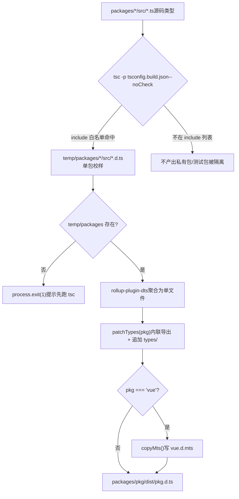
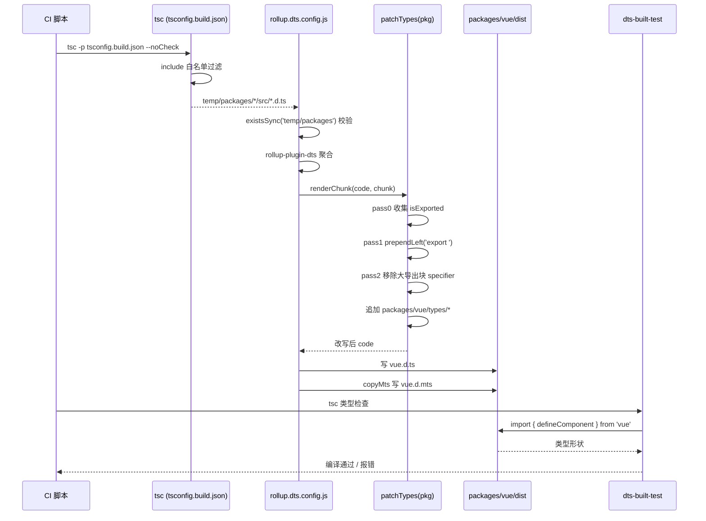

# 第 5 章：类型产物流水线：从源码 .d.ts 到发布级类型包

上一章我们拆解了`inline-enums.js`与`verify-treeshaking.js`：一个负责把 enum 引用替换成字面量、让枚举对象能被摇掉，另一个负责在构建后用字符串哨兵确认三类已知泄漏没有回归。两者共同守护了 Vue 的运行时体积承诺。但构建产物不止 JS。当用户`import { ref } from 'vue'`时，编辑器弹出的类型提示、`tsc`对用户代码的类型检查，全都依赖另一类产物——`.d.ts`声明文件。JS 产物错了，运行时报错；类型产物错了，用户侧编译期就报错，或者更糟：类型静默漂移，用户代码能编译通过，但类型形状与真实运行时行为不符。本章追踪 Vue 如何把散落在各子包`src`里的源码类型，聚合成发布级的类型包，并用`dts-built-test`在真实构建产物上做类型冒烟测试。

# 5.1 两阶段类型流水线：tsc 出料，rollup 聚合

## 直觉模型

想象一条印刷流水线：第一阶段，每个子包各自把自己的手稿（`.ts`源码）排版成单页校样（`.d.ts`）；第二阶段，把几十张校样按目录顺序装订成一本书（发布级`.d.ts`），并统一页眉页脚（导出声明）。

若没有这条流水线，Vue 就得手工维护一份发布类型文件，源码一改就得同步手改——这是类型漂移的温床。Vue 的做法是：**类型产物完全由源码生成，绝不手写**。

## 第一阶段：tsconfig.build.json 划定出料范围

`tsconfig.build.json`是这条流水线的第一阶段配置。它继承根`tsconfig.json`，只覆盖构建相关选项。

[FACT:tsconfig.build.json:3-9]

关键选项逐个拆解：

- `declaration: true`：让 tsc 为每个源文件生成对应`.d.ts`。
- `emitDeclarationOnly: true`：**只出类型，不出 JS**。JS 由 Rollup 负责，tsc 在这里纯粹是类型提取器。
- `stripInternal: true`：凡是标注`@internal`的声明一律从`.d.ts`中剔除。这是 Vue 控制公开 API 表面的第一道闸门——内部实现细节即使被`export`，只要打了`@internal`就不会泄漏到发布类型里。
- `composite: false`：关闭项目引用（project references）的增量构建模式。Vue 这里不需要跨包增量，关掉可避免`.tsbuildinfo`带来的额外状态。

`include`列表则精确划定了哪些目录参与出料：

[FACT:tsconfig.build.json:10-23]

注意这里**只列了 12 个目录**，而不是整个`packages/`。`packages-private/`、`packages/dts-test/`、`packages/sfc-playground/`等都不在其中。这意味着：私有包和测试包的类型**永远不会**попадает в артефакты публикации. Это физическая изоляция — не по соглашению, а по конфигурации.

> **[Design Inference & Architectural Trade-offs]**
> Почему используется белый список, а не чёрный? Потому что добавление новых подпакетов в monorepo — обычное дело. Если использовать`exclude`чёрный список, при добавлении нового приватного пакета и забывании внести его в exclude его типы тихо попадут в артефакты публикации. Белый список работает наоборот: новые пакеты по умолчанию не участвуют в сборке и должны быть явно добавлены, что соответствует принципу «безопасных значений по умолчанию».

После выполнения`tsc -p tsconfig.build.json --noCheck`артефакты оказываются в`temp/packages/<pkg>/src/*.d.ts`. Обратите внимание на`--noCheck`: пропуск проверки типов, только emit. Проверка типов выполняется отдельным`tsc --noEmit`, на этапе сборки она не повторяется, что экономит время.

## Второй этап: агрегация rollup.dts.config.js

Второй этап управляется`rollup.dts.config.js`. Его точка входа сначала выполняет предварительную проверку:

[FACT:rollup.dts.config.js:15-22]

Если`temp/packages`не существует, значит первый этап не выполнялся, скрипт сразу`process.exit(1)`и предлагает сначала запустить`tsc`. Это**контракт порядка**конвейера: этап rollup сильно зависит от артефактов этапа tsc, ни один не может отсутствовать.

Затем читаются все каталоги подпакетов, и поддерживается`TARGETS`переменная окружения для сборки подмножества:

[FACT:rollup.dts.config.js:15-22]

`TARGETS`механизм позволяет пересобирать типы только нескольких пакетов, что при разработке и отладке значительно сокращает цикл обратной связи.

Ядро —`targetPackages.map(...)`генерирует конфигурацию Rollup для каждого пакета:

[FACT:rollup.dts.config.js:23-42]

Построчный разбор:

- `input: ./temp/packages/${pkg}/src/index.d.ts`: точка входа — файлы типов, созданные на первом этапе, а не исходный код`.ts`。
- `output.file: packages/${pkg}/dist/${pkg}.d.ts`: артефакты попадают в собственный`dist`каталог каждого пакета, имя файла совпадает с именем пакета (например,`vue.d.ts`）。
- `format: 'es'`: файлы типов единообразно используют формат ES module.
- `plugins: [dts(), patchTypes(pkg), ...(pkg === 'vue' ? [copyMts()] : [])]`: три плагина, первые два действуют на все пакеты,`copyMts`действует только на`vue`пакет.

`onwarn`Хук

[FACT:rollup.dts.config.js:23-42]

заслуживает отдельного упоминания:`UNRESOLVED_IMPORT`В процессе dts rollup все импорты с неотносительными путями по умолчанию внешние (externalized). Это приводит к тому, что Rollup выдаёт**предупреждение. Но это**ожидаемое поведение`import { X } from 'some-pkg'`— в файлах типов`return`и должны оставаться внешними ссылками, их не следует включать в сборку. Поэтому скрипт для «неразрешённых импортов с неотносительными путями» просто`warn`。

> **[Design Inference & Architectural Trade-offs]**
> только неразрешённые импорты с относительными путями.`!warning.exporter?.startsWith('.')`〔Проектные допущения и архитектурные компромиссы〕`.`Здесь есть тонкость:

## проверяет, начинается ли exporter с

Общая картина конвейера`tsc`Копировать`rollup`Эта схема фиксирует поток управления двух этапов:`check`белый список`patchTypes`определяет, кто может попасть в конвейер,`copyMts`определяет, можно ли продолжить,`vue`— обязательный этап,

# — ветка, специфичная для пакета

## 5.2 patchTypes: преобразование агрегированных артефактов в форму уровня публикации

`rollup-plugin-dts`Интуитивная модель`.d.ts`После объединения десятков`export { A, B, C, ... }`в один файл получается форма «сначала объявляется куча типов, в конце всё экспортируется через один огромный`defineComponent`». Это неудобно для чтения человеком, а для некоторых инструментальных цепочек (например, вызова

`patchTypes`в VitePress) это вызывает ошибку «inferred type cannot be named without a reference».**— это та самая**постобработка формы

## : «централизованный экспорт» заменяется на «встроенный экспорт на месте», затем добавляются специфичные для пакета расширения типов.

`patchTypes`Структуры данных: два Set и три прохода`renderChunk`возвращает плагин Rollup, основная логика находится в хуке

[FACT:rollup.dts.config.js:87-88]

- `isExported`. Он поддерживает две коллекции:**: записывает все**изначально экспортированные`export { ... }`имена типов (из объявлений
- `shouldRemoveExport`).**: записывает все**имена типов, которые нужно удалить

из большого блока экспорта (поскольку они уже встроены).

## Step-by-Step Walkthrough

**Обработка делится на три прохода (pass 0 / pass 1 / pass 2) — это типичная модель «сначала собрать, затем переписать, потом очистить».**

[FACT:rollup.dts.config.js:90-100]

Pass 0: сбор всех имён экспортированных типов.`ExportNamedDeclaration`Обход узлов верхнего уровня AST: для всех**и**без source`export ... from '...'`(то есть не`isExported`。

**реэкспорт), local name спецификатора добавляется в`export`Pass 1: добавление префикса**

[FACT:rollup.dts.config.js:102-125]

непосредственно к узлам объявлений.`VariableDeclaration`、`TSTypeAliasDeclaration`、`TSInterfaceDeclaration`、`TSDeclareFunction`、`TSEnumDeclaration`、`ClassDeclaration`Обход узлов верхнего уровня, для`processDeclaration`。

`processDeclaration`шести типов объявлений вызывается

[FACT:rollup.dts.config.js:70-85]

логика:

Три шага:`id`1. Без

сразу возврат (например, анонимные объявления).`_`2. Если имя начинается с**— пропуск. Это**соглашение

: типы с префиксом подчёркивания являются внутренними вспомогательными типами и не экспортируются.`shouldRemoveExport`3. Имя добавляется в`isExported`; если это имя есть в`prependLeft`(то есть изначально экспортировалось), в начальную позицию объявления`export `вставляется

строка.`VariableDeclaration`Обратите внимание, что ветка

[FACT:rollup.dts.config.js:104-115]

содержит дополнительную проверку:`declare const`Если`declare const a, b`объявляет несколько declarator (например,`processDeclaration`), сразу выбрасывается ошибка. Поскольку`declarations[0]`обрабатывает только**, несколько declarator приводят к пропуску обработки. Здесь выбран**быстрый отказ

**вместо тихой ошибки, что является проявлением защитного программирования.**

[FACT:rollup.dts.config.js:127-171]

Pass 2: удаление встроенных типов из большого блока экспорта.`ExportNamedDeclaration`Обход

- , для каждого спецификатора:`shouldRemoveExport`Если его local name есть в`exported === local`, и`export { Foo as Bar }`(исключая
- случай переименования), то спецификатор удаляется.
- При удалении используется точное удаление MagicString: если далее есть спецификатор, удаляется до start следующего спецификатора; если это последний, удаляется до end предыдущего или собственного start.`ExportNamedDeclaration`Если все спецификаторы блока экспорта удалены, удаляется весь

**узел.**

[FACT:rollup.dts.config.js:172-183]

`code = s.toString()`Завершение: добавление специфичных для пакета типов.`packages/${pkg}/types`После получения переписанного кода проверяется, существует ли

> **[Design Inference & Architectural Trade-offs]**
> 这个`types/`каталог — это**вручную поддерживаемое усиление типов**точка входа, предназначенная для типов, которые невозможно автоматически сгенерировать из исходного кода (например, глобальные усиления JSX, объявления типов макросов). Он объединяется с автоматически сгенерированными типами в одном файле, но источники чётко разделены — автоматически сгенерированные сверху, вручную добавленные снизу.

## Почему необходим встроенный экспорт?

В комментарии указана прямая причина:

[FACT:rollup.dts.config.js:45-51]

В оригинале сказано: изменить все типы на встроенный экспорт и удалить их из большого блока экспорта, иначе в VitePress`defineComponent`при вызове возникнет ошибка «the inferred type cannot be named without a reference».

> **[Design Inference & Architectural Trade-offs]**
> Суть этой ошибки такова: когда TypeScript генерирует типы, если некоторый тип может быть назван только через «ссылку на экспорт другого модуля», а эта ссылка невидима на стороне потребителя, возникает ошибка. Централизованный блок экспорта разделяет имя типа и место объявления, усугубляя эту проблему. Встроенный экспорт делает каждый тип видимым в месте объявления, устраняя этот промежуточный слой.

## copyMts: предоставление типов для двойного режима Node ESM/CJS

`copyMts`Плагин действует только для`vue`пакета:

[FACT:rollup.dts.config.js:196-204]

Он в`writeBundle`хуке записывает`vue.d.ts`содержимое как есть в`vue.d.mts`。

В комментарии объяснена причина:

[FACT:rollup.dts.config.js:188-192]

Согласно`package.json`спецификации exports TypeScript 4.7, чтобы корректно предоставлять типы одновременно для Node ESM и CJS,**необходимо иметь два независимых файла объявлений**. Поэтому при сборке`vue.d.ts`копируется как`vue.d.mts`。

> **[Design Inference & Architectural Trade-offs]**
> Почему копирование, а не повторная генерация? Потому что формы типов ESM и CJS полностью идентичны, различия только в расширении файла и`package.json`в`exports`маппинге

# . Копирование — самое дешёвое решение, позволяющее избежать повторного запуска rollup.

## 5.3 dts-built-test: дымовое тестирование типов на реальных артефактах

Интуитивная модель`patchTypes`Предыдущие два раздела гарантировали, что артефакты типов могут быть сгенерированы и имеют правильную форму. Но «может быть сгенерировано» не равно «сгенерировано правильно». Если`import`в каком-либо проходе есть баг, и какой-то экспорт был ошибочно удалён, артефакт всё равно сгенерируется, но пользователь

`dts-built-test`обнаружит отсутствие типа.**— это**дымовой тест типов, запускаемый на реальных артефактах сборки`import`: он тестирует не типы исходного кода, а`vue`опубликованный

## пакет, проверяя отсутствие регрессий в форме ключевых типов.

Структура данных: минимализированное утверждение типа

[FACT:packages-private/dts-built-test/src/index.ts:3-6]

Ядро всего тестового пакета — один файл:

- Построчный разбор:`vue`L1: из`defineComponent`импортируется**. Обратите внимание, что здесь импортируется**имя пакета`packages/vue/dist/vue.d.ts`, а не относительный путь — потребляется
- этот реальный артефакт.`_CustomPropsNotErased`L3-6: определяется компонент
- с пустыми props и пустым setup.`// #8376`L8: комментарий
- , указывающий на конкретный issue.`CustomPropsNotErased`L9-12: экспортируется`_CustomPropsNotErased`, тип —`{ foo: string }`пересечение

и**`defineComponent`Этот тест проверяет:`{ foo: string }`тип возвращаемого значения`foo`после пересечения**。

> **[Design Inference & Architectural Trade-offs]**
> свойства`defineComponent`〔设计推断与架构权衡〕

## Предположение о контексте issue #8376:

[FACT:packages-private/dts-built-test/package.json:1-11]

тип возвращаемого значения

- `private: true`, возможно, проходит через некоторый условный тип или mapped type, что приводит к «стиранию» дополнительных свойств в пересечении. Этот тест с минимальным воспроизведением фиксирует такое поведение, и при регрессии ошибка возникнет на этапе проверки типов.
- `types: dist/index.d.ts`Конфигурация пакета: workspace-зависимости указывают на реальные артефакты
- `dependencies`Ключевые поля:`workspace:*`: не публикуется в npm.`@vue/shared`、`@vue/reactivity`、`vue`。

> **[Design Inference & Architectural Trade-offs]**
> В`@vue/shared`три`@vue/reactivity`зависимости:`vue`〔设计推断与架构权衡〕`types`Почему зависимости`dist`и**? Потому что типы**могут ссылаться на типы этих двух пакетов. В режиме workspace pnpm создаёт символические ссылки на эти зависимости на локальные пакеты, а поле

## локальных пакетов указывает на артефакты в соответствующих

`dts-built-test`. Таким образом, вся тестовая цепочка потребляет`src/index.ts`артефакты сборки`tsc`, а не исходный код.`tsc`Как запускаются тесты

> **[Design Inference & Architectural Trade-offs]**
> не имеет тестового скрипта, его**и есть тестовый пример. Способ запуска: в CI выполняется**проверка типов этого пакета. Если форма типов регрессирует,`tsc`выдаёт ошибку, CI падает.

## 〔设计推断与架构权衡〕

Изящество этого дизайна в том, что он кодирует «контракт типов» в`dts-built-test`компилируемый код`dts-test`. Не нужна дополнительная библиотека утверждений, не нужен рантайм,

- `dts-built-test`сам является средством запуска тестов. Типы верны — компиляция проходит, типы неверны — компиляция падает.**Разделение обязанностей с dts-test**Обратите внимание, что
- `dts-test`в этой главе и**в следующей главе — это две разные вещи:**(эта глава): потребляет

> **[Design Inference & Architectural Trade-offs]**
> , проверяет форму типов уровня публикации.`patchTypes`(следующая глава): потребляет`stripInternal`типы исходного кода`types/`, проверяет контракт поверхности API.`dts-built-test`〔设计推断与架构权衡〕

## Почему нужны два уровня? Потому что типы исходного кода и типы артефактов могут не совпадать.

, удаление`patchTypes`, добавление`dts-built-test`каталога — всё это может внести баги уровня артефактов при корректных типах исходного кода.

# специально охраняет эту последнюю милю.

## Полная временная последовательность конвейера типов

`patchTypes`Копирование`code.replace(...)`Эта диаграмма последовательности фиксирует кросс-модульное взаимодействие: CI управляет двумя этапами — tsc и Rollup,

1. **три прохода**— это основная обработка,`start`/`end`в конце потребляет артефакты для верификации.

2. **Размышления о дизайне, восстановление после ошибок и подводные камни в продакшене**：MagicString может генерировать маппинги, позволяя изменённым файлам типов по-прежнему отслеживаться до исходного кода. Хотя применение sourcemap для файлов типов ограничено, поддержание согласованности — хорошая практика.

## Быстрый отказ vs тихая отказоустойчивость

`patchTypes`используется во многих местах`assert`：

[FACT:rollup.dts.config.js:74-74]

[FACT:rollup.dts.config.js:107-108]

[FACT:rollup.dts.config.js:147-148]

Эти утверждения немедленно выбрасывают ошибку при обнаружении неожиданной формы AST. В отличие от`onwarn`внутри`UNRESOLVED_IMPORT`молчаливое проглатывание —**ожидаемый шум проглатывается, неожиданная форма быстро приводит к отказу**. Это правильная позиция для сборочного скрипта: лучше пусть сборка упадёт, чем создать файл типов с неправильной формой.

## Производственные подводные камни:`_`соглашение о префиксе

`processDeclaration`пропускаются типы, начинающиеся с`_`:

[FACT:rollup.dts.config.js:76-78]

Это означает, что любой экспортируемый тип в исходном коде, начинающийся с`_`, не будет экспортирован через инлайн. Если какой-то тип должен быть публичным, но был пропущен из-за того, что его имя начинается с`_`, на стороне пользователя возникнет ошибка «тип не существует».

> **[Design Inference & Architectural Trade-offs]**
> Подход к диагностике таких проблем: сначала проверить, остался ли этот тип в большом экспортном блоке в артефакте`vue.d.ts`, затем проверить, начинается ли имя этого типа в исходном коде с`_`. Это неявная связь между соглашением об именовании и поведением инструмента, легко наступить на грабли.

## Производственные подводные камни: утверждение о множественных declarator

[FACT:rollup.dts.config.js:106-115]

Если в каком-либо`.d.ts`появляется`declare const a, b`, сборка немедленно выбрасывает ошибку. Это редко встречается в рукописных типах, но сработает, если файл типов, сгенерированный каким-либо инструментом, использует такую форму. В сообщении об ошибке будет напечатан фрагмент проблемного кода для облегчения локализации.

# Резюме главы

В этой главе прослежен полный конвейер создания артефактов типов Vue:

1. **Первый этап (tsc)**：`tsconfig.build.json`с помощью`include`белый список точно определяет область вывода,`emitDeclarationOnly`выводятся только типы,`stripInternal`внутренние объявления удаляются. Артефакты попадают в`temp/packages/`。

2. **Второй этап (rollup)**：`rollup.dts.config.js`с помощью`rollup-plugin-dts`агрегируются типы пакетов,`patchTypes`посредством трёх проходов обхода AST централизованный экспорт переписывается в инлайн-экспорт, и добавляется`types/`ручное расширение каталога.`copyMts`для`vue`пакета дополнительно генерируется`.d.mts`。

3. **Этап верификации (dts-built-test)**: выполняется дымовое тестирование типов на реальных артефактах сборки, с помощью компилируемого кода фиксируются ключевые формы типов для предотвращения дрейфа типов.

# Вопросы для размышления и самопроверки в этой главе

Q1: Если изменить`tsconfig.build.json`в`include`белый список на`["packages"]`(то есть включить весь каталог packages), что произойдёт? В каком сценарии это приведёт к загрязнению публикуемых типов?

**Справочный анализ**：

`include`После изменения с 12 точных каталогов на`["packages"]`все подпакеты (включая все`packages-private`за пределами`packages/*`) будут участвовать в выводе tsc.[FACT:tsconfig.build.json:10-23]

Цепочка последствий:

1. `temp/packages/`появится множество лишних пакетов`.d.ts`。

2. `rollup.dts.config.js`в`readdirSync('temp/packages')`будет читать эти лишние пакеты.[FACT:rollup.dts.config.js:15-22]

3. `targetPackages`по умолчанию равно всем пакетам, поэтому для каждого пакета будет сгенерирован`packages/<pkg>/dist/<pkg>.d.ts`。[FACT:rollup.dts.config.js:15-22]

Сценарий загрязнения: если какой-то пакет не должен публиковаться (например, внутренний инструментальный пакет), его артефакты типов появятся в`dist`. Если в`package.json`этого пакета нет`private: true`, скрипт публикации может отправить его вместе в npm, что приведёт к утечке внутренних типов.

Именно в этом ценность дизайна белого списка: новые пакеты по умолчанию не участвуют, необходимо явно добавить, что соответствует безопасным значениям по умолчанию.

Q2: `patchTypes`В pass 1`processDeclaration`для типов, начинающихся с`_`, напрямую`return`. Если тип какого-либо публичного API случайно начинается с`_`(например,`_InternalType`был случайно экспортирован), что увидит пользователь? Как это диагностировать?

**Справочный анализ**：

`processDeclaration`при встрече с`_`в начале напрямую возвращает, не добавляя в`shouldRemoveExport`, и не выполняет prepend`export `。[FACT:rollup.dts.config.js:76-78]

Последствия:

1. Этот тип не получит инлайн`export`。

2. Он также не будет удалён из большого экспортного блока (поскольку его нет в`shouldRemoveExport`).

3. Поэтому он**всё ещё находится в большом экспортном блоке**, теоретически всё ещё может быть импортирован.

Но проблема в том: в большом экспортном блоке`export { _InternalType }`ссылается на позицию объявления. Если это объявление по какой-то причине (например,`stripInternal`) было удалено, экспортный блок будет ссылаться на несуществующее имя, что приведёт к`tsc`ошибке.

Подход к диагностике:

1. Проверить, есть ли этот тип в артефакте`vue.d.ts`ни в месте объявления`export`, ни в большом экспортном блоке.

2. Проверить, начинается ли имя этого типа в исходном коде с`_`.

3. Если подтверждено, что это проблема именования, достаточно переименовать, убрав префикс подчёркивания.

Это выявляет неявную связь между соглашением об именовании и поведением инструмента:`_`префикс изначально означает «внутренний», но инструмент воспринимает его как «не экспортировать», эти две семантики не полностью совпадают.

Q3: `dts-built-test`В`src/index.ts`с помощью交叉 типа`typeof _CustomPropsNotErased & { foo: string }`проверяется, что`foo`не стирается. Если изменить交叉 тип на`Omit<typeof _CustomPropsNotErased, never> & { foo: string }`, сможет ли тест всё ещё поймать регрессию #8376? Почему?

**Справочный анализ**：

`Omit<T, never>`создаёт новый mapped type, который**пересчитывает**все свойства T. Если баг #8376 заключается в «стирании дополнительных свойств в交叉 типе», то:

- Исходная запись`T & { foo: string }`: прямой交叉,`foo`является частью交叉 типа, если`defineComponent`логика обработки возвращаемого типа стирает дополнительные свойства в交叉,`foo`будет потерян.
- `Omit`Запись:`Omit`сначала выполняется映射 для`T`, затем交叉 с`{ foo: string }`.`Omit`Процесс映射 может изменить структуру типа, так что условие срабатывания бага больше не выполняется — даже если баг существует, тест может пройти.

[FACT:packages-private/dts-built-test/src/index.ts:9-12]

Поэтому**минимальность**тестового случая критична: он должен точно воспроизводить путь срабатывания бага. Любое дополнительное преобразование типа (например,`Omit`、`Pick`) может замаскировать баг. Именно поэтому в тесте используется самый простой交叉 тип, а не более «элегантная» запись.

> **[Design Inference & Architectural Trade-offs]**
> Направление улучшения: можно одновременно сохранить несколько вариантов записи, охватывающих различные пути преобразования типов, повышая вероятность обнаружения регрессий. Но это увеличит затраты на поддержку, требуется компромисс.

Конвейер типов решает «как генерировать типы уровня публикации из исходного кода»,`dts-built-test`решает «как проверить форму артефактов типов». Но контракт типов не ограничивается «правильностью формы», он также включает «соответствие поверхности API ожиданиям» — какие типы должны экспортироваться, какие нет, точны ли ограничения дженериков. В следующей главе мы перейдём к`dts-test`, посмотрим, как Vue использует тесты типовых контрактов для защиты поверхности публичного API.

Эти три компонента образуют замкнутый цикл «генерация → форматирование → проверка», гарантируя строгое соответствие типов исходного кода и опубликованных типов. Однако корректность самого пакета типов не означает, что типовая форма публичного API зафиксирована. В следующей главе мы углубимся в`packages-private/dts-test`, чтобы увидеть, как более 20`.test-d.ts`файлов используют`expectType`и другие инструменты, превращая «типы как контракт API» в автоматизированные регрессионные тесты.
