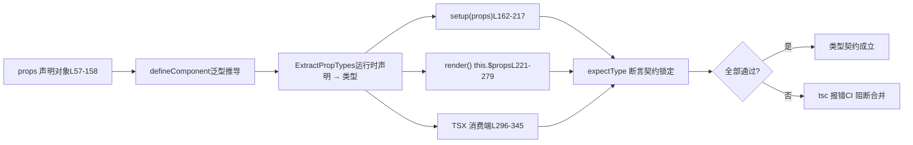

# Глава 6: Тестирование типовых контрактов: как dts-test защищает поверхность API

В предыдущей главе мы проследили цепочку генерации объявлений типов и увидели, как Vue через конфигурацию сборки и smoke-тесты обеспечивает строгое соответствие «типов исходного кода» и «опубликованных типов». Но типовой контракт — это не только «правильность формы», важнее — «соответствует ли поверхность API ожиданиям»: какие типы должны экспортироваться, какие нет, точны ли обобщённые ограничения. Эта глава погружается в`packages-private/dts-test`, чтобы увидеть, как Vue с помощью более 20`.test-d.ts`файлов превращает «типы как контракт API» в автоматизированные регрессионные тесты.

# Когнитивная модель тестирования типовых контрактов: превращение «инструкции» в «исполняемый договор»

`dts-test`Файлы в каталоге**обладают контринтуитивной особенностью: они**почти не порождают никакого runtime-поведения`defineComponent.test-d.tsx`. Откройте`defineComponent({...})`, вы увидите множество вызовов`tsc`/`vue-tsc`, но они никогда не выполняются во время выполнения тестов — эти файлы только проверяются`noEmit: true`на типы,

[FACT:packages-private/dts-test/tsconfig.test.json:1-11]

гарантируя, что не производится никакого JS.`noEmit`Эта конфигурация — «среда выполнения» всей системы контрактов:`jsx: preserve`отключает вывод артефактов,`strict`сохраняет синтаксис TSX для разбора системой типов,`moduleResolution: bundler`включает все строгие проверки,`lib`соответствует современной семантике сборки,`esnext`одновременно подключает`dom`。**и`.test-d.tsx`Без этой конфигурации**。

> **[Design Inference & Architectural Trade-offs]**
> 〔Проектные выводы и архитектурные компромиссы〕`packages-private`Выделение тестов типов в отдельный подпакет`packages/vue`вместо того, чтобы поместить их в`__tests__`внутри`vue`, мотивировано тремя причинами: во-первых, зависимости тестов типов — это**публикационные типы**（`vue/jsx`、`vue`из`.d.ts`), а не внутренние модули исходного кода; физическая изоляция заставляет использовать публичный вход; во-вторых,`tsc`проверка типов занимает гораздо больше времени, чем runtime-юнит-тесты, и отдельный каталог упрощает отдельное планирование в CI; в-третьих,`.test-d.tsx`файлы не будут ошибочно собраны runtime-коллектором Vitest.

Житейская аналогия: обычные юнит-тесты похожи на «включить машину и посмотреть, не пойдёт ли дым», а тесты типовых контрактов — на «построчную сверку условий перед подписанием договора» — сделка не совершается, лишь подтверждается, что в «сумма к оплате заказчиком» написано «юани», а не «доллары». Если условия договора неверны, машина работает гладко, но это бесполезно.

`utils.d.ts`предоставляет весь инструментарий для этой «сверки договора»:

[FACT:packages-private/dts-test/utils.d.ts:7-21]

Ключевых инструментов всего четыре:`expectType<T>(value: T)`утверждает, что`value`имеет тип ровно`T`；`expectAssignable<T, T2 extends T>`утверждает, что`T2`присваиваем`T`；`IsUnion<T>`определяет,`T`является ли объединённым типом;`IsAny<T>`определяет,`T`является ли`any`. Обратите внимание на L5`import 'vue/jsx'`— он регистрирует глобальное пространство имён JSX, позволяя`<MyComponent />`в TSX распознаваться системой типов как`JSX.Element`。

[FACT:packages-private/dts-test/utils.d.ts:7-21]

`IsUnion`Реализация заслуживает внимательного рассмотрения:`T extends any ? (U extends T ? false : true) : never`использует дистрибутивные условные типы: если`T`— объединённый тип, каждый член вычисляется независимо, и в итоге`extends false`определяет, все ли ветви возвращают`false`. Это**доказательство существования на уровне типов**— используется для фиксации контрактов вроде «`props.jjj`должен быть объединённым типом, а не слитым в единую сигнатуру».

# Сценарно-ориентированный Walkthrough:`defineComponent`Полная цепочка вывода типов props в

`defineComponent.test-d.tsx`содержит 2260 строк и является ядром системы контрактов. Погрузимся в конкретный сценарий:**Пользователь пишет`defineComponent({ props: {...}, setup(props) {...} })`, система типов Vue должна из`props`runtime-объявления вывести точный тип`setup`параметра`props`внутри**. Эта цепочка — самая сложная часть системы типов Vue.

## Шаг первый: построение «ожидаемого типа» как эталона контракта

Тестовый файл сначала определяет интерфейс`ExpectedProps`, жёстко прописывая тип, который должен выводиться для каждого способа объявления props**явно**：

[FACT:packages-private/dts-test/defineComponent.test-d.tsx:21-53]

Этот интерфейс — письменная версия «условий договора». Обратите внимание на несколько тонких типов:`a?: number | undefined`(опциональные props с`undefined`）、`aa: number`(есть default, поэтому не опциональный),`aaa: number | null`（`PropType<number | null>`явно объявлен),`aaaa: number | undefined`（`required: true as const`но тип содержит`undefined`). Эти различия не случайны, каждое соответствует`props`определённой ветви в объявлении.

## Шаг второй: «скормить»`defineComponent`

[FACT:packages-private/dts-test/defineComponent.test-d.tsx:57-158]

различными способами объявления`props`Этот объект**— исчерпывающая матрица способов объявления**, охватывающая все варианты записи props в Vue:

- `a: Number`— сокращение через конструктор, выводится как`number | undefined`
- `aa: { type: Number as PropType<number | undefined>, default: 1 }`— есть default, выводится как не опциональный`number`
- `aaaa: { type: Number, required: true as const }` —— `as const`предотвращает`true`расширение до`boolean`, сохраняя литеральный тип
- `b: { type: String, required: true as true }` —— `required: true`делает свойство не-void
- `bb: { default: 'hello' }`— без`type`, тип выводится только из default
- `cc: Array as PropType<string[]>`— явное приведение типа
- `l: [Date]`— синтаксис массива, выводится как`Date | undefined`
- `ll: [Date, Number]`— массив нескольких типов, выводится как`Date | number | undefined`
- `lll: [String, Number]`— то же самое

> **[Design Inference & Architectural Trade-offs]**
> `required: true as const`(L70) и`required: true as true`(L75) сосуществуют как след исторической эволюции: изначально использовался`as true`, позже выяснилось, что`as const`более универсален (может одновременно фиксировать другие литералы в объекте), но старый вариант сохранён для проверки обратной совместимости. Это типичная ценность контрактных тестов —**он одновременно фиксирует «новый способ работает» и «старый способ не регрессирует»**。

## Шаг третий: утверждения в трёх местах`setup` / `render` / `this`

Это самое изящное решение в контрактных тестах:**один и тот же тип props должен корректно выводиться в трёх разных местах потребления**。

[FACT:packages-private/dts-test/defineComponent.test-d.tsx:160-217]

`setup(props)`выполняет`expectType<ExpectedProps['x']>(props.x)`для каждого prop. Обратите внимание на особую обработку в L168-170:

[FACT:packages-private/dts-test/defineComponent.test-d.tsx:168-170]

`// @ts-expect-error should included 'undefined'`В сочетании с`expectType<number>(props.aaaa)`——**Намеренно напишите утверждение, которое вызовет ошибку, используя`@ts-expect-error`подавить ошибку**. Это подтверждает, что`props.aaaa`тип**не является** `number`(иначе эта строка не вызвала бы ошибку,`@ts-expect-error`а наоборот, завершилась бы неудачей из-за «отсутствия ошибки для подавления»). Это техника «обратного утверждения» в тестировании типов.

[FACT:packages-private/dts-test/defineComponent.test-d.tsx:204-205]

`// @ts-expect-error props should be readonly`В сочетании с`props.a = 1`— проверка того, что props доступны только для чтения в`setup`. Если при каком-либо рефакторинге props случайно станут изменяемыми, эта строка перестанет вызывать ошибку,`@ts-expect-error`и тест завершится неудачей.

`render()`же проверяется через`this.$props`и`this.x`два пути утверждений:

[FACT:packages-private/dts-test/defineComponent.test-d.tsx:221-279]

L252-276 проверяет, что «объявленные props также должны быть доступны на`this`», L278-279 проверяет`this.a = 1`ошибку (`this`props на также доступны только для чтения). L281-287 проверяет разворачивание возвращаемого значения setup:`this.c`это`number`（`ref(1)`разворачивается),`this.d.e.value`это`string`(вложенный ref сохраняет`.value`）、`this.f.g`это`GT`（`reactive`branded-типы внутри не разворачиваются).

## Шаг четвёртый: проверка типов на стороне потребителя TSX

Последнее звено типового контракта — «как пользователь использует этот компонент». В TSX`<MyComponent />`проверка props — это независимый путь типов:

[FACT:packages-private/dts-test/defineComponent.test-d.tsx:296-322]

Здесь проверяется, что`<MyComponent>`принимает все объявленные props, а также`class`/`style`/`key`/`ref`/`ref_for`эти встроенные атрибуты. Затем идёт**Обратная проверка**：

[FACT:packages-private/dts-test/defineComponent.test-d.tsx:337-345]

`// @ts-expect-error missing required props`проверяет ошибку при отсутствии обязательных props;`wrong prop types`проверяет ошибку при несоответствии типов; L342 проверяет`ggg="baz"`ошибку (`ggg`принимает только`'foo' | 'bar'`）。

Всю цепочку можно обобщить одной диаграммой потока данных:



Ключевой момент этой диаграммы в том, что:**одно и то же`props`объявление должно одновременно удовлетворять типовым ожиданиям трёх мест потребления**. Любое отклонение в выводе типов в любом месте приведёт к ошибке`tsc`.

# Границы и бэкдоры:`__typeProps`、`__typeEmits`и контракты условных типов

`defineComponent`Вывод типов**имеет фундаментальное ограничение:**объявления props во время выполнения не могут выражать «условные типы»`color='white'`. Например, «когда`appearance`должно быть`'outline'`» — такое ограничение невозможно записать в синтаксисе объекта времени выполнения. Vue для этого предоставляет`__typeProps`и другие «типовые бэкдоры».

## `__typeProps`: аварийный выход для типов условных props

[FACT:packages-private/dts-test/defineComponent.test-d.tsx:1803-1836]

`ConditionalProps`— это объединённый тип: либо`color`и`appearance`оба опциональны, либо`color: 'white'`и`appearance: 'outline'`. Тесты проверяют:

- L1823-1824：`<Comp color="white" />`ошибку — указание только`color: 'white'`не удовлетворяет ни одной ветви
- L1825-1826：`<Comp color="white" appearance="normal" />`ошибку —`appearance`должно быть`'outline'`
- L1827：`<Comp color="white" appearance="outline" />`проходит

> **[Design Inference & Architectural Trade-offs]**
> `__typeProps`Мотивация дизайна

## `__typeEmits`— «позволить системе типов выражать ограничения, невыразимые во время выполнения». Он не участвует в разборе props во время выполнения, это чисто типовое перекрытие. Цена — пользователю нужно вручную поддерживать согласованность типов и объявлений времени выполнения — именно поэтому он называется «backdoor», а не официальным API.

`__typeEmits`: эквивалентность двух синтаксисов emits**поддерживает два синтаксиса, тесты**：

[FACT:packages-private/dts-test/defineComponent.test-d.tsx:1838-1885]

одновременно фиксируют оба`{ change: [id: number], update: [value: string] }`Синтаксис объекта`this.$props.onChange?.(123)`использует именованные кортежи для выражения параметров. Тесты проверяют, что`onChange?.('123')`проходит,

[FACT:packages-private/dts-test/defineComponent.test-d.tsx:1887-1934]

ошибку.`{ (e: 'change', id: number): void; (e: 'update', value: string): void }`Синтаксис сигнатуры вызова**использует перегрузки.**Тела тестов для обоих синтаксисов почти построчно идентичны**— это намеренно: контракт требует, чтобы оба способа записи давали**полностью эквивалентное

> **[Design Inference & Architectural Trade-offs]**
> 〔Проектные предположения и архитектурные компромиссы〕`defineEmits`Почему сохранены два синтаксиса? Синтаксис объекта ближе к записи

## `__typeRefs`, синтаксис сигнатуры вызова ближе к традиционным типам событий TS. Vue должен поддерживать оба и гарантировать согласованность поведения. Структура тестов «построчное зеркало» — сильнейшее доказательство эквивалентности.`__typeEl`и

[FACT:packages-private/dts-test/defineComponent.test-d.tsx:1936-1952]

`__typeRefs`: межкомпонентные ссылки и типы хост-узлов`Parent`позволяет родительскому компоненту точно знать тип ref дочернего компонента.`__typeRefs: { child: ComponentInstance<typeof Child> }`объявляет`refs.child.$refs.foo`, поэтому`number`。

[FACT:packages-private/dts-test/defineComponent.test-d.tsx:1963-1977]

`__typeEl`может быть выведен как**Более тонкий момент. Комментарии к тестам L1963-1977 проясняют замысел дизайна:`Element`**Хост-узлы пользовательских рендереров (TUI, canvas, native) — не DOM`TypeEl`, поэтому`Element`не может быть ограничен`CustomElement`. Тесты используют`$el`интерфейс для проверки того, что

> **[Design Inference & Architectural Trade-offs]**
> 〔Проектные предположения и архитектурные компромиссы〕`TypeEl`Это типовая гарантия поддержки пользовательских рендереров в Vue 3. Если бы`Element`，`@vue/runtime-test`был жёстко ограничен`$el`, пользователи не-DOM рендереров не смогли бы корректно выводить типы

## . Контрактные тесты здесь защищают «независимость от рендерера».

`function syntax w/ runtime props`Взаимоисключающие ограничения обобщённых компонентов и props времени выполнения**Раздел**。

[FACT:packages-private/dts-test/defineComponent.test-d.tsx:1501-1545]

фиксирует важное правило:`generics aren't supported with object runtime props`Обобщённые компоненты не могут сосуществовать с объектными props времени выполнения`<Comp3<string>>`Комментарий L1501

> **[Design Inference & Architectural Trade-offs]**
> ошибку. А массивные props допускают обобщения (L1464-1499).`ExtractPropTypes`〔Проектные предположения и архитектурные компромиссы〕

# Корневая причина этого ограничения — порядок вывода типов: объектные props требуют

## `@ts-expect-error`сначала определить тип, а обобщения могут быть определены только при инстанцировании, что конфликтует. Массивные props не участвуют в извлечении типов, поэтому конфликта нет. Контрактные тесты закрепляют это «ограничение системы типов» как регрессионное утверждение.

`@ts-expect-error`Размышления о дизайне, восстановление после ошибок и подводные камни в продакшене**Двусторонний меч`@ts-expect-error`— основной инструмент контрактного тестирования типов, но у него есть фатальная ловушка:**Когда код под ним перестаёт вызывать ошибку,

[FACT:packages-private/dts-test/defineComponent.test-d.tsx:1354-1362]

сам вызывает ошибку`// @ts-expect-error missing prop`. Это кажется защитой, но на деле требует от автора теста точного контроля «места возникновения ошибки».`<Comp msg={123} />`Посмотрите на этот фрагмент:**помещён в**строку выше`expectType<JSX.Element>(...)`, но всё выражение обёрнуто в`@ts-expect-error`. Если позиция`expectType`сместится на строку, или ошибка фактически возникнет в вызове

> **[Design Inference & Architectural Trade-offs]**
> 〔Проектные предположения и архитектурные компромиссы〕`@ts-expect-error`Подводный камень в продакшене: когда обновление версии TypeScript приводит к незначительному смещению позиций ошибок, множество**может массово выйти из строя. Стратегия Vue —`@ts-expect-error`располагать**вплотную к утверждаемому коду

## `IsAny`и`IsUnion`: доказательство существования на уровне типов

[FACT:packages-private/dts-test/defineComponent.test-d.tsx:1991-1993]

`expectType<IsAny<typeof props.foo>>(false)`проверяет, что`props.foo`не является`any`. Это**обратный контракт**: требуется не только правильность типа, но и то, чтобы тип не деградировал до`any`」。`any`— это чёрная дыра системы типов, любое`any`лишает смысла последующие утверждения.

[FACT:packages-private/dts-test/defineComponent.test-d.tsx:195-196]

`expectType<IsUnion<typeof props.jjj>>(true)`проверяет, что`jjj`является объединённым типом.`jjj`объявлен как`((arg1: string) => string) | ((arg1: string, arg2: string) => string)`, и если система типов сольёт его в единую сигнатуру,`IsUnion`вернёт`false`, и тест провалится.

> **[Design Inference & Architectural Trade-offs]**
> Эти два инструмента защищают «точность типа», а не «правильность типа». Тип, деградировавший до`any`или объединение которого было слито, в большинстве сценариев использования «выглядит рабочим», но теряет подсказки IDE и проверки на этапе компиляции. Контрактные тесты должны фиксировать эту точность.

## Неявный контракт порядка объявления

[FACT:packages-private/dts-test/defineComponent.test-d.tsx:1784-1801]

Этот комментарий крайне важен:`code generated by tsc / vue-tsc, make sure this continues to work so we don't accidentally change the args order of DefineComponent`。`DefineComponent`имеет 13 обобщённых параметров, порядок которых —**публичный контракт**——`vue-tsc`Сгенерированный тип компонента зависит от этого порядка. В тесте с помощью`declare const MyButton: DefineComponent<...>`явно выписаны все 13 параметров, фиксируя порядок.

> **[Design Inference & Architectural Trade-offs]**
> Это наиболее легко упускаемый контракт: порядок обобщённых параметров — не «деталь реализации», а «ABI генерируемого кода». Любой PR, меняющий порядок, сделает сгенерированный`vue-tsc``.d.ts`несовместимым с типом времени выполнения. Контрактный тест здесь выступает «стражем совместимости ABI».

## Межфайловый контракт:`componentInstance.test-d.tsx`дополнение к

`componentInstance.test-d.tsx`занимает всего 154 строки, но покрывает все входные формы утилитарного типа`ComponentInstance`:

[FACT:packages-private/dts-test/componentInstance.test-d.tsx:10-40]

`ComponentInstance<typeof CompSetup>`извлекает тип экземпляра из результата`defineComponent`;`ComponentInstance<typeof CompFunctional>`извлекает из функционального компонента;`ComponentInstance<typeof CompFunction>`извлекает из голой функции. Все три должны выводить базовый класс`ComponentPublicInstance`.

[FACT:packages-private/dts-test/componentInstance.test-d.tsx:71-116]

Ещё более экстремальный случай — «голый объект без обёртки`defineComponent`»:`CompObjectSetup`、`CompObjectData`、`CompObjectNoProps`Все три формы должны корректно извлекаться с помощью`ComponentInstance`. Особенно неинтуитивны строки L113-114:`CompObjectNoProps`нет объявления`props`, но`compObjectNoProps.test`всё равно выводится как`string | undefined`— это подстраховка, предоставляемая базовым классом`ComponentPublicInstance`.

[FACT:packages-private/dts-test/componentInstance.test-d.tsx:143-147]

Тест`#12751`на L141 фиксирует одну границу:`__typeEmits`объявленное событие`'update:visible'`на экземпляре должно быть представлено как`comp['onUpdate:visible']`(строковый ключ с двоеточием), и тип`$props`должен быть`{ 'onUpdate:visible'?: (value?: boolean) => any }`. L152-153 проверяют, что`comp['$props']['$props']`выдаёт ошибку — предотвращая рекурсивную самоссылку типов.

# Итоги главы

`dts-test`Каталог с помощью более чем 20 файлов`.test-d.ts`воплощает принцип «тип — это API-контракт» в автоматизированные регрессионные тесты. Основной механизм состоит из трёх уровней:

1. **Уровень инструментов**：`expectType`、`expectAssignable`、`IsUnion`、`IsAny`предоставляет примитивы утверждений о типах,`@ts-expect-error`предоставляет возможность обратных утверждений.

2. **Уровень контрактов**：`ExpectedProps`Интерфейс`props`явно фиксирует, «какой тип должен выводиться», матрица объявлений`setup`/`render`исчерпывающе перебирает все способы записи, а три места потребления (

3. **/TSX) перекрёстно проверяются.**：`__typeProps`、`__typeEmits`、`__typeRefs`、`__typeEl`Уровень чёрного хода

# предоставляет аварийный люк для ограничений типов, невыразимых во время выполнения, одновременно фиксируя эквивалентность двух синтаксисов emits.

Вопросы для размышления и самопроверки в этой главе`defineComponent.test-d.tsx`Q1: Если удалить`@ts-expect-error`из L168-170 в`expectType<number>(props.aaaa)`, оставив только

**, что произойдёт? Почему этот тест «тихо перестанет работать»?**：

`props.aaaa`Эталонный разбор`{ type: Number as PropType<number | undefined>, required: true as const }`объявлен как`number | undefined`, его выводимый тип —`PropType<number | undefined>`(поскольку`undefined`）。

`expectType<number>(props.aaaa)`явно включает`props.aaaa`, требующий, чтобы`number`был ровно`number | undefined`). Поскольку фактический тип —**, эта строка**。`@ts-expect-error`сама по себе выдаст ошибку

Роль`@ts-expect-error`— «ожидать здесь ошибку и проглотить её».**Если удалить`props.aaaa`, эта строка сразу выдаст ошибку, и тест провалится — выглядит «строже». Но проблема в том:`number`если какой-то рефакторинг действительно сделает`@ts-expect-error`равным**(исправление бага или изменение поведения), эта строка перестанет выдавать ошибку, а после удаления

тест пройдёт`@ts-expect-error`— в этот момент тест не сможет отличить «тип правильный» от «тип неправильный, но случайно не выдаёт ошибку».**Сохранение записи с**— это`number | undefined`двусторонняя фиксация`@ts-expect-error`: требуется и «текущий тип — это`expectType<number>`» (через проглатывание ошибки`number`с помощью`number`，`@ts-expect-error`), и «тип не может быть**» (если станет**。

[FACT:packages-private/dts-test/defineComponent.test-d.tsx:168-170]

Q2: `__typeProps`, тест провалится из-за отсутствия ошибки для проглатывания). Это ключевой приём контрактных тестов типов —`ConditionalProps`использовать «ожидаемую ошибку» для фиксации «тип обязан содержать некоторый компонент»`{ color?: 'normal' | 'primary' | 'secondary' | 'white'; appearance?: 'normal' | 'outline' | 'text' }`Тест чёрного хода (L1803-1836) проверяет ограничения условного объединённого типа. Если изменить`__typeProps`с объединённого типа на

**(то есть сгладить все варианты), как провалится тест? Какое проектное ограничение**：

это демонстрирует?`color`Эталонный разбор`appearance`Сглаженный тип допускает любую комбинацию`color: 'white'` + `appearance: 'normal'`и**, включая**：

```
// @ts-expect-error
;
```

выдавала ошибку`@ts-expect-error`Копировать`<Comp color="white" />`Если тип сглажен, эта строка перестанет выдавать ошибку, и`@ts-expect-error`провалится из-за «отсутствия ошибки для проглатывания». При этом

на L1823-1824 также превратится из «ошибки» в «прохождение», что тоже заставит`__typeProps`провалиться.**Это показывает, что проектное ограничение**。`__typeProps`таково:`Props`он должен сохранять семантику «взаимного исключения ветвей» объединённого типа`Prettify`Это не простое «перекрытие типов», а «выражение через систему типов условных ограничений, невыразимых в runtime props». Если при реализации применить к`Omit`преобразование отображения вроде

> **[Design Inference & Architectural Trade-offs]**
> , можно нарушить различимость ветвей объединения и сделать ограничение недействительным.`__typeProps`〔Проектные выводы и архитектурные компромиссы〕`CommonProps & ConditionalProps`Именно поэтому тестовые случаи

Q3: `DefineComponent`используют самое примитивное пересечение`VNodeProps & AllowedComponentProps & ComponentCustomProps`, а не более «элегантные» отображаемые типы — любое дополнительное преобразование типов может замаскировать баг.`Readonly<ExtractPropTypes<{}>>`Порядок 13 обобщённых параметров

**явно зафиксирован в L1784-1801. Если какой-то рефакторинг поменяет местами 9-й параметр (**：

`DefineComponent`) и 10-й параметр (`vue-tsc`), какие нижележащие компоненты пострадают? Почему контрактный тест обязан фиксировать этот порядок?`<script setup>`Эталонный разбор`defineProps` / `defineEmits`，`vue-tsc`Порядок обобщённых параметров`CreateComponentPublicInstance<...>`— это «ABI» при генерации типа компонента. Когда пользователь пишет в**,**генерируется тип

, подобный L1999-2116, где

1. `vue-tsc`позиция`.d.ts`обобщённого параметра`DefineComponent`определяет смысл каждого параметра типа.`VNodeProps & AllowedComponentProps & ComponentCustomProps`Если поменять местами 9-й и 10-й параметры:`Readonly<ExtractPropTypes<{}>>`сгенерированный**Типы props пользовательских компонентов полностью смещены**。

2. L1786-1800`declare const MyButton: DefineComponent<...>`выдаст ошибку напрямую — потому что`{}`и`VNodeProps & ...`несовместимы.

3. L1999-2116`ErrorMessage`тип (имитация`vue-tsc`результата генерации) также выдаст ошибку.

Ценность фиксации порядка в контрактных тестах заключается в том, что:**она поднимает «порядок параметров обобщения» с уровня «детали реализации» до уровня «публичный контракт»**. Любой PR, изменяющий порядок, немедленно провалит L1786-1800, блокируя попадание несовместимых изменений в релиз.

[FACT:packages-private/dts-test/defineComponent.test-d.tsx:1784-1801]

> **[Design Inference & Architectural Trade-offs]**
> Это наиболее недооценённая ценность контрактных тестов типов: они защищают не «правильность типов», а «стабильность интерфейса системы типов». Порядок параметров обобщения,`@ts-expect-error`позиция`IsAny`возвращаемое значение

Контрактные тесты типов решают вопрос «соответствует ли поверхность API ожиданиям». Но типы — лишь половина инженерии Vue; другая половина — «как пользователь может в реальном времени проверить поведение этих API в браузере». Следующая глава посвящена SFC Playground: как Vue упаковывает компилятор, рантайм и систему типов в среду отладки в браузере, позволяя пользователю мгновенно видеть результат компиляции и выполнения при изменении кода.

Контрактные тесты защищают не только «правильность типов», но и «точность типов» (`IsAny`/`IsUnion`), «стабильность порядка параметров обобщения» (`DefineComponent`13 параметров), «независимость от рендерера» (`__typeEl`не ограничен`Element`). Как только эти ограничения нарушаются, подсказки IDE на стороне пользователя,`vue-tsc`сгенерированные типы начинают дрейфовать. А стабильность контрактов типов в конечном счёте должна служить повседневному опыту отладки разработчика — в следующей главе мы заглянем в`packages-private/sfc-playground`и посмотрим, как чисто фронтендный Playground замыкает цикл компиляции SFC и живого превью прямо в браузере.
