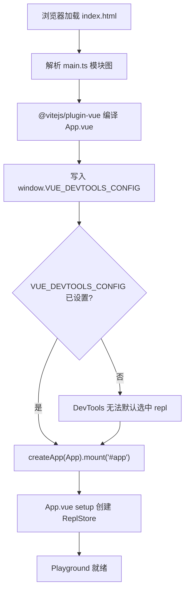
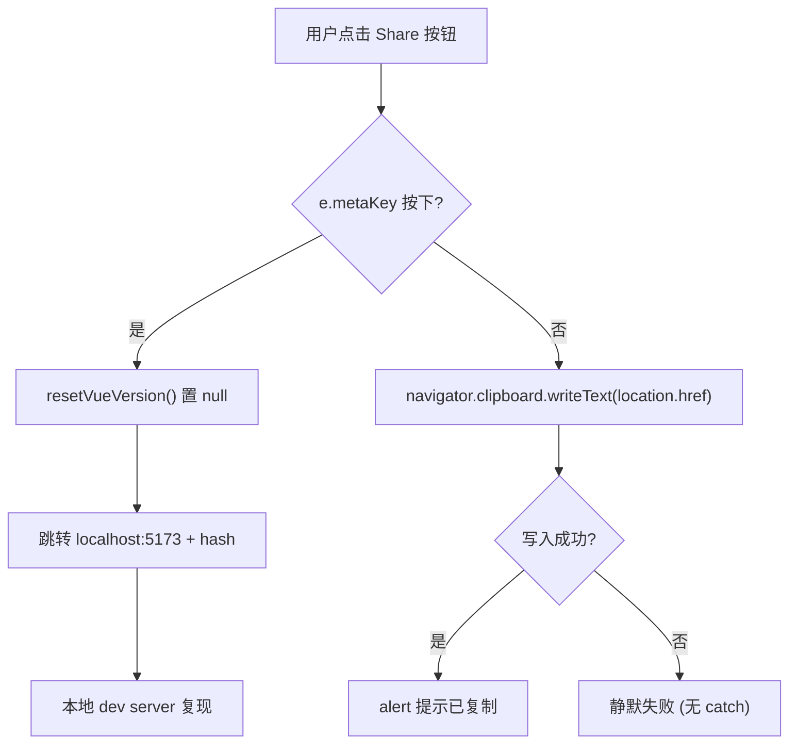
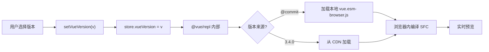

# Глава 7: SFC Playground: подсистема实时 компиляции и отладки в браузере

В предыдущей главе мы с помощью более 20`.test-d.ts`файлов прибили «типы как API-контракт» намертво в CI. Но контракты типов отвечают лишь на вопрос «как выглядит поверхность API», они не могут ответить на вопросы «как именно выглядит скомпилированный SFC» и «совпадает ли результат рендеринга в режиме SSR». Чтобы ответить на эти два вопроса, команде Vue нужна песочница, способная прогнать полный конвейер компиляции в браузере — это`packages-private/sfc-playground`. Она принципиально отличается от публичных пакетов под`packages/`:`package.json`в`"private": true`и`"version": "0.0.0"` [FACT:packages-private/sfc-playground/package.json:2-4], что означает, что она никогда не публикуется в npm и является лишь официальным инструментом отладки. В её зависимостях`vue`указывает на`workspace:*` [FACT:packages-private/sfc-playground/package.json:19], то есть на локальный артефакт сборки исходников, а не на стабильную версию из npm — это делает Playground естественной «живой демонстрацией текущего коммита». Эта глава сосредоточена на трёх вопросах: как инициализируется точка входа, как Header управляет переключением состояния, как внедряются константы времени сборки.

# I. Минимализм точки входа: контракт инициализации main.ts и ReplStore

## Интуитивная модель

`main.ts`содержит всего 9 строк, как «скрипт самопроверки при загрузке»: перед монтированием приложения Vue сначала в`window`помещается глобальная конфигурация, сообщающая Vue DevTools «какое приложение выбирать по умолчанию». Без этого шага DevTools при открытии столкнётся с несколькими экземплярами приложений (сам Playground + код, выполняемый в пользовательском REPL) и не сможет автоматически сфокусироваться, а опыт отладки деградирует до ручного переключения.

## Структуры данных и глобальные побочные эффекты

`main.ts`суть не в`createApp`, а в загрязняющей записи в`window`:

[FACT:packages-private/sfc-playground/src/main.ts:4-7]

```ts
// @ts-expect-error Custom window property
window.VUE_DEVTOOLS_CONFIG = {
  defaultSelectedAppId: 'repl',
}
```

Здесь есть две инженерные детали, заслуживающие внимания:

> **[Design Inference & Architectural Trade-offs]**
> 1. **`@ts-expect-error`а не`@ts-ignore`**：`window`стандартный тип`Window & typeof globalThis`не имеет поля`VUE_DEVTOOLS_CONFIG`. Использование`@ts-expect-error`означает «я знаю, что здесь будет ошибка, и я требую, чтобы она была» — если в будущем какой-нибудь`@types/*`добавит это поле,`@ts-expect-error`выдаст обратную ошибку из-за «отсутствия ошибки», тем самым напомнив автору удалить этот комментарий. Это перекликается с подходом контрактных тестов типов из предыдущей главы:**защищать намерения системой типов, а не скрывать проблемы**。

> **[Design Inference & Architectural Trade-offs]**
> 2. **`defaultSelectedAppId: 'repl'`Строковая конвенция**: этот`'repl'`должен полностью совпадать с id, используемым при создании app внутри`@vue/repl`. Это межпакетный литеральный контракт, не защищённый никакими ограничениями типов — как только`@vue/repl`изменит id, выбор по умолчанию в DevTools Playground тихо перестанет работать.

## Пошагово: от HTML до монтирования

Поток выполнения крайне короток, но каждый шаг имеет неявные ограничения:

1. Браузер загружает`index.html`, который содержит`<div id="app">`(в данном материале не предоставлен, но`mount('#app')`можно вывести обратно).

2. Разбор графа модулей:`main.ts`в начале`import App from './App.vue'` [FACT:packages-private/sfc-playground/src/main.ts:2]запускает`@vitejs/plugin-vue`компиляцию SFC.

> **[Design Inference & Architectural Trade-offs]**
> 3. **Ключевой порядок**：`window.VUE_DEVTOOLS_CONFIG`должен быть записан до`createApp(App).mount('#app')` [FACT:packages-private/sfc-playground/src/main.ts:9]. Поскольку хук DevTools регистрируется внутри`createApp`, запись конфигурации после mount не повлияет на первоначальный выбор.

4. `mount('#app')`запускает`App.vue`setup, тем самым создавая`ReplStore`(в`App.vue`, в данном материале отсутствует).



## Проектные соображения и подводные камни

`main.ts`Минимализм**намеренный:`App.vue`вся сложность опущена в`ReplStore`**。Точка входа выполняет только две задачи: «внедрение глобальных побочных эффектов + монтирование». Любая бизнес-логика не должна здесь присутствовать. Это компромисс Playground как «инструмента отладки», а не «продукта» — ему не нужна совместимость с SSR, не нужны множественные точки входа, не нужна ленивая загрузка.

> **[Design Inference & Architectural Trade-offs]**
> Подводные камни в продакшене:`window.VUE_DEVTOOLS_CONFIG`— да**Глобальный синглтон**. Если Playground встраивается в другую страницу, которая также использует DevTools (например, в сценарии iframe), последний записавший перезапишет предыдущего. Поскольку Playground обычно развёртывается отдельно, этот риск принят.

---

# II. Header.vue: вычисляемое производное состояние и однонаправленный поток данных через emit

## Интуитивная модель

`Header.vue`— это «панель управления» Playground: выбор версии, переключение PROD/DEV, переключатель SSR, переключение темы,分享, скачивание. Сам он**не хранит никакого бизнес-состояния**, всё состояние приходит из`props.store`и булевых props, все изменения передаются через`emit`родительскому компоненту. Без этого ограничения «глупый компонент + всплытие событий» Header превратился бы в зону бедствия с разбросанным состоянием, а побочные эффекты переключения версии и SSR невозможно было бы централизованно управлять.

## Разбор структур данных и полей

Определение props в Header — ключ к пониманию его обязанностей:

[FACT:packages-private/sfc-playground/src/Header.vue:13-19]

```ts
const props = defineProps()
```

Пять props делятся на две категории:

- **`store: ReplStore`**: единственная ссылка на контейнер состояния, приходящая из`@vue/repl`. Header через неё читает`store.loading`、`store.vueVersion`、`store.typescriptVersion`, и напрямую записывает`store.vueVersion`。
- **четыре булевых/литеральных props**：`prod`、`ssr`、`autoSave`、`theme`. Они являются**контролируемым состоянием**, Header только читает, но не пишет; изменения должны идти через`emit`。

соответствующий список emit[FACT:packages-private/sfc-playground/src/Header.vue:20-28]：

```ts
const emit = defineEmits([
  'toggle-theme',
  'toggle-ssr',
  'toggle-prod',
  'toggle-autosave',
  'reload-page',
])
```

Обратите внимание:`toggle-theme`хотя и управляется внутри`toggleDark()`внутренним`emit`, но`toggle-ssr`/`toggle-prod`/`toggle-autosave`в шаблоне напрямую`$emit`является[FACT:packages-private/sfc-playground/src/Header.vue:102-118]. Такое смешение — распространённый стиль Vue 3`<script setup>`:**при необходимости побочных эффектов используется функциональный emit, при чистой передаче — шаблонный`$emit`**。

## Пошагово: отображение и переключение версии

Сценарий: пользователь открывает Playground, Header должен показать текущую версию Vue.

**Шаг 1: computed для производного текста отображения**

[FACT:packages-private/sfc-playground/src/Header.vue:30-37]

```ts
const vueVersion = computed(() => {
  if (store.loading) {
    return 'loading...'
  }
  return store.vueVersion || `@${__COMMIT__}`
})
```

Здесь три уровня приоритета:`loading`состояние →`'loading...'`; пользователь явно выбрал версию →`store.vueVersion`; иначе →`@${__COMMIT__}`(короткий хеш текущего коммита).`__COMMIT__`— это константа, внедряемая на этапе сборки, подробнее в следующем разделе.

**Шаг 2: двусторонняя привязка VersionSelect**

[FACT:packages-private/sfc-playground/src/Header.vue:88-88]

```html

```

Обратите внимание, здесь**не используется`v-model`**, а явно разбито на`:model-value` + `@update:model-value`. Причина в том, что`vueVersion`— это computed (только для чтения), нельзя напрямую двусторонне связывать; необходимо через`setVueVersion`эту функцию-сеттер записать`store.vueVersion`：

[FACT:packages-private/sfc-playground/src/Header.vue:39-41]

```ts
async function setVueVersion(v: string) {
  store.vueVersion = v
}

function resetVueVersion() {
  store.vueVersion = null
}
```

> **[Design Inference & Architectural Trade-offs]**
> `setVueVersion`объявлен как`async`но внутри нет`await`— это историческое наследие или намеренное решение? Предположительно, для согласования с`VersionSelect`семантикой асинхронной загрузки (переключение версии запускает удалённую загрузку), чтобы сохранить единообразие интерфейса.

**Шаг 3: сравнение с версией на TypeScript**

[FACT:packages-private/sfc-playground/src/Header.vue:76-80]

```html

```

Версия на TypeScript использует`v-model`, потому что`store.typescriptVersion`— это записываемое обычное свойство, не требующее обёртки computed.**Один и тот же компонент в одном шаблоне использует два способа привязки**, что как раз наглядно демонстрирует «контролируемое vs неконтролируемое».

## Переключение темы: комбинация побочных эффектов и emit

[FACT:packages-private/sfc-playground/src/Header.vue:58-66]

```ts
function toggleDark() {
  const cls = document.documentElement.classList
  cls.toggle('dark')
  localStorage.setItem(
    'vue-sfc-playground-prefer-dark',
    String(cls.contains('dark')),
  )
  emit('toggle-theme', cls.contains('dark'))
}
```

Эта функция делает три вещи: манипулирует DOM-классом, сохраняет в localStorage, отправляет emit родительскому компоненту.**Обратите внимание, она не изменяет напрямую`props.theme`**— потому что props только для чтения, родительский компонент получит`toggle-theme`и только тогда обновит`theme`, что в свою очередь приведёт к обновлению в шаблоне`:title`текста[FACT:packages-private/sfc-playground/src/Header.vue:123]。

> **[Design Inference & Architectural Trade-offs]**
> Здесь есть тонкий дизайн:**Манипуляция DOM-классом и реактивное состояние Vue — это два независимых пути**。`document.documentElement.classList.toggle('dark')`напрямую изменяет DOM, а`theme`prop обновляется через Vue. Если они не синхронизированы (например, родительский компонент отказывается обновлять), в UI возникнет несоответствие: «класс уже переключён, но текст title не изменился». На практике родительский компонент всегда принимает emit, поэтому проблема не проявляется.

## Скрытая логика: ветка metaKey в copyLink

[FACT:packages-private/sfc-playground/src/Header.vue:47-56]

```ts
async function copyLink(e: MouseEvent) {
  if (e.metaKey) {
    resetVueVersion()
    // hidden logic for going to local debug from play.vuejs.org
    window.location.href = 'http://localhost:5173/' + window.location.hash
    return
  }
  await navigator.clipboard.writeText(location.href)
  alert('Sharable URL has been copied to clipboard.')
}
```

Это**задняя дверь для разработчика**: при нажатии Cmd на`play.vuejs.org`и клике на кнопку分享 происходит переход на`localhost:5173`(локальный dev server), и текущий URL hash передаётся туда. В hash закодировано полное состояние REPL (исходный код, версия, опции), поэтому локальная отладка может воспроизвести онлайн-проблему. Комментарий`// hidden logic for going to local debug from play.vuejs.org` [FACT:packages-private/sfc-playground/src/Header.vue:47-56]явно указывает, что это намеренно скрытая функция.

> **[Design Inference & Architectural Trade-offs]**
> `resetVueVersion()`вызывается перед переходом, устанавливая`store.vueVersion`в`null`, чтобы локальная отладка использовала текущий коммит, а не версию, выбранную онлайн.



## Размышления о дизайне и подводные камни

> **[Design Inference & Architectural Trade-offs]**
> **Подводный камень 1:`navigator.clipboard`разрешения и контекст безопасности**。`copyLink`без try/catch[FACT:packages-private/sfc-playground/src/Header.vue:47-56]. При не-HTTPS или отказе пользователя в разрешении на буфер обмена`writeText`будет reject, что приведёт к необработанному Promise rejection. Playground развёрнут на HTTPS, риск принят, но это типичная «ловушка продакшена».

> **[Design Inference & Architectural Trade-offs]**
> **Подводный камень 2:`toggleDark`жёстко закодированный ключ localStorage**。`'vue-sfc-playground-prefer-dark'`— это строковый литерал, без вынесения в константу. Если в будущем понадобится изменить ключ, придётся искать по всему проекту.

**Подводный камень 3:`currentCommit`и`vueVersion`сравнение**. В шаблоне`:class="{ active: vueVersion === \`@${currentCommit}\` }"` [FACT:packages-private/sfc-playground/src/Header.vue:88-88]Сравнение через конкатенацию строк. Если`__COMMIT__`инъекция не удалась (превращается в`undefined`), здесь станет`'@undefined'`, и совпадение никогда не будет достигнуто. Надёжность инъекции констант на этапе сборки напрямую определяет корректность UI — именно этому посвящён следующий раздел.

---

# III. Инъекция констант на этапе сборки: двойная ответственность __COMMIT__ и copyVuePlugin

## Интуитивная модель

`vite.config.ts`— это «сборочный цех» Playground: он на этапе сборки выполняет`git rev-parse`, получает хеш коммита, через`define`превращает его в глобальную константу`__COMMIT__`; одновременно через пользовательский плагин копирует ESM-браузерные артефакты из`packages/vue/dist/`в директорию артефактов Playground. Без этого шага Playground не смог бы загрузить в браузере «Vue-рантайм текущего коммита» — он зависел бы только от стабильной версии из npm, теряя смысл «живой демонстрации».

## Структуры данных и константы этапа сборки

[FACT:packages-private/sfc-playground/vite.config.ts:7-9]

```ts
const commit = spawnSync('git', ['rev-parse', '--short=7', 'HEAD'])
  .stdout.toString()
  .trim()
```

`spawnSync`синхронно выполняет git-команду,`--short=7`берёт 7-символьный короткий хеш. Синхронное выполнение намеренно:**конфигурационный файл на этапе загрузки модуля уже нуждается в значении`commit`**, асинхронность нарушила бы порядок разрешения конфигурации Vite.

[FACT:packages-private/sfc-playground/vite.config.ts:23-26]

```ts
define: {
  __COMMIT__: JSON.stringify(commit),
  __VUE_PROD_DEVTOOLS__: JSON.stringify(true),
},
```

`define`— это механизм**текстовой замены**Vite: все вхождения`__COMMIT__`в исходном коде заменяются на`JSON.stringify(commit)`(то есть на строковый литерал в кавычках).`JSON.stringify`необходим — если написать напрямую`commit`, после замены получится голый идентификатор`abc1234`, который будет воспринят как имя переменной, а не строка.

> **[Design Inference & Architectural Trade-offs]**
> `__VUE_PROD_DEVTOOLS__: true`— ещё одна ключевая константа: она заставляет**production-сборку**Vue также сохранять поддержку DevTools. По умолчанию production-сборка удаляет хук DevTools для уменьшения размера, но Playground нуждается в отладке пользовательского кода, поэтому принудительно включает его.

## Пошагово: перенос артефактов в copyVuePlugin

[FACT:packages-private/sfc-playground/vite.config.ts:32-63]

```ts
function copyVuePlugin(): Plugin {
  return {
    name: 'copy-vue',
    generateBundle() {
      const copyFile = (file: string) => {
        const filePath = path.resolve(
          import.meta.dirname,
          '../../packages',
          file,
        )
        const basename = path.basename(file)
        if (!fs.existsSync(filePath)) {
          throw new Error(
            `${basename} not built. ` +
              `Run "nr build vue -f esm-browser" first.`,
          )
        }
        this.emitFile({
          type: 'asset',
          fileName: basename,
          source: fs.readFileSync(filePath, 'utf-8'),
        })
      }

      copyFile(`vue/dist/vue.esm-browser.js`)
      copyFile(`vue/dist/vue.esm-browser.prod.js`)
      copyFile(`vue/dist/vue.runtime.esm-browser.js`)
      copyFile(`vue/dist/vue.runtime.esm-browser.prod.js`)
      copyFile(`server-renderer/dist/server-renderer.esm-browser.js`)
    },
  }
}
```

Разбор ключевых моментов по порядку:

1. **`generateBundle`хук**: выполняется после того, как Rollup сгенерировал bundle, но до записи на диск. В этот момент можно`emitFile`добавить дополнительные файлы в артефакты.

2. **`import.meta.dirname`**: ESM-версия`__dirname`, предоставляемая Node 20.11+. Путь`../../packages`поднимается от`packages-private/sfc-playground/`до корня репозитория, затем входит в`packages/`。

3. **Проверка существования + явная ошибка**: если`vue.esm-browser.js`не существует, выбрасывается ошибка с инструкцией по исправлению`Run "nr build vue -f esm-browser" first.`. Это**образец developer experience**— сообщение об ошибке сразу говорит, как исправить.

4. **Пять артефактов**：`vue`полная/рантайм-версия × dev/prod, плюс`server-renderer`. Эти пять файлов — именно тот набор кандидатов, который Playground динамически импортирует в браузере, соответствуя переключению версий и переключателю SSR в Header.

> **[Design Inference & Architectural Trade-offs]**
> **Почему именно эти пять?**Полная версия (с компилятором) используется для сценария «компиляции в рантайме»; рантайм-версия — для сценария «предварительной компиляции»; dev/prod соответствуют переключателю PROD/DEV в Header; server-renderer соответствует переключателю SSR. Эти пять файлов образуют «матрицу Vue-рантайма» Playground.

## Полный поток данных переключения версий

Свяжем`setVueVersion`из Header с артефактами copyVuePlugin:



Обратите внимание на специальное значение`@${__COMMIT__}`: оно соответствует локальным артефактам, скопированным copyVuePlugin, а не CDN. Именно поэтому Playground обязан копировать браузерные артефакты сборки Vue —**опции «This Commit» нужны локальные файлы**。

## Проектные размышления и подводные камни

> **[Design Inference & Architectural Trade-offs]**
> **Подводный камень 1:`spawnSync`обработка сбоя**. Если текущая директория не является git-репозиторием (например, распакована из tarball),`spawnSync`вернёт ненулевой код выхода,`stdout`будет пустым,`commit`станет пустой строкой. Тогда`__COMMIT__`заменится на`""`, а в Header`@${currentCommit}`станет`'@'`. Явной обработки ошибок нет.

> **[Design Inference & Architectural Trade-offs]**
> **Подводный камень 2:`optimizeDeps.exclude: ['@vue/repl']`** [FACT:packages-private/sfc-playground/vite.config.ts:27-29]. Vite по умолчанию предварительно упаковывает зависимости для ускорения холодного старта, но`@vue/repl`исключён. Причина в том, что`@vue/repl`внутри использует динамический import и worker, а предварительная упаковка ломает эти механизмы. Это распространённая в экосистеме Vite проблема «конфликта предварительной упаковки и динамической загрузки».

> **[Design Inference & Architectural Trade-offs]**
> **Подводный камень 3:`script.fs`конфигурация** [FACT:packages-private/sfc-playground/vite.config.ts:13-19]。`@vitejs/plugin-vue`опция`script.fs`позволяет блоку`<script>`SFC читать файлы через`fs`. Здесь передаются`fs.existsSync`и`fs.readFileSync`, чтобы поддержать разбор оператора`import`в SFC (например,`import x from './foo'`нужно проверить существование файла).**Это ключ к тому, что Playground может в браузере эмулировать полное разрешение модулей**— он внедряет возможности Node fs в фазу разрешения компилятора.

---

# Проектные размышления: архитектурные компромиссы Playground

Связывая три раздела, видим, что архитектура Playground следует чёткому принципу:**разделять «состояние» и «побочные эффекты», разделять «этап сборки» и «этап выполнения»**。

- `main.ts`выполняет только инъекцию глобальных побочных эффектов, не трогая бизнес-состояние.
- `Header.vue`— чисто презентационный компонент, состояние втекает через props и вытекает через emit.
- `vite.config.ts`фиксирует информацию этапа сборки «текущий commit» как константу, доступную только для чтения в рантайме.

> **[Design Inference & Architectural Trade-offs]**
> Такое разделение даёт прямое преимущество:**Playground можно встроить в любое Vue-приложение**(например, встроенный пример в документации), достаточно предоставить`store`и четыре булевых props.

Цена —**Разрозненность состояния**：`store`В`@vue/repl`булево состояние находится в родительском компоненте, DOM-класс — на`document.documentElement`, а в localStorage есть ещё одна копия. Четыре места хранения состояния требуют ручной синхронизации, и любое расхождение приводит к несогласованности UI.

> **[Design Inference & Architectural Trade-offs]**
> Ещё один компромисс —**отказ от совместимости с SSR**。`main.ts`— прямой доступ к`window`，`Header.vue`и`toggleDark`прямой доступ к`document`. Playground — это чисто CSR-приложение, и серверный рендеринг учитывать не нужно.

---

# Итоги главы

В этой главе разобраны`packages-private/sfc-playground`три ключевых файла:

1. **`main.ts`**: 9-строчная точка входа, суть которой — порядок внедрения`window.VUE_DEVTOOLS_CONFIG`— должен быть до`mount`.

2. **`Header.vue`**: через`computed`выводится`vueVersion`, через`emit`сообщается обо всех изменениях состояния.`copyLink`Ветка`metaKey`— это скрытый локальный отладочный бэкдор.

3. **`vite.config.ts`**：`spawnSync`получает хеш коммита,`define`внедряет`__COMMIT__`，`copyVuePlugin`и переносит пять браузерных артефактов Vue в каталог артефактов Playground.

Сквозная линия, объединяющая все три, —**граница между константами времени сборки и состоянием времени выполнения**：`__COMMIT__`— это доступный только для чтения факт времени сборки,`store.vueVersion`— это изменяемый выбор времени выполнения, а`vueVersion`computed в Header объединяет оба в одну отображаемую строку.

# Вопросы для размышления и самопроверки

Q1: Если перенести присваивание`main.ts`в`window.VUE_DEVTOOLS_CONFIG`после`createApp(App).mount('#app')`, что произойдёт? Почему?

**Разбор ответа**：`window.VUE_DEVTOOLS_CONFIG`— это конфигурация, которую Vue DevTools считывает при регистрации хука внутри`createApp`немедленно регистрирует[FACT:packages-private/sfc-playground/src/main.ts:4-9]。`createApp`, и в этот момент DevTools читает`__VUE_DEVTOOLS_GLOBAL_HOOK__`, чтобы определить, какое приложение выбрать по умолчанию. Если присваивание происходит позже`defaultSelectedAppId`, DevTools уже завершил первичный выбор приложения, и конфигурация не вступит в силу — пользователю придётся вручную переключиться на`mount`в DevTools. Что ещё менее очевидно: поскольку`repl`внутри тоже создаёт приложение, позднее присваивание может привести к тому, что DevTools по умолчанию выберет сам Playground, а не пользовательский REPL, и при отладке пользовательского кода придётся переключаться вручную. Это показывает важность «порядка внедрения глобальных побочных эффектов» в инструментах отладки.`@vue/repl`В

Q2: `Header.vue`одновременно воздействует на DOM-класс, localStorage и emit, но не изменяет`toggleDark()`напрямую. Если родительский компонент, получив событие`props.theme`, откажется обновлять prop`toggle-theme`, какая несогласованность UI возникнет? Как локализовать это на уровне исходного кода?`theme`Разбор ответа

**В**：`toggleDark()`напрямую вызывает[FACT:packages-private/sfc-playground/src/Header.vue:58-66], что немедленно меняет`document.documentElement.classList.toggle('dark')`class в DOM и запускает переключение CSS-переменных (см. правило`dark`в[FACT:packages-private/sfc-playground/src/Header.vue:186-186]). Но текст`.dark nav`в шаблоне`:title`зависит от[FACT:packages-private/sfc-playground/src/Header.vue:123], и если родительский компонент не обновится, title останется старым. Метод локализации: проверить в браузерных DevTools, не противоречат ли class элемента`props.theme`и атрибут title кнопки. Корневая причина в том, что «побочный эффект DOM» и «реактивное состояние Vue» идут двумя независимыми путями, без единого источника данных.`<html>`В

Q3: `copyVuePlugin`для каждого файла выполняется проверка`generateBundle`, и при отсутствии выбрасывается ошибка с инструкцией по исправлению. Если убрать эту проверку и сразу вызвать`fs.existsSync`, что произойдёт в CI-окружении (без предварительной сборки vue)? Как сообщение об ошибке введёт разработчика в заблуждение?`fs.readFileSync`Разбор ответа

**: после удаления проверки**выбросит`fs.readFileSync`. Эта ошибка сообщает разработчику лишь «файл не существует», но не говорит, что «нужно сначала запустить`ENOENT: no such file or directory, open '.../packages/vue/dist/vue.esm-browser.js'` [FACT:packages-private/sfc-playground/vite.config.ts:32-63]». В CI-окружении разработчик может ошибочно решить, что проблема в конфигурации путей, правах доступа или неинициализированных git-подмодулях, и потратить массу времени на диагностику. Исходный код`nr build vue -f esm-browser`связывает «симптом» с «действием по исправлению» — это ключевая деталь проектирования опыта разработчика. Это также объясняет, почему скрипт сборки Playground должен иметь чёткий порядок зависимостей относительно скрипта сборки ядра Vue.`throw new Error(\`${basename} not built. Run "nr build vue -f esm-browser" first.\`)`В следующей главе мы перейдём к

---

и посмотрим, как Vue визуализирует промежуточные продукты компилятора (AST, результаты преобразований, генерацию кода), позволяя разработчику шаг за шагом наблюдать каждое преобразование от шаблона к функции рендеринга. В отличие от «сквозного чёрного ящика» Playground, Template Explorer — это «белый зонд».`packages-private/template-explorer`Итак, мы увидели, как SFC Playground переносит конвейер компиляции в браузер: инициализация точки входа, переключение состояния Header и внедрение констант времени сборки вместе образуют песочницу, отлаживаемую в реальном времени. Но перспектива Playground всегда — «компиляция и выполнение целого SFC», и она не отвечает напрямую на вопрос «что именно компилятор делает с тем или иным выражением шаблона». В следующей главе мы заглянем в Template Explorer и посмотрим, как он раскладывает построчно результаты компиляции

и`@vue/compiler-dom`, используя SourceMapConsumer для построения соответствия между исходным кодом и артефактами, превращая внутреннее поведение компилятора в наблюдаемый и обратно выводимый зонд.`@vue/compiler-ssr`← Предыдущая глава: Глава 6
