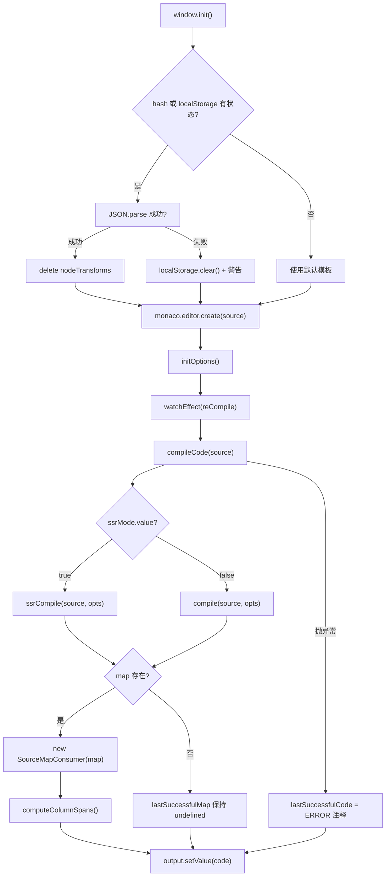
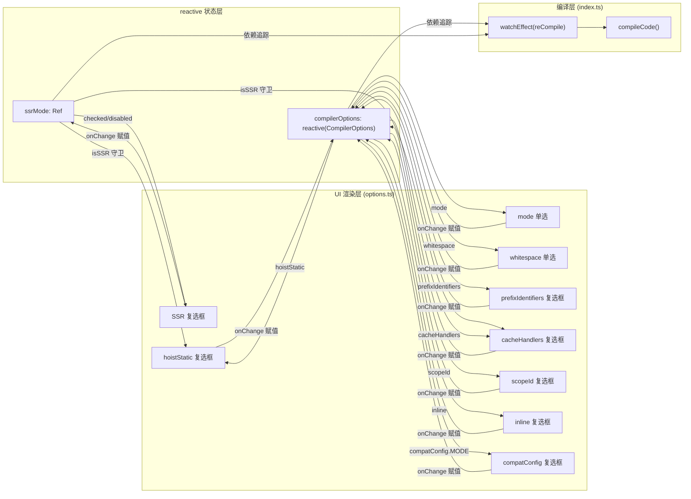

# Проект: vuejs/core

В предыдущей главе мы увидели, как SFC Playground упаковывает всю цепочку «ввод SFC → компиляция в браузере → предпросмотр в реальном времени» в чёрный ящик: разработчик видит конечный результат рендеринга, но не видит, что компилятор делает внутри. Когда в шаблоне написан пользовательский директив, или после включения hoistStatic в выводе внезапно появляется куча переменных _hoisted_1, Playground не может ответить на вопрос «почему компилятор сгенерировал именно так». Позиционирование Template Explorer прямо противоположно: он раскрывает результаты компиляции @vue/compiler-dom и @vue/compiler-ssr, AST, маркеры ошибок и сопоставление позиций от исходного кода к результату. Его суть — не «запуск», а «наблюдение». Эта глава построена вокруг трёх файлов: index.ts отвечает за вызов компиляции и двунаправленное сопоставление SourceMap, options.ts управляет десятками CompilerOptions через reactive и驱动 UI, theme.ts настраивает тему редактора Monaco.

# I. Вызов компиляции и двунаправленное сопоставление SourceMap: index.ts

## Интуитивная модель

Template Explorer`index.ts`похож на «двунаправленный переводчик»: слева вводится шаблон, справа выводится функция рендеринга. Но у него есть способность, которой нет у переводчика — когда вы ставите курсор на определённую строку слева, справа подсвечивается соответствующий результат; и наоборот, если поставить курсор справа, слева подсвечивается соответствующий шаблон. Без сопоставления SourceMap этот инструмент выродился бы в два текстовых поля рядом, и разработчику пришлось бы сравнивать их глазами, не имея возможности построить причинно-следственную цепочку «строка шаблона → строка результата».

## Структуры данных и размещение в памяти

`index.ts`Внутри нет сложных Struct, но есть несколько ключевых модульных переменных состояния, которые определяют поведение всего инструмента:

`lastSuccessfulCode`и`lastSuccessfulMap`— это кэш результата компиляции[FACT:packages-private/template-explorer/src/index.ts:74-75]. Первый — строка, второй —`SourceMapConsumer | undefined`. Обратите внимание:`lastSuccessfulMap`изначально`undefined`, и присваивается только при успешной компиляции и наличии`map`[FACT:packages-private/template-explorer/src/index.ts:99-100]. Это`undefined`состояние является защитным условием для всей последующей логики сопоставления курсора — если компиляция не удалась, функция сопоставления автоматически молча отключается, а не выбрасывает исключение.

`PersistedState`Интерфейс определяет форму состояния, сохраняемого в localStorage и URL hash[FACT:packages-private/template-explorer/src/index.ts:26-30]：`src`(исходный код шаблона),`ssr`(режим SSR или нет),`options`(опции компилятора). Здесь есть ключевое проектное решение:`options`имеет тип полного`CompilerOptions`, но при фактическом сохранении сохраняются только «элементы, отличающиеся от значений по умолчанию», и эта логика обрезки выполняется в`reCompile`

`sharedEditorOptions`— это общие опции конструктора для двух редакторов[FACT:packages-private/template-explorer/src/index.ts:26-30]：`fontSize: 14`、`scrollBeyondLastLine: false`、`renderWhitespace: 'selection'`、`minimap.enabled: false`. Minimap отключён, потому что шаблон и результат обычно занимают всего несколько десятков строк, и minimap только занимает горизонтальное пространство.

## Step-by-Step Walkthrough

**Сценарий: пользователь открывает страницу, вводит`
{{ msg }}
`, затем перемещает курсор.**

**Шаг первый: инициализация и восстановление состояния.** `window.init`— это глобальная точка входа[FACT:packages-private/template-explorer/src/index.ts:41]. Сначала она регистрирует и активирует пользовательскую тему[FACT:packages-private/template-explorer/src/index.ts:44-45], затем пытается восстановить состояние из URL hash или localStorage[FACT:packages-private/template-explorer/src/index.ts:49-56]. Обратите внимание на порядок декодирования: сначала`atob`, затем`escape`, потом`decodeURIComponent`. Если разбор hash не удался, происходит fallback к`localStorage.getItem('state')`, затем fallback к`{}`. Если весь JSON.parse не удался, localStorage очищается и выводится предупреждение[FACT:packages-private/template-explorer/src/index.ts:57-64]。

После восстановления состояния есть легко упускаемая деталь:`delete persistedState.options?.nodeTransforms` [FACT:packages-private/template-explorer/src/index.ts:69]. Комментарий объясняет причину — функции не могут быть сериализованы, поэтому при сохранении`nodeTransforms`теряется, и при восстановлении остаточный пустой объект может привести к аномальному поведению компилятора. Это классическая ловушка «сохранения несериализуемых полей».

**Шаг второй: ядро компиляции`compileCode`。**Это сердце всего инструмента[FACT:packages-private/template-explorer/src/index.ts:76-106]. Сначала он`console.clear()`, затем в зависимости от`ssrMode.value`выбирает`ssrCompile`или`compile` [FACT:packages-private/template-explorer/src/index.ts:80]. Обратите внимание на параметры вызова`compileFn`: разворачивается`compilerOptions`, принудительно`filename: 'ExampleTemplate.vue'`、`sourceMap: true`, и внедряется`onError`callback для сбора ошибок[FACT:packages-private/template-explorer/src/index.ts:82-89]。

Здесь есть проектное решение:`filename`жёстко задан как`'ExampleTemplate.vue'`. Это значение в последующих вызовах`generatedPositionFor`должно точно совпадать[FACT:packages-private/template-explorer/src/index.ts:189], иначе запрос SourceMap вернёт пустой результат. Это неявный контракт — две строки должны совпадать, но никакая система типов это не гарантирует.

После завершения компиляции ошибки преобразуются в формат marker Monaco и устанавливаются в редактор[FACT:packages-private/template-explorer/src/index.ts:91-95]。`formatError`преобразует`CompilerError`из`loc`в Monaco`startLineNumber/startColumn/endLineNumber/endColumn` [FACT:packages-private/template-explorer/src/index.ts:108-119]. Обратите внимание`errors.filter(e => e.loc)`— только ошибки с информацией о позиции будут помечены, ошибки без`loc`(например, ошибки глобальной конфигурации) выводятся только в консоль.

**Шаг третий: построение SourceMap.**После успешной компиляции,`lastSuccessfulMap = new SourceMapConsumer(map!)` [FACT:packages-private/template-explorer/src/index.ts:99], сразу за этим вызывается`computeColumnSpans()` [FACT:packages-private/template-explorer/src/index.ts:100]。`computeColumnSpans`— это`source-map-js`ключевой API`generatedPositionFor`: он предвычисляет диапазон столбцов каждого сегмента сопоставления, делая доступным поле`lastColumn`, возвращаемое

**. Без этого шага обратное сопоставление может определить только начальный столбец и не может подсветить весь диапазон токена.**Шаг четвёртый: двунаправленное сопоставление курсора.**Когда пользователь в**редакторе исходного кода`editor.onDidChangeCursorPosition` [FACT:packages-private/template-explorer/src/index.ts:184]перемещает курсор, срабатывает`lastSuccessfulMap.generatedPositionFor({ source: 'ExampleTemplate.vue', line, column: column - 1 })` [FACT:packages-private/template-explorer/src/index.ts:188-192]. После debounce в 100 мс callback вызывает`column - 1`. Обратите внимание`pos`: номера столбцов в Monaco начинаются с 1, а в SourceMap — с 0. Возвращённый`line`, если содержит`column`и[FACT:packages-private/template-explorer/src/index.ts:194-206], создаёт декоратор в выходном редакторе для подсветки соответствующего диапазона[FACT:packages-private/template-explorer/src/index.ts:207-210]。

, и прокручивает к этой позиции`output.onDidChangeCursorPosition`Обратное сопоставление находится в[FACT:packages-private/template-explorer/src/index.ts:223]`originalPositionFor` [FACT:packages-private/template-explorer/src/index.ts:227-230]. Оно вызывает`pos.line === 1 && pos.column === 0`«mock location»[FACT:packages-private/template-explorer/src/index.ts:231-237]. Этот guard критически важен — некоторые фрагменты кода, генерируемые компилятором (например,`import`операторы или helper-функции), не имеют соответствующей позиции в шаблоне, и SourceMap возвращает`{ line: 1, column: 0 }`в качестве заполнителя. Если их не игнорировать, курсор на этих строках будет ошибочно подсвечивать первую строку шаблона.

**Шаг пятый: сохранение состояния.** `reCompile`не только запускает компиляцию, но и отвечает за запись текущего состояния в localStorage и URL hash[FACT:packages-private/template-explorer/src/index.ts:121-146]. При сохранении есть логика обрезки: перебирается`compilerOptions`, сохраняются только элементы, которые «не являются объектами и не равны значению по умолчанию»[FACT:packages-private/template-explorer/src/index.ts:125-133]. Это объясняет, почему`bindingMetadata`опции объектного типа не сохраняются — они слишком сложны, а значений по умолчанию достаточно для демонстрации.

## Размышления о дизайне и подводные камни в продакшене

**Почему используется`source-map-js`, а не`source-map`？** `source-map`— это оригинальная библиотека Mozilla, большая по размеру и зависящая от WASM (в новых версиях).`source-map-js`— это чистая JS-реализация, компактная и подходящая для браузерной среды. Template Explorer как чисто фронтенд-инструмент, выбор`source-map-js`обоснован[FACT:packages-private/template-explorer/package.json:15]。

**Выбор задержки debounce.**В редакторе исходного кода debounce по умолчанию 300 мс[FACT:packages-private/template-explorer/src/index.ts:271], а debounce перемещения курсора — 100 мс[FACT:packages-private/template-explorer/src/index.ts:215]. Эта разница намеренная: компиляция — тяжёлая операция, 300 мс предотвращают частые срабатывания; перемещение курсора — лёгкая операция, 100 мс обеспечивают отзывчивость. Но 100 мс всё ещё может вызывать мерцание подсветки при быстром перемещении курсора — это приемлемый компромисс.

**`window.init`Глобальное монтирование**. Обратите внимание,`window.init`и`window.monaco`оба привязаны к глобальному[FACT:packages-private/template-explorer/src/index.ts:19-23]. Это связано с тем, что редактор Monaco асинхронно загружается через CDN`loader.js`, и после завершения загрузки вызывается`window.init`. Этот паттерн «глобального колбэка» — стандартный способ использования Monaco в немодульной среде, но он плохо сочетается с современными ESM-сборками.

---

# II. Панель опций на основе reactive: options.ts

## Интуитивная модель

`options.ts`похож на «панель управления»: сверху более десятка переключателей и радиокнопок, каждая соответствует определённому поведению компилятора. Переключение любого из них мгновенно меняет результат компиляции справа. Без этого модуля разработчикам пришлось бы менять параметры вызова`compile`в исходном коде и перекомпилировать, не имея возможности сравнивать эффекты разных опций в реальном времени.

## Структура данных и размещение в памяти

`options.ts`Ядро

`ssrMode`— это`ref(false)` [FACT:packages-private/template-explorer/src/options.ts:5]. Он независим от`compilerOptions`, поскольку режим SSR переключает саму функцию компиляции (`compile` vs `ssrCompile`), а не опции компиляции.

`defaultOptions`— это полный объект`CompilerOptions`.[FACT:packages-private/template-explorer/src/options.ts:5-27]. Он определяет значения по умолчанию для всех опций, включая`mode: 'module'`、`prefixIdentifiers: false`、`hoistStatic: false`、`cacheHandlers: false`、`scopeId: null`、`inline: false`、`ssrCssVars: '{ color }'`、`compatConfig: { MODE: 3 }`、`whitespace: 'condense'`, а также`bindingMetadata` [FACT:packages-private/template-explorer/src/options.ts:18-26]。

`compilerOptions`, содержащий 7 типов привязок.`reactive(Object.assign({}, defaultOptions))` [FACT:packages-private/template-explorer/src/options.ts:29-31]— это`Object.assign({}, ...)`. Обратите внимание, здесь используется`reactive(defaultOptions)`для поверхностного копирования — если напрямую`compilerOptions`, изменение`defaultOptions`загрязнит`reCompile`, что приведёт к неработоспособности логики «сравнения со значением по умолчанию» в

## Step-by-Step Walkthrough

**Сценарий: пользователь кликает по чекбоксу «hoistStatic».**

**Шаг первый: рендеринг UI.** `App`Компонент`setup`возвращает функцию рендеринга[FACT:packages-private/template-explorer/src/options.ts:33-35]. Эта функция рендеринга читает`ssrMode.value`、`compilerOptions.mode`、`compilerOptions.prefixIdentifiers`и другие реактивные состояния[FACT:packages-private/template-explorer/src/options.ts:36-39], поэтому при изменении этих состояний весь UI перерисовывается.

**Шаг второй: привязка checked чекбокса.** `hoistStatic`Свойство`checked`чекбокса — это`compilerOptions.hoistStatic && !isSSR` [FACT:packages-private/template-explorer/src/options.ts:150]. Здесь есть логика: в режиме SSR`hoistStatic`принудительно отображается как невыбранный, поскольку SSR-компиляция не поддерживает статический hoisting. В то же время`disabled: isSSR` [FACT:packages-private/template-explorer/src/options.ts:151]гарантирует, что пользователь не сможет переключить его в режиме SSR.

**Шаг третий: обработка onChange.**Когда пользователь кликает по чекбоксу,`onChange`вызывает[FACT:packages-private/template-explorer/src/options.ts:152-156], напрямую присваивая`e.target.checked`в`compilerOptions.hoistStatic`. Поскольку`compilerOptions`является`reactive`, это присваивание запускает отслеживание зависимостей, что в свою очередь вызывает`watchEffect(reCompile)` [FACT:packages-private/template-explorer/src/index.ts:266]и в итоге перекомпиляцию.

**Шаг четвёртый: взаимосвязь опций.**Обратите внимание,`cacheHandlers`для`checked`— это`usePrefix && compilerOptions.cacheHandlers && !isSSR` [FACT:packages-private/template-explorer/src/options.ts:166]，`disabled`— это`!usePrefix || isSSR` [FACT:packages-private/template-explorer/src/options.ts:167]. Это означает, что`cacheHandlers`зависит от`prefixIdentifiers`или`mode === 'module'`. Эта взаимосвязь проявляется в UI так: когда`prefixIdentifiers`не включён и режим —`function`,`cacheHandlers`чекбокс отключён.

`scopeId`Взаимосвязь`disabled: !isModule` [FACT:packages-private/template-explorer/src/options.ts:182]，`checked: isModule && compilerOptions.scopeId` [FACT:packages-private/template-explorer/src/options.ts:183]сложнее:`isModule`. Только в режиме module можно установить scopeId, и при onChange, если`null` [FACT:packages-private/template-explorer/src/options.ts:184-189]。

**равно false, принудительно устанавливается** `initOptions`Шаг пятый: монтирование.`createApp(App).mount(document.getElementById('header')!)` [FACT:packages-private/template-explorer/src/options.ts:232-234]вызывается`vue`. Обратите внимание, здесь используется`createApp`из пакета`@vue/runtime-dom`, а не`options.ts`— потому что`vue`— это код прикладного уровня, который может напрямую зависеть от полного пакета

## Размышления о дизайне и подводные камни в продакшене

**Почему используется`reactive`, а не`ref`？** `compilerOptions`— это объект с более чем десятком полей, использование`reactive`позволяет напрямую`compilerOptions.hoistStatic = true`, без необходимости`compilerOptions.value.hoistStatic = true`. Это лаконичнее в UI-коде. Но цена`reactive`в том, что деструктуризация теряет реактивность — в исходном коде нет никакой деструктуризации, всё доступно через`compilerOptions.xxx`, и это правильное использование.

**`bindingMetadata`Дизайн значений по умолчанию**Значения по умолчанию[FACT:packages-private/template-explorer/src/options.ts:18-26]содержат 7 привязок`SETUP_CONST`、`SETUP_REF`、`SETUP_LET`、`SETUP_MAYBE_REF`、`PROPS`, охватывающих`prefixIdentifiers`пять типов. Это сделано для того, чтобы разработчик, открыв`$setup`, сразу увидел влияние разных типов привязок на способ доступа`prefixIdentifiers`в результате. Без этого значения по умолчанию

**`compatConfig`эффект был бы очень однообразным.** `compilerOptions.compatConfig!.MODE = 2` [FACT:packages-private/template-explorer/src/options.ts:216-220]Вложенная реактивность`reactive`Такое вложенное присваивание в`reactive`является реактивным, поскольку`compatConfig`рекурсивно проксирует вложенные объекты. Но обратите внимание, тип`CompatConfig | undefined`—`!`, поэтому используется утверждение`compatConfig`. Если бы в значениях по умолчанию не было

**`ssrMode`, здесь произошёл бы краш во время выполнения.`compilerOptions`Разделение ответственности** `ssrMode`и`ref`，`compilerOptions`—`reactive`это`ssr`— это`compilerOptions`. Почему бы не поместить`ssr`в`CompilerOptions`? Потому что

---

# не является полем

## — он определяет, какую функцию компиляции использовать, а не параметры, передаваемые в функцию компиляции. Это разделение «состояния потока управления» и «состояния конфигурации» — ясный дизайн.

`theme.ts`Это как «сменить скин» для редактора: он определяет цвет и стиль шрифта для каждого синтаксического токена. Без этого модуля Monaco будет использовать тему по умолчанию`vs-dark`Тема хоть и работает, но HTML-теги, выражения и директивы в шаблонах Vue будут лишены визуального различения, и разработчику будет трудно быстро находить ключевые части.

## Структура данных и размещение в памяти

`theme.ts`Экспортируется объект, соответствующий интерфейсу Monaco`IStandaloneThemeData`интерфейсу[FACT:packages-private/template-explorer/src/theme.ts:1-244]. У него есть три поля верхнего уровня:

`base: 'vs-dark'`Указывает базовую тему[FACT:packages-private/template-explorer/src/theme.ts:2]，`inherit: true`Обозначает правила наследования базовой темы[FACT:packages-private/template-explorer/src/theme.ts:3]. Это означает, что нужно определять только различия, а неопределённые токены будут fallback к`vs-dark`。

`rules`— это массив, каждый элемент которого содержит`token`(имя токена Monaco) и`foreground`/`background`/`fontStyle` [FACT:packages-private/template-explorer/src/theme.ts:4-235]. Этот массив содержит более 50 записей и охватывает такие типы токенов, как number, comment, keyword, string, variable, entity.name.tag и другие.

`colors`Определяет цвета UI редактора[FACT:packages-private/template-explorer/src/theme.ts:236-243]：`editor.foreground`、`editor.background`、`editor.selectionBackground`、`editor.lineHighlightBackground`、`editorCursor.foreground`、`editorWhitespace.foreground`。

## Step-by-Step Walkthrough

**Сценарий: регистрация темы при загрузке страницы.**

**Шаг первый: определение темы.** `monaco.editor.defineTheme('my-theme', theme)` [FACT:packages-private/template-explorer/src/index.ts:44]. Этот вызов регистрирует`theme.ts`экспортируемый объект в реестре тем Monaco под ключом`'my-theme'`。

**Шаг второй: активация темы.** `monaco.editor.setTheme('my-theme')` [FACT:packages-private/template-explorer/src/index.ts:45]. Эта строка кода должна вызываться после`defineTheme`, иначе будет выброшена ошибка «тема не определена».

**Шаг третий: сопоставление токенов.**Когда Monaco рендерит код шаблона, он токенизирует код с помощью языковой службы HTML, а затем ищет по имени токена правила в`rules`. Например,`
`в`div`будет помечен как`entity.name.tag`, сопоставится с`foreground: 'cc6666'` [FACT:packages-private/template-explorer/src/theme.ts:41-44]и отобразится красным.

## Проектные соображения и подводные камни в продакшене

**Почему используется`inherit: true`？**Если не наследовать, придётся определять цвета всех токенов, включая те, которые не встречаются в шаблоне (например,`markup.heading`、`meta.diff`). Наследование позволяет файлу темы сосредоточиться только на токенах, реально встречающихся в шаблоне и JS-выходе.

**Иерархическое сопоставление имён токенов.**Сопоставление токенов в Monaco основано на префиксах:`entity.name.tag`будет соответствовать`entity.name.tag.html`、`entity.name.tag.css`и т. д. В исходном коде одновременно определены`entity.name.tag` [FACT:packages-private/template-explorer/src/theme.ts:41-44]и`entity.name.tag.css` [FACT:packages-private/template-explorer/src/theme.ts:169-172], причём последний перекрывает первый в специфичных для CSS сценариях.

**`colors`Разделение обязанностей между`rules`и** `rules`управляет цветом текста кода,`colors`управляет цветами UI редактора (фон, курсор, выделенная строка). Они независимы, но должны визуально согласовываться. В исходном коде`editor.background: '#1D1F21'`и`base: 'vs-dark'`близки к фону по умолчанию, чтобы сохранить визуальную согласованность.

---

# Проектное соображение: инженерные компромиссы визуального зонда

Ключевое различие между Template Explorer и SFC Playground — это «гранулярность наблюдения». Playground наблюдает за тем, «может ли скомпилированный целиком SFC запуститься», а Template Explorer наблюдает за тем, «во что компилируется отдельное выражение шаблона». Это различие определяет технический выбор обоих инструментов:

**Введение SourceMapConsumer неизбежно.**Без него разработчик мог бы лишь визуально сравнивать исходный код и результат и не мог бы построить точное сопоставление «строка N → строка M». Но API SourceMapConsumer асинхронный (новые версии возвращают Promise), а в исходном коде используется синхронная версия`source-map-js`, чтобы упростить логику вызова.

**`reactive`Управление опциями — естественный выбор для экосистемы Vue.**Если вручную управлять синхронизацией состояния десятков опций через нативные DOM-события, объём кода удвоится.`reactive`Отслеживание зависимостей в`watchEffect(reCompile)`позволяет автоматизировать цепочку «изменение опции → повторная компиляция», и одна строка кода выполняет подписку.

**Глобальный режим загрузки Monaco — это исторический багаж.** `window.monaco`Глобальный способ монтирования`window.init`и

---

# Краткое содержание главы

Template Explorer — это «белый ящик-зонд»: он не запускает результат компиляции, а только показывает процесс компиляции.`index.ts`Через`compileCode`вызывается`@vue/compiler-dom`или`@vue/compiler-ssr`, с помощью`SourceMapConsumer`строится двустороннее сопоставление исходного кода и результата, а через API декораторов Monaco реализуется синхронная подсветка по курсору.`options.ts`С помощью`reactive`управляются`CompilerOptions`, через`watchEffect`запускается повторная компиляция, а взаимосвязи между опциями (например, отключение`hoistStatic`при SSR) явно закодированы на уровне UI.`theme.ts`Настраивается тема Monaco, чтобы синтаксические токены шаблона и результата имели чёткое визуальное различие.

Основная ценность этого инструмента в том, чтобы «с помощью инструмента обратно выводить поведение компилятора»: когда вы не уверены, что`hoistStatic`делает с некоторым шаблоном, откройте Template Explorer, переключайте опции и наблюдайте за изменениями результата. Это нагляднее, чем читать исходный код компилятора, и надёжнее, чем догадываться.

# Вопросы для размышления и самопроверки в этой главе

Q1: Если удалить`index.ts`в`originalPositionFor`mock location guard (`pos.line === 1 && pos.column === 0`), в каком сценарии это приведёт к ошибочной подсветке? Почему компилятор генерирует такое сопоставление, как`{ line: 1, column: 0 }`?

**Справочное объяснение**: guard находится в[FACT:packages-private/template-explorer/src/index.ts:231-237]. При генерации результата компилятор вставляет некоторый код, не имеющий соответствующей позиции в шаблоне, например импорт helper-функций вроде`import { createElementVNode as _createElementVNode } from 'vue'`или сигнатуры функций вроде`export function render(_ctx, _cache) { ... }`. У этого кода нет исходной позиции в SourceMap,`source-map-js`вернёт`{ line: 1, column: 0 }`в качестве заполнителя. Если удалить guard, то когда пользователь поставит курсор на эти строки,`originalPositionFor`вернёт`{ line: 1, column: 0 }`, код будет считать это допустимой позицией и создаст декоратор подсветки в первой строке и первом столбце редактора исходного кода. В результате: когда пользователь нажимает на строку артефакта`import`, первая строка редактора исходного кода ошибочно подсвечивается, что вводит в заблуждение. Суть этой защиты — «различать реальное сопоставление и заполнитель», а`{ line: 1, column: 0 }`— это`source-map-js`согласованное сигнальное значение «нет сопоставления».

Q2: `reCompile`при параметрах персистентности условие`typeof val !== 'object' && val !== defaultOptions[key]`пропускает параметры всех типов объектов. Если`bindingMetadata`изменён пользователем (например, через консоль), после обновления страницы это изменение будет потеряно. Это баг или намеренное решение? Если нужно поддерживать`bindingMetadata`в персистентности, какие проблемы потребуется решить?

**Справочный разбор**: условие находится в[FACT:packages-private/template-explorer/src/index.ts:129]. Это намеренное решение по трём причинам: во-первых,`bindingMetadata`значение — это`BindingTypes`перечисление, после сериализации это число, и при десериализации невозможно отличить «пользователь явно установил 0» от «значения по умолчанию»; во-вторых,`compatConfig`— это вложенный объект,`val !== defaultOptions[key]`сравнивает ссылки, всегда true, что приведёт к персистентности всех объектных параметров; в-третьих,`nodeTransforms`содержит функции, которые невозможно сериализовать, в исходном коде уже через`delete persistedState.options?.nodeTransforms`обрабатывается[FACT:packages-private/template-explorer/src/index.ts:69]. Если нужно поддерживать`bindingMetadata`, потребуется реализовать глубокое сравнение (а не сравнение ссылок), а также обработку сериализации/десериализации значений перечислений. Более фундаментальная проблема:`bindingMetadata`не имеет точки редактирования в UI, пользователь может изменить только через консоль, и такое изменение само по себе не должно сохраняться.

Q3: `options.ts`в`compilerOptions`создаётся с помощью`reactive(Object.assign({}, defaultOptions))`. Если изменить`Object.assign({}, defaultOptions)`на прямое`reactive(defaultOptions)`, что произойдёт после того, как пользователь переключит параметр и обновит страницу? Почему?

**Справочный разбор**：`Object.assign({}, defaultOptions)`— это поверхностная копия, находится в[FACT:packages-private/template-explorer/src/options.ts:29-31]. Если изменить на`reactive(defaultOptions)`，`compilerOptions`и`defaultOptions`будут указывать на один и тот же объект. Когда пользователь переключит`hoistStatic`в true,`compilerOptions.hoistStatic`станет true, и одновременно`defaultOptions.hoistStatic`тоже станет true. Затем логика персистентности в`reCompile`[FACT:packages-private/template-explorer/src/index.ts:129]сравнит`val !== defaultOptions[key]`, в этот момент`val`и`defaultOptions[key]`оба true, условие false, и этот параметр не будет сохранён в localStorage. После обновления страницы`defaultOptions`будет заново инициализирован как`hoistStatic: false`, изменение пользователя потеряно. Что ещё серьёзнее, после загрязнения`defaultOptions`вся последующая логика «сравнения со значением по умолчанию» перестанет работать, что приведёт к полному краху функциональности персистентности. Коварство этого бага в том, что в рамках одной сессии всё нормально, и только после обновления его можно обнаружить.

---

В следующей главе мы перейдём к`scripts/release.js`, чтобы увидеть, как Vue с помощью одного интерактивного конечного автомата оркестрирует весь процесс обновления версии, сборки, тестирования, Git-коммита, создания тега и npm publish. В отличие от «наблюдения» в Template Explorer, release.js — это «исполнение»: ему нужно поддерживать состояние между несколькими шагами, обрабатывать откат при сбое и находить баланс между интерактивным подтверждением и автоматизацией.

Через Template Explorer мы освоили, как превратить внутреннее состояние компилятора — AST, артефакты компиляции, SourceMap — в интерактивные визуализационные зонды, тем самым превращая «почему компилятор генерирует именно так» из догадки в наблюдение. Этот точный контроль и оркестрация внутреннего состояния также проявляются в процессе релиза Vue: в следующей главе мы углубимся в scripts/release.js и посмотрим, как конечный автомат более чем на 500 строк с помощью parseArgs разбирает более десяти флагов, через enquirer интерактивно подтверждает номер версии и последовательно запускает сборку, тестирование, Git-коммит, создание тега и npm publish, раскрывая полный поток состояний и стратегию отката при сбое за одним официальным релизом.
