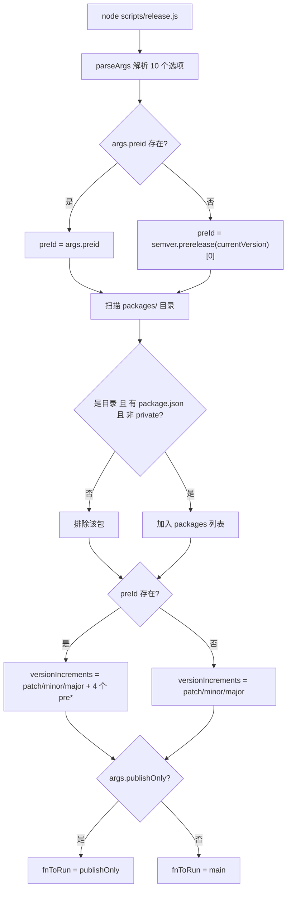
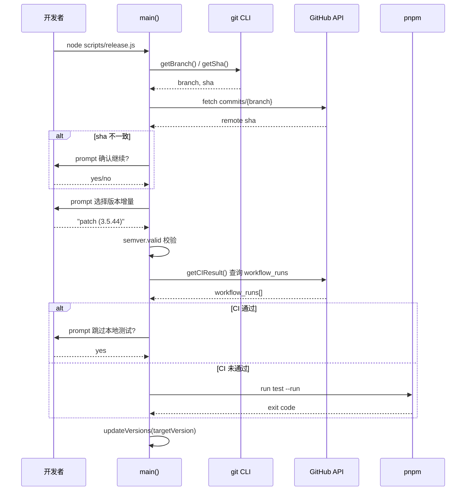
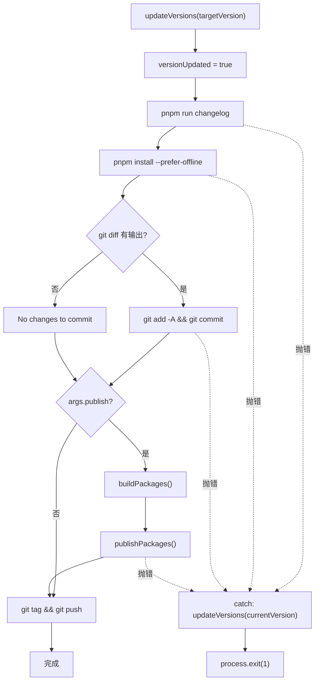

# Глава 9: Автоматизация релиза: конечный автомат и интерактивная оркестрация в release.js

В предыдущей главе мы с помощью template-explorer восстановили поведение компилятора и освоили методологию наблюдения за внутренними механизмами с помощью инструментов. Теперь переведём взгляд с времени компиляции на время релиза — это самый опасный момент для любого open-source проекта: он одновременно затрагивает четыре необратимые внешние системы: номер версии, артефакты сборки, историю Git и npm registry. Ошибочный npm publish невозможно отозвать, ошибочный push тега загрязнит разрешение зависимостей всех downstream-пользователей. Vue core использует scripts/release.js из 537 строк, чтобы укротить эту опасность — это не чисто автоматизированный скрипт и не чисто ручной чек-лист, а интерактивный конечный автомат: останавливается и спрашивает человека в ключевых точках, полностью автоматически выполняет предсказуемые шаги и при сбое на любом шаге откатывает номер версии к исходному. В этой главе мы разберём три ключевых механизма этого оркестратора: разбор аргументов и инициализацию состояния, интерактивное решение о версии и CI-гейт, а также порядок релиза и откат при сбое.

# Разбор аргументов и инициализация глобального состояния

## Интуитивная модель

Представьте`release.js`как панель управления старой стиральной машины: ручка (`parseArgs`Раскладка флагов и глобального состояния в памяти

## 标志位与全局状态的内存布局

> **[Design Inference & Architectural Trade-offs]**
> Первое, что делает скрипт после запуска, — разбирает аргументы командной строки в структурированный объект. Здесь используется встроенный в Node`parseArgs`, а не`yargs`или`commander`— это сделано для устранения сторонних зависимостей, поскольку сам скрипт публикации должен запускаться в любом окружении, даже если`node_modules`установлен наполовину.

[FACT:scripts/release.js:27-62]определяет 10 опций, которые можно разделить на четыре категории:

- **Категория семантики версии**：`preid`(идентификатор предварительного выпуска, например`alpha`/`beta`/`rc`）、`tag`（npm dist-tag）
- **Категория пропуска**：`skipBuild`、`skipTests`、`skipGit`、`skipPrompts`— эти четыре булевых переключателя образуют «регуляторы степени автоматизации»
- **Категория режима выполнения**：`dry`(холостой прогон),`publish`(публиковать ли напрямую локально),`publishOnly`(только публикация без обновления версии)
- **Категория цели**：`registry`(пользовательский адрес registry)

Обратите внимание:`publish`значение по умолчанию —`false` [FACT:scripts/release.js:51-54], а у других булевых параметров нет значения по умолчанию (то есть`undefined`). Эта асимметрия намеренна:`publish`семантика — «выполнять ли npm publish локально», по умолчанию не публиковать, передавая действие публикации GitHub Actions; а`skipXxx`по умолчанию`undefined`означает «не указано», и последующая логика будет различать «пользователь явно передал`--skipTests`» и «пользователь не передал».

После завершения разбора скрипт раскладывает параметры на набор переменных уровня модуля[FACT:scripts/release.js:64-66]：

```js
const preId = args.preid || semver.prerelease(currentVersion)?.[0]
const isDryRun = args.dry
let skipTests = args.skipTests
const skipBuild = args.skipBuild
const skipPrompts = args.skipPrompts
const skipGit = args.skipGit
```

Здесь есть два интересных момента проектирования. Во-первых,`preId`приоритет значения — «явно указано в командной строке > выведено из текущего номера версии»[FACT:scripts/release.js:64-66]. Если текущая`package.json`версия —`3.5.0-beta.1`, то`semver.prerelease`вернёт`['beta', 1]`, взяв`[0]`, получим`'beta'`. Это означает, что при последовательных выпусках в ветке beta не нужно каждый раз вводить`--preid beta`. Во-вторых,`skipTests`объявлена через`let`, а остальные через`const` [FACT:scripts/release.js:64-66], потому что она в`runTestsIfNeeded`динамически перезаписывается результатом CI — это состояние «отложенного решения».

Сразу за этим идёт логика обнаружения пакетов[FACT:scripts/release.js:68-83]: читается каталог`packages/`, отфильтровываются не-каталоги, элементы без`package.json`, а также пакеты`private: true`. Обратите внимание, что здесь читается`packages/`, а не`packages-private/`— последний является внутренним отладочным пакетом и никогда не публикуется.

## Алгоритм сортировки порядка публикации

[FACT:scripts/release.js:85-85]определяет функцию, которая кажется простой, но критически важна:

```js
const sortPackagesForPublishing = (packageNames) => [
  ...packageNames.filter(p => p !== 'vue'),
  ...packageNames.filter(p => p === 'vue'),
]
```

Она ставит входной пакет`vue`в конец. Комментарий[FACT:scripts/release.js:85-85]объясняет причину: если сначала опубликовать`vue`, пользователи смогут установить новую версию`@vue/runtime-core`, пока внутренние пакеты вроде`vue`ещё не выложены, и npm выдаст ошибку из-за отсутствия подходящей внутренней зависимости. Это компромиссное решение «атомарности публикации» в экосистеме npm — в npm нет межпакетных транзакций, и атомарность можно лишь приблизить порядком.

## Динамическое построение набора кандидатов приращения версии

[FACT:scripts/release.js:111-116]строит варианты для интерактивного меню:

```js
const versionIncrements = [
  'patch', 'minor', 'major',
  ...(preId ? ['prepatch', 'preminor', 'premajor', 'prerelease'] : []),
]
```

Это условное раскрытие: только когда`preId`существует (то есть текущий канал — предварительный выпуск или пользователь явно указал`--preid`), в меню добавляются типы приращения, связанные с предварительным выпуском. Если текущая версия стабильная`3.5.43`и`preid`не указан, в меню остаются только`patch/minor/major`три пункта — чтобы пользователь по ошибке не превратил стабильную версию в такой половинчатый предварительный выпуск, как`3.5.44-0`.

`inc`Функция[FACT:scripts/release.js:120-120]инкапсулирует`semver.inc`, передавая`preId`третьим аргументом. Здесь есть защита типов:`typeof preId === 'string' ? preId : undefined`— потому что`preId`может быть`string | undefined`, а`semver.inc`ожидает`string | undefined`, это тернарное выражение нужно для сужения типов TS.

## Примитивы выполнения: двухрельсовая система run и dryRun

[FACT:scripts/release.js:122-123]— один из самых изящных приёмов во всей главе:

```js
const run = async (bin, args, opts = {}) =>
  exec(bin, args, { stdio: 'inherit', ...opts })
const dryRun = async (bin, args, opts = {}) =>
  console.log(pico.blue(`[dryrun] ${bin} ${args.join(' ')}`), opts)
const runIfNotDry = isDryRun ? dryRun : run
```

`run`устанавливает stdio дочернего процесса в`inherit`, позволяя выводу сборки/тестов напрямую проходить в терминал — это критически важно для длительных сборок, пользователь видит прогресс в реальном времени.`dryRun`же только печатает команду, не выполняя её.`runIfNotDry`— это «выбор стратегии»: при загрузке модуля указатель функции привязывается к`dryRun`или`run`, и всем последующим точкам вызова больше не нужно проверять`isDryRun`。

> **[Design Inference & Architectural Trade-offs]**
> Такой шаблон «решить стратегию при инициализации» менее подвержен ошибкам, чем «проверять в каждой точке вызова»: если какая-то точка вызова забудет проверить`isDryRun`, в режиме dry run побочный эффект действительно выполнится. А`runIfNotDry`концентрирует проверку в одном месте, устраняя возможность таких пропусков.



---

# Интерактивное решение по версии и CI-шлюз

## Интуитивная модель

Этот этап похож на досмотр в аэропорту: сначала сверяют ваш посадочный талон (синхронизирован ли локальный commit с удалённым), затем подтверждают, куда вы летите (номер версии), и наконец проверяют, прошли ли вы досмотр (прошёл ли CI). Если любой из этапов не пройден, весь процесс останавливается. Без этого шлюза локальный commit, который не был отправлен, может получить tag и быть опубликован, из-за чего исходный код версии на npm вообще не будет существовать на GitHub — это самая трудно диагностируемая авария при публикации.

## Проверка синхронизации и выбор версии

`main`Первое, что делает функция`isInSyncWithRemote()` [FACT:scripts/release.js:141-141], — это[FACT:scripts/release.js:337-363]. Логика этой функции`git rev-parse HEAD`такова: берётся имя текущей ветки, запрашивается GitHub API для получения SHA последнего commit этой ветки и сравнивается с локальным[FACT:scripts/release.js:348-355]. Если они не совпадают, появляется диалог подтверждения с красным предупреждением`false`, позволяя пользователю решить, продолжать ли. Если запрос к API не удался (проблемы с сетью, нет token), то сразу возвращается[FACT:scripts/release.js:365-367]。

> **[Design Inference & Architectural Trade-offs]**
> 〔Проектирование, выводы и архитектурные компромиссы〕

Здесь философия проектирования — «сбой означает остановку»: при сетевой аномалии лучше не публиковать, чем рисковать и продолжать в неизвестном состоянии. Потому что публикация необратима, а стоимость повторного запуска скрипта очень низка.`node scripts/release.js 3.6.0`），`targetVersion`Определение номера версии идёт двумя путями. Если пользователь передал позиционный аргумент в командной строке (например[FACT:scripts/release.js:141-141], берётся это значение[FACT:scripts/release.js:152-176]. Иначе открывается интерактивное меню`custom`: сначала пользователь выбирает тип приращения, а если выбран

, появляется ещё одно поле ввода, чтобы пользователь вручную ввёл номер версии.[FACT:scripts/release.js:174]Обратите внимание на строку

```js
targetVersion = release.match(/\((.*)\)/)?.[1] ?? ''
```

Формат пункта меню —`patch (3.5.44)`, и это регулярное выражение извлекает фактический номер версии из скобок. Если пользователь выбрал`custom`, идёт другая ветка[FACT:scripts/release.js:164-172]。

Затем есть логика «повторного разбора»[FACT:scripts/release.js:178-182]: если`targetVersion`оказывается`patch`/`minor`Такие инкрементальные ключевые слова (пользователь может напрямую передать`node release.js minor`), вызывается`inc`чтобы преобразовать его в конкретный номер версии. В конце используется`semver.valid`для проверки[FACT:scripts/release.js:184-186], недопустимый номер версии сразу вызывает ошибку.

## CI-гейт: трёхсостоятельная логика runTestsIfNeeded

Это самый сложный поток управления во всей главе.[FACT:scripts/release.js:281-317]в`runTestsIfNeeded`фактически представляет собой трёхсостоятельный решающий автомат:

**Состояние первое: пользователь явно передал`--skipTests`**。`skipTests`изначально установлен в`true`, сразу пропускается всё тело функции, выводится "Tests skipped."[FACT:scripts/release.js:314-316]。

**Состояние второе: не пропущено, и CI уже пройден**. Скрипт вызывает`getCIResult()` [FACT:scripts/release.js:319-335], который запрашивает GitHub Actions API, проверяя наличие workflow run с именем`ci`и`conclusion === 'success'`[FACT:scripts/release.js:319-335]. Если пройден, пользователю задаётся вопрос «CI пройден, пропустить локальные тесты?»[FACT:scripts/release.js:288-295]. Если пользователь включил`--skipPrompts`, локальные тесты автоматически пропускаются[FACT:scripts/release.js:296-298]。

**Состояние третье: не пропущено, и CI не пройден**. Если включён`--skipPrompts`, сразу выбрасывается ошибка[FACT:scripts/release.js:299-304]：

```js
throw new Error(
  'CI for the latest commit has not passed yet. ' +
    'Only run the release workflow after the CI has passed.',
)
```

Если не включён`--skipPrompts`, то`skipTests`остаётся`undefined`, попадает в последнюю ветку локальных тестов[FACT:scripts/release.js:307-313], выполняется`pnpm run test --run`。

Здесь есть тонкая деталь[FACT:scripts/release.js:285]：

```js
skipTests ||= isCIPassed
```

`||=`— это логическое присваивание: только когда`skipTests`является ложным значением (`undefined`или`false`) происходит присваивание`isCIPassed`. Это означает, что если пользователь явно передал`--skipTests`（`true`), эта строка не изменит его; если пользователь не передал (`undefined`), то устанавливается результат CI. Но сразу после[FACT:scripts/release.js:287-298]снова перезаписывается при прохождении CI — поэтому`||=`реальный эффект этой строки только «если CI не пройден, установить`skipTests`в`false`», тем самым заставляя последующую ветку`if (!skipTests)`выполнить локальные тесты.

> **[Design Inference & Architectural Trade-offs]**
> Эта логика обходит круг, по сути выражая: «CI пройден → можно пропустить локальные тесты (но спросить пользователя); CI не пройден → обязательно запустить локальные тесты (если пользователь явно не требует пропуска)». Использование`||=`с последующей перезаписью хоть и компактно, но плохо читаемо — типичный «запах кода», когда бит состояния изменяется в нескольких местах.



## Запись номеров версий: обход в updateVersions

[FACT:scripts/release.js:377-384]в`updateVersions`делает две вещи: обновляет корневой`package.json`, затем обходит все подпакеты, вызывая`updatePackage`。`updatePackage` [FACT:scripts/release.js:391-398]для чтения JSON, изменения`name`и`version`, записи обратно через`JSON.stringify(pkg, null, 2) + '\n'`— обратите внимание на`\n`в конце, это для сохранения завершающего перевода строки в файле, чтобы git diff не показывал "No newline at end of file".

`getNewPackageName`Параметр по умолчанию`keepThePackageName` [FACT:scripts/release.js:105], то есть имя пакета не изменяется. Этот параметр существует для поддержки сценария «переименование пакета при публикации в пользовательский registry» — хотя все текущие точки вызова передают значение по умолчанию, интерфейс оставляет возможность расширения.

---

# Порядок публикации, идемпотентность и откат при сбое

## Интуитивная модель

Этот этап похож на домино:`updateVersions`толкает первую костяшку (изменение номера версии), затем последовательно падают changelog, lockfile, commit, tag, publish. Если какая-то костяшка застревает на полпути, должен быть механизм, поднимающий уже упавшие костяшки — иначе репозиторий останется в половинчатом состоянии «номер версии изменён, но не опубликован».

## Идемпотентная публикация: isPackagePublished и обработка ошибок

> **[Design Inference & Architectural Trade-offs]**
> `publishPackage` [FACT:scripts/release.js:439-489]— ядро публикации. Сначала определяется dist-tag[FACT:scripts/release.js:442-451]: приоритетно используется`--tag`параметр, иначе выводится из ключевого слова`alpha`/`beta`/`rc`в номере версии. Обратите внимание, здесь используется`version.includes('alpha')`а не`semver.prerelease`— потому что номер версии может иметь вид`3.5.0-alpha.1`，`includes`достаточно простой и не даёт ложных срабатываний.

Перед публикацией есть проверка идемпотентности[FACT:scripts/release.js:453-458]：

```js
if (!isDryRun && (await isPackagePublished(packageName, version))) {
  console.log(pico.yellow(`Skipping already published: ${pkgVersion}`))
  alreadyPublishedPackages.push(pkgVersion)
  return
}
```

`isPackagePublished` [FACT:scripts/release.js:491-513]выполняет`npm view <pkg>@<version> version`, при успехе возвращает`true`, при ошибке типа E404 возвращает`false`. Смысл этой проверки в том, что процесс публикации может перезапускаться из-за обрыва сети, и при перезапуске уже опубликованные пакеты не должны публиковаться снова (npm отклонит дублирующую версию).

Но сама проверка тоже может завершиться неудачей — например,`npm view`из-за таймаута сети выбросит ошибку, не являющуюся E404. В этом случае`isPackagePublished`пробрасывает ошибку наверх[FACT:scripts/release.js:507-510], что приводит к прерыванию всей публикации. Это ещё одно проявление принципа «лучше прервать, чем рисковать».

Даже если проверка пройдена,`pnpm publish`сам по себе всё ещё может завершиться неудачей из-за гонки (другой CI только что опубликовал ту же версию). Поэтому`publishPackage`в блоке catch делает вторичную страховку[FACT:scripts/release.js:480-488]：

```js
} catch (e) {
  if (e.message?.match(/previously published/)) {
    console.log(pico.red(`Skipping already published: ${pkgVersion}`))
    alreadyPublishedPackages.push(pkgVersion)
  } else {
    throw e
  }
}
```

Только при совпадении с`previously published`ошибка проглатывается, все остальные ошибки пробрасываются. Это «точная отказоустойчивость»: деградация только для известных, безопасно игнорируемых ошибок.

## Динамическая сборка флагов публикации

[FACT:scripts/release.js:412-432]собирает в зависимости от среды выполнения`pnpm publish`дополнительные флаги:

```js
const additionalPublishFlags = []
if (isDryRun) additionalPublishFlags.push('--dry-run')
if (isDryRun || skipGit || process.env.CI)
  additionalPublishFlags.push('--no-git-checks')
if (process.env.CI && !args.registry)
  additionalPublishFlags.push('--provenance')
```

`--no-git-checks`включается в трёх случаях: dry run, пропуск git, или в CI. Причина в том, что`pnpm publish`по умолчанию проверяет, чист ли рабочий каталог, является ли текущая ветка веткой релиза и т.д., а в CI эти проверки дают ложные срабатывания.

`--provenance`включается только в CI и когда не указан пользовательский registry[FACT:scripts/release.js:425-427]. provenance — это функция безопасности цепочки поставок npm, она подписывает и прикрепляет к пакету информацию об источнике артефакта сборки (какой commit, какой workflow). Но пользовательский registry (например, внутренний приватный registry) обычно не поддерживает provenance, поэтому добавлено условие`!args.registry`.

## Откат при сбое: флаг versionUpdated

Возвращаясь к концу`main`[FACT:scripts/release.js:528-537]：

```js
fnToRun().catch(err => {
  if (versionUpdated) {
    updateVersions(currentVersion)
  }
  console.error(err)
  process.exit(1)
})
```

`versionUpdated`— это булева переменная уровня модуля, изначально`false` [FACT:scripts/release.js:24-27], устанавливается в`updateVersions`сразу после успешного вызова`true` [FACT:scripts/release.js:208]. Если любой последующий шаг (генерация changelog, обновление lockfile, git commit, publish) выбрасывает ошибку, блок catch проверяет этот флаг, и если он`true`, откатывает номер версии к`currentVersion`。

> **[Design Inference & Architectural Trade-offs]**
> Этот откат является «по мере возможности»: он откатывает только`package.json`номер версии в , не откатывает файл changelog, не откатывает lockfile, не откатывает уже выполненный git commit. Если ошибка произошла после git commit, в репозитории останется промежуточное состояние «номер версии откачен, но commit уже существует». Это компромисс на уровне проектирования — полный откат требует`git reset`, а это разрушило бы другие изменения, которые пользователь мог уже сделать. Поэтому скрипт выбирает откат только самого критичного — номера версии, оставляя остальное пользователю для ручной обработки.

Обратите внимание:`publishOnly`путь[FACT:scripts/release.js:519-526]не устанавливает`versionUpdated`, потому что его семантика — «только публикация, без изменения версии» — даже при сбое откат не нужен. Но он при наличии`targetVersion`вызывает`updateVersions` [FACT:scripts/release.js:519-526], и в этом случае при сбое номер версии не будет откачен. Это потенциальная пограничная проблема, см. вопросы для размышления в конце главы.



## Порядок публикации и особая обработка пакета vue

`publishPackages` [FACT:scripts/release.js:412-432]перебирает`sortPackagesForPublishing(packages)`результаты и поочерёдно вызывает`publishPackage`. Поскольку сортировка ставит`vue`последним[FACT:scripts/release.js:85-85], вся последовательность публикации гарантирует, что внутренние пакеты выходят первыми.

`publishPackage`внутри использует`cwd: getPkgRoot(pkgName)` [FACT:scripts/release.js:475]для переключения рабочего каталога в каталог подпакета, так что`pnpm publish`публикует подпакет, а не корневой пакет. Комментарий[FACT:scripts/release.js:462-463]особо предупреждает «не менять на npm publish» — потому что`pnpm publish`корректно обрабатывает`workspace:*`протокол зависимостей, преобразуя его в фактический номер версии, а`npm publish`сохранит`workspace:*`как есть, что приведёт к сбою установки.

---

# Размышления о проектировании

**Почему используется`parseArgs`, а не`yargs`？**Скрипт публикации — это «последняя линия обороны», он должен быть исполним в любой среде. Если сторонняя CLI-библиотека не загрузится из-за повреждённого дерева зависимостей, весь процесс публикации парализуется. Встроенный в Node`parseArgs`хоть и функционально прост (не поддерживает подкоманды, не поддерживает автоматический help), но имеет нулевые зависимости и нулевой риск.

**Почему`publish`по умолчанию установлен в`false`？**Потому что официальная публикация Vue идёт через GitHub Actions (см. подсказку в[FACT:scripts/release.js:256-263]), а локальный скрипт отвечает только за изменение номера версии, генерацию changelog, создание тега и push. Настоящий`npm publish`выполняется в CI, что позволяет использовать provenance-подпись CI и контролируемую среду.`--publish`Флаг — это аварийный путь для мейнтейнеров для локальной публикации в экстренных случаях.

**Почему откат откатывает только номер версии?**Потому что полный откат требует понимания «какие изменения сделал скрипт, а какие — пользователь», а это на уровне git невозможно различить. Скрипт выбирает откат только того, что он точно знает, что изменил, —`package.json`номера версии, — остальное оставляя на усмотрение пользователя.

---

# Краткое содержание главы

`scripts/release.js`В 537 строках кода реализован «интерактивный конечный автомат», ключевой дизайн которого можно свести к трём пунктам:

1. **Параметры как стратегия**: 10 флагов разбираются при загрузке модуля и раскладываются в глобальные переменные,`runIfNotDry`при инициализации привязывает стратегию, избегая пропуска проверок в точках вызова.

2. **Гейтинг на входе**: синхронные проверки, валидация версии, CI-гейты выполняются до любых побочных эффектов, обеспечивая «либо всё, либо ничего».

3. **Точная отказоустойчивость**：`isPackagePublished`: предварительная проверка +`previously published`обработка ошибок образуют двойную идемпотентную защиту;`versionUpdated`флаг обеспечивает минимальный откат.

Этот механизм образует интересный контраст с Template Explorer из предыдущей главы: Template Explorer — это «наблюдение» — визуализация внутреннего состояния компилятора; release.js — это «исполнение» — явное представление каждого шага процесса публикации. Оба воплощают одну и ту же инженерную философию:**Превратить неявное состояние в явное, а неконтролируемые побочные эффекты — в контролируемые шаги**。

# Вопросы и самопроверка к этой главе

Q1: Если изменить[FACT:scripts/release.js:285]в`skipTests ||= isCIPassed`на`skipTests = isCIPassed`, что произойдёт, когда пользователь явно передал`--skipTests`и CI не прошёл? Почему?

**Разбор ответа**: В исходной логике, когда пользователь передаёт`--skipTests`,`skipTests`изначально равно`true` [FACT:scripts/release.js:64-66]，`||=`и не изменяет его, поэтому`runTestsIfNeeded`в[FACT:scripts/release.js:282]при`if (!skipTests)`условие ложно, и происходит переход сразу к[FACT:scripts/release.js:314-316]с выводом "Tests skipped.". Если изменить на`skipTests = isCIPassed`, то`skipTests`принудительно устанавливается в`false`(CI не прошёл), затем[FACT:scripts/release.js:287]в`if (isCIPassed)`ложно, и происходит переход к[FACT:scripts/release.js:299]в`else if (skipPrompts)`— если`--skipPrompts`не включён, то`skipTests`остаётся`false`, и в итоге в[FACT:scripts/release.js:307-313]выполняются локальные тесты. Это противоречит намерению пользователя «явно пропустить тесты», а в среде CI (`--skipPrompts`) тем более сразу выбросит ошибку[FACT:scripts/release.js:300-303], что приведёт к остановке публикации.`||=`Существование

Q2: `publishOnly`как раз для того, чтобы уважать явный выбор пользователя.[FACT:scripts/release.js:519-526]Путь`targetVersion`при наличии`updateVersions`вызывает`versionUpdated`, но не устанавливает`buildPackages`. Если в этот момент`publishPackages`или

**выбросит ошибку, что произойдёт? Разумен ли такой дизайн?**：`publishOnly`Разбор ответа`updateVersions(targetVersion)` [FACT:scripts/release.js:519-526]вызов`package.json`изменяет номера версий всех`versionUpdated = true`, но не устанавливает`buildPackages` [FACT:scripts/release.js:519-526]. Когда последующий`publishPackages` [FACT:scripts/release.js:519-526]или`fnToRun().catch` [FACT:scripts/release.js:528-537]выбрасывает ошибку,`versionUpdated`проверяет`false`как`publishOnly`и не откатывает номер версии. В результате репозиторий остаётся в состоянии «номер версии изменён, но публикация не удалась». Этот дизайн разумен в рамках исходной семантики`targetVersion`(только публикация, без изменения версии) — потому что`updateVersions`обычно не передаётся,`targetVersion`не выполняется. Но когда пользователь передал[FACT:scripts/release.js:519-526], в этом пути существует уязвимость отката. Способ исправления — добавить`versionUpdated = true`после`publishOnly`, или заставить`main`переиспользовать логику отката

Q3: `isPackagePublished` [FACT:scripts/release.js:491-513].`npm view`использует`npm view`для проверки, опубликован ли пакет. Если из-за сетевого таймаута

**выбросит ошибку, не являющуюся E404, что произойдёт? Безопасно ли такое поведение в сценарии повторного запуска CI?**：`isPackagePublished`Разбор ответа[FACT:scripts/release.js:507-510]в блоке catch`isPackageNotFoundError`вызывает[FACT:scripts/release.js:515-515]для определения типа ошибки. Эта функция`/E404|No match found|No matching version|notarget/i`сопоставляет только`isPackageNotFoundError`. Сообщение об ошибке сетевого таймаута не содержит этих ключевых слов, поэтому`false`，`isPackagePublished`возвращает[FACT:scripts/release.js:507-510]и перебрасывает ошибку`publishPackage` [FACT:scripts/release.js:453], что приводит к остановке всего релиза. В сценарии повторного запуска CI это приводит к ситуации «пакет уже опубликован, но процесс прерван из-за сетевого сбоя» — однако это безопасное направление отказа: остановка лучше, чем ошибочное определение «не опубликован» и повторная публикация. Повторная публикация вызовет ошибку npm`previously published`, которая будет перехвачена[FACT:scripts/release.js:491-492], но потратит один сетевой round-trip. Поэтому «сетевая ошибка — значит остановка» — консервативный, но правильный выбор.

---

Следующая глава перейдёт к`.github/workflows/`, чтобы посмотреть, как после отправки tag из release.js GitHub Actions берёт на себя последующую сборку и публикацию, а также полную реализацию CI-гейтов.

Итак, мы увидели, как release.js с помощью конечного автомата и интерактивной оркестрации сводит к минимуму необратимые риски релиза. Но сам скрипт релиза — лишь исполнитель; тот, кто действительно решает, когда запускать и при каких условиях пропускать, — это автоматизированный привратник более высокого уровня. Следующая глава разберёт систему CI/CD в каталоге .github/workflows: как ci.yml выполняет тройной гейт lint/typecheck/test на этапе PR, как release.yml запускает публикацию при отправке tag, как size-report.yml и size-data.yml отслеживают регрессии размера пакета, как autofix.yml автоматически исправляет проблемы форматирования. Вы поймёте, как Vue с помощью GitHub Actions превращает инженерные стандарты в непреодолимый конвейер.
