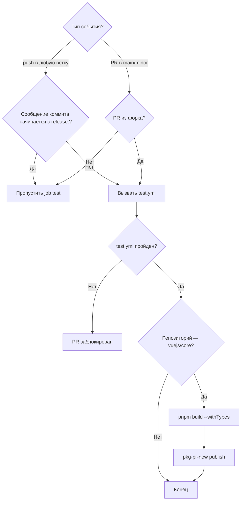
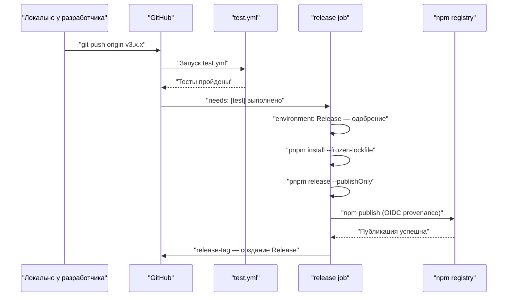
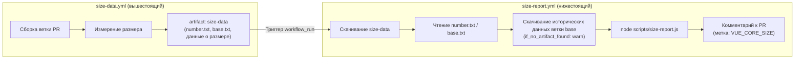

# Глава 10: Рабочие процессы CI/CD: автоматизированный привратник от PR до Release

В предыдущей главе мы увидели,`scripts/release.js`как с помощью интерактивного конечного автомата связать каждый шаг одного релиза. Но у этого скрипта есть предпосылка: он должен быть активно вызван кем-то или какой-то системой. В репозитории Vue core этот активный вызывающий — не локальный терминал мейнтейнера, а GitHub Actions. release.js — исполнитель, workflows —决策者: они решают, какое событие запускает какую задачу, при каких условиях пропустить, при каких условиях заблокировать. Эта глава сосредоточена на`.github/workflows/`четырёх файлах в каталоге:`ci.yml`(гейт PR и непрерывная предпубликация),`release.yml`(официальная публикация по tag),`size-report.yml`(отчёт о регрессии размера),`autofix.yml`(автоматическое исправление форматирования). Понимание их сути — не в запоминании синтаксиса YAML, а в том, чтобы увидеть, как команда Vue переводит инженерные стандарты в непреодолимые ограничения конвейера.

# I. ci.yml: тройной гейт и непрерывная предпубликация

## Интуитивная модель

Представьте`ci.yml`как пункт досмотра в аэропорту. Каждый PR должен пройти этот шлагбаум: lint проверяет, нет ли в вашем багаже запрещённых предметов, typecheck подтверждает подлинность ваших документов, test проверяет, не несёте ли вы опасных веществ. Но пункт досмотра не один — Vue также повесил здесь канал «непрерывной предпубликации», публикуя артефакты сборки каждого PR напрямую в pkg-pr-new, чтобы контрибьюторы могли проверить свои изменения в реальном сценарии установки из npm.

Без этого шлагбаума любое слияние могло бы привнести ошибки форматирования, типовые уязвимости или поведенческие регрессии в ветку main, а main — источник всех последующих release.

## Условия запуска и управление параллелизмом

`ci.yml`Конфигурация запуска

[FACT:.github/workflows/ci.yml:2-11]

```yaml
on:
  push:
    branches:
      - '**'
    tags:
      - '!**'
  pull_request:
    branches:
      - main
      - minor
```

Копировать`push`Здесь два ключевых решения. Во-первых,`'**'`событие слушает все ветки (`tags: ['!**']`), но с помощью`release.yml`явно исключает все отправки tag. Почему исключить tag? Потому что отправка tag обрабатывается отдельно`ci.yml`, и если`pull_request`тоже будет реагировать на tag, это приведёт к дублирующему запуску процесса релиза и процесса CI, потратит ресурсы runner и даже создаст гонку. Во-вторых,`main`слушает только`minor`и`main`две ветки — это стратегия двух веток Vue:`minor`несёт стабильную версию,

[FACT:.github/workflows/ci.yml:22-22]

```yaml
concurrency:
  group: ${{ github.workflow }}-${{ github.event.pull_request.number || github.ref }}
  cancel-in-progress: ${{ github.event_name == 'pull_request' }}
```

Копировать`group`Управление параллелизмом — самый изящный ход здесь.`github.event.pull_request.number || github.ref`Выражение`cancel-in-progress`использует`true`как fallback: событие PR использует номер PR как ключ группировки, событие push использует ref (имя ветки) как ключ группировки. Это означает, что несколько отправок одного и того же PR попадут в одну группу параллелизма. А

> **[Design Inference & Architectural Trade-offs]**
> — когда вы отправляете три коммита подряд, CI первых двух будет автоматически отменён, останется только последний.

## 〔Проектные выводы и архитектурные компромиссы〕

[FACT:.github/workflows/ci.yml:22-22]

```yaml
jobs:
  test:
    if: ${{ ! startsWith(github.event.head_commit.message, 'release:') && (github.event_name == 'push' || github.event.pull_request.head.repo.full_name != github.repository) }}
    uses: ./.github/workflows/test.yml
```

Вход в тройной гейт: условное суждение job test`if`Копировать`&&`Это

условие содержит две ветки логического И (`! startsWith(github.event.head_commit.message, 'release:')`), каждую стоит раскрыть.`release:`В начале, пропустить тесты. Именно таков формат сообщения коммита, отправляемого release.js из предыдущей главы — release.js уже прогнал полные тесты локально, CI не нужно повторно проверять. Это оптимизация «доверия к источнику».

> **[Design Inference & Architectural Trade-offs]**
> Второе условие`(github.event_name == 'push' || github.event.pull_request.head.repo.full_name != github.repository)`: событие push всегда запускает тесты; событие PR требует, чтобы PR был из форка (`head.repo.full_name != github.repository`). Почему тесты запускаются только для PR из форка? Потому что PR из веток того же репозитория обычно создаются членами основной команды, и push в их ветки уже вызвал CI по событию push. А PR из форка не вызывает событие push (push в форк не уведомляет upstream-репозиторий), поэтому его необходимо дополнительно запустить в событии PR.

Примечание`uses: ./.github/workflows/test.yml`— это вызов reusable workflow.`test.yml`— это отдельный файл workflow, совместно используемый`ci.yml`и`release.yml`. Такое повторное использование позволяет избежать дублирования определения шагов lint/typecheck/test в нескольких workflow.

## Непрерывный предварительный выпуск: роль pkg-pr-new

[FACT:.github/workflows/ci.yml:25-51]

```yaml
continuous-release:
  if: github.repository == 'vuejs/core'
  runs-on: ubuntu-latest
  steps:
    - name: Checkout
      uses: actions/checkout@3d3c42e5aac5ba805825da76410c181273ba90b1 # v7.0.1
      with:
        persist-credentials: false
    # ... 安装 pnpm、Node.js、依赖 ...
    - name: Build
      run: pnpm build --withTypes
    - name: Release
      run: pnpx pkg-pr-new publish --compact --pnpm './packages/*' --packageManager=pnpm,npm,yarn
```

`continuous-release`job выполняется только в`vuejs/core`основном репозитории (`if: github.repository == 'vuejs/core'`), в форках не запускается. Он делает три вещи: сборка (`pnpm build --withTypes`, с объявлениями типов), затем с помощью`pkg-pr-new`публикует все пакеты из`./packages/*`во временный npm registry.

> **[Design Inference & Architectural Trade-offs]**
> Ценность этого механизма в том, что контрибьюторы могут в своём проекте напрямую`npm install`использовать артефакты сборки этого PR, чтобы проверить, действительно ли изменения решают проблему. Это убедительнее, чем «CI позеленел», потому что проверяется реальный сценарий потребления пакета.

Обратите внимание, что все action привязаны к commit SHA (например,`actions/checkout@3d3c42e5...`), а не используют`@v4`такой плавающий тег. Это жёсткое требование безопасности цепочки поставок — предотвращает автоматическое проникновение вредоносного кода после компрометации репозитория action.

## Граф потока управления ci.yml



---

# II. release.yml: оркестрация публикации после пуша тега

## Интуитивная модель

Если сказать,`ci.yml`— это пункт досмотра,`release.yml`— это стартовая площадка. Когда release.js локально завершает обновление номера версии, коммит, создание тега и пуш, событие пуша тега запускает двигатель`release.yml`. Сначала он прогоняет полный набор тестов (повторная проверка), затем в защищённом окружении`Release`выполняет`pnpm release --publishOnly`, и наконец создаёт GitHub Release.

Без него тег, отправленный release.js, остаётся лишь ссылкой Git — новой версии на npm не появится, страницы Release на GitHub не будет.

## Условие срабатывания: распознаётся только тег

[FACT:.github/workflows/release.yml:3-6]

```yaml
on:
  push:
    tags:
      - 'v*' # Push events to matching v*, i.e. v1.0, v20.15.10
```

Отслеживает только`v*`пуш тегов в формате . Это согласуется с`ci.yml`из`tags: ['!**']`образуют взаимодополняющую пару — они строго взаимоисключающие и не срабатывают одновременно.

## Условие-ограничитель для задания публикации

[FACT:.github/workflows/release.yml:8-21]

```yaml
jobs:
  test:
    uses: ./.github/workflows/test.yml

  release:
    if: github.repository == 'vuejs/core'
    needs: [test]
    runs-on: ubuntu-latest
    permissions:
      contents: write
      id-token: write
    environment: Release
```

Здесь три уровня защиты, и ни один из них нельзя опустить.

Первый уровень`if: github.repository == 'vuejs/core'`: предотвращает ошибочный запуск публикации из форка. Если кто-то сделал форк репозитория и отправил`v1.0.0`тег, это условие не даст запуститься процессу публикации.

Второй уровень`needs: [test]`: задание release зависит от задания test. Задание test вызывает`test.yml`, и если тесты не проходят, задание release вообще не запустится. Это жёсткое требование «перед публикацией обязательно пройти тесты».

> **[Design Inference & Architectural Trade-offs]**
> Третий уровень`environment: Release`: это GitHub Environment, для которого можно настроить правила защиты развёртывания (например, требовать одобрения определённых лиц). Это означает, что даже если отправка тега запустила workflow, шаг публикации может потребовать ручного одобрения для выполнения — это последняя линия защиты для необратимой операции.

Что касается разрешений,`contents: write`Используется для создания GitHub Release,`id-token: write`Используется для аутентификации provenance в npm (OIDC token). Обратите внимание, что здесь нет`packages: write`, поскольку Vue публикуется в npm, а не в GitHub Packages.

## Полная цепочка шагов публикации

[FACT:.github/workflows/release.yml:37-46]

```yaml
- name: Install deps
  run: pnpm install --frozen-lockfile

- name: Update npm
  run: npm i -g npm@latest

- name: Build and publish
  id: publish
  run: |
    pnpm release --publishOnly
```

> **[Design Inference & Architectural Trade-offs]**
> Каждый из трёх шагов имеет свои особенности.`--frozen-lockfile`Обеспечивает строгую установку в CI-среде согласно lockfile, что предотвращает несоответствие артефактов сборки локальным из-за дрейфа версий зависимостей.`npm i -g npm@latest`Предназначен для получения последней версии npm CLI — поскольку provenance и OIDC-аутентификация зависят от более новых версий npm, старые версии могут не поддерживать эти возможности.

`pnpm release --publishOnly`Является точкой входа release.js из предыдущей главы.`--publishOnly`Флаг сообщает release.js: пропустить интерактивный выбор номера версии, пропустить Git-коммит и создание тега (поскольку тег уже существует), выполнить только сборку и npm publish.

## Создание GitHub Release

[FACT:.github/workflows/release.yml:48-57]

```yaml
- name: Create GitHub release
  id: release_tag
  uses: yyx990803/release-tag@8cccf7c5aa332d71d222df46677f70f77a8d2dc0 # v1.0.0
  env:
    GITHUB_TOKEN: ${{ secrets.GITHUB_TOKEN }}
  with:
    tag_name: ${{ github.ref }}
    body: |
      For stable releases, please refer to [CHANGELOG.md](...) for details.
      For pre-releases, please refer to [CHANGELOG.md](...) of the `minor` branch.
```

> **[Design Inference & Architectural Trade-offs]**
> Здесь используется`release-tag` action。`tag_name: ${{ github.ref }}`Напрямую использовать ref события-триггера (то есть`refs/tags/v3.x.x`). В теле Release не указывается конкретное содержимое изменений, вместо этого оно ссылается на CHANGELOG.md — потому что changelog Vue автоматически генерируется через conventional-changelog, и ручное поддержание тела Release привело бы к расхождениям с changelog.

## Временная диаграмма release.yml



---

# III. size-report.yml и autofix.yml: отслеживание размера и самовосстановление формата

## size-report.yml: отчёт о регрессии размера между workflow

`size-report.yml`Способ запуска довольно необычен — он запускается не напрямую по push или PR, а по событию завершения другого workflow.

[FACT:.github/workflows/size-report.yml:3-7]

```yaml
on:
  workflow_run:
    workflows: ['size data']
    types:
      - completed
```

`workflow_run`Событие прослушивает завершение workflow с именем`size data`. Это двухэтапный дизайн:`size-data.yml`(в этой главе исходный код не предоставлен) отвечает за сборку и измерение размера в PR, загружая результаты как artifact;`size-report.yml`после завершения`size data`скачивает artifact, генерирует отчёт и комментирует его в PR.

[FACT:.github/workflows/size-report.yml:20-23]

```yaml
if: >
  github.repository == 'vuejs/core' &&
  github.event.workflow_run.event == 'pull_request' &&
  github.event.workflow_run.conclusion == 'success'
```

Тройная защита: основной репозиторий, событие PR, успех вышестоящего workflow. Если`size data`завершился неудачно, job отчёта не запустится — потому что нет данных для отчёта.

Процесс передачи данных следующий:

[FACT:.github/workflows/size-report.yml:41-46]

```yaml
- name: Download Size Data
  uses: dawidd6/action-download-artifact@d63b86af1b34672e53c440b1b83979861906bad7 # v24
  with:
    name: size-data
    run_id: ${{ github.event.workflow_run.id }}
    path: temp/size
```

Скачивает artifact`size-data`из вышестоящего workflow run в`temp/size`. Затем параллельно считывает номер PR и базовую ветку:

[FACT:.github/workflows/size-report.yml:48-59]

```yaml
- parallel:
    - name: Read PR Number
      id: pr-number
      uses: juliangruber/read-file-action@271ff311a4947af354c6abcd696a306553b9ec18 # v1.1.8
      with:
        path: temp/size/number.txt
    - name: Read base branch
      id: pr-base
      uses: juliangruber/read-file-action@271ff311a4947af354c6abcd696a306553b9ec18 # v1.1.8
      with:
        path: temp/size/base.txt
```

`parallel`— это синтаксический сахар GitHub Actions, позволяющий двум независимым шагам выполняться одновременно.`number.txt`и`base.txt`— это`size-data.yml`файлы метаданных, записанные при измерении.

Затем скачиваются исторические данные о размере базовой ветки для сравнения:

[FACT:.github/workflows/size-report.yml:61-69]

```yaml
- name: Download Previous Size Data
  uses: dawidd6/action-download-artifact@d63b86af1b34672e53c440b1b83979861906bad7 # v24
  with:
    branch: ${{ steps.pr-base.outputs.content }}
    workflow: size-data.yml
    event: push
    name: size-data
    path: temp/size-prev
    if_no_artifact_found: warn
```

Обратите внимание на`if_no_artifact_found: warn`— если в базовой ветке ещё нет исторических данных (например, новая ветка), это не приведёт к ошибке, только к предупреждению. Это гарантирует, что при первом запуске отчёт всё равно будет сгенерирован, просто без базовой линии для сравнения.

Наконец, генерируется отчёт и добавляется комментарий:

[FACT:.github/workflows/size-report.yml:71-89]

```yaml
- name: Prepare report
  run: node scripts/size-report.js > size-report.md

- name: Read Size Report
  id: size-report
  uses: juliangruber/read-file-action@271ff311a4947af354c6abcd696a306553b9ec18 # v1.1.8
  with:
    path: ./size-report.md

- name: Create Comment
  uses: actions-cool/maintain-one-comment-backup@fbbc22ad1809c1bcf46f19b58397b6254773588c # backup for v3.0.0
  with:
    token: ${{ secrets.GITHUB_TOKEN }}
    number: ${{ steps.pr-number.outputs.content }}
    body: |
      ${{ steps.size-report.outputs.content }}
      
    body-include: ''
```

`scripts/size-report.js`Считывает`temp/size`и`temp/size-prev`данные под ними, генерирует Markdown-отчёт.`maintain-one-comment-backup`action использует`body-include: '<!-- VUE_CORE_SIZE -->'`в качестве маркера, чтобы на одном PR оставался только один комментарий с отчётом о размере (обновление, а не добавление). Обратите внимание на комментарий на L81, где указано, что оригинальный репозиторий action был заблокирован GitHub, поэтому используется резервный репозиторий с зафиксированным commit.

## autofix.yml: автоматическое исправление проблем форматирования

`autofix.yml`Решает очень практичную проблему: код, отправленный контрибьютором, не соответствует стандартам prettier/eslint, CI выдаёт ошибку, и контрибьютору нужно вручную запустить`pnpm lint --fix`и снова закоммитить. Этот workflow автоматизирует этот шаг.

[FACT:.github/workflows/autofix.yml:3-8]

```yaml
on:
  pull_request:

concurrency:
  group: ${{ github.workflow }}-${{ github.event.pull_request.number }}
  cancel-in-progress: ${{ github.event_name == 'pull_request' }}
```

Запускается для всех PR, управление параллелизмом аналогично`ci.yml`— новый push в тот же PR отменяет старый запуск autofix.

[FACT:.github/workflows/autofix.yml:35-41]

```yaml
- name: Run eslint
  run: pnpm run lint --fix

- name: Run prettier
  run: pnpm run format

- uses: autofix-ci/action@7a166d7532b277f34e16238930461bf77f9d7ed8
```

Сначала запускается`--fix`eslint, затем форматирование prettier, и наконец`autofix-ci/action`коммитит изменённые файлы обратно в ветку PR. Обратите внимание, что`pnpm run format`сам по себе является командой форматирования (не нужен флаг`--fix`, потому что внутри скрипта format уже есть`prettier --write`）。

> **[Design Inference & Architectural Trade-offs]**
> Ключевой момент этого механизма в том, что`autofix-ci/action`коммитит исправления от имени автора PR, а не от имени бота. Так контрибьюторам не нужно предпринимать дополнительных действий, и исправления формата автоматически появляются в их PR. Но это также означает, что если в ветке контрибьютора есть правила защиты (запрещающие push от бота), autofix завершится неудачно — это граничный случай, который контрибьютору нужно обрабатывать вручную.

## Диаграмма потока данных size-report



---

# Размышления о дизайне: закрепление стандартов в конвейере

Оглядываясь на эти четыре workflow, можно увидеть несколько сквозных принципов дизайна.

**Первый — минимизация прав.** `ci.yml`и`autofix.yml`оба объявляют`permissions: contents: read`, только`release.yml`нуждается в`contents: write`и`id-token: write`。`size-report.yml`нуждается в`pull-requests: write`и`issues: write`для публикации комментариев. Каждый workflow получает только те права, которые ему действительно нужны.

**Второй — безопасность цепочки поставок.**Все сторонние action зафиксированы на commit SHA, а не на плавающих тегах.`size-report.yml`Комментарий на L81 прямо указывает, что после блокировки оригинального репозитория action был выполнен переход на резервный репозиторий с фиксацией commit — это практическая защита от атак на цепочку поставок.

**Третий — разделение обязанностей и повторное использование.** `test.yml`разделяется между`ci.yml`и`release.yml`, избегая дублирования логики тестирования.`size-data.yml`и`size-report.yml`разделены, позволяя измерению и отчёту развиваться независимо.

**Четвёртый — выбор направления при неудаче.** `size-report.yml`В`if_no_artifact_found: warn`выбрано «предупреждение вместо ошибки», потому что отсутствие исторических данных не должно блокировать PR. А в`release.yml`выбрано «неудача теста блокирует релиз», потому что релиз — необратимая операция.`needs: [test]`Пятый — дифференциация управления параллелизмом.

**Событие PR отменяет старые запуски (**), событие push не отменяет (`cancel-in-progress: true`). Это различие отражает семантику двух событий: старые коммиты PR уже не имеют значения, каждый коммит push может быть финальным состоянием.`cancel-in-progress: false`Резюме главы

---

# В этой главе разобраны четыре ключевых workflow репозитория Vue core:

: шлюз PR + непрерывный предрелиз. Через условие

- **`ci.yml`**различаются push/PR и fork/тот же репозиторий, с помощью`if`отменяются устаревшие запуски PR, с помощью`concurrency`публикуется устанавливаемый предрелизный пакет.`pkg-pr-new`Публикация устанавливаемого предрелизного пакета.
- **`release.yml`**: Официальный релиз запускается по тегу. Трёхуровневая защита (проверка репозитория, needs test, одобрение environment) гарантирует, что только прошедший тесты и одобренный тег может быть опубликован в npm.
- **`size-report.yml`**: Отчёт о регрессии размера между workflow. Через`workflow_run`событие прослушивается вышестоящий`size data`завершается, скачивается artifact и сравниваются данные с веткой base, результат возвращается в PR в виде комментария.
- **`autofix.yml`**: Автоматическое исправление форматирования. Запускает eslint --fix и prettier на PR, через`autofix-ci/action`коммитит исправления напрямую обратно в ветку PR.

Эти четыре workflow вместе образуют «необходной конвейер»: стиль кода автоматически исправляется через autofix, типы и тесты принудительно проверяются через ci.yml, регрессия размера отслеживается через size-report, а публикация выполняется через release.yml под многоуровневой защитой.

# Вопросы для размышления и самопроверки в этой главе

Q1: Если изменить`ci.yml`в`cancel-in-progress`значение на константу`true`(то есть удалить`github.event_name == 'pull_request'`условие), в каких сценариях это может вызвать проблемы?

**Справочный анализ**：`cancel-in-progress`всегда`true`означает, что при push в ветку main новый push отменит текущий запущенный старый CI. Рассмотрим сценарий: в ветку main последовательно влиты два PR, CI первого PR выполняется (включая полный lint/typecheck/test), слияние второго PR запустило новый запуск CI. Если`cancel-in-progress`равно`true`, CI первого PR будет отменён — но код первого PR уже находится в main, и результат его CI критически важен для оценки состояния здоровья ветки main. Его отмена означает, что часть кода в ветке main никогда не была полностью проверена. А[FACT:.github/workflows/ci.yml:22-22]условие`github.event_name == 'pull_request'`как раз предназначено для предотвращения этой проблемы: только события PR отменяют старые запуски, события push никогда не отменяют.

Q2: `release.yml`в`release`job`if: github.repository == 'vuejs/core'`и`environment: Release`соответственно защищают от каких сценариев? Что будет, если убрать одно из них?

**Справочный анализ**：`if: github.repository == 'vuejs/core'` [FACT:.github/workflows/release.yml:14]защищает от сценария fork. Если кто-то форкнул vuejs/core и запушил`v3.99.0`тег, без этого условия workflow будет запускаться в форк-репозитории`pnpm release --publishOnly`. Хотя форк-репозиторий не имеет npm-токена и не может выполнить реальную публикацию, это будет расходовать ресурсы runner'а и может создавать вводящие в заблуждение уведомления о сбоях.`environment: Release` [FACT:.github/workflows/release.yml:21]Защищает от риска «автоматической публикации после отправки тега» — он позволяет настроить ручное подтверждение, гарантируя, что даже при отправке тега публикация требует подтверждения мейнтейнера. Если убрать`if`условие, форк будет расходовать ресурсы; если убрать`environment`, любой, у кого есть право на отправку тегов, сможет инициировать публикацию без финального этапа ручного подтверждения. Это два разных уровня защиты, которые не могут заменять друг друга.

Q3: `size-report.yml`в`if_no_artifact_found: warn`и выбор`release.yml`в`needs: [test]`— какую философию проектирования направления отказа они соответственно отражают? Что произойдёт, если поменять эти две стратегии местами?

**Справочный разбор**：`if_no_artifact_found: warn` [FACT:.github/workflows/size-report.yml:69]Выбор «предупреждать, а не завершаться с ошибкой при отсутствии исторических данных» обусловлен тем, что отчёт о размере является вспомогательной информацией, а не блокирующим условием. Если изменить на`fail`, то новая ветка или PR при первом запуске потерпят неудачу из-за отсутствия базовых данных, что явно неразумно.`needs: [test]` [FACT:.github/workflows/release.yml:15]Выбор «блокировать публикацию при провале тестов» обусловлен тем, что публикация — необратимая операция, необходимо гарантировать качество кода. Если поменять местами — size-report будет завершаться с ошибкой при отсутствии данных, а release будет публиковать даже при провале тестов — первый приведёт к массовым ложным блокировкам нормальных PR, второй приведёт к попаданию непротестированного кода в npm. Это отражает принцип проектирования направления отказа: «вспомогательная информация — мягкая, необратимые операции — строгие».

---

В следующей главе мы углубимся в ядро механизма бюджета размера:`scripts/size-report.js`как разбирать данные о размере, как вычислять приращение, как форматировать вывод, а также`usage-size`Философия измерений — почему Vue выбирает измерение «фактического используемого объёма», а не «полного объёма пакета».

От PR-гейта до публикации тега — четыре файла workflow вместе образуют непреодолимую автоматизированную цепочку контроля. Но конвейер может блокировать слияние только при наличии количественно измеримых критериев оценки. В следующей главе мы сосредоточимся на инженерном управлении ключевой метрикой размера пакета в Vue:`scripts/size-report.js`как вычисляется размер каждого артефакта после gzip и сравнивается с базовым уровнем,`scripts/usage-size.js`как моделируются реальные сценарии использования для оценки фактических затрат, и как CI блокирует слияние при превышении размера.
