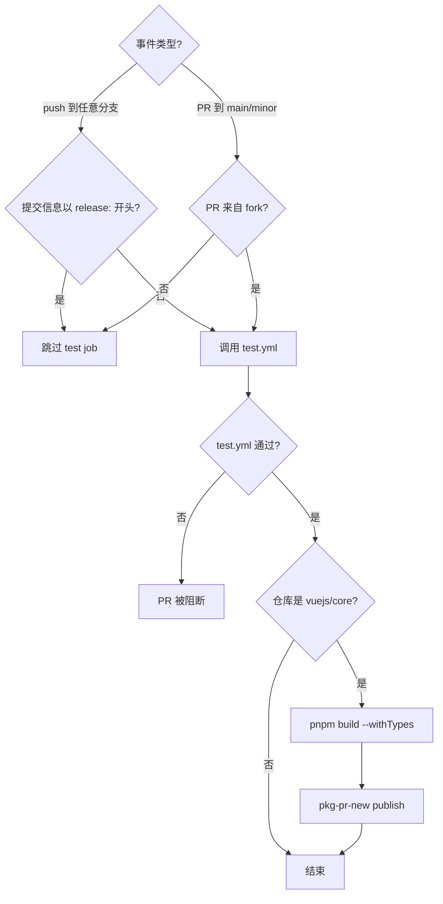
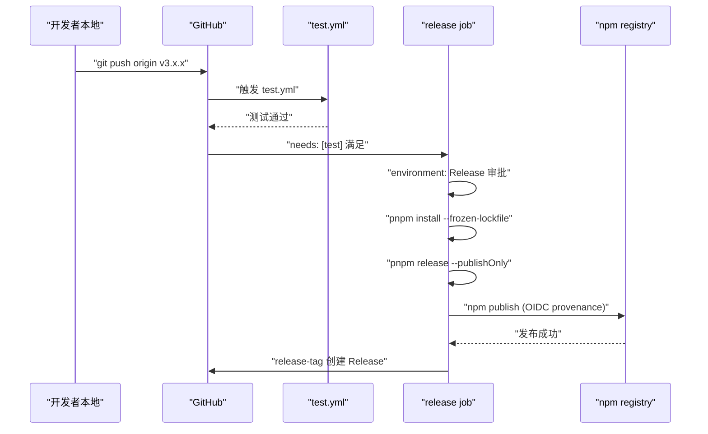
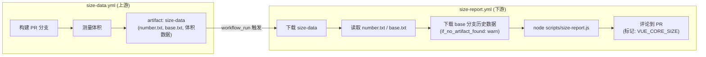

# Глава 10: Рабочие процессы CI/CD: автоматизированный привратник от PR до Release

В предыдущей главе мы увидели,`scripts/release.js`как с помощью интерактивного конечного автомата связать каждый шаг одного релиза. Но у этого скрипта есть предпосылка: он должен быть активно вызван кем-то или какой-то системой. В репозитории Vue core этот активный вызывающий — не локальный терминал мейнтейнера, а GitHub Actions. release.js — исполнитель, workflows —决策者: они решают, какое событие запускает какую задачу, при каких условиях пропустить, при каких условиях заблокировать. Эта глава сосредоточена на`.github/workflows/`четырёх файлах в каталоге:`ci.yml`(гейт PR и непрерывная предпубликация),`release.yml`(официальная публикация по tag),`size-report.yml`(отчёт о регрессии размера),`autofix.yml`(автоматическое исправление форматирования). Понимание их сути — не в запоминании синтаксиса YAML, а в том, чтобы увидеть, как команда Vue переводит инженерные стандарты в непреодолимые ограничения конвейера.

# I. ci.yml: тройной гейт и непрерывная предпубликация

## Интуитивная модель

Представьте`ci.yml`как пункт досмотра в аэропорту. Каждый PR должен пройти этот шлагбаум: lint проверяет, нет ли в вашем багаже запрещённых предметов, typecheck подтверждает подлинность ваших документов, test проверяет, не несёте ли вы опасных веществ. Но пункт досмотра не один — Vue также повесил здесь канал «непрерывной предпубликации», публикуя артефакты сборки каждого PR напрямую в pkg-pr-new, чтобы контрибьюторы могли проверить свои изменения в реальном сценарии установки из npm.

Без этого шлагбаума любое слияние могло бы привнести ошибки форматирования, типовые уязвимости или поведенческие регрессии в ветку main, а main — источник всех последующих release.

## Условия запуска и управление параллелизмом

`ci.yml`Конфигурация запуска

[FACT:.github/workflows/ci.yml:2-11]

```yaml
on:
  push:
    branches:
      - '**'
    tags:
      - '!**'
  pull_request:
    branches:
      - main
      - minor
```

Копировать`push`Здесь два ключевых решения. Во-первых,`'**'`событие слушает все ветки (`tags: ['!**']`), но с помощью`release.yml`явно исключает все отправки tag. Почему исключить tag? Потому что отправка tag обрабатывается отдельно`ci.yml`, и если`pull_request`тоже будет реагировать на tag, это приведёт к дублирующему запуску процесса релиза и процесса CI, потратит ресурсы runner и даже создаст гонку. Во-вторых,`main`слушает только`minor`и`main`две ветки — это стратегия двух веток Vue:`minor`несёт стабильную версию,

[FACT:.github/workflows/ci.yml:22-22]

```yaml
concurrency:
  group: ${{ github.workflow }}-${{ github.event.pull_request.number || github.ref }}
  cancel-in-progress: ${{ github.event_name == 'pull_request' }}
```

Копировать`group`Управление параллелизмом — самый изящный ход здесь.`github.event.pull_request.number || github.ref`Выражение`cancel-in-progress`использует`true`как fallback: событие PR использует номер PR как ключ группировки, событие push использует ref (имя ветки) как ключ группировки. Это означает, что несколько отправок одного и того же PR попадут в одну группу параллелизма. А

> **[Design Inference & Architectural Trade-offs]**
> — когда вы отправляете три коммита подряд, CI первых двух будет автоматически отменён, останется только последний.

## 〔Проектные выводы и архитектурные компромиссы〕

[FACT:.github/workflows/ci.yml:22-22]

```yaml
jobs:
  test:
    if: ${{ ! startsWith(github.event.head_commit.message, 'release:') && (github.event_name == 'push' || github.event.pull_request.head.repo.full_name != github.repository) }}
    uses: ./.github/workflows/test.yml
```

Вход в тройной гейт: условное суждение job test`if`Копировать`&&`Это

условие содержит две ветки логического И (`! startsWith(github.event.head_commit.message, 'release:')`), каждую стоит раскрыть.`release:`开头，跳过测试。这正是上一章 release.js 推送的提交信息格式——release.js 在本地已经跑过完整测试，CI 不需要重复验证。这是一个「信任上游」的优化。

> **[Design Inference & Architectural Trade-offs]**
> 第二个条件`(github.event_name == 'push' || github.event.pull_request.head.repo.full_name != github.repository)`：push 事件总是跑测试；PR 事件则要求 PR 来自 fork（`head.repo.full_name != github.repository`）。为什么 fork 的 PR 才跑？ 因为同仓库分支的 PR 通常由核心团队成员创建，他们的分支推送已经触发过 push 事件的 CI。而 fork 的 PR 不会触发 push 事件（fork 的 push 不会通知上游仓库），所以必须在 PR 事件里补跑。

注意`uses: ./.github/workflows/test.yml`——这是一个 reusable workflow 调用。`test.yml`是独立的 workflow 文件，被`ci.yml`和`release.yml`共享。这种复用避免了在多个 workflow 里重复定义 lint/typecheck/test 的步骤。

## 持续预发布：pkg-pr-new 的角色

[FACT:.github/workflows/ci.yml:25-51]

```yaml
continuous-release:
  if: github.repository == 'vuejs/core'
  runs-on: ubuntu-latest
  steps:
    - name: Checkout
      uses: actions/checkout@3d3c42e5aac5ba805825da76410c181273ba90b1 # v7.0.1
      with:
        persist-credentials: false
    # ... 安装 pnpm、Node.js、依赖 ...
    - name: Build
      run: pnpm build --withTypes
    - name: Release
      run: pnpx pkg-pr-new publish --compact --pnpm './packages/*' --packageManager=pnpm,npm,yarn
```

`continuous-release`job 只在`vuejs/core`主仓库运行（`if: github.repository == 'vuejs/core'`），fork 上不执行。它做三件事：构建（`pnpm build --withTypes`，带类型声明）、然后用`pkg-pr-new`把`./packages/*`下的所有包发布到一个临时的 npm registry。

> **[Design Inference & Architectural Trade-offs]**
> 这个机制的价值在于：贡献者可以在自己的项目里直接`npm install`这个 PR 的构建产物，验证改动是否真的解决了问题。这比「看 CI 绿了」更有说服力，因为它验证的是真实的包消费场景。

注意所有 action 都锁定了 commit SHA（如`actions/checkout@3d3c42e5...`），而不是用`@v4`这样的浮动 tag。这是供应链安全的硬性要求——防止 action 仓库被入侵后恶意代码自动流入。

## ci.yml 控制流图



---

# 二、release.yml：tag 推送后的发布编排

## 直觉模型

如果说`ci.yml`是安检口，`release.yml`就是发射台。当 release.js 在本地完成版本号更新、提交、打 tag 并推送后，tag 推送事件点燃了`release.yml`的引擎。它先跑一遍完整测试（再次确认），然后在受保护的`Release`环境中执行`pnpm release --publishOnly`，最后创建 GitHub Release。

若没有它，release.js 推送的 tag 就只是一个 Git 引用，npm 上不会有新版本，GitHub 上不会有 Release 页面。

## 触发条件：只认 tag

[FACT:.github/workflows/release.yml:3-6]

```yaml
on:
  push:
    tags:
      - 'v*' # Push events to matching v*, i.e. v1.0, v20.15.10
```

只监听`v*`格式的 tag 推送。这与`ci.yml`的`tags: ['!**']`形成互补——两者严格互斥，不会同时触发。

## 发布 job 的守卫条件

[FACT:.github/workflows/release.yml:8-21]

```yaml
jobs:
  test:
    uses: ./.github/workflows/test.yml

  release:
    if: github.repository == 'vuejs/core'
    needs: [test]
    runs-on: ubuntu-latest
    permissions:
      contents: write
      id-token: write
    environment: Release
```

这里有三层守卫，每一层都不可省略。

第一层`if: github.repository == 'vuejs/core'`：防止 fork 上误触发发布。如果有人 fork 了仓库并推送了一个`v1.0.0`tag，这个条件会阻止发布流程运行。

第二层`needs: [test]`：release job 依赖 test job。test job 调用`test.yml`，如果测试失败，release job 根本不会启动。这是「发布前必须通过测试」的硬约束。

> **[Design Inference & Architectural Trade-offs]**
> 第三层`environment: Release`：这是一个 GitHub Environment，可以配置部署保护规则（如需要特定人员审批）。 这意味着即使 tag 推送触发了 workflow，发布步骤也可能需要人工审批才能执行——这是对不可逆操作的最后一道防线。

权限方面，`contents: write`用于创建 GitHub Release，`id-token: write`用于 npm 的 provenance 认证（OIDC token）。注意这里没有`packages: write`，因为 Vue 发布到 npm 而非 GitHub Packages。

## 发布步骤的完整链路

[FACT:.github/workflows/release.yml:37-46]

```yaml
- name: Install deps
  run: pnpm install --frozen-lockfile

- name: Update npm
  run: npm i -g npm@latest

- name: Build and publish
  id: publish
  run: |
    pnpm release --publishOnly
```

> **[Design Inference & Architectural Trade-offs]**
> 三个步骤各有讲究。`--frozen-lockfile`确保 CI 环境严格按 lockfile 安装，不会因为依赖版本漂移导致构建产物与本地不一致。`npm i -g npm@latest`是为了获取最新的 npm CLI—— 因为 provenance 和 OIDC 认证依赖较新版本的 npm，旧版本可能不支持这些特性。

`pnpm release --publishOnly`是上一章 release.js 的入口。`--publishOnly`标志告诉 release.js：跳过交互式版本号选择、跳过 Git 提交和打 tag（因为 tag 已经存在），只执行构建和 npm publish。

## 创建 GitHub Release

[FACT:.github/workflows/release.yml:48-57]

```yaml
- name: Create GitHub release
  id: release_tag
  uses: yyx990803/release-tag@8cccf7c5aa332d71d222df46677f70f77a8d2dc0 # v1.0.0
  env:
    GITHUB_TOKEN: ${{ secrets.GITHUB_TOKEN }}
  with:
    tag_name: ${{ github.ref }}
    body: |
      For stable releases, please refer to [CHANGELOG.md](...) for details.
      For pre-releases, please refer to [CHANGELOG.md](...) of the `minor` branch.
```

> **[Design Inference & Architectural Trade-offs]**
> 这里用的是 Vue 作者尤雨溪自己维护的`release-tag` action。`tag_name: ${{ github.ref }}`直接使用触发事件的 ref（即`refs/tags/v3.x.x`). В теле Release не указывается конкретное содержимое изменений, вместо этого оно ссылается на CHANGELOG.md — потому что changelog Vue автоматически генерируется через conventional-changelog, и ручное поддержание тела Release привело бы к расхождениям с changelog.

## Временная диаграмма release.yml



---

# III. size-report.yml и autofix.yml: отслеживание размера и самовосстановление формата

## size-report.yml: отчёт о регрессии размера между workflow

`size-report.yml`Способ запуска довольно необычен — он запускается не напрямую по push или PR, а по событию завершения другого workflow.

[FACT:.github/workflows/size-report.yml:3-7]

```yaml
on:
  workflow_run:
    workflows: ['size data']
    types:
      - completed
```

`workflow_run`Событие прослушивает завершение workflow с именем`size data`. Это двухэтапный дизайн:`size-data.yml`(в этой главе исходный код не предоставлен) отвечает за сборку и измерение размера в PR, загружая результаты как artifact;`size-report.yml`после завершения`size data`скачивает artifact, генерирует отчёт и комментирует его в PR.

[FACT:.github/workflows/size-report.yml:20-23]

```yaml
if: >
  github.repository == 'vuejs/core' &&
  github.event.workflow_run.event == 'pull_request' &&
  github.event.workflow_run.conclusion == 'success'
```

Тройная защита: основной репозиторий, событие PR, успех вышестоящего workflow. Если`size data`завершился неудачно, job отчёта не запустится — потому что нет данных для отчёта.

Процесс передачи данных следующий:

[FACT:.github/workflows/size-report.yml:41-46]

```yaml
- name: Download Size Data
  uses: dawidd6/action-download-artifact@d63b86af1b34672e53c440b1b83979861906bad7 # v24
  with:
    name: size-data
    run_id: ${{ github.event.workflow_run.id }}
    path: temp/size
```

Скачивает artifact`size-data`из вышестоящего workflow run в`temp/size`. Затем параллельно считывает номер PR и базовую ветку:

[FACT:.github/workflows/size-report.yml:48-59]

```yaml
- parallel:
    - name: Read PR Number
      id: pr-number
      uses: juliangruber/read-file-action@271ff311a4947af354c6abcd696a306553b9ec18 # v1.1.8
      with:
        path: temp/size/number.txt
    - name: Read base branch
      id: pr-base
      uses: juliangruber/read-file-action@271ff311a4947af354c6abcd696a306553b9ec18 # v1.1.8
      with:
        path: temp/size/base.txt
```

`parallel`— это синтаксический сахар GitHub Actions, позволяющий двум независимым шагам выполняться одновременно.`number.txt`и`base.txt`— это`size-data.yml`файлы метаданных, записанные при измерении.

Затем скачиваются исторические данные о размере базовой ветки для сравнения:

[FACT:.github/workflows/size-report.yml:61-69]

```yaml
- name: Download Previous Size Data
  uses: dawidd6/action-download-artifact@d63b86af1b34672e53c440b1b83979861906bad7 # v24
  with:
    branch: ${{ steps.pr-base.outputs.content }}
    workflow: size-data.yml
    event: push
    name: size-data
    path: temp/size-prev
    if_no_artifact_found: warn
```

Обратите внимание на`if_no_artifact_found: warn`— если в базовой ветке ещё нет исторических данных (например, новая ветка), это не приведёт к ошибке, только к предупреждению. Это гарантирует, что при первом запуске отчёт всё равно будет сгенерирован, просто без базовой линии для сравнения.

Наконец, генерируется отчёт и добавляется комментарий:

[FACT:.github/workflows/size-report.yml:71-89]

```yaml
- name: Prepare report
  run: node scripts/size-report.js > size-report.md

- name: Read Size Report
  id: size-report
  uses: juliangruber/read-file-action@271ff311a4947af354c6abcd696a306553b9ec18 # v1.1.8
  with:
    path: ./size-report.md

- name: Create Comment
  uses: actions-cool/maintain-one-comment-backup@fbbc22ad1809c1bcf46f19b58397b6254773588c # backup for v3.0.0
  with:
    token: ${{ secrets.GITHUB_TOKEN }}
    number: ${{ steps.pr-number.outputs.content }}
    body: |
      ${{ steps.size-report.outputs.content }}
      
    body-include: ''
```

`scripts/size-report.js`Считывает`temp/size`и`temp/size-prev`данные под ними, генерирует Markdown-отчёт.`maintain-one-comment-backup`action использует`body-include: '<!-- VUE_CORE_SIZE -->'`в качестве маркера, чтобы на одном PR оставался только один комментарий с отчётом о размере (обновление, а не добавление). Обратите внимание на комментарий на L81, где указано, что оригинальный репозиторий action был заблокирован GitHub, поэтому используется резервный репозиторий с зафиксированным commit.

## autofix.yml: автоматическое исправление проблем форматирования

`autofix.yml`Решает очень практичную проблему: код, отправленный контрибьютором, не соответствует стандартам prettier/eslint, CI выдаёт ошибку, и контрибьютору нужно вручную запустить`pnpm lint --fix`и снова закоммитить. Этот workflow автоматизирует этот шаг.

[FACT:.github/workflows/autofix.yml:3-8]

```yaml
on:
  pull_request:

concurrency:
  group: ${{ github.workflow }}-${{ github.event.pull_request.number }}
  cancel-in-progress: ${{ github.event_name == 'pull_request' }}
```

Запускается для всех PR, управление параллелизмом аналогично`ci.yml`— новый push в тот же PR отменяет старый запуск autofix.

[FACT:.github/workflows/autofix.yml:35-41]

```yaml
- name: Run eslint
  run: pnpm run lint --fix

- name: Run prettier
  run: pnpm run format

- uses: autofix-ci/action@7a166d7532b277f34e16238930461bf77f9d7ed8
```

Сначала запускается`--fix`eslint, затем форматирование prettier, и наконец`autofix-ci/action`коммитит изменённые файлы обратно в ветку PR. Обратите внимание, что`pnpm run format`сам по себе является командой форматирования (не нужен флаг`--fix`, потому что внутри скрипта format уже есть`prettier --write`）。

> **[Design Inference & Architectural Trade-offs]**
> Ключевой момент этого механизма в том, что`autofix-ci/action`коммитит исправления от имени автора PR, а не от имени бота. Так контрибьюторам не нужно предпринимать дополнительных действий, и исправления формата автоматически появляются в их PR. Но это также означает, что если в ветке контрибьютора есть правила защиты (запрещающие push от бота), autofix завершится неудачно — это граничный случай, который контрибьютору нужно обрабатывать вручную.

## Диаграмма потока данных size-report



---

# Размышления о дизайне: закрепление стандартов в конвейере

Оглядываясь на эти четыре workflow, можно увидеть несколько сквозных принципов дизайна.

**Первый — минимизация прав.** `ci.yml`и`autofix.yml`оба объявляют`permissions: contents: read`, только`release.yml`нуждается в`contents: write`и`id-token: write`。`size-report.yml`нуждается в`pull-requests: write`и`issues: write`для публикации комментариев. Каждый workflow получает только те права, которые ему действительно нужны.

**Второй — безопасность цепочки поставок.**Все сторонние action зафиксированы на commit SHA, а не на плавающих тегах.`size-report.yml`Комментарий на L81 прямо указывает, что после блокировки оригинального репозитория action был выполнен переход на резервный репозиторий с фиксацией commit — это практическая защита от атак на цепочку поставок.

**Третий — разделение обязанностей и повторное использование.** `test.yml`разделяется между`ci.yml`и`release.yml`, избегая дублирования логики тестирования.`size-data.yml`и`size-report.yml`разделены, позволяя измерению и отчёту развиваться независимо.

**Четвёртый — выбор направления при неудаче.** `size-report.yml`В`if_no_artifact_found: warn`выбрано «предупреждение вместо ошибки», потому что отсутствие исторических данных не должно блокировать PR. А в`release.yml`выбрано «неудача теста блокирует релиз», потому что релиз — необратимая операция.`needs: [test]`Пятый — дифференциация управления параллелизмом.

**Событие PR отменяет старые запуски (**), событие push не отменяет (`cancel-in-progress: true`). Это различие отражает семантику двух событий: старые коммиты PR уже не имеют значения, каждый коммит push может быть финальным состоянием.`cancel-in-progress: false`Резюме главы

---

# В этой главе разобраны четыре ключевых workflow репозитория Vue core:

: шлюз PR + непрерывный предрелиз. Через условие

- **`ci.yml`**различаются push/PR и fork/тот же репозиторий, с помощью`if`отменяются устаревшие запуски PR, с помощью`concurrency`публикуется устанавливаемый предрелизный пакет.`pkg-pr-new` 发布可安装的预发布包。
- **`release.yml`**：正式发布由 tag 触发。三层守卫（仓库检查、needs test、environment 审批）确保只有通过测试且经审批的 tag 才能发布到 npm。
- **`size-report.yml`**：跨 workflow 的体积回归报告。通过`workflow_run`事件监听上游`size data`完成，下载 artifact 并对比 base 分支数据，以评论形式反馈到 PR。
- **`autofix.yml`**：格式自动修复。在 PR 上运行 eslint --fix 和 prettier，通过`autofix-ci/action`把修复直接提交回 PR 分支。

这四个 workflow 共同构成了一道「不可绕过的流水线」：代码规范由 autofix 自动修复，类型和测试由 ci.yml 强制检查，体积回归由 size-report 追踪，发布由 release.yml 在多重守卫下执行。

# 本章思考与自测

Q1: 如果将`ci.yml`中`cancel-in-progress`的值改为恒为`true`（即去掉`github.event_name == 'pull_request'`的条件），在什么场景下会导致问题？

**参考解析**：`cancel-in-progress`恒为`true`意味着 push 到 main 分支时，新的 push 会取消正在运行的旧 CI。考虑这个场景：main 分支上连续合并了两个 PR，第一个 PR 的 CI 正在运行（包含完整的 lint/typecheck/test），第二个 PR 的合并触发了新的 CI 运行。如果`cancel-in-progress`为`true`，第一个 PR 的 CI 会被取消——但第一个 PR 的代码已经在 main 上了，它的 CI 结果对于判断 main 分支的健康状态至关重要。取消它意味着 main 分支上有一段代码从未被完整验证过。而[FACT:.github/workflows/ci.yml:22-22]的条件`github.event_name == 'pull_request'`正是为了避免这个问题：只有 PR 事件才取消旧运行，push 事件永远不取消。

Q2: `release.yml`中`release`job 的`if: github.repository == 'vuejs/core'`和`environment: Release`分别防御什么场景？如果去掉其中一个会怎样？

**参考解析**：`if: github.repository == 'vuejs/core'` [FACT:.github/workflows/release.yml:14]防御的是 fork 场景。如果有人 fork 了 vuejs/core 并推送一个`v3.99.0`tag，没有这个条件，workflow 会在 fork 仓库中运行`pnpm release --publishOnly`。虽然 fork 仓库没有 npm token 无法真正发布，但会浪费 runner 资源并可能产生误导性的失败通知。`environment: Release` [FACT:.github/workflows/release.yml:21]防御的是「tag 推送后自动发布」的风险——它允许配置人工审批，确保即使 tag 被推送，发布也需要维护者确认。如果去掉`if`条件，fork 会浪费资源；如果去掉`environment`，任何有 tag 推送权限的人都能触发发布，没有最后的人工确认环节。两者是不同层次的防御，不能互相替代。

Q3: `size-report.yml`中`if_no_artifact_found: warn`的选择与`release.yml`中`needs: [test]`的选择，分别体现了怎样的失败方向设计哲学？如果互换这两个策略会发生什么？

**参考解析**：`if_no_artifact_found: warn` [FACT:.github/workflows/size-report.yml:69]选择「缺少历史数据时警告而非失败」，因为体积报告是辅助信息，不是阻断条件。如果改为`fail`，那么新分支或首次运行的 PR 会因为找不到 base 数据而失败，这显然不合理。`needs: [test]` [FACT:.github/workflows/release.yml:15]选择「测试失败即阻断发布」，因为发布是不可逆操作，必须确保代码质量。如果互换——size-report 在缺少数据时失败，release 在测试失败时仍然发布——前者会导致大量误报阻断正常 PR，后者会导致未经测试的代码进入 npm。这体现了「辅助信息宽松、不可逆操作严格」的失败方向设计原则。

---

下一章将深入体积预算机制的核心：`scripts/size-report.js`如何解析体积数据、如何计算增量、如何格式化输出，以及`usage-size`的度量哲学——为什么 Vue 选择测量「实际使用体积」而非「完整包体积」。

从 PR 门禁到 tag 发布，四个 workflow 文件共同构成了一条不可绕过的自动化守门链。但流水线能阻断合并，前提是它掌握可量化的判断依据。下一章将聚焦 Vue 对包体积这一核心指标的工程化治理：`scripts/size-report.js`如何计算各产物 gzip 后大小并与基线对比，`scripts/usage-size.js`如何模拟真实用户引入场景估算实际开销，以及 CI 如何在体积超标时阻断合并。
