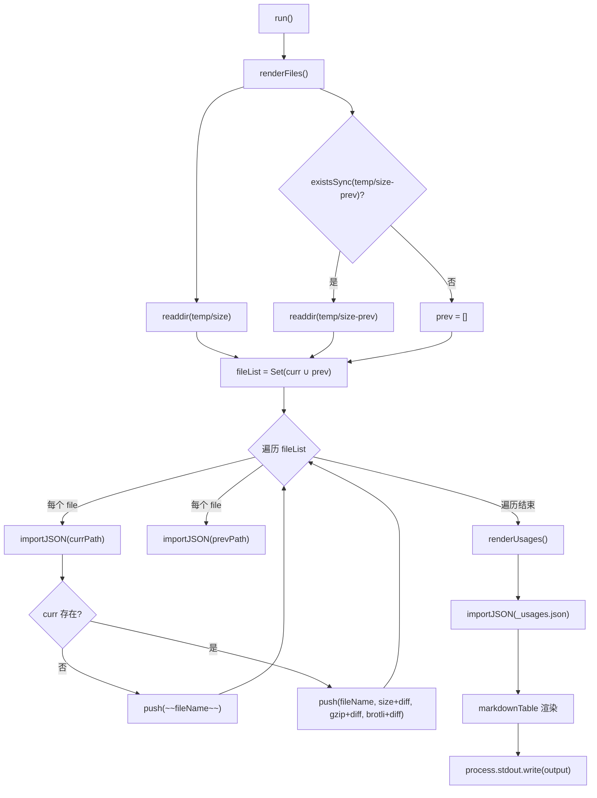
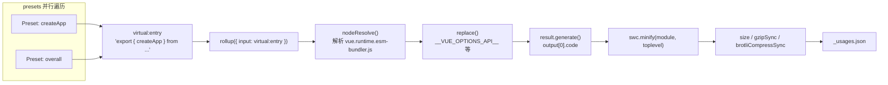

# Глава 11: Механизм бюджета размера: философия метрик size-report и usage-size

В предыдущей главе мы увидели, как Vue с помощью GitHub Actions превращает линтинг, проверку типов, тестирование и отслеживание размера в непреодолимый конвейер, где size-report.yml и size-data.yml отвечают за сохранение данных о размере после каждого изменения. Но конвейер лишь выполняет, а по-настоящему отвечают на вопросы «насколько больше, где больше» — два скрипта, которые мы разберём в этой главе. Основное противоречие бюджета размера заключается в том, что размер пакета — это метрика, которую можно только ощутить, но трудно точно атрибутировать. Когда пользователи жалуются, что «Vue слишком большой», мейнтейнерам нужно ответить на три вопроса — насколько больше? где больше? стало ли от этого изменения ещё больше? scripts/size-report.js отвечает за сравнение, scripts/usage-size.js — за атрибуцию, вместе они образуют философию измерения бюджета размера.

# 11.1 size-report: превращаем разницу в размере в читаемую Markdown-таблицу

## Интуитивная модель

Представьте, что вы контролёр качества в логистической компании. Каждую посылку (артефакт сборки) перед отправкой нужно взвесить, и ваша работа — не само взвешивание, а размещение «сегодняшнего веса» и «вчерашнего веса» рядом в одной таблице, с выделением жирным`+2.3 kB`тех посылок, которые стали тяжелее. Без этой сравнительной таблицы мейнтейнер видит лишь набор изолированных чисел и не может определить, внёс ли какой-то PR регрессию по размеру.

`size-report.js`— это и есть тот контролёр. Он не создаёт данные о размере (это дело`usage-size.js`и скриптов сборки), он лишь потребляет JSON-файлы из двух директорий и генерирует Markdown-отчёт.

## Структура данных и соглашения о директориях

Основные соглашения скрипта скрыты в двух константах. Текущая директория данных —`temp/size`, директория исторической базовой линии —`temp/size-prev`。

[FACT:scripts/size-report.js:23-24]

Эти имена директорий не случайны:`temp/size`генерируется`size-data.yml`workflow при каждом запуске и загружается как артефакт[FACT:.github/workflows/size-data.yml:53-57], а`temp/size-prev`получается`size-report.yml`после извлечения базового артефакта. Само имя директории является контрактом потока данных.

Скрипт определяет три псевдонима типов, которые точно описывают структуру JSON-файлов:

[FACT:scripts/size-report.js:8-21]

`SizeResult`имеет три числовых поля:`size`(несжатый),`gzip`、`brotli`。`BundleResult`добавляет к этому`file`поле для отображения имени файла.`UsageResult`же является`Record`, где ключ — имя preset, значение —`SizeResult & { name: string }`— обратите внимание на дополнительное`name`поле, потому что ключи JSON-объекта теряются после`Object.values`, поэтому имя необходимо избыточно сохранить в значении.

## Step-by-Step Walkthrough

Основной поток минимален: всего два шага и один вывод:

[FACT:scripts/size-report.js:23-38]

`run()`сначала вызывается`renderFiles()`для отрисовки таблицы файлов артефактов, затем`renderUsages()`для отрисовки таблицы сценариев использования, и наконец строка, накопленная в модульной переменной`output`, записывается в stdout за один раз[FACT:scripts/size-report.js:25]. Такой паттерн «накопить строку и вывести за один раз» избегает многократных затрат на конкатенацию`process.stdout.write`и делает порядок вывода полностью контролируемым.

**Шаг первый: собрать список файлов и найти объединение.**

[FACT:scripts/size-report.js:44-49]

`filterFiles`Отфильтровываются два типа файлов: начинающиеся с`_`(например,`_usages.json`) и заканчивающиеся на`.txt`(например,`number.txt`、`base.txt`). Эти два типа файлов — метаданные, а не данные о размере. Затем берётся объединение имён файлов текущей и исторической директорий`fileList`— с использованием`Set`для дедупликации. Зачем нужно объединение? Потому что файл может существовать только в исторической директории (в этой сборке артефакт был удалён) или только в текущей директории (в этой сборке артефакт был добавлен). Оба случая должны быть отражены в отчёте.

**Шаг второй: попарное сравнение по файлам.**

[FACT:scripts/size-report.js:43-75]

Для каждого файла из объединения предпринимается попытка импорта JSON из обеих директорий.`importJSON`реализация

[FACT:scripts/size-report.js:112-115]

— «если файл не существует, вернуть undefined»:`import()`Здесь используется динамический`with: { type: 'json' }`в сочетании с`fs.readFileSync` + `JSON.parse`import assertion, а не`import()`. Первый обрабатывается загрузчиком модулей Node, второй требует ручной обработки ошибок кодировки и парсинга. Цена выбора`renderFiles`— возврат Promise, поэтому весь

является async.`if (!curr)`Ключевое ветвление в`~~fileName~~`: если в текущей директории нет этого файла, значит артефакт был удалён, и используется синтаксис зачёркивания Markdown[FACT:scripts/size-report.js:60-61]для пометки`getDiff`. Иначе строка отрисовывается нормально, и к каждому числу добавляется результат

**.**

[FACT:scripts/size-report.js:124-130]

`getDiff`Шаг третий: вычисление разницы.`prev === undefined`имеет три точки раннего возврата:`diff === 0`возвращает пустую строку (нет базовой линии, сравнение невозможно);`prettyBytes(diff)`возвращает пустую строку (нет изменений, не показываем шум); иначе возвращается жирная разница со знаком. Обратите внимание, что`-1.2 kB`корректно обрабатывает отрицательные числа и выводит`sign`, а переменная`+`。

**добавляет**

[FACT:scripts/size-report.js:80-103]

`renderUsages`только для положительных чисел.`renderFiles`Шаг четвёртый: отрисовка таблицы usage.`_usages.json`Структурное различие между`Object.values(curr)`и`prev?.[usage.name]`заслуживает внимания: он напрямую импортирует`name`, потому что данные usage всегда находятся в этом одном файле.`.filter(usage => !!usage)`преобразует Record в массив, затем через`map`ищет исторические данные по имени — именно поэтому

поле хранится избыточно.`markdown-table`Эта строка фактически избыточна, потому что[FACT:scripts/size-report.js:72-74]。


```

## Наконец, с помощью библиотеки

> **[Design Inference & Architectural Trade-offs]**
> **Копировать`import()`Размышления о дизайне и подводные камни`readFileSync`？**〔Дизайнерские выводы и архитектурные компромиссы〕`import()`Почему используется

**`filterFiles`, а не`file[0] !== '_'`динамический**import assertion для JSON — стандартный подход в Node 20+, он естественно обрабатывает загрузку JSON в среде ESM. Цена — невозможность использования в синхронном контексте, и каждый импорт кэшируется модулем — но в этом одноразовом скрипте кэш не проблема.`readdir`проверка`file[0]`.`undefined`，`undefined !== '_'`Эта проверка предполагает, что имя файла не пустое. Если

**Обработка удалённых артефактов.**Когда артефакт удалён, в отчёте он помечается зачёркиванием, а не удаляется полностью. Это сделано намеренно: мейнтейнеры должны видеть «этот файл исчез», а не позволять ему молча пропасть из таблицы. Если просто отфильтровать его, читатель ошибочно решит, что артефакт никогда не существовал.

# 11.2 usage-size: моделирование сценария внедрения реальным пользователем

## Интуитивная модель

`size-report`Сообщает вам «насколько велик полный пакет», но это не отвечает на вопрос, который действительно волнует пользователя: «Я использую только`createApp`, сколько кода мне реально придётся скачать?» Объём полного пакета включает множество кода, который вы, возможно, никогда не используете (например,`defineCustomElement`、`Transition`、`KeepAlive`）。`usage-size.js`Роль — сыграть «типичного пользователя»: написать виртуальный входной файл, который импортирует только определённый API, собрать его через Rollup и посмотреть, насколько велик итоговый артефакт.

Это как если бы ресторан не говорил вам «общий вес всех продуктов на кухне — 50 кг», а говорил «при заказе одной порции курицы гунбао реально используется 300 граммов продуктов».

## Структура данных: массив Preset

Ядро скрипта — массив`presets`, каждый элемент описывает один сценарий использования:

[FACT:scripts/usage-size.js:27-55]

`Preset`Тип имеет три поля:`name`(отображаемое имя),`imports`(список API, импортируемых из Vue), опциональный`replace`(дополнительные замены на этапе компиляции). Пять preset'ов покрывают сценарии от минимального до максимального:

- `createApp (CAPI only)`: импортирует только`createApp`, и заменяет`__VUE_OPTIONS_API__`на`'false'`, моделируя пользователя чистого Composition API[FACT:scripts/usage-size.js:35-40]
- `createApp`: импортирует только`createApp`, сохраняя Options API[FACT:scripts/usage-size.js:35-40]
- `createSSRApp`: сценарий SSR[FACT:scripts/usage-size.js:35-40]
- `defineCustomElement`: сценарий Web Components[FACT:scripts/usage-size.js:35-40]
- `overall`: импортирует шесть ключевых API, моделируя «полнофункционального» пользователя[FACT:scripts/usage-size.js:44-54]

Входной файл фиксирован как runtime-only артефакт esm-bundler:

[FACT:scripts/usage-size.js:24-28]

Выбор`vue.runtime.esm-bundler.js`вместо полной версии`vue.esm-bundler.js`, потому что runtime-версия не содержит компилятор шаблонов и ближе к реальной ситуации современных пользователей сборщиков — они используют SFC для предварительной компиляции шаблонов и не нуждаются в runtime-компиляторе.

## Step-by-Step Walkthrough

**Шаг первый: параллельная генерация bundle для всех preset'ов.**

[FACT:scripts/usage-size.js:62-69]

`main()`Для каждого preset'а создаётся Promise`generateBundle`, выполняемый параллельно через`Promise.all`. Здесь параллелизм безопасен, потому что каждый`generateBundle`вызывает независимый`rollup()`, не разделяя состояние.

**Шаг второй: построение виртуального входа.**

[FACT:scripts/usage-size.js:94-96]

Это самая изящная часть всего скрипта. Он не пишет временный файл на диск, а конструирует виртуальный ID модуля`virtual:entry`, содержимое которого — оператор re-export:`export { createApp } from '/absolute/path/to/vue.runtime.esm-bundler.js'`. Обратите внимание,`entry`— абсолютный путь, потому что Rollup должен уметь его разрешить.

**Шаг третий: настройка цепочки плагинов Rollup.**

[FACT:scripts/usage-size.js:98-121]

Порядок массива плагинов критически важен:

1. **Пользовательский`usage-size-plugin`**：`resolveId`перехватывает`virtual:entry`и возвращает сам себя,`load`возвращает виртуальное содержимое[FACT:scripts/usage-size.js:101-110]. Это стандартный паттерн виртуальных модулей Rollup.

2. **`nodeResolve()`**: разрешает import внутри`vue.runtime.esm-bundler.js`[FACT:scripts/usage-size.js:111]。

3. **`replace`**: внедряет константы времени компиляции[FACT:scripts/usage-size.js:112-119]。

`replace`Конфигурация плагина раскрывает ключевой механизм артефакта esm-bundler: он сохраняет runtime-флаги вроде`__VUE_OPTIONS_API__`、`__VUE_PROD_DEVTOOLS__`, которые заменяются сборщиком пользователя. Здесь скрипт выполняет замену за пользователя:

- `process.env.NODE_ENV` → `"production"`: идёт по production-ветке
- `__VUE_PROD_DEVTOOLS__` → `'false'`: отключает поддержку devtools
- `__VUE_PROD_HYDRATION_MISMATCH_DETAILS__` → `'false'`: отключает подробные сообщения об ошибках гидратации
- `__VUE_OPTIONS_API__` → `'true'`: по умолчанию сохраняет Options API

Затем разворачивает`...preset.replace`, позволяя preset'у переопределить значения по умолчанию.`createApp (CAPI only)`Preset`__VUE_OPTIONS_API__`как раз использует этот механизм, чтобы изменить`'false'` [FACT:scripts/usage-size.js:35-40]。

`preventAssignment: true`на`obj.process.env.NODE_ENV = x`Предотвращает замену присваиваний вроде[FACT:scripts/usage-size.js:117]。

****

[FACT:scripts/usage-size.js:123-134]

`result.generate({})`Шаг четвёртый: генерация, минификация, измерение.`output[0].code`создаёт код, берётся

[FACT:scripts/usage-size.js:125-130]

`module: true`. Затем минифицируется через SWC:`toplevel: true`означает, что вход — ESM,`minified.length`позволяет минифицировать имена переменных верхнего уровня. После минификации вычисляются три метрики:`gzipSync(minified).length`、`brotliCompressSync(minified).length`。

(длина в байтах),`node:zlib`Обратите внимание, здесь используется синхронный API

**, а не асинхронная версия. В одноразовом скрипте синхронный API проще, и сама минификация — операция, нагружающая CPU, асинхронность не даст выигрыша в параллелизме.**

[FACT:scripts/usage-size.js:62-86]

Шаг пятый: вывод и сохранение.`pico`Результаты сначала выводятся в консоль в человекочитаемом формате, с раскраской через[FACT:scripts/usage-size.js:62-86]. Затем записываются в`temp/size/_usages.json`, с помощью`Object.fromEntries`массив преобразуется обратно в Record, ключ — имя preset'а[FACT:scripts/usage-size.js:81-85]。

`--write`Флаг управляет тем, записывать ли дополнительно несжатый bundle каждого preset'а на диск[FACT:scripts/usage-size.js:136-138], для отладки.



## Размышления о дизайне и подводные камни

> **[Design Inference & Architectural Trade-offs]**
> **Почему виртуальный модуль, а не временный файл?**Временные файлы требуют обработки путей, очистки, конфликтов параллельной записи. Виртуальный модуль хранит содержимое входа в памяти, и хук`resolveId`/`load`Rollup естественно поддерживает этот паттерн. Цена — необходимость точного совпадения ID, любая опечатка приведёт к ошибке Rollup «не удалось разрешить вход».

**`replace`Ловушка`preventAssignment`в**Если не установить`preventAssignment: true`，`replace`, плагин выполнит замену и для присваиваний вроде`process.env.NODE_ENV = 'x'`, что приведёт к синтаксической ошибке`"production" = 'x'`. В исходном коде Vue действительно есть присваивания`process.env.NODE_ENV`(в тестовых утилитах), поэтому эта опция необходима.

**`__VUE_OPTIONS_API__`Выбор значения по умолчанию для**Скрипт устанавливает значение по умолчанию`'true'` [FACT:scripts/usage-size.js:116], а не`'false'`. Это консервативный выбор: если пользователь не настроит, Vue сохранит поддержку Options API.`createApp (CAPI only)`Preset`'false'`явно переопределяет на

**, демонстрируя выигрыш в объёме после отключения. Это сравнение само по себе — документация для пользователя: показать, «сколько можно сэкономить, отключив Options API».`Promise.all`Семантика отказа параллельного**Если сборка любого preset'а завершится неудачей,`Promise.all`немедленно отклонит, остальные текущие сборки не будут отменены (Rollup не предоставляет механизма отмены). В CI это означает, что одна неудача приведёт к потере вычислений других preset, но сам скрипт завершится с ненулевым кодом выхода, и CI сможет корректно это зафиксировать.

# 11.3 От данных к контролю: как CI использует эти отчёты

## Общая картина потока данных

Чтобы понять эти два скрипта, необходимо вернуть их в контекст CI-конвейера.`size-data.yml`запускается при push в main/minor или при PR`pnpm run size` [FACT:.github/workflows/size-data.yml:45], создаёт`temp/size`каталог, затем загружается как artifact[FACT:.github/workflows/size-data.yml:53-57]。

Для PR он дополнительно записывает два файла метаданных:

[FACT:.github/workflows/size-data.yml:47-51]

`number.txt`хранит номер PR,`base.txt`хранит имя целевой ветки. Эти два файла — именно те`size-report.js`в`filterFiles`, которые нужно отфильтровать`.txt`файлы[FACT:scripts/size-report.js:44-45]. Они существуют, чтобы downstream`size-report.yml`знал, «с какой базовой линией сравнивать».

## Получение и сравнение базовой линии

`size-report.yml`(подробно описано в предыдущей главе) рабочий процесс таков: скачать`size-data`artifact текущего PR, скачать artifact базовой линии целевой ветки, распаковать базовую линию в`temp/size-prev`, затем запустить`size-report.js`для генерации Markdown-отчёта и комментария к PR.

Здесь есть ключевое проектное ограничение:`size-report.js`сам не отвечает за получение базовой линии, он предполагает, что`temp/size-prev`уже существует. Если её нет,`existsSync(prevDir)`возвращает false,`prev`пустой массив[FACT:scripts/size-report.js:48], все diff становятся пустыми строками. Это изящная деградация: без базовой линии отчёт всё равно генерируется, просто не показывает различия.

## Логика определения контроля объёма

> **[Design Inference & Architectural Trade-offs]**
> Нужно развеять распространённое заблуждение:`size-report.js`сам не выполняет контроль. Он только генерирует отчёт, не возвращает код выхода, не устанавливает пороги. Настоящий контроль происходит на уровне`size-report.yml`workflow — он может содержать шаг, который парсит значения diff из отчёта и при превышении порога приводит к падению job.

У такого разделения «измерения и определения» есть глубокие причины: скрипт измерения должен оставаться чистым и отвечать только за производство фактов; логика определения должна находиться на уровне workflow, поскольку пороги могут меняться в зависимости от версии, ветки, этапа релиза. Жёсткое кодирование порогов в`size-report.js`сделало бы его трудно переиспользуемым.

# Размышления о дизайне

**Почему для бюджета объёма нужны две системы измерений?**Полный объём пакета и объём usage отвечают на разные вопросы. Полный объём пакета — это «верхняя граница»: он говорит, сколько пользователю придётся скачать в худшем случае. Объём usage — это «типичное значение»: он говорит, сколько скачивает большинство пользователей на практике. Только вместе они дают полную картину объёма. Если бы был только полный объём пакета, мейнтейнеры склонялись бы к чрезмерной оптимизации редких API; если бы был только объём usage, можно было бы упустить взрывной рост объёма в некоторых краевых сценариях.

**Смысл двойных метрик gzip и brotli.**Современные CDN повсеместно поддерживают brotli, но не во всех сценариях он включён. Одновременный отчёт по обоим позволяет мейнтейнерам оценить, «каков объём в среде, где поддерживается только gzip». brotli обычно на 15-20% меньше gzip, и эта разница сама по себе является ценной информацией.

**Контракт стабильности формата данных.** `size-report.js`и`usage-size.js`развязаны через JSON-файлы.`usage-size.js`пишет`_usages.json`，`size-report.js`читает его. Имена полей этого контракта (`name`、`size`、`gzip`、`brotli`) неявны, нет валидации схемы. Если`usage-size.js`изменит имена полей и забудет синхронизировать`size-report.js`, отчёт будет молча показывать неверные данные. Это слабое место текущего дизайна.

# Резюме главы

# Вопросы для размышления и самопроверки к этой главе

Q1: `size-report.js`в`filterFiles`отфильтровывает файлы, начинающиеся с`_`. Если`usage-size.js`переименует выходной файл из`_usages.json`в`usages.json`, что произойдёт?

**Справочный разбор**：`filterFiles`условие фильтрации —`file[0] !== '_' && !file.endsWith('.txt')` [FACT:scripts/size-report.js:44-45]. Если файл переименован в`usages.json`, он больше не начинается с`_`, будет сохранён`filterFiles`, попадёт в`fileList`объединение. Затем`renderFiles`попытается обработать его как bundle-файл:`importJSON`сможет успешно импортировать (это валидный JSON), но его структура —`Record<string, UsageResult>`а не`BundleResult`, поэтому`curr?.file`будет`undefined`，`fileName`пустой строкой,`curr.size`также`undefined`，`prettyBytes(undefined)`выбросит ошибку или выдаст аномалию. Это приведёт к сбою генерации отчёта. Корень проблемы в том, что`filterFiles`использует префикс имени файла как критерий различения «метаданные vs данные», а не структуру каталогов или явный манифест. Более надёжный подход — поместить usage-данные в подкаталог или вести явный список файлов метаданных.

Q2: `usage-size.js`в`Promise.all(tasks)`параллельно выполняет сборку всех preset. Если в конфигурации`replace`какого-то preset пропущен`__VUE_OPTIONS_API__`, что произойдёт? Почему значение по умолчанию установлено в`'true'`а не`'false'`？

**Справочный разбор**：`replace`В конфигурации плагина`__VUE_OPTIONS_API__: 'true'`является значением по умолчанию, затем раскрытие`...preset.replace`позволяет переопределить[FACT:scripts/usage-size.js:116-118]. Если какой-то preset пропустил конфигурацию, он использует значение по умолчанию`'true'`, то есть сохраняет поддержку Options API, и объём будет больше. Значение по умолчанию`'true'`— консервативный выбор: оно отражает «фактическое поведение при отсутствии конфигурации пользователя». В esm-bundler-сборке Vue`__VUE_OPTIONS_API__`по умолчанию сохраняет Options API (если пользователь явно не отключил). Если бы значение по умолчанию было`'false'`, все preset без явной конфигурации показывали бы заниженный объём, вводя пользователей в заблуждение, будто «без конфигурации можно сэкономить объём».`createApp (CAPI only)`preset явно установлен в`'false'` [FACT:scripts/usage-size.js:35-40], именно чтобы продемонстрировать «выгоду от явного отключения» в контрасте со значением по умолчанию.

Q3: `size-report.js`в`importJSON`использует динамический`import()`вместо`fs.readFileSync`. Если какой-то JSON-файл в каталоге`temp/size-prev`повреждён (невалидный JSON), чем будет отличаться поведение двух реализаций?

**Справочный разбор**: динамический`import()`при парсинге невалидного JSON выбросит`SyntaxError`, и эта ошибка не может быть перехвачена`importJSON`внутренней`existsSync`проверкой —`existsSync`Проверяется только существование файла, но не проверяется корректность содержимого[FACT:scripts/size-report.js:112-115]. Ошибка будет распространяться вверх до`renderFiles`, что приведёт к сбою генерации всего отчёта. Если использовать`fs.readFileSync` + `JSON.parse`, также будет выброшена ошибка, но можно внутри`importJSON`обернуть в try-catch и вернуть`undefined`для реализации изящной деградации. Текущая реализация выбирает распространение ошибки, неявно предполагая, что «JSON в artifact всегда корректен» — это предположение обычно справедливо в среде CI, поскольку файлы генерируются`usage-size.js`и сборочными скриптами. Однако при локальной отладке, если вручную изменить JSON-файл и повредить его, отчёт просто упадёт вместо пропуска этого файла. Это дизайнерский выбор «доверия к источнику данных».

---

Механизм бюджета размера решает проблемы «что измерять» и «как сравнивать», но он опирается на предпосылку: сами артефакты сборки воспроизводимы. Следующая глава перейдёт к минимальной песочнице отладки:`vite-debug`как запустить интерактивную среду разработки Vue с минимальной конфигурацией и как она взаимодействует с локальными артефактами сборки, образуя замкнутый цикл от изменения исходного кода до проверки во время выполнения.

На этом цикл измерения бюджета размера стал ясен: size-report.js с помощью сравнения каталогов отвечает на вопрос «насколько больше», usage-size.js с помощью виртуальных модулей имитирует реальные сценарии импорта и отвечает на вопрос «где больше», а решение о пороговом контроле остаётся на уровне рабочего процесса. Этот механизм превращает регрессию размера из расплывчатых жалоб в прослеживаемые данные. Но данные могут лишь сообщить о наличии проблемы; чтобы действительно локализовать и исправить её, нужна минимальная среда, способная быстро воспроизвести проблему. Следующая глава перейдёт к packages-private/vite-debug, чтобы посмотреть, как Vue с помощью Vite + SFC создаёт минималистичную песочницу отладки, превращая «минимальное воспроизведение на реальном исходном коде» в повседневную практику.
